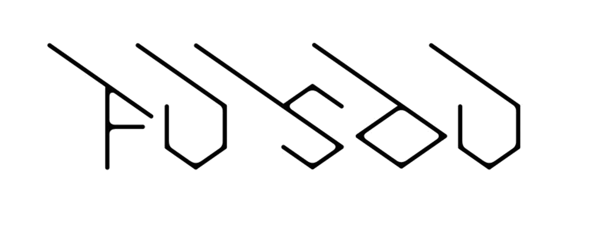

# FUSOU



[![DeepWiki](https://img.shields.io/badge/DeepWiki-tsukasa--u%2FFUSOU-blue.svg?logo=data:image/png;base64,iVBORw0KGgoAAAANSUhEUgAAACwAAAAyCAYAAAAnWDnqAAAAAXNSR0IArs4c6QAAA05JREFUaEPtmUtyEzEQhtWTQyQLHNak2AB7ZnyXZMEjXMGeK/AIi+QuHrMnbChYY7MIh8g01fJoopFb0uhhEqqcbWTp06/uv1saEDv4O3n3dV60RfP947Mm9/SQc0ICFQgzfc4CYZoTPAswgSJCCUJUnAAoRHOAUOcATwbmVLWdGoH//PB8mnKqScAhsD0kYP3j/Yt5LPQe2KvcXmGvRHcDnpxfL2zOYJ1mFwrryWTz0advv1Ut4CJgf5uhDuDj5eUcAUoahrdY/56ebRWeraTjMt/00Sh3UDtjgHtQNHwcRGOC98BJEAEymycmYcWwOprTgcB6VZ5JK5TAJ+fXGLBm3FDAmn6oPPjR4rKCAoJCal2eAiQp2x0vxTPB3ALO2CRkwmDy5WohzBDwSEFKRwPbknEggCPB/imwrycgxX2NzoMCHhPkDwqYMr9tRcP5qNrMZHkVnOjRMWwLCcr8ohBVb1OMjxLwGCvjTikrsBOiA6fNyCrm8V1rP93iVPpwaE+gO0SsWmPiXB+jikdf6SizrT5qKasx5j8ABbHpFTx+vFXp9EnYQmLx02h1QTTrl6eDqxLnGjporxl3NL3agEvXdT0WmEost648sQOYAeJS9Q7bfUVoMGnjo4AZdUMQku50McDcMWcBPvr0SzbTAFDfvJqwLzgxwATnCgnp4wDl6Aa+Ax283gghmj+vj7feE2KBBRMW3FzOpLOADl0Isb5587h/U4gGvkt5v60Z1VLG8BhYjbzRwyQZemwAd6cCR5/XFWLYZRIMpX39AR0tjaGGiGzLVyhse5C9RKC6ai42ppWPKiBagOvaYk8lO7DajerabOZP46Lby5wKjw1HCRx7p9sVMOWGzb/vA1hwiWc6jm3MvQDTogQkiqIhJV0nBQBTU+3okKCFDy9WwferkHjtxib7t3xIUQtHxnIwtx4mpg26/HfwVNVDb4oI9RHmx5WGelRVlrtiw43zboCLaxv46AZeB3IlTkwouebTr1y2NjSpHz68WNFjHvupy3q8TFn3Hos2IAk4Ju5dCo8B3wP7VPr/FGaKiG+T+v+TQqIrOqMTL1VdWV1DdmcbO8KXBz6esmYWYKPwDL5b5FA1a0hwapHiom0r/cKaoqr+27/XcrS5UwSMbQAAAABJRU5ErkJggg==)](https://deepwiki.com/tsukasa-u/FUSOU)<!-- DeepWiki badge generated by https://deepwiki.ryoppippi.com/ -->
[](https://tsukasa-u.github.io/FUSOU/app/index.html)
[](https://github.com/tsukasa-u/FUSOU/actions/workflows/export_doc.yml)
[](https://github.com/tsukasa-u/FUSOU/actions/workflows/check_build.yml)
[](https://app.fossa.com/projects/custom%2B52222%2Fgithub.com%2Ftsukasa-u%2FFUSOU?ref=badge_shield&issueType=license)
[](https://app.fossa.com/projects/custom%2B52222%2Fgithub.com%2Ftsukasa-u%2FFUSOU?ref=badge_shield&issueType=security)

[](https://opensource.org/licenses/MIT)

## Stacks

<p style="display: inline">
  
  
  
  
  
  
  
  
</p>

## What for? 何のために？

I want to use a minimal data viewer for playing Kancolle, so I decided to make one.
And finally, I want to analyze data such as detailed battle results to improve my war record and make my database. In the future, I want to analyze all the data gathered from all users.
Furthermore, I can't rely on the analyzed data because such data is a lot on the internet, and few of them can misanalyzed. I can't determine which is true.

ユーザーが通常のプレイで取得し得るデータのみで艦これを遊びたいため、自作しようと決意した。ゆくゆくは、集めたデータを解析し、戦績向上、自分のためのデータベースを構築しようと考えている。さらに、このアプリを多数の方が利用してくれるのであれば、全体のデータを用いた解析も考えている。さらに言えば、ネット上には情報が散乱しているように感じ(自分の調査不足ではある)、ソースの出どころやその情報自体が確かなのかがよくわからない。

## System Configuration システム構成

FUOSU-PROXY : <br>
&emsp; proxy http communication via proxy server<br>
&emsp; プロキシサーバを経由して http 通信を中継

FUSOU-APP : <br>
&emsp; A simple in-game data viewer<br>
&emsp; 簡易なゲーム内データ閲覧用

FUSOU-WEB : <br>
&emsp; Data viewer for analyzed data<br>
&emsp; 解析データ閲覧用

## Set up for Dev

### 1. install pnpm

On windows, using PowerShell

```
Invoke-WebRequest https://get.pnpm.io/install.ps1 -UseBasicParsing | Invoke-Expression
```

check the pnpm installation guide :
https://pnpm.io/installation

### 2. install rust

On windows, install rustup installer.
check https://forge.rust-lang.org/infra/other-installation-methods.html

### 3. install module

run on terminal

```
pnpm install
```

on Linux(Ubuntu), you have to install additional library

```
apt install libsoup-gnome2.4-dev libjavascriptcoregtk-4.0-dev libwebkit2gtk-4.0-dev
```

for v2, install library as tauri installation gaide and additionally install this library

```
apt install libayatana-appindicator3-dev
apt install  librsvg2-dev
```

### 4. launch tauri

run on terminal

```
cd "your-path-to-FUSOU"/FUSOU-APP
pnpm tuari dev
```

## My idea 考えていること

I think the in-game data such as parameters like hp and equipment and analyzed data we cannot access normally should be separated locally and online. This means you can only view data you can normally access in a game with a local app and can access data analyzed or not normally accessible by the website.

HP や装備などのユーザがアクセスできるパラメータと、普段はアクセスできない分析データなどのゲーム内データは、ローカルとオンラインで分離するほうが望ましいのではないかと考えている。ゲーム内で普段アクセスできるデータはローカルアプリでのみ表示し、ウェブサイトでは分析データや普段はアクセスできないデータにアクセスできるようなシステムを構築したい。

# In the Future 今後

I improve my App to be able to use for playing Kancolle. And then, add code for data analysis.

艦これをプレイすることができる状態まで開発を続けます。その後はデータ解析のプログラムをかく予定です。
