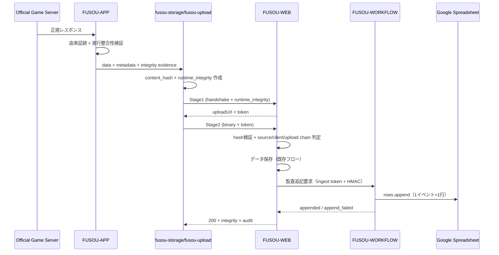

# Desktop Runtime Security Hardening 実装計画（固定運用・詳細版）

- 作成日: 2026-06-25
- 最終更新: 2026-06-26
- 対象: FUSOU-APP / fusou-storage / fusou-upload / FUSOU-WEB / FUSOU-WORKFLOW

## 0. 固定決定（変更しない）

この計画は次の固定決定のみで実装する。

1. trust 用 D1 テーブルは使わない。
2. 監査ログは Google Spreadsheet のみで管理する（R2/D1 バッファは使わない）。
3. 全アップロード API で保存成功時に Spreadsheet 追記を必ず試行する。
4. 監査専用 Queue/DLQ は使わない。
5. 監査閲覧はサーバー管理者の Google Drive/Spreadsheet 直接閲覧のみ。
6. FUSOU-WEB 既存閲覧ページで trust 表示/絞り込みを実装する（専用の新規 trust ダッシュボードは作らない）。

### 0.1 改訂方針（今回）

- 既存文書を全消去せず、差分修正で当初要求を明文化する。
- 当初要求: 「正しいゲームサーバー由来データ」を「改ざんされていないクライアント」で加工し、「改ざんされずに正規サーバー」へ送ることを最優先とする。
- そのため、trust は単なるラベル表示ではなく「検証済みデータを分離して扱うための判定」として定義する。

## 1. 目的と非目的

### 1.1 目的

- 正しいゲームサーバー由来データのみを「verified」として扱う。
- 正規クライアントで生成されたことを検証できる証跡を収集する。
- 正規サーバー到達までの改ざん耐性（再送・差し替え・中間者）を担保する。
- runtime 改ざん兆候を評価し、保存データに `trust_label/trust_score/reason_codes` を付与する。
- runtime 判定異常データは保存できても verified には昇格させない。
- 監査イベントを Spreadsheet へ安全に集約し、管理者が追跡可能にする。

### 1.2 非目的

- D1 上で trust を検索・集計する運用
- 管理者以外への監査情報提供
- 監査専用の新規公開ページ作成
- 改ざん疑いデータを verified データと同等に扱う運用

### 1.3 当初要求に対する保証境界

この計画が保証するのは次の 3 鎖である。

1. Source Chain: 公式ゲームサーバー由来であること
2. Client Chain: 正規アプリが改ざんされずに処理したこと
3. Upload Chain: 改ざんされずに正規 FUSOU サーバーへ到達したこと

この 3 鎖のどれかが欠ける場合、データは `verified` 扱いにしない。

## 2. 全体フロー



## 3. 対象アップロード面（全件 mandatory）

以下の全 endpoint で、保存成功時に Spreadsheet 追記要求を実施する。

| API path | 実装ファイル | 方式 | Spreadsheet 追記要求 |
| --- | --- | --- | --- |
| `/api/battle-data/upload` | `packages/FUSOU-WEB/src/server/routes/battle_data.ts` | Type A | 必須 |
| `/api/fleet/snapshot` | `packages/FUSOU-WEB/src/server/routes/fleet.ts` | Type A | 必須 |
| `/api/asset-sync/upload` | `packages/FUSOU-WEB/src/server/routes/assets.ts` | Type A | 必須 |
| `/api/master-data/upload` | `packages/FUSOU-WEB/src/server/routes/master_data.ts` | Type A | 必須 |
| `/api/quest-tree/ingest` | `packages/FUSOU-WEB/src/server/routes/quest_tree.ts` | Type B | 必須 |
| `/api/ship-growth/ingest` | `packages/FUSOU-WEB/src/server/routes/ship_growth.ts` | Type B | 必須 |
| `/api/soku-speed-observed/ingest` | `packages/FUSOU-WEB/src/server/routes/soku_speed_observed.ts` | Type B | 必須 |
| `/api/remodel-data/ingest` | `packages/FUSOU-WEB/src/server/routes/remodel_data.ts` | Type B | 必須 |

対象外（監査追記要求不要）:

- `/api/master-data/synergy-manifest*`
- `/api/auth/anonymous-sync/v2/*`

備考:

- 一覧は `packages/FUSOU-WEB/src/server/app.ts` の route mount と各 route の `/upload|/snapshot|/ingest` 定義に基づく。
- 将来 `/upload|/snapshot|/ingest` endpoint を追加した場合は、同時に Spreadsheet 追記対象へ追加する。

## 4. セキュリティ設計（改ざん防止）

### 4.1 upload 側の既存認証チェーンを維持

- JWT
- dataset token
- signed upload token（`X-Upload-Token`）

runtime 判定は non-blocking だが、プロトコル検証失敗（JWT無効、署名トークン無効、壊れたbody）は従来どおり 4xx/5xx を返す。

### 4.2 監査追記要求の真正性（新規）

FUSOU-WORKFLOW の内部 endpoint（例: `/internal/integrity-audit/append`）に対する監査追記要求は、次の 2 段階で認証する。

1. ingest token（知っているものだけが書ける）
2. 監査イベント本体の HMAC 署名

監査イベントの HMAC 署名項目:

- 署名ヘッダ/項目:
  - `audit_sig`
  - `audit_sig_alg = hmac-sha256`
  - `audit_kid`
  - `audit_ts_ms`
- 署名鍵:
  - `INTEGRITY_AUDIT_HMAC_KEYS_JSON`（`kid -> secret` keyring）
- canonical message:
  - 監査イベント本文を key ソート JSON で canonicalize して HMAC

WORKFLOW 側は次を満たすものだけを受理する。

1. ingest token 検証 OK
2. `audit_sig` 検証 OK
3. `audit_ts_ms` が許容ドリフト以内
4. schema が `integrity-audit-message-v1`

検証失敗は 403 を返し、Spreadsheet へは書かない。

### 4.3 Spreadsheet 書き込み権限

- Spreadsheet は service account と管理者アカウントのみ編集可能にする。
- link sharing は `restricted` 固定。
- 一般ユーザーへの共有を禁止する。

### 4.4 インフラ境界

- Spreadsheet API 呼び出しは FUSOU-WORKFLOW の内部監査 endpoint のみ。
- FUSOU-WEB（upload同期パス）から Spreadsheet API へ直接アクセスしない。
- 監査用途の Queue/DLQ/R2 バッファは使わない。

### 4.5 クライアント/ネットワーク/データ改ざん対策（実装詳細）

#### 4.5.1 攻撃者モデルと保証境界

| 区分 | 攻撃者能力 | 本計画の扱い |
| --- | --- | --- |
| T0 | 受動盗聴（通信閲覧のみ） | 防止対象 |
| T1 | 能動 MITM（改ざん/再送/差し替え） | 防止対象 |
| T2 | クライアント user 権限改ざん（debugger/hook/偽装） | 検知対象 |
| T3 | root/管理者権限改ざん（OS掌握） | 防止不可、監査追跡のみ |

信頼境界:

1. 信頼するのは FUSOU-WEB/FUSOU-WORKFLOW のサーバー検証ロジック、サーバー時刻、サーバー秘密鍵のみ。
2. クライアント送信値（`runtime_integrity` を含む）は未信頼入力として扱う。
3. client chain は `verified` を下げる用途にのみ使う。client chain 単独で `verified=true` へ昇格させない。

#### 4.5.2 クライアント改ざん対策（FUSOU-APP evidence）

1. `runtime_integrity.schema_version` は `runtime-integrity-v1` 固定。
2. `client_nonce` は UUIDv7 固定。Stage1 で KV replay store（prefix: `integrity:client-nonce:`）に 600 秒 TTL で one-time 消費し、再利用は `409 client_nonce_replay`。
3. `collected_at_ms` はサーバー受信時刻との差分が ±300000ms 以内。超過時は `client_clock_drift`。
4. 必須 signal ID:

- `proc.tracer_present`
- `runtime.hook_detected`
- `os.privilege_escalated`
- `binary.signature_valid`
- `binary.hash_match`
- `collector.self_hash_match`

1. hard flag（`proc.tracer_present=true`、`runtime.hook_detected=true`、`os.privilege_escalated=true`、`binary.signature_valid=false`、`binary.hash_match=false`）のいずれか成立時は `chain_status.client=suspicious` とし、`verified=false` を強制する。

#### 4.5.3 ネットワーク改ざん対策（Stage1/Stage2 + 監査送信）

1. Stage1 signed upload token へ以下 claim を必須束縛する。

- `upload_jti`（UUIDv7）
- `api_path`
- `http_method`（`POST` 固定）
- `dataset_id`
- `content_hash`
- `declared_size`
- `iat` / `nbf` / `exp`

1. Stage2 検証順序は固定。

- token 署名/kid
- `iat/nbf/exp`
- `api_path/http_method/dataset_id/content_hash/declared_size`
- `upload_jti` replay check
- body hash 再計算

1. `upload_jti` は KV replay store（prefix: `integrity:upload-jti:`）で one-time 消費し、再利用時は `409 replay_detected` を返す。
1. 監査 append 送信も `audit_jti` を必須とし、WORKFLOW 側で one-time 消費（prefix: `integrity:audit-jti:`）を行う。

#### 4.5.4 データ改ざん対策（payload + evidence）

1. `content_hash` 形式は `sha256:<64hex>` 固定。
2. hash 対象は Stage2 送信 raw bytes（圧縮後 bytes を送る場合はその bytes）とする。
3. サーバー再計算 hash 不一致時は `422 content_hash_mismatch`、`no-store`、`no-append`。
4. `evidence_hash` は `runtime_integrity` から `evidence_hash` と `evidence_sig_b64` を除外した payload を RFC8785 canonical JSON 化し、SHA-256 hex で計算する。
5. `evidence_sig_b64` は `Ed25519` 固定。署名対象は `RI1\n<evidence_hash>\n<client_nonce>\n<collected_at_ms>`。

#### 4.5.5 verified 判定への反映ルール

1. `verified` 判定は Source/Client/Upload chain と trust score で決める。
2. 監査 append 成否で `verified` は変更しない。
3. `runtime_integrity` 欠損・不正は保存継続でも `verified=false`。

#### 4.5.6 Source Chain 判定仕様（実装固定）

Source Chain の入力と判定手順を固定する。

入力:

- `dataset_token` 検証結果
- route ごとの既存 source 検証結果（period/table consistency, schema validation, domain invariants）
- `content_hash` サーバー再計算結果

判定手順:

1. `dataset_token` 不正/欠損 -> protocol invalid（4xx）で保存しない。
2. route 既存 source 検証が失敗 -> `chain_status.source=suspicious`、保存は route 既存方針に従う。
3. `content_hash` 不一致 -> protocol invalid（`422 content_hash_mismatch`）で保存しない。
4. 1-3 を全て通過したときのみ `chain_status.source=ok`。

reason_codes 付与:

- source 検証失敗: `source_validation_failed`
- stale period/table: `source_stale_period`
- schema/domain 不整合: `source_domain_invariant_failed`

### 4.6 trust 判定モデル（verified gate）

保存可否と信頼可否を分離する。

1. 保存可否

- プロトコル検証（JWT/dataset token/signed upload token）に成功した場合のみ保存する。

1. verified 可否

- 次の全条件を満たすときのみ `verified=true` とする。
  - Source Chain が成立
  - Client Chain が成立
  - Upload Chain が成立
  - `trust_score >= VERIFIED_MIN_SCORE`

1. 改ざん疑い時の扱い

- 保存は維持しても `verified=false`。
- 利用側（表示/集計/API）は verified で既定フィルタする。

## 5. データ契約

### 5.1 runtime_integrity 受信契約

配置:

- Type A: `handshake_body.runtime_integrity`
- Type B: handshake body root `runtime_integrity`

契約名: `runtime-integrity-v1`

必須フィールド（APP/WEB で同一名を使う）:

- `schema_version` (`runtime-integrity-v1`)
- `device_id` (string)
- `api_path` (string)
- `table` (string)
- `period_tag` (string)
- `dataset_id` (string)
- `content_hash` (`sha256:<64hex>`)
- `client_nonce` (UUIDv7)
- `collected_at_ms` (number)
- `signals[]` (array)
- `evidence_hash` (`<64hex>`)
- `evidence_sig_b64` (base64url)
- `evidence_kid` (string)

任意フィールド:

- `request_id`

`signals[]` の要素契約:

- `id` (string)
- `value` (boolean | number | string)
- `confidence` (number 0-100)
- `source` (string)

禁止事項:

- `source_chain_status/client_chain_status/upload_chain_status` はクライアント送信項目にしない。
- chain status はサーバーが算出し、レスポンス/監査イベントへ付与する。

### 5.1.1 evidence 署名検証

1. WEB は `INTEGRITY_EVIDENCE_PUBLIC_KEYS_JSON` から `evidence_kid` に対応する公開鍵を取得する。
2. `evidence_hash` の再計算値と受信値が不一致なら `runtime_integrity_invalid`。
3. `evidence_sig_b64` 検証失敗なら `evidence_sig_invalid`。
4. 2,3 は upload 保存を止めないが `chain_status.client=suspicious` かつ `verified=false` とする。

APP 側鍵契約:

1. APP は `INTEGRITY_EVIDENCE_PRIVATE_KEYS_JSON`（`kid -> ed25519 private key`）から current kid を選択して署名する。
2. `evidence_kid` は WEB の `INTEGRITY_EVIDENCE_PUBLIC_KEYS_JSON` と一致している必要がある。
3. evidence 鍵ローテーションは current/previous の 24 時間 overlap で実施する。

### 5.2 upload 成功レスポンス契約

```json
{
  "status": "stored",
  "integrity": {
    "trust_label": "high|review|low|unknown",
    "trust_score": 0,
    "reason_codes": [],
    "verified": false,
    "chain_status": {
      "source": "ok|suspicious|missing",
      "client": "ok|suspicious|missing",
      "upload": "ok|suspicious|missing"
    }
  },
  "audit": {
    "append_status": "appended|append_failed|deduped"
  }
}
```

`verified=true` の条件は 4.6 に従う。

### 5.3 監査イベント契約（Append Request）

HTTP headers（必須）:

- `X-Integrity-Audit-Token: <INTEGRITY_AUDIT_INGEST_TOKEN>`
- `X-Audit-Sig-Alg: hmac-sha256`
- `X-Audit-Kid: <kid>`
- `X-Audit-Ts-Ms: <unix_ms>`
- `X-Audit-Jti: <uuidv7>`
- `X-Audit-Sig: <base64url_hmac>`

Body schema:

```json
{
  "schema": "integrity-audit-message-v1",
  "event": {
    "audit_event_id": "sha256(upload_jti|api_path|dataset_id|data_hash)",
    "uploaded_at_ms": 0,
    "upload_jti": "",
    "api_path": "",
    "dataset_id": "",
    "table_name": "",
    "period_tag": "",
    "data_hash": "",
    "trust_label": "high|review|low|unknown",
    "trust_score": 0,
    "reason_codes": [],
    "verified": false,
    "chain_status_source": "ok|suspicious|missing",
    "chain_status_client": "ok|suspicious|missing",
    "chain_status_upload": "ok|suspicious|missing",
    "evidence_hash": "",
    "request_id": ""
  }
}
```

署名文字列（固定）:

1. `event` を RFC8785 canonical JSON 化する。
2. `event_hash = sha256_hex(canonical_event)`。
3. `string_to_sign = X-Audit-Ts-Ms + "." + X-Audit-Jti + "." + event_hash`。
4. `X-Audit-Sig = base64url(HMAC_SHA256(secret_for_kid, string_to_sign))`。

検証ルール:

1. `abs(now_ms - X-Audit-Ts-Ms) <= MAX_CLOCK_DRIFT_MS`。
2. `X-Audit-Jti` replay check を通過（one-time）。
3. `audit_event_id` が既存なら `deduped` を返して追記しない。

### 5.4 永続化契約（verified 既定フィルタを成立させる）

1. trust 専用 D1 テーブルは作らない。
1. 各 upload 保存レコードに `integrity_json` を付与し、次を最低限含める。

- `trust_label`
- `trust_score`
- `reason_codes`
- `verified`
- `chain_status_source`
- `chain_status_client`
- `chain_status_upload`
- `upload_jti`

1. 一覧/集計 API の既定条件は `verified=true`。
1. suspicious データ表示は明示フィルタ（`all` または `suspicious only`）でのみ露出する。

## 6. Spreadsheet 契約

### 6.1 追記先

- Spreadsheet ID: `INTEGRITY_AUDIT_SPREADSHEET_ID`
- Worksheet: `INTEGRITY_AUDIT_WORKSHEET_NAME`（既定: `runtime_integrity_log`）

### 6.2 列定義

1. `bucket_hour`
2. `uploaded_at_ms`
3. `upload_jti`
4. `api_path`
5. `dataset_id`
6. `table_name`
7. `period_tag`
8. `data_hash`
9. `trust_label`
10. `trust_score`
11. `reason_codes_json`
12. `verified`
13. `chain_status_source`
14. `chain_status_client`
15. `chain_status_upload`
16. `evidence_hash`
17. `request_id`
18. `audit_kid`
19. `audit_ts_ms`

### 6.2.1 列算出規則

1. `bucket_hour`: `uploaded_at_ms` を UTC 時間で切り捨てた `YYYY-MM-DDTHH:00:00Z`。
2. `uploaded_at_ms`: WEB の Stage2 受信確定時刻。
3. `data_hash`: Stage2 受信 bytes をサーバー再計算した `sha256:<64hex>`。
4. `reason_codes_json`: 配列を JSON 文字列化（順序保持）。

### 6.3 append 方針

- 監査は append-only（全イベント記録優先）。
- `audit_event_id` を冪等キーとして扱い、同一キーは `deduped` 応答で新規行を作成しない。
- `upload_jti` は追跡キーとして必須保持する。

### 6.4 書き込み手順（固定）

1. upload route で保存成功後に監査イベントを生成する。
2. FUSOU-WEB が FUSOU-WORKFLOW 内部 endpoint へ監査追記要求を送る。
3. FUSOU-WORKFLOW が ingest token + HMAC + schema + 時刻ドリフトを検証する。
4. 検証成功時のみ Sheets API `spreadsheets.values.append` で 1 行追記する。
5. WEB は `append_status` をレスポンスへ含める。
6. 追記失敗時は upload 自体は継続し、`reason_codes` に `audit_append_failed` を付与する。

### 6.5 Retry/Timeout 規約

1. WEB -> WORKFLOW

- timeout: 2000ms
- retry: 0 回（同期 upload 遅延を抑制）

1. WORKFLOW -> Sheets

- timeout: 5000ms
- retry 対象: `429`, `5xx`, ネットワーク失敗
- retry 非対象: `400`, `401`, `403`
- retry 回数: 最大 3 回
- backoff: `200ms`, `500ms`, `1000ms`

1. 最終失敗時は `append_failed` を返し、`integrity_audit_append_failed_total` を加算する。

## 7. 必須シークレット / 環境変数

### 7.1 Secrets（必須）

- `INTEGRITY_GDRIVE_SERVICE_ACCOUNT_JSON`
  - Google API service account credential JSON
- `INTEGRITY_AUDIT_INGEST_TOKEN`
  - FUSOU-WEB から Workflow 監査 endpoint を呼び出すための共通トークン
- `INTEGRITY_AUDIT_HMAC_KEYS_JSON`
  - `kid -> secret` の keyring（current/previous 併存）
- `INTEGRITY_EVIDENCE_PRIVATE_KEYS_JSON`
  - APP が evidence 署名に使う `kid -> ed25519 private key`

### 7.2 Environment Variables（必須・最小）

- `INTEGRITY_AUDIT_SPREADSHEET_ID`
- `INTEGRITY_AUDIT_WORKSHEET_NAME`（既定: `runtime_integrity_log`）
- `INTEGRITY_AUDIT_WORKFLOW_URL`
- `INTEGRITY_AUDIT_ACTIVE_KID`（監査署名に使う current kid）
- `INTEGRITY_EVIDENCE_PUBLIC_KEYS_JSON`（`kid -> ed25519 public key` の JSON）

### 7.3 コード定数（集中管理）

Secret ではない閾値・TTL・retry は環境変数ではなくコード定数として集中管理する。

- `packages/FUSOU-WEB/src/server/utils/runtime-integrity-constants.ts`
- `packages/FUSOU-WORKFLOW/src/integrity_audit_constants.ts`

定数化対象:

- trust score 閾値（review/low）
- verified 最小スコア（`VERIFIED_MIN_SCORE`）
- hard flag confidence
- nonce TTL
- timestamp drift 許容秒
- Spreadsheet append retry 回数/timeout

### 7.3.1 固定定数値

- `VERIFIED_MIN_SCORE = 80`
- `REVIEW_THRESHOLD = 50`
- `LOW_THRESHOLD = 1`
- `MAX_CLOCK_DRIFT_MS = 300000`
- `UPLOAD_JTI_TTL_SEC = 900`
- `AUDIT_JTI_TTL_SEC = 900`

trust score 計算式:

1. 初期値 `score = 100`
2. chain status が `suspicious` ごとに `-35`
3. chain status が `missing` ごとに `-60`
4. hard flag が 1 つでもあれば `verified=false` を強制
5. `score` は `0..100` に clamp

### 7.4 定義しないもの

- trust API 用の環境変数
- D1 trust テーブル用の環境変数
- 監査 Queue/DLQ/R2 バッファ用の環境変数

例外（運用 kill switch として許可）:

- `INTEGRITY_RUNTIME_KILL_SWITCH`
- `INTEGRITY_AUDIT_APPEND_KILL_SWITCH`

## 8. 実装手順（順序固定）

1. FUSOU-APP で runtime evidence builder 実装
2. fusou-storage/fusou-upload で handshake に runtime_integrity 注入
3. FUSOU-WEB 共通 utils（parse/hash/signature/scoring）実装
4. 8 upload endpoint 全てに runtime 判定組込
5. 8 upload endpoint 全てに監査追記要求組込（保存成功時に必ず試行）
6. FUSOU-WEB で監査イベント HMAC 署名生成組込
7. FUSOU-WORKFLOW で内部監査 endpoint 実装（ingest token + HMAC + drift 検証）
8. FUSOU-WORKFLOW で Spreadsheet 1行追記実装
9. FUSOU-WEB の既存閲覧 UI へ trust 表示/絞り込みを追加
10. 管理者限定共有設定（restricted）を運用手順化
11. テスト実装・実行

## 9. 変更対象ファイル

### 9.1 FUSOU-APP / storage

- `packages/FUSOU-APP/src-tauri/src/security/runtime_integrity/mod.rs`（新規）
- `packages/FUSOU-APP/src-tauri/src/security/runtime_integrity/types.rs`（新規）
- `packages/FUSOU-APP/src-tauri/src/security/runtime_integrity/evidence.rs`（新規）
- `packages/FUSOU-APP/src-tauri/src/security/runtime_integrity/collector_linux.rs`（新規）
- `packages/FUSOU-APP/src-tauri/src/security/runtime_integrity/collector_windows.rs`（新規）
- `packages/FUSOU-APP/src-tauri/src/security/runtime_integrity/collector_macos.rs`（新規）
- `packages/FUSOU-APP/src-tauri/src/storage/mod.rs`
- `packages/FUSOU-APP/src-tauri/src/lib.rs`
- `packages/FUSOU-APP/src-tauri/src/storage/retry_handler.rs`
- `packages/fusou-storage/src/runtime_hooks.rs`
- `packages/fusou-storage/src/lib.rs`
- `packages/fusou-storage/src/providers/r2/provider.rs`
- `packages/fusou-upload/src/uploader.rs`

### 9.2 FUSOU-WEB

- `packages/FUSOU-WEB/src/server/utils/runtime-integrity.ts`
- `packages/FUSOU-WEB/src/server/utils/runtime-policy.ts`
- `packages/FUSOU-WEB/src/server/utils/upload.ts`
- `packages/FUSOU-WEB/src/server/routes/battle_data.ts`
- `packages/FUSOU-WEB/src/server/routes/fleet.ts`
- `packages/FUSOU-WEB/src/server/routes/assets.ts`
- `packages/FUSOU-WEB/src/server/routes/master_data.ts`
- `packages/FUSOU-WEB/src/server/routes/quest_tree.ts`
- `packages/FUSOU-WEB/src/server/routes/ship_growth.ts`
- `packages/FUSOU-WEB/src/server/routes/soku_speed_observed.ts`
- `packages/FUSOU-WEB/src/server/routes/remodel_data.ts`
- `packages/FUSOU-WEB/src/server/error-codes.ts`
- `packages/FUSOU-WEB/src/server/types.ts`
- `packages/FUSOU-WEB/src/server/utils.ts`
- `packages/FUSOU-WEB/src/components/features/battles/solid/BattlesDashboard.tsx`
- `packages/FUSOU-WEB/src/components/features/ship-growth/solid/ShipGrowthPanel.tsx`
- `packages/FUSOU-WEB/src/components/features/quests/solid/QuestTreePanel.tsx`
- `packages/FUSOU-WEB/wrangler.toml`

### 9.3 FUSOU-WORKFLOW

- `packages/FUSOU-WORKFLOW/src/integrity_audit_sheet_writer.ts`（新規）
- `packages/FUSOU-WORKFLOW/src/integrity_audit_append_route.ts`（新規）
- `packages/FUSOU-WORKFLOW/src/index.ts`
- `packages/FUSOU-WORKFLOW/wrangler.toml`

## 10. テスト計画

### 10.1 Rust

```bash
cargo test --manifest-path packages/FUSOU-APP/src-tauri/Cargo.toml
cargo test --manifest-path packages/fusou-storage/Cargo.toml
```

### 10.2 Web

```bash
pnpm --dir packages/FUSOU-WEB exec vitest run src/server/utils/__tests__/runtime-integrity.test.ts
pnpm --dir packages/FUSOU-WEB exec vitest run src/server/routes/__tests__/battle_data.runtime-integrity.test.ts
pnpm --dir packages/FUSOU-WEB exec vitest run src/server/routes/__tests__/fleet.runtime-integrity.test.ts
pnpm --dir packages/FUSOU-WEB exec vitest run src/server/routes/__tests__/ingest.runtime-integrity.test.ts
```

### 10.2.1 Workflow append route tests

```bash
pnpm --dir packages/FUSOU-WORKFLOW exec vitest run src/__tests__/integrity_audit_append_route.test.ts
pnpm --dir packages/FUSOU-WORKFLOW exec vitest run src/__tests__/integrity_audit_sheet_writer.test.ts
```

固定ケース:

1. ingest token 不正 -> `403`, row 増分 `0`
2. HMAC 改ざん -> `403`, row 増分 `0`
3. replay (`X-Audit-Jti` 再利用) -> `409`, row 増分 `0`
4. 正常イベント -> `200`, row 増分 `1`

追加必須テスト:

- 8 endpoint すべてで「保存成功時に Spreadsheet 追記要求を1回試行」を検証
- ingest token 不正/欠損時に Workflow が reject すること
- HMAC 不正イベントが Workflow で reject されること
- trust 表示/絞り込みが既存閲覧 UI（battles/ship-growth/quests）で動作すること

### 10.3 Repo checks

```bash
pnpm --dir packages/FUSOU-WEB run astro check
pnpm --dir packages/FUSOU-WEB run e2e:simulator:smoke
```

### 10.4 固定フィクスチャと期待値

fixture 配置:

- `packages/FUSOU-WEB/src/server/routes/__tests__/fixtures/integrity/<endpoint>.normal.json`
- `packages/FUSOU-WEB/src/server/routes/__tests__/fixtures/integrity/<endpoint>.suspicious.json`

期待レスポンス（8 endpoint 共通）:

1. normal

- status: `200`
- `integrity.verified=true`
- `integrity.trust_label=high`
- `audit.append_status=appended|deduped`

1. suspicious

- status: `200`
- `integrity.verified=false`
- `integrity.trust_label=review|low|unknown`
- `audit.append_status=appended|append_failed|deduped`

1. protocol invalid (hash/token/signature)

- status: `4xx`
- `no-store`
- `no-append`

WORKFLOW 固定ケース:

1. ingest token 不正 -> `403`, row 増分 `0`
2. HMAC 改ざん -> `403`, row 増分 `0`
3. 正常イベント -> `200`, row 増分 `1`

## 11. 受け入れ基準

1. runtime 判定由来で 403 を返さない。
2. 200 応答に `integrity` を含む。
3. 8 upload endpoint 全てで Spreadsheet 追記要求が実行される。
4. HMAC 検証失敗イベントは Spreadsheet へ書かれない。
5. ingest token 不正イベントは Spreadsheet へ書かれない。
6. 監査閲覧は管理者のみ（一般公開なし）。
7. 既存閲覧 UI（battles/ship-growth/quests）で trust 表示/絞り込みが有効。
8. trust 専用の新規公開ダッシュボードが追加されていない。
9. `source/client/upload` のいずれかが suspicious/missing のデータは `verified=false`。
10. 既定表示・既定集計は verified データのみ対象。

## 12. 運用手順（管理者）

1. Spreadsheet 共有設定を `restricted` にする。
2. service account と管理者のみ編集権限を持つことを確認する。
3. 全 upload API で追記行が増えることを確認する。
4. 追記失敗率と HMAC/ingest token 検証エラーを監視する。
5. `verified=false` 行の増加率と `reason_codes` 内訳を監視する。

## 13. kill switch

- runtime 判定関数の呼び出しを無効化し、`trust_label=unknown` 固定で返却する。
- 監査 append request を停止する場合も upload 保存フローは維持する。
- kill switch 有効時は `verified=false` を強制し、verified 集計には含めない。

### 13.1 kill switch 実装方式（固定）

1. `INTEGRITY_RUNTIME_KILL_SWITCH=true`

- runtime 判定をスキップ
- `trust_label=unknown`, `verified=false`
- `reason_codes` に `runtime_killed`

1. `INTEGRITY_AUDIT_APPEND_KILL_SWITCH=true`

- audit append を実行しない
- `audit.append_status=append_failed`
- `reason_codes` に `audit_append_killed`

1. kill switch は緊急運用専用。24 時間超継続時はインシデントレビューを必須化する。

## 14. subagent精査反映（固定版）

この版は過去の精査で出た主要論点を固定決定として反映済み。

- 信頼度の主語はデータ、監査は管理者運用に限定
- 全 upload 面の漏れなく Spreadsheet 監査追記
- 認証/署名/権限で改ざん経路を最小化
- trust 専用ダッシュボードは作らず既存閲覧 UI を拡張

## 15. Subagent追加精査（実装停止防止）

Gemini/Haiku 以外の subagent で再監査し、固定運用版に不足していた停止要因を以下で固定する。

### 15.1 実装ブロッカーと解消

1. 全 upload API の追記漏れ

- 問題: 8 endpoint 以外に将来追加される `/upload|/snapshot|/ingest` が漏れる可能性。
- 解消: route 追加時に監査追記実装を必須レビュー項目に固定する。

1. Spreadsheet append 失敗時の扱い未定義

- 問題: 失敗時に upload 成功との整合が崩れる。
- 解消: upload は継続し `audit.append_status=append_failed` + `reason_codes=audit_append_failed` を返す。

1. upload_jti の生成元未定義

- 問題: endpoint 横断で一貫した重複排除キーを作れない。
- 解消: Stage1 で必ず `upload_jti` を生成して signed upload token に格納し、Stage2/監査イベントで同値を利用する。

1. 既存必須 env の抜け

- 問題: INTEGRITY 系だけでは既存 route が起動しない。
- 解消: 既存署名鍵・collection switch・dataset token secret を必須一覧に追加する（16章）。

### 15.2 固定実装ルール（Do/Don't）

1. 監査イベント schema は `integrity-audit-message-v1` に固定する。
2. `upload_jti` を全監査イベントの必須キーにする。
3. 監査イベント署名は canonical JSON に対する `hmac-sha256` 固定。
4. Workflow で ingest token 不正/署名不正/時刻ドリフト超過は reject し、Spreadsheet に書かない。
5. Spreadsheet 書き込みは append-only（1イベント=1行）。
6. 監査 Queue/DLQ/R2 バッファは使わない。
7. `upload_jti` は追跡キーとして必須保持する。
8. retry 重複は集計時に `upload_jti` ベースで除外する。
9. upload 保存成功後の監査 append request 失敗は保存をロールバックしない。
10. append 失敗時は `audit_append_failed` を reason_codes に追加する。
11. 8 upload endpoint すべてで監査 append request を実装する。
12. `synergy-manifest*` と `anonymous-sync-v2*` は対象外を維持する。
13. trust 専用新規ダッシュボードは作らないが、既存閲覧 UI で trust 表示/絞り込みを実装する。
14. Spreadsheet 権限は restricted を維持する。

## 16. 必須構成（Secrets/Env/Binding）

### 16.1 FUSOU-WEB 必須

Secrets / Env / Binding:

- `INTEGRITY_AUDIT_HMAC_KEYS_JSON`
- `INTEGRITY_AUDIT_INGEST_TOKEN`
- `INTEGRITY_AUDIT_ACTIVE_KID`
- `INTEGRITY_AUDIT_WORKFLOW_URL`
- `DATASET_TOKEN_SECRET`
- `BATTLE_DATA_SIGNING_SECRET`
- `FLEET_SNAPSHOT_SIGNING_SECRET`
- `ASSET_UPLOAD_SIGNING_SECRET`
- `MASTER_DATA_SIGNING_SECRET`
- `QUEST_TREE_SIGNING_SECRET`
- `SHIP_GROWTH_SIGNING_SECRET`
- `SOKU_SPEED_SIGNING_SECRET`
- `REMODEL_DATA_SIGNING_SECRET`
- `QUEST_TREE_EXPERIMENTAL_COLLECTION_ENABLED`
- `SHIP_GROWTH_COLLECTION_ENABLED`
- `SOKU_SPEED_COLLECTION_ENABLED`
- `REMODEL_DATA_COLLECTION_ENABLED`
- `INTEGRITY_EVIDENCE_PUBLIC_KEYS_JSON`
- `INTEGRITY_REPLAY_KV`（KV binding）

補足:

- 上記以外の閾値/TTL/retry はコード定数で管理する。

### 16.2 FUSOU-WORKFLOW 必須

Secrets / Env / Binding:

- `INTEGRITY_GDRIVE_SERVICE_ACCOUNT_JSON`
- `INTEGRITY_AUDIT_HMAC_KEYS_JSON`
- `INTEGRITY_AUDIT_INGEST_TOKEN`
- `INTEGRITY_AUDIT_ACTIVE_KID`
- `INTEGRITY_AUDIT_SPREADSHEET_ID`
- `INTEGRITY_AUDIT_WORKSHEET_NAME`
- `INTEGRITY_REPLAY_KV`（KV binding）

補足:

- 上記以外の閾値/TTL/retry はコード定数で管理する。

### 16.3 Provisioning 手順（固定）

1. Google Sheets API を有効化する。
2. service account を作成し、対象 Spreadsheet へ editor 付与する。
3. `INTEGRITY_AUDIT_HMAC_KEYS_JSON` / `INTEGRITY_AUDIT_INGEST_TOKEN` / `INTEGRITY_AUDIT_ACTIVE_KID` を決定する。
4. APP 用 `INTEGRITY_EVIDENCE_PRIVATE_KEYS_JSON` と WEB 用 `INTEGRITY_EVIDENCE_PUBLIC_KEYS_JSON` を同一 kid セットで作成する。
5. WORKFLOW 側へ secret/env/binding を投入し先にデプロイする。
6. WEB 側へ同一 secret/env/binding を投入して後にデプロイする。
7. APP 側へ evidence private key を投入する。
8. `/internal/integrity-audit/append` の正常系/不正署名/replay を手動検証する。
9. key rotation は 24 時間 overlap（current/previous 併存）で実施する。

## 17. 固定実行順（質問ゼロ化）

1. `packages/FUSOU-WORKFLOW/wrangler.toml` に監査 append endpoint 用の secret/env を追加。
2. `packages/FUSOU-WEB/wrangler.toml` に Workflow URL と監査 secret/env を追加。
3. `packages/FUSOU-WEB/src/server/utils.ts` と `packages/FUSOU-WEB/src/server/utils/upload.ts` へ `upload_jti` 生成・伝搬を追加。
4. Type A 4 route（battle/fleet/assets/master）へ監査 append request を追加。
5. Type B 4 route（quest/ship_growth/soku/remodel）へ監査 append request を追加。
6. `packages/FUSOU-WORKFLOW/src/index.ts` で監査 append endpoint を追加し、ingest token/HMAC/時刻検証を実装。
7. `packages/FUSOU-WORKFLOW/src/integrity_audit_sheet_writer.ts` を作成し、1イベント1行 append を実装。
8. FUSOU-WEB の既存閲覧 UI（battles/ship-growth/quests）に trust 表示/絞り込みを追加。
9. テスト実行（18章）と受け入れ基準（11章）を満たすことを確認。

## 18. 失敗時分岐（固定）

1. runtime_integrity 欠損/検証失敗

- upload は継続。
- `trust_label=unknown`。
- `reason_codes` に `runtime_integrity_missing` または `runtime_integrity_invalid` を追加。
- `verified=false` を強制。

1. WEB 側監査 append request 失敗

- upload 保存は継続。
- `reason_codes` に `audit_append_failed` を追加。
- `audit.append_status=append_failed` を返す。

1. Workflow 側 ingest token/HMAC 検証失敗 / 時刻ドリフト超過

- Spreadsheet へは書かない。
- 403 を返す。
- WEB は `audit.append_status=append_failed` と `reason_codes=audit_append_auth_failed` を返す。
- `verified` 判定は chain/trust score の結果を維持する（append 成否で変えない）。

1. Spreadsheet append 失敗（API 応答 5xx/timeout）

- upload 保存は継続。
- `audit.append_status=append_failed` を返す。
- `audit_append_failed` 件数をメトリクスへ記録。
- `verified` 判定そのものは chain 判定結果で決める（append 成否とは独立）。

## 19. 運用Runbook（追加）

### 19.1 日次

1. 全 upload API で監査行が増加していることを確認。
2. Upload API の 401/403/5xx 比率を確認。
3. 監査 append の 401/403/5xx 比率を確認。
4. Spreadsheet 最終追記時刻と件数増加を確認。
5. `verified=false` の急増を監視し、`chain_status_*` のどこで落ちたかを確認。

### 19.2 週次

1. Spreadsheet 共有設定が restricted であることを確認。
2. 必須 Secret/Env の空値を点検。
3. 不正 ingest token / 不正署名イベント注入テストを実施（Spreadsheet に書かれないこと）。
4. retry 重複時に `upload_jti` で集計重複除外できることを検証。

### 19.3 インシデント初動

1. Upload 停止か監査停止かを切り分ける。
2. 直近デプロイ差分と env 差分を確認。
3. 監査停止時も upload 保存は止めない。
4. 復旧後、該当期間を `upload_jti` 基準で再集計して欠損を補正する。

## 20. 実装仕様（ライブラリ/修正箇所/OS差分）

この章は「実装できる粒度」に固定する。方針説明ではなく、変更箇所と実装方法を列挙する。

### 20.1 利用ライブラリ（追加/既存）

1. FUSOU-APP（Rust）

- 既存利用: `sha2`, `hex`, `base64`, `reqwest`, `uuid`, `chrono`, `tracing`
- 既存利用: `tauri` + platform crates（linux: `webkit2gtk/gtk/gdk`, windows: `webview2-com`, macOS: tauri/webview）
- 追加推奨:
  - `sysinfo`（プロセス/親プロセス監視、debugger兆候補助）
  - `ed25519-dalek`（クライアント側 evidence 署名）

1. FUSOU-WEB（TypeScript, Cloudflare Workers runtime）

- 既存利用: `jose`（signed token）, WebCrypto（`crypto.subtle.digest`）
- 既存利用: `hono`, `@supabase/supabase-js`
- 追加推奨:
  - `json-canonicalize`（RFC8785 canonical JSON）

1. FUSOU-WORKFLOW（TypeScript）

- 既存利用: Workers runtime + fetch
- 追加推奨:
  - `json-canonicalize`（WEB と同一 canonicalization）
  - `googleapis`（Sheets API 呼び出しをSDKで実装する場合）
  - もしくは追加不要で `fetch` による REST 呼び出し

### 20.2 FUSOU-APP 実装（OS差分あり）

現状、`runtime_integrity` 専用モジュールは未配置。APP 側は次を新規追加する。

1. 新規ファイル

- `packages/FUSOU-APP/src-tauri/src/security/runtime_integrity/mod.rs`
- `packages/FUSOU-APP/src-tauri/src/security/runtime_integrity/types.rs`
- `packages/FUSOU-APP/src-tauri/src/security/runtime_integrity/evidence.rs`
- `packages/FUSOU-APP/src-tauri/src/security/runtime_integrity/collector_linux.rs`
- `packages/FUSOU-APP/src-tauri/src/security/runtime_integrity/collector_windows.rs`
- `packages/FUSOU-APP/src-tauri/src/security/runtime_integrity/collector_macos.rs`

1. 既存修正ファイル

- `packages/FUSOU-APP/src-tauri/src/lib.rs`
  - sender 初期化時に runtime integrity collector を初期化
- `packages/FUSOU-APP/src-tauri/src/storage/submit_data.rs`
  - upload 呼び出し前に evidence を取得して handshake payload へ注入
- `packages/fusou-upload/src/uploader.rs`
  - `build_*_handshake` に `runtime_integrity` フィールドを追加

1. OS別 collector 実装差分（必須）

- Linux (`collector_linux.rs`):
  - `/proc/self/status` の `TracerPid` 検査
  - `/proc/self/maps` 由来の不審注入ライブラリ検査（allowlist/denylist）
- Windows (`collector_windows.rs`):
  - `IsDebuggerPresent` / `CheckRemoteDebuggerPresent` 呼び出し
  - 主要 module hash と署名状態の検査
- macOS (`collector_macos.rs`):
  - `sysctl` による traced 判定
  - code signing 状態（有効/無効）の判定

1. APP evidence 生成インターフェース（固定）

```rust
pub struct RuntimeIntegrityEvidence {
    pub schema_version: String,
    pub device_id: String,
    pub api_path: String,
  pub table: String,
  pub period_tag: String,
    pub dataset_id: String,
    pub content_hash: String,
  pub client_nonce: String,
    pub collected_at_ms: i64,
  pub signals: Vec<RuntimeSignal>,
    pub evidence_hash: String,
    pub evidence_sig_b64: String,
  pub evidence_kid: String,
}
```

### 20.3 fusou-upload/fusou-storage 実装

1. `packages/fusou-upload/src/uploader.rs`

- Stage1 body へ `runtime_integrity` を必須で含める
- `content_hash` は既存の `compute_content_hash` を継続利用
- 既存 `UploadContext` に `runtime_integrity_digest` を追加

1. `packages/fusou-storage/src/runtime_hooks.rs`

- 既存 hook を拡張して `resolve_runtime_integrity_evidence()` を追加
- submit 側は storage hook 経由で evidence を取得する（APP直接依存を避ける）

### 20.4 FUSOU-WEB 実装（8 upload endpoint 全適用）

既存は各 route に Stage1/Stage2 パターンがあり、`content_hash`/`declared_size`/`dataset_token` はほぼ実装済み。そこへ runtime_integrity 評価を追加する。

1. 新規ファイル

- `packages/FUSOU-WEB/src/server/utils/runtime-integrity.ts`
  - `parseRuntimeIntegrity(body): RuntimeIntegrity`
  - `evaluateRuntimeIntegrity(input): { trust_score, trust_label, verified, chain_status, reason_codes }`
  - `buildAuditPayload(...)`
- `packages/FUSOU-WEB/src/server/utils/runtime-integrity-constants.ts`
  - `VERIFIED_MIN_SCORE`, `REVIEW_THRESHOLD`, `LOW_THRESHOLD`, `MAX_CLOCK_DRIFT_MS` を集約

1. 既存修正ファイル

- `packages/FUSOU-WEB/src/server/utils/upload.ts`
  - Stage1 token payload へ `upload_jti`（UUID）を追加
  - Stage2 result に `integrity` + `audit.append_status` を返せるよう拡張
- `packages/FUSOU-WEB/src/server/routes/battle_data.ts`
- `packages/FUSOU-WEB/src/server/routes/fleet.ts`
- `packages/FUSOU-WEB/src/server/routes/assets.ts`
- `packages/FUSOU-WEB/src/server/routes/master_data.ts`
- `packages/FUSOU-WEB/src/server/routes/quest_tree.ts`
- `packages/FUSOU-WEB/src/server/routes/ship_growth.ts`
- `packages/FUSOU-WEB/src/server/routes/soku_speed_observed.ts`
- `packages/FUSOU-WEB/src/server/routes/remodel_data.ts`
  - 各 route の Stage1/Stage2 で `runtime_integrity` 検証を実施
  - 応答に `integrity.verified` と `integrity.chain_status` を追加
  - upload 成功時に Workflow 監査 append endpoint へ送信

1. endpoint別の挿入ポイント（関数単位）

- battle_data: `app.post("/upload")` の `preparationValidator` / `executionProcessor`
- fleet: `app.post("/snapshot")` の `preparationValidator` / `executionProcessor`
- assets: `app.post("/upload")` の `preparationValidator` / `executionProcessor`
- master_data: `app.post("/upload")` の `preparationValidator` / `executionProcessor`
- quest_tree: `app.post("/ingest")` の Stage1 handshake 分岐 / Stage2 execution 分岐
- ship_growth: `app.post("/ingest")` の Stage1 handshake 分岐 / Stage2 execution 分岐
- soku_speed_observed: `app.post("/ingest")` の Stage1 handshake 分岐 / Stage2 execution 分岐
- remodel_data: `app.post("/ingest")` の Stage1 handshake 分岐 / Stage2 execution 分岐

1. 監査 append 呼び出し（WEB -> WORKFLOW）

- 送信先: `INTEGRITY_AUDIT_WORKFLOW_URL + /internal/integrity-audit/append`
- 認証: `INTEGRITY_AUDIT_INGEST_TOKEN`
- 署名: `INTEGRITY_AUDIT_HMAC_KEYS_JSON` と `INTEGRITY_AUDIT_ACTIVE_KID` + canonical JSON

### 20.5 FUSOU-WORKFLOW 実装

現状 `src/index.ts` は compaction queue 主体。監査 append endpoint は未実装。

1. 新規ファイル

- `packages/FUSOU-WORKFLOW/src/integrity_audit_append_route.ts`
  - ingest token 検証
  - HMAC 検証
  - 時刻ドリフト検証
  - Sheets append 実行
- `packages/FUSOU-WORKFLOW/src/integrity_audit_sheet_writer.ts`
  - Spreadsheet 行組み立て
  - append retry（指数バックオフ）
- `packages/FUSOU-WORKFLOW/src/integrity_audit_constants.ts`
  - drift/retry/timeout など非secret定数を集約

1. 既存修正ファイル

- `packages/FUSOU-WORKFLOW/src/index.ts`
  - `fetch` 内に `/internal/integrity-audit/append` を追加
  - 既存 `/battle-data/upload` compaction 経路とは分離
- `packages/FUSOU-WORKFLOW/wrangler.toml`
  - `INTEGRITY_AUDIT_*` secret/env を追加

### 20.6 UI 実装（trust 表示/絞り込み）

1. 修正対象

- `packages/FUSOU-WEB/src/components/features/battles/solid/BattlesDashboard.tsx`
- `packages/FUSOU-WEB/src/components/features/ship-growth/solid/ShipGrowthPanel.tsx`
- `packages/FUSOU-WEB/src/components/features/quests/solid/QuestTreePanel.tsx`

1. 実装内容

- テーブル/カードに `verified` と `trust_label` を表示
- 既定フィルタは `verified=true`
- 切替 UI: `verified only / all / suspicious only`

### 20.7 実装順（作業単位）

1. APP: runtime_integrity モジュール追加（OS collector + evidence署名）
2. uploader/storage: handshake へ `runtime_integrity` 注入
3. WEB utils: 評価ロジック + constants 実装
4. WEB 8 endpoint: Stage1/2 に integrity 評価組込
5. WORKFLOW: append endpoint + sheet writer 実装
6. WEB UI: verified既定フィルタ + 表示
7. テスト: 単体/統合/E2E

### 20.8 テストケース（追加詳細）

1. 単体

- runtime_integrity 評価関数: chain_status 組合せごとの score/verified 判定
- HMAC canonicalization: 同一payload同一署名

1. 統合

- 8 endpoint 全てで `integrity` + `audit` が返る
- ingest token 不正で Workflow が 401/403
- HMAC 改ざんで Spreadsheet 不記録

1. E2E

- 正常データ: `verified=true`
- 疑義データ（client/upload chain fail）: `verified=false` かつ UI 既定では除外
