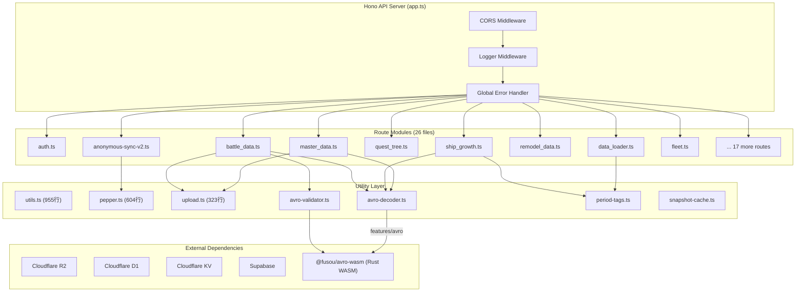

# Effect-TS 導入可能性調査報告書

> **調査日**: 2026-08-12
> **対象**: FUSOU-WEB サーバーサイド (Hono API) + AVRO データ処理パイプライン
> **ランタイム**: Cloudflare Workers (Astro + `@astrojs/cloudflare`)
> **フレームワーク**: Hono v4
> **現行言語**: TypeScript 5.9

---

## 目次

1. [エグゼクティブサマリー](#1-エグゼクティブサマリー)
2. [現行アーキテクチャの分析](#2-現行アーキテクチャの分析)
3. [Effect-TS の概要と適合性](#3-effect-ts-の概要と適合性)
4. [具体的な導入候補箇所](#4-具体的な導入候補箇所)
5. [HTTP ハンドラと Effect 境界層](#5-http-ハンドラと-effect-境界層)
6. [AVRO データ処理における Effect](#6-avro-データ処理における-effect)
7. [導入によるメリット・デメリット分析](#7-導入によるメリットデメリット分析)
8. [Cloudflare Workers との互換性](#8-cloudflare-workers-との互換性)
9. [段階的導入戦略](#9-段階的導入戦略)
10. [導入の是非に関する総合判断](#10-導入の是非に関する総合判断)
11. [付録: 具体的なコード変換例](#11-付録-具体的なコード変換例)

---

## 1. エグゼクティブサマリー

### 結論

**Effect-TS の全面導入は推奨しない。しかし、限定的な導入には価値がある。**

FUSOU-WEB のサーバーサイドコードベースは既に成熟しており、独自のエラーハンドリングパターン（discriminated union `{ ok: true; ... } | { ok: false; error: string }` や構造化されたエラーコードシステム `error-codes.ts`）が確立されている。Effect-TS の全面的な書き換えは、数万行に及ぶ安定したコードへの破壊的変更であり、投資対効果が見合わない。

一方で、以下の **限定的なユースケース** においては Effect-TS が顕著な改善をもたらす可能性がある:

| 候補箇所 | 導入効果 | リスク | 推奨度 |
|---|---|---|---|
| AVRO OCF デコードパイプライン | ★★★★☆ | 低 | **推奨** |
| pepper/recovery bundle 解決 | ★★★☆☆ | 中 | 条件付き推奨 |
| Two-stage upload ワークフロー | ★★☆☆☆ | 高 | 非推奨 |
| Hono HTTP ハンドラ境界層 | ★★☆☆☆ | 非常に高 | **非推奨** |
| 新規ユーティリティモジュール | ★★★★☆ | 低 | **推奨** |

### 判断の要約

- **導入可能か？** → 技術的には可能だが、Cloudflare Workers 環境での制約に注意が必要
- **導入に値するか？** → 全面導入は投資対効果で不合理。限定的な導入ならば合理的
- **最適な導入戦略は？** → 新規モジュールと AVRO パイプラインに絞った段階的導入

---

## 2. 現行アーキテクチャの分析

### 2.1 サーバーサイドアーキテクチャ概要



### 2.2 現行エラーハンドリングパターンの類型

コードベース全体を調査した結果、以下の **5 つの主要なエラーハンドリングパターン** が確認された:

#### パターン 1: Discriminated Union (最も多い)

```typescript
// anonymous-sync-v2.ts, utils.ts で多用
type BaseConfigResult =
  | { ok: true; config: BaseConfig }
  | { ok: false; reason: string };

function resolveBaseConfig(c: { env: Bindings }): BaseConfigResult {
  // ...
  if (!supabaseConfig.url) {
    return { ok: false, reason: "supabase_config_missing" };
  }
  return { ok: true, config: { ... } };
}
```

> **分析**: このパターンは Effect-TS の `Either<E, A>` と概念的に同一であるが、既に自己完結しており Effect の依存を追加する動機が弱い。

#### パターン 2: null/undefined 返却 + 呼び出し側条件分岐

```typescript
// utils.ts: validateJWT, verifySignedToken
export async function validateJWT(token: string): Promise<{
  id?: string; email?: string; payload?: Record<string, any>;
} | null> {
  try {
    // ...
    return { id, email, payload };
  } catch (error) {
    console.error("validateJWT: JWT verification failed:", error);
    return null;
  }
}
```

> **分析**: 最も改善余地が大きいパターン。null の理由が消失し、呼び出し側で適切なエラーメッセージを構成できない。Effect の `Effect.tryPromise` で型安全なエラー追跡に変換する価値がある。

#### パターン 3: try/catch + c.json() 直接返却

```typescript
// ほぼ全ルートハンドラで使用
app.post("/ingest", async (c) => {
  try {
    // 200~800行の手続き的処理
  } catch (err) {
    console.error("[ship-growth] Error:", err);
    return c.json({ error: "Internal server error" }, 500);
  }
});
```

> **分析**: 最も頻出するパターン。ルートハンドラの try/catch ブロックが数百行に及び、エラーの種類ごとに異なる HTTP ステータスコードを返す必要がある。Effect の `Effect.gen` パイプラインで宣言的に記述できれば可読性は向上するが、Hono コンテキスト (`c`) への依存が密結合しているため変換コストが高い。

#### パターン 4: 構造化エラーコード (error-codes.ts)

```typescript
export const ERROR_CODES = {
  AUTH_MISSING: { code: "AUTH_MISSING", message: "Missing authentication token", statusCode: 401 },
  // ...
} as const;

export function createErrorResponse(errorCode: ErrorCode, details?: string) {
  return { error: errorCode.message, code: errorCode.code, ...(details && { details }) };
}
```

> **分析**: Effect-TS の `Data.TaggedError` と機能的に同等。既存のエラーコード体系は十分に構造化されており、Effect のエラー型に移行するメリットが薄い。

#### パターン 5: 例外スロー (AVRO デコーダー内)

```typescript
// features/avro/ocf-decoder.ts
export class AvroOcfError extends Error {
  constructor(readonly code: AvroOcfErrorCode, message: string) {
    super(message);
    this.name = "AvroOcfError";
  }
}

function fail(message: string): never {
  throw new AvroOcfError("CORRUPT_AVRO", message);
}
```

> **分析**: AVRO デコーダーは純粋な変換パイプラインであるため、Effect 化の最良候補。`fail()` を `Effect.fail()` に置き換えることで、呼び出し側がエラーを型レベルで追跡でき、`try/catch` を不要にできる。

### 2.3 コード規模と影響範囲

| ディレクトリ | ファイル数 | 概算行数 | Effect 化難易度 |
|---|---|---|---|
| `server/routes/` | 26 | ~15,000 | 🔴 非常に高い |
| `server/utils/` | 11 | ~4,500 | 🟡 中程度 |
| `server/` (root) | 5 | ~2,200 | 🟡 中程度 |
| `features/avro/` | 3 | ~1,200 | 🟢 低い |
| `features/battles/` | 多数 | ~3,000 | 🟡 中程度 |

---

## 3. Effect-TS の概要と適合性

### 3.1 Effect-TS とは

Effect-TS は TypeScript のための型安全な関数型プログラミングライブラリで、以下を提供する:

- **Effect<A, E, R>**: 成功 (`A`)、エラー (`E`)、依存性 (`R`) を型レベルで追跡する計算の記述子
- **Layer**: 依存性注入 (DI) の仕組み
- **Stream / Sink**: リアクティブストリーム処理
- **Schema**: ランタイムバリデーション + 型推論
- **Fiber**: 構造化された並行処理

### 3.2 FUSOU-WEB 環境への適合性マトリクス

| Effect 機能 | FUSOU-WEB の対応状況 | 適合性 |
|---|---|---|
| `Effect<A, E, R>` | パターン1, 2 の代替として適用可能 | ★★★★☆ |
| `Layer` (DI) | `createEnvContext()` + `getEnv()` が DI 的に機能している | ★★☆☆☆ (既存で十分) |
| `Schema` | Zod/手動バリデーション未使用、手書き validate 関数 | ★★★☆☆ |
| `Stream` | AVRO ブロックの逐次デコードで潜在的な需要あり | ★★★★☆ |
| `Fiber` | Cloudflare Workers は isolate ベースでスレッドなし | ★☆☆☆☆ |
| `Duration` / `Schedule` | `CHALLENGE_BUCKET_SECONDS` 等の時間管理 | ★★☆☆☆ |

---

## 4. 具体的な導入候補箇所

### 4.1 候補 A: AVRO OCF デコードパイプライン ⭐ 最推奨

**対象ファイル:**
- `features/avro/ocf-decoder.ts` (392行)
- `features/avro/ocf-header.ts` (152行)

**現状の問題点:**
1. `fail()` 関数が `never` を返す例外スローで、型追跡が不可能
2. `decodeAvroOcfToJson()` の呼び出し側は常に `try/catch` が必要
3. ネストした `readValue → readArray → readValue → ...` の再帰的デコードでスタックトレースが読みにくい
4. パイプライン途中のパーシャルデコード情報（何レコード目で失敗したか等）が消失する

**Effect 化による改善:**

```typescript
// Before: 例外ベース
export function decodeAvroOcfToJson(avroBytes: Uint8Array): AvroJsonRecord[] {
  let header: OcfHeader;
  try {
    header = parseOcfHeader(avroBytes);
  } catch (error) {
    if (error instanceof OcfHeaderError) {
      throw new AvroOcfError(error.code, error.message);
    }
    throw error;
  }
  // ... 暗黙的に例外が伝播するパイプライン
}

// After: Effect ベース
export const decodeAvroOcf = (avroBytes: Uint8Array) =>
  Effect.gen(function* () {
    const header = yield* parseOcfHeaderEffect(avroBytes);
    if (header.codec !== null && header.codec !== "null") {
      return yield* Effect.fail(new UnsupportedCodecError(header.codec));
    }
    const records = yield* decodeBlocks(avroBytes, header);
    return records;
  });
// 型: Effect<AvroJsonRecord[], AvroOcfError | UnsupportedCodecError>
```

**導入コスト:** 低 (約400行の書き換え、外部 API 変更なし)
**効果:** 高 (型安全なエラーチャネル、パーシャルデコード情報の保持)
**リスク:** 低 (純粋な変換ロジックで外部依存がない)

### 4.2 候補 B: pepper/recovery bundle 解決ロジック

**対象ファイル:**
- `server/utils/pepper.ts` (604行)

**現状の問題点:**
1. `resolvePepperConfigFromVault()` が null を返すとき、失敗理由が `console.error()` のログにのみ残る
2. `parseBundlePayload()` は 15 種類以上の検証ステップがあり、各段階で `console.error` + `return null` を繰り返す

**Effect 化による改善:**

```typescript
// Before: null + console.error の連鎖
function parseBundlePayload(raw: unknown): PepperBundle | null {
  if (!isPlainObject(raw)) {
    console.error("[pepper] RPC payload is not an object");
    return null;
  }
  const current = normalizeVersionString(payload.current_version);
  if (!current) {
    console.error("[pepper] RPC current_version invalid");
    return null;
  }
  // ... 15以上の検証ステップ
}

// After: Effect.gen による宣言的バリデーション
const parseBundlePayload = (raw: unknown) =>
  Effect.gen(function* () {
    if (!isPlainObject(raw)) {
      return yield* Effect.fail(new PepperParseError("PAYLOAD_NOT_OBJECT"));
    }
    const current = yield* Effect.fromNullable(
      normalizeVersionString(payload.current_version)
    ).pipe(Effect.mapError(() => new PepperParseError("CURRENT_VERSION_INVALID")));
    // ... 宣言的な検証チェーン
  });
```

**導入コスト:** 中 (pepper.ts 全体 + anonymous-sync-v2.ts の呼び出し側の修正が必要)
**効果:** 中 (エラー理由の構造化と追跡可能性が向上)
**リスク:** 中 (anonymous-sync-v2.ts は1999行の巨大ファイルであり、呼び出し側修正の波及が大きい)

### 4.3 候補 C: 新規ユーティリティモジュール ⭐ 推奨

**概要:** 今後新規追加される純粋ロジックモジュールを Effect-TS で記述する。

**具体例:**
- 新しいデータ変換パイプライン
- キャッシュ戦略ロジック
- バリデーションスキーマ定義

**導入コスト:** 最低 (既存コード変更なし)
**効果:** 中～高 (新規コードの品質向上)
**リスク:** 最低 (既存コードへの影響ゼロ)

### 4.4 候補 D: Two-stage upload ワークフロー (非推奨)

**対象ファイル:**
- `server/utils/upload.ts` (323行)
- それを使用する `master_data.ts`, `battle_data.ts`, `remodel_data.ts` 等

**非推奨の理由:**
1. `handleTwoStageUpload()` は Hono の `c` コンテキストに強く依存している
2. 各ルートの `preparationValidator` / `executionProcessor` コールバックが `c.json()` で直接 Response を生成している
3. Effect 化すると、Hono の Response 型と Effect の `Either` 型の変換レイヤーが必要になり、複雑さが増す

---

## 5. HTTP ハンドラと Effect 境界層

### 5.1 Hono + Effect の統合パターン

Effect-TS を HTTP ハンドラの「境界層」として使用するアプローチには、大きく 3 つの戦略がある:

#### 戦略 1: ハンドラ全体を Effect で記述し、境界で `Effect.runPromise` する

```typescript
// ハンドラを Effect プログラムとして記述
const ingestHandler = (c: Context<{ Bindings: Bindings }>) =>
  Effect.gen(function* () {
    const env = createEnvContext(c);
    const body = yield* Effect.tryPromise(() => c.req.json());
    const validated = yield* validateIngestBodyEffect(body);
    const result = yield* processIngest(env, validated);
    return c.json({ ok: true, ...result });
  }).pipe(
    Effect.catchTags({
      ValidationError: (e) => Effect.succeed(c.json({ error: e.message }, 400)),
      AuthError: (e) => Effect.succeed(c.json({ error: e.message }, 401)),
      DatabaseError: (e) => Effect.succeed(c.json({ error: "Internal error" }, 500)),
    })
  );

// Hono ルートに登録
app.post("/ingest", (c) => Effect.runPromise(ingestHandler(c)));
```

**問題点:**
- `c` (Hono Context) を Effect の依存性 (`R`) として扱えるが、`c` はリクエストごとに異なるため Layer 化が不自然
- Cloudflare Workers の `ExecutionContext.waitUntil()` は Effect のライフサイクル外
- `Effect.runPromise` は失敗時に例外をスローするため、Hono のグローバルエラーハンドラとの二重処理になる

#### 戦略 2: ビジネスロジックのみ Effect で記述し、ハンドラは素の Hono のまま

```typescript
// ビジネスロジックを Effect で記述 (Hono 非依存)
const processIngest = (env: EnvContext, body: IngestBody) =>
  Effect.gen(function* () {
    const validated = yield* validateBody(body);
    const result = yield* writeToD1(env, validated);
    return result;
  });

// ハンドラは通常の Hono コード
app.post("/ingest", async (c) => {
  const env = createEnvContext(c);
  const body = await c.req.json().catch(() => null);
  if (!body) return c.json({ error: "Invalid JSON" }, 400);

  const result = await Effect.runPromise(processIngest(env, body))
    .catch((error) => {
      // Effect のエラーを HTTP レスポンスに変換
      if (error._tag === "ValidationError") return c.json({ error: error.message }, 400);
      return c.json({ error: "Internal error" }, 500);
    });

  return c.json(result);
});
```

**この戦略が FUSOU-WEB に最適な理由:**
- 既存の Hono ルートハンドラをそのまま維持できる
- Effect の恩恵を受けるのはビジネスロジック部分のみ
- 段階的な移行が可能

#### 戦略 3: Effect の HTTP サーバーモジュールで Hono を完全に置換する (非推奨)

```typescript
import { HttpRouter, HttpServer } from "@effect/platform";
```

**非推奨の理由:**
- Hono は Cloudflare Workers 向けに最適化されており、`@effect/platform` の HTTP サーバーは Node.js / Bun 向けが主流
- 既存の 26 ルートモジュール (数万行) の完全書き換えが必要
- CORS、ロガー、エラーハンドラ等の Hono ミドルウェアをすべて再実装する必要がある
- `wrangler.toml` の Bindings 型定義との統合が困難

### 5.2 FUSOU-WEB における推奨アプローチ

**戦略 2（ビジネスロジックのみ Effect）** を採用し、以下のガイドラインに従う:

> [!IMPORTANT]
> Hono のルートハンドラ (`app.get`, `app.post`) 自体は Effect 化しない。
> Effect はルートハンドラから呼び出される **純粋ビジネスロジック** にのみ適用する。

```
┌─────────────────────────────────────────────────────┐
│  Hono Handler (boundary)                            │
│  ┌───────────────────────────────────────────────┐  │
│  │  Request parsing, auth check (existing code)  │  │
│  └─────────────────────┬─────────────────────────┘  │
│                        │                             │
│  ┌─────────────────────▼─────────────────────────┐  │
│  │  Effect<A, E, R>.pipe(Effect.runPromise)       │  │
│  │  ┌─────────────────────────────────────────┐  │  │
│  │  │  Pure business logic (Effect programs)  │  │  │
│  │  │  - AVRO decode                          │  │  │
│  │  │  - Validation                           │  │  │
│  │  │  - Data transformation                  │  │  │
│  │  └─────────────────────────────────────────┘  │  │
│  └─────────────────────┬─────────────────────────┘  │
│                        │                             │
│  ┌─────────────────────▼─────────────────────────┐  │
│  │  Response formatting (c.json, HTTP status)     │  │
│  └───────────────────────────────────────────────┘  │
└─────────────────────────────────────────────────────┘
```

---

## 6. AVRO データ処理における Effect

### 6.1 現行 AVRO パイプライン分析

FUSOU-WEB の AVRO 処理は **三層構造** である:

| 層 | 実装 | 言語 | 用途 |
|---|---|---|---|
| **Rust WASM** | `avro-wasm/` (apache-avro crate) | Rust → WASM | スキーマ検証、canonical schema マッチング |
| **TS OCF デコーダー** | `features/avro/ocf-decoder.ts` | TypeScript | OCF バイナリ → JSON 変換 |
| **ルートハンドラ** | `ship_growth.ts`, `battle_data.ts` 等 | TypeScript | デコード結果の消費・DB 格納 |

### 6.2 AVRO デコーダーの Effect 化設計

#### 6.2.1 エラー型の定義

```typescript
import { Data } from "effect";

// Tagged error types for AVRO decoding
export class AvroHeaderError extends Data.TaggedError("AvroHeaderError")<{
  readonly code: "INVALID_MAGIC" | "TRUNCATED_HEADER" | "INVALID_META";
  readonly message: string;
  readonly offset?: number;
}> {}

export class AvroDecodeError extends Data.TaggedError("AvroDecodeError")<{
  readonly code: "CORRUPT_AVRO" | "UNSUPPORTED_CODEC";
  readonly message: string;
  readonly recordIndex?: number;
  readonly blockIndex?: number;
}> {}

export class AvroSchemaError extends Data.TaggedError("AvroSchemaError")<{
  readonly code: "UNKNOWN_TYPE" | "INVALID_UNION" | "MISSING_FIELD";
  readonly message: string;
  readonly schemaPath?: string;
}> {}
```

#### 6.2.2 デコードパイプラインの Effect 化

```typescript
import { Effect, pipe } from "effect";

// 現行: throw ベース (型追跡なし)
// function readLong(bytes, cursor): number → throws AvroOcfError

// Effect 化: 失敗が型に反映される
const readLong = (bytes: Uint8Array, cursor: Cursor) =>
  Effect.gen(function* () {
    let unsigned = 0;
    let multiplier = 1;
    for (let index = 0; index < 10; index++) {
      if (cursor.offset >= bytes.length) {
        return yield* Effect.fail(
          new AvroDecodeError({ code: "CORRUPT_AVRO", message: "Avro value is truncated" })
        );
      }
      const byte = bytes[cursor.offset];
      cursor.offset += 1;
      unsigned += (byte & 0x7f) * multiplier;
      if (unsigned > Number.MAX_SAFE_INTEGER) {
        return yield* Effect.fail(
          new AvroDecodeError({ code: "CORRUPT_AVRO", message: "Avro integer is too large" })
        );
      }
      if ((byte & 0x80) === 0) {
        return unsigned % 2 === 0 ? unsigned / 2 : -(unsigned + 1) / 2;
      }
      multiplier *= 128;
    }
    return yield* Effect.fail(
      new AvroDecodeError({ code: "CORRUPT_AVRO", message: "Avro integer is malformed" })
    );
  });

// 呼び出し側: エラー型が自動推論される
const result = decodeAvroOcf(bytes);
// 型: Effect<AvroJsonRecord[], AvroHeaderError | AvroDecodeError | AvroSchemaError>
```

#### 6.2.3 ルートハンドラでの消費パターン

```typescript
// ship_growth.ts での使用例
app.post("/ingest", async (c) => {
  // ... 認証・バリデーション (既存のまま) ...

  // Effect パイプラインの消費
  const decodeResult = await Effect.runPromiseExit(
    decodeAvroOcf(avroBytes)
  );

  if (Exit.isFailure(decodeResult)) {
    const error = Cause.failureOption(decodeResult.cause);
    if (Option.isSome(error)) {
      const avroError = error.value;
      switch (avroError._tag) {
        case "AvroHeaderError":
          return c.json({ error: `Invalid Avro header: ${avroError.message}` }, 400);
        case "AvroDecodeError":
          return c.json({
            error: `Avro decode failed at record ${avroError.recordIndex}: ${avroError.message}`
          }, 400);
        case "AvroSchemaError":
          return c.json({ error: `Schema error: ${avroError.message}` }, 400);
      }
    }
    return c.json({ error: "Unknown decode error" }, 500);
  }

  const records = Exit.getOrElse(decodeResult, () => []);
  // ... 後続処理 (既存のまま) ...
});
```

### 6.3 WASM バリデーション層との統合

`@fusou/avro-wasm` は Rust WASM で実装されており、Effect 化の対象外。ただし、WASM 呼び出しを Effect でラップすることで、初期化失敗やランタイムエラーを型安全に扱える:

```typescript
const validateAvroOCFSmartEffect = (data: Uint8Array, hint?: string) =>
  Effect.tryPromise({
    try: () => validateAvroOCFSmart(data, hint),
    catch: (error) => new WasmRuntimeError({
      message: `WASM validation failed: ${error}`,
      originalError: error,
    }),
  });
```

---

## 7. 導入によるメリット・デメリット分析

### 7.1 メリット

#### M1: 型安全なエラー追跡

現行コードの最大の弱点は、**エラーの種類が関数シグネチャから読み取れない** こと。

```typescript
// 現行: 何が失敗するか呼び出し側が知り得ない
async function loadMasterSlotStatsMap(
  env: Bindings, periodTag: string, tableVersion: string
): Promise<Map<number, MasterSlotStats>>
// → throw new Error("master data not found for mst_slotitem...")
// → throw new Error("R2 object missing for mst_slotitem: ...")
// → decodeAvroOcfToJson が throw する可能性

// Effect 化: エラーが型に明示される
const loadMasterSlotStatsMap = (env: Bindings, periodTag: string, tableVersion: string) =>
  Effect.gen(function* () { /* ... */ });
// 型: Effect<Map<number, MasterSlotStats>, MasterDataNotFoundError | R2ObjectMissingError | AvroDecodeError>
```

#### M2: エラーコンテキストの保持

現行の `console.error` + `return null` パターンでは、エラーの原因情報がログにのみ存在し、構造的に追跡できない。Effect のエラー型にコンテキストを含めることで、テスト可能かつ機械的に処理可能になる。

#### M3: パイプライン合成の可読性

`Effect.gen` の `yield*` パターンは、ネストした `if/else` + `try/catch` よりも意図が明確:

```typescript
// 現行: 深いネスト
if (base.ok) {
  const pepper = await resolvePepperBundle({ base: base.config });
  if (pepper.ok) {
    const recovery = await resolveRecoveryBundle({ base: base.config, supabaseAdmin: pepper.supabaseAdmin });
    if (recovery.ok) {
      // ... 本来のロジック
    } else {
      return c.json({ error: "..." }, 500);
    }
  } else {
    return c.json({ error: "..." }, 500);
  }
} else {
  return c.json({ error: "..." }, 500);
}

// Effect: フラットなパイプライン
const program = Effect.gen(function* () {
  const base = yield* resolveBaseConfigEffect(c);
  const pepper = yield* resolvePepperBundleEffect(base);
  const recovery = yield* resolveRecoveryBundleEffect(base, pepper.supabaseAdmin);
  // ... 本来のロジック (フラット)
});
```

#### M4: テスタビリティの向上

Effect の Layer 機能により、D1/R2/KV 等の外部依存を差し替え可能な形で注入できる。ただし、現行のテストは `vitest` + モック で既に機能しているため、追加的な恩恵は限定的。

### 7.2 デメリット

#### D1: 学習コスト

Effect-TS は TypeScript エコシステムで最も学習曲線が急峻なライブラリの一つ。`Effect`, `Layer`, `Scope`, `Fiber`, `Runtime`, `Exit`, `Cause` 等の概念を正しく理解するには相当な時間がかかる。

> [!WARNING]
> FUSOU-WEB のチーム規模が小さい場合、Effect-TS の導入はバス係数 (bus factor) を下げるリスクがある。

#### D2: バンドルサイズの増加

`effect` パッケージのバンドルサイズ:
- `effect` (core): ~42KB (minified + gzipped)
- `@effect/schema`: ~20KB
- `@effect/platform`: ~30KB

Cloudflare Workers にはスクリプトサイズ制限 (Free: 1MB, Paid: 10MB) があり、既に `@fusou/avro-wasm` (481KB WASM) を含んでいることを考慮すると、追加の ~42KB は許容範囲内だが注意は必要。

#### D3: ランタイムオーバーヘッド

Effect のファイバーランタイムはゼロコストではない。各 `yield*` は内部的にファイバーの suspension/resumption を行う。Cloudflare Workers の CPU 時間制限 (Free: 10ms, Paid: 30s) の制約下では、ホットパスでの使用に注意が必要。

ただし、AVRO デコードのような I/O バウンドなパイプラインでは、このオーバーヘッドは無視できる程度。

#### D4: Hono エコシステムとの乖離

Hono ミドルウェアは `(c, next) => ...` パターンで書かれており、Effect のモナディックパイプラインとは根本的に異なる。Hono + Effect の公式統合は存在せず、自前で境界層を実装する必要がある。

#### D5: デバッグ難易度

Effect のスタックトレースは、特に `Effect.gen` 内でエラーが発生した場合、実際のビジネスロジックの行番号ではなく Effect ランタイムの内部フレームが表示されることがある。Cloudflare Workers のログ環境では、この問題が顕著になる。

---

## 8. Cloudflare Workers との互換性

### 8.1 技術的制約

| 制約事項 | 影響 | 対策 |
|---|---|---|
| V8 Isolate 環境 (Node.js API なし) | Effect の一部機能が Node.js に依存している可能性 | `effect` core は Web API のみ使用。`@effect/platform-browser` を使用 |
| CPU 時間制限 (Paid: 30s) | Effect ランタイムのオーバーヘッド | ホットパスでは Effect を避け、I/O 系に限定 |
| メモリ制限 (128MB) | Effect のファイバーは追加メモリを消費 | ファイバー数を限定、Stream ではなく Effect を基本使用 |
| `waitUntil` / `ExecutionContext` | Effect のライフサイクルと非同期バックグラウンドタスクの統合 | `Effect.runPromise` の外で `safeWaitUntil` を使用 (既存パターンを維持) |
| WASM モジュールインポート | `@fusou/avro-wasm` の初期化タイミング | Effect の `Layer` でWASM初期化を表現するか、既存の `initWasm()` パターンを維持 |

### 8.2 検証済み事例

Effect-TS の Cloudflare Workers 上での動作は、コミュニティレベルでは報告されているが、公式にはサポート対象外。以下に注意:

- `@effect/platform-node` は使用不可（Node.js ランタイムに依存）
- `@effect/platform-browser` は Web Workers 互換で、Cloudflare Workers でも動作する可能性が高い
- `effect` core パッケージは Web API のみに依存しており、動作実績あり

> [!CAUTION]
> **本番導入前に、Cloudflare Workers 環境での Effect ランタイムの動作検証が必須。**
> 特に `wrangler dev` と `wrangler deploy` 両方で問題がないことを確認すること。

---

## 9. 段階的導入戦略

### Phase 0: PoC (概算工数: 1~2日)

1. `effect` パッケージを `dependencies` に追加
2. Cloudflare Workers 環境での `Effect.runPromise` の動作確認
3. `features/avro/ocf-decoder.ts` の `readLong()` のみを Effect 化して動作検証
4. `wrangler dev` / `wrangler deploy` でバンドルサイズとランタイムの問題がないことを確認

### Phase 1: AVRO パイプライン (概算工数: 3~5日)

1. `features/avro/ocf-decoder.ts` を完全に Effect 化
2. `features/avro/ocf-header.ts` を Effect 化
3. 既存の `decodeAvroOcfToJson` をエクスポートとして維持し、内部で `Effect.runSync` する互換レイヤーを提供
4. 新たに `decodeAvroOcf` (Effect 版) をエクスポート
5. テストの追加

```typescript
// 互換レイヤー: 既存の呼び出し側は変更不要
export function decodeAvroOcfToJson(avroBytes: Uint8Array): AvroJsonRecord[] {
  return Effect.runSync(decodeAvroOcf(avroBytes));
}

// 新 API: Effect 対応の呼び出し側で使用
export const decodeAvroOcf: (bytes: Uint8Array) => Effect<AvroJsonRecord[], AvroDecodeError>;
```

### Phase 2: ユーティリティ層 (概算工数: 2~3日)

1. 新規作成するユーティリティ関数を Effect で記述
2. `pepper.ts` の `parseBundlePayload()` を Effect 化 (オプション)
3. 共通の Effect エラー型定義ファイル (`server/effects/errors.ts`) の作成

### Phase 3: 評価と判断 (概算工数: 1日)

1. Phase 1~2 の成果を評価
2. バンドルサイズ、ランタイムパフォーマンス、開発者体験を計測
3. 全面導入 or 現状維持の判断

> [!NOTE]
> Phase 3 の評価結果次第で、Phase 4 以降（ルートハンドラのビジネスロジック Effect 化）への進行を判断する。Phase 1~2 だけでも十分な価値があるため、Phase 3 で「現状維持」と判断しても損失はない。

---

## 10. 導入の是非に関する総合判断

### 10.1 スコアカード

| 評価軸 | スコア (5点満点) | 備考 |
|---|---|---|
| 技術的適合性 | 3.5 | Cloudflare Workers 互換だが検証必要 |
| 既存コードとの統合容易性 | 2.0 | 大半のコードは Hono 密結合で Effect 化困難 |
| エラーハンドリング改善効果 | 4.0 | 最大のメリット。特に AVRO パイプラインで顕著 |
| 学習コスト・チームへの影響 | 2.0 | Effect-TS は急峻な学習曲線 |
| バンドルサイズ影響 | 3.5 | ~42KB の追加は Workers 制限内 |
| 段階的導入の可能性 | 4.5 | 互換レイヤー戦略で非破壊的に導入可能 |
| **総合** | **3.25** | **限定的導入を推奨** |

### 10.2 最終推奨事項

1. **AVRO OCF デコーダー** (`features/avro/`) の Effect 化を第一優先で検討する
2. **Hono ルートハンドラ自体は Effect 化しない** — 境界層はそのまま維持する
3. **新規モジュールは Effect での記述を検討する** — ただし強制はしない
4. **全面的な書き換えは行わない** — 既存の discriminated union パターンと error-codes.ts は十分に機能している
5. **Phase 0 (PoC) から開始し** 、Cloudflare Workers 上での動作実績を確認してから判断する

### 10.3 Effect を導入しないほうが良いケース

以下の条件に該当する場合、Effect の導入は見送るべき:

- チームメンバーが関数型プログラミングに不慣れである
- Cloudflare Workers の Free プランで運用しており、バンドルサイズに余裕がない
- 現行のエラーハンドリングで致命的な問題が発生していない
- 短期的なリリーススケジュールが優先される

---

## 11. 付録: 具体的なコード変換例

### 11.1 validateDatasetTokenWithConstraints の Effect 化例

```typescript
// ========== 現行コード (utils.ts L651-L693) ==========
export async function validateDatasetTokenWithConstraints(
  options: DatasetTokenValidationOptions,
): Promise<DatasetTokenValidationResult> {
  const { token, secret, expectedDatasetId, expectedUserId } = options;
  if (!token) {
    return { ok: false, status: 401, error: "dataset_token is required" };
  }
  if (!secret) {
    return { ok: false, status: 500, error: "Server configuration error" };
  }
  const validated = await validateDatasetToken(token, secret);
  if (!validated) {
    return { ok: false, status: 401, error: "Invalid or expired dataset_token" };
  }
  if (expectedDatasetId && validated.dataset_id !== expectedDatasetId.trim()) {
    return { ok: false, status: 403, error: "dataset_id does not match token" };
  }
  if (expectedUserId && validated.user_id !== expectedUserId.trim()) {
    return { ok: false, status: 403, error: "dataset_token user does not match JWT user" };
  }
  return { ok: true, token: validated };
}

// ========== Effect 化 ==========
import { Effect, Data } from "effect";

class TokenMissing extends Data.TaggedError("TokenMissing")<{
  readonly status: 401;
}> {}

class SecretMissing extends Data.TaggedError("SecretMissing")<{
  readonly status: 500;
}> {}

class TokenInvalid extends Data.TaggedError("TokenInvalid")<{
  readonly status: 401;
}> {}

class DatasetIdMismatch extends Data.TaggedError("DatasetIdMismatch")<{
  readonly status: 403;
}> {}

class UserIdMismatch extends Data.TaggedError("UserIdMismatch")<{
  readonly status: 403;
}> {}

export const validateDatasetTokenEffect = (
  options: DatasetTokenValidationOptions
) =>
  Effect.gen(function* () {
    if (!options.token) {
      return yield* new TokenMissing({ status: 401 });
    }
    if (!options.secret) {
      return yield* new SecretMissing({ status: 500 });
    }
    const validated = yield* Effect.tryPromise({
      try: () => validateDatasetToken(options.token!, options.secret!),
      catch: () => new TokenInvalid({ status: 401 }),
    });
    if (!validated) {
      return yield* new TokenInvalid({ status: 401 });
    }
    if (options.expectedDatasetId && validated.dataset_id !== options.expectedDatasetId.trim()) {
      return yield* new DatasetIdMismatch({ status: 403 });
    }
    if (options.expectedUserId && validated.user_id !== options.expectedUserId.trim()) {
      return yield* new UserIdMismatch({ status: 403 });
    }
    return validated;
  });

// 型:
// Effect<
//   { dataset_id: string; user_id: string },
//   TokenMissing | SecretMissing | TokenInvalid | DatasetIdMismatch | UserIdMismatch
// >
```

### 11.2 ship_growth の loadMasterSlotStatsMap の Effect 化例

```typescript
// ========== 現行コード (ship_growth.ts L282-L331) ==========
async function loadMasterSlotStatsMap(
  env: Bindings, periodTag: string, tableVersion: string
): Promise<Map<number, MasterSlotStats>> {
  // ... cache check ...
  const record = await env.MASTER_DATA_INDEX_DB.prepare(/* ... */).first();
  if (!record?.r2_key) {
    throw new Error(`master data not found for mst_slotitem (...)`);
  }
  const r2Object = await env.MASTER_DATA_BUCKET.get(record.r2_key);
  if (!r2Object) {
    throw new Error(`R2 object missing for mst_slotitem: ${record.r2_key}`);
  }
  const avroBytes = new Uint8Array(await r2Object.arrayBuffer());
  const decodedRecords = decodeAvroOcfToJson(avroBytes); // throws AvroOcfError
  return parseMasterSlotStatsMap(decodedRecords);
}

// ========== Effect 化 ==========
class MasterDataNotFound extends Data.TaggedError("MasterDataNotFound")<{
  readonly periodTag: string;
  readonly tableVersion: string;
  readonly tableName: string;
}> {}

class R2ObjectMissing extends Data.TaggedError("R2ObjectMissing")<{
  readonly r2Key: string;
}> {}

const loadMasterSlotStatsMapEffect = (
  env: Bindings, periodTag: string, tableVersion: string
) =>
  Effect.gen(function* () {
    // ... cache check (同様) ...
    const record = yield* Effect.tryPromise({
      try: () => env.MASTER_DATA_INDEX_DB.prepare(/* ... */).first(),
      catch: (e) => new D1QueryError({ message: String(e) }),
    });
    if (!record?.r2_key) {
      return yield* new MasterDataNotFound({ periodTag, tableVersion, tableName: "mst_slotitem" });
    }
    const r2Object = yield* Effect.tryPromise({
      try: () => env.MASTER_DATA_BUCKET.get(record.r2_key),
      catch: (e) => new R2ReadError({ message: String(e) }),
    });
    if (!r2Object) {
      return yield* new R2ObjectMissing({ r2Key: record.r2_key });
    }
    const avroBytes = new Uint8Array(yield* Effect.promise(() => r2Object.arrayBuffer()));
    const decodedRecords = yield* decodeAvroOcf(avroBytes); // AvroDecodeError が型に含まれる
    return parseMasterSlotStatsMap(decodedRecords);
  });

// 型:
// Effect<
//   Map<number, MasterSlotStats>,
//   MasterDataNotFound | R2ObjectMissing | D1QueryError | R2ReadError | AvroDecodeError
// >
```

---

> [!NOTE]
> この報告書は FUSOU-WEB のサーバーサイドコード、AVRO データ処理パイプライン、および HTTP ハンドラの現行実装に基づく分析である。Effect-TS の API は頻繁に更新されるため、導入時には最新ドキュメントを参照すること。

---

*報告書終了*
