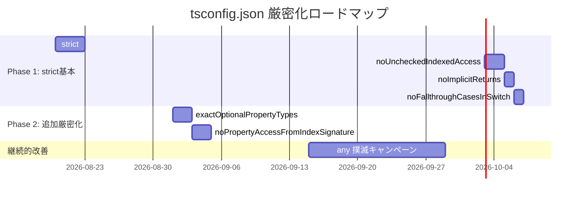

# Zod 導入 & tsconfig.json 厳密化 調査報告書

> **調査日**: 2026-08-13  
> **対象**: FUSOU-WEB サーバーサイド (Hono API) + 関連 AVRO データ処理  
> **ランタイム**: Cloudflare Workers (Astro + `@astrojs/cloudflare`)  
> **フレームワーク**: Hono v4  
> **現行 TypeScript**: 5.9.3  
> **関連文書**: [Effect-TS 導入可能性調査報告書](./effect-ts-feasibility-study.md)

---

## 目次

1. [エグゼクティブサマリー](#1-エグゼクティブサマリー)
2. [現行の型安全性に関する問題点の分析](#2-現行の型安全性に関する問題点の分析)
3. [tsconfig.json 厳密化の調査](#3-tsconfigjson-厳密化の調査)
4. [Zod 導入の調査](#4-zod-導入の調査)
5. [Zod と tsconfig 厳密化の相互補完性](#5-zod-と-tsconfig-厳密化の相互補完性)
6. [Effect-TS との比較](#6-effect-ts-との比較)
7. [具体的な導入候補箇所](#7-具体的な導入候補箇所)
8. [段階的導入戦略](#8-段階的導入戦略)
9. [導入の是非に関する総合判断](#9-導入の是非に関する総合判断)
10. [付録: コード変換例](#10-付録-コード変換例)

---

## 1. エグゼクティブサマリー

### 結論

**tsconfig.json の厳密化は即座に推奨。Zod は新規バリデーション箇所への段階的導入を推奨。**

| アプローチ | 導入コスト | 効果 | リスク | 推奨度 |
|---|---|---|---|---|
| **tsconfig.json 厳密化** | 中（修正箇所多いが機械的） | ★★★★★ | 低 | ⭐ **強く推奨** |
| **Zod 導入（新規バリデーション）** | 低 | ★★★★☆ | 低 | ⭐ **推奨** |
| **Zod 導入（既存バリデーション全置換）** | 非常に高 | ★★★☆☆ | 中 | 条件付き推奨 |
| **参考: Effect-TS** | 非常に高 | ★★★☆☆ | 高 | 限定的推奨 |

tsconfig 厳密化と Zod は **互いに補完的** であり、同時に導入することで最大の効果を発揮する:

- **tsconfig 厳密化** → コンパイル時に `any` の伝播と暗黙的な型安全性の穴を塞ぐ
- **Zod** → ランタイム境界（HTTP リクエストボディ、D1 クエリ結果、外部 API レスポンス）でデータ形状を保証する

両者を併用することで、Effect-TS の最大の利点である「型安全なエラー追跡」の **大部分** を、はるかに低い学習コストで実現できる。

---

## 2. 現行の型安全性に関する問題点の分析

### 2.1 現行 tsconfig.json の設定

```jsonc
// packages/FUSOU-WEB/tsconfig.json
{
  "extends": "./node_modules/astro/tsconfigs/base.json",
  "compilerOptions": {
    "lib": ["ES2022", "DOM"],
    "jsx": "preserve",
    "module": "es2020",
    "moduleResolution": "bundler",
    "strictNullChecks": true,           // ← 有効
    "paths": { ... },
    "types": ["@cloudflare/workers-types", "astro/client"]
  }
}
```

**Astro の base.json が提供する設定:**

```jsonc
{
  "target": "ESNext",
  "module": "ESNext",
  "moduleResolution": "Bundler",
  "allowImportingTsExtensions": true,
  "resolveJsonModule": true,
  "verbatimModuleSyntax": true,
  "isolatedModules": true,
  "noEmit": true,
  "forceConsistentCasingInFileNames": true,
  "esModuleInterop": true,
  "skipLibCheck": true,
  "allowJs": true,
  "jsx": "preserve"
}
```

> [!WARNING]
> **`strict: true` が設定されていない。** `strictNullChecks` のみが明示的に有効化されているが、`strict` フラグに含まれる他の重要なチェックが欠落している。

### 2.2 現行コードにおける型安全性の問題パターン

調査の結果、以下の **7 種類の型安全性の問題** が特定された:

#### 問題 1: `any` の広範な使用 — EnvContext の型消失

```typescript
// utils.ts L37-44
export interface EnvContext {
  readonly runtime: Record<string, any>;   // ← Bindings 型が消える
  readonly buildtime: Record<string, any>; // ← import.meta.env の型が消える
  readonly isDev: boolean;
}
```

`createEnvContext(c)` は `c.env` の `Bindings` 型情報を `Record<string, any>` に変換して返す。これにより、`getEnv(env, "NONEXISTENT_KEY")` のようなタイポがコンパイルエラーにならない。

**影響範囲:** 全ルートハンドラ（26ファイル）が `createEnvContext` を使用

#### 問題 2: D1 クエリ結果の `as` キャスト — ランタイム型安全性の欠如

```typescript
// quest_tree.ts L270
const existing = (await db
  .prepare(`SELECT id FROM quest_ingest_events WHERE request_id = ? ...`)
  .bind(requestId, payloadHash)
  .first<D1Result>()) as { id?: number } | null;

// internal_compaction.ts L708
const row = (await db
  .prepare(`SELECT id, lock_token, lock_expires_ms FROM ...`)
  .first()) as { id?: number; lock_token?: string | null; lock_expires_ms?: number | null } | null;
```

`as { ... }` キャストは **型チェックを完全にバイパス** する。SQL の `SELECT` カラム名やカラム型を変更しても、TypeScript コンパイラは何も検出できない。

**影響範囲:** 50 箇所以上の `as { ... }` キャストが `server/routes/` に存在

#### 問題 3: リクエストボディの手動型ガード — 冗長で不完全

```typescript
// anonymous-sync-v2.ts L462
const apiMemberId = normalizeApiMemberId((body as any).api_member_id);
const pubkey = normalizePubkey((body as any).device_pub);
const attestation = (body as any).attestation;
if (typeof attestation !== "string" || attestation.length === 0) {
  return c.json({ error: "attestation is required" }, 400);
}
```

`body` は `c.req.json()` から `unknown` として取得されるが、`as any` で即座に型安全性を放棄している。各フィールドの検証は **手続き的に** 行われ、400以上のフィールドチェックがルートごとに散在している。

**影響範囲:** 全 POST ルート（15+エンドポイント）

#### 問題 4: validateTokenPayload の動的フィールド名 — コンパイル時チェック不能

```typescript
// utils.ts L909-954
export function validateTokenPayload(
  payload: any,                    // ← any
  requiredFields: string[] = [],   // ← string[] (リテラル型でない)
): { valid: boolean; error?: string; data?: any }  // ← data: any
```

`requiredFields` が `string[]` であるため、フィールド名のタイポが検出されない。また `data` の型が `any` のため、バリデーション通過後もフィールドアクセスに型安全性がない。

```typescript
// 呼び出し例 (master_data.ts L493)
const payloadValidation = validateTokenPayload(tokenPayload, [
  "record_id",
  "period_tag",
  "table_version",
  "period_revision",
  "content_hash",
  "table_offsets",
  "table_count",
  "declared_size",
]);
// → payloadValidation.data は any
// → tokenPayload.record_id は any のまま
```

#### 問題 5: Hono コンテキストの `c` の any 脱出

```typescript
// upload.ts L68-71
export async function handleTwoStageUpload(
  c: any,              // ← Hono Context<{ Bindings: Bindings }> であるべき
  config: UploadConfig,
): Promise<Response>
```

```typescript
// utils.ts L727
export async function generateR2SignedUrl(
  _bucket: any,        // ← R2BucketBinding であるべき
  key: string,
  ...
```

#### 問題 6: `(body as any).field` パターンの型安全性ゼロ

```typescript
// battle_data.ts L681-708
const datasetId = typeof body?.dataset_id === "string" ? body.dataset_id.trim() : "";
const table = typeof body?.table === "string" ? body.table.trim() : "";
const periodTag = typeof body?.kc_period_tag === "string" ? body.kc_period_tag.trim() : "";
const tableVersion = typeof body?.table_version === "string" ? body.table_version.trim()
  : typeof body?.tableVersion === "string" ? body.tableVersion.trim() : "";
const fileSize = typeof body?.file_size === "string" ? body.file_size : "0";
```

このパターンは **13のルートファイル** にわたって繰り返されており、DRY 原則に違反している。

#### 問題 7: `noUncheckedIndexedAccess` 未設定によるインデックスアクセスの危険性

```typescript
// 配列アクセスで undefined チェックが不要になってしまう
const sortedOffsets = [...tableOffsets].sort((a, b) => a.start - b.start);
if (sortedOffsets[0].start !== 0) {  // sortedOffsets が空なら例外
  return c.json({ error: "table_offsets must start at offset 0" }, 400);
}
```

### 2.3 問題の定量分析

```
$ grep -c "as any" src/server/**/*.ts              → 約60箇所
$ grep -c "as {" src/server/**/*.ts                 → 約80箇所
$ grep -c "Record<string, any>" src/server/*.ts     → 約18箇所
$ grep -c "typeof body" src/server/routes/*.ts      → 約30箇所
$ grep -c "validateIngestBody" src/server/routes/*.ts → 3箇所（各300+行）
```

---

## 3. tsconfig.json 厳密化の調査

### 3.1 有効化すべきコンパイラオプション

以下は現行設定で **未設定** であり、有効化を推奨するオプション:

| オプション | 説明 | 影響度 | 推奨度 |
|---|---|---|---|
| `strict` | 下記フラグの一括有効化 | 最大 | ⭐ 強く推奨 |
| `noImplicitAny` | `any` の暗黙推論を禁止 | 大 | ⭐ 強く推奨 |
| `strictFunctionTypes` | 関数パラメータの反変チェック | 中 | ⭐ 推奨 |
| `strictBindCallApply` | bind/call/apply の厳密型チェック | 低 | 推奨 |
| `strictPropertyInitialization` | クラスプロパティの初期化チェック | 低 | 推奨 |
| `noImplicitThis` | `this` の暗黙 any 禁止 | 低 | 推奨 |
| `useUnknownInCatchVariables` | catch 変数を `unknown` にする | 中 | ⭐ 推奨 |
| `alwaysStrict` | JavaScript の strict mode 強制 | 低 | 推奨 |
| `noUncheckedIndexedAccess` | インデックスアクセスに `undefined` を含める | 中 | ⭐ 強く推奨 |
| `noImplicitReturns` | 関数の暗黙 undefined 返却を禁止 | 低 | 推奨 |
| `noFallthroughCasesInSwitch` | switch の fallthrough 検出 | 低 | 推奨 |
| `exactOptionalPropertyTypes` | `undefined` と「未設定」の区別 | 中 | 条件付き推奨 |
| `noPropertyAccessFromIndexSignature` | ドット記法でのインデックスアクセス禁止 | 低～中 | 条件付き推奨 |

### 3.2 `strict: true` の有効化による影響評価

`strict: true` は以下のフラグをまとめて有効化する:

```
strictNullChecks         ✅ 既に有効
noImplicitAny            ❌ 未設定 → 有効化
strictFunctionTypes      ❌ 未設定 → 有効化
strictBindCallApply      ❌ 未設定 → 有効化
strictPropertyInitialization  ❌ 未設定 → 有効化
noImplicitThis           ❌ 未設定 → 有効化
useUnknownInCatchVariables    ❌ 未設定 → 有効化
alwaysStrict             ❌ 未設定 → 有効化
```

#### 3.2.1 `noImplicitAny` の影響 — **最大のインパクト**

**影響を受ける箇所の推定:**

1. **`createEnvContext` の `c` パラメータ**  
   `c: Pick<Context, "env"> | { env?: any }` — `any` が暗黙的に伝播

2. **コールバック関数のパラメータ**  
   ```typescript
   // upload.ts L39
   preparationValidator: (
     body: any,                    // ← 暗黙 any
     user: { id: string; [key: string]: any },
     authContext: UploadAuthContext,
   ) => Promise<PrepareResult | Response>;
   ```

3. **D1 クエリ結果のキャスト**  
   全ての `as { ... }` キャストの前段階で `any` が推論される箇所

4. **`process.env` アクセス**  
   ```typescript
   const processValue = (process.env as any)[key];  // ← 明示的 any
   ```

**推定修正箇所数:** ~100–150 箇所

**修正戦略:** `any` を明示的な型または `unknown` に置き換える。即座に修正困難な箇所には `// eslint-disable-next-line @typescript-eslint/no-explicit-any` を付与し、TODO として管理する。

#### 3.2.2 `useUnknownInCatchVariables` の影響

現行コードでは catch 変数を `error` として受け取り、直接プロパティアクセスしている箇所がある:

```typescript
// 現行 (暗黙 any)
catch (error) {
  console.error("[master-data] Error:", error);
  return c.json({ error: "Failed to process upload request" }, 500);
}

// strict 後 (unknown)
catch (error: unknown) {
  const message = error instanceof Error ? error.message : String(error);
  console.error("[master-data] Error:", message);
  return c.json({ error: "Failed to process upload request" }, 500);
}
```

**推定修正箇所数:** ~60–80 箇所（全ての try/catch ブロック）

**修正の容易性:** 高。パターンが画一的なので機械的に修正可能。

#### 3.2.3 `noUncheckedIndexedAccess` の影響

```typescript
// 現行: コンパイラは sortedOffsets[0] が undefined にならないと仮定する
if (sortedOffsets[0].start !== 0) { ... }

// strict 後: sortedOffsets[0] は T | undefined 型になる
const first = sortedOffsets[0];
if (!first || first.start !== 0) { ... }
```

**推定修正箇所数:** ~40–60 箇所

**修正の容易性:** 中。意味的に安全な箇所（直前に length チェックあり）には non-null assertion (`!`) を使用可能だが、本来は明示的なガードが望ましい。

### 3.3 推奨する tsconfig.json の変更

```jsonc
// packages/FUSOU-WEB/tsconfig.json (推奨変更後)
{
  "extends": "./node_modules/astro/tsconfigs/base.json",
  "include": [".astro/types.d.ts", "**/*"],
  "exclude": ["dist", "src/server/durable-objects/**", "playwright-report", "test-results"],
  "compilerOptions": {
    "lib": ["ES2022", "DOM"],
    "jsx": "preserve",
    "module": "es2020",
    "moduleResolution": "bundler",

    // ====== 厳密性 (Phase 1) ======
    "strict": true,                          // strictNullChecks を含むすべてのstrict系フラグ
    "noUncheckedIndexedAccess": true,         // 配列/オブジェクトのインデックスアクセスを安全に
    "noImplicitReturns": true,               // 関数の暗黙undefined返却を禁止

    // ====== 厳密性 (Phase 2 - 段階的導入) ======
    // "exactOptionalPropertyTypes": true,    // undefined と未設定の区別
    // "noPropertyAccessFromIndexSignature": true, // Record型のドットアクセス禁止

    // ====== コード品質 ======
    "noFallthroughCasesInSwitch": true,      // switch fallthrough 検出

    "paths": {
      "@/*": ["./src/*"],
      "@fusou/avro-wasm": ["../avro-wasm/index.ts"]
    },
    "types": ["@cloudflare/workers-types", "astro/client"]
  }
}
```

### 3.4 段階的な厳密化のロードマップ



### 3.5 `strict: true` 導入時の現実的な移行手順

> [!IMPORTANT]
> `strict: true` を一度に有効化するとコンパイルエラーが大量に発生し、修正が滞る可能性がある。以下の手順で **段階的に** 移行する。

**手順 1:** `strict: true` を有効化し、`// @ts-expect-error` で既存エラーを一時的に抑制する  

```bash
# エラー数の事前調査
npx tsc --noEmit --strict 2>&1 | grep "error TS" | wc -l
```

**手順 2:** エラーを種類別に分類し、影響度の高い順に修正する

| エラー種別 | 優先度 | 修正方針 |
|---|---|---|
| `noImplicitAny` (パラメータ) | 高 | 適切な型を付与 |
| `noImplicitAny` (関数返却値) | 高 | 返り値型を明示 |
| `useUnknownInCatchVariables` | 中 | `instanceof Error` ガード追加 |
| `strictPropertyInitialization` | 低 | `!` または初期値を設定 |
| `noImplicitThis` | 低 | アロー関数に変換 |

**手順 3:** `noUncheckedIndexedAccess` を有効化（別PR推奨）

**手順 4:** CI/CD で `tsc --noEmit` を必須チェックに追加

---

## 4. Zod 導入の調査

### 4.1 Zod の概要と特徴

Zod は TypeScript ファーストのスキーマバリデーションライブラリで、以下を提供する:

- **宣言的スキーマ定義:** データの形状を型と同時に定義
- **型推論:** スキーマから TypeScript 型を自動推論 (`z.infer<typeof schema>`)
- **合成可能性:** `.pick()`, `.extend()`, `.merge()` でスキーマの再利用
- **バンドルサイズ:** ~14KB (minified + gzipped) — Effect-TS (~42KB) より遥かに小さい
- **学習コスト:** 非常に低い — API が直感的で TypeScript ネイティブ
- **Cloudflare Workers 互換:** 完全対応（Node.js API への依存なし）

### 4.2 現行バリデーションパターンと Zod 化の対応

#### 4.2.1 パターン A: 手動 typeof チェック → Zod スキーマ

**現行（battle_data.ts 等）:**

```typescript
// 15 行以上の手動バリデーション
const datasetId = typeof body?.dataset_id === "string" ? body.dataset_id.trim() : "";
const table = typeof body?.table === "string" ? body.table.trim() : "";
const periodTag = typeof body?.kc_period_tag === "string" 
  ? body.kc_period_tag.trim() : "";
const tableVersion = typeof body?.table_version === "string"
  ? body.table_version.trim()
  : typeof body?.tableVersion === "string"
    ? body.tableVersion.trim() : "";
const fileSize = typeof body?.file_size === "string" ? body.file_size : "0";
const contentHash = typeof body?.content_hash === "string" 
  ? body.content_hash.trim() : "";

if (!datasetId) return c.json({ error: "dataset_id is required" }, 400);
if (!table) return c.json({ error: "table is required" }, 400);
if (!contentHash) return c.json({ error: "content_hash is required" }, 400);
// ... さらに続く
```

**Zod 化:**

```typescript
import { z } from "zod";

const BattleDataPrepareSchema = z.object({
  dataset_id: z.string().trim().min(1, "dataset_id is required"),
  table: z.string().trim().min(1, "table is required"),
  kc_period_tag: z.string().trim().min(1, "kc_period_tag is required"),
  table_version: z.string().trim().optional(),
  tableVersion: z.string().trim().optional(),  // レガシーフィールド名
  file_size: z.union([
    z.number().positive(),
    z.string().transform((s) => parseInt(s, 10)).pipe(z.number().positive()),
  ]),
  content_hash: z.string().trim().regex(/^[a-f0-9]{64}$/i, "Must be SHA-256 hex"),
  table_offsets: z.string().trim().optional(),
  path: z.string().trim().optional(),
  binary: z.boolean().optional().default(false),
}).transform((data) => ({
  ...data,
  // table_version / tableVersion の正規化
  resolvedTableVersion: data.table_version || data.tableVersion || "",
}));

type BattleDataPrepareBody = z.infer<typeof BattleDataPrepareSchema>;
// → { dataset_id: string; table: string; kc_period_tag: string; ... resolvedTableVersion: string }
```

**使用側:**

```typescript
app.post("/upload", async (c) => {
  const rawBody = await c.req.json().catch(() => null);
  const parsed = BattleDataPrepareSchema.safeParse(rawBody);
  
  if (!parsed.success) {
    return c.json({
      error: "Validation failed",
      details: parsed.error.issues.map((i) => ({
        field: i.path.join("."),
        message: i.message,
      })),
    }, 400);
  }
  
  const body = parsed.data; // ← 完全に型付けされている
  body.dataset_id;          // string (guaranteed trimmed, non-empty)
  body.resolvedTableVersion; // string
});
```

#### 4.2.2 パターン B: validateIngestBody → Zod スキーマ

**現行（remodel_data.ts L188-383 — 約200行）:**

```typescript
function validateIngestBody(body: any): ValidResult | InvalidResult {
  if (!body || typeof body !== "object") {
    return { ok: false, error: "Invalid JSON body" };
  }
  const datasetId = String(body.dataset_id ?? "").trim();
  if (!datasetId) return { ok: false, error: "dataset_id is required" };
  // ... 190行の手動バリデーション
}
```

**Zod 化:**

```typescript
const RemodelSlotlistEntrySchema = z.object({
  remodel_id: z.number().int(),
  remodel_step_id: z.number().int().nullable().optional(),
  remodel_level: z.number().int().min(0).max(10),
  slotitem_master_id: z.number().int(),
  sp_type: z.number().int(),
  req_fuel: z.number().int(),
  req_bull: z.number().int(),
  req_steel: z.number().int(),
  req_bauxite: z.number().int(),
  req_buildkit: z.number().int(),
  req_remodelkit: z.number().int(),
  req_slot_id: z.number().int(),
  req_slot_num: z.number().int(),
});

const RemodelIngestSchema = z.discriminatedUnion("event_type", [
  z.object({
    event_type: z.literal("slotlist"),
    dataset_id: z.string().trim().min(1),
    request_id: z.string().trim().min(1),
    payload_hash: z.string().regex(/^[a-f0-9]{64}$/i),
    schema_version: z.literal(1),
    period_tag: z.string().trim().min(1),
    timestamp_ms: z.number().int().positive(),
    secretary_ship_master_id: z.number().int().positive(),
    weekday_jst: z.number().int().min(0).max(6),
    entries: z.array(RemodelSlotlistEntrySchema).min(1).max(2000),
  }),
  z.object({
    event_type: z.literal("detail"),
    dataset_id: z.string().trim().min(1),
    request_id: z.string().trim().min(1),
    payload_hash: z.string().regex(/^[a-f0-9]{64}$/i),
    schema_version: z.literal(1),
    period_tag: z.string().trim().min(1),
    timestamp_ms: z.number().int().positive(),
    slotitem_master_id: z.number().int().positive(),
    remodel_id: z.number().int(),
    remodel_step_id: z.number().int().nullable().optional(),
    remodel_level: z.number().int().min(0).max(10),
    certain_buildkit: z.number().int(),
    certain_remodelkit: z.number().int(),
    change_flag: z.number().int(),
    req_slot_id: z.number().int().nullable().optional(),
    req_slot_num: z.number().int().nullable().optional(),
  }),
]);

type RemodelIngestBody = z.infer<typeof RemodelIngestSchema>;
```

**メリット:**
- 200行の手動バリデーション → ~50行の宣言的スキーマ
- TypeScript 型が自動推論される（型定義の二重管理が不要）
- エラーメッセージが自動生成される
- `discriminatedUnion` で `event_type` に応じたフィールド要件が型レベルで保証される

#### 4.2.3 パターン C: D1 クエリ結果のバリデーション → Zod .parse()

**現行:**

```typescript
const record = (await db
  .prepare(`SELECT r2_key FROM master_data_tables WHERE ...`)
  .first()) as { r2_key?: string } | null;
```

**Zod 化:**

```typescript
const D1MasterDataRow = z.object({
  r2_key: z.string().optional(),
}).nullable();

const record = D1MasterDataRow.parse(
  await db.prepare(`SELECT r2_key FROM master_data_tables WHERE ...`).first()
);
// record は { r2_key?: string } | null 型 — as キャスト不要
```

> [!NOTE]
> D1 クエリ結果のバリデーションは、**スキーマ変更時のランタイムエラーの早期検出** に有効である。SQL の SELECT を変更しても TS コンパイラは検出できないが、Zod のランタイムバリデーションは即座にエラーを出す。

#### 4.2.4 パターン D: validateTokenPayload → Zod スキーマ

**現行:**

```typescript
export function validateTokenPayload(
  payload: any,
  requiredFields: string[] = [],
): { valid: boolean; error?: string; data?: any }
```

**Zod 化:**

```typescript
// 基本トークンスキーマ
const BaseTokenPayload = z.object({
  user_id: z.string().min(1),
});

// master_data 用の拡張スキーマ
const MasterDataTokenPayload = BaseTokenPayload.extend({
  record_id: z.number().int().positive(),
  period_tag: z.string().min(1),
  table_version: z.string().min(1),
  period_revision: z.number().int().positive(),
  content_hash: z.string().regex(/^[a-f0-9]{64}$/i),
  table_offsets: z.string().min(1),
  table_count: z.number().int().positive(),
  declared_size: z.number().int().positive(),
});

type MasterDataTokenPayload = z.infer<typeof MasterDataTokenPayload>;
// → { user_id: string; record_id: number; period_tag: string; ... }

// 使用側
const payloadResult = MasterDataTokenPayload.safeParse(tokenPayload);
if (!payloadResult.success) {
  return c.json({ error: `Invalid token: ${payloadResult.error.message}` }, 400);
}
const payload = payloadResult.data;
payload.record_id;  // number (any ではない！)
```

**決定的な改善点:** `requiredFields: string[]` による動的チェックが、コンパイル時の型チェックに置き換えられる。フィールド名のタイポはコンパイルエラーになる。

### 4.3 Zod と Hono の統合パターン

#### 4.3.1 Hono Middleware としての Zod バリデーション

Hono には `@hono/zod-validator` という公式パッケージがある:

```typescript
import { zValidator } from "@hono/zod-validator";
import { z } from "zod";

const IngestBodySchema = z.object({ /* ... */ });

app.post(
  "/ingest",
  zValidator("json", IngestBodySchema, (result, c) => {
    if (!result.success) {
      return c.json({ error: result.error.issues }, 400);
    }
  }),
  async (c) => {
    const body = c.req.valid("json"); // ← 型付き！
    body.dataset_id; // string (保証)
  }
);
```

> [!TIP]
> `@hono/zod-validator` はバンドルサイズが ~1KB と極めて軽量で、Cloudflare Workers で問題なく動作する。

#### 4.3.2 ミドルウェア不使用のシンプルパターン

`@hono/zod-validator` を使わずとも、Zod は単独で十分に機能する:

```typescript
app.post("/ingest", async (c) => {
  const rawBody = await c.req.json().catch(() => null);
  const result = IngestBodySchema.safeParse(rawBody);
  
  if (!result.success) {
    return c.json({
      error: "Validation failed",
      code: "VALIDATION_INVALID_FORMAT",
      details: result.error.flatten().fieldErrors,
    }, 400);
  }
  
  const body = result.data; // 完全に型付き
  // ... 以降のロジック
});
```

### 4.4 バンドルサイズと Cloudflare Workers 互換性

| パッケージ | サイズ (min+gzip) | Workers 互換 | 依存関係 |
|---|---|---|---|
| `zod` | ~14KB | ✅ 完全対応 | 0 |
| `@hono/zod-validator` | ~1KB | ✅ 完全対応 | zod, hono |
| 参考: `effect` (core) | ~42KB | ⚠️ 検証必要 | 0 |
| 参考: `@effect/schema` | ~20KB | ⚠️ 検証必要 | effect |

**現行バンドル構成:**
- `@fusou/avro-wasm` (Rust WASM): ~481KB
- Hono + 依存ライブラリ: ~30KB
- Supabase クライアント: ~100KB

Zod の ~14KB は Workers のスクリプトサイズ制限 (Paid: 10MB) に対して無視できる程度。

### 4.5 Zod の型推論と TypeScript の統合

Zod の最大の強みは、**スキーマ定義と型定義の単一ソース化 (Single Source of Truth)**:

```typescript
// ❌ 現行: 型と検証ロジックが分離 → 乖離リスク
type QuestListEntry = {
  quest_id: number;
  type?: number;
  category?: number;
  label_type?: number;
  title?: string;
  detail?: string;
};

function validateEntry(entry: unknown): entry is QuestListEntry {
  // 手動で型ガードを実装 → 型定義と乖離する可能性
}

// ✅ Zod: スキーマから型を推論 → 乖離不可能
const QuestListEntrySchema = z.object({
  quest_id: z.number().int(),
  type: z.number().int().optional(),
  category: z.number().int().optional(),
  label_type: z.number().int().optional(),
  title: z.string().optional(),
  detail: z.string().optional(),
});

type QuestListEntry = z.infer<typeof QuestListEntrySchema>;
// 型とスキーマが常に一致
```

---

## 5. Zod と tsconfig 厳密化の相互補完性

### 5.1 防御層の違い

```
┌───────────────────────────────────────────────────────────────┐
│                    アプリケーション境界                        │
│                                                               │
│  ┌─── tsconfig strict ──────────────────────────────────┐    │
│  │  コンパイル時の型安全性                                │    │
│  │  ・暗黙 any の排除                                     │    │
│  │  ・関数シグネチャの厳密化                               │    │
│  │  ・catch 変数の unknown 化                             │    │
│  │  ・インデックスアクセスの安全化                          │    │
│  │                                                        │    │
│  │  ┌─── Zod ────────────────────────────────────┐       │    │
│  │  │  ランタイム境界でのデータ検証                 │       │    │
│  │  │  ・HTTP リクエストボディ                      │       │    │
│  │  │  ・D1/R2 クエリ結果                          │       │    │
│  │  │  ・外部 API レスポンス                        │       │    │
│  │  │  ・JWT/トークンペイロード                     │       │    │
│  │  │  ・Supabase RPC レスポンス                    │       │    │
│  │  └────────────────────────────────────────────┘       │    │
│  └────────────────────────────────────────────────────────┘    │
│                                                               │
│  tsconfig: 型が既知のコード内部で型安全性を保証               │
│  Zod:      型が未知の境界で型安全性をランタイムに保証          │
│                                                               │
└───────────────────────────────────────────────────────────────┘
```

### 5.2 組み合わせ効果

| 問題 | tsconfig のみ | Zod のみ | 両方 |
|---|---|---|---|
| パラメータの暗黙 any | ✅ 解決 | ❌ 解決しない | ✅ |
| D1 結果の `as` キャスト | 🟡 キャストは残る | ✅ ランタイム検証で安全 | ✅ |
| HTTP ボディの検証 | ❌ ランタイムは無力 | ✅ スキーマで保証 | ✅ |
| catch 変数の any | ✅ unknown 化 | ❌ 関係なし | ✅ |
| validateIngestBody の二重管理 | ❌ 型と検証の分離は残る | ✅ 単一ソース化 | ✅ |
| インデックスアクセスの undefined | ✅ 型で検出 | ❌ 関係なし | ✅ |
| JWT ペイロードの any | 🟡 明示的 any に変わるだけ | ✅ スキーマで型付き | ✅ |

### 5.3 相乗効果の具体例

`noImplicitAny` を有効化すると、Zod への移行がさらに強力になる:

```typescript
// noImplicitAny + Zod 併用:
// コンパイラが any を許さないため、Zod.safeParse の result.data を使うことが強制される

app.post("/upload", async (c) => {
  const raw = await c.req.json(); // unknown (noImplicitAny)
  // raw.dataset_id; // ← コンパイルエラー！(unknown にプロパティアクセスできない)
  
  const result = UploadSchema.safeParse(raw);
  if (!result.success) return c.json({ error: result.error }, 400);
  
  result.data.dataset_id; // ← string (Zod が保証)
});
```

---

## 6. Effect-TS との比較

### 6.1 三つのアプローチの比較表

| 評価軸 | tsconfig strict | Zod | Effect-TS |
|---|---|---|---|
| **バンドルサイズ追加** | 0 KB | ~14 KB | ~42 KB |
| **学習コスト** | 最低 | 低 | 非常に高 |
| **コンパイル時エラー検出** | ★★★★★ | ★★★★☆ | ★★★★★ |
| **ランタイムバリデーション** | ❌ なし | ★★★★★ | ★★★☆☆ (Schema) |
| **エラー型追跡** | ❌ なし | ❌ なし | ★★★★★ |
| **既存コード変更量** | 多（機械的） | 少～中（段階的） | 非常に多（設計変更） |
| **Cloudflare Workers 互換** | ✅ 問題なし | ✅ 問題なし | ⚠️ 要検証 |
| **Hono 統合** | 不要 | ✅ 公式パッケージあり | ❌ 自前実装必要 |
| **チームへの負荷** | 低 | 低 | 高 |

### 6.2 推奨の組み合わせ

```
最も投資対効果が高い組み合わせ:

  tsconfig strict + Zod (ランタイム境界)
  ────────────────────────────────────
  Effect-TS の主要な利点の ~70% を
  ~20% の導入コストで実現
```

Effect-TS が唯一優れている「型安全なエラー追跡」は、FUSOU-WEB では以下の理由で優先度が低い:

1. 既存の `error-codes.ts` による構造化エラーコードシステムが機能している
2. Hono のルートハンドラは `c.json({ error: ... }, statusCode)` で直接レスポンスを返すため、エラーの伝播チェーンが短い
3. AVRO デコーダー（Effect 化の最良候補）は Zod ではなく tsconfig strict + カスタムエラークラスで十分に対応可能

---

## 7. 具体的な導入候補箇所

### 7.1 Zod 導入の優先順位

| 優先度 | 対象 | ファイル | 効果 |
|---|---|---|---|
| **P0** | HTTP リクエストボディ | 全 POST ルート | 手動バリデーション ~1000行 削減 |
| **P1** | トークンペイロード | `utils.ts`, 各ルート | validateTokenPayload の型安全化 |
| **P2** | D1 クエリ結果 | 全ルート (50+ 箇所) | `as` キャストの排除 |
| **P3** | Supabase RPC レスポンス | `pepper.ts`, `anonymous-sync-v2.ts` | parseBundlePayload の簡素化 |
| **P4** | 環境変数スキーマ | `utils.ts`, `types.ts` | EnvContext の型安全化 |

### 7.2 P0: HTTP リクエストボディの Zod 化

**最も投資対効果の高い導入箇所。** 13+ のルートファイルで繰り返される手動バリデーションを、再利用可能な Zod スキーマに置き換える。

共通フィールドのスキーマを定義し、ルートごとに拡張する:

```typescript
// server/schemas/common.ts
import { z } from "zod";

export const DatasetIdField = z.string().trim().min(1, "dataset_id is required");
export const ContentHashField = z.string().trim().regex(/^[a-f0-9]{64}$/i, "Must be SHA-256 hex");
export const PeriodTagField = z.string().trim().min(1, "period_tag is required");
export const TableVersionField = z.string().trim().regex(/^\d+(?:\.\d+){1,2}$/, "Invalid version format");

export const FileSizeField = z.union([
  z.number().int().positive(),
  z.string().transform((s) => {
    const n = parseInt(s, 10);
    if (isNaN(n) || n <= 0) throw new Error("Invalid file_size");
    return n;
  }),
]);
```

```typescript
// server/schemas/battle-data.ts
import { z } from "zod";
import { DatasetIdField, ContentHashField, PeriodTagField, FileSizeField } from "./common";

export const BattleDataPrepareSchema = z.object({
  dataset_id: DatasetIdField,
  table: z.string().trim().min(1, "table is required"),
  kc_period_tag: PeriodTagField,
  table_version: z.string().trim().optional(),
  tableVersion: z.string().trim().optional(),
  file_size: FileSizeField,
  content_hash: ContentHashField,
  table_offsets: z.string().optional(),
  path: z.string().trim().nullable().optional(),
  binary: z.boolean().default(false),
  dataset_token: z.string().optional(),
});
```

### 7.3 P1: validateTokenPayload の Zod 化

```typescript
// server/schemas/tokens.ts
import { z } from "zod";

const BaseTokenPayload = z.object({
  user_id: z.string().min(1),
});

export const MasterDataTokenPayload = BaseTokenPayload.extend({
  record_id: z.number().int().positive(),
  period_tag: z.string().min(1),
  table_version: z.string().min(1),
  period_revision: z.number().int().min(1),
  content_hash: z.string().regex(/^[a-f0-9]{64}$/i),
  table_offsets: z.string().min(1),
  table_count: z.number().int().positive(),
  declared_size: z.number().int().positive(),
});

export const ShipGrowthTokenPayload = BaseTokenPayload.extend({
  content_hash: z.string().regex(/^[a-f0-9]{64}$/i),
  declared_size: z.number().int().positive(),
  dataset_id: z.string().min(1),
});

export const RemodelIngestTokenPayload = BaseTokenPayload.extend({
  content_hash: z.string().regex(/^[a-f0-9]{64}$/i),
  declared_size: z.number().int().positive(),
  dataset_id: z.string().min(1),
  request_id: z.string().min(1),
  event_type: z.enum(["slotlist", "detail"]),
  schema_version: z.number().int(),
});
```

### 7.4 P3: pepper の parseBundlePayload 簡素化

**現行（pepper.ts L115-213 — 約100行）:**

```typescript
function parseBundlePayload(raw: unknown): PepperBundle | null {
  if (!isPlainObject(raw)) {
    console.error("[pepper] RPC payload is not an object");
    return null;
  }
  const payload = raw as PepperBundleRpcPayload;
  const current = normalizeVersionString(payload.current_version);
  if (!current) {
    console.error("[pepper] RPC current_version invalid");
    return null;
  }
  // ... 80行以上の手動検証
}
```

**Zod 化:**

```typescript
const PepperVersionSchema = z.string().trim().toLowerCase()
  .regex(/^v[0-9]+$/, "Must be format vN");

const PepperEntrySchema = z.object({
  version: PepperVersionSchema,
  secret: z.string().min(32, "Secret must be at least 32 characters"),
});

const PepperBundleRpcSchema = z.object({
  current_version: PepperVersionSchema,
  accept_versions: z.array(PepperVersionSchema).min(1)
    .refine((arr) => new Set(arr).size === arr.length, "Duplicate versions"),
  version_epoch: z.number().nonnegative().int().default(0),
  entries: z.array(PepperEntrySchema),
}).refine(
  (data) => data.accept_versions.includes(data.current_version),
  "current_version must be in accept_versions"
).refine(
  (data) => data.entries.length === data.accept_versions.length,
  "entries length must match accept_versions length"
);
```

**削減効果:** ~100行 → ~25行（約75%削減）、かつエラーメッセージが構造化される

---

## 8. 段階的導入戦略

### Phase 0: 準備 (1日)

1. `zod` パッケージを `dependencies` に追加
2. `@hono/zod-validator` を `dependencies` に追加（オプション）
3. `server/schemas/` ディレクトリを作成
4. 共通スキーマ (`common.ts`) を定義

```bash
pnpm add zod @hono/zod-validator
```

### Phase 1: tsconfig 厳密化 (3-5日)

1. `strict: true` を有効化
2. コンパイルエラーを種類別に分類
3. 優先度の高いエラーから修正
4. `noUncheckedIndexedAccess: true` を有効化
5. CI に `tsc --noEmit` チェックを追加

### Phase 2: 新規コードの Zod 化 (継続的)

- 今後追加される全ての POST ルートで Zod スキーマを使用
- 既存コードの修正時に、変更対象のバリデーションロジックを Zod に書き換え
- PR レビューで「手動 typeof チェックの新規追加」を禁止

### Phase 3: 既存ルートの段階的 Zod 化 (2-4週間)

優先度順に既存ルートを Zod 化:

```
Phase 3a: battle_data.ts, master_data.ts (最も複雑)
Phase 3b: ship_growth.ts, quest_tree.ts, remodel_data.ts
Phase 3c: anonymous-sync-v2.ts (最大のファイル、最後に)
Phase 3d: data_loader.ts, fleet.ts, assets.ts
```

### Phase 4: D1/R2 結果の Zod 化 (オプション、1-2週間)

- 頻出する `as { ... }` キャストパターンを Zod `.parse()` に置換
- まずは `master_data.ts` と `internal_compaction.ts` から開始

---

## 9. 導入の是非に関する総合判断

### 9.1 スコアカード

| 評価軸 | tsconfig strict | Zod | 両方 |
|---|---|---|---|
| 投資対効果 | 5 / 5 | 4 / 5 | 5 / 5 |
| 導入リスク | 2 / 5 | 1 / 5 | 2 / 5 |
| チーム学習コスト | 1 / 5 | 1 / 5 | 1.5 / 5 |
| バンドル影響 | 0 / 5 | 0.5 / 5 | 0.5 / 5 |
| 長期メンテナンス性向上 | 5 / 5 | 4 / 5 | 5 / 5 |
| **総合推奨度** | **⭐⭐⭐⭐⭐** | **⭐⭐⭐⭐** | **⭐⭐⭐⭐⭐** |

### 9.2 最終推奨事項

1. **tsconfig.json の `strict: true` を最優先で有効化する。** これはゼロコスト（バンドルサイズ・ランタイム影響なし）で最大の型安全性改善をもたらす
2. **`noUncheckedIndexedAccess: true` を同時に有効化する。** 配列の境界外アクセスによるランタイムエラーを未然に防ぐ
3. **Zod を `dependencies` に追加し、新規コードでの使用を標準化する。** 既存コードの書き換えは段階的に行う
4. **`server/schemas/` ディレクトリに共通スキーマを集約する。** ルート間のバリデーションロジックの重複を排除する
5. **`validateTokenPayload` を Zod ベースに書き換える。** 現行の `any` ベースの動的チェックを型安全な静的スキーマに置換する
6. **D1 クエリ結果の `as` キャストは段階的に Zod `.parse()` に置換する。** SQL スキーマ変更時のランタイム検証を確保する

### 9.3 導入しないほうが良いケース

- **tsconfig strict:** 導入を見送る合理的な理由はほぼない。唯一の懸念は「大量のコンパイルエラー修正に時間がかかる」ことだが、これは段階的に対応可能
- **Zod:** 以下の場合は見送り検討:
  - Workers の Free プラン (1MB 制限) で運用しており、~14KB の追加すら困難な場合
  - 現行のバリデーション品質に致命的な問題がなく、新機能開発を優先すべき場合

---

## 10. 付録: コード変換例

### 10.1 remodel_data の validateIngestBody 完全変換

````carousel
```typescript
// ========== 現行コード (remodel_data.ts L188-383) ==========
// 約195行の手動バリデーション

function validateIngestBody(body: any): ValidResult | InvalidResult {
  if (!body || typeof body !== "object") {
    return { ok: false, error: "Invalid JSON body" };
  }
  const datasetId = String(body.dataset_id ?? "").trim();
  if (!datasetId) return { ok: false, error: "dataset_id is required" };
  const requestId = String(body.request_id ?? "").trim();
  if (!requestId) return { ok: false, error: "request_id is required" };
  const payloadHash = String(body.payload_hash ?? "").trim();
  if (!/^[a-f0-9]{64}$/i.test(payloadHash)) {
    return { ok: false, error: "payload_hash must be a valid 64-char SHA-256 hex string" };
  }
  // ... 150行以上の検証が続く ...
  // event_type ごとに異なるフィールド検証
  // 配列の各要素の検証
  // 整数範囲チェック
  // etc.
}
```
<!-- slide -->
```typescript
// ========== Zod 化 (~60行) ==========
import { z } from "zod";

const sha256Hex = z.string().trim().regex(/^[a-f0-9]{64}$/i, 
  "Must be a valid 64-char SHA-256 hex string");

const BaseIngest = {
  dataset_id: z.string().trim().min(1, "dataset_id is required"),
  request_id: z.string().trim().min(1, "request_id is required"),
  payload_hash: sha256Hex,
  schema_version: z.literal(1, { message: `Unsupported schema_version` }),
  period_tag: z.string().trim().refine(isValidPeriodTagDate, "Must be valid calendar date"),
  timestamp_ms: z.number().int().positive("Must be a positive integer"),
};

const SlotlistEntrySchema = z.object({
  remodel_id: z.number().int(),
  remodel_step_id: z.number().int().nullable().optional(),
  remodel_level: z.number().int().min(0).max(10),
  slotitem_master_id: z.number().int(),
  sp_type: z.number().int(),
  req_fuel: z.number().int(),
  req_bull: z.number().int(),
  req_steel: z.number().int(),
  req_bauxite: z.number().int(),
  req_buildkit: z.number().int(),
  req_remodelkit: z.number().int(),
  req_slot_id: z.number().int(),
  req_slot_num: z.number().int(),
});

export const RemodelIngestSchema = z.discriminatedUnion("event_type", [
  z.object({
    ...BaseIngest,
    event_type: z.literal("slotlist"),
    secretary_ship_master_id: z.number().int().positive(),
    weekday_jst: z.number().int().min(0).max(6),
    entries: z.array(SlotlistEntrySchema).min(1).max(2000),
  }),
  z.object({
    ...BaseIngest,
    event_type: z.literal("detail"),
    slotitem_master_id: z.number().int().positive(),
    remodel_id: z.number().int(),
    remodel_step_id: z.number().int().nullable().optional(),
    remodel_level: z.number().int().min(0).max(10),
    certain_buildkit: z.number().int(),
    certain_remodelkit: z.number().int(),
    change_flag: z.number().int(),
    req_slot_id: z.number().int().nullable().optional(),
    req_slot_num: z.number().int().nullable().optional(),
  }),
]);

export type RemodelIngestBody = z.infer<typeof RemodelIngestSchema>;
```
````

### 10.2 anonymous-sync-v2 の register エンドポイント変換

```typescript
// ========== 現行 (L455-470) ==========
app.post("/anonymous-sync/v2/register", async (c) => {
  const body = await c.req.json().catch(() => null);
  if (!body || typeof body !== "object") {
    return c.json({ error: "invalid_json" }, 400);
  }
  const apiMemberId = normalizeApiMemberId((body as any).api_member_id);
  if (!apiMemberId) {
    return c.json({ error: "api_member_id must be a positive integer" }, 400);
  }
  const pubkey = normalizePubkey((body as any).device_pub);
  if (!pubkey) {
    return c.json({ error: "device_pub must be base64-encoded Ed25519 raw 32 bytes" }, 400);
  }
  const attestation = (body as any).attestation;
  if (typeof attestation !== "string" || attestation.length === 0) {
    return c.json({ error: "attestation is required" }, 400);
  }
  // ...
});

// ========== Zod 化 ==========
const RegisterSchema = z.object({
  api_member_id: z.union([
    z.number().int().positive(),
    z.string().regex(/^\d+$/).transform(Number).pipe(z.number().int().positive()),
  ]),
  device_pub: z.string().min(1, "device_pub is required"),
  attestation: z.string().min(1, "attestation is required"),
});

app.post("/anonymous-sync/v2/register", async (c) => {
  const raw = await c.req.json().catch(() => null);
  const parsed = RegisterSchema.safeParse(raw);
  if (!parsed.success) {
    const firstError = parsed.error.issues[0]?.message ?? "Validation failed";
    return c.json({ error: firstError }, 400);
  }
  
  const { api_member_id, device_pub, attestation } = parsed.data;
  
  // device_pub の詳細バリデーション (base64 → 32 bytes チェック)
  const pubkey = normalizePubkey(device_pub);
  if (!pubkey) {
    return c.json({ error: "device_pub must be base64-encoded Ed25519 raw 32 bytes" }, 400);
  }
  // ...
});
```

### 10.3 tsconfig strict 移行で必要な修正例

```diff
// utils.ts L49-63: createEnvContext の any 排除
 export function createEnvContext(
-  c: Pick<Context, "env"> | { env?: any },
+  c: Pick<Context<{ Bindings: Bindings }>, "env"> | { env?: Partial<Bindings> },
 ): EnvContext {
-  const contextEnv = ((c as any)?.env as any)?.env || (c as any)?.env || {};
+  const rawEnv = (c as { env?: Record<string, unknown> }).env ?? {};
+  const contextEnv = (rawEnv as { env?: Record<string, unknown> }).env ?? rawEnv;
   const isDev = import.meta.env.DEV;
 
   return {
     runtime: {
-      ...(cfEnv as unknown as Record<string, any>),
+      ...(cfEnv as unknown as Record<string, unknown>),
       ...contextEnv,
     },
-    buildtime: import.meta.env as Record<string, any>,
+    buildtime: import.meta.env as Record<string, string | boolean | undefined>,
     isDev,
   };
 }
```

```diff
// upload.ts L68-71: handleTwoStageUpload の any 排除
 export async function handleTwoStageUpload(
-  c: any,
+  c: Context<{ Bindings: Bindings }>,
   config: UploadConfig,
 ): Promise<Response> {
```

```diff
// catch 変数の unknown 化 (全ファイル共通パターン)
-  } catch (error) {
-    console.error("[master-data] Upload error:", error);
+  } catch (error: unknown) {
+    const message = error instanceof Error ? error.message : String(error);
+    console.error("[master-data] Upload error:", message);
     return c.json({ error: "Upload failed" }, 500);
   }
```

### 10.4 EnvContext の型安全化（Zod + tsconfig strict 併用例）

```typescript
// server/schemas/env.ts
import { z } from "zod";
import type { Bindings } from "../types";

/**
 * ランタイムで必須の環境変数キーを定義。
 * getEnv() の引数をリテラル型で制約し、タイポを防ぐ。
 */
export type RequiredEnvKey = keyof Bindings;

/**
 * 型安全な getEnv() — キーが Bindings に存在することをコンパイル時に保証
 */
export function getTypedEnv<K extends RequiredEnvKey>(
  bindings: Bindings,
  key: K,
): Bindings[K] {
  return bindings[key];
}

/**
 * 環境変数の存在チェック + 型保証 (ランタイム)
 */
export function requireEnv<K extends RequiredEnvKey>(
  bindings: Bindings,
  key: K,
): NonNullable<Bindings[K]> {
  const value = bindings[key];
  if (value === undefined || value === null || value === "") {
    throw new Error(`Required environment variable ${key} is not configured`);
  }
  return value as NonNullable<Bindings[K]>;
}
```

---

> [!NOTE]
> この報告書は FUSOU-WEB の現行 TypeScript 5.9 + Hono v4 + Cloudflare Workers 環境に基づく分析である。  
> tsconfig のオプションは TypeScript のバージョンアップにより追加・変更される可能性がある。  
> Zod v3 系の API を前提としているが、Zod v4 が安定した場合はマイグレーションガイドを参照のこと。

---

*報告書終了*
