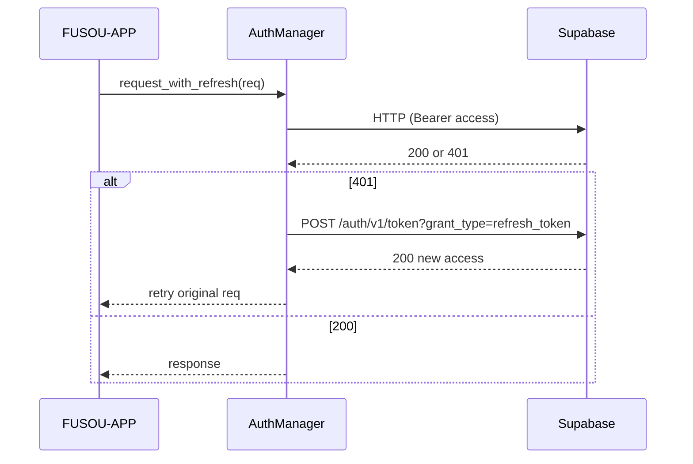
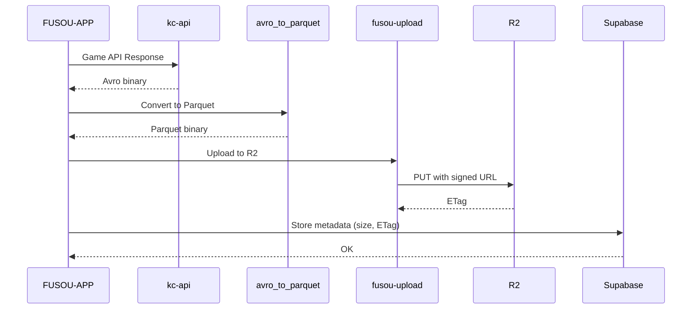
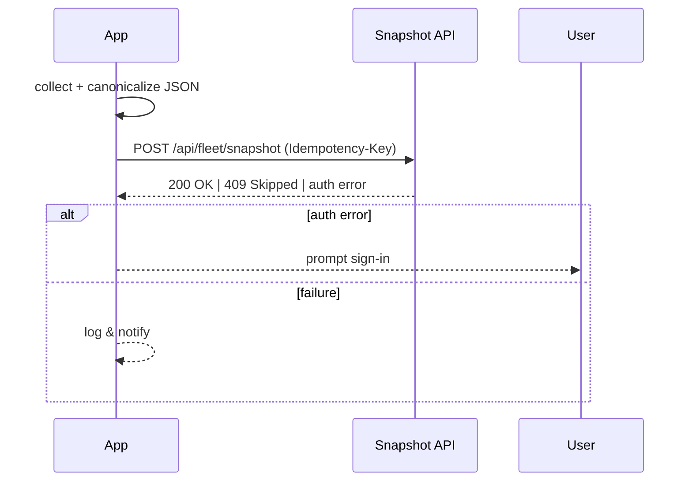
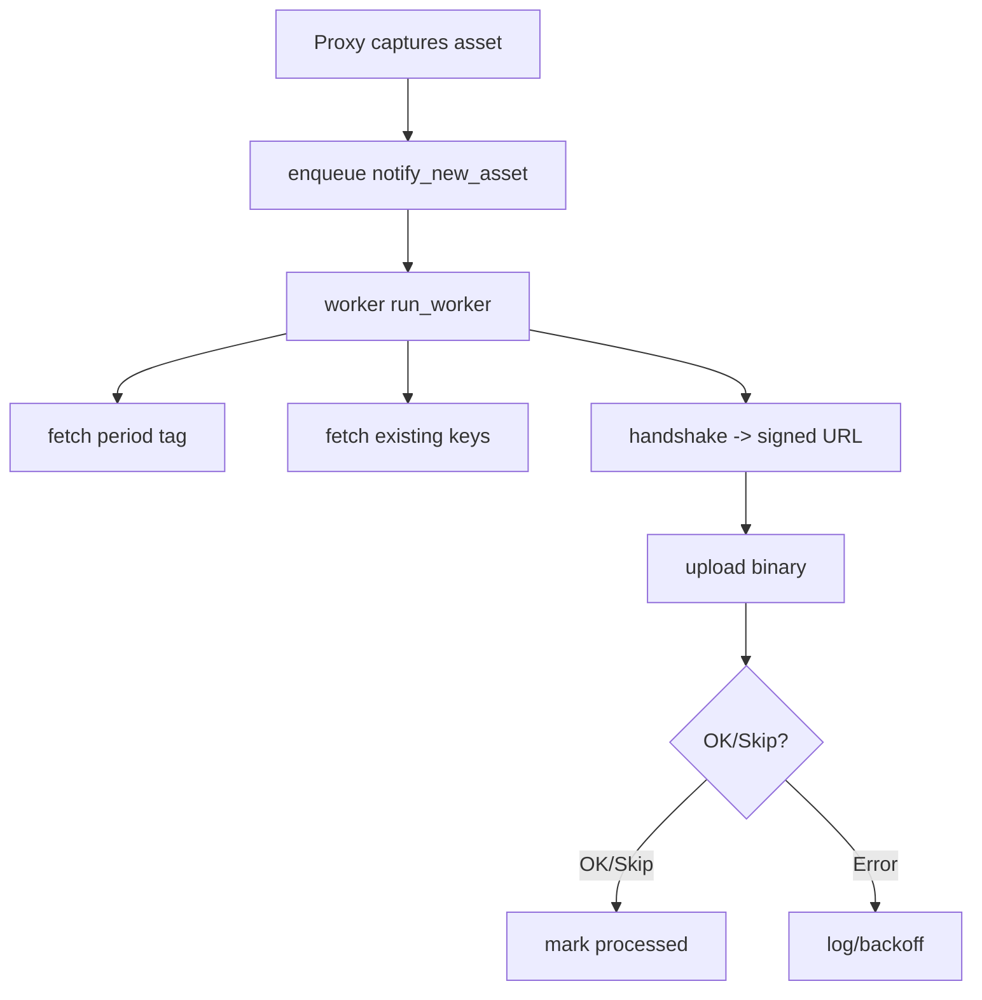
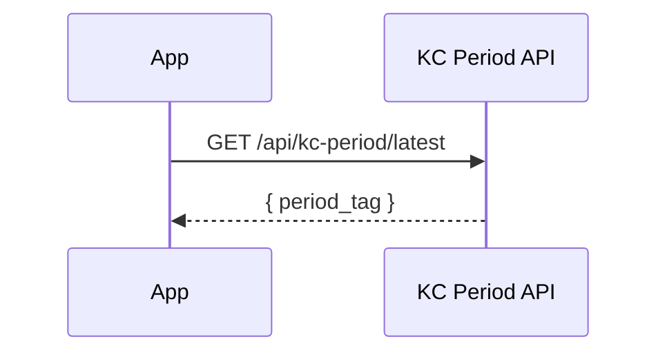
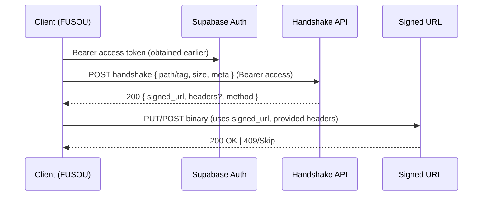
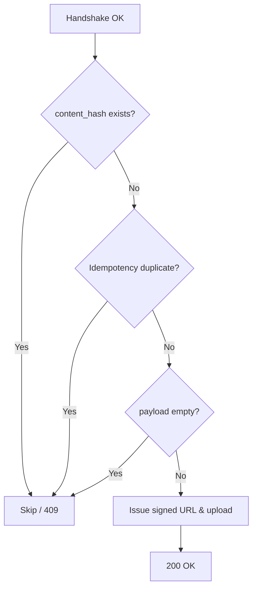

<!-- markdownlint-disable MD032 MD040 MD025 MD022 MD007 MD010 MD041 MD003 -->

# FUSOU API Overview

クライアント(Tauri)とバックエンド(Supabase / Cloudflare R2 / Google Drive / Cloudflare Pages Workers)の連携仕様を整理します。署名付きURL、ハッシュ計算、リクエスト/レスポンスフローを明示します。

## 目次
- 認証: Supabase Auth (リフレッシュ/再送フロー)
- ストレージ: R2 (Parquetバッチ, 署名付きURL), Google Drive (Avro), Local FS (Avro)
- データ種別別フロー: battle_data, fleet snapshot, asset-sync
- 補助API: KC Period
- 呼び出しタイミングまとめ

---

## 認証: Supabase Auth API
- 実装: `fusou-auth/src/manager.rs`, `FUSOU-APP/src-tauri/src/auth/supabase.rs`
- 動作: 401時のみリフレッシュを1回試行し、成功すれば元リクエスト再送。
- 保存: Access/Refresh Token を `~/.fusou/session.json` (FileStorage)。クレデンシャルはビルド時 `option_env!`。



---

## ストレージ (プロバイダー別)

### R2 (共有クラウド, Parquet, 署名付きURL)
- 実装: `src-tauri/src/storage/providers/r2/provider.rs`
- 対象: ゲームデータのパーケット化・アップロード
- フロー:
  1. `kc-api` で API データを Avro に変換
  2. `kc_api_database::avro_to_parquet` で Avro → Parquet に変換
  3. Uploader で R2 にアップロード（署名付き URL 経由）
  4. Supabase メタデータ記録（サイズ、ETag、圧縮率など）
- コンパクション: Cloudflare Workflow 上で Parquet 断片をマージ（Thrift parser で実装、WASM 不要）



### Google Drive (クラウドバックアップ, Avro)
- 実装: `src-tauri/src/storage/providers/cloud_table_provider.rs`
- 対象: `port_table` / `get_data_table`
- フォーマット: Avro のまま `period_data/{period}/.../{table}.avro`
- 初期化: Startup 時にトークンをロード（詳細は下記の認証参照）
- アップロード: Google Drive API v3 経由

### Local FS (ローカルバックアップ, Avro)
- 実装: `src-tauri/src/storage/providers/local_fs/provider.rs`
- 対象: `port_table` / `get_data_table`
- フォーマット: Avro をローカル保存

---

## データ種別別フロー

### battle_data (port/battle系テーブル)
- フロー: `write_port_table` が Local FS / Google Drive / R2 へ同時呼び出し。
- R2保存設計（蓄積＋非上書）:
  - キー形式: **可変キー** `battle_data/{dataset_id}/{table}/{YYYYMMDDHHmmss}-{uuid}.parquet`（上書き防止）
  - アップロード: 署名付きURL（2段階）で Parquet/バイナリを送信
  - インデックス: D1（`BATTLE_INDEX_DB`）へ `battle_files` テーブルに断片メタを記録
    - `key`, `dataset_id`, `table`, `size`, `etag`, `uploaded_at`, `content_hash`, `uploaded_by`
  - 参照API: D1をクエリし、最新/期間指定で一覧取得（短期キャッシュ付与）
- ハッシュ: `fusou-upload/Uploader` がSHA-256を計算し、`content_hash`をhandshakeに付与して送信
- コンパクション: Supabase RPC＋ワークフロー側で、期間窓の断片一覧を取得→マージ→新キーへ成果物保存
- Local/Drive: Avro個別 `period/transaction/{maparea}-{mapinfo}/{table}.avro`（従来通り）

### fleet snapshot
- 実装: `src-tauri/src/storage/snapshot.rs`
- エンドポイント: `POST <snapshot_endpoint>` (例: `https://r2-parquet.pages.dev/api/fleet/snapshot`)
- 署名付きURL: Uploader内でハンドシェイク→署名URL取得→本体送信
- ペイロード: 艦隊/装備/アイテムをJSON化しキー順ソートで正規化。`Idempotency-Key: UUID` 付与。
- ハッシュ: `fusou-upload/Uploader` がSHA-256を計算し、`content_hash`をhandshakeに付与して送信します。



### asset-sync (静的アセット, 署名付きURL)
- 実装: `proxy-https/src/asset_sync.rs`
- 動作: プロキシで保存 → キュー(100) → ワーカーがperiod/既存キーキャッシュを参照し、handshakeで署名URL取得してアップロード。
- ハッシュ: `fusou-upload/Uploader` がSHA-256を計算し、`content_hash`をhandshakeに付与して送信します。



### KC Period (タグ取得)
- 実装: `src-tauri/src/auth/supabase.rs`
- エンドポイント: `GET /api/kc-period/latest`
- 用途: 保存パスやタグ付け。失敗時はフォールバックタグを使用。



---

## リクエスト/レスポンス要約（署名付きURL系）
- 対象: R2 port_table (`r2/provider.rs`), fleet snapshot (`storage/snapshot.rs`), asset-sync (`proxy-https/src/asset_sync.rs`)
- 共通フロー: 「handshakeで署名付きURLを取得」→「署名URLにバイナリを送信」の2段階。



- Handshake Request: JSON (path/tag, size, metadata, `content_hash`)。Bearer Access Token必須。
- Handshake Response: `signed_url` と必要ヘッダを返す。
- Upload Request: `signed_url` に対しPUT/POSTバイナリ（署名に認可情報が含まれる）。
- Upload Response: 200 OK または 409/Skip。

### Idempotency-Key と重複回避
- 用途: スナップショットの「同一要求の二重送信」を抑止（短時間の再試行でも重複保存しない）。
- 実装: `snapshot.rs` で `Idempotency-Key: UUID` をヘッダに設定。`Uploader`がhandshake/本体アップロードの両方にヘッダを付与。
- サーバ設定の一例: `SNAPSHOT_TOKEN_TTL_SECONDS=300`（約5分の有効期間）。

### Skip / 409 の条件（代表例）
- 署名付きURL系のサーバは以下の条件で「保存スキップ or 409」を返します。
    - 同一`content_hash`が既に存在する（重複データ）
    - `Idempotency-Key`が有効期間内に再送され、同一要求と判断された
    - スナップショット: ペイロードサイズがしきい値以下（例: `<=100B` は空とみなしスキップ）
    - サーバポリシーにより「タグごとに最新N件のみ保持」時の整理で古いものが削除される（保存成功後のクリーンアップ）



## ハッシュ計算に関する現状
- battle_data (port_table): `Uploader`がバイナリのSHA-256を計算し、`content_hash`としてhandshakeに付与。
- fleet snapshot: 正規化したJSONバイトのSHA-256を`Uploader`が計算し、`content_hash`として送信。
- asset-sync: 取得アセットのSHA-256を`Uploader`が計算し、`content_hash`として送信。
- battle_data: R2保存済み各断片のSHA-256を計算・記録し、後段コンパクション時に検証。

---

## Battle Data REST API

### POST /battle-data/upload (2段階署名付きURL)

#### フェーズ1: ハンドシェイク

```
POST /api/battle-data/upload
Content-Type: application/json
Authorization: Bearer <supabase_access_token>

{
  "dataset_id": "dataset-123",
  "table": "port",
  "file_size": "1048576",
  "content_hash": "sha256_hex_string"
}
```

レスポンス:

```json
{
  "uploadUrl": "https://pages.dev/api/battle-data/upload?token=...&expires=...&signature=...",
  "expiresAt": "2025-12-17T05:05:00Z",
  "fields": {...}
}
```

#### フェーズ2: 本体アップロード
- クエリ `token`, `expires`, `signature` を保持したまま、バイナリストリームをPUTまたはPOST
- 署名検証後、R2へ可変キーで保存＋D1へ索引追記

### GET /battle-data/chunks

期間指定で断片メタ一覧を取得。

```
GET /api/battle-data/chunks?dataset_id=dataset-123&table=port&from=2025-12-16T00:00:00Z&to=2025-12-17T00:00:00Z&limit=100&offset=0
Authorization: Bearer <supabase_access_token>
```

レスポンス:

```json
{
  "chunks": [
    {
      "key": "battle_data/dataset-123/port/20251217050000-uuid.parquet",
      "dataset_id": "dataset-123",
      "table": "port",
      "size": 1048576,
      "etag": "...",
      "uploaded_at": "2025-12-17T05:00:00Z",
      "content_hash": "sha256_hex"
    },
    ...
  ],
  "count": 42
}
```

**キャッシュ**: `Cache-Control: public, max-age=60, stale-while-revalidate=300`

### GET /battle-data/latest

最新断片メタを取得。

```
GET /api/battle-data/latest?dataset_id=dataset-123&table=port
Authorization: Bearer <supabase_access_token>
```

レスポンス:

```json
{
  "latest": {
    "key": "battle_data/dataset-123/port/20251217050000-uuid.parquet",
    "size": 1048576,
    "etag": "...",
    "uploaded_at": "2025-12-17T05:00:00Z",
    "content_hash": "sha256_hex"
  }
}
```

**キャッシュ**: `Cache-Control: public, max-age=60, stale-while-revalidate=300`

---

## 呼び出しタイミングまとめ
- `write_port_table`: Local FS / Google Drive / R2 を並列実行。R2 のみ Parquet 変換。
- `write_get_data_table`: Local FS / Google Drive のみ。R2 は即スキップ。
- コンパクション: R2 保存済みデータセットは Cloudflare Workflow により定期的に最適化（サーバー側）。
  - ワークフロー: `/battle-data/chunks` で期間内の断片一覧取得→マージ→成果物を新キーで保存→D1へ登録。

---

## 運用上のポイント
- R2アップロードには `allow_data_to_shared_cloud=true` と `upload_endpoint` 設定が必須。
- Google Driveはビルド時埋め込みのクライアントID/シークレットを使用。リフレッシュトークン前提。
- Parquet変換はCPU負荷が高いため `spawn_blocking` で実行。
- Avro/Parquetの型整合性は`AvroToParquetConverter`で型ごとにArrayBuilderを選択する実装で担保。
