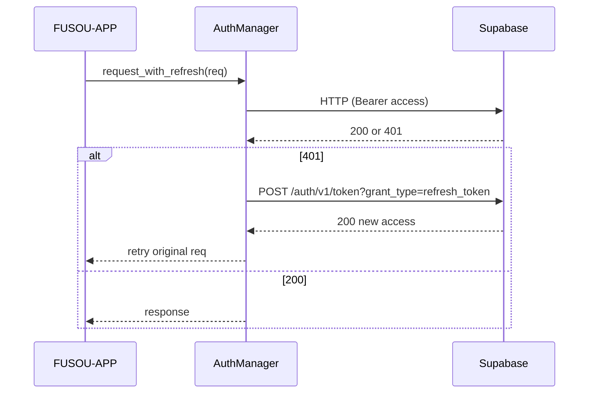
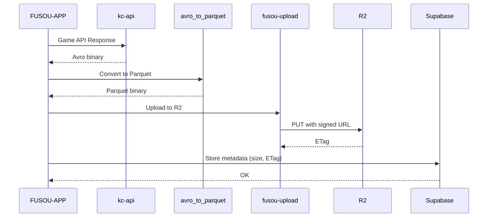
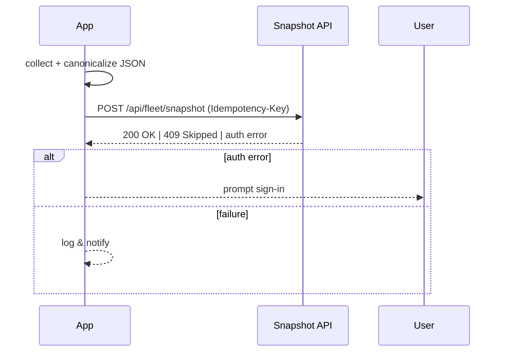
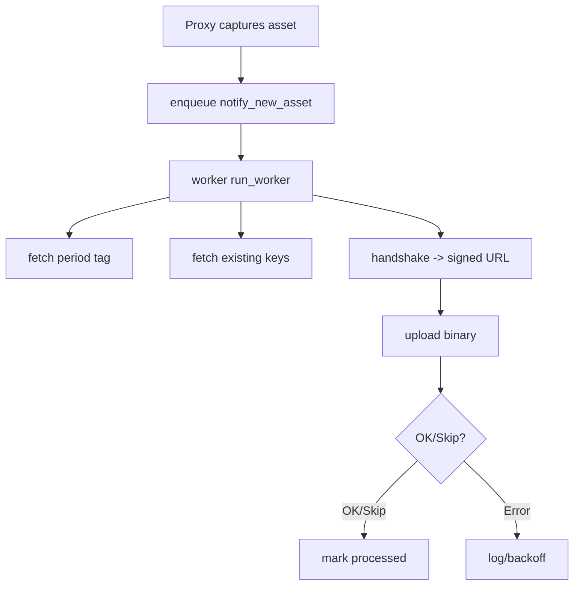
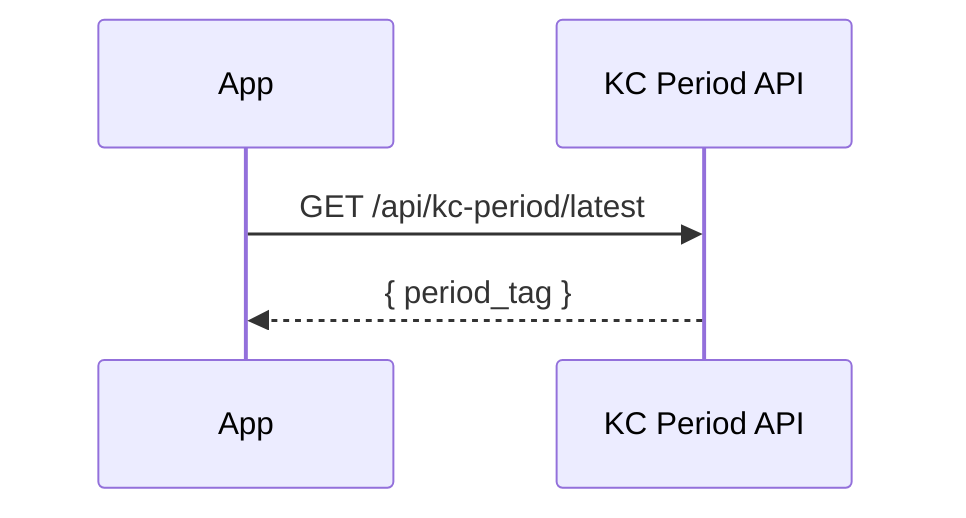
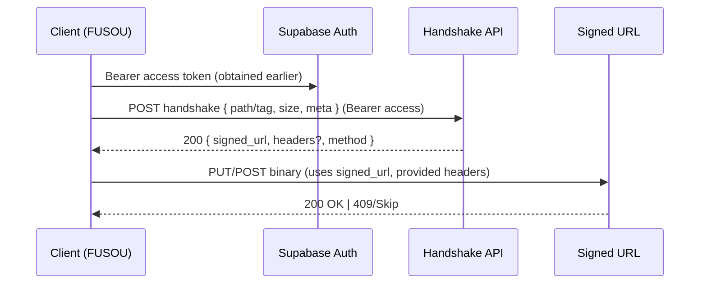
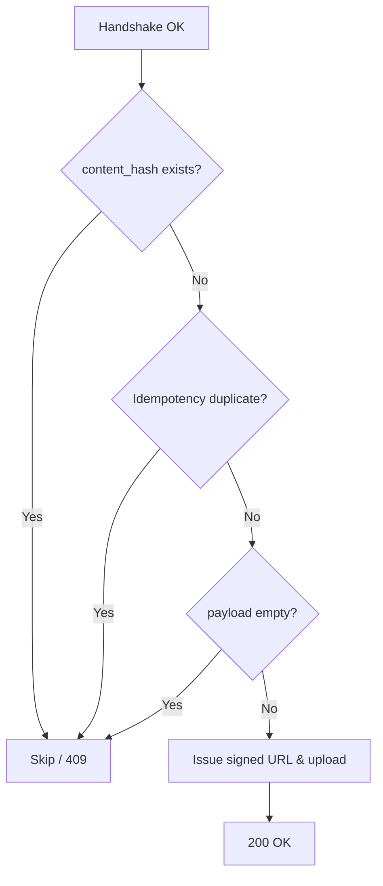

<!-- markdownlint-disable MD032 MD040 MD025 MD022 MD007 MD010 MD041 MD003 -->

# FUSOU API Overview

クライアント(Tauri)とバックエンド(Supabase / Cloudflare R2 / Google Drive / Cloudflare Pages Workers)の連携仕様を整理します。署名付き URL、ハッシュ計算、リクエスト/レスポンスフローを明示します。

## 目次

- 認証: Supabase Auth (リフレッシュ/再送フロー)
- ストレージ: R2 (Avro OCF バッチ, 署名付き URL), Google Drive (Avro), Local FS (Avro)
- データ種別別フロー: battle_data, fleet snapshot, asset-sync
- 補助 API: KC Period
- 呼び出しタイミングまとめ

---

## 認証: Supabase Auth API

- 実装: `fusou-auth/src/manager.rs`, `FUSOU-APP/src-tauri/src/auth/supabase.rs`
- 動作: 401 時のみリフレッシュを 1 回試行し、成功すれば元リクエスト再送。
- 保存: Access/Refresh Token を `~/.fusou/session.json` (FileStorage)。クレデンシャルはビルド時 `option_env!`。


```mermaid
sequenceDiagram
    participant App as FUSOU-APP
    participant Auth as AuthManager
    participant Supabase
    App->>Auth: request_with_refresh(req)
    Auth->>Supabase: HTTP (Bearer access)
    Supabase-->>Auth: 200 or 401
    alt 401
        Auth->>Supabase: POST /auth/v1/token?grant_type=refresh_token
        Supabase-->>Auth: 200 new access
        Auth-->>App: retry original req
    else 200
        Auth-->>App: response
    end
```

---

## ストレージ (プロバイダー別)

### R2 (共有クラウド, Avro OCF, 署名付き URL)

- 実装: `src-tauri/src/storage/providers/r2/provider.rs`
- 対象: ゲームデータのパーケット化・アップロード
- フロー:
  1. `kc-api` で API データを Avro に変換
  2. クライアント側で Avro OCF に変換
  3. Uploader で R2 にアップロード（署名付き URL 経由）
  4. メタデータは D1 (buffer_logs, archived_files) に記録
- コンパクション: Cloudflare Workflow 上で Avro OCF 断片をマージ（D1/R2 使用）


```mermaid
sequenceDiagram
    participant App as FUSOU-APP
    participant KcApi as kc-api
    participant Converter as avro_to_parquet
    participant Uploader as fusou-upload
    participant R2
    participant Supabase

    App->>KcApi: Game API Response
    KcApi-->>App: Avro binary
    App->>Converter: Convert to Parquet
    Converter-->>App: Parquet binary
    App->>Uploader: Upload to R2
    Uploader->>R2: PUT with signed URL
    R2-->>Uploader: ETag
    App->>Supabase: Store metadata (size, ETag)
    Supabase-->>App: OK
```

### Google Drive (クラウドバックアップ, Avro)

- 実装: `src-tauri/src/storage/providers/cloud_table_provider.rs`
- 対象: `port_table` / `get_data_table`
- フォーマット: Avro のまま `period_data/{period}/.../{table}.avro`
- 初期化: Startup 時にトークンをロード（詳細は下記の認証参照）
- アップロード: Google Drive API v3 経由

### Local FS (ローカルバックアップ, Avro)

- 実装: `src-tauri/src/storage/providers/local_fs/provider.rs`
- 対象: `port_table` / `get_data_table`
- フォーマット: Avro をローカル保存

---

## データ種別別フロー

### battle_data (port/battle 系テーブル)

- フロー: `write_port_table` が Local FS / Google Drive / R2 へ同時呼び出し。
- R2 保存設計（蓄積＋非上書）:
  - キー形式: **可変キー** `battle_data/{dataset_id}/{table}/{YYYYMMDDHHmmss}-{uuid}.parquet`（上書き防止）
  - アップロード: 署名付き URL（2 段階）で Avro OCF/バイナリを送信
  - インデックス: D1（`BATTLE_INDEX_DB`）へ `battle_files` テーブルに断片メタを記録
    - `key`, `dataset_id`, `table`, `size`, `etag`, `uploaded_at`, `content_hash`, `uploaded_by`
  - 参照 API: D1 をクエリし、最新/期間指定で一覧取得（短期キャッシュ付与）
- ハッシュ: `fusou-upload/Uploader` が SHA-256 を計算し、`content_hash`を handshake に付与して送信
- コンパクション: Cloudflare Queue ＋ Workflow 側で、期間窓の断片一覧を取得 → マージ → 新キーへ成果物保存 (D1)
- Local/Drive: Avro 個別 `period/transaction/{maparea}-{mapinfo}/{table}.avro`（従来通り）

### fleet snapshot

- 実装: `src-tauri/src/storage/snapshot.rs`
- エンドポイント: `POST <api_base>/api/fleet/snapshot`
- 署名付き URL: Uploader 内でハンドシェイク → 署名 URL 取得 → 本体送信
- ペイロード: 艦隊/装備/アイテムを JSON 化しキー順ソートで正規化。`Idempotency-Key: UUID` 付与。
- ハッシュ: `fusou-upload/Uploader` が SHA-256 を計算し、`content_hash`を handshake に付与して送信します。


```mermaid
sequenceDiagram
    participant App
    participant Snap as Snapshot API
    App->>App: collect + canonicalize JSON
    App->>Snap: POST /api/fleet/snapshot (Idempotency-Key)
    Snap-->>App: 200 OK | 409 Skipped | auth error
    alt auth error
        App-->>User: prompt sign-in
    else failure
        App-->>App: log & notify
    end
```

### asset-sync (静的アセット, 署名付き URL)

- 実装: `proxy-https/src/asset_sync.rs`
- 動作: プロキシで保存 → キュー(100) → ワーカーが period/既存キーキャッシュを参照し、handshake で署名 URL 取得してアップロード。
- ハッシュ: `fusou-upload/Uploader` が SHA-256 を計算し、`content_hash`を handshake に付与して送信します。


```mermaid
flowchart TD
    A[Proxy captures asset]
    B[enqueue notify_new_asset]
    C[worker run_worker]
    D[fetch period tag]
    E[fetch existing keys]
    F[handshake -> signed URL]
    G[upload binary]
    H{OK/Skip?}
    I[mark processed]
    J[log/backoff]

    A --> B --> C
    C --> D
    C --> E
    C --> F --> G --> H
    H -->|OK/Skip| I
    H -->|Error| J
```

### KC Period (タグ取得)

- 実装: `src-tauri/src/auth/supabase.rs`
- エンドポイント: `GET /api/kc-period/latest`
- 用途: 保存パスやタグ付け。失敗時はフォールバックタグを使用。


```mermaid
sequenceDiagram
    participant App
    participant Period as KC Period API
    App->>Period: GET /api/kc-period/latest
    Period-->>App: { period_tag }
```

---

## リクエスト/レスポンス要約（署名付き URL 系）

- 対象: R2 port_table (`r2/provider.rs`), fleet snapshot (`storage/snapshot.rs`), asset-sync (`proxy-https/src/asset_sync.rs`)
- 共通フロー: 「handshake で署名付き URL を取得」→「署名 URL にバイナリを送信」の 2 段階。


```mermaid
sequenceDiagram
        participant Client as Client (FUSOU)
        participant Auth as Supabase Auth
        participant HS as Handshake API
        participant Signed as Signed URL

        Client->>Auth: Bearer access token (obtained earlier)
        Client->>HS: POST handshake { path/tag, size, meta } (Bearer access)
        HS-->>Client: 200 { signed_url, headers?, method }
        Client->>Signed: PUT/POST binary (uses signed_url, provided headers)
        Signed-->>Client: 200 OK | 409/Skip
```

- Handshake Request: JSON (path/tag, size, metadata, `content_hash`)。Bearer Access Token 必須。
- Handshake Response: `signed_url` と必要ヘッダを返す。
- Upload Request: `signed_url` に対し PUT/POST バイナリ（署名に認可情報が含まれる）。
- Upload Response: 200 OK または 409/Skip。

### Idempotency-Key と重複回避

- 用途: スナップショットの「同一要求の二重送信」を抑止（短時間の再試行でも重複保存しない）。
- 実装: `snapshot.rs` で `Idempotency-Key: UUID` をヘッダに設定。`Uploader`が handshake/本体アップロードの両方にヘッダを付与。
- サーバ設定の一例: `SNAPSHOT_TOKEN_TTL_SECONDS=300`（約 5 分の有効期間）。

### Skip / 409 の条件（代表例）

- 署名付き URL 系のサーバは以下の条件で「保存スキップ or 409」を返します。
  - 同一`content_hash`が既に存在する（重複データ）
  - `Idempotency-Key`が有効期間内に再送され、同一要求と判断された
  - スナップショット: ペイロードサイズがしきい値以下（例: `<=100B` は空とみなしスキップ）
  - サーバポリシーにより「タグごとに最新 N 件のみ保持」時の整理で古いものが削除される（保存成功後のクリーンアップ）


```mermaid
flowchart TD
        A[Handshake OK] --> B{content_hash exists?}
        B -->|Yes| S[Skip / 409]
        B -->|No| C{Idempotency duplicate?}
        C -->|Yes| S
        C -->|No| D{payload empty?}
        D -->|Yes| S
        D -->|No| U[Issue signed URL & upload]
        U --> E[200 OK]
```

## ハッシュ計算に関する現状

- battle_data (port_table): `Uploader`がバイナリ(Avro)の SHA-256 を計算し、`content_hash`として handshake に付与。
- fleet snapshot: 正規化した JSON バイトの SHA-256 を`Uploader`が計算し、`content_hash`として送信。
- asset-sync: 取得アセットの SHA-256 を`Uploader`が計算し、`content_hash`として送信。
- battle_data: R2 保存済み各断片の SHA-256 を計算・記録し、後段コンパクション時に検証。

---

## Battle Data REST API

### POST /battle-data/upload (2 段階署名付き URL)

#### フェーズ 1: ハンドシェイク

```
POST /api/battle-data/upload
Content-Type: application/json
Authorization: Bearer <supabase_access_token>

{
  "dataset_id": "dataset-123",
  "table": "port",
  "file_size": "1048576",
  "content_hash": "sha256_hex_string",
  "binary": true,
  "path": "path/to/file.avro"
}
```

レスポンス:

```json
{
  "uploadUrl": "https://pages.dev/api/battle-data/upload?token=...&expires=...&signature=...",
  "expiresAt": "2025-12-17T05:05:00Z",
  "fields": {...}
}
```

#### フェーズ 2: 本体アップロード (Avro OCF)

- クエリ `token`, `expires`, `signature` を保持したまま、バイナリストリームを PUT または POST
- 署名検証後、キュー(`COMPACTION_QUEUE`)へエンキューされ、Workflow が処理します。

### GET /battle-data/chunks

期間指定で断片メタ一覧を取得。

```
GET /api/battle-data/chunks?dataset_id=dataset-123&table=port&from=2025-12-16T00:00:00Z&to=2025-12-17T00:00:00Z&limit=100&offset=0
Authorization: Bearer <supabase_access_token>
```

レスポンス (D1 参照):

```json
{
  "chunks": [
    {
      "key": "battle_data/dataset-123/port/20251217050000-uuid.avro",
      "dataset_id": "dataset-123",
      "table": "port",
      "size": 1048576,
      "uploaded_at": "2025-12-17T05:00:00Z",
      "record_count": 120
    },
    ...
  ],
  "count": 42
}
```

**キャッシュ**: `Cache-Control: public, max-age=60, stale-while-revalidate=300`

### GET /battle-data/latest

最新断片メタを取得。

```
GET /api/battle-data/latest?dataset_id=dataset-123&table=port
Authorization: Bearer <supabase_access_token>
```

レスポンス:

```json
{
  "latest": {
    "key": "battle_data/dataset-123/port/20251217050000-uuid.avro",
    "size": 1048576,
    "uploaded_at": "2025-12-17T05:00:00Z",
    "record_count": 50
  }
}
```

**キャッシュ**: `Cache-Control: public, max-age=60, stale-while-revalidate=300`

---

## 呼び出しタイミングまとめ

- `write_port_table`: Local FS / Google Drive / R2 を並列実行。R2 へは Avro OCF 形式でアップロード。
- `write_get_data_table`: Local FS / Google Drive のみ。R2 は即スキップ。
- コンパクション: R2 保存済みデータセットは Cloudflare Workflow により定期的に最適化（サーバー側）。
  - ワークフロー: `/battle-data/chunks` で期間内の断片一覧取得 → マージ → 生成された Avro ファイルを新キーで保存 →D1 (archived_files) へ登録。

---

## 運用上のポイント

- R2 アップロードには `allow_data_to_shared_cloud=true` と `upload_endpoint` 設定が必須。
- Google Drive はビルド時埋め込みのクライアント ID/シークレットを使用。リフレッシュトークン前提。
- Avro 変換はクライアントサイドで行われます。
- Avro OCF フォーマットの整合性はサーバーサイド（Queue/Workflow）で検証されます。
