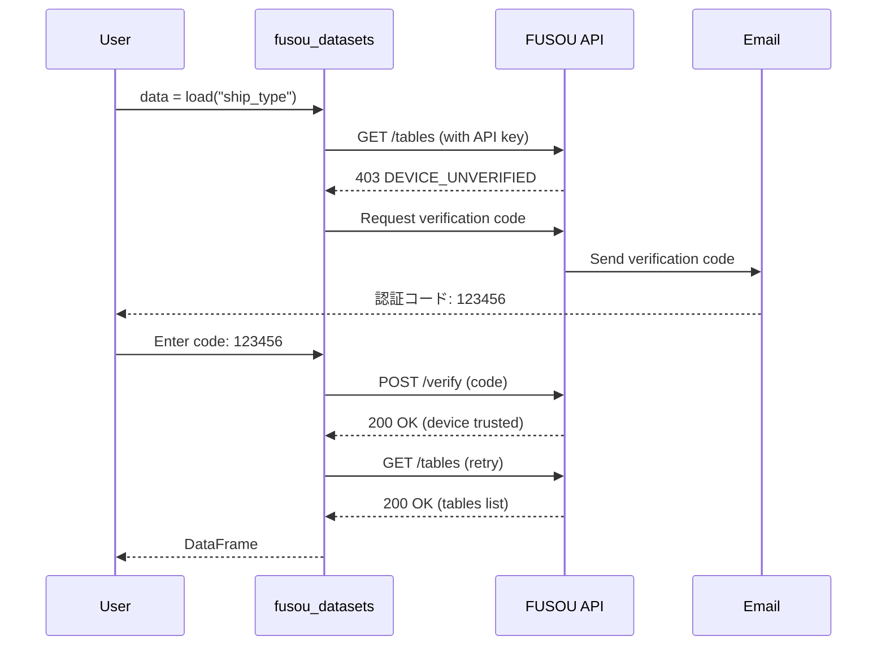

# fusou-datasets Authentication

fusou-datasets は、データへのアクセスを保護するために **API キー** と **Device Trust 認証** の 2 段階認証を採用しています。

## API キーの取得

1. [FUSOU ウェブサイト](https://fusou.dev) にアクセス
2. アカウントを作成またはログイン
3. [API キー管理ページ](/dashboard/api-keys) でキーを発行。
   - 詳しい手順は [API キー管理ガイド](../dashboard/api_keys) を参照してください。

## API キーの設定方法

### 方法 1: 環境変数（推奨）

最も安全で推奨される方法です。

**Linux/macOS:**

```bash
export FUSOU_API_KEY="your_api_key_here"
```

永続化する場合は `~/.bashrc` または `~/.zshrc` に追加:

```bash
echo 'export FUSOU_API_KEY="your_api_key_here"' >> ~/.bashrc
source ~/.bashrc
```

**Windows (PowerShell):**

```powershell
$env:FUSOU_API_KEY = "your_api_key_here"
```

永続化する場合:

```powershell
[System.Environment]::SetEnvironmentVariable("FUSOU_API_KEY", "your_api_key_here", "User")
```

### 方法 2: 設定ファイルに保存

API キーをローカルに永続保存する場合:

```python
import fusou_datasets

# API キーを保存（~/.fusou_loader/settings.json に保存）
fusou_datasets.save_api_key("your_api_key_here")
```

> [!CAUTION]
> 設定ファイルに保存した API キーは平文で保存されます。共有マシンでは環境変数の使用を推奨します。

### 方法 3: プログラム内で設定

一時的に設定する場合（セッション終了で消失）:

```python
import fusou_datasets

fusou_datasets.configure(api_key="your_api_key_here")
```

カスタム API URL を使用する場合:

```python
fusou_datasets.configure(
    api_key="your_api_key_here",
    api_url="https://custom-api.example.com/api/data-loader"
)
```

## 優先順位

API キーは以下の順序で検索されます:

1. `configure()` で設定した値
2. 環境変数 `FUSOU_API_KEY`
3. 設定ファイル `~/.fusou_loader/settings.json`

## Device Trust 認証

初回アクセス時、デバイスの認証が必要です。

### 認証フロー



### 認証コードの入力

初回リクエスト時に以下のプロンプトが表示されます:

```
==================================================
DEVICE VERIFICATION / デバイス認証
Check your email for the verification code.
メールで認証コードを確認してください。
==================================================
Code (1/3):
```

API キーに紐づいたメールアドレスに届いた 6 桁のコードを入力してください。

> [!NOTE]
> 認証は 3 回まで試行可能です。失敗するとエラーが発生します。

## Google Colab での自動認証

Google Colab では、Google アカウントを使用した自動認証がサポートされています。

```python
import fusou_datasets

import fusou_datasets
from google.colab import userdata

# 推奨: Secrets (鍵アイコン) に "FUSOU_API_KEY" を登録して読み込む
fusou_datasets.configure(api_key=userdata.get('FUSOU_API_KEY'))

# データを取得 - Google認証が自動で行われる
df = fusou_datasets.load("ship_type")
```

### 自動認証の条件

- Google Colab 環境で実行していること
- API キーに紐づいたメールアドレスと Google アカウントのメールアドレスが一致すること

メールアドレスが一致しない場合は、通常のコード認証にフォールバックします:

```
[fusou_datasets] Attempting Colab verification with: user@gmail.com
✗ Google account (user@gmail.com) does not match API key email.
  Falling back to code verification...
```

## クライアント ID

各デバイスには一意のクライアント ID が割り当てられます。

### クライアント ID の確認

```python
import fusou_datasets

client_id = fusou_datasets.get_client_id()
print(client_id)
# 出力例: xxxxxxxx-xxxx-xxxx-xxxx-xxxxxxxxxxxx
```

CLI からも確認できます:

```bash
fusou-datasets --client-id
```

### 保存場所

クライアント ID は `~/.fusou_loader/settings.json` に保存されます:

```json
{
  "client_id": "xxxxxxxx-xxxx-xxxx-xxxx-xxxxxxxxxxxx",
  "api_key": "your_api_key_here"
}
```

> [!WARNING] > `settings.json` を削除すると新しいクライアント ID が生成され、再度デバイス認証が必要になります。

## トラブルシューティング

### `AuthenticationError: API key not configured`

API キーが設定されていません。上記のいずれかの方法で設定してください。

### `AuthenticationError: Invalid API key`

API キーが無効です。FUSOU ウェブサイトで正しいキーを確認してください。

### `VerificationError: Max attempts exceeded`

認証コードの入力に 3 回失敗しました。メールアドレスを確認し、もう一度お試しください。

## 次のステップ

- [API リファレンス](./api_reference) - 全関数の詳細
- [サンプルコード](./examples) - 実践的な使用例
