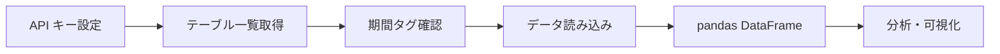

# fusou-datasets Getting Started

fusou-datasets は、FUSOU プロジェクトが収集・公開する艦これ研究データセットに簡単にアクセスするための Python ライブラリです。

## fusou-datasets とは？

- **目的**: 艦これのゲームデータを pandas DataFrame として簡単に取得
- **対象者**: データ分析や研究を行いたいユーザー
- **特徴**: Device Trust 認証によるセキュアなアクセス

## 3 分で始める

### 1. インストール

```bash
pip install fusou-datasets
```

### 2. API キーを設定

```bash
export FUSOU_API_KEY="your_api_key_here"
```

> [!TIP]
> API キーは [FUSOU ウェブサイト](https://fusou.dev) で取得できます。

### 3. データを取得

```python
import fusou_datasets

# 利用可能なテーブル一覧を確認
tables = fusou_datasets.list_tables()
print(tables)

# 艦種データを取得
df = fusou_datasets.load("ship_type")
print(df.head())
```

## Google Colab で実行

Google Colab では、アカウント認証が自動化されています。

[](https://colab.research.google.com)

```python
# Colab用セットアップ
!pip install fusou-datasets

import fusou_datasets

# API キーを設定（Secretsから読み込む場合）
from google.colab import userdata
fusou_datasets.configure(api_key=userdata.get('FUSOU_API_KEY'))

# データを取得
df = fusou_datasets.load("ship_type")
df.head()
```

> [!NOTE]
> Google Colab では、Google アカウントのメールアドレスが API キーと一致する場合、デバイス認証が自動で行われます。

## 基本的なデータ取得フロー



## 次のステップ

- [インストール詳細](./installation) - 詳しいインストール方法
- [認証設定](./authentication) - API キー・デバイス認証の詳細
- [API リファレンス](./api_reference) - 全関数の完全リファレンス
- [サンプルコード](./examples) - 実践的なデータ分析例
