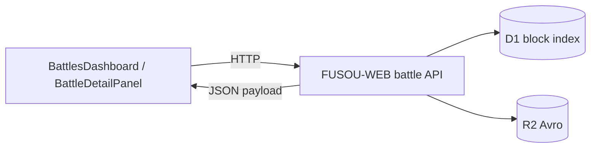
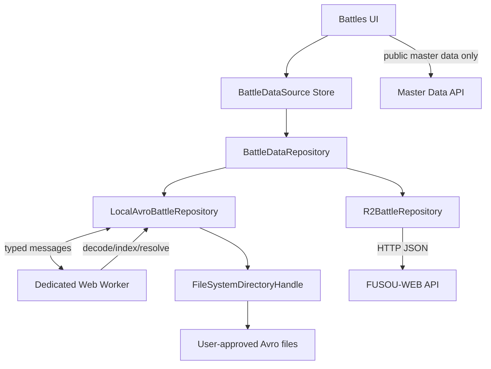

# FUSOU-WEB ブラウザ完結ローカル Avro 表示 実装計画書 (2026-08-11)

- 更新日: 2026-08-11
- 対象: `packages/FUSOU-WEB`, `docs`
- 目的: WEB 利用者がブラウザで明示的に許可したローカルディレクトリの FUSOU-APP 生成 Avro を、サーバーへ送信せず、R2 データと同じ一覧・統計・ドロップ・詳細表示へ接続する
- 品質基準: 本書だけを入力として、追加のアーキテクチャ判断を行わず段階実装できること

---

## 1. 要件の確定

### 1.1 ユーザー要求

1. WEB 利用者本人がブラウザ UI からディレクトリを選択する。
2. ブラウザはユーザーが許可したディレクトリ以下だけを読む。
3. 対象は FUSOU-APP がローカル保存した Avro ディレクトリである。
4. ローカル Avro の読み取り、decode、index、関連解決はブラウザ内で完結する。
5. ローカル Avro のバイト列、デコード済みレコード、ファイル名、絶対パス相当情報を FUSOU サーバーへ送信しない。
6. R2 とローカルで同じ表示コンポーネントを使用する。
7. ローカルモードでは、ユーザーがディレクトリを選択してアクセスを許可するまでデータを読み込まない。
8. R2 モードは現行のサーバー API 経路を維持する。

### 1.2 Hard Rules

1. `node:fs`、サーバー上のパス、環境変数、cookie によるローカルファイル読み込みを新方式では使用しない。
2. `FileSystemDirectoryHandle` を取得できるのはユーザー操作イベントからだけとする。
3. ローカルデータ source 選択時に `/api/battle-data/global/*` へ battle record を取りに行かない。
4. ローカルのファイル内容を `fetch`、XHR、Beacon、WebSocket、フォーム送信、ログ収集へ渡さない。
5. マスターデータだけは既存の公開 API から取得してよい。battle record との区別をコード上の型で固定する。
6. 一覧と詳細で別々のローカル reader を作らない。同じ `BattleDataRepository` と同じ client-side resolver を使う。
7. `battle.uuid` だけを戦闘行識別に使用しない。出撃は `env_uuid`、戦闘行は `battle.index`、詳細参照は各参照 UUID を正とする。
8. 未知の table version、未知 schema、非対応 codec、壊れた OCF は推測して読まない。明示エラーと診断結果を表示する。
9. ローカル source のデータを shared HTTP cache、Cache Storage、サーバーキャッシュへ保存しない。
10. feature flag なしで現行 R2 経路を削除しない。

### 1.3 対象外

1. APP 生ログ (`<period>/kcsapi/<timestamp>S@<endpoint>`) のブラウザ解析。
2. ローカル Avro の R2 へのアップロード。
3. ローカルデータの共有 URL 化。
4. Safari / Firefox で File System Access API と同等の永続ディレクトリ権限を独自実装すること。
5. 初期版での DuckDB-WASM 導入。
6. Service Worker によるオフラインアプリ全体の PWA 化。

---

## 2. 現状と問題

### 2.1 現行データフロー



現行の主要実装:

1. `packages/FUSOU-WEB/src/components/features/battles/solid/BattlesDashboard.tsx`
   - mount 時に `/api/battle-data/global/summary` を取得する。
   - `/global/overview` または `/global/drops` を取得する。
2. `packages/FUSOU-WEB/src/components/features/battle-detail/solid/BattleDetailPanel.tsx`
   - `/global/overview`, `/global/latest`, `/detail` を直接取得する。
3. `packages/FUSOU-WEB/src/features/battles/data-service.ts`
   - 詳細補助データを `/global/records` から取得する。
4. `packages/FUSOU-WEB/src/server/routes/battle_data.ts`
   - R2/D1 から各 table を取得する。
   - overview と detail の関連解決・payload 組み立てを行う。
5. `packages/FUSOU-WEB/src/server/utils/avro-decoder.ts`
   - null codec の Avro OCF を JSON records に変換する純粋処理を持つが、server 配下にある。

### 2.2 現在不足しているもの

1. ブラウザの Directory Picker。
2. `FileSystemDirectoryHandle` の権限・再利用管理。
3. ブラウザ用 Avro OCF decoder。
4. main thread を塞がない decode worker。
5. ローカル table records のメモリ内 index。
6. R2 と local を統一する repository 契約。
7. overview/detail の共有 resolver。
8. detail panel と `data-service.ts` の source 非依存化。
9. ブラウザ互換性フォールバック。
10. ローカルデータ非送信を検証する E2E テスト。

### 2.3 入力ディレクトリ契約

初期版で受理する配置を次に限定する（R2 key 形式ではない）。

FUSOU-APP 由来のローカル Avro は、`fusou-storage` の local provider 契約に従う。

```text
<root>/fusou/<period_tag>/master_data/<table>.avro
<root>/fusou/<period_tag>/transaction_data/<maparea_id>-<mapinfo_no>/<table>/<timestamp>_<uuid>.avro
```

参考実装（契約の根拠）:

1. `packages/FUSOU-APP/src-tauri/src/sequence/launch.rs` (`save_path = .../FUSOU-PROXY-DATA/<period_tag>`)
2. `packages/FUSOU-PROXY/proxy-https/src/proxy_server_https.rs` (`asset_sync` による Avro 化とは独立して `kcsapi` 生ログも保存)
3. `packages/fusou-storage/src/common/path_layout.rs`
4. `packages/fusou-storage/src/common/file_naming.rs`
5. `packages/fusou-storage/src/providers/local_fs/provider.rs`

補足:

1. APP 直下の `kcsapi/<timestamp>[Q|S]@api_...` は生ログであり、本計画の local Avro 読み取り対象外。
2. `table_version` は path からは得られないため、OCF schema/metadata から抽出する。
3. `period_tag` は path の `<period_tag>` を使用し、schema 由来 period と矛盾する場合は `SCHEMA_PATH_MISMATCH` とする。
4. transaction data は map 単位 (`<maparea_id>-<mapinfo_no>`) に分割される。
5. 1 table につき複数ファイル（時系列追記）を持つ。

受理値:

- `period_tag`: `YYYY-MM-DD`
- `table`: FUSOU-WEB の `PUBLIC_RECORD_TABLES` と同じ集合
- transaction file name: `<unix_timestamp>_<uuid>.avro`
- map folder name: `<maparea_id>-<mapinfo_no>`

入力 root は `fusou` ディレクトリの直上（例: `.../FUSOU-DATABASE`）または `fusou` 自体を選択可能にする。選択したディレクトリ名や OS 上の絶対パスはアプリ要件に使用しない。

---

## 3. 採択アーキテクチャ

### 3.1 全体構成



責務:

1. UI/main thread
   - source 切替。
   - Directory Picker 呼び出し。
   - 権限状態表示。
   - repository の選択。
   - 進捗・取消・エラー表示。
2. `LocalAvroBattleRepository`
   - handle からファイル manifest を作る。
   - worker の lifecycle と request correlation を管理する。
   - R2 repository と同じ query interface を提供する。
3. Dedicated Web Worker
   - OCF header 検査。
   - decode。
   - dedupe。
   - table index 構築。
   - overview/detail/drops/records の resolver 実行。
4. Server
   - ローカル battle data には関与しない。
   - R2 mode と公開 master data の配信のみ継続する。

### 3.2 Service Worker を主処理に採択しない

Service Worker だけで実装する案は不採択とする。

理由:

1. Directory Picker はユーザー操作と画面コンテキストが必要であり、Service Worker から picker を開けない。
2. Service Worker はブラウザ判断で停止・再起動されるため、大きな dataset の常駐 index 保持先として不適切である。
3. request/response interception は便利だが、decode の進捗、取消、メモリ管理、UI エラー関連付けが複雑になる。
4. local record を擬似 HTTP Response にすると、Cache Storage や既存 fetch cache へ混入する危険が増える。
5. 現行 detail は大量の API 呼び出しを行うため、URL interception で互換化するとサーバー API の内部都合をクライアントへ固定してしまう。
6. Service Worker が controller になる初回 reload 問題が source 切替 UX を複雑にする。

### 3.3 Service Worker を使える限定範囲

将来、以下が必要になった場合だけ Phase 7 以降で検討する。

1. オフライン shell cache。
2. 静的 asset cache。
3. 同一 origin の読み取り専用仮想 endpoint が、repository interface より明確に有利だと計測で判明した場合。

この場合も Directory Picker、handle、decode/index の正本は page + Dedicated Web Worker とし、Service Worker にローカル Avro bytes を永続保存しない。

### 3.4 Dedicated Web Worker を採択する理由

1. Avro decode と index 構築で main thread を停止させない。
2. request ID、progress、cancel を明示的な message protocol で管理できる。
3. worker termination で dataset memory を確実に解放できる。
4. R2/local 共通 resolver を純粋関数として worker とテストで再利用できる。
5. Service Worker の不定 lifecycle に依存しない。

---

## 4. ブラウザ対応ポリシー

### 4.1 Primary path

Chromium 系の secure context で `window.showDirectoryPicker()` を使用する。

条件:

1. HTTPS または localhost。
2. ユーザークリック内で呼ぶ。
3. `mode: "read"` のみ。
4. 取得 handle に対し `queryPermission({ mode: "read" })` を確認する。
5. 必要時だけ `requestPermission({ mode: "read" })` をユーザー操作内で呼ぶ。

### 4.2 Fallback path

`showDirectoryPicker` 非対応ブラウザでは、次を fallback とする。

```html
<input type="file" webkitdirectory multiple>
```

制約:

1. 選択ごとに `File[]` manifest を再構築する。
2. directory handle の再利用はできない。
3. 権限永続化は行わない。
4. UI に「このブラウザでは再選択が必要」と明示する。

### 4.3 Handle 永続化

Chromium primary path では `FileSystemDirectoryHandle` を IndexedDB に保存できる実装とする。ただし保存 handle は許可そのものではない。

起動時:

1. IndexedDB から handle を取得。
2. `queryPermission` のみ実行。
3. `granted` なら「前回のディレクトリを使用」ボタンを有効化する。
4. `prompt` なら自動で `requestPermission` しない。ユーザー操作を待つ。
5. `denied` なら handle を無効表示し、再選択させる。

保存項目:

- source mode (`r2 | local-avro`)
- directory handle
- last selected period/table version
- manifest fingerprint
- UI preferences

保存禁止:

- Avro bytes
- decoded records
- OS absolute path
- battle data の JSON dump

---

## 5. データ source 抽象化

### 5.1 新規 repository 契約

追加予定:

```text
packages/FUSOU-WEB/src/features/battles/repository/types.ts
packages/FUSOU-WEB/src/features/battles/repository/r2-battle-repository.ts
packages/FUSOU-WEB/src/features/battles/repository/local-avro-battle-repository.ts
packages/FUSOU-WEB/src/features/battles/repository/context.tsx
```

契約:

```ts
type BattleSourceKind = "r2" | "local-avro";

type BattlePeriod = {
  periodTag: string;
  tableVersion: string;
};

type RecordQuery = {
  table: string;
  periodTag: string;
  tableVersion?: string;
  tier?: "hourly" | "daily" | "weekly" | "period";
  filter?: Record<string, unknown>;
  limitBlocks?: number;
  limitRecords?: number;
  signal?: AbortSignal;
};

interface BattleDataRepository {
  readonly kind: BattleSourceKind;
  listPeriods(table: string): Promise<BattlePeriod[]>;
  getRecords(query: RecordQuery): Promise<RecordResult>;
  getOverview(query: OverviewQuery): Promise<BattleOverviewPayload>;
  getDrops(query: DropsQuery): Promise<BattleDropsPayload>;
  getDetail(query: BattleDetailQuery): Promise<BattleDetailPayload>;
  dispose(): Promise<void>;
}
```

### 5.2 R2 repository

現行 API 呼び出しをラップするだけとし、挙動を変更しない。

対応:

- `listPeriods` -> `/api/battle-data/global/summary`
- `getRecords` -> `/api/battle-data/global/records`
- `getOverview` -> `/api/battle-data/global/overview`
- `getDrops` -> `/api/battle-data/global/drops`
- `getDetail` -> `/api/battle-data/detail`

これにより UI から直接 URL を組み立てるコードを撤去できる。

### 5.3 Local repository

1. DirectoryHandle/File manifest を受け取る。
2. manifest を worker へ登録する。
3. query を worker RPC へ変換する。
4. worker response を repository payload として返す。
5. source 切替または component dispose 時に worker を terminate する。

### 5.4 Repository の提供方法

Solid context で page 配下へ提供する。

理由:

1. `BattlesDashboard`、`BattleDetailPanel`、`data-service.ts` の source を統一する。
2. module global mutable singleton を避ける。
3. E2E/test で fake repository を注入できる。
4. source 切替時に repository lifecycle を明示できる。

`data-service.ts` は context 外の純関数呼び出しがあるため、次のどちらかに統一する。

採択:

- UI component から repository を引数として渡す。
- helper は `repository.getRecords()` を呼ぶ pure service に変更する。

非採択:

- `window` global に repository を置く。
- fetch monkey patch。
- Service Worker intercept。

---

## 6. Local Avro manifest

### 6.1 manifest entry

```ts
type LocalAvroFileEntry = {
  id: string;
  relativePath: string;
  tableVersion: string;
  periodTag: string;
   storageKind: "master_data" | "transaction_data";
   mapAreaId?: number;
   mapInfoNo?: number;
   fileTimestamp?: number;
  table: string;
  size: number;
  lastModified: number;
  fileHandle?: FileSystemFileHandle;
  file?: File;
};
```

`id` は次で決定的に作る。

```text
relativePath + "\0" + size + "\0" + lastModified
```

OS absolute path は保持しない。

### 6.2 traversal

1. page/main thread が directory tree を走査する。
2. directory/file handle の列挙中に相対 path を構築する。
3. path pattern に一致しないファイルは manifest へ入れない。
4. `.avro` 以外は読まない。
5. symlink は File System Access API の handle contract 外として追跡しない。
6. 走査中に読み取り許可を失った場合は即停止する。

### 6.3 manifest validation

読み込み開始前に次を検証する。

1. `battle` table が最低 1 ファイル存在する。
2. period/table version の組が 1 件以上ある。
3. 同じ relative path が重複しない。
4. 1 ファイル最大サイズ、全選択サイズ、ファイル数上限を確認する。
5. table version ごとの schema support を確認する。
6. `transaction_data/<map>/<table>/<timestamp>_<uuid>.avro` に一致しない Avro は除外し diagnostics に記録する。
7. map folder が `<maparea>-<mapinfo>` 形式でない場合は除外し diagnostics に記録する。

初期安全上限:

- 1 file: 256 MiB
- manifest: 100,000 files
- 1 query の decoded records: 20,000
- worker 同時 decode: 2 files

上限は定数化し、計測後に変更する。上限超過時に自動 upload や silent truncation を行わない。

---

## 7. Avro decode 設計

### 7.1 decoder の配置

現行 `src/server/utils/avro-decoder.ts` の純粋部分を次へ移す。

```text
packages/FUSOU-WEB/src/features/avro/ocf-decoder.ts
packages/FUSOU-WEB/src/features/avro/ocf-header.ts
packages/FUSOU-WEB/src/features/avro/types.ts
```

server route も共有 decoder を import する。コピーを作らない。

### 7.2 codec policy

実サンプルでは null codec を確認済みである。初期リリースの必須対応は `null` とする。

1. OCF header の `avro.codec` を必ず読む。
2. `null` 以外は decode 前に `UNSUPPORTED_CODEC` として拒否する。
3. codec を無視して decode しない。
4. 将来 codec を追加する場合は codec ごとの fixture と worker memory test を必須とする。

`@fusou/avro-wasm` は現状 validator であり、decoded records を返す API を持たないため、初期 decoder の代替にはしない。

### 7.3 schema policy

1. OCF embedded schema を解析する。
2. path から得た table/version と embedded schema の table/version を照合する。
3. `@fusou/avro-wasm` の schema matching を browser bundle で安全に初期化できることを Phase 0 で確認する。
4. WASM browser init が現状の Cloudflare Worker 向け import で動かない場合、browser entry を `packages/avro-wasm` に追加する。
5. canonical schema と一致しないファイルは拒否する。
6. schema mismatch を fallback parser で読み進めない。

### 7.4 streaming とメモリ

`File.arrayBuffer()` で全ファイルを無制限に同時ロードしない。

初期実装:

1. manifest で対象 file を先に絞る。
2. 1 file ずつ、最大並列 2 で読む。
3. decoder は block 単位に record を生成できる API に分割する。
4. record は table index へ移し、file buffer 参照を解放する。
5. query limit 到達後も関連解決に必要な table は必要分だけ処理する。
6. AbortSignal 相当の cancel message を block 境界で確認する。

完了条件:

- 4 GiB directory を選択しても 4 GiB をメモリへ一括ロードしない。
- 1 query の peak heap を計測し、対象 test dataset で 512 MiB 未満を目標とする。
- browser tab が応答不能にならない。

---

## 8. APP ローカル並び順と重複排除

### 8.1 並び順（APP local）

APP local には R2 compaction tier が存在しないため、次の順序で読む。

```text
period_tag DESC
maparea_id ASC
mapinfo_no ASC
table ASC
fileTimestamp DESC
```

`fileTimestamp` は `<timestamp>_<uuid>.avro` の先頭 timestamp を使用する。解析不能時は `lastModified` へフォールバックし diagnostics を残す。

### 8.2 疑似 tier 正規化

UI/既存クエリ互換のため、APP local transaction_data は内部的に `tier = period` として正規化する。

1. 外部 API/URL で `tier` 指定が来た場合、`period` 以外は local mode では `INVALID_DIRECTORY_LAYOUT` 扱いにする。
2. resolver には `tier=period` を渡し、R2 側の `period` tier と同等の論理集合として扱う。

### 8.3 record key

R2 と同じ dedupe rule を共有関数にする。

基本:

```text
uuid + index
```

例外 table は schema 契約に従う。JSON stringify 全体を主 key にしない。

### 8.4 latest

`latest` は manifest 内の `YYYY-MM-DD` period_tag を降順ソートし、対象 table/version が存在する最新値とする。

R2 の latest と混ぜない。local source の latest は選択ディレクトリ内だけで決定する。

---

## 9. Worker protocol

### 9.1 ファイル

```text
packages/FUSOU-WEB/src/features/battles/local-worker/protocol.ts
packages/FUSOU-WEB/src/features/battles/local-worker/client.ts
packages/FUSOU-WEB/src/features/battles/local-worker/worker.ts
packages/FUSOU-WEB/src/features/battles/local-worker/indexes.ts
```

### 9.2 request

```ts
type WorkerRequest =
  | { id: string; type: "initialize"; manifest: SerializableManifest }
  | { id: string; type: "list-periods"; table: string }
  | { id: string; type: "records"; query: RecordQuery }
  | { id: string; type: "overview"; query: OverviewQuery }
  | { id: string; type: "drops"; query: DropsQuery }
  | { id: string; type: "detail"; query: BattleDetailQuery }
  | { id: string; type: "cancel"; targetId: string }
  | { id: string; type: "dispose" };
```

`FileSystemFileHandle` の worker structured clone 対応は browser test で確認する。非対応環境では page が `File` を取得して request ごとに worker へ渡す fallback を使用する。

### 9.3 response

```ts
type WorkerResponse =
  | { id: string; type: "result"; value: unknown }
  | { id: string; type: "progress"; phase: ProgressPhase; completed: number; total: number }
  | { id: string; type: "error"; error: LocalBattleError }
  | { id: string; type: "cancelled" };
```

### 9.4 error code

- `PERMISSION_REQUIRED`
- `PERMISSION_DENIED`
- `INVALID_DIRECTORY_LAYOUT`
- `NO_BATTLE_DATA`
- `FILE_LIMIT_EXCEEDED`
- `FILE_TOO_LARGE`
- `UNSUPPORTED_CODEC`
- `UNKNOWN_SCHEMA`
- `SCHEMA_PATH_MISMATCH`
- `CORRUPT_AVRO`
- `OUT_OF_MEMORY_GUARD`
- `BATTLE_NOT_FOUND`
- `CANCELLED`

UI は error code を日本語表示へ変換し、raw record やファイル内容をエラーメッセージへ含めない。

---

## 10. Client-side index

### 10.1 index 構造

worker 内に次を保持する。

```ts
type TableIndex = {
  rows: Record<string, unknown>[];
  byUuid: Map<string, number[]>;
  byEnvUuid: Map<string, number[]>;
  byIndex: Map<number, number[]>;
  byBattleId: Map<string, number[]>;
};
```

table ごとに必要な index だけ作る。すべての field を汎用 index 化しない。

### 10.2 lazy load

1. overview は `battle`, `cells`, `battle_result`, `enemy_deck`, `enemy_ship` を優先ロードする。
2. drops は `battle`, `cells`, `battle_result` を使用する。
3. detail は対象 `env_uuid` の関連 table をロードする。
4. phase table は battle row の参照列から必要 UUID を特定してから decode/index する。
5. master data は server の公開 master data API から取得し、local Avro repository へ混在させない。

### 10.3 cache

worker 内 session cache:

- key: `manifestFingerprint/tableVersion/period/tier/table`
- value: decoded table index
- eviction: LRU + estimated byte size
- source 切替、permission loss、manifest change で破棄

IndexedDB に decoded battle records を永続保存しない。初期版では session memory cache のみとする。

---

## 11. Resolver の共有化

### 11.1 overview resolver

`battle_data.ts` の `buildBattleSummaries` と依存 helper を server route から純粋 module へ移す。

追加予定:

```text
packages/FUSOU-WEB/src/features/battles/resolvers/overview.ts
packages/FUSOU-WEB/src/features/battles/resolvers/drops.ts
packages/FUSOU-WEB/src/features/battles/resolvers/detail.ts
packages/FUSOU-WEB/src/features/battles/resolvers/indexes.ts
packages/FUSOU-WEB/src/features/battles/contracts.ts
```

server と local worker の双方が同じ resolver を使用する。

### 11.2 detail resolver

現行 `/detail` の関連解決を純粋関数化する。

入力:

```ts
type BattleDetailBundle = {
  tables: Partial<Record<BattleTableName, Record<string, unknown>[]>>;
  masterShips: Record<string, unknown>[];
  masterSlotItems: Record<string, unknown>[];
};
```

query:

```ts
type BattleDetailQuery = {
  envUuid: string;
  battleIndex: number;
  periodTag: string;
  tableVersion?: string;
};
```

出力は現行 `BattleDetailPayload` と同形に固定する。

解決規則:

1. `env_uuid` で出撃 bundle を限定。
2. `battle.index` で戦闘行を特定。
3. battle row の明示 UUID 参照を優先。
4. list -> detail UUID を解決。
5. 同一 env_uuid + index fallback は現行 server rule と同じ関数に統一。
6. 他 env_uuid から補完しない。
7. 未解決は推測値で埋めず `null` / empty list と diagnostics を返す。

### 11.3 server route の回帰防止

共有 resolver 抽出時は、R2 server response の snapshot/fixture test を先に追加する。

完了条件:

- 抽出前後で同一 fixture の overview/detail payload が一致する。
- server route は I/O と入力検証だけを担当する。
- worker は同じ fixture tables から同じ payload を返す。

---

## 12. UI/UX 仕様

### 12.1 source selector

設定 UI:

- `R2`
- `この端末の Avro`

ローカル選択時:

1. 「ディレクトリを選択」ボタンを表示する。
2. 未選択状態では period/data load を開始しない。
3. 選択済みの場合、許可状態、対応期間数、ファイル数、合計サイズを表示する。
4. 「再選択」「アクセス解除」「再スキャン」を提供する。

パス文字列入力は置かない。

### 12.2 初期ロード

R2 source:

- 現行どおり mount 時に periods/overview をロードする。

local source:

1. 保存 handle がない場合は picker CTA のみ表示。
2. 保存 handle があるが permission が `prompt` の場合は「前回のディレクトリを使用」を表示。
3. ユーザー操作後に permission を要求する。
4. permission grant 後に manifest scan を開始する。
5. scan 完了後に periods を表示し、ユーザー選択または previous selection で data load する。

### 12.3 進捗

phase:

- 権限確認
- ファイル探索
- manifest 検証
- Avro header 検査
- table decode
- index 構築
- overview/detail 解決

進捗 UI は file count と table 名を表示する。ファイルの完全パスや record 内容を表示しない。

### 12.4 source 切替

R2 -> local:

1. 進行中 R2 request を abort。
2. local permission/manifest flow を開始。
3. local data ready まで既存 R2 records を local として表示しない。

local -> R2:

1. worker request を cancel。
2. worker terminate。
3. local records/signals/sessionStorage preview を消去。
4. R2 periods/overview を取得。

### 12.5 URL と共有

1. `source=local` を共有 URL の再現条件にしない。
2. local detail URL を他端末で開いても local data は再現しない。
3. local source で共有ボタンを押した場合、データが共有されない旨を示すか共有を無効化する。
4. `sessionStorage.battleDetail` に local full record を保存しない。必要なら ID と表示最小情報だけに限定する。

---

## 13. Master data 方針

初期版では master data は現行 server API を利用する。

許可する network request:

- `/api/master-data/json?table_name=mst_ship`
- `/api/master-data/json?table_name=mst_slotitem`
- asset metadata/image requests

禁止:

- local battle records を master data request に含めること
- local ship/slotitem 所有情報を query parameter に含めること

将来 local master Avro を読む場合は別計画とし、本計画の scope に混ぜない。

---

## 14. セキュリティ・プライバシー

### 14.1 データ境界

ローカルデータは次の範囲だけを移動する。

```text
FileSystemDirectoryHandle
  -> File/FileSystemFileHandle
  -> Dedicated Web Worker
  -> in-memory indexes
  -> rendered UI
```

ネットワーク境界を越えない。

### 14.2 計測・ログ

送信可能:

- source kind (`r2` / `local-avro`)
- feature success/failure code
- decode duration bucket
- file count bucket
- browser capability flag

送信禁止:

- directory/file names
- relative path
- env_uuid/uuid
- period tag（local dataset 由来）
- record count の精密値（必要なら bucket 化）
- Avro schema 本文
- error に含まれる raw bytes/record

### 14.3 CSP / worker

1. worker は `new Worker(new URL("./worker.ts", import.meta.url), { type: "module" })` でbundleする。
2. blob URL worker を使わない。
3. `worker-src 'self'` を CSP に明示する。
4. WASMを使用する場合、現行CSPとbrowser initを検証し、`unsafe-eval`を追加しない。

### 14.4 読み取り専用

1. directory handle は `mode: "read"` のみ。
2. `createWritable` を呼ばない。
3. OPFS へ raw Avro をコピーしない。
4. 元ファイルの更新・削除・rename を行わない。

---

## 15. 性能設計

### 15.1 遅延の主因と対策

1. 全 directory scan
   - 対策: manifest fingerprint、handle 再利用、scan progress。
2. 同一 table の再decode
   - 対策: worker table cache、single-flight。
3. overview/detail の重複 load
   - 対策: repository request dedupe と共有 index。
4. 大量 record の structured clone
   - 対策: UI に必要な payload だけ worker から返す。全 table rows を main thread へ返さない。
5. main thread parse
   - 対策: decode/index/resolver を worker へ置く。

### 15.2 single-flight

同じ cache key の decode が進行中なら Promise/request を共有する。overview と detail が同時要求しても同一 Avro を二重decodeしない。

### 15.3 manifest refresh

再スキャン時:

1. relative path + size + lastModified で差分を計算。
2. 変更なし table index は再利用。
3. 追加・変更・削除があった table/period cache だけ無効化。
4. permission loss 時は全 cache を破棄。

### 15.4 性能受入値

fixture dataset と実データ subset で記録する。

- picker 後 manifest 完了時間
- first overview time
- warm overview time
- detail first/warm time
- peak JS heap
- long task count
- decode file count

目標:

1. 10,000 files manifest: 5秒以内を目標（端末依存値として実測を記録）。
2. warm overview: 500ms以内。
3. UI long task: 100ms超を発生させない。
4. 同一 file decode 回数: source session 内 1回。

---

## 16. 実装フェーズ

## Phase 0: 技術スパイクと契約fixture

目的: 実装後半で decoder/handle/codec 方針を変更しない。

作業:

1. 代表 Avro fixture を匿名化して test fixture 化。
   - battle
   - cells
   - battle_result
   - own_deck/ship/slotitem
   - enemy_deck/ship/slotitem
   - 各主要 phase list/detail
2. OCF codec/schema/table version を記録。
3. `showDirectoryPicker` capability test page を一時作成。
4. DirectoryHandle/FileHandle の IndexedDB 保存と再取得を Chromium で確認。
5. FileHandle の worker structured clone を確認。
6. `@fusou/avro-wasm` browser initialization を確認。
7. server overview/detail の fixture expected payload を保存。

Gate:

- null codec fixture が browser decoder で全件decodeできる。
- handle再利用とpermission再確認の挙動が確認済み。
- local resolver比較用expected payloadがある。

## Phase 1: 共有 contract と resolver 抽出

作業:

1. overview/detail/drops payload type を `contracts.ts` に移す。
2. `buildBattleSummaries` を pure resolver へ移す。
3. `/detail` の関連解決を pure resolver へ移す。
4. server route は records取得後に共有resolverを呼ぶ形へ変更。
5. server fixture regression test を追加。

Gate:

- R2 API outputにfixture差分がない。
- `pnpm run astro check` が0 errors。
- battle data route integration testが通る。

## Phase 2: Repository 導入

作業:

1. `BattleDataRepository` interface追加。
2. 現行fetchを `R2BattleRepository` へ移す。
3. Solid context/provider追加。
4. `BattlesDashboard` の直接fetchをrepositoryへ変更。
5. `BattleDetailPanel` の直接fetchをrepositoryへ変更。
6. `data-service.ts` をrepository引数方式へ変更。

Gate:

- sourceはR2のみのまま現行画面が同じ動作をする。
- URL/query互換が維持される。
- simulator等、battle外利用への回帰がない。

## Phase 3: Browser Avro core + worker

作業:

1. shared OCF decoder抽出。
2. header/schema/codec validation追加。
3. worker protocol/client実装。
4. manifest parser実装。
5. records query、tier選択、dedupe実装。
6. progress/cancel/dispose実装。
7. worker unit test追加。

Gate:

- fixtureに対しserver decoderとworker decoderのrecordsが一致。
- corrupt/schema mismatch/unsupported codecが決定的に失敗する。
- cancel後に結果がUIへ反映されない。

## Phase 4: Directory Picker と local repository

作業:

1. source selector追加。
2. `showDirectoryPicker` primary path追加。
3. `webkitdirectory` fallback追加。
4. IndexedDB handle store追加。
5. permission state machine追加。
6. `LocalAvroBattleRepository`実装。
7. source切替時のclear/terminate実装。

Gate:

- ユーザー操作前にlocal file accessが発生しない。
- 拒否後に再選択できる。
- R2へ戻すとlocal worker/cacheが解放される。

## Phase 5: Local overview/drops

作業:

1. local periods/latest実装。
   - `fusou/<period_tag>` 走査ベースで period 一覧を構築する。
2. local overview resolver接続。
3. local drops resolver接続。
4. list/map-flow/stats/dropsへ同じpayloadを供給。
5. limit/truncation diagnostics追加。

Gate:

- 同じfixtureでR2 API経由とlocal worker経由のoverview/dropsが一致。
- map/filter/result/drop表示が一致。
- local modeでbattle API network requestが0。

## Phase 6: Local detail完全対応

作業:

1. env_uuid bundle lazy load実装。
2. own/enemy fleet解決。
3. phase list/detail解決。
4. support/friendly/night/airbase/destruction解決。
5. master data public APIとの結合。
6. `BattleDetailPanel` source非依存化完了。

Gate:

- fixtureでR2/local detail payloadが一致。
- timeline/phase表示の件数、順序、damage、HPが一致。
- battle index切替で追加server battle requestが発生しない。

## Phase 7: 最適化と互換性

作業:

1. manifest差分refresh。
2. LRU/single-flight。
3. browser compatibility UI。
4. performance instrumentation（privacy-safe）。
5. 必要な場合のみService Worker補助案を再評価。

Gate:

- 性能受入値を満たす。
- memory pressure時に明示エラーまたはcache evictionで回復する。

## Phase 8: 旧server-local試作の撤去

現行worktreeで以下が存在する場合だけ撤去対象とする。

- `scripts/local-battle-data-reader.mjs`
- `src/server/local-battle-data.ts`
- `astro.config.mjs` の local file middleware
- `BATTLE_DATA_SOURCE`
- `BATTLE_DATA_LOCAL_DIR`
- local path cookie/source-settings API

撤去条件:

1. browser local overview/detailが受入基準を満たす。
2. R2 regressionがgreen。
3. server filesystem local readerを運用用途で使っていないことを確認。

ローカル検証CLIとして残す場合は、WEB機能から完全分離し `scripts/` の明示コマンドだけにする。

---

## 17. 変更予定ファイル

### 新規

- `packages/FUSOU-WEB/src/features/battles/contracts.ts`
- `packages/FUSOU-WEB/src/features/battles/repository/types.ts`
- `packages/FUSOU-WEB/src/features/battles/repository/r2-battle-repository.ts`
- `packages/FUSOU-WEB/src/features/battles/repository/local-avro-battle-repository.ts`
- `packages/FUSOU-WEB/src/features/battles/repository/context.tsx`
- `packages/FUSOU-WEB/src/features/battles/local-worker/protocol.ts`
- `packages/FUSOU-WEB/src/features/battles/local-worker/client.ts`
- `packages/FUSOU-WEB/src/features/battles/local-worker/worker.ts`
- `packages/FUSOU-WEB/src/features/battles/local-worker/indexes.ts`
- `packages/FUSOU-WEB/src/features/battles/resolvers/overview.ts`
- `packages/FUSOU-WEB/src/features/battles/resolvers/drops.ts`
- `packages/FUSOU-WEB/src/features/battles/resolvers/detail.ts`
- `packages/FUSOU-WEB/src/features/avro/ocf-decoder.ts`
- `packages/FUSOU-WEB/src/features/avro/ocf-header.ts`
- `packages/FUSOU-WEB/src/features/avro/types.ts`
- `packages/FUSOU-WEB/src/features/battles/local-directory/manifest.ts`
- `packages/FUSOU-WEB/src/features/battles/local-directory/permissions.ts`
- `packages/FUSOU-WEB/src/features/battles/local-directory/handle-store.ts`
- browser/worker unit testsとAvro fixtures
- battle local E2E test

### 変更

- `packages/FUSOU-WEB/src/components/features/battles/solid/BattlesDashboard.tsx`
- `packages/FUSOU-WEB/src/components/features/battle-detail/solid/BattleDetailPanel.tsx`
- `packages/FUSOU-WEB/src/features/battles/data-service.ts`
- `packages/FUSOU-WEB/src/server/routes/battle_data.ts`
- `packages/FUSOU-WEB/src/server/utils/avro-decoder.ts`（共有moduleへ移行後削除またはre-export）
- `packages/FUSOU-WEB/src/pages/battles/index.astro`（provider/bootstrapが必要な場合）
- CSP/header設定ファイル（worker-srcが不足する場合）
- `packages/FUSOU-WEB/package.json`（test scriptのみ。不要なruntime依存は追加しない）

### 撤去候補

Phase 8 の条件成立後に限定する。

- server filesystem local reader関連
- path文字列UI
- local source cookie/env/API

---

## 18. テスト計画

### 18.1 Unit

1. path parser
   - 正常layout
   - 不正period/tier/table/shard
2. manifest
   - duplicate
   - file count/size limit
   - fingerprint差分
3. OCF
   - null codec
   - corrupt header/block/sync marker
   - unknown schema
   - path/schema mismatch
   - unsupported codec
4. tier selection
   - period > weekly > daily > hourly
   - tier混在排除
5. dedupe/filter/window/limit
6. resolver
   - overview
   - drops
   - detail
   - env_uuid境界
   - battle.index
   - phase UUID chain
7. worker protocol
   - request correlation
   - progress
   - cancel
   - dispose
   - error serialization

### 18.2 Contract tests

同じ fixture recordsを入力し、次を比較する。

1. server resolver output
2. local worker resolver output

比較対象:

- periods/latest
- records
- overview battles/cells
- drops
- detail battle_indexes
- merged battle
- linked tables
- friendly/enemy fleet
- phase arrays
- master refs

UUIDやtimestampを含む完全deep equalityを基本とし、source metadataだけを比較除外する。

### 18.3 Browser E2E

PlaywrightではDirectory Picker自体のOS UIを直接自動操作しにくいため、repository/handle adapterを注入可能にする。

1. fake `FileSystemDirectoryHandle` でlocal sourceを起動。
2. R2/local切替。
3. permission granted/denied/prompt。
4. list/map-flow/stats/drops。
5. detail/timeline/phase。
6. reload後のhandle再利用。
7. unsupported browser fallback。
8. source切替中のcancel。

手動検証:

1. Chrome/Edge stableで実picker。
2. HTTPS production preview。
3. Firefox/Safariでfallback表示。

### 18.4 Privacy E2E

local mode中の全network requestを記録し、allowlist方式で検証する。

許可:

- static assets
- master data API
- asset image/metadata

禁止:

- `/api/battle-data/*`
- request bodyを持つ任意の送信
- local filename/path/UUIDを含むURL/header/body

テスト失敗時はrequest URL、method、分類だけを出し、local dataをログ出力しない。

### 18.5 Performance

1. 1k/10k/50k file manifest fixture。
2. 100MB/500MB/複数GB相当の分割Avro dataset。
3. cold/warm overview/detail。
4. worker heap/long task/decode count。
5. source switch後のmemory解放。

### 18.6 Commands

最低限:

```bash
cd /home/ogu-h/Documents/GitHub/FUSOU/packages/FUSOU-WEB
pnpm run astro check
pnpm run test:battle-data
```

追加予定:

```bash
pnpm run test:local-avro
pnpm run e2e:battles:local-avro
```

UI完成時はdesktop/mobile screenshotでsource selector、permission state、progress、errorの非重複を確認する。

---

## 19. 受入基準

### 機能

1. ユーザー操作前にlocal directoryを読まない。
2. 許可したdirectory以外を読まない。
3. local periods/latestがmanifestから表示される。
4. list/map-flow/stats/drops/detailがlocal Avroで動く。
5. fixtureでR2/local payloadが一致する。
6. R2 sourceは現行挙動を維持する。

### プライバシー

1. local battle dataのnetwork送信が0。
2. file/path/recordをtelemetry/logへ出さない。
3. decoded recordsをIndexedDB/Cache Storageへ保存しない。
4. access解除でhandle参照とworker memoryを破棄する。

### 性能

1. main threadでAvro decodeしない。
2. 全directory bytesを一括ロードしない。
3. 同じfileを同一sessionで重複decodeしない。
4. cancel/source switchが応答する。

### 互換性

1. unsupported browserに明示fallbackまたは説明がある。
2. unknown schema/codecをsilent skipしない。
3. APP local path semantics（master_data / transaction_data / map folder / timestamp file）に一致する。

---

## 20. ロールアウト

1. feature flag `PUBLIC_LOCAL_AVRO_SOURCE_ENABLED` を追加し、初期はpreviewのみ有効化。
2. Phase 1-3はUI非表示でmerge可能。
3. Phase 4で開発/previewにsource selectorを公開。
4. Phase 5でoverview系を有効化。
5. Phase 6完了まではlocal detailに「未対応」を出すのではなく、feature flagでlocal source全体を一般公開しない。
6. privacy E2EとR2/local contract testがgreen後に本番有効化。
7. server filesystem試作はPhase 8で撤去する。

観測:

- capability割合
- permission resultの分類
- decode duration bucket
- error code割合
- worker crash/termination

local data由来の識別子は観測しない。

---

## 21. ロールバック

1. `PUBLIC_LOCAL_AVRO_SOURCE_ENABLED=false` でlocal source UIを即時無効化。
2. R2 repositoryを既定として継続。
3. browser worker bundleは未使用になってもデータ永続化がないため、worker terminationでlocal stateを破棄可能。
4. 共有resolverに問題がある場合、Phase 1のserver route adapterを旧実装へ戻せるよう、resolver抽出PRとUI切替PRを分離する。
5. handle store schemaはversionを持たせ、無効化時に削除できるmigrationを用意する。

---

## 22. 実装PRの分割

1. PR1: fixture + contracts + server regression tests
2. PR2: pure resolver抽出（R2挙動不変）
3. PR3: repository導入（R2 only、挙動不変）
4. PR4: shared OCF decoder + worker core
5. PR5: directory permission/manifest/local repository
6. PR6: local overview/drops + privacy E2E
7. PR7: local detail完全対応 + contract E2E
8. PR8: performance/cache/browser fallback
9. PR9: 本番flag有効化 + docs/runbook
10. PR10: 旧server filesystem local試作撤去

各PRは前段のGateを満たすまで次へ進めない。

---

## 23. 実装者チェックリスト

- [ ] Hard Rulesをテストへ落とした
- [ ] pickerはユーザー操作内だけで呼ぶ
- [ ] local source未許可時に自動loadしない
- [ ] R2/local共通repositoryを使用する
- [ ] overview/detail resolverを共有する
- [ ] Avro decodeはDedicated Web Workerで行う
- [ ] Service Workerをdecode/index正本にしない
- [ ] codec/schemaを検証する
- [ ] tier混在と重複を防ぐ
- [ ] detailをenv_uuid + battle.indexで解決する
- [ ] local dataのnetwork送信が0である
- [ ] local recordを永続cacheしない
- [ ] permission loss/source切替でmemoryを破棄する
- [ ] unsupported browser fallbackを検証する
- [ ] R2 regressionを維持する
- [ ] performance値を記録する
- [ ] rollout/rollback flagを確認する

---

## 24. 最終判断

1. サーバーはローカル battle data の読み取り・decode・関連解決に関与しない。
2. Directory Picker と権限取得は page/main thread が担当する。
3. Avro decode、index、overview/detail解決は Dedicated Web Worker が担当する。
4. Service Workerはこの機能の主処理には使用しない。ライフサイクル、権限UI、cache混入、API内部契約固定化の不利益が大きいためである。
5. R2/localの統一点はHTTP URLではなく `BattleDataRepository` と共有resolverに置く。
6. 初期版はnull codec、FUSOU-APP local Avro layout、Chromium Directory Pickerをprimaryとし、非対応ブラウザはdirectory input fallbackを提供する。
7. 本計画の順序を守り、R2挙動を固定してからlocal workerを接続する。これにより一覧だけ先行してdetailで再設計になる後戻りを防ぐ。
