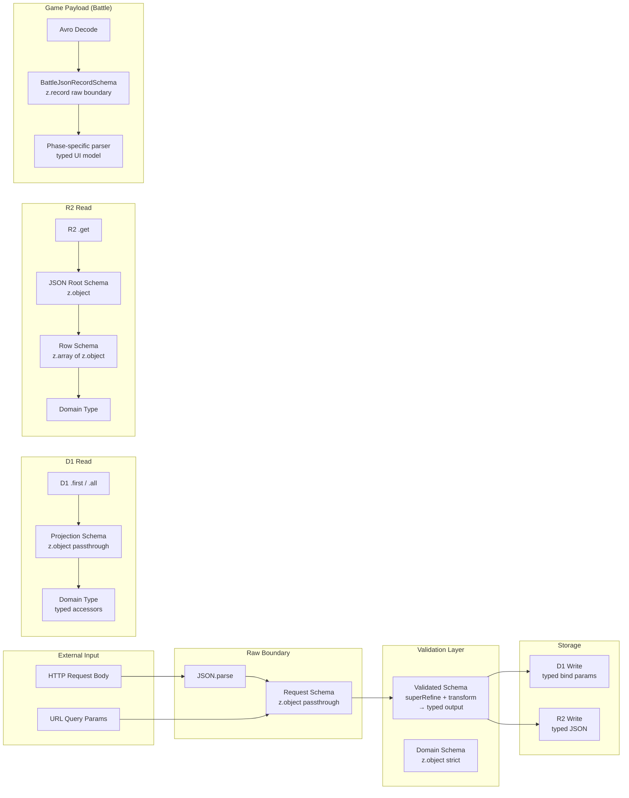

# FUSOU-WEB 型安全性・Zod Schema 監査 — 実装計画書

## 1. Executive Summary

### 現在の状態

| 指標 | 結果 |
|---|---|
| production `any` パターン | **実型使用 0 件** ✅ (監査語を含む文字列 match は 19 件) |
| strict TypeScript (`tsc --noEmit`) | **成功** ✅ |
| server tests | **35 files / 278 tests 全件成功** ✅ |
| focused battle/simulator parser tests | **40 files / 287 tests 全件成功** ✅ (battle-data 18 files/62 tests + simulator/schema 22 files/225 tests) |
| `z.unknown()` 残存 | **23 件** (production実装。raw boundary / legacy payload / parser入力のみ) |
| `Record<string, unknown>` 残存 | **250 箇所** (production実装。raw boundary / helper 型を含む) |
| timeline phase cast | **0 件** ✅ |
| battle timeline/render-helpers/data-service cast | **0 件** ✅ (atlasはSpriteAtlasSchemaで検証) |
| simulator API/import cast | **0 件** ✅ |
| actionable domain double cast | **0 件** ✅ |
| Astro check | **0 errors / 0 warnings / 0 hints** ✅ |
| simulator smoke | **9 tests 全件成功** ✅ |
| `.passthrough()` 使用 | **191 件** (D1 projection / legacy compatibility) |
| `verify:battle-data` script | **存在し CI 実行** ✅ |
| server tests の CI 実行 | **追加済み** ✅ |

### 最大リスク Top 5

1. **raw external payload boundaries** — battle/master/synergy/snapshot は producer ごとに列や key が変わるため raw record を保持し、consumer 側で guarded accessor/parser を通す。weapon atlasはroot/frame/metaをschema検証済み。
2. **remodel ingest の legacy validation 層** — raw boundary は JSON 値に限定済みだが、producer 互換のため manual validation を残している。validated output は discriminated typed union。
3. **synergy payload の raw legacy dictionaries** — effects/cross_effects/b/l/c2/c3 は generator 世代差分を吸収するため raw boundary に残り、consumer 側 parser で数値を抽出する。
4. **master table-specific schema の生成** — table ごとに列が異なるため raw record boundary は維持している。Avro decode後は`parseMasterDataJsonRecords()`でrootと各行を検証する。
5. **numeric UI fallback** — battle の HP/damageとatlasの座標・サイズはfinite parserに統一し、正常な `0` を保持する。ID、indexなどのsentinel/defaultは用途を限定して残る。

### `z.unknown()` の分類概算

| 分類 | 件数 | 割合 |
|---|---|---|
| **A. 維持してよい raw boundary** | 7 | 41% |
| **B. raw boundary 維持 + consumer parser** | 9 | 53% |
| **C/D. 具体 schema 化または直接assertion除去が必要** | 0 | 0% |

### 即座に修正すべき vs 仕様確認が必要

| 即座に修正可能 | 仕様確認が必要 |
|---|---|
| request scalar fields の typed 化 | synergy effects/cross_effects の内部構造 |
| quest state enum の固定 | battle/master payload の全フィールド schema |
| shortener 二重 parse と未知キー受理の解消 | master table ごとの完全な列 schema |
| remodel archive の SELECT 列明示と ingest JSON boundary | master tableごとの完全な列schema、legacy synergy/snapshotの互換仕様 |

---

## 2. Unknown Inventory

### 2.1 `z.unknown()` 一覧

| file | schema / symbol | field | current type | consumer | runtime validation | compat risk | security risk | class | recommendation | priority |
|---|---|---|---|---|---|---|---|---|---|---|
| [shortener.ts](file:///home/ogu-h/Documents/GitHub/FUSOU/packages/FUSOU-WEB/src/server/schemas/shortener.ts#L5-L6) | `SnapshotPayloadSchema` | `snapshotShips`, `snapshotSlotItems` | `z.record(z.unknown())` | io-handlers.ts で直接消費 | ❌ record 値は未検証 | Low | Low | **A** | 維持 (外部 snapshot data の schema は不確定) | P5 |
| [remodel-data.ts](file:///home/ogu-h/Documents/GitHub/FUSOU/packages/FUSOU-WEB/src/server/schemas/remodel-data.ts) | `RemodelDataIngestBodySchema` | (全体) | `z.record(z.string(), RemodelJsonValueSchema)` | `superRefine` で manual validation → typed transform | ✅ JSON 値境界 + 全フィールド検証 | Low | Low | **B** | producer 互換の任意キーを保持し、validated output は discriminated union として利用 | P4 |
| [synergy.ts](file:///home/ogu-h/Documents/GitHub/FUSOU/packages/FUSOU-WEB/src/server/schemas/synergy.ts#L142) | `SynergyEffectRuleSchema` | `ships` | `z.unknown()` | `hasShipRule()` で `Array.isArray()` + `toInt()` | ✅ consumer 側 guard | Medium | Low | **B** | `z.array(z.number().int().positive()).optional()` — ただし legacy payload 互換性要確認 | P5 |
| 同上 | 同上 | `b`, `l`, `c2`, `c3` | `z.record(z.string(), z.unknown())` | `toShipTotals()` で key lookup + `toInt()` | ✅ consumer 側 guard | Medium | Low | **B** | `SynergyStatBonusSchema = z.object({ kaih: z.number(), ... }).partial()` — legacy key 互換性要確認 | P5 |
| [synergy.ts](file:///home/ogu-h/Documents/GitHub/FUSOU/packages/FUSOU-WEB/src/server/schemas/synergy.ts#L153-L154) | `SynergyCrossRuleSchema` | `ships`, `synergy` | `z.unknown()` / `z.record(z.string(), z.unknown())` | 同上 | ✅ consumer 側 guard | Medium | Low | **B** | 同上 | P5 |
| [synergy.ts](file:///home/ogu-h/Documents/GitHub/FUSOU/packages/FUSOU-WEB/src/server/schemas/synergy.ts#L168-L169) | `SynergyPayloadSchema` | `effects`, `cross_effects` | `z.record(z.string(), z.unknown())` | ship_growth.ts で key iterate + manual filter | ✅ consumer 側 guard | Medium | Low | **B** | raw boundary として維持し、consumer 側に `parseSynergyEffects()` parser を追加 | P5 |
| [battle-data.ts](file:///home/ogu-h/Documents/GitHub/FUSOU/packages/FUSOU-WEB/src/server/schemas/battle-data.ts#L62) | `BattleJsonRecordSchema` | (全体) | `z.record(z.string(), z.unknown())` | data-service.ts / timeline.ts で多数 cast | ✅ safeParse boundary | Medium | Low | **A** | 維持 — battle payload は Avro-decoded で table ごとに列が異なる。typed consumer boundary (timeline.ts) で個別 parse が必要 | P6 |
| [master-data.ts](file:///home/ogu-h/Documents/GitHub/FUSOU/packages/FUSOU-WEB/src/server/schemas/master-data.ts#L62-L64) | `MasterDataJsonRecordSchema` | (全体) | `z.record(z.string(), z.unknown())` | data-service.ts で `Number(row["id"])` cast | ✅ safeParse boundary | Medium | Low | **A** | 維持 — master data table ごとにスキーマが異なる。typed consumer boundary で parse | P6 |
| [assets.ts](file:///home/ogu-h/Documents/GitHub/FUSOU/packages/FUSOU-WEB/src/server/schemas/assets.ts#L31-L72) | `SpriteAtlasSchema` | `frames`, `meta` | concrete frame/meta schema | data-service.ts のWeaponIconFrame parser | ✅ root/frame/metaとfinite数値をschema検証 | Low | Low | **A** | 維持 — external sprite atlasの追加metadataはpassthroughし、座標・サイズは具体検証 | P6 |
| [anonymous-sync-v2.ts](file:///home/ogu-h/Documents/GitHub/FUSOU/packages/FUSOU-WEB/src/server/schemas/anonymous-sync-v2.ts#L118-L119) | `AuthSettingsDiagnosticsSchema` | (全体) | `z.record(z.string(), z.unknown())` | diagnostics 表示のみ | ✅ 診断用 dump | None | None | **A** | 維持 — Supabase auth.settings() の返値で外部 schema | P7 |

### 2.2 `z.unknown()` 以外の意図的 unknown

| file | symbol | 維持理由 | unsafe cast の有無 |
|---|---|---|---|
| `parseMasterDataTableOffsets()` | `MasterDataTableOffset[]` | JSON.parse 結果を offset schema で検証 | ✅ malformed JSON / rows は空配列として扱う |
| `fetchBattleResultByUuid()` | `drop_ship_id: unknown` | D1 の column 値が number \| null | ✅ route consumer で safe numeric normalization |

---

## 3. Remaining Type Safety Issues

### 3.1 `Record<string, unknown>` と unsafe cast

| file | lines | pattern | runtime guard | risk |
|---|---|---|---|---|
| [data-service.ts](file:///home/ogu-h/Documents/GitHub/FUSOU/packages/FUSOU-WEB/src/features/battles/data-service.ts) | weapon atlas loader | `fetchJson(...)` の直接assertion | ✅ `SpriteAtlasSchema.safeParse()` + finite number schema | **解決済み** |
| [timeline.ts](file:///home/ogu-h/Documents/GitHub/FUSOU/packages/FUSOU-WEB/src/features/battles/timeline.ts) | 0 箇所 | guarded accessor (`safeNumber`, `safeString`, `recordArrayAt`) | ✅ phase-specific runtime guards | **解決済み** — battle payload は raw boundary のまま typed consumer で処理 |
| [render-helpers.ts](file:///home/ogu-h/Documents/GitHub/FUSOU/packages/FUSOU-WEB/src/features/battles/render-helpers.ts) | 0 件の対象 cast | `unknownArrayOf` | ✅ HP / damage / target arrays を guarded access | **解決済み** |
| [io-handlers.ts](file:///home/ogu-h/Documents/GitHub/FUSOU/packages/FUSOU-WEB/src/features/simulator/io-handlers.ts) | 0 件の対象 cast | payload codec / schema parser | ✅ viewer, sessionStorage, URL, API snapshot を検証 | **解決済み** |
| [shortener.ts (route)](file:///home/ogu-h/Documents/GitHub/FUSOU/packages/FUSOU-WEB/src/server/routes/shortener.ts) | 0 件の対象 cast | `JSON.parse(...)` → `unknown` | decode後にschema/parserへ渡す | **解決済み** — loose error responseも直接castしない |
| [quest_tree.ts (route)](file:///home/ogu-h/Documents/GitHub/FUSOU/packages/FUSOU-WEB/src/server/routes/quest_tree.ts) | 1 箇所 | `data as unknown as BufferSource` | `data` は呼出元で検証済みの `Uint8Array` | **Low / intentional** — Web CryptoとWorkers型定義のBufferSource interop |
| [period-tags.ts](file:///home/ogu-h/Documents/GitHub/FUSOU/packages/FUSOU-WEB/src/server/utils/period-tags.ts) | 0 件の対象 cast | cached valueをparserで検証 | `typeof` / `Array.isArray` guard | **解決済み** |
| [simulator-optimizer.tsx](file:///home/ogu-h/Documents/GitHub/FUSOU/packages/FUSOU-WEB/src/components/features/simulator/solid/simulator-optimizer.tsx) | optimizer stat access | dynamic stat assertion | ✅ `shipStatArray()`へ統一 | **解決済み** |
| [master_data.ts](file:///home/ogu-h/Documents/GitHub/FUSOU/packages/FUSOU-WEB/src/server/routes/master_data.ts) / [ship_growth.ts](file:///home/ogu-h/Documents/GitHub/FUSOU/packages/FUSOU-WEB/src/server/routes/ship_growth.ts) | Avro cache/load | decoded records assertion | ✅ `parseMasterDataJsonRecords()`でroot/row検証 | **解決済み** |
| [ru.ts](file:///home/ogu-h/Documents/GitHub/FUSOU/packages/FUSOU-WEB/src/server/utils/ru.ts) | KV bucket state | JSON direct assertion | ✅ `parseRUBucketState()`でfinite/non-negative/range検証 | **解決済み** |

> 最終scanで残る `as unknown as` は、Directory/File System API (`entries()` の実験的型)、Cloudflare runtime env、DecompressionStream、`BufferSource`/`ReadableStream` などのplatform interopに限定される。ReactFlow node data、optimizerのstat参照、synergy順序配列のdomain double castは除去済み。

### 3.2 `.passthrough()` の妥当性

| schema | 使用理由 | 妥当性 |
|---|---|---|
| D1 projection schemas (battle-data, quest-tree, synergy, etc.) | D1 が返す追加列を落とさない | ✅ 妥当 — D1 は SELECT に含まれない metadata 列を返すことがある |
| `ShortenerRequestSchema` | client が追加フィールドを送る可能性 | ✅ `.strip()` 済み — server が未知フィールドを保存しない |
| `SokuSpeedIngestBodySchema` | legacy input compatibility | ✅ scalar / nested fields は typed normalization 済み |
| `RemodelDataIngestBodySchema` | producer の未知キー保持が必要 | ✅ raw boundary は JSON 値に限定し、validated output は typed union |
| `SynergyPayloadSchema` / `SynergyEffectRuleSchema` | legacy/current 互換 | ✅ 妥当 — producer の世代が複数ある |

### 3.3 `JSON.parse` 後の型保証

| file | line | pattern | guard | risk |
|---|---|---|---|---|
| shortener.ts (route) | 166, 169 | `JSON.parse(json)` → return unknown | `try/catch` のみ | **Low** — client input decode |
| remodel_data.ts (route) | 641 | `JSON.parse(...)` → validated via schema | ✅ `parseRemodelDataIngestBody()` | **Low** |
| ship_growth.ts (route) | 361, 1618, 3084, 3565 | `JSON.parse(...) as unknown` | ✅ subsequent schema parse | **Low** |
| master_data.ts / ship_growth.ts | Avro decode | decode結果の直接assertion | ✅ `parseMasterDataJsonRecords()` | **解決済み** |
| ru.ts | KV bucket state | JSON値の直接assertion | ✅ `parseRUBucketState()` | **解決済み** |
| quest_tree.ts (route) | 1064 | `JSON.parse(...) as unknown` | ✅ `QuestTreeIngestBodySchema.safeParse()` | **Low** |
| master_data.ts (route) | 245, 657, 1113 | `parseMasterDataTableOffsets(tableOffsetsStr)` | ✅ `MasterDataTableOffsetSchema.array()` | **解決済み** |
| data_loader.ts (route) | 1202 | `parseRateLimitAttempts(data)` | ✅ finite integer array schema | **解決済み** |

### 3.4 Silently fallback する箇所

| location | pattern | risk |
|---|---|---|
| data-service.ts | atlas frame / meta | `SpriteAtlasSchema`でfinite検証し、正常な0を保持 | **解決済み** |
| render-helpers.ts | nullable numeric helpers | HP/damageはguarded accessorで欠損と0を分離 | **解決済み** |
| timeline.ts | `safeNumber` / `safeNumberOrNull` | HP/damage は `nullableNumberArray()` / `safeNumberOrNull()` で `0`、欠損、invalid を分離。index を保つため先頭 `0` の自動 shift は行わない。index/ID/crit metadata の sentinel は用途を限定して残る |
| helpers.ts L27-29 | `hpScoreForDeck` accepts `unknown[]` | 比較用 snapshot の欠損を 0 相当として扱う既存互換動作。表示 HP の parser には使用しない |

---

## 4. Target Architecture

### 境界の原則

1. **Request schema** — input の形状を最低限検証する。`z.unknown()` を使わず、scalar field は具体型にする。
2. **Validated schema** — business rule 検証 + transform で typed output を生成する。`superRefine` は型推論に反映されないため、可能な限り `z.object()` + `z.preprocess()` に移行する。
3. **D1 projection schema** — `.passthrough()` は妥当。ただし consumer 前に named field accessor を定義する。
4. **R2 JSON schema** — root object → row array → domain type の 3 段階で parse する。
5. **Battle payload** — raw boundary として `z.record(z.string(), z.unknown())` を維持。consumer 側に phase-specific parser を追加する (timeline.ts / data-service.ts)。

---

## 5. Ordered Implementation Plan

### Step 1: shortener の二重 parse 解消 (完了)

| | |
|---|---|
| **Goal** | `ShortenerRequestSchema.snapshotPayload` を `SnapshotPayloadSchema.nullable().optional()` に統合し、route 側の二重 parse を除去 |
| **Files** | [shortener.ts (schema)](file:///home/ogu-h/Documents/GitHub/FUSOU/packages/FUSOU-WEB/src/server/schemas/shortener.ts), [shortener.ts (route)](file:///home/ogu-h/Documents/GitHub/FUSOU/packages/FUSOU-WEB/src/server/routes/shortener.ts) |
| **Symbols** | `ShortenerRequestSchema`, `SnapshotPayloadSchema`, route POST `/` handler |
| **Implementation** | 1. `ShortenerRequestSchema.snapshotPayload` を `SnapshotPayloadSchema.nullable().optional()` に変更 2. route 側の `SnapshotPayloadSchema.safeParse(snapshotPayload)` を削除し、`parsedBody.data.snapshotPayload` を直接使用 3. `ShortenerRequestSchema` の `.passthrough()` を `.strip()` に変更 (server が未知フィールドを受け入れる理由がない) |
| **Compatibility** | ✅ API 互換 — client は同じ JSON を送信。server 側で受理される値域は変わらない (SnapshotPayloadSchema は passthrough)。strip() により未知フィールドが落ちるが、client は snapshotPayload 以外の追加フィールドを送っていない |
| **Tests** | shortener route tests (valid payload, null snapshotPayload, invalid snapshotPayload, extra fields stripped) |
| **Validation** | `pnpm exec vitest run src/server` |
| **Rollback** | `z.unknown()` に戻し、route 側の二重 parse を復元 |

### Step 2: soku-speed request schema の typed normalization (完了)

| | |
|---|---|
| **Goal** | `SokuSpeedIngestBodySchema` の全 `z.unknown()` フィールドを typed schema に置換し、`superRefine` を大幅に簡素化 |
| **Files** | [soku-speed.ts (schema)](file:///home/ogu-h/Documents/GitHub/FUSOU/packages/FUSOU-WEB/src/server/schemas/soku-speed.ts), [soku_speed_observed.ts (route)](file:///home/ogu-h/Documents/GitHub/FUSOU/packages/FUSOU-WEB/src/server/routes/soku_speed_observed.ts) |
| **Symbols** | `SokuSpeedIngestBodySchema`, `ValidatedSokuSpeedIngestBodySchema`, `SokuSpeedIngestBody`, `asRecord()`, `isValidInteger()` |
| **Implementation** | 1. 共通 preprocess helper を定義: `Sha256Schema`, `PeriodTagSchema` (synergy.ts から再利用), `TableVersionSchema` 2. `SokuSpeedShipSchema` を定義 (`master_id`, `lv`, `soku_observed`, `slots: z.array(SokuSpeedSlotDetailSchema)`, `exslot`) 3. `SokuSpeedIngestBodySchema` を `z.object({ dataset_id: Sha256Schema, ... })` に置換 4. `superRefine` は ship-level の cross-field validation (e.g., soku_observed ∈ {5,10,15,20}) のみに簡素化 5. `asRecord()` helper を削除 |
| **Compatibility** | ⚠️ legacy input で `dataset_id` が number として送信される可能性 → `z.preprocess(v => String(v ?? '').trim(), ...)` で吸収。**要確認: 実際の producer の送信形式** |
| **Tests** | valid input, string numeric fields, missing required fields, invalid soku_observed values, empty ships, malformed slot structure |
| **Validation** | `pnpm exec vitest run src/server/schemas/__tests__/soku-speed.test.ts src/server/routes/__tests__/soku_speed_observed.test.ts` |
| **Rollback** | 旧 schema を復元。`superRefine` の手動 validation は独立しているため rollback は容易 |

### Step 3: quest-tree / data-loader の scalar fields (完了)

| | |
|---|---|
| **Goal** | `dataset_token`, `content_hash`, `file_size` を具体型に、`email` を `z.string().optional()` に |
| **Files** | [quest-tree.ts (schema)](file:///home/ogu-h/Documents/GitHub/FUSOU/packages/FUSOU-WEB/src/server/schemas/quest-tree.ts), [data-loader.ts (schema)](file:///home/ogu-h/Documents/GitHub/FUSOU/packages/FUSOU-WEB/src/server/schemas/data-loader.ts) |
| **Symbols** | `QuestTreeIngestBodySchema` (fields: `dataset_token`, `content_hash`, `file_size`), `VerifyGoogleRequestSchema` (field: `email`) |
| **Implementation** | 1. `dataset_token` → `z.string().optional()` (route で `resolveDatasetToken()` に渡される) 2. `content_hash` → `OptionalTrimmedStringFieldSchema` (既に quest-tree.ts で定義済み) 3. `file_size` → `z.preprocess(Number, z.number().int().positive().optional())`  4. `VerifyGoogleRequestSchema.email` → `z.string().optional()` (route で使われていないが schema 上の正確性のため) |
| **Compatibility** | ✅ API 互換 — `z.preprocess` で string → number 変換を吸収 |
| **Tests** | valid inputs, string file_size, missing optional fields, null values |
| **Validation** | `pnpm exec vitest run src/server/schemas/__tests__/quest-tree.test.ts src/server/schemas/__tests__/data-loader.test.ts` |
| **Rollback** | `z.unknown()` に戻す |

### Step 4: remodel archive row schema と ingest boundary (完了)

| | |
|---|---|
| **Goal** | `SELECT *` を列明示に変更し、`RemodelArchiveRowSchema` を slotlist / detail 専用 schema に分割 |
| **Files** | [remodel-data.ts (schema)](file:///home/ogu-h/Documents/GitHub/FUSOU/packages/FUSOU-WEB/src/server/schemas/remodel-data.ts), [remodel_data.ts (route)](file:///home/ogu-h/Documents/GitHub/FUSOU/packages/FUSOU-WEB/src/server/routes/remodel_data.ts) |
| **Symbols** | `RemodelArchiveRowSchema`, `archiveAndResetOnPeriodSwitch()` |
| **Implementation** | 1. `RemodelSlotlistArchiveRowSchema` を定義 (period_tag, secretary_ship_master_id, weekday_jst, remodel_id, ..., updated_at_ms) 2. `RemodelDetailArchiveRowSchema` を定義 (period_tag, slotitem_master_id, remodel_id, ..., updated_at_ms) 3. `archiveAndResetOnPeriodSwitch()` の SQL を列明示 projection に変更 4. ingest raw boundary を `RemodelJsonValueSchema` に限定し、manual validation の typed discriminated output を維持 |
| **Compatibility** | ✅ archive JSON の構造が変わるが、archive は read-only backup であり consumer は存在しない |
| **Tests** | archive function test with mock D1, verify JSON output contains only expected fields |
| **Validation** | `pnpm exec vitest run src/server/schemas/__tests__/remodel-data.test.ts src/server/routes/__tests__/remodel_data.test.ts` |
| **Rollback** | `SELECT *` と `z.record(z.string(), z.unknown())` に戻す |

> [!NOTE]
> ingest の outer boundary は producer の未知キー互換性を保つため JSON record として残す。ただし値は JSON 型に制限し、route が利用する `ValidatedRemodelDataIngestBody` は event_type による discriminated union になっている。

### Step 5: synergy payload の semantic validation (完了)

| | |
|---|---|
| **Goal** | `SynergyEffectRuleSchema` / `SynergyCrossRuleSchema` の `z.unknown()` / `z.record(z.string(), z.unknown())` に対して、consumer 前の typed parser を追加 |
| **Files** | [synergy.ts (schema)](file:///home/ogu-h/Documents/GitHub/FUSOU/packages/FUSOU-WEB/src/server/schemas/synergy.ts), [ship_growth.ts (route)](file:///home/ogu-h/Documents/GitHub/FUSOU/packages/FUSOU-WEB/src/server/routes/ship_growth.ts) |
| **Symbols** | `SynergyEffectRuleSchema`, `SynergyCrossRuleSchema`, `SynergyPayloadSchema`, `toShipTotals()`, `hasShipRule()`, `loadSynergyDataSet()` |
| **Implementation** | **raw boundary (schema) は維持**: 外部生成の synergy payload は generator_version ごとに構造が変わり得るため。 **consumer boundary に typed parser を追加**:  1. `SynergyStatBonusSchema = z.object({ kaih: z.number(), houk: z.number(), kaihi: z.number(), tais: z.number(), taisen: z.number(), saku: z.number(), sakuteki: z.number(), luck: z.number(), luk: z.number(), lucky: z.number() }).partial()` を定義 2. `parseSynergyStatBonus(raw: unknown): SynergyStatTotals` を定義 3. `loadSynergyDataSet()` 内で `toShipTotals()` 呼び出し前に `SynergyStatBonusSchema.safeParse()` を入れる 4. `ships` → `z.array(z.number().int().positive()).optional()` に変更可能 (legacy payload にも number[] として存在) |
| **Compatibility** | ⚠️ **仕様確認必要**: synergy payload の `b`, `l`, `c2`, `c3` の実際の key set。現在 `toShipTotals()` が吸収しているが、unknown key が存在する可能性。generator_version ごとの差分を確認すること |
| **Tests** | valid synergy payload, missing stat keys, extra keys, null values, empty effects |
| **Validation** | `pnpm exec vitest run src/server/routes/__tests__/ship_growth.test.ts` |
| **Rollback** | parser を削除し、`toShipTotals()` の既存 runtime guard に戻す |

> [!NOTE]
> **Open Question**: `effects` と `cross_effects` (legacy dict format) の key が numeric string であること、value が `SynergySingleRule[]` / `SynergyCrossRule[]` であることは confirmed fact。ただし `effect_rules` / `cross_rules` (new format) が legacy format と並存するか排他かは `generator_version` 依存。

### Step 6: battle/master/simulator の raw boundary と typed parser の整理 (主要 consumer 完了)

| | |
|---|---|
| **Goal** | `data-service.ts` / `timeline.ts` / `render-helpers.ts` / `io-handlers.ts` の unsafe cast を段階的に typed accessor に置換 |
| **Files** | [data-service.ts](file:///home/ogu-h/Documents/GitHub/FUSOU/packages/FUSOU-WEB/src/features/battles/data-service.ts), [timeline.ts](file:///home/ogu-h/Documents/GitHub/FUSOU/packages/FUSOU-WEB/src/features/battles/timeline.ts), [render-helpers.ts](file:///home/ogu-h/Documents/GitHub/FUSOU/packages/FUSOU-WEB/src/features/battles/render-helpers.ts), [io-handlers.ts](file:///home/ogu-h/Documents/GitHub/FUSOU/packages/FUSOU-WEB/src/features/simulator/io-handlers.ts), [types.ts](file:///home/ogu-h/Documents/GitHub/FUSOU/packages/FUSOU-WEB/src/features/battles/types.ts), [payload-guards.ts](file:///home/ogu-h/Documents/GitHub/FUSOU/packages/FUSOU-WEB/src/features/battles/payload-guards.ts), [helpers.ts](file:///home/ogu-h/Documents/GitHub/FUSOU/packages/FUSOU-WEB/src/features/battles/helpers.ts) |
| **Implementation** | **Phase 6a: typed accessor layer** 完了。`safeNumber`, `safeString`, `safeNumberArray`, `safeNumberOrNull`, `nullableNumberArray`, `recordArrayAt` を追加。  **Phase 6b: data-service.ts** 主要な typed record/accessor 化を実施。残りは table-specific master typing。  **Phase 6c: timeline.ts** phase payload の runtime guards を適用し、対象 cast を 0 件化。HP/damage は `0` を valid value として保持し、`null`/空文字/NaN/Infinity は欠損または invalid として扱う。配列要素は index-preserving に変換し、正常な先頭 `0` を 1-based dummy と誤認して削除しない。  **Phase 6d: io-handlers.ts / API parser** viewer, sessionStorage, URL, fleet API の boundary validation を適用。 |
| **Compatibility** | ✅ internal refactor — API 変更なし |
| **Tests** | data-service unit tests, timeline phase parser tests, io-handlers integration tests |
| **Validation** | `pnpm exec tsc --noEmit && pnpm exec vitest run src/server && pnpm exec vitest run src/features` |
| **Rollback** | accessor layer を削除し、既存の cast パターンに戻す |

> [!NOTE]
> battle/master の raw schema 自体は table ごとに列が異なるため維持する。typed 化の責務は phase-specific consumer と master table accessor に置く。

### Step 7: battle-data verification script の整備 (完了)

| | |
|---|---|
| **Goal** | `verify:battle-data` script を package.json に追加し、battle payload の型安全性を CI で検証可能にする |
| **Files** | [package.json](file:///home/ogu-h/Documents/GitHub/FUSOU/packages/FUSOU-WEB/package.json) |
| **Implementation** | 1. `"verify:battle-data"` script を追加: `vitest run src/features/battles src/server/routes/__tests__/battle_data` 2. battle payload の boundary test を追加: valid record, malformed record, missing fields, extra fields 3. CI workflow に `pnpm run verify:battle-data` を追加 |
| **Tests** | Script 自体のテストは不要。追加するテスト内容は Test Plan (Section 6) 参照 |
| **Validation** | `pnpm run verify:battle-data` |
| **Rollback** | script を削除 |

---

## 6. Test Plan

### テストカテゴリと対象

| カテゴリ | 対象 schema / function | テスト内容 |
|---|---|---|
| **Valid input** | 全 ingest schema | 正常な payload が parse 成功 |
| **Missing field** | soku-speed, quest-tree, remodel | required field が欠落 → validation error |
| **Wrong scalar type** | soku-speed (`dataset_id: 123`), quest-tree (`file_size: "abc"`) | 型が異なる → preprocess で吸収 or error |
| **Numeric string legacy** | soku-speed (`dataset_id: "abc...def"`) | string 送信の互換性 |
| **null value** | shortener (`snapshotPayload: null`), remodel nullable detail fields | nullable field の処理 |
| **Array/object mismatch** | soku-speed (`ships: {}` instead of `[]`) | 型不一致 → validation error |
| **Malformed nested payload** | soku-speed (ship with missing `slots`), remodel (`entries[0]` with non-int fields) | nested 構造の validation |
| **Numeric zero vs missing** | battle timeline HP/damage arrays | `0` は保持して MISS/大破などの正常値として表示し、`null`/空文字/invalid は `?`/不明として扱う。配列 index をずらさない |
| **Unknown extra fields** | shortener (`.strip()` 後), soku-speed | extra fields が drop or passthrough |
| **Old payload version** | synergy (`effects` dict vs `effect_rules` array) | legacy format の互換性 |
| **D1 malformed row** | remodel archive, quest-tree rules | D1 projection の safeParse failure |
| **R2 malformed JSON** | synergy payload, master data | decompression / JSON parse failure |
| **Route response behavior** | shortener POST, soku-speed ingest | HTTP status code, error message format |
| **Regression** | server tests + focused battle/simulator parser tests | 既存テストと追加 boundary tests が pass |

### 新規テスト追加の優先順

1. **soku-speed typed schema tests** (完了)
2. **remodel archive row schema tests** (完了)
3. **battle payload boundary tests** (完了)
4. **synergy consumer parser tests** (完了)
5. **timeline / simulator phase parser tests** (完了)

---

## 7. Security / Reliability Impact

| リスク | 現在の状態 | 影響 | 対策 |
|---|---|---|---|
| **Malformed input の保存** | remodel archive は列明示 projection、ingest は JSON value boundary | 予期しない列や非 JSON 値の混入 | Step 4 で列と値の形状を明示 |
| **Silently fallback によるデータ欠損** | phase consumer は `nullableNumberArray()` / `safeNumberOrNull()` を使用 | `0` が fallback に吸収される、または leading zero で index がずれる可能性 | `0`/missing/invalid を明示分類し、damage event と HP snapshot の focused regression tests で確認 |
| **Prototype pollution** | `JSON.parse()` 後の object を直接使用 | `__proto__` キー injection | Zod schema が object shape を検証するため、validated 後は安全。raw boundary (shortener の `decodePayloadBase64`) は `z.record()` で wrap 済み |
| **Oversized JSON** | shortener に `MAX_SNAPSHOT_PAYLOAD_BYTES` (1MB) 制限あり | ✅ 対策済み | — |
| **Recursive JSON / deep nesting** | `JSON.parse()` は V8 の stack depth 制限に依存 | Workers runtime の制限内 | ✅ 実質的に問題なし |
| **Archive poisoning** | remodel archive は専用 projection schema のみ保存 | 悪意ある列名が archive JSON に含まれる可能性 | Step 4 で列を明示 |
| **Token/hash の型混同** | request scalar fields は typed normalization 済み | string 以外の値が意図せず文字列化される | Step 2-3 で schema boundary に |
| **D1 projection corruption** | `.passthrough()` で未知列を受け入れ | ✅ D1 は server-side storage — client 入力ではない | — |
| **Client への未検証 payload 返却** | quest-tree `/events` の `state_after` を enum parse | ✅ D1 の未知 state は route boundary で落ちる | 低リスク |

---

## 8. Rollout and Rollback

### Schema strict 化の producer 影響

| 変更 | 影響を受ける producer | 対策 |
|---|---|---|
| soku-speed schema typed 化 | FUSOU-PROXY (client) | `z.preprocess()` で legacy format を吸収。producer 側の変更は不要 |
| quest-tree scalar fields | FUSOU-PROXY (client) | `z.preprocess()` で吸収 |
| remodel schema 列明示 | なし (archive は server 内部) | — |
| synergy parser 追加 | equip_synergy_detector (generator) | raw boundary は変更なし。consumer parser は additive |
| shortener `.strip()` | FUSOU-WEB client (browser) | client は `url` と `snapshotPayload` のみ送信 — 影響なし |

### Feature flag

Step 1-3 は additive な型制約追加のため feature flag 不要。
Step 4 (remodel archive) は archive 出力形式が変わるが、consumer が存在しないため flag 不要。
Step 5-6 は consumer 側 refactor のため flag 不要。

### 旧 payload 受け入れ期間

`z.preprocess()` を使用する限り、旧 payload は永続的に受け入れ可能。schema を strict (`z.string().regex(...)`) に変更する場合は、producer のリリースサイクル (推定 1-2 週間) を考慮し、**最低 30 日間**は `z.preprocess()` による吸収を維持すること。

### Logging / Metric / Sampling

- Step 2 の `z.preprocess()` で型変換が発生した場合、`console.warn()` でログを出力する
- Step 6a の `safeNumber()` で NaN fallback が発生した場合、ログを出力する
- Cloudflare Workers の Analytics Engine で validation failure rate を tracking する (optional)

### Rollback 時の旧 schema 復元

各 Step は独立した変更のため、個別に revert 可能。Git revert で schema ファイルを復元すれば、route / consumer は既存の runtime guard で動作する。

---

## 9. Acceptance Criteria

| # | 条件 | 測定方法 |
|---|---|---|
| 1 | production code に explicit `any` がない | `rg -n 'no-explicit-any|\bas any\b|:\s*any\b|<any>|Array<any>|Promise<any>' src/ --glob '*.{ts,tsx}' --glob '!**/__tests__/**'` → 0 |
| 2 | 重要な request scalar fields に `z.unknown()` がない | soku-speed の `dataset_id`, `request_id`, `payload_hash`, `event_type`, `period_tag`, `table_version`, `ships` が typed。quest-tree の `content_hash`, `file_size`, `dataset_token` が typed。data-loader の `email` が typed。 |
| 3 | D1 projection が全て projection-specific schema を通る | remodel archive が `RemodelSlotlistArchiveRowSchema` / `RemodelDetailArchiveRowSchema` を使用 |
| 4 | raw JSON は typed consumer boundary で必ず parse される | synergy payload に `parseSynergyStatBonus()`、battle timeline に phase guards、simulator import/API に payload parser が存在 |
| 5 | malformed input のテストが存在する | 各 ingest schema に missing field / wrong type / null / extra fields テスト |
| 6 | strict TypeScript が成功 | `pnpm exec tsc --noEmit` → exit 0 |
| 7 | Astro check が error 0 | `pnpm run astro check` → error 0 |
| 8 | server tests が全件成功 | `pnpm exec vitest run src/server` → 35 files / 278 tests passed |
| 9 | 互換性を壊す変更には明示的な migration / rollback 方針がある | 本計画書の Section 8 に記載 |
| 10 | `verify:battle-data` script が存在し成功する | `pnpm run verify:battle-data` → exit 0 |

---

## Appendix: Fact Classification

### Confirmed Facts

- `state_after` は route 内で `"active"` / `"visible_inactive"` / `"claimed"` の 3 値を D1 に書き込み、projection schema も同じ enum を使用する
- `VerifyGoogleRequestSchema.email` は route で使用されない — `google_token` のみ使用 ([data_loader.ts L1737](file:///home/ogu-h/Documents/GitHub/FUSOU/packages/FUSOU-WEB/src/server/routes/data_loader.ts#L1737))
- synergy payload は `effects` (legacy dict) と `effect_rules` (new array) の 2 形式が存在 ([ship_growth.ts L722-765](file:///home/ogu-h/Documents/GitHub/FUSOU/packages/FUSOU-WEB/src/server/routes/ship_growth.ts#L722-L765))
- `verify:battle-data` script は package.json に存在し、CI の web quality job から実行される
- shortener request は `SnapshotPayloadSchema` を request schema に統合し、未知 top-level fields は strip する
- remodel archive は slotlist/detail の列明示 projection と専用 schema で parse する。ingest raw body は JSON value boundary に限定する

### Reasonable Assumptions

- soku-speed の producer (FUSOU-PROXY) は `dataset_id` を string として送信する (SHA-256 hex)
- synergy payload の `b`, `l`, `c2`, `c3` の key set は `{ kaih, houk, kaihi, tais, taisen, saku, sakuteki, luck, luk, lucky }` のサブセット (`toShipTotals()` が処理する key)
- `SnapshotPayloadSchema` の `snapshotShips` / `snapshotSlotItems` は client が game data から構築した任意 JSON であり、strict schema 化は不適切

### Open Questions

1. synergy payload の `b`, `l`, `c2`, `c3` に既知の stat key 以外が存在するか？
2. `effect_rules` と `effects` が同一 payload 内で併存する generator version があるか？
3. battle/master payload の全 table 列定義を generated schema として共有できるか？

### Required Evidence

- ~~soku-speed producer のソースコード確認 (FUSOU-PROXY)~~ (typed normalization と focused tests で確認済み)
- synergy generator の出力サンプル (equip_synergy_detector) (legacy key compatibility の継続確認)
- battle payload の Avro schema 定義 (fusou-compaction-core) (table-specific master typing の残課題)
- ~~D1 migration files による実際の列定義確認~~ (archive projection / quest state enum に反映済み)

---

## 10. Post-Fix Residual Audit (2026-08-15)

### 修正した実害

| 領域 | 問題 | 対応 |
|---|---|---|
| battle index | 欠損、`null`、空文字の`index`が`0`として並び、正規のindex 0の行を先頭選択・HP照合・表示順で奪う | `battleRowIndexForSort()`を共通化し、欠損を末尾へ送付。local-worker、data-service、resolver、HP照合、候補キーへ適用 |
| soku-speed | D1行、KV cache、client responseが速度tier外の有限値を受け入れる | `5/10/15/20`の共有ドメイン制約をD1/response境界へ適用。invalid cacheは既存の削除・D1 fallbackで処理 |
| simulator port snapshot | 欠損stat配列が0になり、`instanceStats`がmaster値を上書きする | 欠損を`null`で保持。不正なstat配列は船行を棄却し、snapshot適用時は欠損statキーを省略してmaster値へfallback。明示的な0は保持 |
| battle metadata / map-flow utility | 欠損map座標が`0-0`となりsortieを誤結合、欠損timestampが1970-01-01になる。`formatTimestamp(0)`も欠損表示になる | map keyを`unknown`として別sortie化し、timestamp欠損はnull/最下位sortへ分離。validな座標0/timestamp 0は保持 |
| battle detail level | 艦・装備levelの正常な`0`が`null`になる | nullable parserへ統一し、validなlevel 0を保持 |
| legacy shelling renderer / map-flow enemy resolver / local manifest | 欠損艦indexが艦1番扱い、敵要約の先頭順やmanifestの欠損mapが先頭扱い | participant indexをnullable化し、不明表示・欠損末尾sortへ変更 |
| quest session / queue / asset index | D1 sessionの同時刻競合、429 queue送信、asset一覧の大規模pagination | UNIQUE index＋canonical再取得、transient queue retry、R2 cursor/D1 keyset paginationを確認済み |

### 再監査で残したもの

- `z.unknown()`、`Record<string, unknown>`、`.passthrough()`は、battle/master/synergy/legacy snapshotなどproducerごとに列や世代が異なるraw boundaryに限定して残る。consumer側のschema/parser/guardを通過し、今回のproduction scanで直接的な未検証consumerは確認されなかった。
- `as unknown as`はCloudflare/Web APIの`ReadableStream`、`BufferSource`、worker scope、File System APIなどplatform interopに限定される。domain payloadの二重castは残っていない。
- `?? 0`はカウンタ、Map集計、配列の空スロット、IDのsentinelなど、0がabsenceまたは初期値である箇所に限定して残る。battle index、HP/damage、simulator port stat、soku-speed tierの欠損経路には残していない。
- battle/map-flowの座標、timestamp、艦・装備level、participant indexについて、今回の再監査で正常な0と欠損を分離した。残る数値fallbackは、無効IDを除外するsentinel、未設定時の表示用初期値、または入力欠損を拒否するvalidationに限定される。
- synergy legacy payloadの完全な列schemaと、battle/master tableごとの完全な生成schemaは互換性維持のため未統合。現時点で実害を示す入力経路は確認できないため、schema generationの別課題として扱う。

### 最終検証

- production deprecated scan (`@ts-nocheck`, `document.execCommand`, `toThrowError`): **clean**
- production explicit `any` scan: **clean**
- `pnpm exec tsc --noEmit --pretty false --noUncheckedIndexedAccess --exactOptionalPropertyTypes`: **pass**
- `pnpm run astro check`: **0 errors / 0 warnings / 0 hints**
- `pnpm run verify:battle-data`: **18 files / 68 tests passed**
- `pnpm exec vitest run src/server`: **35 files / 278 tests passed**
- `pnpm exec vitest run src/features/battles src/features/simulator src/components/features/map-flow/solid/battle-map-flow`: **22 files / 73 tests passed**
- `pnpm run e2e:simulator:smoke`: **9 tests passed**
- `git diff --check`: **pass**

この再監査で確認できた範囲では、productionに実害のある未修正の`any`、deprecated API、または欠損値を正常な0へ誤変換する対象経路は残っていない。上記のraw boundaryと生成schemaの完全化は、将来の互換性変更時に別途仕様を確定して進める。
