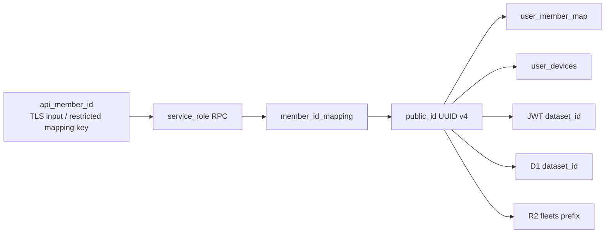

# Pepper → UUID v4 マッピング cutover セキュリティ設計書・実装計画書

最終更新: 2026-08-22（現行リポジトリ照合済み）
対象: FUSOU-WEB, FUSOU-APP, fusou-auth, Supabase PostgreSQL, Cloudflare D1, Cloudflare R2
ステータス: **実装済み。remote cutover、削除、postflight は明示承認待ち**

> この文書は実装判断と検証項目の記録である。実際の運用手順は
> `docs/operations/web/ANON_SYNC_V2_ROTATION_RUNBOOK.md` を正とする。下記の旧方式の説明は、削除対象を特定するための履歴・設計根拠であり、現行 runtime の手順ではない。

---

## 目次

0. [レビュー結論と実装前提](#0-レビュー結論と実装前提)
1. [プロジェクト背景と課題意識](#1-プロジェクト背景と課題意識)
2. [前提技術スタック](#2-前提技術スタック)
3. [全体アーキテクチャとセキュリティモデル](#3-全体アーキテクチャとセキュリティモデル)
4. [Supabase データベース設計](#4-supabase-データベース設計)
5. [アクセス制御設計](#5-アクセス制御設計)
6. [API とアプリケーションレイヤー](#6-api-とアプリケーションレイヤー)
7. [旧データ破棄と新規登録のみの cutover](#7-旧データ破棄と新規登録のみの-cutover)
8. [運用・保守・バックアップ計画](#8-運用保守バックアップ計画)
9. [影響範囲と変更対象ファイル](#9-影響範囲と変更対象ファイル)
10. [検証計画](#10-検証計画)
11. [参照ドキュメント](#11-参照ドキュメント)

---

## 0. レビュー結論と実装前提

### 0.1 結論

新規データを UUID v4 の `public_id` で作成し、旧 hash を使わないコードへ切り替え、
pepper/salt、旧 hash、旧列、旧 RPC、旧 endpoint、旧 cache、旧 payload、legacy fallback を稼働系から完全に撤去することは、現行構成で実装可能である。
本計画では既存 member の対応付け、backfill、re-key を行わない。Supabase の旧 member identity と、それに紐づく旧 device/token/data は破棄し、
全ユーザーを新方式で再登録させる。共有 D1 data と R2 fleet object は保持し、旧データから UUID を推測することもない。

### 0.2 現行リポジトリとの重要な差分

| 項目 | 現行実装 | 計画の扱い |
| ------ | ---------- | ------------ |
| v2 の ID 生成 | Vault RPC で pepper を解決し、Worker が HMAC を計算 | 新規登録専用の `rpc_register_public_id(api_member_id)` に置換 |
| `api_member_id` の永続化 | リクエスト入力にのみ存在 | 新規登録時に mapping RPC へ渡す。旧値・旧対応情報は移行しない |
| Supabase `datasets.id` | 既に `uuid` | 既存 user-owned rows を purge。ID の re-key は行わない |
| `processing_metrics.dataset_id` | `datasets.id` への UUID FK | 既存 metrics rows を purge。FK の re-key は行わない |
| v2 端末 ID | `user_devices.pid` に旧 hash を保存 | 旧 rows を破棄し、`user_devices.public_id` へ新規登録 |
| Fleet R2 | `FLEET_SNAPSHOT_BUCKET`、`fleets/{dataset_id}/{tag}/...` | 固定 namespace を inventory し、既存 object は保持 |
| D1 | `dataset_id` が複数 DB に分散 | 固定 database を inventory し、shared rows は保持 |
| 分散更新 | Supabase、D1、R2 に共通 transaction はない | freeze、D1/R2 inventory、Supabase cleanup、postflight、論理 cutover で実施 |

### 0.3 実装ゲート

以下は破壊的リセットを開始するための必須ゲートである。満たせない場合は開始せず、
旧方式を残したまま部分的に切り替えない。ゲートを満たした後は、旧 member identity/data を削除し、
新規登録だけを UUID v4 で受け付ける。

- 旧 member identity が存在する全保存先、DB object、Vault secret、Worker secret、client cache を棚卸しできる
- 旧 member data を復元・移行しないことについて、不可逆削除の承認を取得している
- Supabase の旧 member rows を削除でき、D1/R2 の固定範囲を inventory できる maintenance window がある
- register、refresh、upload、fleet 更新、Realtime sync を停止できる
- 旧 RPC、policy、trigger、index、grant、publication を新 schema の作成前に削除できる
- 新 schema と `api_member_id -> public_id` の新規 mapping RPC を空の状態から作成できる
- 旧 token、旧 cache、pending/retry payload を全端末で破棄できる
- `api_member_id` の平文を新規 `member_id_mapping` に保存することを、データ保護責任者が承認している

### 0.4 再監査で確定した ID の意味と現在の実装状態

この文書でいう「member_id の UUID 化」は、旧値を対応付けて救済することではなく、旧 member identity を破棄したうえで、
外部へ公開・保存する `public_id`、member 用の `dataset_id` を UUID v4 として新規発行することを指す。
ゲームが送る `api_member_id` は register/refresh の入力として残る。ゲーム側のプロトコルまで変更して
数値の `api_member_id` 自体を廃止する計画ではないため、その要件まで含む場合は本計画の範囲外である。

`public_id` は `api_member_id` から毎回生成する値ではない。mapping の初回作成時に
`gen_random_uuid()` で一度だけ生成し、同じ member、別端末、register 再試行、refresh のすべてで同じ値を返す。
異なる member には別の mapping と UUID を割り当てる。

実装済みの repository では、Worker、APP、`fusou-auth`、Realtime、D1/R2 access path が UUID-only 契約に更新されている。
旧 member lookup、hash/PID derivation、Vault runtime client、legacy cache/fallback は稼働コードから除去され、
Supabase 側の旧 object と旧 secret は `20260822120000_destructive_uuid_public_id_cutover.sql` で削除する。

残っている作業は remote cutover と postflight である。D1/R2 の fixed-scope tool は preservation-only read-only inventory であり、
`--apply` は実行しない。Supabase migration と Vault cleanup は、承認と preflight が
完了するまで実行しない。対応情報を新たに作成せず、旧 data を削除して新規登録へ進む方針は変わらない。

---

## 1. プロジェクト背景と課題意識

### 1.1 現行方式

ゲームの `api_member_id` を外部へ直接公開せずに識別するため、anonymous sync v2 は pepper ベースの HMAC 方式を使っている。

```text
pid = HMAC-SHA256(pepper, api_member_id)
```

- pepper は Supabase Vault の `anon_sync_pepper_v<N>` と runtime table で管理する
- Worker は `get_anon_sync_pepper_bundle()` RPC を service role で呼び出す
- 生成した 64 文字 hex の `pid` は `user_member_map.member_id_hash`、`user_devices.pid`、transfer 履歴、D1 `dataset_id`、Fleet R2 prefix、JWT に広がっている
- recovery HMAC (`recovery_id_hash`) と `member_id_hash_rotations` も現行 v2 の継続性に関係する
- `api_member_id` は DB の既存行から復元できない

### 1.2 移行の目的

1. 外部 ID を `public_id`（UUID v4）へ統一する
2. pepper、salt、HMAC 世代の運用依存を anonymous sync の runtime から除去する
3. API、JWT、D1、R2、desktop client の ID 契約を同じ形式へそろえる
4. 旧 member data を保持せず、空の UUID 登録状態から再開する

### 1.3 非目標

- Supabase の `datasets.id` を再生成すること。既存 user-owned rows は削除する
- `processing_metrics.dataset_id` の UUID FK を変更すること
- UUID を認可の代替にすること
- 旧 member data を UUID へ backfill/re-key すること
- 移行失敗時の runtime fallback や旧方式への戻しを恒久化すること

### 1.4 採用方式

```text
public_id = gen_random_uuid()
```

`member_id_mapping` で新規登録時の `api_member_id -> public_id` を 1:1 管理する。`public_id` は `api_member_id` と数学的な関係を持たず、旧 pepper から導出できない。
既存 mapping は投入せず、cutover 後の最初の register で mapping を作成する。稼働コードには旧 ID の fallback を残さない。

---

## 2. 前提技術スタック

| レイヤー | 技術 | 移行上の注意 |
| ---------- | ------ | -------------- |
| Web | Astro + Cloudflare adapter + Hono | Worker の route、schema、token 検証を更新 |
| 認証 | Supabase Auth + Ed25519 device key | register の attestation proof は廃止し、refresh/revoke の challenge nonce 署名だけを維持 |
| Database | Supabase PostgreSQL | mapping、ownership、RPC、RLS、trigger を更新 |
| Edge DB | Cloudflare D1 (SQLite) | DB 間 transaction はない。固定範囲を inventory し、shared data を保持する |
| Object Storage | Cloudflare R2 | pre-cutover の Fleet object を inventory し、既存 object は保持する |
| Desktop | Tauri + Rust (`fusou-auth`) | token cache、legacy hash cache、Realtime sync を更新 |
| Secrets | Supabase Vault、Worker secrets | 旧 pepper/recovery secret は旧 API 停止と UUID-only smoke test 後に削除 |

`auth.users` は Supabase Auth の認証主体であり member identity data ではないため、既存のログイン主体は保持する。
ただし既存の member association、user-owned dataset、Supabase fleet、provider token は旧 data として削除し、Auth user は新規 member 登録をやり直す。
`kc_period_tag` などの master/reference data は member data ではないため保持する。`datasets`、`processing_metrics`、`fleets` の UUID 型は
旧 data である可能性を否定しないため、既存 rows は purge 対象とする。

---

## 3. 全体アーキテクチャとセキュリティモデル

### 3.1 移行後の ID 関係



`api_member_id` は register/refresh の入力として必要だが、レスポンス、URL、永続ログ、公開データへ出さない。
例外として `member_id_mapping` の平文キーとしてのみ永続化し、service role と限定された migration operator だけが扱う。

### 3.2 多層防御

| 層 | 防御 |
| ---- | ------ |
| Transport | TLS。`api_member_id` は TLS 内の request input のみ |
| ID isolation | UUID v4。旧 pepper から `public_id` を導出できない |
| Authentication | Ed25519 device key、challenge nonce、署名検証 |
| Authorization | JWT 署名、`dataset_id` scope、device/member ownership、Supabase RLS |
| Storage | Supabase/R2/D1 の権限分離、backup access 制御、監査 |
| Abuse control | IP、device、未登録 `api_member_id`、public_id の各 rate limit |

Worker が service role で Supabase を呼ぶ経路は RLS を迂回する。そのため、UUID の形式検証だけでなく、token と device/member ownership の検証を必須にする。

### 3.3 脅威モデル

| 脅威 | Pepper HMAC 方式 | UUID v4 方式 | 評価 |
| ------ | ----------------- | ------------- | ------ |
| IDOR | ID と認可の混同で発生 | UUID だけでは防げない | token/ownership 検証が必要 |
| オフライン推測 | pepper と候補 ID で再計算可能 | UUID から member ID を導出できない | 改善 |
| pepper 漏洩 | 全 pid の再計算が可能 | 旧 pepper から public_id は導出できない | 改善 |
| mapping 漏洩 | pepper/DB 権限者は対応を得られる | mapping table 権限者は全対応を得られる | 監査・最小権限が必要 |
| 旧 token 再利用 | 有効期限中は可能 | 旧 token を cutover 時に失効させる | 明示的な失効が必要 |

UUID v4 は実質 122 bit の乱数空間を持つが、知っている UUID に対するアクセスを拒否する機能ではない。

---

## 4. Supabase データベース設計

### 4.1 `member_id_mapping`

`gen_random_uuid()` が利用可能であることを migration preflight で確認したうえで、次の論理スキーマを空の状態から作成する。

```sql
CREATE TABLE public.member_id_mapping (
    id            bigint GENERATED ALWAYS AS IDENTITY PRIMARY KEY,
    api_member_id text NOT NULL,
    public_id     uuid NOT NULL DEFAULT gen_random_uuid(),
    created_at    timestamptz NOT NULL DEFAULT now(),
    updated_at    timestamptz NOT NULL DEFAULT now(),
    CONSTRAINT uq_member_id_mapping_api_member_id UNIQUE (api_member_id),
    CONSTRAINT uq_member_id_mapping_public_id UNIQUE (public_id),
    CONSTRAINT chk_member_id_mapping_api_member_id
        CHECK (api_member_id ~ '^[0-9]{1,16}$'),
    CONSTRAINT chk_member_id_mapping_uuid_v4 CHECK (
        substring(public_id::text from 15 for 1) = '4'
        AND substring(public_id::text from 20 for 1) ~ '^[89ab]$'
    )
);

COMMENT ON TABLE public.member_id_mapping IS
    'api_member_id と public_id の service_role 専用 1:1 mapping';
```

`api_member_id` と `public_id` は通常運用で変更しない。再生成が必要な場合は、該当 member の新規登録を削除して再登録する。
mapping table だけを更新して既存 data を付け替える RPC は作らない。

`api_member_id` は平文のまま永続化されるため、これは pepper/salt の有無とは別の個人情報・アクセス制御上の決定事項である。
平文保存を許可しない場合、次の RPC は採用できない。暗号化 mapping と限定 migration service など、
`api_member_id` から安定して `public_id` を解決できる別設計を先に確定する。

### 4.2 `user_member_map`

旧 rows と `member_id_hash`、`salt_version`、`hash_algorithm` を破棄する。旧 table を再利用する場合も、旧 rows を全削除してから旧列・旧制約・旧 index を削除し、
`public_id uuid NOT NULL` と `member_id_mapping(public_id)` への FK だけを持つ空の table にする。既存 row の backfill は行わない。

`auth.uid() = user_id` の RLS ownership は維持し、新規 register が作成した mapping だけを insert する。

### 4.3 `user_devices`

現行の `user_devices.pid` は member の旧 HMAC ID を保持するため、全 rows と旧列を破棄する。新規端末は UUID の `public_id` で登録する。

旧 `pid` を含む check、index、unique constraint、grant、policy を catalog で特定して削除してから、
`public_id uuid NOT NULL` と `member_id_mapping(public_id)` への FK を持つ空の構造を作る。制約名を推測して drop しない。

### 4.4 既存 UUID テーブルと Supabase Auth

`datasets.id` は既に UUID 型でも、既存 user-owned dataset は旧 user/member data として全 rows を削除する。
`processing_metrics.dataset_id` は `datasets.id` への UUID 外部キーであるため、`datasets` の purge により関連 rows も削除する。
これらを `public_id` へ UPDATE する SQL は作らない。Supabase の `fleets` rows と `provider_tokens` rows は同様に削除するが、R2 object は保持する。

`auth.users` の認証主体、メールアドレス、認証設定はこの計画では削除しない。削除後の既存 Auth user は、ログイン後に member registration を新規実行する。
Auth account 自体も全削除する要件に変更する場合は、別の account deletion 計画と承認が必要であり、本計画の member identity purge に暗黙に含めない。

### 4.5 transfer、pending、social links

#### `member_transfer_history`

旧 transfer history は member identity の旧 framework data として全 rows を削除し、table/function/index/policy/grant も廃止する。新方式で transfer code を再実装しない限り、旧 RPC も同時に削除する。

#### `pending_member_syncs`

旧 rows、旧 column、trigger、RLS policy、Realtime publication を削除する。新しい APP 同期機能を残す場合だけ、空の table を `public_id` payload 用に作り直す。
旧 hash payload を受け付ける互換処理は実装しない。

#### `social_member_links`

現行 migration の `social_member_links` は旧 framework data として全 rows を削除し、表・index・policy・grant を廃止する。
業務要件として social link 自体を残す場合でも、旧 hash table を再利用せず、新方式の user/public_id schema として別途新規作成する。

### 4.6 RPC、trigger、policy、index の依存

旧列と旧 table を削除する際、少なくとも次を廃止する。新方式で必要な機能は、旧 RPC の互換層ではなく新規の `public_id` 契約として作り直す。

- `rpc_claim_member_with_code`
- `rpc_generate_member_transfer_code`
- `rpc_upsert_user_member_map`
- `rpc_get_current_user_member_map`
- `rpc_get_member_conflict_hints`
- `delete_synced_pending_member_syncs` trigger function
- pending sync の旧 RLS policy、trigger、Realtime payload
- `member_id_hash` を参照する index、grant、コメント

`pg_depend` だけでなく、schema dump に含まれる関数本体、policy、trigger、publication、アプリケーションの query を確認する。
依存を明示的に削除・再作成してから `DROP COLUMN` または `DROP TABLE` を実行し、無検証の `CASCADE` で新方式の object を巻き込まない。

### 4.7 mapping 登録・参照 RPC

```sql
CREATE OR REPLACE FUNCTION public.rpc_register_public_id(
    p_api_member_id text
)
RETURNS uuid
LANGUAGE plpgsql
SECURITY DEFINER
SET search_path = public
AS $$
DECLARE
    v_api_member_id text := trim(p_api_member_id);
    v_public_id uuid;
BEGIN
    IF v_api_member_id IS NULL OR v_api_member_id = '' THEN
        RAISE EXCEPTION 'api_member_id cannot be empty';
    END IF;
    IF NOT (v_api_member_id ~ '^[0-9]{1,16}$') THEN
        RAISE EXCEPTION 'api_member_id must be 1-16 digit numeric string';
    END IF;

    SELECT public_id INTO v_public_id
    FROM public.member_id_mapping
    WHERE api_member_id = v_api_member_id;

    IF FOUND THEN
        RETURN v_public_id;
    END IF;

    INSERT INTO public.member_id_mapping (api_member_id)
    VALUES (v_api_member_id)
    ON CONFLICT (api_member_id) DO NOTHING
    RETURNING public_id INTO v_public_id;

    IF v_public_id IS NULL THEN
        SELECT public_id INTO v_public_id
        FROM public.member_id_mapping
        WHERE api_member_id = v_api_member_id;
    END IF;

    RETURN v_public_id;
END;
$$;

REVOKE ALL ON FUNCTION public.rpc_register_public_id(text) FROM PUBLIC;
GRANT EXECUTE ON FUNCTION public.rpc_register_public_id(text) TO service_role;
```

この RPC は新規 member registration からだけ呼び出し、新規 mapping がなければ UUID v4 を一度だけ生成する。
同じ新規登録の再試行では登録済み mapping の UUID を返すが、旧 hash/pid からの解決、旧 data の検索、別 mapping への fallback は行わない。

refresh は作成権限を持たない別 RPC だけを使う。未登録 input で INSERT せず、mapping がなければ例外として扱う。

```sql
CREATE OR REPLACE FUNCTION public.rpc_get_registered_public_id(
  p_api_member_id text
)
RETURNS uuid
LANGUAGE plpgsql
SECURITY DEFINER
SET search_path = public
AS $$
DECLARE
  v_api_member_id text := trim(p_api_member_id);
  v_public_id uuid;
BEGIN
  IF v_api_member_id IS NULL OR v_api_member_id = '' THEN
    RAISE EXCEPTION 'api_member_id cannot be empty';
  END IF;
  IF NOT (v_api_member_id ~ '^[0-9]{1,16}$') THEN
    RAISE EXCEPTION 'api_member_id must be 1-16 digit numeric string';
  END IF;

  SELECT public_id INTO v_public_id
  FROM public.member_id_mapping
  WHERE api_member_id = v_api_member_id;

  IF NOT FOUND THEN
    RAISE EXCEPTION 'member is not registered';
  END IF;
  RETURN v_public_id;
END;
$$;

REVOKE ALL ON FUNCTION public.rpc_get_registered_public_id(text) FROM PUBLIC;
GRANT EXECUTE ON FUNCTION public.rpc_get_registered_public_id(text) TO service_role;
```

Worker 以外の role に直接 SELECT を付与しない。未登録 input の乱用を防ぐため、RPC rate limit は public_id だけでなく IP、device、未登録 input の失敗数でも制御する。

この RPC の戻り値だけで user ownership を確定してはならない。Worker は RPC の前後を同じ registration transaction として扱い、
認証済み Supabase user、attested device、`public_id` の既存 owner を検証する。既存 `public_id` が別 user/device に所属している場合は 401/409 で中止し、
`user_member_map` や `user_devices` の owner を上書きしない。同一登録の再試行だけは同じ owner に対して idempotent に成功させる。

### 4.8 pepper/recovery の削除

新 Worker、client、transfer/recovery 経路を deploy する前に旧参照を除去し、旧 API を停止した直後に次を削除する。新方式の smoke test は旧 secret を必要としない。

- pepper runtime/version table、validation function、bundle RPC、rotation table
- `recovery_id_hash`、recovery version、identity anchor、recovery audit
- `get_anon_sync_pepper_bundle()`、`get_anon_sync_recovery_bundle()` と関連 function
- Vault secret の `anon_sync_pepper_v*`、`anon_sync_recovery_v*`
- 旧 `/anonymous-sync` v1 route、salt を受け取る client/API 契約、`member-lookup` の `/check-hash` など旧 member-hash lookup endpoint
- 旧 transfer/conflict RPC の実行権限、旧列を参照する policy、trigger、Realtime publication、grant

旧 hash を含む audit export や backup を業務上保持する必要がなければ作成しない。事故調査用に一時作成した場合も、postflight 完了後に破棄し、
復旧先として旧 runtime を再有効化しない。旧 secret/table/function の保持を rollback window の条件にしない。

履歴 migration ファイルや保管中の監査資料に旧語が残ることは許容するが、デプロイ済み DB catalog と稼働 runtime に
旧 function/table/column/policy/index/ACL が残ることは許容しない。

---

## 5. アクセス制御設計

### 5.1 `user_member_map`

`auth.uid() = user_id` を基礎とする既存 RLS を維持する。`public_id` を返す query は所有者限定とし、Worker の service role query には明示的な user/device ownership 条件を残す。

### 5.2 `member_id_mapping`

RLS を有効化し、anon/authenticated には policy を作成しない。直接 SELECT/INSERT/UPDATE は service role または限定された migration role だけに付与する。通常の Worker は table 直読みではなく、入力検証済みの RPC だけを実行する。

```sql
ALTER TABLE public.member_id_mapping ENABLE ROW LEVEL SECURITY;
REVOKE ALL ON TABLE public.member_id_mapping FROM PUBLIC;
REVOKE ALL ON TABLE public.member_id_mapping FROM anon;
REVOKE ALL ON TABLE public.member_id_mapping FROM authenticated;
REVOKE ALL ON TABLE public.member_id_mapping FROM service_role;
GRANT EXECUTE ON FUNCTION public.rpc_register_public_id(text) TO service_role;
GRANT EXECUTE ON FUNCTION public.rpc_get_registered_public_id(text) TO service_role;
```

identity sequence の権限は実際の sequence 名を確認して付与する。Worker に不要な table SELECT を与えない。

### 5.3 token と ownership

UUID 形式の検証だけでは IDOR を防げない。次をすべて検証する。

- JWT の署名、issuer、audience、期限
-要求 path/query の `public_id` と token の `dataset_id` の一致
- device id と `public_id` の対応
- Supabase Auth user と member ownership
- service role 経路での明示的な ownership 条件

---

## 6. API とアプリケーションレイヤー

### 6.1 register/refresh response

旧 response の `pid`、salt、`api_member_id` は削除する。`public_id` は dataset token の `dataset_id` claim を正本とし、response body に重複して返さない。

```jsonc
// Before
{
  "device_id": "...",
  "pid": "a1b2c3...64 hex chars",
  "dataset_token": "..."
}

// After
{
  "device_id": "550e8400-e29b-41d4-a716-446655440000",
  "dataset_token": "eyJhbGciOiJIUzI1NiJ9...",
  "dataset_token_expires_at": 1780000000
}
```

JWT claim は次の契約にする。

```json
{
  "sub": "canonical-user-uuid",
  "dataset_id": "8f14e45f-ceea-467f-a83c-0a06b8ff0876",
  "typ": "dataset",
  "aud": "fusou-upload"
}
```

現在の Rust client は response の `pid` を必須としているため、`manager.rs` の response struct と token 保存処理を変更する。client はサーバーから受け取った token の payload から `dataset_id` を読み、形式を UUID として検証する。client の payload 読み取りは認可の根拠ではなく、実際の API と Worker が token の署名・ownership を検証する。

この変更でも `api_member_id` は register/refresh request に必要な入力として残る。`api_member_id` まで通信・永続化から排除するには、
ゲーム側から別の認証済み member handle を受け取る追加設計が必要であり、本計画だけでは達成しない。

### 6.2 Worker

`computePid()`、pepper bundle 解決、Vault HMAC 計算を削除し、register では作成 RPC、refresh では参照専用 RPC を呼ぶ。

```typescript
async function registerPublicId(
  supabaseAdmin: SupabaseClient,
  apiMemberId: string,
): Promise<string> {
  const { data, error } = await supabaseAdmin.rpc("rpc_register_public_id", {
    p_api_member_id: apiMemberId.trim(),
  });

  if (error || typeof data !== "string" || !UUID_V4_PATTERN.test(data)) {
    console.error("[anonymous-sync-v2] public id resolution failed", {
      message: error?.message,
    });
    throw new Error("public id resolution failed");
  }
  return data;
}
```

register は device public key と Auth user を検証した後に登録 RPC を呼び、返った UUID を ownership collision 検証付きで `user_member_map` と `user_devices` に upsert する。TPM/Secure Enclave trust-root 検証と登録時の attestation proof は行わない。
refresh は参照専用 RPC で登録済み mapping を取得し、未登録なら 401 とする。device record の UUID と参照結果が不一致でも 401 とする。
RPC failure、UUID format failure、mapping 不在に別 ID へ fallback してはならない。

### 6.3 ID 使用規約

| コンテキスト | 使用 ID | 形式 |
| ------------- | --------- | ------ |
| JWT `dataset_id` | `public_id` | UUID v4 |
| URL、R2 key、D1 `dataset_id` | `public_id` | UUID v4 |
| API response | dataset token claim のみ | UUID v4 |
| ログ | masked `public_id` | 先頭 8 文字 + `...` |
| 内部 RPC input | `api_member_id` | 数値文字列、永続ログに残さない |
| content/payload hash | hash 固有の既存形式 | public_id と混同しない |

`api_member_id` は response、URL、永続ログ、D1/R2/Supabase の公開データに含めない。ただし register/refresh の request input として TLS 内を通り、
制限された `member_id_mapping` のキーとして保存されることは許容する。

### 6.4 共通 validator

`dataset_id` を受け取る全 route と token schema に UUID v4 validator を適用する。以下のような SHA-256/payload hash は UUID に置換しない。

- `fleet.ts`
- `data_loader.ts`、`internal_compaction.ts`
- battle、quest、remodel、ship-growth、soku-speed の route/schema
- upload/fleet/battle/quest token と `validateDatasetToken`
- share URL と各 D1 ingest handler

### 6.5 旧 endpoint と rate limit

`member-lookup.ts` の旧 `/check-hash` endpoint は削除する。旧 hash を入力にして有効性を返す endpoint は残さない。

同様に、旧 v1 `/anonymous-sync` route と salt/client hash の互換受け入れを cutover 前に無効化する。
「旧 client の移行猶予のため並走」だけでは pepper/salt 排除の完了条件を満たさないため、旧 client は更新版へ強制更新するか、
旧 endpoint を明示的に拒否する。旧 endpoint の無効化、旧 Vault RPC の EXECUTE revoke、旧 Worker secret の unset を同じ release gate で確認する。

なお、`assets.ts` の `/asset-sync/check-hash` と `lib/asset-sync.ts` の `content_hash` はファイル内容の重複排除用であり、
member identity の旧 hash ではない。この endpoint と content/payload hash は削除・UUID 化の対象外として、監査でも別カテゴリに分類する。

rate limit は既存 public_id だけでなく、未登録 `api_member_id` input、IP、device public key、RPC error を対象にする。UUID の高いエントロピーを理由に request abuse/DoS 対策を省略しない。

---

## 7. 旧データ破棄と新規登録のみの cutover

### 7.1 破棄方針

本計画では旧 `member_id_hash`/`pid` と、それを member identity として使用する既存 data を UUID へ移行しない。
対応情報を作成する manifest、alias、backfill、re-key job は作らない。旧 member data は削除し、削除後に新規登録だけを受け付ける。

削除対象の値を監査用に保存する必要はない。実行前には件数と object 数だけを記録し、`api_member_id`、旧 hash、旧 token、旧 key を新しいログへ出力しない。
削除完了後は、旧値を含む backup/export/cache/queue/object が残っていないことを確認する。

### 7.2 Supabase の移行対象

| 対象 | 旧列 | 新処理 |
| ------ | ------ | -------- |
| `member_id_mapping` | 旧 mapping rows/columns | 旧 rows/schema を削除し、空の UUID v4 mapping schema を新規作成 |
| `user_member_map` | `member_id_hash` | 旧 rows/列/制約を削除し、空の `public_id` schema を作成 |
| `user_devices` | `pid` | 旧 rows/列/制約を削除し、空の `public_id` schema を作成 |
| `member_transfer_history` | `member_id_hash` | 旧 table、rows、RPC、index、policy、grant を廃止 |
| `pending_member_syncs` | `member_id_hash` | 全件削除、新 payload を `public_id` 化 |
| `social_member_links` | `member_id_hash` | 旧 table、rows、index、policy、grant を廃止 |
| `member_id_hash_rotations` | `pid_from`/`pid_to` | rows/table/index/policy/grant を廃止 |
| recovery tables/columns | recovery hash | rows/table/column/function/secret を廃止 |
| `datasets` | `id`、`user_id` | 全 existing rows と関連 index/policy を purge。UUID の re-key は行わない |
| `processing_metrics` | `dataset_id` | 全 existing rows を purge。`datasets` の cascade に依存せず件数を確認する |
| `fleets` | `owner_id`、`r2_key` | Supabase の全 existing rows を purge。R2 object は保持 |
| `provider_tokens` | `user_id`、token columns | 全 existing rows を purge。token を新方式へ移行しない |
| `auth.users` | authentication principal | **保持**。member association/data を削除し、ログイン後の新規 member registration を要求 |
| `kc_period_tag` | master/reference data | **保持**。member identity と無関係な master data |

### 7.3 Supabase 実行順

すべての step は maintenance mode と write freeze の後、Supabase 内では可能な範囲で同一 transaction にまとめる。

1. 不可逆削除の承認、削除対象、RLS bypass の範囲、監査を確認する
2. 旧 RPC と pepper/recovery bundle RPC の実行権限を revoke し、旧 function、trigger、policy、publication、grant を削除する
3. 旧 member rows、user-owned dataset/metric/fleet/provider token rows、pending/transfer/social/recovery/rotation rows を削除する
4. 旧列、旧 table、旧制約、旧 index を削除する
5. `member_id_mapping`、`user_member_map`、`user_devices` を UUID-only の空 schema として作成する
6. 新規 `public_id` の UUID v4 validator、FK、RLS、service_role RPC を検証する
7. postflight で旧 rows/column/table/function/secret/ACL が 0 件であることを確認する

旧値を `gen_random_uuid()` で埋める SQL、旧値を別 UUID へ付け替える SQL、manifest を投入する SQL は実行しない。

### 7.4 D1 の保持対象と inventory

各 database は `packages/FUSOU-WEB/wrangler.toml` の `database_name` を正本とする。

| Database | テーブル | 扱い |
| ---------- | ---------- | ---- |
| `dev-kc-battle-index` | `block_indexes` | table / column / row count を inventory し、全件保持 |
| `dev-kc-quest-index` | `quest_collection_sessions`、`quest_ingest_events`、`questlist_snapshots`、`quest_state_events`、`quest_state_latest`、`quest_appearance_events`、`quest_inference_tasks`、`quest_occurrence_contexts` | table / column / row count を inventory し、全件保持 |
| `dev-kc-remodel-index` | `remodel_slotlist_entries`、`remodel_detail_entries` | table / column / row count を inventory し、全件保持 |
| `dev-kc-soku-speed-observed` | `soku_speed_ingest_events` | table / column / row count を inventory し、全件保持 |
| `dev-kc-ship-growth` | `ship_growth_ingest_events`、`ship_growth_payload_registry` | table / column / row count を inventory し、全件保持 |

全 D1 table、row、column は shared / derived data として削除しない。view/index は inventory 後に検証する。
デプロイ済み schema に対象 table が存在しない場合は、migration history と実 DB を照合し、存在しない table を無理に作成しない。

### 7.5 D1 inventory 方式

D1 は database ごとに read-only inventory を行う。Supabase、複数 D1、R2 をまたぐ transaction や削除は行わない。

- manifest や旧 ID -> UUID mapping を D1 に投入しない
- 固定 database の全 table、column、row count だけを取得し、既存 rows を変更しない
- `dataset_id` や `first_dataset_id` を含む shared / derived data を削除しない
- `--apply` は実行しない。tool の Fleet D1 target は空であり、apply も削除を行わない
- inventory 失敗時は対象範囲を広げず、原因を調査してから再実行する

CLI を使う場合も、対象 database 名は固定集合から選び、object key や値を新しい監査ログへ出力しない。

### 7.6 R2 の既存 object inventory 手順

対象はまず `FLEET_SNAPSHOT_BUCKET` binding、実 bucket `dev-kc-fleets` の fleet namespace 全体とする。

```text
fleets/{DATASET_ID}/{tag}/{file}  ->  inventory only
```

他の R2 binding は対象に追加しない。R2 key の名前に含まれる hash や UUID を member ID とみなして選別せず、
固定 bucket / prefix の件数だけを inventory する。

手順は次の二段階に分ける。

1. **一覧化**: pagination で fleet namespace の object を列挙し、object 数だけを inventory 記録へ残す。旧 key、metadata、checksum は保存しない
2. **保持確認**: inventory が固定 bucket / prefix 内だけを対象とし、object を削除していないことを確認する

R2 object の削除、copy、new UUID への rename、old key を用いた fallback はこの cutover では行わない。asset content hash 用の無関係な object も対象にしない。

### 7.7 Client、token、cache

- 新 token の `dataset_id` は UUID
- 旧 token は cutover 前に失効させる。7 日の自然失効だけに依存しない
- `fusou-auth` の disk/cache にある旧 `dataset_id`/pid token は再利用せず破棄する
- `member_id_cache.rs` の 64 hex hash cache と `auth_server.rs` の legacy fallback を削除する
- `single_instance.rs` の Realtime pending sync は `public_id` と新 payload だけを使う
- retry queue、upload payload、R2 handshake に残る旧 dataset ID は再送せず全件 clear する

既存インストールにも適用する one-time cleanup を APP 起動時またはアップデータの migration step として実装する。
少なくとも `.member_id_cache.json`、旧 dataset token store、`pending_uploads`/storage pending 内の旧 dataset ID を読み込まずに削除する。
cleanup 完了後は、UUID 形式でない dataset ID を retry/upload/Realtime が送信できないことを確認する。隔離保管による旧値の温存は行わない。

### 7.8 論理 cutover

全保存先を同時に commit できないため、次の順序で切り替える。Supabase cleanup は不可逆であり、旧 runtime へ戻す切り替えは行わない。

1. maintenance mode と write freeze を有効にする
2. Supabase の削除対象件数と、D1/R2 の保持対象 inventory を確認する。旧値を含む manifest は作成しない
3. Supabase cleanup の preflight/postflight と、D1/R2 の preservation inventory を実行する
4. 旧 v1 route、旧 hash endpoint、旧 client write、legacy RPC の実行経路を拒否する
5. 新 Worker、schema、client contract と既存端末 cleanup を deploy する
6. 新 token を発行し、read/write smoke test を実施する
7. 成功を確認してから通常書き込みを再開する
8. Supabase cleanup 完了後に pepper/recovery secret、旧 table/function を削除済みであることを確認する。R2 object は保持する

---

## 8. 運用・保守・バックアップ計画

### 8.1 Backup

| 対象 | 実施内容 |
| ------ | ---------- |
| Supabase | 破壊的変更の事故復旧用に一時 snapshot を取得する。旧 member data の移行・運用利用はしない |
| D1 | 対象 database ごとに一時 export を取得する。旧 member data の復元を cutover 手段にしない |
| R2 | 固定 namespace の inventory 件数だけを記録し、既存 object は保持する |
| Manifest | `api_member_id`/旧 hash を含む manifest は作成しない |
| Worker/Client | 移行前 version と release artifact は監査用に固定するが、旧 runtime を再有効化しない |

一時 snapshot/export は誤削除からの技術的な復旧確認にのみ使う。UUID-only postflight が完了したら、旧 member data、旧 ID、旧 secret を含む保管物を削除する。

### 8.2 Rollback

runtime で旧 ID と新 ID を fallback する方式、旧 Worker/旧 schema へ戻す rollback は採用しない。失敗時は新方式を停止し、
原因を修正した新 release を再デプロイする。不可逆削除後に旧 member data を復元する運用要件は持たない。

cutover 前の一時 snapshot/export は、削除処理の誤りで新方式の schema 自体が壊れた場合に限り、管理者が技術的復旧へ使用できる。
旧 runtime、旧 token、旧 ID を再開する目的で使用してはならない。postflight 後は snapshot/export も削除する。

### 8.3 Secret の削除

旧 API を停止し、新 Worker/client の UUID-only smoke test が成功した直後に、pepper/recovery secret、runtime table、旧 RPC の実行権限を削除する。
削除後に旧方式で再登録・復旧できる経路を残さない。削除処理の技術的事故に備えた一時 snapshot は、postflight 後に破棄する。

### 8.4 テストデータのマスキング

本番の `api_member_id` をテスト環境へコピーしない。mapping の test fixture は人工的な数値 ID と新規 UUID を使う。UUID はそのままでも member ID との対応がないため、テスト環境へ本番 mapping を持ち込まないことが重要である。

---

## 9. 影響範囲と変更対象ファイル

### 9.1 FUSOU-WEB

| ファイル | 変更内容 |
| --------- | ---------- |
| `packages/FUSOU-WEB/src/server/utils/pepper.ts` | member identity derivation を削除し、Ed25519/challenge HMAC の helper のみ維持 |
| `packages/FUSOU-WEB/src/server/routes/anonymous-sync-v2.ts` | register/refresh の pid 保存・返却を public_id/token claim へ変更 |
| `packages/FUSOU-WEB/src/server/routes/member-lookup.ts` | 旧 `/check-hash` endpoint は削除済み。復活させない |
| `packages/FUSOU-WEB/src/server/routes/anonymous-sync.ts` | v1 endpoint の拒否を維持し、診断以外の legacy auth 経路を残さない |
| `packages/FUSOU-WEB/src/server/routes/fleet.ts` | UUID prefix と token ownership のみを扱い、既存 R2 object は削除しない |
| `packages/FUSOU-WEB/src/server/routes/data_loader.ts` | dataset ID validation を UUID 化 |
| `packages/FUSOU-WEB/src/server/routes/internal_compaction.ts` | dataset ID の入力/参照契約を更新 |
| `packages/FUSOU-WEB/src/server/utils.ts` | token claim、canonical lookup、ownership 検証を更新 |
| `packages/FUSOU-WEB/src/server/utils/supabase-rest.ts` | canonical public_id lookup へ変更 |
| `packages/FUSOU-WEB/src/server/schemas/anonymous-sync-v2.ts` | `pid`/旧 hash/salt schema を削除し UUID/token claim を追加 |
| `packages/FUSOU-WEB/src/server/schemas/member-lookup.ts`、`packages/FUSOU-WEB/src/server/schemas/fleet.ts` | 旧 hash の request/row schema を public_id 契約へ変更または廃止 |
| `packages/FUSOU-WEB/src/server/schemas/tokens.ts` | dataset token の UUID validation を追加 |
| `packages/FUSOU-WEB/src/lib/realtime-sync.ts`、`packages/FUSOU-WEB/src/components/common/solid/MemberIdSyncButton.tsx` | pending Realtime 同期を public_id 契約へ変更または廃止 |
| `packages/FUSOU-WEB/src/pages/auth/local/signin.astro`、`packages/FUSOU-WEB/src/pages/account/conflict.astro` | 旧 hash cookie/query と conflict RPC 呼び出しを廃止 |
| `packages/FUSOU-WEB/src/pages/dashboard/devices.astro`、`packages/FUSOU-WEB/src/pages/dashboard/api-keys.astro` | 旧 PID/hash 表示を public_id 表示へ変更または削除 |
| `packages/FUSOU-WEB/src/server/routes/api_keys.ts`、`routes/user.ts` | canonical owner lookup と response を public_id 契約へ変更 |
| battle/quest/remodel/ship-growth/soku-speed の route/schema | dataset_id と payload hash を区別して更新 |
| `packages/FUSOU-WEB/src/server/routes/assets.ts`、`packages/FUSOU-WEB/src/lib/asset-sync.ts` | **対象外**。content hash の重複排除経路であり member identity と混同しない |
| `packages/FUSOU-WEB/wrangler.toml` | 既存 binding/database 名を正本として migration runner と一致させる |
| `packages/FUSOU-WEB/supabase/migrations/` | 旧 member schema/data/RPC/ACL を削除し、空の UUID-only schema と新規 mapping RPC を作成 |
| `docs/sql/supabase/schema.sql` | remote cutover 後に UUID-only schema dump へ更新。現ファイルは pre-cutover evidence |

### 9.2 FUSOU-APP、認証、storage

| ファイル/領域 | 変更内容 |
| -------------- | ---------- |
| `packages/fusou-auth/src/manager.rs` | response の `pid` 依存を削除し、token claim の UUID を保存・検証 |
| `packages/fusou-auth/src/types.rs` | `DatasetToken.dataset_id` のコメント/契約を member hash から UUID へ更新 |
| `packages/FUSOU-APP/src-tauri/src/auth/member_id_cache.rs` | 64 hex hash cache と旧ファイルは削除済み。旧 cache を復活させない |
| `packages/FUSOU-APP/src-tauri/src/auth/auth_server.rs` | legacy hash 読み取り/fallback を削除 |
| `packages/FUSOU-APP/src-tauri/src/builder_setup/single_instance.rs` | pending Realtime payload を `public_id` 化し、旧 hash を送らない |
| `packages/FUSOU-APP/src-tauri/src/json_parser.rs` | anonymous session の旧 hash 前提と legacy auth 呼び出しを UUID mapping 契約へ更新 |
| `packages/FUSOU-APP/src-tauri/src/storage/retry_handler.rs` | retry/pending の旧 dataset ID を再送せず削除する |
| `packages/fusou-storage/src/` | dataset ID の形式を UUID として扱い、旧 pending/retry data を削除 |
| `packages/fusou-upload/src/` | handshake、retry payload、dataset token lookup の UUID 契約を更新 |

### 9.3 ドキュメントと運用

- pepper runtime guide と rotation runbook は UUID cutover / cleanup 手順へ置換済みで、旧 secret 操作手順は削除済み
- infrastructure operation、release checklist、schema evidence の現行状態を更新済み
- D1/R2 の fixed-scope preservation inventory、Supabase migration、Vault cleanup、postflight の operator runbook を追加済み

---

## 10. 検証計画

### 10.1 実装時の自動検証

```bash
pnpm --dir packages/FUSOU-WEB run astro check
pnpm --dir packages/FUSOU-WEB run verify:battle-data
pnpm --dir packages/FUSOU-WEB run e2e:simulator:smoke
```

該当する route/schema、Rust client、D1/R2 inventory runner には targeted test を追加済みである。全 package の build は変更範囲と CI runtime を見て実施する。

local validation は Astro check、全 Web Vitest、battle-data verification、simulator smoke、`fusou-auth` Rust test を実施済みである。Supabase、D1、R2 の remote inventory、migration、Vault cleanup は未実施で、明示承認待ちである。

### 10.2 旧データ破棄と保存先の検証

| ID | 検証 | 期待結果 |
| ---- | ------ | ---------- |
| M-1 | 旧 member data の purge と共有 data の保持 | Supabase の user-owned dataset/metric/fleet/provider token が 0 件。D1/R2 の固定範囲と APP の shared/derived data は保持 |
| M-2 | Supabase schema purge | 旧 identity column/table/function/policy/trigger/index/publication/grant が 0 件 |
| M-3 | 新 Supabase schema | 初回 register 前に mapping、user map、device table が空の UUID-only schema で、UUID v4/FK/RLS が有効 |
| M-4 | D1 preservation inventory | 対象 DB の全 table / column / row count を取得し、既存 data を変更していない。master/reference data は保持 |
| M-5 | R2 preservation inventory | 固定 fleet namespace の object 数を取得し、既存 object を削除していない |
| M-6 | 旧 ID/secret の削除 | 稼働 Supabase/D1/R2/Vault/Worker/client に legacy pid/hash、pepper、salt、旧 token が 0 件。新規 mapping の `api_member_id` は許可された登録キー |
| M-7 | runtime legacy scan | Worker、APP、Rust crate、upload/storage、Realtime payload に member identity 用 pepper/salt/HMAC/旧 hash の import/call/field access 0。content/payload hash や無関係な暗号処理は別カテゴリで監査 |
| M-8 | Supabase catalog/ACL scan | 旧 identity column/table/function/policy/trigger/index/publication と旧 Vault RPC の実行権限 0 |
| M-9 | existing client cleanup | 既存端末の旧 cache、token、pending/retry payload を cleanup 後に読み取り・送信できない |
| M-10 | UUID stability and fresh-registration gate | 新規 `api_member_id` の登録でだけ UUID を作成し、同一 member の再試行/別端末/refresh は同じ UUID。旧 input/data への fallback は 0 件 |
| M-11 | ownership collision | 別 Auth user/device が既存 `public_id` を取得・上書きできず、同一 owner の再試行だけが idempotent に成功する |

履歴 SQL、migration、archive 文書に legacy 名が残ることがあるため、単純な repository-wide grep の 0 件だけを完了条件にしない。
稼働 package の import/call/field access、member identity 用の config/binding、デプロイ済み DB catalog、Vault/Worker secret、既存端末データを別々に検査する。
scan の除外対象は履歴・archive・コメント・test fixture とし、content/payload hash は member identity hash と別の allowlist に分類する。

### 10.3 API と client の手動検証

| ID | 検証 | 期待結果 |
| ---- | ------ | ---------- |
| V-1 | 新規 register | `pid`/`api_member_id` が response に含まれず、token claim が UUID |
| V-2 | refresh | device ownership が検証され、UUID dataset token が返る |
| V-3 | invalid/mismatched ID | 401/400。別 ID への fallback なし |
| V-4 | fleet read/write | `fleets/{NEW_UUID}/...` のみを使用 |
| V-5 | D1 read/write | 全対象 DB で UUID query が成功 |
| V-6 | Realtime sync | APP が public_id payload を処理し、旧 hash を送らない |
| V-7 | old token | cutover 後に拒否される |
| V-8 | mapping direct access | anon/authenticated は拒否される |
| V-9 | response/log audit | `api_member_id` と旧 pid が response、URL、永続ログへ出ない |
| V-10 | purge failure drill | 新方式を停止し、原因修正済みの UUID-only release を再デプロイできる。旧 runtime/R2 key/data を復帰させない |
| V-11 | repeat registration | 同一 `api_member_id` の register/refresh/複数端末が同じ `public_id` を受け取り、UUID が request ごとに変わらない |
| V-12 | legacy rejection | v1、member-lookup の旧 `/check-hash`、salt/旧 hash payload、旧 token、非 UUID dataset ID が cutover 後に拒否される。`/asset-sync/check-hash` の content hash は継続する |
| V-13 | cross-user registration | 別 Auth user/device で同じ `api_member_id` を登録すると拒否され、既存の user/device ownership と UUID は変更されない |

---

## 11. 参照ドキュメント

| ドキュメント/コード | パス |
| --------------------- | ------ |
| Web package instructions | `packages/FUSOU-WEB/AGENTS.MD` |
| Supabase schema evidence（pre-cutover） | `docs/sql/supabase/schema.sql` |
| UUID cutover migration | `packages/FUSOU-WEB/supabase/migrations/20260822120000_destructive_uuid_public_id_cutover.sql` |
| Supabase remote schema migration | `packages/FUSOU-WEB/supabase/migrations/20251217040555_remote_schema.sql` |
| anonymous-sync-v2 route | `packages/FUSOU-WEB/src/server/routes/anonymous-sync-v2.ts` |
| device auth helper（旧 pepper utility path） | `packages/FUSOU-WEB/src/server/utils/pepper.ts` |
| member lookup route（削除済み） | `packages/FUSOU-WEB/src/server/routes/member-lookup.ts` |
| fleet route | `packages/FUSOU-WEB/src/server/routes/fleet.ts` |
| D1 bindings | `packages/FUSOU-WEB/wrangler.toml` |
| D1 migrations | `packages/FUSOU-WEB/migrations/` |
| user devices/rotation migration（歴史 migration） | `packages/FUSOU-WEB/supabase/migrations/20260518000000_user_devices_and_rotations.sql` |
| recovery HMAC migration（歴史 migration） | `packages/FUSOU-WEB/supabase/migrations/20260521000000_anon_sync_recovery_hmac_runtime.sql` |
| auth manager | `packages/fusou-auth/src/manager.rs` |
| auth token types | `packages/fusou-auth/src/types.rs` |
| APP member cache（削除済み） | `packages/FUSOU-APP/src-tauri/src/auth/member_id_cache.rs` |
| APP auth server（削除済み） | `packages/FUSOU-APP/src-tauri/src/auth/auth_server.rs` |
| APP Realtime handler | `packages/FUSOU-APP/src-tauri/src/builder_setup/single_instance.rs` |
| D1 preservation inventory tool | `packages/FUSOU-WEB/scripts/purge-d1-member-data.mjs` |
| R2 fleet inventory tool | `packages/FUSOU-WEB/scripts/purge-r2-fleet-data.mjs` |
| PostgreSQL UUID functions | [PostgreSQL Docs](https://www.postgresql.org/docs/current/functions-uuid.html) |
| UUID specification | [IETF RFC 9562 section 5.4](https://www.rfc-editor.org/rfc/rfc9562#section-5.4) |
