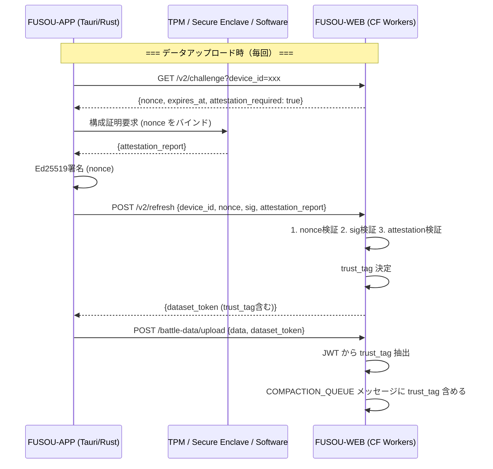
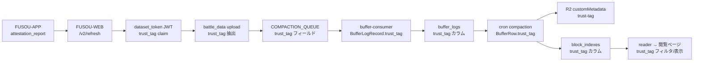
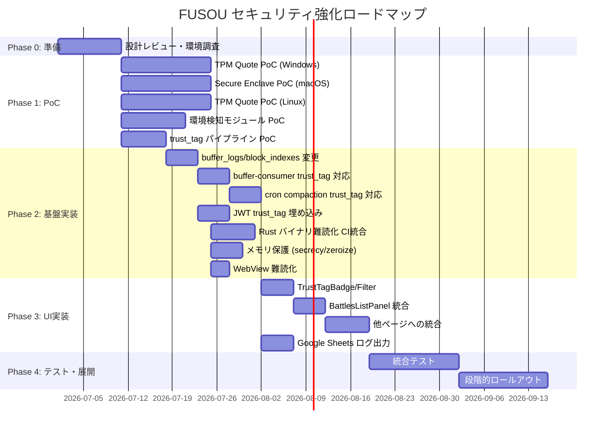

# FUSOU セキュリティ強化 実装計画書

> **Version**: 4.2 (Status Synced)
> **更新日**: 2026-07-03
> **対象**: FUSOU プロジェクト全体
> **粒度**: 開発者が追加調査なしに実装を完了できるレベル（本書の前提・契約に従う場合）

---

## 目次

1. [エグゼクティブサマリー](#1-エグゼクティブサマリー)
2. [信頼度タグの設計](#2-信頼度タグの設計)
3. [ハードウェア構成証明 (Remote Attestation)](#3-ハードウェア構成証明-remote-attestation)
4. [ソフトウェア保護・難読化 (Anti-Tamper)](#4-ソフトウェア保護難読化-anti-tamper)
5. [Compaction パイプラインにおける信頼度タグの貫通設計](#5-compaction-パイプラインにおける信頼度タグの貫通設計)
6. [FUSOU-WEB 閲覧ページへの信頼度表示・フィルタ](#6-fusou-web-閲覧ページへの信頼度表示フィルタ)
7. [管理者ログ: Google Spreadsheet](#7-管理者ログ-google-spreadsheet)
8. [運用とインシデントレスポンス](#8-運用とインシデントレスポンス)
9. [変更対象ファイル全一覧](#9-変更対象ファイル全一覧)
10. [開発フェーズとマイルストーン](#10-開発フェーズとマイルストーン)
11. [Appendix A: 既存セキュリティ実装との統合マトリクス](#appendix-a-既存セキュリティ実装との統合マトリクス)
12. [Appendix B: 残存リスクとトレードオフ](#appendix-b-残存リスクとトレードオフ)
13. [Verification Plan](#verification-plan)

---

## 実装ステータス（2026-07-01）

- 実装済み:
  - 信頼度タグ判定 (`trust-tag.ts`)
  - FUSOU-WEB 側の attestation 検証（TPM/SE/software_fingerprint 判定、失効確認、trust_tag 連携）
  - FUSOU-WORKFLOW 側の trust_tag 伝搬
  - Windows/Linux TPM 収集コード（feature gated）
  - 主要アップロード経路の attestation 要件を `optional` へ統一（ハードウェア非対応端末を許容）
- 未実装/暫定:
  - `GET /api/attestation/config` と `config_sync.rs` は未実装（計画のみ）
  - クライアントのローカルCA自動生成フォールバックは現行コードに残存（廃止未完了）
  - Windows TPM 実装は `unrestricted` 鍵テンプレートを使用しており、Linux 実装と整合していない
  - Windows TPM 実装には Linux 側 `is_valid_attestation_key` 相当の既存ハンドル検証が未実装
  - macOS Secure Enclave 収集は未実装（`secure_enclave_macos.rs` は現在 stub で `Err(...)` を返す）
  - そのため macOS では現状 software_fingerprint へフォールバック
  - `security-framework` / `core-foundation` 依存は現行 `Cargo.toml` へ未導入
- 本ドキュメント内の Secure Enclave 詳細コードは「目標実装案」であり、現行コードとの差分がある

### レビュー反映メモ（2026-07-03）

- 本書 v4.2 の一部サンプルは現行実装との差分があるため、以下を優先修正対象として固定する
  - P0: ローカルCA自動生成フォールバックの撤去
  - P0: `attestation/config` 同期経路の実装
  - P1: Windows TPM の restricted AK 化と既存ハンドル属性検証追加
  - P1: サーバー検証仕様（X.509/OCSP/CRL/URL制限）の文書化整合

---

## 1. エグゼクティブサマリー

### 1.1 プロジェクトの目的

FUSOU は艦隊これくしょん（艦これ）のデータ閲覧・解析アプリケーションであり、ゲームプレイ中に取得されるAPIレスポンスを中間プロキシ（FUSOU-PROXY）で傍受・パースし、リアルタイム表示（FUSOU-APP）およびクラウド集約（FUSOU-WEB via Cloudflare Workers/D1/R2）を行うシステムである。

本計画書の目的は、**アップロードされる各データに「どの程度信頼できるか」の信頼度タグ（Trust Tag）を付与し、Avro compaction を経てもタグが失われないようパイプライン全体を貫通させ、データ閲覧時にその信頼度に基づいてフィルタリング・表示を行う**仕組みを構築することである。

### 1.2 守るべき最重要アセット

| アセット | 具体例 | 現在の保護状態 |
|---------|--------|--------------|
| **サーバーへ送信されるデータの完全性** | battle_data upload、quest-tree ingest、ship-growth ingest | dataset_token (JWT HS256) + Ed25519 device key 署名 |
| **保存データの品質** | R2に保存される戦闘データ・クエストデータ | スキーマ検証 (fingerprints.json) のみ |
| **閲覧データの信頼性** | FUSOU-WEB上で表示される統計・分析データ | フィルタリング機能なし |

### 1.3 現在の技術スタック

| コンポーネント | 技術 | セキュリティ関連の既存実装 |
|--------------|------|------------------------|
| **FUSOU-APP** | Tauri 2 (Rust backend) + Solid.js (SPA frontend) | `fusou-auth`: Ed25519 DeviceKey、Supabase session |
| **FUSOU-PROXY** | Rust (hudsucker/HTTPS proxy) | TLS CONNECT tunnel、CA証明書管理 |
| **FUSOU-WEB** | Astro + Cloudflare Workers | `anonymous-sync-v2`: pepper vault rotation、challenge-response nonce |
| **バックエンド** | Supabase (PostgreSQL + Auth) + Cloudflare (D1/R2/KV/Queues) | Vault-based pepper, HMAC challenge |
| **FUSOU-WORKFLOW** | Cloudflare Workers (Queue consumer + Cron) | Avro OCF compaction、D1 block_indexes |
| **対象OS** | **Windows 10以上、Linux (x64, arm64)、macOS** | Tauri署名キー (Ed25519 minisign pubkey) |
| **予算方針** | 基本的にオープンソースまたはOS標準機能で構成。**新規DB作成不可** | ― |

### 1.4 設計思想：データ中心の信頼度モデル

```
従来:  端末を信頼するかどうか判定 → BANまたは許可
本計画: 各データに信頼度タグを埋め込み → 閲覧時にフィルタ/表示
```

- **ユーザーのBAN・アクセス制限は行わない** — どのユーザーからもデータを受け付ける
- **データに信頼度タグを付与して保存する** — R2に保存されるデータのメタデータとして永続化
- **閲覧者が信頼度でフィルタリングできる** — 既存のFUSOUWEB閲覧ページに信頼度表示・フィルタを追加
- **新規DBは作成しない** — 既存のR2/D1のメタデータフィールドで完結。管理者ログはGoogle Spreadsheetに追記
- **Compaction を貫通する** — `buffer_logs` → `mergeAvroOCF` → R2 + `block_indexes` の全工程でタグを保持

### 1.5 アップロード受理ポリシー（非ハードウェア端末対応）

- 受理ポリシー: データアップロードはハードウェア証明を必須にしない
- 判定ポリシー: 受理後の信頼性は `trust_tag` で区別する
  - TPM / Secure Enclave の検証成功: `hw_verified`
  - ハードウェア非対応だがソフトウェア指紋が妥当: `sw_verified`
  - 証明情報なし: `unverified`
  - 異常・不整合あり: `suspicious`
- 運用意図: 旧端末、Raspberry Pi、TPM 非搭載 Linux でも送信不能にしない
- セキュリティ意図: 受理可否と信頼度を分離し、閲覧・分析側で trust_tag を利用する

### 1.6 環境変数の用途定義（Attestation）

| 変数名 | 役割 | 形式 | 必須度 | 備考 |
| --- | --- | --- | --- | --- |
| `INTEGRITY_TPM_AK_TRUSTED_ROOT_SHA256` | サーバーが TPM AK チェーンを信頼するためのルート証明書 SHA-256 一覧 | JSON 配列 / CSV / 空白区切りの 64 桁 hex | TPM を `hw_verified` にしたい環境で必須 | 未設定時は TPM ハードウェア証明は fail-closed で不成立 |
| `INTEGRITY_SECURE_ENCLAVE_TRUSTED_ROOT_SHA256` | サーバーが Secure Enclave チェーンを信頼するためのルート証明書 SHA-256 一覧 | JSON 配列 / CSV / 空白区切りの 64 桁 hex | Secure Enclave を `hw_verified` にしたい環境で必須 | 未設定時は Secure Enclave ハードウェア証明は fail-closed |
| `FUSOU_TPM_AK_CERT_CHAIN_B64` | クライアントが送る TPM AK 証明書チェーン（leaf→...→root）を明示指定 | JSON 配列または区切り文字列の Base64 DER | 任意（クライアント側） | 本番では管理された固定チェーンのみ使用し、端末ローカル CA 自動生成への依存を禁止する |
| `FUSOU_TPM_AK_PERSISTENT_HANDLE` | TPM 永続 AK ハンドルの固定値 | 16進ハンドル文字列 | 任意（クライアント側） | 主に運用安定化・再起動後再利用のため |

補足:

- 「アップロード可否」と「`hw_verified` 取得可否」は別である
- trusted root 未設定でもアップロード自体は可能（`sw_verified` / `unverified` / `suspicious` で運用）

### 1.7 環境変数とクライアント同期の実装方式（追加調査不要の具体版）

この節は「どの値を、どこで、どう同期するか」を実装レベルで固定します。

#### 1.7.1 同期対象の原則

- 同期しない（サーバー専用）:
  - `INTEGRITY_TPM_AK_TRUSTED_ROOT_SHA256`
  - `INTEGRITY_SECURE_ENCLAVE_TRUSTED_ROOT_SHA256`
  - 理由: サーバーの trust anchor であり、クライアントへ配布する必要がない
- 同期する（クライアント動作に必要）:
  - `FUSOU_TPM_AK_CERT_CHAIN_B64` 相当の「配布済み AK チェーン」
  - `FUSOU_TPM_AK_PERSISTENT_HANDLE` の推奨値
  - feature flags（例: `attestation_required`）

#### 1.7.2 同期チャネル（実装必須）

クライアント同期は環境変数そのものではなく、署名付き設定ドキュメントで行う。

1. サーバーは `/api/attestation/config` を配信
1. サーバーは JSON 本文に Ed25519 署名を付与し、`X-FUSOU-Config-Signature` ヘッダーで返す
1. クライアントは埋め込み公開鍵で署名検証し、成功時のみローカル反映
1. 設定反映後に attestation レポート生成へ使用

#### 1.7.3 設定ドキュメント仕様（固定）

```json
{
  "version": 3,
  "issued_at": "2026-07-03T00:00:00Z",
  "expires_at": "2026-07-10T00:00:00Z",
  "attestation_required": false,
  "tpm": {
    "persistent_handle": "0x81020010",
    "ak_cert_chain_b64": ["<leaf_base64_der>", "<root_base64_der>"]
  }
}
```

制約:

- `expires_at` を必須とし、期限切れ設定は使用禁止
- `version` は単調増加（ロールバック攻撃対策）
- `ak_cert_chain_b64` は leaf -> intermediate -> root 順

#### 1.7.4 サーバー側実装手順（FUSOU-WEB）

1. 新規ルートを追加: `GET /api/attestation/config`
1. `createEnvContext + getEnv` で次を取得
   - `ATTESTATION_CONFIG_JSON`（上記 JSON）
   - `ATTESTATION_CONFIG_SIGNING_PRIVATE_KEY`（Ed25519 秘密鍵）
1. JSON を canonical stringify して署名
1. レスポンス:
   - body: 設定 JSON
   - header: `X-FUSOU-Config-Signature: base64(signature)`
   - header: `Cache-Control: public, max-age=300, must-revalidate`

実装ファイル:

- `packages/FUSOU-WEB/src/server/routes/attestation_config.ts` [NEW]
- `packages/FUSOU-WEB/src/server/utils/attestation-config-sign.ts` [NEW]

#### 1.7.5 クライアント側実装手順（FUSOU-APP）

1. 起動時 + 6時間ごとに `/api/attestation/config` を取得
1. `X-FUSOU-Config-Signature` を埋め込み公開鍵で検証
1. `expires_at` と `version` を検証
1. 成功時のみ `roaming/attestation/config.json` に保存
1. attestation 実行時は保存済み config を優先
   - `tpm.persistent_handle` を `FUSOU_TPM_AK_PERSISTENT_HANDLE` 相当として使用
   - `tpm.ak_cert_chain_b64` を `FUSOU_TPM_AK_CERT_CHAIN_B64` 相当として使用

実装ファイル:

- `packages/FUSOU-APP/src-tauri/src/attestation/config_sync.rs` [NEW]
- `packages/FUSOU-APP/src-tauri/src/attestation/mod.rs` [MODIFY: config 読み込み統合]

#### 1.7.6 失敗時挙動（固定ポリシー）

- 署名検証失敗: 設定更新を破棄し、直前の有効設定を維持
- 設定期限切れ: 更新再試行。更新不可でもアップロードは継続（`sw_verified`/`unverified`）
- チェーン不正: `hw_verified` 付与を行わない（fail-closed）
- いずれの場合も「アップロード拒否」はしない（受理可否と信頼度を分離）

#### 1.7.7 ローテーション手順（運用 Runbook）

1. サーバーで新 config を生成（`version+1`）
1. 新公開鍵を埋め込んだ FUSOU-APP を先行配布する（同時受理なし）
1. 採用率が運用閾値に達したらサーバー秘密鍵を切り替える
1. `ATTESTATION_CONFIG_JSON` / `ATTESTATION_CONFIG_SIGNING_PRIVATE_KEY` を更新してデプロイ
1. 異常時は旧鍵ペアにロールバックし、次の配布ウィンドウで再実施する

運用スクリプト:

- `pnpm run manage-attestation-config-signing-key -- <command>`
- `pnpm run manage-attestation-trusted-roots -- <command>`

#### 1.7.8 実装完了条件（DoD）

- クライアントが署名付き config を取得・検証・永続化できる
- 改ざん config を受け入れない
- 期限切れ時に `hw_verified` は抑止されるがアップロードは継続
- サーバーの `INTEGRITY_*` はクライアントへ露出しない
- 統合テストで version ロールバック攻撃を検出できる

#### 1.7.9 ローカルCA廃止の依存順序（厳守）

1. `GET /api/attestation/config` を先に実装して署名付き設定配布を稼働させる
1. `config_sync.rs` を実装し、クライアントが署名検証済み config を保存できるようにする
1. `resolve_tpm_ak_certificate_chain_b64()` を config 優先へ変更する
1. `build_tpm_ak_certificate_chain_from_local_ca()` と関連検証関数を削除する
1. `INTEGRITY_TPM_AK_TRUSTED_ROOT_SHA256` にサーバー管理の root 群のみを設定し、端末ローカル由来 root を運用禁止にする

注記:

- この順序を逆にすると、TPM 非対応端末を含む実運用で証明データ供給が途切れる
- 廃止後もアップロード受理は継続し、`trust_tag` で信頼度を区別する

---

## 2. 信頼度タグの設計

### 2.1 なぜ数値スコアではなくタグか

デバイスの状態は以下の離散的なカテゴリに完全に対応するため、0–100の連続値では「何点で何が起きたか」が不明瞭になる。タグなら状態と意味が1対1で対応する。

### 2.2 タグ定義

| タグ名 | 意味 | 付与条件 |
|-------|------|---------|
| `hw_verified` | ハードウェア検証済み | TPM 2.0 PCR Quote 検証成功 **または** macOS Secure Enclave 署名検証成功。かつ環境異常なし |
| `sw_verified` | ソフトウェア検証のみ | TPM/Enclave 非搭載だがソフトウェアフィンガープリント検証済み。エミュレータ/デバッガ/フック未検知 |
| `unverified` | 未検証 | attestation 未実装の旧クライアント、または attestation フィールドが空 |
| `suspicious` | 異常検知 | エミュレータ検知 / デバッガ検知 / フッキングツール検知 / スキーマフィンガープリント不一致 のいずれか |

### 2.3 タグ決定ロジック

```
IF attestation_report 存在 AND TPM/Enclave署名検証成功:
  IF 環境異常なし:        → hw_verified
  ELSE:                  → suspicious  (HW検証済みだが環境異常)
ELIF software_fingerprint 存在 AND 検証成功:
  IF 環境異常なし:        → sw_verified
  ELSE:                  → suspicious
ELIF attestation フィールドなし:
                         → unverified
ELSE:
                         → suspicious
```

### 2.4 サーバー側タグ決定の実装

```typescript
// FUSOU-WEB src/server/utils/trust-tag.ts [NEW]

export type TrustTag = 'hw_verified' | 'sw_verified' | 'unverified' | 'suspicious';
export type AttestationLevel = 'tpm' | 'secure_enclave' | 'software_fingerprint' | 'none';

export interface TrustInput {
  attestation_level: AttestationLevel;
  attestation_valid: boolean;         // 署名検証が通ったか
  environment_flags: {
    emulator_detected: boolean;
    debugger_detected: boolean;
    hook_detected: boolean;
  };
  schema_fingerprint_valid: boolean;  // Avroスキーマフィンガープリント照合
}

export function determineTrustTag(input: TrustInput): TrustTag {
  const hasEnvAnomaly =
    input.environment_flags.emulator_detected ||
    input.environment_flags.debugger_detected ||
    input.environment_flags.hook_detected;

  // スキーマフィンガープリント不一致は即 suspicious
  if (!input.schema_fingerprint_valid) return 'suspicious';

  if (input.attestation_level === 'tpm' || input.attestation_level === 'secure_enclave') {
    if (input.attestation_valid && !hasEnvAnomaly) return 'hw_verified';
    return 'suspicious';
  }

  if (input.attestation_level === 'software_fingerprint') {
    if (input.attestation_valid && !hasEnvAnomaly) return 'sw_verified';
    return 'suspicious';
  }

  // attestation_level === 'none'
  return 'unverified';
}
```

### 2.5 Compaction 時のタグ集約ルール

同一 dataset_id の複数行が異なる trust_tag を持つ場合、**最も低い信頼度のタグを採用する** (worst-case):

```typescript
// FUSOU-WORKFLOW src/cron.ts に追加するヘルパー関数
function resolveTrustTag(tags: (string | null)[]): string | null {
  // 優先順位: suspicious > unverified > sw_verified > hw_verified
  if (tags.includes('suspicious')) return 'suspicious';
  if (tags.includes('unverified')) return 'unverified';
  if (tags.includes('sw_verified')) return 'sw_verified';
  if (tags.includes('hw_verified')) return 'hw_verified';
  return null; // 全て null の場合（旧データ）
}
```

---

## 3. ハードウェア構成証明 (Remote Attestation)

### 3.1 対象技術の選定

| プラットフォーム | 利用技術 | 選定理由 | 結果タグ |
|---------------|---------|---------|---------|
| **Windows 10+** | TPM 2.0 (PCR Quote) | Windows 10以降のほぼ全てのPCに搭載。PCRにブート時整合性情報が記録される | `hw_verified` |
| **macOS** | Secure Enclave + P-256 ECDSA | Apple Silicon (M1以降) および Intel Mac with T2 chip で利用可能 | `hw_verified` |
| **Linux** | TPM 2.0 (tpm2-tss) | TPM 2.0搭載機では `/dev/tpm0` 経由で PCR Quote を取得可能 | `hw_verified` |
| **フォールバック** | ソフトウェアベースの環境フィンガープリント | TPM/Secure Enclave非搭載環境向けの代替手段 | `sw_verified` |

### 3.2 Windows: TPM 2.0 の詳細

**クレート**: `tss-esapi` (Rust TSS 2.0 Enhanced System API バインディング)

**代替手段**: `windows-sys` クレートの `Tbsi_*` API (TPM Base Services)。`tss-esapi` が Windows で問題がある場合のフォールバック。

**PCR Quote の取得フロー**:

```rust
// src-tauri/src/attestation/tpm_windows.rs [NEW]
use tss_esapi::{
    Context, Tcti,
    interface_types::{
        algorithm::{HashingAlgorithm, SignatureSchemeAlgorithm},
        resource_handles::Hierarchy,
    },
    structures::{PcrSelectionListBuilder, PcrSlot},
};

#[cfg(target_os = "windows")]
pub struct TpmQuoteResult {
    pub quoted: Vec<u8>,        // TPM2B_ATTEST 構造体（PCR値+qualifyingData含む）
    pub signature: Vec<u8>,     // AIK による RSASSA-PSS または ECDSA 署名
    pub pcr_values: Vec<u8>,    // PCR 0-7 のダイジェスト値
    pub aik_public: Vec<u8>,    // Attestation Identity Key の公開鍵
}

#[cfg(target_os = "windows")]
pub fn get_tpm_quote(nonce: &[u8]) -> Result<TpmQuoteResult, AttestationError> {
    // 1. TCTI 初期化 (Tabrmd or Device)
    //    Windows: Tcti::Tbs (TPM Base Services 経由)
    let tcti = Tcti::from_environment_variable()
        .or_else(|_| Tcti::Tbs)?;
    let mut context = Context::new(tcti)?;

    // 2. Primary Key 作成 (Owner Hierarchy)
    //    テンプレート: RSA 2048 restricted signing key
    let primary = context.create_primary(
      Hierarchy::Owner,
        // ... RSA 2048 signing key template ...
    )?;

    // 3. AIK (Attestation Identity Key) 作成
    //    Primary の下に制限付き署名鍵を作成
    let (aik_private, aik_public) = context.create(
        primary.key_handle,
        // ... restricted signing key template ...
    )?;

    // 4. PCR Selection (PCR 0-7: ファームウェア/ブートローダー整合性)
    let pcr_selection = PcrSelectionListBuilder::new()
        .with_selection(
            HashingAlgorithm::Sha256,
            &[
                PcrSlot::Slot0,  // SRTM (ファームウェア)
                PcrSlot::Slot1,  // Host Platform Configuration
                PcrSlot::Slot2,  // BIOS
                PcrSlot::Slot3,  // BIOS Configuration
                PcrSlot::Slot4,  // MBR/Boot Loader
                PcrSlot::Slot5,  // MBR Configuration
                PcrSlot::Slot6,  // State Transitions
                PcrSlot::Slot7,  // Secure Boot Policy
            ],
        )
        .build()?;

    // 5. Quote 取得 (nonce を qualifyingData としてバインド)
    //    これによりリプレイ攻撃を防止
    let (attest, signature) = context.quote(
        aik_handle,
        nonce,              // challenge nonce をバインド
        SignatureSchemeAlgorithm::RsaPss,
        pcr_selection,
    )?;

    // 6. PCR 値の読み取り
    let (_, _, pcr_digest) = context.pcr_read(pcr_selection)?;

    Ok(TpmQuoteResult {
        quoted: attest.marshall()?,
        signature: signature.marshall()?,
        pcr_values: pcr_digest.value().to_vec(),
        aik_public: aik_public.marshall()?,
    })
}
```

**リスクと課題**:
- 一部の古いデスクトップPCやカスタムビルドPCにはTPMが搭載されていない → フォールバック
- 仮想環境（WSL2、VirtualBox等）ではTPMパススルーが必要
- `tss-esapi` の Windows ビルドには `tpm2-tss` C ライブラリが必要。CI で vcpkg or pre-built を使用

**現行実装との差分と必須修正**:

- 現行 Windows 実装は `create_unrestricted_signing_rsa_public` を使っており、AK 用としては不適切
- Linux 実装は `with_restricted(true)` であり、Windows とセキュリティ特性が不一致
- 修正要件:
  - Windows でも restricted signing key を使用する
  - 既存 persistent handle 読み込み時に鍵属性検証（Linux `is_valid_attestation_key` 相当）を行う

### 3.3 macOS: Secure Enclave の詳細

現状は未実装であり、`FUSOU-APP/src-tauri/src/attestation/secure_enclave_macos.rs` は
`secure enclave attestation is not available in this build` を返す stub 実装です。
以下は将来の目標実装案です。

**クレート（目標案）**: `security-framework` (v2.x) + `core-foundation` (v0.10)

**なぜ必要か**: macOS ユーザーに対しても同等のハードウェアベース証明を提供するため。Apple Silicon (M1以降) および Intel Mac with T2 chip では Secure Enclave が利用可能。

```rust
// src-tauri/src/attestation/secure_enclave_macos.rs [NEW]
#[cfg(target_os = "macos")]
use security_framework::key::{SecKey, KeyType, Token};
use security_framework::item::{ItemClass, ItemSearchOptions};
use core_foundation::dictionary::CFDictionary;
use core_foundation::string::CFString;

/// Secure Enclave 内に P-256 キーペアを作成（初回のみ）
/// 秘密鍵は Enclave 外に出ない
#[cfg(target_os = "macos")]
pub fn create_or_load_enclave_key(tag: &str) -> Result<SecKey, AttestationError> {
    // 1. 既存キーの検索
    //    kSecAttrApplicationTag = "com.fusou.attestation"
    //    kSecAttrTokenID = kSecAttrTokenIDSecureEnclave
    let query = ItemSearchOptions::new()
        .class(ItemClass::key())
        .tag(tag.as_bytes())
        .limit(1);

    if let Ok(existing) = query.search() {
        return Ok(existing.into_key());
    }

    // 2. 新規キー生成
    //    kSecAttrKeyType = kSecAttrKeyTypeECSECPrimeRandom (P-256)
    //    kSecAttrKeySizeInBits = 256
    //    kSecAttrTokenID = kSecAttrTokenIDSecureEnclave
    //    kSecPrivateKeyAttrs:
    //      kSecAttrIsPermanent = true
    //      kSecAttrApplicationTag = tag
    let key = SecKey::generate(
        KeyType::ec_secp256r1(),
        256,
        Token::SecureEnclave,  // Enclave 内に生成
        tag.as_bytes(),
    )?;

    Ok(key)
}

/// challenge nonce に対する ECDSA 署名を Secure Enclave 内で実行
#[cfg(target_os = "macos")]
pub fn sign_with_enclave(key: &SecKey, data: &[u8]) -> Result<Vec<u8>, AttestationError> {
    // SecKeyCreateSignature で P-256 ECDSA 署名
    // アルゴリズム: kSecKeyAlgorithmECDSASignatureMessageX962SHA256
    let signature = key.sign(
        security_framework::key::Algorithm::ECDSASignatureMessageX962SHA256,
        data,
    )?;
    Ok(signature.to_vec())
}

/// Secure Enclave 公開鍵のエクスポート (DER形式)
#[cfg(target_os = "macos")]
pub fn export_public_key(key: &SecKey) -> Result<Vec<u8>, AttestationError> {
    let public_key = key.public_key()?;
    let external_repr = public_key.external_representation()?;
    Ok(external_repr.to_vec())
}
```

**ハードウェアモデル識別** (VM検知にも使用):
```rust
// IOKit を使った AppleDeviceTree プロパティ取得
// sysctl hw.model で "VMware" / "Parallels" 等を検知
```

**リスクと課題**:
- 古い Intel Mac (T2チップ非搭載) では Secure Enclave が利用できない → ソフトウェアフォールバック
- Tauri for macOS のビルドには macOS 環境が必要（CI/CDにmacOSランナー追加が必要）
- `Security.framework` の Rust バインディングは `security-framework` クレート (v2.x) で対応

### 3.4 Linux: TPM 2.0 の詳細

**クレート**: `tss-esapi` で `/dev/tpm0` 経由の PCR Quote 取得。Windows版と同一API。

```rust
// src-tauri/src/attestation/tpm_linux.rs [NEW]
#[cfg(target_os = "linux")]
pub fn get_tpm_quote(nonce: &[u8]) -> Result<TpmQuoteResult, AttestationError> {
    // TCTI: /dev/tpm0 or /dev/tpmrm0 (Resource Manager)
    let tcti = Tcti::Device(DeviceConfig::default())?;
    // 以降は Windows 版と同一の PCR Quote 取得フロー
    // ...
}
```

**リスクと課題**:
- Linux デスクトップユーザーの多くはTPMをBIOSで無効化している可能性
- ARM64 (Raspberry Pi等) ではTPM非搭載が多い → フォールバック
- `/dev/tpm0` へのアクセスに `tss` グループ所属が必要な場合がある

### 3.5 ソフトウェアフィンガープリント（フォールバック）

```rust
// src-tauri/src/attestation/fingerprint.rs [NEW]
use sysinfo::{System, CpuRefreshKind, RefreshKind};

pub struct SoftwareFingerprint {
    pub cpu_brand: String,           // Intel Core i7-12700K 等
    pub cpu_cores: usize,
    pub total_memory_mb: u64,
    pub os_name: String,
    pub os_version: String,
    pub hostname_hash: String,       // SHA-256(hostname) — 生ホスト名は送信しない
    pub machine_id_hash: String,     // SHA-256(/etc/machine-id or WMI UUID or IOKit serial)
}

pub fn collect_fingerprint() -> SoftwareFingerprint {
    let sys = System::new_with_specifics(
        RefreshKind::new().with_cpu(CpuRefreshKind::everything()).with_memory(MemoryRefreshKind::everything()),
    );

    // === Windows ===
    // WMI Win32_ComputerSystemProduct.UUID → machine_id_hash
    // WMI Win32_Processor.Name → cpu_brand

    // === macOS ===
    // IOKit IOPlatformSerialNumber → machine_id_hash
    // sysctl machdep.cpu.brand_string → cpu_brand

    // === Linux ===
    // /etc/machine-id → machine_id_hash
    // /proc/cpuinfo → cpu_brand

    SoftwareFingerprint {
        cpu_brand: sys.cpus().first().map(|c| c.brand().to_string()).unwrap_or_default(),
        cpu_cores: sys.cpus().len(),
        total_memory_mb: sys.total_memory() / 1024 / 1024,
        os_name: System::name().unwrap_or_default(),
        os_version: System::os_version().unwrap_or_default(),
        hostname_hash: sha256_hex(&System::host_name().unwrap_or_default()),
        machine_id_hash: sha256_hex(&get_machine_id()),
    }
}
```

### 3.6 統合モジュール（mod.rs）

注: 現行コードでは macOS Secure Enclave の分岐は未実装のため、結果的に software_fingerprint へフォールバックします。

```rust
// src-tauri/src/attestation/mod.rs [NEW]
pub mod tpm_windows;
pub mod tpm_linux;
pub mod secure_enclave_macos;
pub mod fingerprint;
pub mod environment_check;

#[derive(serde::Serialize)]
pub struct AttestationReport {
    pub attestation_level: String,    // "tpm" | "secure_enclave" | "software_fingerprint" | "none"
    pub attestation_data: Option<Vec<u8>>,   // TPM Quote or Enclave signature
    pub public_key: Option<Vec<u8>>,         // AIK public key or Enclave public key
    pub fingerprint: Option<fingerprint::SoftwareFingerprint>,
    pub environment: environment_check::EnvironmentReport,
}

pub async fn collect_attestation(nonce: &[u8]) -> AttestationReport {
    // 1. TPM / Secure Enclave を試行
    #[cfg(target_os = "windows")]
    if let Ok(quote) = tpm_windows::get_tpm_quote(nonce) {
        return AttestationReport {
            attestation_level: "tpm".to_string(),
            attestation_data: Some(quote.quoted),
            public_key: Some(quote.aik_public),
            fingerprint: Some(fingerprint::collect_fingerprint()),
            environment: environment_check::detect_environment(),
        };
    }

    #[cfg(target_os = "macos")]
    if let Ok(key) = secure_enclave_macos::create_or_load_enclave_key("com.fusou.attestation") {
        if let Ok(sig) = secure_enclave_macos::sign_with_enclave(&key, nonce) {
            let pubkey = secure_enclave_macos::export_public_key(&key).ok();
            return AttestationReport {
                attestation_level: "secure_enclave".to_string(),
                attestation_data: Some(sig),
                public_key: pubkey,
                fingerprint: Some(fingerprint::collect_fingerprint()),
                environment: environment_check::detect_environment(),
            };
        }
    }

    #[cfg(target_os = "linux")]
    if let Ok(quote) = tpm_linux::get_tpm_quote(nonce) {
        return AttestationReport {
            attestation_level: "tpm".to_string(),
            attestation_data: Some(quote.quoted),
            public_key: Some(quote.aik_public),
            fingerprint: Some(fingerprint::collect_fingerprint()),
            environment: environment_check::detect_environment(),
        };
    }

    // 2. フォールバック: ソフトウェアフィンガープリントのみ
    AttestationReport {
        attestation_level: "software_fingerprint".to_string(),
        attestation_data: None,
        public_key: None,
        fingerprint: Some(fingerprint::collect_fingerprint()),
        environment: environment_check::detect_environment(),
    }
}
```

### 3.7 チャレンジは毎回実施する

**毎回チャレンジを実施する理由**: TPM PCR Quote の取得はローカル操作であり、ネットワーク往復は発生しない。

#### レイテンシ分析

| 操作 | 所要時間 | ボトルネック |
|------|---------|------------|
| TPM PCR Quote 取得 (Windows/Linux) | **5–15ms** | TPMチップへのバス通信 (LPC/SPI) |
| Secure Enclave ECDSA 署名 (macOS) | **2–5ms** | Enclave内のP-256演算 |
| ソフトウェアフィンガープリント収集 | **1–3ms** | sysinfo API呼び出し |
| Ed25519 署名 (既存) | **< 1ms** | CPU演算のみ |
| サーバー側検証 (CF Workers) | **3–8ms** | 署名検証のCPU演算 |
| **合計追加レイテンシ** | **~10–25ms** | データアップロード時のみ発生 |

データアップロード自体がネットワーク通信を伴い数百ms～数秒かかる操作であるため、**10–25ms の追加は体感できない**。

### 3.8 全体フロー



### 3.9 チャレンジ生成

既存の challenge endpoint (`anonymous-sync-v2.ts`) の HMAC ベース stateless nonce をそのまま活用する。この nonce を TPM Quote の `qualifyingData` / Secure Enclave 署名のメッセージとしてバインドする。

**変更点**: challenge レスポンスに `attestation_required: true` フィールドを追加（常に true）。

### 3.10 サーバー側 attestation 検証

現行の `attestation-verifier.ts` はスタブではなく、以下を実装している。

- TPM: TPM2B_ATTEST 構造の解析、nonce 束縛確認、quote 署名検証、AK 証明書チェーン検証
- Secure Enclave: 署名検証、証明書チェーン検証
- X.509: 期限、チェーン署名、trusted root 照合、Leaf の OCSP/CRL 失効確認
- URL 制約: revocation fetch は `https:` と `data:` のみ許可し、ローカル/内部宛ホストを拒否

実装依存ライブラリ:

- `@peculiar/x509`
- `@peculiar/asn1-x509`
- `@peculiar/asn1-ocsp`
- `@peculiar/asn1-schema`

AttestationReport の実フィールド（サーバー受理仕様）:

```typescript
type AttestationReport = {
  attestation_level: "tpm" | "secure_enclave" | "software_fingerprint" | "none";
  attestation_data?: string;
  attestation_signature?: string;
  public_key?: string;
  certificate_chain?: string[];
  attestation_format?: string;
  fingerprint?: { machine_id_hash: string; os_name: string; ... };
  environment?: { environment_type?: string; debugger_attached?: boolean; hooks_detected?: string[] };
};
```

revocation URL 制約:

- 許可スキーム: `https`, `data`
- 拒否: localhost / private / internal 宛ホスト
- 目的: SSRF と内部ネットワーク到達の防止

`anonymous-sync-v2.ts` 側での trusted root 注入（接続点）:

```typescript
const secureEnclaveRoots = parseTrustedRootList(getEnv(env, "INTEGRITY_SECURE_ENCLAVE_TRUSTED_ROOT_SHA256"));
const tpmAkRoots = parseTrustedRootList(getEnv(env, "INTEGRITY_TPM_AK_TRUSTED_ROOT_SHA256"));
const trustInput = await verifyAttestation(report, nonce, {
  secureEnclaveTrustedRootSha256: secureEnclaveRoots,
  tpmAkTrustedRootSha256: tpmAkRoots,
});
```

設計上の注意:

- `software_fingerprint` は `fingerprint` が妥当形式なら `attestation_valid=true` となる
- したがって `sw_verified` は耐改ざん保証ではなく、互換性維持のための低強度タグとして扱う
- `sw_verified` を高信頼用途の集計条件に使わないこと（`hw_verified` を別扱いする）

PCR 検証について:

- 現行は nonce 束縛・署名・証明書チェーン検証が中心
- 「PCR ブラックリスト」運用は本書の将来課題であり、現行の必須検証要件ではない

### 3.11 フォールバック戦略

| 端末環境 | 対応 | 結果タグ |
|---------|------|---------|
| TPM 2.0 / Secure Enclave 搭載 + 正常 | フルアテステーション | `hw_verified` |
| TPM / Enclave 搭載 + 環境異常 | アテステーション成功だが環境異常 | `suspicious` |
| TPM / Enclave 搭載 + API失敗 | ソフトウェアフィンガープリント | `sw_verified` |
| TPM / Enclave 非搭載 | ソフトウェアフィンガープリントのみ | `sw_verified` |
| attestation 未実装の旧クライアント | 何も送信されない | `unverified` |

---

## 4. ソフトウェア保護・難読化 (Anti-Tamper)

### 4.1 Rust バイナリ保護

| 保護手法 | 具体的な設定 | 対象ファイル |
|---------|------------|------------|
| **シンボル削除** | `strip = "symbols"` | `FUSOU-APP/src-tauri/Cargo.toml` |
| **パニックメッセージ削除** | `panic = "abort"` | Cargo.toml |
| **LTO** | `lto = true`, `codegen-units = 1` | Cargo.toml |
| **バイナリサイズ最適化** | `opt-level = "z"` | Cargo.toml |
| **文字列暗号化** | `obfstr` クレートでハードコード文字列を暗号化 | attestation/環境検知関連ソース |
| **セキュリティログ抑制** | リリースビルドで auth/attestation ログを無効化 | lib.rs フィルタ設定 |

**Cargo.toml の具体的変更**:

```toml
# FUSOU-APP/src-tauri/Cargo.toml に追加

[profile.release]
strip = "symbols"           # シンボルテーブル削除
panic = "abort"             # パニック時にスタックトレースを生成しない
lto = true                  # Link-Time Optimization (バイナリサイズ削減+インライン最適化)
codegen-units = 1           # 単一コンパイルユニット (最適化品質向上)
opt-level = "z"             # サイズ最適化

[dependencies]
obfstr = "0.4"              # コンパイル時文字列暗号化
sysinfo = "0.31"            # フィンガープリント用 (CPU/メモリ/OS情報取得)

[target.'cfg(target_os = "windows")'.dependencies]
tss-esapi = "7.5"           # TPM 2.0 ESAPI バインディング
windows-sys = { version = "0.52", features = ["Win32_Security_Tpm"] }  # Tbsi_* フォールバック

[target.'cfg(target_os = "linux")'.dependencies]
tss-esapi = "7.5"           # TPM 2.0 ESAPI バインディング

[target.'cfg(target_os = "macos")'.dependencies]
security-framework = "2.11" # Secure Enclave / Keychain API
core-foundation = "0.10"    # Core Foundation bindings

[features]
# リリースビルドではdevtoolsを除外
default = ["devtools"]
devtools = ["tauri/devtools"]  # 開発時のみ有効
```

### 4.2 WebView フロントエンド保護

| 保護手法 | ツール/設定 | 対象 |
|---------|-----------|------|
| **JS 難読化** | `rollup-plugin-obfuscator` (vite plugin) | `FUSOU-APP/vite.config.ts` |
| **ソースマップ無効化** | `build.sourcemap = false` | vite.config.ts |
| **DevTools 無効化** | `devtools` feature をリリースで除外 | Cargo.toml |
| **CSP 強化** | `script-src 'self'` | `FUSOU-APP/src-tauri/tauri.conf.json` |

**vite.config.ts の具体的変更**:

```typescript
// FUSOU-APP/vite.config.ts に追加
import obfuscatorPlugin from 'rollup-plugin-obfuscator';

export default defineConfig({
  // ... 既存設定 ...
  build: {
    sourcemap: false,  // ソースマップ無効化
    rollupOptions: {
      plugins: [
        obfuscatorPlugin({
          options: {
            compact: true,
            controlFlowFlattening: true,        // 制御フロー平坦化
            controlFlowFlatteningThreshold: 0.5, // 50%の関数に適用
            deadCodeInjection: true,             // デッドコード注入
            deadCodeInjectionThreshold: 0.3,     // 30%の率で注入
            stringArray: true,                   // 文字列配列化
            stringArrayRotate: true,
            stringArrayShuffle: true,
            stringArrayThreshold: 0.75,          // 75%の文字列を配列化
            splitStrings: true,
            splitStringsChunkLength: 10,
            identifierNamesGenerator: 'hexadecimal',
            selfDefending: true,                 // 自己防衛（フォーマット検知）
            transformObjectKeys: true,
          },
        }),
      ],
    },
  },
});
```

**tauri.conf.json CSP 強化**:

```json
{
  "app": {
    "security": {
      "csp": "default-src 'self'; script-src 'self'; style-src 'self' 'unsafe-inline'; img-src 'self' https: data:; connect-src 'self' https://*.supabase.co https://*.workers.dev"
    }
  }
}
```

### 4.3 環境検知

環境検知の結果は **BANではなく信頼度タグの決定入力** として使用する。

#### 4.3.1 エミュレータ/仮想マシン検知

```rust
// src-tauri/src/attestation/environment_check.rs [NEW]
pub struct EnvironmentReport {
    pub environment_type: EnvironmentType,
    pub debugger_attached: bool,
    pub hooks_detected: Vec<String>,
}

#[derive(serde::Serialize)]
pub enum EnvironmentType {
    Native,
    VirtualMachine,   // VMware, VirtualBox, Hyper-V, KVM, Parallels (macOS)
    Container,        // Docker, Podman
    WineProton,       // Wine/Proton互換レイヤー
    Unknown,
}

pub fn detect_environment() -> EnvironmentReport {
    EnvironmentReport {
        environment_type: detect_vm(),
        debugger_attached: detect_debugger(),
        hooks_detected: detect_hooks(),
    }
}

fn detect_vm() -> EnvironmentType {
    // === Windows ===
    // 1. CPUID leaf 1, ECX bit 31 (hypervisor present)
    //    unsafe { core::arch::x86_64::__cpuid(1) }.ecx & (1 << 31) != 0
    // 2. WMI Win32_ComputerSystem.Model: "Virtual Machine", "VMware", "VirtualBox"
    // 3. レジストリ: HKLM\SOFTWARE\VMware, Inc.\VMware Tools
    // 4. SMBIOS: /sys/class/dmi/id/sys_vendor (on WSL)

    // === macOS ===
    // 1. sysctl hw.model → "VMware" / "Parallels" / "VirtualBox" を含むか
    // 2. sysctl kern.hv_vmm_present → 1 なら VM
    // 3. IOServiceMatching("IOPlatformExpertDevice") → manufacturer チェック

    // === Linux ===
    // 1. /sys/class/dmi/id/sys_vendor → "QEMU", "VMware", "innotek GmbH" (VirtualBox)
    // 2. /proc/cpuinfo → "hypervisor" flag の存在
    // 3. systemd-detect-virt コマンドの出力
    // 4. /proc/1/cgroup に "docker" or "lxc" → Container

    EnvironmentType::Native
}

fn detect_debugger() -> bool {
    // === Windows ===
    // windows_sys::Win32::System::Diagnostics::Debug::IsDebuggerPresent()
    // NtQueryInformationProcess(ProcessDebugPort) → 0 以外ならデバッガ

    // === macOS ===
    // sysctl(CTL_KERN, KERN_PROC, KERN_PROC_PID, getpid()) → kp_proc.p_flag & P_TRACED

    // === Linux ===
    // /proc/self/status の TracerPid 行 → 0 以外ならデバッガ attached

    #[cfg(target_os = "linux")]
    {
        if let Ok(status) = std::fs::read_to_string("/proc/self/status") {
            for line in status.lines() {
                if line.starts_with("TracerPid:") {
                    let pid_str = line.split(':').nth(1).unwrap_or("0").trim();
                    return pid_str != "0";
                }
            }
        }
    }
    false
}

fn detect_hooks() -> Vec<String> {
    let mut detected = Vec::new();

    // === 全 OS 共通: Frida 検知 ===
    // 1. TCP ポート 27042 (Frida デフォルト) への接続試行
    // 2. /proc/self/maps (Linux) に "frida" を含む行
    //    macOS: _dyld_get_image_name で "FridaGadget" 検索

    // === macOS ===
    // DYLD_INSERT_LIBRARIES 環境変数の存在チェック
    if std::env::var("DYLD_INSERT_LIBRARIES").is_ok() {
        detected.push("DYLD_INSERT_LIBRARIES".to_string());
    }

    // === Linux ===
    // LD_PRELOAD 環境変数の存在チェック
    if std::env::var("LD_PRELOAD").is_ok() {
        detected.push("LD_PRELOAD".to_string());
    }

    // === Windows ===
    // 不審DLL列挙: EnumProcessModules → GetModuleFileNameEx
    // "substrata.dll", "frida-agent.dll" 等をチェック

    #[cfg(target_os = "linux")]
    {
        if let Ok(maps) = std::fs::read_to_string("/proc/self/maps") {
            if maps.to_lowercase().contains("frida") {
                detected.push("frida".to_string());
            }
        }
    }

    detected
}
```

### 4.4 実行時メモリ保護

| 保護対象 | 手法 | 対象ファイル |
|---------|------|------------|
| **Ed25519 秘密鍵** | `secrecy::SecretVec` + `zeroize` | `fusou-auth/src/device_key.rs` |
| **Supabase access_token** | `secrecy::SecretString` | `fusou-auth/src/manager.rs` |
| **dataset_token** | `secrecy::SecretString` | `fusou-auth/src/types.rs` |
| **attestation_report 内の秘密情報** | Drop 時に `zeroize` | attestation モジュール全体 |

**fusou-auth/Cargo.toml 追加依存**:

```toml
secrecy = { version = "0.8", features = ["serde"] }
zeroize = { version = "1.8", features = ["derive"] }
```

**device_key.rs の変更例**:

```rust
use secrecy::{ExposeSecret, SecretVec};
use zeroize::Zeroize;

pub struct DeviceKeyPair {
    // 変更前: secret_key: Vec<u8>,
    secret_key: SecretVec<u8>,      // ← Drop時に自動ゼロ化
    public_key: Vec<u8>,
}

impl DeviceKeyPair {
    pub fn sign(&self, message: &[u8]) -> Vec<u8> {
        let sk_bytes = self.secret_key.expose_secret();
        // ... Ed25519 署名 ...
    }
}
```

---

## 5. Compaction パイプラインにおける信頼度タグの貫通設計

### 5.1 現在のデータフロー

```
FUSOU-APP → FUSOU-WEB (upload) → COMPACTION_QUEUE → FUSOU-WORKFLOW (buffer-consumer)
  → buffer_logs (D1/TiDB) → cron compaction → mergeAvroOCF → R2 + block_indexes (D1)
  → FUSOU-WEB (reader) → 閲覧ページ
```

### 5.2 各段階での信頼度タグの伝搬

信頼度タグがパイプライン全体で**絶対に失われない**ことを保証する設計：



### 5.3 具体的な変更箇所（パイプライン順）

#### Stage 1: dataset_token JWT への trust_tag 埋め込み

**ファイル**: `FUSOU-WEB/src/server/routes/anonymous-sync-v2.ts`

`issueDatasetToken` 関数 (L195付近) を変更:

```typescript
async function issueDatasetToken(options: {
  secret: string;
  canonicalUserId: string;
  pid: string;
  now: number;
  trustTag?: string;   // ← 追加: 'hw_verified' | 'sw_verified' | 'unverified' | 'suspicious'
}): Promise<{ token: string; expiresAt: number }> {
  const secretKey = new TextEncoder().encode(options.secret);
  const expiresAt = options.now + DATASET_TOKEN_TTL_SECONDS;
  const token = await new SignJWT({
    sub: options.canonicalUserId,
    dataset_id: options.pid,
    typ: "dataset",
    aud: "fusou-upload",
    trust_tag: options.trustTag ?? "unverified",  // ← 追加
  })
    .setProtectedHeader({ alg: "HS256" })
    .setIssuedAt(options.now)
    .setExpirationTime(expiresAt)
    .sign(secretKey);
  return { token, expiresAt };
}
```

同ファイルの refresh ハンドラで attestation_report を受け取り、`verifyAttestation` → `determineTrustTag` → `issueDatasetToken` の順で処理する。

---

#### Stage 2: COMPACTION_QUEUE メッセージへの trust_tag 追加

**ファイル**: `FUSOU-WEB/src/server/routes/battle_data.ts`

`executionProcessor` 内のメッセージ構築 (L738付近):

```typescript
const messageBody = {
  batched: true,
  datasetId,
  periodTag,
  tableVersion,
  triggeredAt,
  userId: user.id,
  payload_base64: b64,
  table_offsets: validatedOffsets,
  trust_tag: authContext.datasetToken?.trust_tag ?? "unverified",  // ← 追加
};
```

---

#### Stage 3: buffer-consumer での trust_tag 保持

**ファイル**: `FUSOU-WORKFLOW/src/buffer-consumer.ts`

##### 3a. BufferLogRecord に trust_tag 追加 (L35-43)

```typescript
interface BufferLogRecord {
  dataset_id: string;
  table_name: string;
  period_tag: string;
  table_version: string;
  timestamp: number;
  data: ArrayBuffer;
  uploaded_by?: string;
  trust_tag?: string;    // ← 追加
}
```

##### 3b. BatchedQueueMessage に trust_tag 追加 (L66-75)

```typescript
interface BatchedQueueMessage {
  batched: true;
  datasetId: string;
  periodTag: string;
  tableVersion: string;
  triggeredAt?: string;
  userId?: string;
  payload_base64: string;
  table_offsets: TableOffset[];
  trust_tag?: string;    // ← 追加
}
```

##### 3c. normalizeMessage でレコードに trust_tag を伝搬 (L90-174)

batched メッセージの処理 (L126) と legacy メッセージの処理 (L160) の両方の `records.push` に `trust_tag: msg.trust_tag ?? "unverified"` を追加。

##### 3d. handleBufferConsumerChunked の recordsForInsert マッピング (L282-289)

```typescript
const recordsForInsert = allRecords.map((r) => ({
  dataset_id: r.dataset_id,
  table_name: r.table_name,
  period_tag: r.period_tag,
  table_version: r.table_version,
  timestamp: r.timestamp,
  data: r.data,
  uploaded_by: r.uploaded_by,
  trust_tag: r.trust_tag,         // ← 追加
}));
```

---

#### Stage 4: DB モジュールへの trust_tag カラム追加

**ファイル**: `FUSOU-WORKFLOW/src/db/index.ts` (L75-84)

```typescript
export interface BufferLogRecord {
  id: number;
  dataset_id: string;
  table_name: string;
  period_tag: string;
  table_version: string;
  timestamp: number;
  data: ArrayBuffer | Uint8Array;
  uploaded_by: string | null;
  trust_tag: string | null;       // ← 追加
}
```

`insertBufferLogsWithFallback` の records パラメータ型にも `trust_tag` を追加。

**ファイル**: `FUSOU-WORKFLOW/src/db/d1-client.ts`

`bulkInsertBufferLogs` と `insertBufferLog` の INSERT SQL に `trust_tag` カラムを追加:

```sql
INSERT INTO buffer_logs (dataset_id, table_name, period_tag, table_version, timestamp, data, uploaded_by, trust_tag)
VALUES (?, ?, ?, ?, ?, ?, ?, ?)
```

SELECT 文にも `trust_tag` を追加。

**ファイル**: `FUSOU-WORKFLOW/src/db/tidb-client.ts`

同上。TiDB の INSERT/SELECT 文にも `trust_tag` カラムを追加。

**マイグレーション (D1)**:

```sql
ALTER TABLE buffer_logs ADD COLUMN trust_tag TEXT DEFAULT NULL;
```

**マイグレーション (TiDB)**:

```sql
ALTER TABLE buffer_logs ADD COLUMN trust_tag VARCHAR(20) DEFAULT NULL;
```

> `buffer_logs` は一時テーブル（compaction 後に削除される）なので、既存データへの影響はない。

---

#### Stage 5: Compaction (cron.ts) での trust_tag 保持

**ファイル**: `FUSOU-WORKFLOW/src/cron.ts`

##### 5a. BufferRow に trust_tag 追加 (L35-44)

```typescript
interface BufferRow {
  id: number;
  dataset_id: string;
  table_name: string;
  period_tag: string;
  table_version: string;
  timestamp: number;
  data: ArrayBuffer;
  uploaded_by: string | null;
  trust_tag: string | null;     // ← 追加
}
```

##### 5b. DatasetBlock に trust_tag 追加 (L46-52)

```typescript
interface DatasetBlock {
  dataset_id: string;
  avroData: Uint8Array;
  recordCount: number;
  startTimestamp: number;
  endTimestamp: number;
  trust_tag: string | null;     // ← 追加
}
```

##### 5c. BlockIndexRow に trust_tag 追加 (L65-76)

```typescript
interface BlockIndexRow {
  dataset_id: string;
  table_name: string;
  table_version: string;
  period_tag: string;
  file_id: number;
  start_byte: number;
  length: number;
  record_count: number;
  start_timestamp: number;
  end_timestamp: number;
  trust_tag: string | null;     // ← 追加
}
```

##### 5d. convertToBufferRow (L79-97) で trust_tag を伝搬

```typescript
function convertToBufferRow(record: BufferLogRecord): BufferRow {
  return {
    // ... 既存フィールド ...
    trust_tag: record.trust_tag,  // ← 追加
  };
}
```

##### 5e. groupByDataset (L103-193) で trust_tag をブロックに集約

```typescript
// L131-183 の blocks.push 部分に追加
const trustTags = rows.map(r => r.trust_tag);
const resolvedTag = resolveTrustTag(trustTags);

blocks.push({
  dataset_id,
  avroData: mergedAvro,
  recordCount: rows.length,
  startTimestamp: Math.min(...timestamps),
  endTimestamp: Math.max(...timestamps),
  trust_tag: resolvedTag,       // ← 追加
});
```

##### 5f. R2 customMetadata に trust_tag を追加 (L451-464)

```typescript
await env.BATTLE_DATA_BUCKET.put(filePath, combined, {
  httpMetadata: { contentType: "application/octet-stream" },
  customMetadata: {
    "archive-date": new Date().toISOString(),
    "run-timestamp": String(runTimestamp),
    "block-count": String(chunk.blocks.length),
    format: "avro-ocf",
    "table-version": group.key.table_version,
    table: group.key.table_name,
    period: group.key.period_tag,
    "file-index": String(fileIndex + 1),
    "total-files": String(fileChunks.length),
    "trust-tag": resolveTrustTag(chunk.blocks.map(b => b.trust_tag)) ?? "unverified",  // ← 追加
  },
});
```

##### 5g. insertBlockIndexes (L271-319) に trust_tag カラム追加

```typescript
const sql = `
  INSERT INTO block_indexes (dataset_id, table_name, table_version, period_tag, file_id, start_byte, length, record_count, start_timestamp, end_timestamp, trust_tag)
  VALUES ${chunk.map(() => "(?,?,?,?,?,?,?,?,?,?,?)").join(",")}
`;
for (const r of chunk) {
  params.push(
    r.dataset_id, r.table_name, r.table_version, r.period_tag,
    r.file_id, r.start_byte, r.length, r.record_count,
    r.start_timestamp, r.end_timestamp,
    r.trust_tag ?? "unverified",
  );
}
```

##### 5h. blockIndexes 構築 (L478-496) に trust_tag 追加

```typescript
blockIndexes.push({
  dataset_id: block.dataset_id,
  table_name: group.key.table_name,
  table_version: group.key.table_version,
  period_tag: group.key.period_tag,
  file_id: fileId,
  start_byte: boundary.startByte,
  length: boundary.length,
  record_count: block.recordCount,
  start_timestamp: block.startTimestamp,
  end_timestamp: block.endTimestamp,
  trust_tag: block.trust_tag,     // ← 追加
});
```

---

#### Stage 6: D1 block_indexes テーブルへのカラム追加

**新規マイグレーション**: `FUSOU-WEB/migrations/battle-index/XXXX_add_trust_tag.sql`

```sql
ALTER TABLE block_indexes ADD COLUMN trust_tag TEXT DEFAULT NULL;
-- NULL = compaction前の既存データ（旧クライアント）→ 閲覧時に 'unverified' として扱う
```

---

#### Stage 7: Reader での trust_tag 伝搬

**ファイル**: `FUSOU-WORKFLOW/src/reader.ts`

`block_indexes` から読み込む SELECT 文に `trust_tag` を追加し、レスポンスの各レコードに `trust_tag` を含める。

---

#### Stage 8: FUSOU-WEB records エンドポイントでの trust_tag 伝搬

**ファイル**: `FUSOU-WEB/src/server/routes/battle_data.ts` (records GET ハンドラ)

`block_indexes` JOIN 結果の `trust_tag` をレスポンスの各レコードに付与。

---

## 6. FUSOU-WEB 閲覧ページへの信頼度表示・フィルタ

### 6.1 対象ページ

| ページ | ファイル | 追加内容 |
|-------|---------|---------|
| 戦闘一覧 | `src/components/features/stats/solid/BattlesListPanel.tsx` | 各行に信頼度バッジ + ヘッダーにフィルタドロップダウン |
| 戦闘詳細 | `src/components/features/battle-detail/` | 信頼度タグ表示 |
| ドロップ統計 | `src/components/features/drops/` | 信頼度フィルタ付き集計 |
| 艦娘成長 | `src/components/features/ship-growth/` | 信頼度バッジ |
| マップフロー | `src/components/features/map-flow/` | 信頼度バッジ |
| クエストツリー | `src/components/features/quests/` | 信頼度バッジ |

### 6.2 TrustTagBadge コンポーネント

```tsx
// src/components/common/solid/TrustTagBadge.tsx [NEW]
/** @jsxImportSource solid-js */

const TAG_CONFIG = {
  hw_verified: { label: "HW検証済", class: "badge-success", icon: "🛡️" },
  sw_verified: { label: "SW検証済", class: "badge-info",    icon: "✅" },
  unverified:  { label: "未検証",   class: "badge-ghost",   icon: "❓" },
  suspicious:  { label: "要注意",   class: "badge-error",   icon: "⚠️" },
} as const;

export default function TrustTagBadge(props: { tag: string | null | undefined }) {
  const config = () => TAG_CONFIG[props.tag as keyof typeof TAG_CONFIG] ?? TAG_CONFIG.unverified;
  return (
    <span class={`badge badge-sm ${config().class}`} title={`信頼度: ${props.tag ?? 'unverified'}`}>
      {config().icon} {config().label}
    </span>
  );
}
```

### 6.3 TrustTagFilter コンポーネント

```tsx
// src/components/common/solid/TrustTagFilter.tsx [NEW]
/** @jsxImportSource solid-js */

export type TrustFilterValue = 'all' | 'hw_verified' | 'sw_or_hw' | 'no_suspicious';

export default function TrustTagFilter(props: {
  value: TrustFilterValue;
  onChange: (v: TrustFilterValue) => void;
}) {
  return (
    <select class="select select-sm select-bordered"
            value={props.value}
            onChange={(e) => props.onChange(e.currentTarget.value as TrustFilterValue)}>
      <option value="all">全データ</option>
      <option value="no_suspicious">⚠️ 要注意を除外</option>
      <option value="sw_or_hw">✅ SW/HW検証済みのみ</option>
      <option value="hw_verified">🛡️ HW検証済みのみ</option>
    </select>
  );
}

/** フィルタロジック（filteredBattles memo 等で使用） */
export function matchesTrustFilter(trustTag: string | null | undefined, filter: TrustFilterValue): boolean {
  const tag = trustTag ?? 'unverified';
  switch (filter) {
    case 'all': return true;
    case 'hw_verified': return tag === 'hw_verified';
    case 'sw_or_hw': return tag === 'hw_verified' || tag === 'sw_verified';
    case 'no_suspicious': return tag !== 'suspicious';
    default: return true;
  }
}
```

### 6.4 BattlesListPanel.tsx への具体的統合

**ファイル**: `src/components/features/stats/solid/BattlesListPanel.tsx`

1. **テーブルヘッダーに「信頼度」列を追加** (L193-202)

```tsx
<tr>
  <th>日時</th>
  <th>マップ</th>
  <th>セル</th>
  <th>陣形</th>
  <th>制空</th>
  <th>結果</th>
  <th>ドロップ</th>
  <th>信頼度</th>     {/* ← 追加 */}
  <th></th>
</tr>
```

2. **各行に TrustTagBadge を追加** (L222-251)

```tsx
<td><TrustTagBadge tag={b.trust_tag} /></td>
```

3. **filteredBattles memo にフィルタ条件追加** (L126-135)

```tsx
const [trustFilter, setTrustFilter] = createSignal<TrustFilterValue>('all');

const filteredBattles = createMemo(() => {
  let list = d.battleRecords();
  if (d.resultFilter()) {
    list = list.filter((b) => battleResultOf(b)?.win_rank === d.resultFilter());
  }
  if (d.mapFilter()) {
    list = list.filter((b) => mapKeyOf(b) === d.mapFilter());
  }
  if (trustFilter() !== 'all') {
    list = list.filter((b) => matchesTrustFilter(b.trust_tag, trustFilter()));
  }
  return list;
});
```

4. **colspan の更新** (L207, L211): 8 → 9

### 6.5 データ取得APIへの trust_tag 伝搬

`FUSOU-WEB/src/features/battles/data-service.ts` で取得するレコードは `block_indexes` の trust_tag と紐づく。`/api/battle-data/global/records` エンドポイントのレスポンスに `trust_tag` を含めるよう battle_data.ts の records ハンドラを変更する。

### 6.6 スキーマフィンガープリント照合（既存拡張）

`configs/fingerprints.json` のフィンガープリントをサーバー側でも照合し、trust_tag 決定の入力とする。

- フィンガープリント一致 → `schema_fingerprint_valid: true`
- 不一致 → `schema_fingerprint_valid: false` → `suspicious`

---

## 7. 管理者ログ: Google Spreadsheet

新規DBは作らず、管理者の Google Drive にある Spreadsheet に異常検知ログを追記する。

```typescript
// FUSOU-WEB src/server/utils/admin-logger.ts [NEW]

/**
 * Google Sheets API v4 を使用して Spreadsheet にログ行を追記
 * Service Account JWT 認証を使用（Wrangler secret に格納）
 */
export async function logToAdminSpreadsheet(options: {
  spreadsheetId: string;        // Wrangler secret: GOOGLE_SHEETS_ADMIN_LOG_ID
  sheetName: string;            // "security_log" 等
  googleServiceAccountKey: string; // Wrangler secret: GOOGLE_SERVICE_ACCOUNT_KEY (JSON文字列)
  row: {
    timestamp: string;
    event_type: string;          // 'suspicious_upload' | 'attestation_failed' | 'emulator_detected'
    dataset_id: string;
    trust_tag: string;
    attestation_level: string;
    details: string;
  };
}): Promise<void> {
  // 1. Service Account JSON からトークンを生成
  const serviceAccount = JSON.parse(options.googleServiceAccountKey);
  const now = Math.floor(Date.now() / 1000);

  // JWT Header + Claims
  const header = { alg: 'RS256', typ: 'JWT' };
  const claims = {
    iss: serviceAccount.client_email,
    scope: 'https://www.googleapis.com/auth/spreadsheets',
    aud: 'https://oauth2.googleapis.com/token',
    exp: now + 3600,
    iat: now,
  };

  // JWT 署名 (RS256) → access_token 取得
  // ... (crypto.subtle.importKey + crypto.subtle.sign) ...

  // 2. Google Sheets API v4 append
  const url = `https://sheets.googleapis.com/v4/spreadsheets/${options.spreadsheetId}/values/${options.sheetName}!A:F:append?valueInputOption=USER_ENTERED`;
  const body = {
    values: [[
      options.row.timestamp,
      options.row.event_type,
      options.row.dataset_id,
      options.row.trust_tag,
      options.row.attestation_level,
      options.row.details,
    ]],
  };

  await fetch(url, {
    method: 'POST',
    headers: {
      'Authorization': `Bearer ${accessToken}`,
      'Content-Type': 'application/json',
    },
    body: JSON.stringify(body),
  });
}
```

**Wrangler secrets に設定するもの**:
- `GOOGLE_SHEETS_ADMIN_LOG_ID`: Spreadsheet ID (URL中の `/d/{ID}/edit` 部分)
- `GOOGLE_SERVICE_ACCOUNT_KEY`: Service Account の認証情報 JSON 文字列

**ログ出力しきい値**: `trust_tag === 'suspicious'` の場合のみ記録（Spreadsheetの肥大化防止）

**Spreadsheet のカラム構成**:

| A: timestamp | B: event_type | C: dataset_id | D: trust_tag | E: attestation_level | F: details |

---

## 8. 運用とインシデントレスポンス

### 8.1 鍵ローテーション

| 鍵/秘密 | 現在のローテーション方式 | 変更 |
|---------|---------------------|------|
| **Pepper (HMAC-SHA256)** | Vault RPC + accept_versions | 変更なし（監査済み） |
| **Challenge HMAC Secret** | Wrangler secret | 90日ごとの定期ローテーションをランブックに追加 |
| **DATASET_TOKEN_SECRET** | Wrangler secret | 90日ごとの定期ローテーション |
| **Ed25519 DeviceKey** | 端末ごとに一度生成 | ローテーション不要 |
| **Google Service Account Key** | Wrangler secret | 年次ローテーション |

### 8.2 継続的更新スケジュール

```
日次:  Cloudflare Workers ログで trust_tag = 'suspicious' のアップロードを監視
週次:  Google Spreadsheet のログレビュー
月次:  難読化ツールの新バージョン適用検討
四半期: 鍵ローテーション、検知ロジック全面レビュー
随時:  新たな攻撃手法報告時の緊急パッチ
```

- **サーバー側更新**: Cloudflare Workers は即時デプロイ（ダウンタイムゼロ）。信頼度タグ計算ロジックの変更はクライアント更新不要
- **クライアント側更新**: Tauri auto-updater で自動更新。サーバーで `min_client_version` チェック

### 8.3 旧クライアントからのデータ

attestation 未実装の旧クライアントからアップロードされたデータは `trust_tag = NULL` として保存される。FUSOU-WEBの閲覧ページでは「❓ 未検証」バッジで表示される。フィルタで「HW検証済みのみ」「SW/HW検証済みのみ」を選択すると除外される。

---

## 9. 変更対象ファイル全一覧

### FUSOU-APP (Tauri/Rust クライアント)

| ファイル | 種別 | 変更内容 |
|---------|------|---------|
| `FUSOU-APP/src-tauri/Cargo.toml` | MODIFY | `tss-esapi`, `sysinfo`, `obfstr`, `[profile.release]` 設定追加（`security-framework` は未導入） |
| `FUSOU-APP/src-tauri/src/attestation/mod.rs` | NEW | TPM/Enclave/フィンガープリント/環境検知の統合モジュール |
| `FUSOU-APP/src-tauri/src/attestation/tpm_windows.rs` | NEW | Windows TPM 2.0 PCR Quote 取得 |
| `FUSOU-APP/src-tauri/src/attestation/tpm_linux.rs` | NEW | Linux TPM 2.0 PCR Quote 取得 |
| `FUSOU-APP/src-tauri/src/attestation/secure_enclave_macos.rs` | PARTIAL | macOS Secure Enclave 収集の stub（未実装） |
| `FUSOU-APP/src-tauri/src/attestation/fingerprint.rs` | NEW | ソフトウェアフィンガープリント収集 |
| `FUSOU-APP/src-tauri/src/attestation/environment_check.rs` | NEW | エミュレータ/デバッガ/フック検知 |
| `FUSOU-APP/vite.config.ts` | MODIFY | `rollup-plugin-obfuscator` 追加、`sourcemap: false` |
| `FUSOU-APP/src-tauri/tauri.conf.json` | MODIFY | CSP 強化 |

### fusou-auth (認証ライブラリ)

| ファイル | 種別 | 変更内容 |
|---------|------|---------|
| `fusou-auth/Cargo.toml` | MODIFY | `secrecy`, `zeroize` 追加 |
| `fusou-auth/src/device_key.rs` | MODIFY | `SecretVec` + `zeroize` で秘密鍵保護 |
| `fusou-auth/src/manager.rs` | MODIFY | `refresh_dataset_token_v2` に `attestation_report` パラメータ追加 |
| `fusou-auth/src/types.rs` | MODIFY | `SecretString` で token 保護 |

### FUSOU-WEB (Cloudflare Workers + Astro)

| ファイル | 種別 | 変更内容 |
|---------|------|---------|
| `FUSOU-WEB/src/server/routes/anonymous-sync-v2.ts` | MODIFY | refresh に attestation 検証、`issueDatasetToken` に trust_tag claim 追加 |
| `FUSOU-WEB/src/server/routes/battle_data.ts` | MODIFY | COMPACTION_QUEUE メッセージに trust_tag、records レスポンスに trust_tag |
| `FUSOU-WEB/src/server/types.ts` | MODIFY | `TrustTag` 型定義追加 |
| `FUSOU-WEB/src/server/utils/trust-tag.ts` | NEW | タグ決定ロジック (`determineTrustTag`) |
| `FUSOU-WEB/src/server/utils/attestation-verifier.ts` | NEW | TPM Quote / Enclave 署名 / フィンガープリント検証 |
| `FUSOU-WEB/src/server/utils/admin-logger.ts` | NEW | Google Sheets API v4 ログ出力 |
| `FUSOU-WEB/migrations/battle-index/XXXX_add_trust_tag.sql` | NEW | `block_indexes` に `trust_tag` カラム追加 |
| `FUSOU-WEB/src/components/common/solid/TrustTagBadge.tsx` | NEW | 信頼度バッジコンポーネント |
| `FUSOU-WEB/src/components/common/solid/TrustTagFilter.tsx` | NEW | 信頼度フィルタコンポーネント |
| `FUSOU-WEB/src/components/features/stats/solid/BattlesListPanel.tsx` | MODIFY | 信頼度バッジ列・フィルタ追加 |
| `FUSOU-WEB/src/components/features/battle-detail/` | MODIFY | 信頼度タグ表示 |
| `FUSOU-WEB/src/components/features/drops/` | MODIFY | 信頼度フィルタ付き集計 |
| `FUSOU-WEB/src/components/features/ship-growth/` | MODIFY | 信頼度バッジ |
| `FUSOU-WEB/src/components/features/map-flow/` | MODIFY | 信頼度バッジ |
| `FUSOU-WEB/src/components/features/quests/` | MODIFY | 信頼度バッジ |
| `FUSOU-WEB/src/features/battles/data-service.ts` | MODIFY | trust_tag フィールド伝搬 |

### FUSOU-WORKFLOW (Compaction Worker)

| ファイル | 種別 | 変更内容 |
|---------|------|---------|
| `FUSOU-WORKFLOW/src/buffer-consumer.ts` | MODIFY | `BufferLogRecord` / `BatchedQueueMessage` / `normalizeMessage` に trust_tag 追加 |
| `FUSOU-WORKFLOW/src/cron.ts` | MODIFY | `BufferRow` / `DatasetBlock` / `BlockIndexRow` に trust_tag。R2 customMetadata に trust-tag。`insertBlockIndexes` SQL に trust_tag。`resolveTrustTag` ヘルパー追加 |
| `FUSOU-WORKFLOW/src/db/index.ts` | MODIFY | `BufferLogRecord` / `insertBufferLogsWithFallback` に trust_tag |
| `FUSOU-WORKFLOW/src/db/d1-client.ts` | MODIFY | INSERT/SELECT 文に trust_tag カラム追加 |
| `FUSOU-WORKFLOW/src/db/tidb-client.ts` | MODIFY | INSERT/SELECT 文に trust_tag カラム追加 |
| `FUSOU-WORKFLOW/src/reader.ts` | MODIFY | SELECT 文に trust_tag。レスポンスに trust_tag 含める |

---

## 10. 開発フェーズとマイルストーン

### 10.1 フェーズ概要



### 10.2 Phase 1: PoC で検証すべき技術的ハードル

| PoC | 検証内容 | 成功基準 |
|-----|---------|---------|
| TPM Quote (Windows) | `tss-esapi` で PCR Quote 取得+署名検証 | 3台以上の異なるHWで成功 |
| Secure Enclave (macOS) | `security-framework` で Enclave内P-256署名 | Apple Silicon + Intel T2 Mac で成功 |
| TPM Quote (Linux) | `tss-esapi` で PCR Quote 取得 | Ubuntu 22.04/24.04 で成功 |
| 環境検知 | VM/エミュレータ/デバッガ検知精度 | 正常環境での誤検知率 < 0.1% |
| trust_tag パイプライン | upload → buffer_logs → compaction → block_indexes の全工程でタグ保持 | compaction 前後でタグが一致 |

### 10.3 Phase 4: 段階的ロールアウト

| 段階 | 対象 | 期間 |
|-----|------|------|
| Stage 1 | 開発者 (1–3人) | 1週間 |
| Stage 2 | テスター (10–20人) | 1週間 |
| Stage 3 | 全ユーザー | 1週間 |

---

## Appendix A: 既存セキュリティ実装との統合マトリクス

| 既存実装 | ファイル | 統合ポイント |
|---------|---------|------------|
| Ed25519 DeviceKey | `fusou-auth/src/device_key.rs` | `secrecy` ラッパー追加 |
| anonymous-sync-v2 refresh | `FUSOU-WEB/src/server/routes/anonymous-sync-v2.ts` | attestation_report 検証 + trust_tag JWT埋め込み |
| challenge nonce (HMAC) | `FUSOU-WEB/src/server/utils/pepper.ts` | nonce を TPM Quote / Enclave 署名にバインド |
| dataset_token (JWT HS256) | `anonymous-sync-v2.ts` `issueDatasetToken()` | `trust_tag` claim 追加 |
| battle_data upload | `FUSOU-WEB/src/server/routes/battle_data.ts` | trust_tag 抽出 → COMPACTION_QUEUE メッセージ付与 |
| COMPACTION_QUEUE consumer | `FUSOU-WORKFLOW/src/buffer-consumer.ts` | trust_tag を buffer_logs に保存 |
| Compaction cron | `FUSOU-WORKFLOW/src/cron.ts` | trust_tag を R2 customMetadata + block_indexes に保存 |
| Avro OCF merger | `FUSOU-WORKFLOW/src/avro-merger.ts` | 変更不要（trust_tag は Avro データ外のメタデータ） |
| Reader | `FUSOU-WORKFLOW/src/reader.ts` | trust_tag をレスポンスに含める |
| スキーマフィンガープリント | `configs/fingerprints.json` | trust_tag 決定の入力 |
| 戦闘一覧UI | `FUSOU-WEB/src/components/features/stats/solid/BattlesListPanel.tsx` | 信頼度バッジ + フィルタ追加 |
| データ取得API | `FUSOU-WEB/src/features/battles/data-service.ts` | trust_tag フィールド伝搬 |
| Tauri updater | `FUSOU-APP/src-tauri/tauri.conf.json` | min_client_version チェック |

## Appendix B: 残存リスクとトレードオフ

| リスク | 影響度 | 対策 | 残存リスク |
|-------|-------|------|----------|
| TPM/Enclave非搭載PCが多数 | 中 | ソフトウェアフィンガープリント → `sw_verified` タグで表示 | 中 |
| JS難読化によるパフォーマンス低下 | 低 | 重い処理はRust側。UIのみの影響 | 低 |
| デバッガ検知の誤検知 | 中 | BANせず `suspicious` タグの入力のみ。誤検知でもデータは受け付ける | 低 |
| PCR値がOS更新で変動 | 中 | ブラックリスト方式（既知の危険PCR値のみ拒否） | 中 |
| macOS CI/CDランナー追加コスト | 低 | GitHub Actions macOS runner (無料枠あり) | 低 |
| Google Sheets API レート制限 (100 req/100s) | 低 | `suspicious` のみ記録。waitUntil で非同期処理 | 低 |
| 旧クライアントデータの trust_tag = NULL | 低 | 「未検証」として表示。Tauri auto-updater で段階的に更新促進 | 低 |
| compaction 時の trust_tag 集約で情報損失 | 低 | worst-case（最低タグ）採用で安全側に倒す | 低 |
| `tss-esapi` の Windows ビルド複雑性 | 中 | vcpkg で `tpm2-tss` を提供。CI でキャッシュ | 中 |

---

## Verification Plan

### Automated Tests

```bash
# FUSOU-WORKFLOW: buffer-consumer / cron の trust_tag 伝搬テスト
cd packages/FUSOU-WORKFLOW && pnpm vitest run

# FUSOU-WEB: 型チェック
cd packages/FUSOU-WEB && pnpm run astro check

# FUSOU-WEB: ユニットテスト (trust_tag JWT / upload テスト含む)
cd packages/FUSOU-WEB && pnpm vitest run

# FUSOU-WEB: E2E テスト
cd packages/FUSOU-WEB && pnpm run e2e:simulator:smoke

# FUSOU-APP: Rust テスト (attestation モジュール含む)
cd packages/FUSOU-APP/src-tauri && cargo test

# fusou-auth: auth ライブラリテスト (secrecy/zeroize 含む)
cd packages/fusou-auth && cargo test

# CI: ビルド成功確認
# .github/workflows/check_build.yml
```

### Manual Verification

| 検証項目 | 期待結果 |
|---------|---------|
| Windows (TPM搭載) で PCR Quote 取得 | trust_tag = `hw_verified` |
| macOS (Apple Silicon) で Secure Enclave 署名 | trust_tag = `hw_verified` |
| macOS (Intel T2) で Secure Enclave 署名 | trust_tag = `hw_verified` |
| Linux (TPM搭載) で PCR Quote 取得 | trust_tag = `hw_verified` |
| TPM非搭載環境でフォールバック | trust_tag = `sw_verified` |
| VirtualBox 環境で | trust_tag = `suspicious` |
| Frida 実行中に | trust_tag = `suspicious` |
| trust_tag = `hw_verified` のデータが compaction 後も保持 | D1 `block_indexes.trust_tag` = `hw_verified` |
| R2 の customMetadata に `trust-tag` が記録 | 確認 |
| BattlesListPanel で信頼度バッジが表示 | 確認 |
| BattlesListPanel でフィルタが動作 | 確認 |
| Google Spreadsheet へのログ追記 (`suspicious` のみ) | 確認 |
| 旧クライアントからのアップロード | trust_tag = NULL → 「未検証」バッジ表示 |
