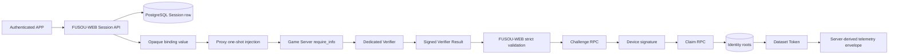

# FUSOU TLSNotary ゲームID証明 v1 実装計画

**計画ステータス:** 設計から実装へ移行するための計画。記載された仕様と Phase 0 ゲートに合格するまで、実行時実装は `NO-GO` とする。

**対象仕様:** `docs/operations/member-id-preemptive-attack-and-recovery.md`

**仕様ベースライン:** Reference Baseline `0d2a85a8c474271ecf6bf7e2cf062365a9608e83`、Proof Copy baseline `356aad0c012560be9c5ac477b494866d06d75fb9`、現在の Specification Revision `7f847bb2285e95d9b8c310d9527b0fdce5d38622`

**Phase 0証拠revision:** `COMMITTED BASELINE @ 2cabedc4bc8db70a00ba42f91048b46127fea4e8`。selected alpha.15 profile、P0-04/P0-05 evidence collection attempt、およびP0-01〜P0-17の判定は [gate ledger](../security/evidence/tlsn-phase0-gate-ledger-v1.json)、[ソース調査レポート](../security/evidence/tlsn-source-inspection-v1.md)、[alpha.15 adoption profile](../security/evidence/tlsn-alpha15-adoption-profile-v1.json)、[P0-04/P0-05 evidence attempt](../security/evidence/tlsn-p0-04-p0-05-evidence-attempt-v1.json) に固定する。

**計画の範囲:** この調査更新では Final Specification、この文書、および `docs/security/evidence/` の非機密証拠だけを変更する。実行時コード、migration、production resourceは変更しない。

**情報源の優先順位:** Final Specification、攻撃者視点の監査、リポジトリ構成、古い計画の順とする。古い計画との競合は Final Specification を優先して解決する。

**監査結果:** `P0 = 残り0件`、`P1 = 残り0件`、`P2 = 残り0件`（初期監査項目はすべて処置済み）。これは設計issue ledgerの状態であり、Phase 0全gateのPASSを意味しない。現在のPhase 0証拠は `PASS = 3`、`FAIL = 0`、`BLOCKED = 14`。alpha.15 (`47aee45b53e06648c1b2ad3689b367b8c923fdec`) をdocumentation-only implementation inputとして選定し、ID extraction/profile/goldenを固定した。Proof Copy攻撃 = `PASS`、主要セキュリティ目標 = `PASS`、Notary issuance-time provenance = `REMOVED_FROM_V1`、実装 = `NO-GO`。

**規範語:** `MUST`、`MUST NOT`、`ONLY` は Final Specificationのsecurity/protocol contractとその受入条件にだけ適用する。各タスクの具体的なfilename、function/index name、provider resource、lock key、batch/timeout、step orderは、別途不変条件または相互運用性を示さない限り、候補実装・configuration・runbookである。「新規ファイル」と記された対象パスは、そのタスクが実装・テストされるまで存在しないものとする。

**タスクカードの読み方:** 各カードで `目的` と `セキュリティ不変条件` は実装必須の理由、`仕様参照` と `権威ソース` は依存するprotocol fact、`入力/出力` と `検証` は受入成果物、`リポジトリファイル`、`新規ファイル`、具体的なprovider/DB mechanicsは候補実装である。候補mechanicsは、同じ不変条件を証明できる別方式へ置換でき、Phase 0のprotocol factまたはproduction evidenceが揃うまで延期できる。

## 1. 範囲とセキュリティ目標

### 1.1 目標

クライアントを権威とする識別情報を受け入れず、対象の識別情報チェーンを実装する。

```text
Game Server require_info response
  -> verified_member_id
  -> authenticated TLSNotary transcript
  -> server-issued Attestation Session
  -> authenticated non-anonymous user/device
  -> Challenge
  -> device Claim
  -> member_id_mapping/public_id
  -> Dataset Token
  -> server-derived telemetry attribution
```

実装は次の性質を保持しなければならない (`MUST`)。

1. 識別情報の取得元は `POST /kcsapi/api_get_member/require_info` のみでなければならない (`MUST`)。
2. `api_member_id` は Dedicated Verifier により認証されたレスポンスと厳格なパーサーからのみ受け入れなければならない (`MUST`)。
3. Session、binding nonce、binding value、認証済みユーザー、device key、Challenge、Verifier Result、Claim は 1 つの等価性チェーンでなければならない (`MUST`)。
4. `public_id` はデータベースのマッピングルートが生成・所有しなければならない (`MUST`)。
5. 所有権と現在の認可はルートテーブルから導出し、投影や `primary_device_id` からは決して導出してはならない (`MUST NOT`)。
6. Proof Copy の組み合わせは証拠のみで判定する条件ではなく、必ず拒否する条件でなければならない (`MUST`)。
7. Challenge と Session はそれぞれ高々 1 回しか consume できず、受理済み Claim の再実行は権威情報が完全一致する再実行だけでなければならない (`MUST`)。
8. データセットとテレメトリの識別情報フィールドはサーバーから導出し、リクエストのペイロードメタデータで置き換えられないようにしなければならない (`MUST`)。

### 1.2 Proof Copy の明示的な受入基準

| ケース | 必須結果 | 最初に必要な拒否または証明 |
| --- | --- | --- |
| `Proof(A) + User B` | 拒否 | Session の user が認証済み B と一致しない |
| `Proof(A) + Device B` | 拒否 | Session/Challenge の device key が B と一致しない |
| `Proof(A) + Challenge B` | 拒否 | Challenge の権威情報が Result/Session A と一致しない |
| `Proof(A) + Session A + User B` | 拒否 | 認証済みアクター B が Session A と一致しない |
| `Proof(A, Session A)` を Session B として書き換える | 拒否 | Verifier signature または Session の等価性検査に失敗する |
| `Proof(A) + binding nonce` の変更 | 拒否 | binding header、Result、Session、Challenge の等価性検査に失敗する |
| B が A より先に submit する | 拒否 | アクターと Session の結び付きを所有権より先に検査する。先着勝ちの近道はない |

最初に到着したという理由だけで、最初に成功した claimant を権威にする実装は認めない。

### 1.3 非目標と禁止される仕組み

この計画では、TPM、Secure Enclave、kernel attestation、member-ID hashing、Pepper、HMAC identity、匿名の事前登録、クライアントを権威とする所有権、Game Server request replay、transfer、recovery、legacy-token upgrade を追加しない。

Session binding の失敗はセキュリティ失敗であり、ゲームプレイのフォールバックではない。送信前の MPC setup failure は、上流アプリケーションへの書き込みがまだ発生していない場合に限り、指定されたゲームプレイのフォールバックを使用してよい。送信後の再試行は認めない。

## 2. アーキテクチャとコンポーネントの責務

### 2.1 対象フロー



| PostgreSQL のカットオーバー | target migration artifact（filenameはcandidate） | 新規のatomic cutover migration |
| PostgreSQL のテスト | `packages/FUSOU-WEB/supabase/tests/tlsn_identity_spec_primitives.sql` | 新規の実 PostgreSQL 用フィクスチャ |
| Turso の対象 | `docs/sql/turso/migration_0002_tlsn_identity_epoch_v1.sql` | 新規の専用ターゲットブートストラップ |
| ストレージマニフェスト | `packages/FUSOU-WEB/scripts/manifests/tlsn-identity-storage-v1.json` | 新規生成アーティファクト。正確なロケーターのみ |
| ストレージ実行器 | `packages/FUSOU-WEB/scripts/cutover-tlsn-identity-storage.mjs` | 新規の保護付き実行器 |
| デスクトップクライアント | `packages/FUSOU-APP/src-tauri` および `packages/fusou-auth` | Session relay と Claim signer を追加し、従来の権威経路を削除 |

## 3. アテステーションセッション (Attestation Session)

### 3.1 順序と API 契約

Session の発行は証明の取得より前に発生しなければならない (`MUST`)。

```text
authenticated non-anonymous user + device public key
  -> issue_attestation_session_v1
  -> committed Attestation Session
  -> opaque binding value
  -> next natural require_info request
```

HTTP リクエスト:

```json
{"device_public_key":"<strict-unpadded-base64url-32-bytes>"}
```

リクエストのフィールドはちょうど 1 つである。`member_id`、`public_id`、`canonical_user_id`、`device_id`、`session_id`、nonce、Result metadata を含めてはならない (`MUST NOT`)。

HTTP の成功時ステータスは `201` で、内容はちょうど次のとおりである。

```json
{"binding_value":"<strict-unpadded-base64url>","expires_at":"<RFC3339 UTC>"}
```

クライアントには Session ID、device ID、canonical user ID、nonce、public ID を返さない。

### 3.2 サーバー生成フィールドと binding

`issue_attestation_session_v1` は次を生成する。

```text
session_id       = server UUIDv4
device_id        = server UUIDv4
binding_nonce    = CSPRNG 32 bytes
issued_at        = v_db_now
expires_at       = v_db_now + interval '5 minutes'
```

binding bytes は厳密に次のとおりである。

```text
ASCII "FUSOU-ATTESTATION-BINDING-V1\0"
|| u16_be(16) || session_id RFC 4122 network-order bytes
|| u16_be(32) || binding_nonce raw bytes
```

`binding_value` はそのバイト列のパディングなしの厳密な base64url encoding である。これは導出値であり、権威列として保存しない。Session 行は HTTP レスポンスより前、かつ proxy が header を注入できるより前に commit する。

### 3.3 対象 Session ストレージ

`attestation_sessions` は Final Specification Section 9.3a の権威情報とライフサイクルフィールドを含まなければならない (`MUST`)。

```text
session_id UUID PRIMARY KEY
canonical_user_id UUID NOT NULL REFERENCES auth.users(id) ON DELETE RESTRICT
device_id UUID NOT NULL
device_public_key BYTEA NOT NULL CHECK (octet_length(device_public_key) = 32)
binding_nonce BYTEA NOT NULL UNIQUE CHECK (octet_length(binding_nonce) = 32)
issued_at TIMESTAMPTZ NOT NULL
expires_at TIMESTAMPTZ NOT NULL
session_status IN ('ACTIVE', 'CONSUMED', 'EXPIRED', 'REVOKED')
terminal_reason IN ('CLAIM_ACCEPTED', 'INVALID_SIGNATURE', 'DEVICE_REVOKED', 'TTL_EXPIRED')
consumed_at, expired_at, revoked_at, created_at
```

権威列は不変である。行形状チェックにより、可能な遷移を `ACTIVE -> CONSUMED`、`ACTIVE -> EXPIRED`、`ACTIVE -> REVOKED` に限定し、終端タイムスタンプ/理由が status と一致することを強制する。Session 行は保持し、削除はクリーンアップ操作としない。同じ非REVOKED device keyを使う再試行は、terminal Sessionを再利用せず、新しい Session ID、nonce、bindingを発行する。ACTIVE Sessionはdevice keyごとに1件だけ許可する。

インデックスと制約は、Session ID の primary key、nonce の一意性、UUIDv4 の検査、Session の正確な複合一意性、認証済みユーザーに対する外部キー保護、および次の ACTIVE Session partial unique index を含まなければならない (`MUST`)。

ACTIVE Session が device key ごとに高々1件であることはsecurity contractである。次のSQLは候補実装であり、同じ一意性、不変性、lifecycle検査を証明する別の制約方式へ置換できる。

候補SQL:

```sql
CREATE UNIQUE INDEX uq_attestation_sessions_active_key
ON public.attestation_sessions (device_public_key)
WHERE session_status = 'ACTIVE';
```

### 3.4 Binding の伝送と改ざん処理

1. FUSOU-WEB は不透明な binding value と有効期限だけを返す。
2. APP はその値を一回限りの制御メッセージとして proxy に送る。
3. Proxy は次の通常のリクエストに ASCII 行をちょうど 1 行だけ追加する。
   `X-FUSOU-Attestation-Binding: <binding_value>\r\n`.
4. profile に従い、header は正確な Host header の後、request body framing の前でなければならない。
5. binding の欠落、重複、移動、非正規、置換、期限切れは Verifier rejection とし、Result を生成しない。
6. Binding value と Session fields はログ、ゲームプレイのペイロード、WebView state、クライアントイベントのペイロードから除外する。
7. 構文上は有効でも authenticated transcript に存在しない binding は識別情報の証明ではない。

### 3.5 P1-01 の解決と仕様契約

Challenge の有効期限に関する実装契約は次のとおりである。

```text
Challenge.expires_at = LEAST(
    v_db_now + interval '5 minutes',
    attestation_session.expires_at,
    device.pending_expires_at
)
```

1 つの RPC 内の有効期限比較とライフサイクルタイムスタンプはすべて、ロック取得後の 1 つの `v_db_now := pg_catalog.transaction_timestamp()` を使用する。

Final Specification Section 7.2、9.3a、10.3、10.5、12.1〜12.3 がこの式、Session-expired getter/Claim/cleanup behavior、`SESSION_NOT_ACTIVE`、partial unique index、および per-function outcome tableを規範的かつ相互に一致する形で定義している。新しい数値TTLやAttestation ID byte boundを推測せず、その仕様と承認済みprofileを実装のauthorityとする。

P1-01 は `RESOLVED` である。P1-02 も、authenticated FUSOU-WEB Claim handlerを唯一のproduction callerとし、`service_role` credentialがprocess provenanceを証明しないこと、registry gate・ACL・caller inventoryをrelease evidenceにする契約として `RESOLVED` である。Phase 0 evidenceが未取得であることは実装GOを意味しない。

## 4. TLSNotary 統合

### 4.1 対象リクエスト

識別情報の証明に使用するのはこのリクエストだけである。

```text
POST /kcsapi/api_get_member/require_info HTTP/1.1
Host: <allowlisted server_identity>
X-FUSOU-Attestation-Binding: <exact binding_value>
```

リダイレクト、暗黙の再試行、proxy によるリクエスト生成、代替ゲームサーバーのエンドポイント、フォールバックから導出した識別情報を禁止する。

### 4.2 1 つの論理リクエスト

Proxy は論理リクエストごとに 1 つの状態を保持する。

```text
BEFORE_APPLICATION_SEND -> SEND_COMMITTED -> RESPONSE_AVAILABLE -> COMPLETE
```

`SEND_COMMITTED` は最初の上流書き込み呼び出しの直前に固定する。その後は再試行、フォールバック送信、リダイレクト追従、接続の再実行、2 回目のリクエストのいずれも行わない。Origin の観測は完全なリクエスト 1 回以下、書き込み試行 1 回以下でなければならない。

許可されるフォールバックは `SEND_COMMITTED` 前に検出された MPC セットアップ失敗だけである。同じ通常のリクエストを通常の TLS で 1 回だけ送信してよく、識別情報未検証として記録 `MUST` する。Verifier、Result、DB、APP の失敗が別のゲームリクエストを生成することはない。

### 4.3 Binding のライフサイクル

| 段階 | 必須アクション | 禁止アクション |
| --- | --- | --- |
| Session 発行 | Session を永続化し binding を導出する | クライアントの Session metadata を受け入れる |
| Proxy への引き渡し | 一回限りの不透明な制御メッセージ | 秘密の binding データをログまたは永続化する |
| リクエストへの注入 | 次の通常のリクエストに正確なヘッダーを追加する | 別のリクエストまたは 2 回追加する |
| Transcript | 認証済みの送信バイト列に正確なヘッダーを含める | ヘッダーのクライアント側コピーを使用する |
| 検証 | Session ID、nonce、value を抽出して比較する | transcript の証明なしで Result JSON を信頼する |
| 失敗 | 識別情報未検証とし、識別情報の変更を残さない | 送信後に上流で再試行する |

### 4.4 Phase 0 の未知項目

TLSNotary API、固定リビジョン、Attestation ID の抽出、transcript のオフセット意味論、proof のシリアライズを推測してはならない。これらは Phase 0 の証拠ゲートである。`ConnectionInfo.time`をNotary発行時刻として扱わず、Session/Challenge TTLとserver-side clockだけでClaim authorization freshnessを実現できるかを、stale/future proof fixtureを含めて検証する。固定リビジョンの下でbindingを認証済みTLS transcriptのバイト列にできない場合の結果は次のとおりである。

2026-09-03のread-onlyソース調査では、公式remoteの公開alpha.15 (`refs/tags/v0.1.0-alpha.15`, commit `47aee45b53e06648c1b2ad3689b367b8c923fdec`) を選定し、観測HEAD `0fe3c32d35382b3f290a43c4156399ca4512bb89`（`0.1.0-alpha.16-pre`）を比較対象から除外した。alpha.15は `Attestation.header` fieldと `Uid([u8; 16])` を持ち、verified extraction、raw opaque 16-byte encoding、fixture golden、Header BCS boundaryを [alpha.15 adoption profile](../security/evidence/tlsn-alpha15-adoption-profile-v1.json) に固定する。`ConnectionInfo.time`はTLS connection start timeであり、Notary-issued `notary_time`ではない。この欠落はv1のidentity contractに反しない。documentation-only acceptanceによりP0-01/P0-02/P0-03は `PASS` とするが、FUSOU direct dependency、natural capture、runtime、production evidenceは未取得である。全gateの根拠は [gate ledger](../security/evidence/tlsn-phase0-gate-ledger-v1.json)、[ソース調査レポート](../security/evidence/tlsn-source-inspection-v1.md)、[adoption profile](../security/evidence/tlsn-alpha15-adoption-profile-v1.json) に集約する。

```text
IMPLEMENTATION = NO-GO
SPECIFICATION = REVISE
```

## 5. 専用検証器 (Dedicated Verifier)

### 5.1 検証順序

Dedicated Verifier は Final Specification Section 5.5 の順序で実行しなければならない (`MUST`)。

1. Profile ID、profile hash、protocol version、purpose を検証する。
2. TLSNotary Attestation、Notary 署名、transcript commitment を検証する。
3. Web PKI、SNI、証明書ホスト名、許可リストにある server identity を検証する。
4. リクエスト全体を厳格に parse し、正確な target/Host/binding header/body/trailing-byte rules と request digest を検証する。
5. リクエスト範囲の抽出と範囲の検証を行う。
6. 単一の HTTP/1.1 response、response digest、完全な response 範囲の検証を行う。
7. Notary/Verifier key IDとprofile hashをcurrent registryへ照合し、missing/REVOKED keyまたはprofile mismatchを拒否する。署名時刻をResultのauthorityとして出力しない。
8. Canonical Result のシリアライズと pure Ed25519 署名を生成する。

Verifier は FUSOU のユーザー、device、ownership、public-ID authority を確立してはならない (`MUST NOT`)。これらの値は Session とデータベースのルートによって確立される。

### 5.2 制限と拒否

Final Specification 第5.1節の承認済みprofile上限を適用する。対象には Result、リクエスト/レスポンス transcript、ヘッダー、body、JSON depth/string、range metadataが含まれる。range cardinality、wire formatting、Attestation IDのbyte boundは、選定profileとgolden/DoS/privacy evidenceに基づいて凍結し、候補値を推測しない。

重複または未知のフィールド、非正規 JSON、非正規 decimal/base64url エンコーディング、範囲の重複/順序エラー、ダイジェスト不一致、誤った Host、誤ったリクエストターゲット、欠落/重複/移動した binding ヘッダー、末尾バイト、無効な証明書識別情報、失効/欠落したレジストリ鍵、未対応のプロファイルは拒否する。

## 6. Verifier Result

### 6.1 厳密な権威関係

Canonical Result は Final Specification 第5.2節のフィールドを含む。

```text
version, profile_id, profile_sha256, issuer, proof_purpose,
attestation_session_id, binding_nonce, binding_value,
verifier_key_id, notary_key_id, tlsn_attestation_id,
server_identity,
request_transcript_size, request_transcript_sha256,
response_transcript_size, response_transcript_sha256,
revealed_request_ranges, revealed_response_ranges, signature
```

Result が証明するのはゲームサーバーの来歴と Session binding である。FUSOU の認証済みアクターを証明するものではない。FUSOU-WEB は Bearer からアクターの権威情報を取得し、Session、Challenge、ルートテーブルから device/public/mapping の権威情報を取得する。

### 6.2 暗号学的 binding

Verifier は、期待されるフィールドを含むというだけで受け入れる JSON オブジェクトではなく、`VerifierResultSignBytes` に署名する。署名対象バイト列は Final Specification 第5.3節の domain separator と固定幅ビッグエンディアンフィールドを使用し、Session ID、nonce、binding value、Attestation ID、server identity、完全な transcript digest、順序付けられた範囲バイト列を含む。署名検証は strict pure Ed25519 を使用し、寛容な ZIP-215 の挙動を禁止する。

FUSOU-WEB は Challenge を発行する前に、署名、現在のプロファイル/許可リスト、registry status、フィールド文法、完全なレスポンスダイジェスト、および認証済み binding ヘッダーと Result フィールドの一致を検証しなければならない。Resultの時刻からproof ageやoriginal signing windowを推定してはならない。

### 6.3 Result の配送

正確な署名済み Result JSON bytes は次の経路を通る。

```text
Dedicated Verifier -> proxy HTTPS response -> in-process proxy channel
  -> FUSOU-APP raw bytes -> strict base64url -> FUSOU-WEB Challenge API
```

Proxy と APP は中継してよいが、フィールドの parse/re-serialize、追加、削除、並べ替えをしてはならない。Web の再試行は指定された上限まで同じ外側の Result バイト列を再送してよく、ゲームサーバーに接続してはならない。Queue full、認証失敗、検証器失敗、APP 終了、再試行回数超過は Claim mutation なしで `IDENTITY_UNVERIFIED` を生成する。

## 7. Challenge

### 7.1 API の権威

`POST /api/identity/v1/challenges` が受け付けるのは厳密に次だけである。

```json
{"verifier_result_b64":"<base64url(exact canonical Result JSON bytes)>"}
```

クライアントは Session、user、device、member、public ID、key、nonce、owner、Attestation locator を一切指定しない。FUSOU-WEB は Bearer と Result を検証し、その後サービス専用の Challenge entry function だけを呼び出す。

### 7.2 Challenge の権威フィールド

Challenge は検証済みの Result と Session から権威情報をコピーするが、権威となるコピーはデータベースにある。

```text
challenge_id, attestation_session_id, binding_nonce, binding_value,
api_member_id, public_id, canonical_user_id, device_id,
device_public_key_sha256, tlsn_attestation_id, challenge_nonce,
profile_sha256, server_identity,
verifier_key_id, notary_key_id, Result/transcript digests, ranges,
proof_purpose, status, terminal_reason, expires_at, lifecycle timestamps
```

`challenge_nonce` はサーバー生成の CSPRNG 32 bytes である。`ClaimBindingBytes` はロック済みの Session/Challenge 行から再構成し、Challenge response は権威情報の入力としない。

### 7.3 Challenge 作成ルール

1. 認証し、匿名ユーザーを拒否する。
2. 署名済み Result と認証済み binding を decode して検証する。
3. 正規化した信頼済みの値で Challenge RPC を 1 回呼び出す。
4. Attestation、Identity、User-quota、Device-key advisory domains をグローバル順序でロックする。
5. Session、mapping、関連する保持対象の Challenge 行すべてを `challenge_id` order でロックし、ownership と device の行も指定された row order でロックする。
6. ロック後に権威情報をすべて再読する。
7. 必須のロック後に 1 つの `v_db_now` を計算する。
8. Final Specification Section 7.2 の上限付き有効期限の式を適用する。
9. すべての Challenge 行を保持し、期限切れまたは consume 済みの行を削除しない。
10. 同一の ACTIVE Challenge には完全一致の再実行識別情報を返し、同じ Attestation の不一致は拒否する。

同じ Attestation と同じ Session には、そのライフサイクル全体を通じて Challenge が 1 つ以下しか存在しない。`UNIQUE(tlsn_attestation_id)`、`UNIQUE(attestation_session_id)`、および指定された active-device partial index がこの契約を強制する。

### 7.4 Challenge のレスポンス

新規 Challenge は `201` と `challenge_replayed=false` を返し、正確な ACTIVE の再実行は `200` と `challenge_replayed=true` を返す。成功時の body に含める Final Specification のフィールドは厳密に、Session ID、binding nonce/value、Challenge ID/nonce、expiry、device ID、Attestation ID、verified member ID、public ID、replay flag とする。Canonical user ID と raw public key は返さない。

## 8. Claim

### 8.1 外部入力の最小化

`POST /api/identity/v1/claims` が受け付けるのは厳密に次だけである。

```json
{"challenge_id":"<uuidv4>","signature":"<strict-unpadded-base64url-64-bytes>"}
```

クライアントは `member_id`、`verified_member_id`、`public_id`、`canonical_user_id`、`device_id`、`attestation_id`、`attestation_session_id`、`binding_nonce`、`owner_id` を送信してはならない (`MUST NOT`)。

RPC のシグネチャは厳密に `claim_verified_device_v1(authenticated_user_id, challenge_id)` である。署名とその他すべての権威情報フィールドは FUSOU-WEB が検証するか、ロック済みのルートから再構成し、RPC はクライアントメタデータを受け付けない。

### 8.2 Claim 検証順序

次の順序を規範とする。ただし、Final Specification の global lock order がロックなしの事前読み取りより優先する。

1. 認証し、匿名アクターを拒否する。
2. クライアント指定のロケーターを権威情報とみなさずに、認証済みデバイスコンテキストを解決する。
3. 不変ロケーターの取得だけを目的に、ロックなしの読み取りを行う。
4. Attestation の advisory lock を取得する。
5. Identity の advisory lock を取得する。
6. User-quota の advisory lock を取得する。
7. Device-key の advisory lock を取得する。
8. 関連する Session 行をすべて `session_id` 昇順でロックし、ロック後に同じ device の全 ACTIVE Session/Challenge を再 query する。
9. mapping の親行をロックする。
10. 関連する Challenge 行すべてを昇順の `challenge_id` 順でロックする。
11. ownership の行をロックする。
12. target および同じ public を持つ VERIFIED/PENDING device の行を昇順の `device_id` 順でロックする。
13. Session、Challenge、アクター、device、Result digest、binding、profile、key IDs、時刻、範囲、member mapping を再読して比較する。
14. ロック後の `v_db_now` を 1 つ取得し、Session、Challenge、PENDING device の有効期限を検証する。
15. ownership、quota、current-device、既存 Claim のルールを適用する。
16. strict pure Ed25519 を使用して正確な `ClaimBindingBytes` を再構成して検証する。
17. Challenge を CAS で `ACTIVE -> CONSUMED/CLAIM_ACCEPTED` にし、Session を `CONSUMED/CLAIM_ACCEPTED` に遷移させる。
18. device を `PENDING -> VERIFIED` に遷移させる。
19. append-only Claim を insert し、許可される場合は ownership を更新し、root-to-projection order で projections を更新する。
20. 書き込み後に識別情報の状態を再計算し、単一の transaction を commit する。

無効な署名は指定された `consume_invalid_challenge` パスを使用し、まだ active であれば Challenge/Session をアトミックに consume する。レジストリ検証は無効な署名の消費より前に行い、レジストリ失敗は Challenge を変更してはならない。

### 8.3 線形化ポイント (Linearization point)

権威となる Claim の線形化点は、次を含む成功した PostgreSQL transaction commit である。

```text
Challenge CAS + Session terminal transition + device transition
+ accepted Claim insert + ownership mutation + projection update
```

この commit より前の response は受け入れない。CAS の失敗、一意性の競合、owner conflict、expiry、レジストリ失敗、署名失敗、不変条件違反は accepted Claim を生成しない。

### 8.4 Revoke と registry の競合

Device Claim と device Revoke は同じ Identity advisory lock と required row order を使用する。したがって次のようになる。

- Claim first: Revoke は commit 済みの VERIFIED device を観測し、REVOKED に遷移させる。
- Revoke first: Claim は PENDING でない、または REVOKED の device を観測して拒否する。
- 両 operation にはトランザクションの勝者が厳密に 1 つだけ存在し、global order の下で deadlock は発生しない。

Registry compromise/revocation は最善努力の read ではなく運用上のセキュリティイベントである。edge maintenance rule は key を `REVOKED` に変更する前に Claim、token、ingest entrypoints を block し、producers/consumers を停止し、in-flight handlers を drain `MUST` する。revoked registry が active になった時点で、validation-to-commit interval に残る handler があってはならない。すべての validator が同じ registry set digest を報告し、revoked-key negatives が pass し、古い traffic が存在しないことを確認した後に services を再開できる。これによりデータベース側の registry copy を新設せずに registry-revoke/Claim race を解消する。

## 9. 識別情報 / 所有権 / マッピング

### 9.1 Mapping root

`get_or_create_public_id(p_api_member_id)` は唯一の member-ID マッピング関数である。`[1-9][0-9]{0,15}` を検証し、Identity advisory lock を取得し、サーバー UUIDv4 で 1 回 insert し、同じ mapping 行をロックして返す。これは識別情報所有者の内部関数であり、HTTP エンドポイント、PostgREST RPC、service-role の直接エントリ関数ではない。

mapping root は unique `api_member_id`、unique `public_id`、composite FKs に必要な composite unique key、immutable identity columns、および target roots からの `ON DELETE RESTRICT` references を持つ。

### 9.2 Identity と ownership のルール

`Identity State` はルートテーブルから導出する。

```text
UNCLAIMED
GAME_IDENTITY_VERIFIED
SOCIAL_ACCOUNT_BOUND
```

`primary_device_id` は履歴情報に限る。認可、token subject lookup、テレメトリ帰属には決して使用しない。異なる過去の owner は常に conflict であり、同じ過去の owner は現在の上限とロック規則の範囲内で device を追加できる。projection mismatch は不変条件違反/修復シグナルであり、root authority を変更する理由ではない。

### 9.3 Device のルール

`user_devices` は `PENDING`、`VERIFIED`、終端状態の `REVOKED` を使用する。Device public key は厳密に 32 raw Ed25519 バイトで、すべてのデバイス行ライフサイクルを通じてグローバルに一意である。PENDING expiry は volatile CHECK ではなく RPC で評価する。したがって revoked key は新しい device row として再登録できない。一方、REVOKEDでない既存device keyは、terminal Sessionを再利用せず、新しいSession ID、nonce、bindingを発行することで再試行できる。Session自体のACTIVE一意性は `attestation_sessions(device_public_key)` の partial unique indexで制限する。

### 9.4 Claim レコード

`member_identity_claims` は append-only であり、Challenge からコピーした不変の権威情報サブセットを保存する。これには Session ID、binding、member/public/user/device IDs、Attestation ID、key IDs、時刻、完全な transcript digest、範囲、purpose、claim type、タイムスタンプが含まれる。mapping、device、Session への composite FKs と、unique Attestation、device、Challenge references を持つ。

## 10. データベース / マイグレーション

### 10.1 新規DBの手順

新規DBの実装順序は次のとおりである。

1. 宣言済み baseline までのすべてのリポジトリマイグレーションを適用する。
2. 空のインスタンスまたは baseline インスタンスに対して読み取り専用の preflight を実行する。
3. `fusou_identity_owner`、`fusou_identity_auditor`、`fusou_uint64`、canonical scalar checks、lock helpers を作成する。
4. mapping/device の親テーブルと必要な composite uniques を作成する。
5. `attestation_sessions` を作成する。
6. `claim_challenges` を作成する。
7. `member_ownership` を作成する。
8. `member_identity_claims` を作成する。
9. upload ledger と target projection の構造を作成する。
10. immutable/lifecycle triggers、internal helpers、続いて entry SECURITY DEFINER functions を作成する。
11. 各 object group の後に owner、revoke、grant、RLS、function search_path、catalog assertions を適用する。
12. 実 PostgreSQL のプロトコル、ライフサイクル、ACL、並行性フィクスチャを実行する。

### 10.2 既存DBの手順

既存DBの実装順序は次のとおりである。

1. 実際の baseline version、スキーマ、拡張、ロール、権限付与、ポリシー、publication、トリガー、外部キーを棚卸しする。
2. すべての書き込み元を freeze し、選定したカットオーバー writer barrierを取得する。
3. purge 前に `conkey`/`confkey` の順序性を使用して composite-FK 依存関係の検出を実行する。
4. orphan 行、重複または無効な key、無効な UUID、不完全な target objects、未知の writer sessions を拒否する。
5. 依存関係が報告された後に限り legacy authority functions/policies を削除する。
6. 明示的に承認された legacy candidates だけを purge し、fake verified Claims や Session rows を backfill しない。
7. 親から子の順序で target roots と constraints を alter/create する。
8. ownership roots だけから projections を rebuild する。Final Specification が明示的に別の状態を許可しない限り、初期の target projection state は empty とする。
9. functions、triggers、grants、RLS、postflight catalog assertions を作成する。
10. top-level cutover transaction 1 つだけで commit する。

実装は仕様とタスクのレビュー中に、古い擬似コード識別子 `device_pubkey` を target column `device_public_key` に正規化 `MUST` する。これはドキュメント整合性の前提条件であり、このタスクで Final Specification を変更してよいという意味ではない。

### 10.3 必須オブジェクトと関係

```text
member_id_mapping
  -> member_ownership (public_id)
  -> user_devices (public_id)
  -> claim_challenges (api_member_id, public_id; device/public/user; Session tuple)
  -> member_identity_claims (mapping/device/Session composite references)

attestation_sessions
  -> claim_challenges (session/user/device/nonce)
  -> member_identity_claims (session/user/device/nonce)

user_devices
  -> member_ownership primary_device_id/public/user
  -> claim_challenges device/public/user
  -> member_identity_claims device/public/user
```

識別情報の権威に関するすべての FK action は `ON DELETE RESTRICT` である。親の composite UNIQUE constraints は子の FKs より前に存在しなければならない。Challenge の削除は禁止し、ライフサイクル UPDATE だけをクリーンアップ操作とする。Projection 行は承認済みの owner path からのみ書き込み可能とする。

### 10.4 ACL と RLS のベースライン

target migration は次を満たさなければならない (`MUST`)。

- `PUBLIC`、`anon`、`authenticated`、サポート対象外の呼び出し元から table、sequence、helper execution を revoke する。
- 必須の server role に閉じた entry-function 集合だけを grant する。
- `fusou_identity_owner` を NOLOGIN object owner、`fusou_identity_auditor` を承認済み監査データに対する SELECT-only として維持する。
- すべての SECURITY DEFINER functions を `search_path = public, extensions, pg_temp` に設定し、relations/functions を schema-qualify する。
- 古い直接 SELECT ポリシーと直接の projection/device DML パスを削除する。
- migration 後に application role が `public` または `extensions` に object を作成できないことを assert する。
- table owner、superuser、database compromise は宣言された PostgreSQL trust boundary の外部として扱う。

## 11. 認可 / RPC / 呼び出し元境界

### 11.1 呼び出し元一覧

実装とデプロイのレポートは、次の呼び出し元クラスを個別に列挙しなければならない (`MUST`)。

| 呼び出し元の種類 | 本番環境でサポートされる権威 | 識別情報 RPC の直接呼び出しを許可するか | 必須の挙動 |
| --- | --- | --- | --- |
| 本番 HTTP ハンドラー | 認証済み FUSOU-WEB サーバー専用ハンドラー | 限定された entry function contract を通じる場合だけ | 認証し、Result/registry/signature を検証してから RPC を呼び出す |
| メンテナンスツール | change ticket を持つ緊急対応オペレーター | 通常の Claim/Challenge authority は持たない | cleanup/cutover/registry 手順だけを実行し、監査対象とし、通常 traffic 中は block する |
| マイグレーションツール | freeze 中の Migration connection | runtime Claim authority は持たない | DDL/cutover のみ、承認済み migration transaction 1 つで行う |
| テストハーネス | 隔離されたテストデータベース/フィクスチャ | isolated tests でのみ許可 | ACL、競合、直接呼び出しの拒否を証明し、本番権限は決して持たない |
| 管理ツール | 明示的に列挙された運用コマンド | Claim authority は持たない | incident procedure の下で registry/edge block を管理してよい。identity DML は行わない |
| 直接クライアント | Browser/APP/PostgREST/public network | 許可しない | 該当する場合は 401/403/404。direct root DML/RPC は行わない |

`claim_verified_device_v1` の本番呼び出し元として唯一サポートされるのは、Result registry と device-signature の検証後に実行する認証済み FUSOU-WEB Claim handler である。その他の本番呼び出し元はサポートしない。

### 11.2 技術的な境界の制約

PostgreSQL は role と function privilege により `service_role` を制限できるが、許可された FUSOU-WEB プロセスと同じ `service_role` credential を持つ任意のプロセスを区別できない。P1-02 は暗号学的な呼び出し元 provenance を主張せず、authenticated FUSOU-WEB Claim handlerを唯一のproduction callerとする契約、ACL、caller inventory、および必須の証拠ゲートとして `RESOLVED` とする。

呼び出し元一覧は、本番クライアント、PostgREST route、メンテナンスコマンド、マイグレーションコマンド、代替 Worker path のいずれも Claim/Challenge entry functions をサポート対象の経路として呼び出さないことを証明しなければならない (`MUST`)。未知の呼び出し元、direct DML path、registry を迂回する service-role invocation のいずれかがあれば、実装は `NO-GO` のままとする。

### 11.3 RPC の許可集合

外部から実行可能な集合は Final Specification 第10.5節の集合である。

```text
issue_attestation_session_v1
issue_identity_challenge_v1
get_claim_challenge_v1
consume_invalid_challenge
claim_verified_device_v1
revoke_identity_device_v1
bind_social_identity_v1
get_dataset_token_subject_v1
validate_dataset_credential_state_v1
issue_dataset_upload_v1
consume_dataset_upload_v1
list_expired_identity_artifact_ids_v1
expire_identity_artifact_v1
list_expired_attestation_session_ids_v1
expire_attestation_session_v1
```

`get_or_create_public_id` と lock/validator helpers は内部専用である。Function signatures、result columns、error outcomes、owners、grants、search paths はカタログで正確にテストする。

## 12. ライフサイクル / 有効期限 / クリーンアップ

### 12.1 ライフサイクルマトリクス

| Session | Challenge | Claim の入力 | 期待結果 |
| --- | --- | --- | --- |
| ACTIVE | ACTIVE | 有効 | すべての権威情報と署名検査に合格した場合に受理 |
| EXPIRED | ACTIVE | 有効 | linked Challengeを`EXPIRED/TTL_EXPIRED`へ正規化し、`SESSION_NOT_ACTIVE`。Claimなし |
| ACTIVE | EXPIRED | 有効 | `CHALLENGE_EXPIRED`。Sessionも`EXPIRED/TTL_EXPIRED`へ正規化し、Claimなし |
| EXPIRED | EXPIRED | 有効 | `SESSION_NOT_ACTIVE`。冪等な終端状態以外の変更なし |
| REVOKED | ACTIVE | 有効 | linked ChallengeをusableなACTIVEのまま残さず、`SESSION_NOT_ACTIVE`。Claimなし |
| ACTIVE | CONSUMED | 再実行 | linked Claimとの完全一致時だけ決定論的なreplay result。それ以外は拒否 |
| CONSUMED | CONSUMED | 再実行 | linked Claimとの完全一致時だけ決定論的なreplay result。それ以外は拒否 |
| ACTIVE | ACTIVE | 無効な署名 | Challenge と Session を`CONSUMED/INVALID_SIGNATURE`へアトミックに遷移 |
| ACTIVE | ACTIVE | Claim の同時実行 | commitを完了した1 transactionが勝者。敗者は終端状態または完全一致の再実行を観測 |
| ACTIVE | ACTIVE | Revoke の同時実行 | Identity lockがClaim/Revokeを直列化し、勝者のterminal stateを保持 |

### 12.2 Expiry のルール

| イベント | 必須遷移 | 必須結果 |
| --- | --- | --- |
| Session が Challenge 作成前に期限切れになる | Session `EXPIRED/TTL_EXPIRED`。Challenge なし | `SESSION_NOT_ACTIVE`。新しいSession issuanceだけが再試行手段 |
| Challenge が ACTIVE の間に Session が期限切れになる | Session と linked Challenge を `EXPIRED/TTL_EXPIRED` にする | Getter/Claimは`SESSION_NOT_ACTIVE`。Claimなし |
| Challenge が Session より先に期限切れになる | Challenge と Session を`EXPIRED/TTL_EXPIRED`にする | `CHALLENGE_EXPIRED`。Claimなし |
| Device の PENDING expiry が先に発生 | Deviceを`REVOKED/expired_pending`、関連するactive Challenge/Sessionを`EXPIRED/TTL_EXPIRED`へ遷移 | `SESSION_NOT_ACTIVE`。Claimなし。監査行を保持 |
| Device の revoke | Deviceを`REVOKED`にし、active Challengeを`CONSUMED/DEVICE_REVOKED`、Sessionを`REVOKED/DEVICE_REVOKED`へ遷移 | `SESSION_NOT_ACTIVE`。再利用なし |
| Registry の revoke | Edge block、drain、registry update、digest convergence | 既存/新規 credential の検証は fail closed |
| クリーンアップ | 遷移のみ。Session/Challenge roots は決して削除しない | 冪等な `OK`/`OK_REPLAY` または型付き終端結果 |

すべての行はライフサイクル全体での一意性と再実行の証拠のために保持する。Cleanup は opaque IDs を bounded batches で選択し、global order で行をロックし、ロック後に再 query し、すべての遷移に同じ transaction timestamp を使用する。

### 12.3 Cleanup の対象範囲

クリーンアップは次をカバーしなければならない (`MUST`)。

- 期限切れの ACTIVE Challenges と関連する Sessions。
- retained Challenges がすべて終端状態になっている場合も含む、期限切れの PENDING devices。
- Challenge のない ACTIVE Sessions。
- Device revoke-linked active artifacts。
- retained Challenge、Session、accepted Claim rows を削除しないこと。

selection 関数と transition 関数は型付き結果を返す別々の transaction である。selected row が消失した、またはすでに終端状態になった場合は冪等/型付き結果であり、別の row を削除する理由にはならない。

## 13. 再実行 / 並行性 / ロック

### 13.1 グローバルロック順序

変更してはならないグローバル順序は次のとおりである。

```text
1. Attestation advisory lock
2. Identity advisory lock
3. User-quota advisory lock
4. Device-key advisory lock
5. attestation_sessions row FOR UPDATE
6. member_id_mapping parent row FOR UPDATE
7. claim_challenges rows FOR UPDATE, challenge_id ascending
8. member_ownership row FOR UPDATE
9. user_devices rows FOR UPDATE, device_id ascending
10. projection rows
11. dataset_upload_ledger_v1 row FOR UPDATE
```

どの operation も、後段の lock を保持した後に前段の lock を取得してはならない。ロックなしの事前読み取りは locator の読み取りに限り、すべての権威情報フィールドはロック後に再読する。

### 13.2 Replay マトリクス

| 再実行 | ロック/CAS | 勝者 | 敗者 | 最終状態 |
| --- | --- | --- | --- | --- |
| 同じ Verifier Result を Challenge API に送信 | Attestation/Session/Challenge のロック + unique Attestation | 最初の有効な Challenge 作成 | 完全一致の再実行または競合 | 保持される Challenge は 1 つ |
| 異なる Session で同じ Attestation を使用 | Attestation lock + unique Attestation | 最初の有効な権威 | `ATTESTATION_IN_USE`/already-used | 元の権威を保持 |
| 異なる user/device で同じ Session を使用 | Session lock + actor equality | なし（不一致） | 変更前に拒否 | Session は変更しない |
| 同じ Challenge を Claim に使用 | Session/Challenge の行ロック + CAS | 最初の有効な Claim または無効入力の consume | 完全一致の再実行または終端状態として拒否 | 終端状態の Challenge は 1 つ |
| 同じ device signature を 2 回使用 | Challenge ロック + terminal state | 最初の transaction | `CHALLENGE_NOT_ACTIVE` または完全一致の再実行 | 受理または consume 済みの Claim は 1 つ |
| Claim の同時実行 | グローバル順序全体 + Challenge CAS | commit に成功した側 | 敗者が terminal state を再読 | Claim は 1 つ |
| Claim と device Revoke の同時実行 | 共有 Identity ロックと行順序 | 最初にロックした側 | 決定論的な反対方向の遷移 | ルートと整合する状態 |
| Claim と Session/Challenge expiry の同時実行 | 共有ロックと 1 つの `v_db_now` | 最初にロックした側 | 期限切れまたは終端結果 | 期限切れの Claim は受理しない |
| invalid signature と valid Claim の同時実行 | Session/Challenge row lock と同じ lifecycle order | 最初にrow lockを取得した側 | 敗者はaccepted Claimまたはinvalid-signature terminal stateを再読 | accepted Claimまたはinvalid-signature consumeのいずれか1つ |
| cleanup と Claim の同時実行 | Session/Challenge/device row lock と同じglobal order | 最初のterminal transition | 敗者は終端/expiryのtyped resultを再読 | cleanup後のClaimなし。retained rowsは保持 |
| cleanup と Device pending expiry の同時実行 | User-quota/Device-key lock とSession/Challenge/device row lock | 最初のlifecycle transition | 敗者は`OK_REPLAY`またはtyped terminal result | usableなACTIVE artifactなし。状態は整合 |
| 同じ key での Session 同時作成 | Device-key ロック + グローバルな key uniqueness | 最初の insert | `DEVICE_KEY_ALREADY_REGISTERED` | Session/key は 1 つ |
| upload consume の同時実行 | Ledger row ロック + `consumed_at IS NULL` CAS | 1 回の consume | `UPLOAD_TOKEN_REPLAY` | consume 済みの ledger 行は 1 つ |

### 13.3 Registry の並行性

通常のローテーションでは、定義された ACTIVE/VERIFY_ONLY window を許可する。侵害時のローテーションでは、REVOKED registry をデプロイする前に独立した edge blocking と in-flight drain で保護する。セキュリティレポートは revocation transition 中の Claim/token/ingest writers が zero であることを示さなければならない。これは PostgreSQL row lock では外部 registry mutation を直列化できないために必要である。

## 14. Dataset Token / テレメトリ帰属

### 14.1 Dataset Token

accepted Claim と明示的な Social Binding の後、FUSOU-WEB はルートから `device_id`、`public_id`、現在の key IDs、live authorization を導出する。Final Specification 第11.2節の正確な Ed25519 Dataset JWT v1 だけを、86400 秒の有効期間で発行する。`primary_device_id`、投影、payload identity、old JWTs は使用しない。

現在の Notary、Verifier、Dataset JWT レジストリは実行時に検証する。ACTIVE/VERIFY_ONLY の挙動は Final Specification に従い、REVOKED/missing keys は fail closed とする。RETIRED の挙動は推測せず、閉じた仕様表とレジストリのライフサイクルテストに従わなければならない。

### 14.2 Upload Token と CAS

Stage 1 はサーバー生成の ledger row と 1 時間の Upload Token を作成する。Stage 2 は Dataset Token、Upload Token、正確な content bytes を検証してから ledger CAS を実行する。CAS は外部 Queue/storage の変更より前に commit する。post-CAS sink failure では `consumed_at` を保持し、サーバー復旧は同じ `ingest_id` で欠落した sink を再試行する。一方、クライアントによる再実行は拒否する。

### 14.3 Telemetry Identity Envelope

受理した ingest はすべて次を導出する。

```text
public_id = Dataset JWT dataset_id
submitted_by_device_id = Dataset JWT sub
received_at = committed ledger consumed_at formatted as UTC YYYY-MM-DDTHH:MM:SS.sssZ
```

予約済みの識別情報フィールドは payload のどの深さでも拒否する。識別情報は明示的な server-owned envelope fields として書き込み、クライアントメタデータと merge しない。Queue、Turso、D1、Avro、R2 serializer は同じ envelope と `ingest_id` を保持し、sink は exact-match idempotency を使用して同一キーの value/digest conflicts を拒否する。

Final Specification 第11.4節の 6 つの限定 route ID と必須の sink manifest は正確にコピーする。新しい route が黙って必須になってはならない。

## 15. レガシーデータ / カットオーバー

### 15.1 Legacy authority の削除

v1 を有効化する前に、Final Specification 第12節および第13節に記載されたレガシーの匿名識別情報 route、RPC、policy、直接の projection path、古い token refresh path、古い identity cache/payload fields、未使用の識別情報 secret を一覧化して削除する。履歴文書と migration text は実行時の権威ではない。

legacy device を VERIFIED に backfill したり、fake Session/Challenge を作成したり、old hashes から `api_member_id` を推測したりしてはならない。verified v1 Claim に lineage をたどれない legacy data は、approved storage manifest に従って purge または quarantine する。

### 15.2 Cross-store epoch

対象ストレージの epoch は `tlsn-v1` である。新しい target D1/R2/KV/Queue/DLQ/Turso resources は、bindings を切り替える前に作成し、empty/marker-only であることを証明する。target Turso bootstrap は別個のアーティファクトであり、3 番目の PostgreSQL migration ではない。R2 marker identity には manifest generation ID と canonical content digest を含め、client metadata を marker または envelope authority に持ち込まない。

ストレージマニフェストは、選定したroute/resource/binding/consumer inventoryをclosedでversionedに含めなければならない。現行候補のtransition数、binding alias数、Queue consumer数、generated `SESSION` metadataはcandidate valuesであり、P0-17でlive inventoryと照合して承認する。Missing、extra、unknown、stale、name-only locatorsがあれば適用をblockする。

### 15.3 デプロイのバリア

1. Phase 0 プロファイルと認証/プライバシーゲートを完了する。
2. スキーマ、proxy、verifier、Web、APP、token、telemetry、manifest、executor candidates を build して test する。
3. ステージングマイグレーションと実 PostgreSQL テストを実行する。
4. target storage resources を provision して fingerprint する。
5. old と new の identity/ingest traffic を独立して block する。
6. legacy writers、cron、Queue producers を停止し、legacy Queue と DLQ を drain/quarantine する。
7. 連携したバックアップを取得して restore-test する。
8. 読み取り専用の本番 preflight を実行する。
9. 単一の PostgreSQL cutover transaction を適用する。
10. すべての bindings/secrets/config を 1 つの new epoch に切り替えて postflight を実行する。
11. traffic を block したまま新しい verifier/Web/proxy/APP profile を deploy する。
12. 本番 smoke とすべての P0 evidence を完了する。
13. legacy resources を destroy または IAM-quarantine し、すべての gates に合格した場合にだけ traffic を有効化する。

## 16. 受入テストマトリクス

### 16.1 P1-01 有効期限テスト

| ID | テスト | 期待結果 |
| --- | --- | --- |
| T1 | Challenge 作成前に Session が期限切れになる | Challenge/Claim なし。Session は終端状態。決定論的な Session-expired outcome |
| T2 | Challenge が ACTIVE の間に Session が期限切れになる | Challenge と Session を同時に終端化。Claim は拒否 |
| T3 | Session の有効期限より先に Challenge の有効期限が発生 | Challenge の有効期限切れを優先。Claim なし。Session の処理は改訂後の仕様に一致 |
| T4 | Device の PENDING expiry が先に発生 | Device は終端状態になり、関連アーティファクトは claim できない |
| T5 | Expired Session と ACTIVE Challenge | Getter と Claim はともに拒否。accepted Claim なし。保持対象の行は残る |
| T6 | 有効期限切れと Claim の同時実行 | ロックの勝者が結果を決定。期限切れの権威情報を持つ accepted Claim は決して発生しない |

各 T1-T6 は、境界のタイムスタンプ、1 つの共有 transaction timestamp、繰り返しの再試行、catalog/state assertions を用いて実 PostgreSQL 上で実行しなければならない (`MUST`)。Final Specification の式とoutcomeが実装されていない場合、またはいずれかの関数が2回目の時刻読み取りを使用する場合、テストスイートは失敗する。

### 16.2 P1-02 呼び出し元と registry のテスト

| ID | テスト | 期待結果 |
| --- | --- | --- |
| B1 | 本番 HTTP Handler の有効な経路 | Result、registry、署名検証が単一の Claim RPC より先に行われる |
| B2 | 直接クライアント/PostgREST Claim RPC | 拒否。root mutation なし |
| B3 | `service_role` handler gate なしの直接 RPC | Unsupported として本番呼び出し元の棚卸しが reject。隔離 ACL フィクスチャが broader grant の不存在を証明 |
| B4 | Maintenance/Migration tool による Claim path の呼び出し | isolated test database と approved runtime contract の外では denied |
| B5 | Registry revoke と Claim の同時実行 | REVOKED update 前に edge block が in-flight handlers を drain。barrier 後に revoked-key Claim は commit されない |
| B6 | 直接 DML/projection mutation と未知の呼び出し元 | ACL/RLS が deny、または棚卸しが GO に失敗。root-derived result は projections を無視 |

B1-B6 のレポートには呼び出し元名、deployment/version、database role、function signature、registry digest、request ID、mutation count、result を含めなければならない。Secret values は決して記録しない。

### 16.3 Protocol と Proof Copy のテスト

| ID | テスト | 期待結果 |
| --- | --- | --- |
| PC-01 | Proof A + User B | 識別情報の変更前に拒否 |
| PC-02 | Proof A + Device B | 識別情報の変更前に拒否 |
| PC-03 | Proof A + Challenge B | Claim/device/ownership transition 前に拒否 |
| PC-04 | Proof A + Session A + User B | actor/Session の不一致を拒否 |
| PC-05 | Session A を Session B として書き換え | Result signature または equality check が拒否 |
| PC-06 | binding nonce を置き換え | Result/header/Session/Challenge の不一致が拒否 |
| PC-07 | Attestation A + Principal B | Authenticated actor と Session の equality が拒否 |
| PC-08 | B が A より先に submit | first-claim-wins bypass なし。B は拒否される |

すべての否定ケースは、accepted Claim が zero、ownership mutation が zero、projection mutation が zero、sensitive error detail がないことを assert する。

### 16.4 Result、parser、signature、transport のテスト

canonical JSON bytes、Result signing bytes、ClaimBindingBytes、Ed25519 の厳格性、integer/base64 の境界、重複/未知フィールド、range の順序/重複、full digest、Host と binding の配置、欠落/重複/移動した header、response parsing、registry windows、cross-language Rust/TypeScript golden fixtures をテストする。正規化された header の挙動を確認するにはデプロイ済み Worker を含めなければならず、unit mocks だけでは不十分である。

### 16.5 データベースと状態のテスト

mapping の並行性、Session uniqueness、Challenge のライフサイクル全体での一意性、PENDING/VERIFIED/REVOKED transitions、owner conflicts、quota races、Claim idempotency、invalid-signature consumption、複数の retained Challenges を伴うクリーンアップ、composite FKs、append-only triggers、direct privilege denial、projection tamper resistance、十分な mixed operations 下の deadlock testingには、mocked Supabase clientではなく実PostgreSQLを使用する。実行件数は選定profileとtest planで根拠付ける。

### 16.6 Token、upload、telemetry のテスト

稼働中の root validation、Social Binding、JWT key rotation/REVOKED behavior、old-token rejection、Stage 1/2 ordering、Dataset/Upload header grammar、content hash/size exactness、期限切れ判定より先に consume する再実行の優先順位、1 つの CAS 勝者、post-CAS sink failure recovery、reserved-field rejection、正確な Identity Envelope、Queue redelivery no-op、same-key corruption alert、per-record device attribution、6 route 間の cross-route substitution をテストする。

### 16.7 Migration と cross-store のテスト

新規DBの full chain、既存DBの baseline、無効な依存関係の検出、preflightにおける変更ゼロ、commit前のDDL rollback、catalog owner/ACL/RLS/search_path、closed storage manifest、provider locator identity、schema/keyspace fingerprints、R2 marker、Queue pause/drain barrier、backup/restore digest、targetの空状態、new generation IDを使うPostgreSQL post-commit forward recovery、legacy bindingの不存在をテストする。具体的なtimeout、cardinality、resource名は選定manifest/runbookの入力として検証する。

## 17. Phase 0 ゲート

Phase 0 は実装上の事実を検証する。Proof Copy を弱めたり、セキュリティモデルを再設計したりしない。本番トラフィックを有効化する前に 17 個のゲートすべてが PASS でなければならず、現在のステータスは `3/17 PASS`、`FAIL=0`、`BLOCKED=14` である。P0-01/P0-02のPASSはdocumentation-only selection/profile freezeであり、runtime integrationまたは全gateのPASSを意味しない。ゲートは次の5 groupへ整理する。

| Group | 目的 | Gate |
| --- | --- | --- |
| P0-A Protocol / Dependency Freeze | revision、dependency、Attestation IDの採用入力を凍結する | P0-01..P0-02 |
| P0-B Security Contract Validation | A-M security goal、freshness境界、Proof Copy/no-replay契約を検証する | P0-03 |
| P0-C Repository / Architecture Validation | natural capture、authenticated disclosure、profile/parserの適合性を検証する | P0-04..P0-05 |
| P0-D Runtime Conformance | delivery、no-resubmission、serialization、caller/auth runtimeを検証する | P0-06..P0-07、P0-10、P0-13 |
| P0-E Environment / Production Evidence | performance、topology、DB、preflight、privacy、registry、cutoverを検証する | P0-08..P0-09、P0-11..P0-12、P0-14..P0-17 |

Protocol/Repositoryのsource/inventory factはruntime未実装だけを理由にBLOCKEDとせず、Environment/Empiricalの未取得実測・runtime・deployment証拠だけをBLOCKEDとする。詳細な層別表はFinal Specification Section 15.1とledgerに従う。

| ゲート | 必須証拠 | 失敗時の処置 |
| --- | --- | --- |
| P0-01 TLSNotary リビジョン | 正確なリポジトリ commit、依存関係 lock、セキュリティ/ライセンスレビュー | NO-GO。別のリビジョンを対象に実装しない |
| P0-02 Attestation ID | 公式 extraction API、opaque-byte encoding、golden bytes | NO-GO。利用できなければ仕様を revise |
| P0-03 Security freshness contract | A-M分類、stale/future proof分析、Session/Challenge `v_db_now` fixture、外部timestamp authorityを追加しない理由 | NO-GO。proof ageをPrimary Goalへ戻さない |
| P0-04 実際の require_info | 通常のFUSOU-APP gameplayから手動収集したnatural capture、ソート済み corpus、ハッシュ、framing、compression、size、provenance、privacy review | NO-GO。synthetic harness correctnessだけではnatural evidenceを満たさない。standalone request、injection、replay、capture-generated trafficは禁止 |
| P0-05 厳格な開示 | 認証済みの完全な request/response、正確な範囲、digest fixture、プライバシーレビュー入力 | binding を authenticated にできなければ NO-GO |
| P0-06 T3/T4 の配送 | 最終化前の response と正確な Result byte path | NO-GO。Result mutation なし |
| P0-07 再送なし | Origin の write/complete counters が at most one であることと fallback behavior の証明 | NO-GO。send latch/retry を修正 |
| P0-08 性能 | 承認済みsample planに基づくpaired baseline/MPC runs と P95/failure report | NO-GO。zero delay と主張しない |
| P0-09 直接トポロジー | Game Server への直接 bypass がないことを証明する Egress/peer manifest | NO-GO。configuration から推測しない |
| P0-10 言語間の決定性 | Rust/TypeScript の JSON、binary、Session、Result、Claim の golden equality | NO-GO。implementation-specific serializer なし |
| P0-11 PostgreSQL の実行 | Production version/extensions、immutable test image digest、migration suite | NO-GO。unsupported DB assumptions なし |
| P0-12 既存環境の preflight | Read-only catalog/data report と cutover lock 下の zero invalid rows | NO-GO。freeze を維持 |
| P0-13 匿名でない認証 | Web と RPC における Bearer identity と anonymous rejection evidence | NO-GO。anonymous authority なし |
| P0-14 ログイン頻度 | 実クライアント/Session の capture metadata と zero generated Game requests | NO-GO。直感で threshold を追加しない |
| P0-15 プライバシー | 完全なレスポンスの開示、non-persistence、redaction approval | NO-GO。silent privacy tradeoff なし |
| P0-16 JWT/鍵ライフサイクル | Registry rotation、tombstones、preactivation、future-skew、revoke rehearsal | NO-GO。fail closed |
| P0-17 ストレージ epoch | 承認済みclosed manifest、選定resource/consumer inventory、fingerprints、backup/restore、drain、forward recovery | NO-GO。partial cutover なし |

調査時点の判定は `PASS = 3`、`FAIL = 0`、`BLOCKED = 14`。P0-01はalpha.15 exact commit/upstream lock/scoped license-security disposition、P0-02はverified extraction/opaque-byte contract/golden、P0-03はNotary issuance-time provenanceをv1から削除しSession/Challenge authorization freshnessで必要な保証を維持するsecurity decisionを確認済みとしてPASSにする。残りのBLOCKEDは実クライアント、実装、production、またはcross-store証拠が未取得であることを意味する。upstream fixture API testの成功とdocumentation-only P0-A PASSはFUSOU runtime implementationのPASSではない。selected profile、候補matrix、numeric rationale、攻撃別再監査は [adoption profile](../security/evidence/tlsn-alpha15-adoption-profile-v1.json) と [ソース調査レポート](../security/evidence/tlsn-source-inspection-v1.md) に固定する。

層別の判定は次のとおりである。`Protocol`/`Repository`のFAILはsourceまたはinventoryで確定した不充足を示し、runtime未実装を理由にBLOCKEDへ丸めない。`Environment`/`Empirical`のBLOCKEDは、実クライアント、runtime、staging/production、deployment、canaryまたはcutover evidenceが必要な項目である。

| P0-ID | Layer | Status | 要点 |
| --- | --- | --- | --- |
| P0-01 | Repository | `PASS` | documentation-only acceptanceとしてalpha.15 exact commit、upstream Cargo.lock/manifest fingerprint、scoped license/security review、distribution constraintを固定。FUSOU direct dependency未導入は明示済み |
| P0-02 | Protocol | `PASS` | selected alpha.15のverified extraction、exact raw 16-byte opaque encoding、fixture hash、ID/base64url、54-byte Header BCS goldenを固定 |
| P0-03 | Security contract | `PASS` | A-M reviewでNotary issuance-time provenanceをv1から削除し、stale/future proofの残余リスクとSession/Challenge TTLの代替を明記 |
| P0-04 | Empirical | `BLOCKED` | natural client captureがない |
| P0-05 | Empirical | `BLOCKED` | FUSOU authenticated coverage/parser/digest fixtureがない |
| P0-06 | Empirical | `BLOCKED` | Result delivery runtimeがない |
| P0-07 | Empirical | `BLOCKED` | no-resubmission counter/latch evidenceがない |
| P0-08 | Environment | `BLOCKED` | 承認済みsample planに基づくpaired reportがない |
| P0-09 | Environment | `BLOCKED` | packet/egress manifestがない |
| P0-10 | Empirical | `BLOCKED` | Rust/TypeScript golden equalityがない |
| P0-11 | Environment | `BLOCKED` | production migration evidenceがない |
| P0-12 | Environment | `BLOCKED` | production preflightがない |
| P0-13 | Empirical | `BLOCKED` | deployed Bearer/anonymous rejection evidenceがない |
| P0-14 | Empirical | `BLOCKED` | natural login-frequency metadataがない |
| P0-15 | Empirical | `BLOCKED` | privacy/non-persistence approvalがない |
| P0-16 | Empirical | `BLOCKED` | registry/key lifecycle rehearsalがない |
| P0-17 | Environment | `BLOCKED` | storage/cutover manifestとrecovery rehearsalがない |

選定結論は **`SELECTED_FOR_FUSOU_ADAPTER_DOCUMENTATION_ONLY`**。alpha.15のexact revision、upstream lock、ID profile/goldenを固定したが、natural capture、strict parser、runtime、production evidenceが未完了のため実装GOではない。`ConnectionInfo.time`をNotary issuance timeとして使うadapterは拒否する。詳細なReason、Evidence、Specification impact、Implementation impactはFinal Specification Section 15.1、ledger、[adoption profile](../security/evidence/tlsn-alpha15-adoption-profile-v1.json)を正とする。

未知の API/provider 値は、期待する証拠と失敗時の処置を添えて `UNKNOWN` として記録する。mock、直感、既存のファイル名によって PASS に変換しては決してならない。

## 18. 実装順序とタスクカード

### 18.1 依存関係の順序

```text
IMP-00 specification gates and evidence corpus
IMP-01 schema, preflight, and cutover migration
IMP-02 ACL, RLS, scalar types, triggers, and lock foundations
IMP-03 authenticated device resolution and Session issuance
IMP-04 proxy one-request binding transport
IMP-05 Dedicated Verifier and Result signer
IMP-06 Result delivery and exact Web decoder
IMP-07 Challenge RPC/API
IMP-08 ClaimBindingBytes, Claim validation, and atomic Claim
IMP-09 ownership, mapping, projections, Social Binding
IMP-10 Dataset/Upload Token and live credential validation
IMP-11 telemetry envelope and six-route sink convergence
IMP-12 cleanup, registry incident barrier, storage manifest, and recovery
IMP-13 real database, cross-language, transport, and acceptance suites
IMP-14 staging/prod deployment and cutover evidence
```

### 18.1a タスクの必須理由と延期境界

| タスク | 必須理由 | 保護する不変条件 | 依存するprotocol fact | 延期可否 |
| --- | --- | --- | --- | --- |
| IMP-00 | 未確定のupstream/profile factを推測せず実装入力を決める | Proof Copy拒否、unknownのfail-closed、採用revisionの一貫性 | Final Specification、source report、P0-01〜P0-05 | runtime実装は不可。evidence収集の具体的mechanicsは延期可 |
| IMP-01 | identity rootsとatomic cutoverをDBに定着させる | orphan、mutable authority、invalid lifecycle、partial cutoverの拒否 | root schema、FK、lifecycle、cutover contract | runtime依存。DDLのfilename/orderは延期・置換可 |
| IMP-02 | direct writeと権限迂回を閉じる | entry function限定、append-only、RLS/ACL、deadlock-freeのglobal order | caller boundary、role matrix、lock-order invariant | DB方式は延期・置換可。authority boundaryは延期不可 |
| IMP-03 | 証明前にserver-owned Session/bindingを発行する | actor、device key、Session、bindingの等価性 | authenticated Bearer、Session lifecycle、binding encoding | P0-01/02/04/05後に実装。API接続以外のmechanicsは延期可 |
| IMP-04 | natural requestを一回だけ認証済み経路へ送る | no replay、send-after-latch no retry、binding移動拒否 | require_info、binding placement、fallback boundary | natural capture/profile証拠前は延期。no-retry contractは延期不可 |
| IMP-05 | transcriptから暗号学的にtrusted Resultを作る | authenticated transcript、strict parser、Result mutation拒否 | selected TLSNotary profile、range coverage、Session/Challenge freshness境界 | P0-01〜P0-05が揃うまで延期。採用なしの実装は不可 |
| IMP-06 | signed Resultの意味とbytesを経路全体で保持する | Result/session/auth等価性、DB mutation前の検証 | Result contract、canonical encoding、Bearer boundary | verifier contract後に実装。transportの具体方式は延期可 |
| IMP-07 | Resultをserver-owned Challengeへ変換する | Session/actor/device/Attestation substitutionとreplayの拒否 | Challenge lifecycle、quota、Result equality | IMP-02/03/05/06後。response adapterの方式は延期可 |
| IMP-08 | device possessionとClaimを一つのatomic transactionで確定する | Claim authorityのserver reconstruction、CAS、expiry/revoke race | ClaimBindingBytes、device signature、Claim outcome table | protocol bytesが凍結するまで延期不可。SQL mechanicsは置換可 |
| IMP-09 | rootからowner/public ID/projectionを導出する | client/projectionによるauthority選択の拒否 | mapping、ownership、device state、Social Binding contract | core mappingは延期不可。Social projectionは受入範囲外なら延期可 |
| IMP-10 | live rootsとregistryからcredentialを検証する | revoked/expired credential、upload replay、payload authorityの拒否 | Dataset Token、Upload Token、registry lifecycle、CAS | ingest開始前に必須。serializer/resource mechanicsは延期可 |
| IMP-11 | 全sinkでserver-derived attributionを保持する | client metadataによるidentity置換、sink inconsistency | IdentityEnvelope、ingest ledger、sink idempotency | telemetryを有効化するまで延期可。ただし有効化前に完了必須 |
| IMP-12 | expiry/revokeとcross-store cutoverをfail-closedにする | mixed epoch、legacy authority、復旧後の再承認 | registry incident、storage epoch、backup/forward recovery | production前必須。resource名、manifest形状、barrier方式は延期・置換可 |
| IMP-13 | security contractを独立した実測で証明する | 全substitution、replay、race、ACL bypassのnegative evidence | acceptance matrix、P0/P1、実DB/profile/runtime | テスト対象の具体fixtureは延期可。gate証拠なしのreleaseは不可 |
| IMP-14 | 全gate合格後だけ本番trafficを再開する | single caller/registry/epoch、legacy authorityなし、fail-closed recovery | deployment/cutover contract、P0-01〜P0-17 | 全前提の後にのみ実行。runbook詳細は延期可 |

以下の各タスクには必須の実装フィールドがある。設計だけのレビューでタスクを完了扱いにしてはならず、その検証と受入テストに合格しなければならない。

### 18.2 IMP-00: 仕様ゲートと証拠コーパス

**タスク ID:** `IMP-00`

**タイトル:** 前提仕様と証拠入力を凍結する。

**目的:** 確定済みFinal Specificationを実装入力として凍結し、値を発明せずに Phase 0 の未知項目をすべて取得する。

**仕様参照:** 第4.1節、5.1、7.1.1、7.2、9.1、10.5、15、および P1-01/P1-02 監査。

**リポジトリファイル:** `docs/operations/member-id-preemptive-attack-and-recovery.md`、`docs/security/evidence/`。Final Specificationの現行Revisionを参照し、Phase 0 evidenceを記録する。

**新規ファイル:** Final Specification が指定する Phase 0 profile、registry、corpus、証拠アーティファクト。

**依存関係:** なし。すべての実装タスクに先行しなければならない。

**権威ソース:** Final Specification と、実際の固定 TLSNotary/本番観測結果。

**入力:** 固定 revision、実際の `require_info` captures、provider/runtime versions、承認済み仕様改訂。

**出力:** opaque Attestation ID encoding、プロファイルハッシュ、正確な request/transcript facts、Session/Challenge freshness境界、呼び出し元境界の判断、改訂仕様の承認。

**検証:** 独立したレビュー担当者が各未知項目に期待する証拠と失敗時の処置があることを確認する。実装入力に `TBD`/推測値を残さない。

**データベースの変更:** なし。

**状態の変更:** なし。

**ロック / 並行性:** なし。証拠の収集は本番の identity data を変更してはならない。

**失敗時の挙動:** `UNKNOWN` と `NO-GO` を記録し、代替手段で続行しない。

**セキュリティ不変条件:** Phase 0 status にかかわらず Proof Copy は MUST-REJECT のままとする。

**受入テスト:** P0-01〜P0-10、P1-01 T1-T6 の前提条件、binding 認証可能性テスト。

**ロールバック / 復旧:** 候補アーティファクトを破棄して設計 review に戻る。確定仕様との不一致は実装を止め、仕様revisionまたはevidence gateを更新して再監査する。

**フェーズ:** Phase 0 / 仕様の前提条件。

### 18.3 IMP-01: スキーマ、preflight、カットオーバー migration

**タスク ID:** `IMP-01`

**タイトル:** ルートスキーマとアトミックマイグレーションを作成する。

**目的:** 新規DBと既存DBの target roots、constraints、composite FKs、単一トランザクションのカットオーバーを確立する。

**仕様参照:** 第9節、12.1〜12.6。

**リポジトリファイル:** `packages/FUSOU-WEB/supabase/preflight/tlsn_identity_preflight.sql`、`packages/FUSOU-WEB/supabase/migrations/20260831010000_tlsn_identity_cutover.sql`。

**新規ファイル:** 上記 2 つの SQL ファイルと `IMP-13` の基本テストフィクスチャ。

**依存関係:** `IMP-00` の承認済みopaque ID encodingとプロファイル、リポジトリ baseline の一覧。

**権威ソース:** PostgreSQL root tables と Final Specification DDL。

**入力:** Baseline catalog、dependency report、承認済みマイグレーション計画、プロファイル定数。

**出力:** 検証済みの mapping、Session、Challenge、ownership、Claim、device、projection、upload-ledger catalog。

**検証:** 新規DBでの全チェーン、既存DBフィクスチャ、composite-FK の誤検知/見逃しスイート、owner/ACL/catalog assertions。

**データベースの変更:** root authority、FK、lifecycle、append-only、ACL、atomic cutoverを実装する。tables、domains、constraints、indexes、triggers、roles、policies、functionsの作成順と具体名はcandidate migrationである。

**状態の変更:** Legacy rows は freeze 下でのみ分類・purge し、legacy row を VERIFIED にしない。

**ロック / 並行性:** writer barrierとglobal lock orderを使い、cutoverのauthority変更をatomicにする。advisory key、table lock mode/order、transaction分割はcandidate implementationであり、deadlock-freeとzero-concurrent-writerのevidenceを要求する。

**失敗時の挙動:** Preflight または DDL エラーは変更を一切行わずに abort し、traffic は block したままとする。

**セキュリティ不変条件:** orphan、偽の proof、invalid key length、mutable root authority、direct write path を許さない。

**受入テスト:** 新規DB、既存DB、dependency query、DDL rollback、constraint と RLS のテスト。

**ロールバック / 復旧:** COMMIT 前は transaction を rollback し、COMMIT 後は新しい世代への forward recovery だけを使用する。

**フェーズ:** Phase 0 prerequisite 後のスキーマ実装。

### 18.4 IMP-02: ACL、RLS、スカラー型、triggers、ロック基盤

**タスク ID:** `IMP-02`

**タイトル:** データベースのセキュリティ基盤を導入する。

**目的:** ルートの変更を型付き SECURITY DEFINER entry functions だけで可能にし、グローバルなロック順序を保持する。

**仕様参照:** 第9.1節、9.5〜9.9、10.1、10.5。

**リポジトリファイル:** Target cutover migration と SQL テストフィクスチャ。

**新規ファイル:** migration/test artifacts 以外の個別の実行時ファイルはない。

**依存関係:** `IMP-01` の親テーブルと roles。

**権威ソース:** `fusou_identity_owner`、root tables、PostgreSQL transaction timestamp。

**入力:** 正確な function signatures、限定された outcomes、role matrix、lock domains。

**出力:** Domains、immutable/lifecycle triggers、lock helpers、entry grants、RLS/policy state。

**検証:** `aclexplode`、`has_*_privilege`、owner/search_path/signature catalog checks、direct DML tests。

**データベースの変更:** Roles、grants/revokes、scalar domains、trigger functions、append-only guards、advisory lock helpers。

**状態の変更:** 指定されたライフサイクル遷移だけを書き込み可能にする。

**ロック / 並行性:** Attestation -> Identity -> User-quota -> Device-key -> row order を強制し、後段で前段のロックを取得しない。

**失敗時の挙動:** 許可されない直接操作は deny し、不変条件の破損は 500-class の内部エラーを発生させて abort する。

**セキュリティ不変条件:** `service_role` privilege はクライアントの権威を意味せず、限定された entry set だけを実行可能とする。

**受入テスト:** B2、B3、B6、direct DML、append-only、lock-order/deadlock テスト。

**ロールバック / 復旧:** commit 前は candidate migration を revert し、commit 後は forward migration を使用する。legacy grants は決して再有効化しない。

**フェーズ:** データベース基盤。

### 18.5 IMP-03: 認証済みデバイス解決とSession発行

**タスク ID:** `IMP-03`

**タイトル:** 証明前の Attestation Session 発行を実装する。

**目的:** TLSNotary リクエストの前にサーバーを権威とする Session と一回限りの binding を作成する。

**仕様参照:** 第7.1節、7.1.1、9.3a、および本計画 第3節。

**リポジトリファイル:** FUSOU-WEB の識別情報 route/utils と APP の認証・Session クライアント経路。

**新規ファイル:** 既存の project structure が必要とする target Session route/client helpers。

**依存関係:** `IMP-01`、`IMP-02`、`IMP-00` binding profile。

**権威ソース:** 匿名でない Bearer actor、厳格な device public key、Session 行。

**入力:** device public key field 1 つだけ。

**出力:** commit 済みの Session、不透明な binding value、有効期限。HTTP 201 でレスポンスフィールドは厳密に 2 つ。

**検証:** 認証文法、匿名拒否、key length/Ed25519 validation、すべてのライフサイクル状態にわたる duplicate key、UUID と nonce の checks。

**データベースの変更:** `issue_attestation_session_v1` を呼び出す。handler DML はない。

**状態の変更:** 新しい `ACTIVE` Session。device/member/ownership Claim はまだない。

**ロック / 並行性:** 再認証、device-key lock、1 つの DB timestamp、uniqueness check、insert、binding の導出、commit を行う。

**失敗時の挙動:** non-OK result では Session を作成しない。duplicate key は既存の識別情報を明らかにせず、型付きの競合結果を返す。

**セキュリティ不変条件:** Session は 1 つの user/device/key に結び付けられ、置換または再利用できない。

**受入テスト:** Session の成功/重複、匿名、形式不正 key、同じ key の同時発行、不透明なレスポンス。

**ロールバック / 復旧:** 失敗した transaction は rollback し、expired Session は終端化する。delete または reuse はしない。

**フェーズ:** 識別情報基盤。

### 18.6 IMP-04: Proxy の1リクエスト binding transport

**タスク ID:** `IMP-04`

**タイトル:** 一回限りの認証済みリクエスト binding 伝送を追加する。

**目的:** サーバー発行の binding を通常の `require_info` リクエストに運び、再送を防止する。

**仕様参照:** 第4.1節〜4.4節、5.4、および本計画 第4節。

**リポジトリファイル:** `packages/FUSOU-PROXY/proxy-https` とその channel types/tests。

**新規ファイル:** 既存 proxy structure が必要とする target transport fixtures または channel variants だけ。

**依存関係:** `IMP-00` profile と `IMP-03` Session API。

**権威ソース:** 一回限りの binding control message と通常のゲームリクエスト状態。

**入力:** 不透明な binding と通常の `require_info` リクエスト 1 つ。

**出力:** 高々 1 回の認証済み上流送信と正確な Result byte relay。

**検証:** Origin counters、header placement、duplicate/missing binding、state latch、hidden retry disablement。

**データベースの変更:** なし。

**状態の変更:** `BEFORE_APPLICATION_SEND -> SEND_COMMITTED -> RESPONSE_AVAILABLE -> COMPLETE`。

**ロック / 並行性:** 論理リクエストごとの latch。send latch 後に retry path はない。

**失敗時の挙動:** 送信前のセットアップ失敗は 1 回だけフォールバックしてよい。送信後の失敗は識別情報未検証とし、決して再送しない。

**セキュリティ不変条件:** ゲームサーバーのリクエスト再実行を行わず、未認証または移動された binding から識別情報を得ない。

**受入テスト:** P0-06/P0-07、第14.5節の伝送ケース、missing/duplicate/moved header の否定ケース。

**ロールバック / 復旧:** 通常のゲームプレイを保持したまま識別情報モードを無効化する。送信後の再試行は決して再有効化しない。

**フェーズ:** Transport 統合。

### 18.7 IMP-05: Dedicated Verifier と Result 署名器

**タスク ID:** `IMP-05`

**タイトル:** 固定 TLSNotary の検証と Canonical Result の署名を実装する。

**目的:** 1 つの transcript から暗号学的に認証された Verifier Result を 1 つ生成する。

**仕様参照:** 第5.1節〜5.5節、6、および本計画 第5〜6節。

**リポジトリファイル:** 新規 `packages/FUSOU-TLSN-VERIFIER` package と登録済み profile/registry artifacts。

**新規ファイル:** Verifier package、profile fixtures、Result serializer、golden data、test vectors。

**依存関係:** `IMP-00`、`IMP-04`、承認済み TLSNotary revision、profile-defined Attestation ID encoding。

**権威ソース:** TLSNotary Attestation、認証済み Notary time、Web PKI、Verifier key。

**入力:** 正確な Presentation bytes とプロファイル設定。

**出力:** 正確な canonical signed Result または不透明な失敗コード。

**検証:** request/response/range 全体の検査、registry windows、digest、canonical bytes、strict Ed25519。

**データベースの変更:** なし。FUSOU-WEB は後段で許可された authority subset/digests だけを保存する。

**状態の変更:** 識別情報の Claim state はない。

**ロック / 並行性:** 識別情報の DB ロックはない。Presentation ごとに検証は 1 回で、暗黙のネットワーク再試行はない。

**失敗時の挙動:** 不一致が 1 つでもあれば Result を生成しない。transcript の反映や機微なログ出力も行わない。

**セキュリティ不変条件:** Result は Session ID、nonce、binding value、Attestation、authenticated transcript を bind する。

**受入テスト:** P0-01〜P0-05、P0-10、言語間の Result/range/parser 否定ケース。

**ロールバック / 復旧:** verifier エンドポイントを無効化して識別情報未検証のままにする。フォールバックの識別情報証拠は生成しない。

**フェーズ:** 暗号統合。

### 18.8 IMP-06: Result の配送と Web の厳密なデコーダー

**タスク ID:** `IMP-06`

**タイトル:** 正確な署名済み Result バイト列を中継して検証する。

**目的:** Proxy/APP/Web をまたいで Result バイト列を保持し、フィールドの変更と再試行によるゲームリクエストを防止する。

**仕様参照:** 第4.5節、5.2、7.1、7.2。

**リポジトリファイル:** Proxy channel types、APP consumer、FUSOU-WEB Result decoder/routes。

**新規ファイル:** Result decoding/transport fixtures と redaction tests。

**依存関係:** `IMP-03`、`IMP-04`、`IMP-05`。

**権威ソース:** Verifier signature と FUSOU-WEB Bearer/session context。

**入力:** 正確な署名済み Result バイト列と authenticated Bearer。

**出力:** Challenge RPC 専用の正規化済み trusted values。

**検証:** Raw byte hash equality、strict base64url/canonical JSON、認証、size/error precedence、current registry。

**データベースの変更:** direct DML はなく、Challenge entry function call だけを行う。

**状態の変更:** Challenge RPC が成功するまでは変更なし。

**ロック / 並行性:** Web Result の再試行は冪等で、ゲームの origin との相互作用はない。

**失敗時の挙動:** 仕様が限定する 400/401/413/409 を使用する。検証失敗では DB mutation を行わない。

**セキュリティ不変条件:** 伝送メタデータは transcript/Session に暗号学的に bind されない限り権威情報ではない。

**受入テスト:** 配送バイトの同一性、再試行、auth/cookie の優先順位、サイズ超過/形式不正のリクエスト。

**ロールバック / 復旧:** Result を破棄して識別情報未検証と報告する。次の通常のリクエストだけが新しい試行となる。

**フェーズ:** Result 配送。

### 18.9 IMP-07: Challenge RPC/API

**タスク ID:** `IMP-07`

**タイトル:** サーバーに結び付いた Challenge を発行し、再実行を処理する。

**目的:** 有効な Result/Session を上限付き有効期限の、サーバーを権威とする device Challenge 1 つに変換する。

**仕様参照:** 第7.2節、7.3、9.3a、9.6、10.5、12.1〜12.3、および P1-01 disposition。

**リポジトリファイル:** Challenge route、Result validation helpers、migration entry function。

**新規ファイル:** Challenge route/tests と typed RPC result adapter。

**依存関係:** `IMP-02`、`IMP-03`、`IMP-05`、`IMP-06`、確定済み Final Specification。

**権威ソース:** 検証済み Result、ロック済み Session、mapping root、認証済み actor、candidate device root。

**入力:** Web で正規化した信頼済みの Result フィールドのみ。クライアントの識別情報メタデータはない。

**出力:** 新規または完全一致の再実行に対する Challenge response と、定義済みの結果。

**検証:** Registry を最初に検証し、Session/Result/header の等価性、Attestation/Session ごとの Challenge 1 つ、quota、PENDING state、上限付き有効期限を確認する。

**データベースの変更:** `issue_identity_challenge_v1` と関連するライフサイクル更新。

**状態の変更:** 許可される場合に新しい PENDING device と ACTIVE Challenge/Session を作成し、期限切れ候補を終端化する。

**ロック / 並行性:** グローバル順序全体、保持対象 Challenge の union lock、ロック後の 1 つの `v_db_now`。

**失敗時の挙動:** 型付きの競合/有効期限結果を返す。使用済み、期限切れ、または不一致の Attestation に対して新しい Challenge を作成しない。

**セキュリティ不変条件:** Challenge を Session、actor、device、Result、member の間で移動できない。

**受入テスト:** T1〜T6、PC-01〜PC-04、同じ Attestation の並行実行、完全一致の再実行、quota race。

**ロールバック / 復旧:** invariant failure では Transaction rollback。終端化した有効期限切れは保持し、冪等のままとする。

**フェーズ:** Challenge プロトコル。

### 18.10 IMP-08: ClaimBindingBytes とアトミックな Claim

**タスク ID:** `IMP-08`

**タイトル:** デバイス保有を検証し、Claim をアトミックに commit する。

**目的:** サーバーが再構成した権威情報に対する署名だけを受け入れ、すべての識別情報ルートをアトミックに更新する。

**仕様参照:** 第7.3節〜7.6節、8、10.3〜10.5、および P1-02。

**リポジトリファイル:** FUSOU-WEB Claim route/utils、APP signer、Claim SECURITY DEFINER RPC。

**新規ファイル:** 言語間 ClaimBindingBytes fixtures と race test harness。

**依存関係:** `IMP-02`、`IMP-03`、`IMP-07`、`IMP-00` の P1-02 caller contract/evidence gate。

**権威ソース:** ロック済みの Session/Challenge/device/mapping/ownership 行と認証済み actor。

**入力:** `challenge_id`、64-byte device signature、server actor ID。

**出力:** 新しい Claim または完全一致の再実行結果と、現在の導出状態。

**検証:** 承認済みglobal lock order、全authority preconditions、expiry、registry、strict Ed25519、ownership/quota/CAS。

**データベースの変更:** Challenge/Session/device の遷移、Claim の追加、ownership と root-to-projection update。

**状態の変更:** PENDING -> VERIFIED、ACTIVE artifacts -> terminal、書き込み後に識別情報の状態を再計算する。

**ロック / 並行性:** グローバル順序全体。Challenge CAS が Claim の変更ゲートとなり、Revoke は Identity lock を共有する。

**失敗時の挙動:** 無効な署名では active artifact を consume する。不一致/競合/有効期限切れでは accepted Claim を作成せず、破損は raise する。

**セキュリティ不変条件:** クライアントの識別情報フィールドが Claim authority に到達せず、期限切れまたは revoked の device は commit できない。

**受入テスト:** PC-01〜PC-08、T1〜T6、B1〜B6、Claim/Revoke/expiry の同時実行、完全一致の再実行と破損。

**ロールバック / 復旧:** commit 前はすべての root の変更を rollback し、commit 後は forward repair だけを行う。Claim history は決して delete しない。

**フェーズ:** Claim プロトコル。

### 18.11 IMP-09: 所有権、mapping、projections、Social Binding

**タスク ID:** `IMP-09`

**タイトル:** ルートから導出する所有権と投影を実装する。

**目的:** 投影を権威にせず、public ID、ownership、device state、Social Binding、投影の整合性を保つ。

**仕様参照:** 第2.2節、8、9.2〜9.7、10.2、11.1。

**リポジトリファイル:** FUSOU-WEB の識別情報 route と mapping/ownership RPCs。

**新規ファイル:** 存在しない場合の Root/projection consistency fixtures。

**依存関係:** `IMP-01`、`IMP-02`、`IMP-08`。

**権威ソース:** `member_id_mapping`、`member_ownership`、`user_devices`、accepted Claims、Social Binding 用の認証済み Google identity。

**入力:** 認証済み actor と server-owned device locator のみ。

**出力:** 導出された識別情報の状態、projection updates、明示的な Social Binding result。

**検証:** Owner conflict、同じ owner の追加 device、primary-device history、Google identity、projection tamper resistance。

**データベースの変更:** approved functions を通じた root ownership/projection writes のみ。

**状態の変更:** roots が許す範囲で `UNCLAIMED -> GAME_IDENTITY_VERIFIED -> SOCIAL_ACCOUNT_BOUND`。revoke により UNCLAIMED を導出できる。

**ロック / 並行性:** non-device-key mutations では Identity -> mapping -> ownership -> device -> projection order。

**失敗時の挙動:** 外部の actor/device には区別できない not-found を返し、競合には限定された型付き結果を返す。projection-only fix は行わない。

**セキュリティ不変条件:** Public ID と owner は client/projection によって選択または変更できない。

**受入テスト:** owner conflict、social binding、mapping の並行実行、projection tamper、revoked primary pointer。

**ロールバック / 復旧:** roots から projections を rebuild し、projections から roots を再構成しない。

**フェーズ:** 識別情報ルート。

### 18.12 IMP-10: Dataset/Upload Token とライブ検証

**タスク ID:** `IMP-10`

**タイトル:** v1 の認証情報を発行・検証する。

**目的:** 稼働中の roots から認証情報を導出し、鍵ライフサイクル、再実行、CAS、アップロード順序を強制する。

**仕様参照:** 第11.2節〜11.3節、9.8、10.5。

**リポジトリファイル:** FUSOU-WEB token utilities/routes と upload route owners。

**新規ファイル:** Canonical JWT/upload serializers、key registry artifacts、credential fixtures。

**依存関係:** `IMP-09`、`IMP-00` profile/registry、`IMP-02` ledger schema。

**権威ソース:** 稼働中の roots、accepted Claim、現在の key registries、upload ledger。

**入力:** 認証済み actor/device と正確な Stage 1/2 content contract。

**出力:** Dataset Token、1 回限りの Upload Token、実行時の検証結果、commit 済みの consume timestamp。

**検証:** EdDSA-only grammar、key windows、root lookup、content digest/size、CAS と再実行の優先順位。

**データベースの変更:** Subject/validation/issue/consume entry function の呼び出しと ledger transitions。

**状態の変更:** Ledger は `NULL -> consumed_at` のみ。token upgrade/refresh は行わない。

**ロック / 並行性:** Identity/device/mapping/ownership/ledger の順序と 1 回の consume CAS。

**失敗時の挙動:** 無効/失効/期限切れの credential は fail closed。post-CAS sink failure では consumed state を保持する。

**セキュリティ不変条件:** Credential claims は稼働中の root identity または registry state を置き換えられない。

**受入テスト:** JWT rotation/revoke、upload replay、concurrent consume、CAS failure recovery、route substitution。

**ロールバック / 復旧:** クライアントの再試行では新しい Stage 1 を使用し、サーバー復旧は同じ `ingest_id` で missing sinks を retry する。

**フェーズ:** 認証情報とアップロードの層。

### 18.13 IMP-11: テレメトリ envelope と6経路の収束

**タスク ID:** `IMP-11`

**タイトル:** サーバーから導出した識別情報の帰属を永続化する。

**目的:** payload metadata を信頼せず、不変の識別情報の帰属を Queue、D1、Turso、Avro、R2 全体に運ぶ。

**仕様参照:** 第11.4節とストレージマニフェスト要件。

**リポジトリファイル:** 6 つの target route owners、Queue consumer、Turso/D1/R2 sink paths。

**新規ファイル:** Target sink schemas/serializers は存在しない場合だけ作成し、legacy fallback は作らない。

**依存関係:** `IMP-10`、`IMP-12` target resources/manifest。

**権威ソース:** Dataset JWT、稼働中の root の検証、commit 済み ledger `consumed_at`。

**入力:** 検証済みの route payload と正確な Stage 2 input bytes。

**出力:** `IdentityEnvelopeV1`、`ingest_id`、必須の sink records または正確な no-op。

**検証:** 予約フィールドの拒否、envelope exactness、sink subset manifest、idempotency、corruption detection。

**データベースの変更:** Target sink columns/constraints。legacy authority columns は作成しない。

**状態の変更:** Ingest record の配送は sink convergence によって進み、識別情報 envelope は不変である。

**ロック / 並行性:** Ledger CAS を外部の変更より先に行い、sink keys が重複配送を serialize する。

**失敗時の挙動:** 欠落した sink はサーバー側で再試行する。同一キーの不一致は alert を発生させて acknowledge せず、クライアントによる再実行は reject する。

**セキュリティ不変条件:** `public_id`、device ID、received time は payload/client metadata から決して読み取らない。

**受入テスト:** 6 つすべての route、Queue redelivery、レコード単位の device attribution、R2 marker/envelope、cross-route substitution。

**ロールバック / 復旧:** consumed ledger を保持して missing sinks を retry する。クライアント側で識別情報を修復することは行わない。

**フェーズ:** Ingest integration。

### 18.14 IMP-12: クリーンアップ、registry barrier、storage manifest、復旧

**タスク ID:** `IMP-12`

**タイトル:** ライフサイクル操作と保護付き cross-store cutover を実装する。

**目的:** expiry/revoke cleanup を決定論的にし、legacy と v1 が混在する storage epochs を防止する。

**仕様参照:** Section 5.1 registry incident procedure、10.5 cleanup、12、13。

**リポジトリファイル:** Cleanup RPCs、manifest path、executor path、Turso bootstrap、deployment config。

**新規ファイル:** `docs/sql/turso/migration_0002_tlsn_identity_epoch_v1.sql`、manifest、fingerprint script、cutover executor、evidence artifacts。

**依存関係:** `IMP-01`、`IMP-02`、`IMP-09`、`IMP-10`、`IMP-11`、P0-17。

**権威ソース:** Root lifecycle rows、management API locators、approved manifest、backup digest。

**入力:** 有効期限処理のバッチ、registry incident、resource inventory、backup/restore reports。

**出力:** 終端化した lifecycle rows、empty/marker-only target resources、1 つの generation manifest、postflight report。

**検証:** retained rowsを伴うCleanup、queue producer/consumer drain、選定barrier、locator/fingerprint/marker checks。

**データベースの変更:** Cleanup/lifecycle functions とアトミックな PostgreSQL cutover。partial migration は行わない。

**状態の変更:** Session/Challenge/device の終端化、legacy epoch の removed/quarantined、target epoch の enabled。

**ロック / 並行性:** Cleanupはglobal orderを使用し、cutoverは選定したwriter barrier/DB lock方式を使用する。incident barrierはwritersをdrainする。

**失敗時の挙動:** COMMIT 前は rollback、COMMIT 後は新しい世代への forward recovery とし、混在した epoch は block したままとする。

**セキュリティ不変条件:** 期限切れの artifact、revoked registry、legacy writer、混在した storage target を accepted authority にできない。

**受入テスト:** T1〜T6 の cleanup、P0-16/P0-17、backup restore、pre/post-COMMIT recovery、closed manifestとlive inventoryの一致。

**ロールバック / 復旧:** commit 後は決して down-migrate しない。isolated backup を restore し、新しい世代を作成して、再承認、rebind、smoke、resume を行う。

**フェーズ:** 運用準備と cutover。

### 18.15 IMP-13: 受入れと証拠スイート

**タスク ID:** `IMP-13`

**タイトル:** 独立した検証スイートを構築する。

**目的:** 実行可能なフィクスチャにより protocol、database、transport、caller、replay、cross-store behavior を証明する。

**仕様参照:** Section 14〜16 と本計画 Section 16。

**リポジトリファイル:** Web tests、proxy tests、Verifier tests、SQL fixture、APP/fusou-auth tests、e2e harness。

**新規ファイル:** Golden fixtures、real-PostgreSQL fixture、transport counter harness、caller inventory checker、manifest/fingerprint evidence scripts。

**依存関係:** `IMP-12` までのすべての実装タスク。

**権威ソース:** Final Specification contracts と独立した実行時の実測結果。

**入力:** Valid/invalid fixtures、実 PostgreSQL、固定 profile、staging resources。

**出力:** P0 ゲートと受入マトリクスの機械可読な PASS/FAIL reports。

**検証:** 再現可能な commands、immutable image/provider identifiers、secret values なし、mock-only database claims なし。

**データベースの変更:** テスト用データベースのみ。明示的にゲートされた場合の production read-only preflight を除く。

**状態の変更:** テスト状態は isolated とし、本番状態の変更は approved cutover 中だけ行う。

**ロック / 並行性:** 決定論的な race harness と lock-order assertions を使用し、タイミングだけに依存するテストは行わない。

**失敗時の挙動:** ゲートは FAIL/UNKNOWN のままとし、デプロイを block する。

**セキュリティ不変条件:** すべての authority bypass に negative test と zero-mutation assertion がある。

**受入テスト:** PC-01〜PC-08、T1〜T6、B1〜B6、replay、ACL、token、telemetry、migration suites。

**ロールバック / 復旧:** isolated test resources を delete し、修正用に証拠と failure report を保持する。

**フェーズ:** 検証。

### 18.16 IMP-14: ステージング/本番デプロイとカットオーバー証拠

**タスク ID:** `IMP-14`

**タイトル:** ゲート付きデプロイと本番カットオーバーを実行する。

**目的:** すべての仕様、実装、ストレージ、セキュリティのゲートが独立して PASS になった後にだけ traffic を有効化する。

**仕様参照:** Section 12.7、13.3〜13.5、15、および本計画 Section 15〜17。

**リポジトリファイル:** Deployment configuration、runbooks、manifest/executor、generated evidence。Final Specification の編集は行わない。

**新規ファイル:** Release manifest、backup/postflight reports、caller inventory、registry digest report、rollback/recovery records。

**依存関係:** `IMP-00`〜`IMP-13`、すべての P0 ゲート、approved change ticket。

**権威ソース:** Immutable release/profile/registry/storage manifests と実測した production state。

**入力:** Candidate builds、migration digest、backup digest、target resource locators、caller inventory。

**出力:** 1 つの active v1 deployment、postflight PASS、production smoke evidence、legacy quarantine/destruction evidence。

**検証:** デプロイ順序全体、edge block、writer/Queue drain、restore test、cutover lock、binding self-check、P0-01〜P0-17 PASS。

**データベースの変更:** Approved single cutover migration のみ。

**状態の変更:** Legacy epoch から empty/marker-only `tlsn-v1` へ移行し、二重運用は行わない。

**ロック / 並行性:** Traffic/writer barrierを破壊的な手順に先行させ、選定したDB barrierをfinal preflightに先行させる。

**失敗時の挙動:** traffic を block したままとし、境界に応じて pre-commit rollback または post-commit forward recovery を使用する。

**セキュリティ不変条件:** 1 つの caller boundary、1 つの registry set、1 つの storage epoch、legacy authority なしの状態でのみ traffic を再開する。

**受入テスト:** Production smoke、新しい識別情報 Claim、token/upload/telemetry path、legacy route absence、postflight。

**ロールバック / 復旧:** Pre-commit rollback、post-commit new-generation recovery。traffic 再開後は forward fix だけを行う。

**フェーズ:** 制御された段階展開。

## 19. ロールバック / 復旧

### 19.1 migration commit 前

単一の transaction を rollback する。edge block、Queue pause、writer freeze、target resources の paused/empty 状態を維持する。候補を修正し、isolated restore/dry-run から再実行する。部分的に migration された database に旧アプリケーションと新アプリケーションを再接続しない。

### 19.2 migration commit 後、traffic 前

down-migrate や previous manifest の再利用は行わない。承認済みの pre-cutover backup を isolated resources に restore し、target cutover を再適用する。新しい generation ID を持つ新規の `tlsn-v1` resources を provision し、新しい manifest を生成して独立した承認を取得し、P0-17 と postflight を再実行してから bindings をアトミックに切り替える。

### 19.3 traffic 再開後

v1 data を保持する。forward fix または incident-specific migration を使用する。古い権威情報の restore、epoch の merge、legacy route の再有効化、partial store restore、pre-failure manifest digest の再利用は行わない。

### 19.4 セキュリティインシデント

Notary、Verifier、Dataset key が compromise された場合は、独立した edge で識別情報/token/ingest を block し、writers/consumers を pause し、in-flight operations を drain し、append-only REVOKED registry を deploy する。統一された registry digest を検証し、negative fixtures を実行して、すべての証拠に合格した後にだけ再開する。既存の accepted Claims は監査履歴として残してよいが、影響を受ける revoked key IDs について live token validation は fail しなければならない。

## 20. 実装計画の自己監査

以下は計画の網羅性に関する監査であり、実行時の証拠がすでに存在するという主張ではない。`UNKNOWN` は明示的な証拠ゲートが残っていることを意味し、暗黙に PASS として扱わない。

| 自己監査項目 | 結果 | 計画上の証拠 |
| --- | --- | --- |
| Proof Copy | PASS | Section 1.2 と PC-01〜PC-08 |
| Session の置換 | PASS | Session の不変フィールド、Result の等価性、T1〜T6 |
| Device の置換 | PASS | Device-key の等価性、Claim の前提条件、PC-02 |
| Challenge の置換 | PASS | Challenge/Session/Attestation の一意性、PC-03 |
| Binding の置換 | PASS | header/transcript/nonce の完全一致、PC-06 |
| 同じ Result の再実行 | PASS | Challenge の一意性と Result digest |
| 同じ Session の再実行 | PASS | terminal Sessionは再利用せず、同じ非REVOKED keyには新しいSessionを発行 |
| 同じ Challenge の再実行 | PASS | Challenge CAS と Claim の完全一致に対する冪等性 |
| Claim の同時実行 | PASS | グローバルロック順序と Challenge CAS |
| Claim + device revoke | PASS | 共有 Identity lock と B5 に隣接する race tests |
| Claim + Session expiry | PASS | 1 つの `v_db_now`、P1-01 formula、T6 |
| Direct client RPC | PASS | Role/RLS による拒否と B2 |
| `service_role` misuse | PASS (contract; Phase 0 evidence pending) | データベースは process origin を識別できないため、B3 caller inventoryをrelease gateとする |
| Registry revoke + Claim | ゲート付き手順として PASS | REVOKED update 前の Edge block/drain と B5 |
| クライアントが指定する識別情報 | PASS | Claim/Challenge input contracts がすべての authority fields を reject |
| Projection の権威 | PASS | ルートから導出する state/token と B6 |
| テレメトリへの識別情報注入 | PASS | 予約フィールドの拒否と IdentityEnvelope tests |
| Legacy の権威 | カットオーバーゲートとして PASS | 完全な削除一覧、manifest、no-backfill rule、P0-17 |
| TLSNotary bindingの実現可能性 | UNKNOWN | RangeSetの表現力はsourceで確認したが、FUSOUのauthenticated coverage/parser/one-request fixtureは未取得。`ConnectionInfo.time`をidentity authorityにしないP0-03 security decisionは確定済み |
| Attestation IDのopaque encodingとAPI revision | PASS (documentation-only input) | alpha.15 exact commit、`presentation.verify(&CryptoProvider::default())?.attestation.header.id.0`、exact raw 16 bytes、strict unpadded base64url、fixture/goldenを固定。Rust/TypeScript runtime equalityはP0-10待ち |
| 数値limitsとrange coverageの根拠 | UNKNOWN | range coverageと各MAX_*はprofile/correctness/privacy/DoS evidenceが必要。詳細はsource report |

### 自己監査の結論

この計画は、未解決の外部事実すべてに明示的なゲート、期待される証拠、失敗時の処置があるため内部整合している。実行時実装は承認されていない。P1-01 は Final Specification の上限付きexpiry契約とSession outcome表で `RESOLVED`、P1-02 は唯一のauthenticated FUSOU-WEB caller、ACL、inventory、B1-B6 evidence gateで `RESOLVED` である。Phase 0 evidence pendingは設計未解決ではない。

## 最終ステータス

```text
Implementation Plan:
CREATED

Target File:
docs/implementation-plans/tlsnotary-game-identity-attestation-v1-implementation-plan.md

P0:
0

P1:
0 remaining (2 initial items; all dispositioned)

P2:
0 remaining (3 initial items; all dispositioned)

P1-01:
RESOLVED - Final Specification defines the LEAST expiry formula, Session lifecycle behavior, and outcome tables

P1-02:
RESOLVED - authenticated FUSOU-WEB Claim handler is the only supported production caller; ACL, inventory, and B1-B6 remain Phase 0 evidence gates

Proof Copy Attack:
PASS

Primary Security Goal:
PASS under the declared Dedicated Verifier/FUSOU-WEB/PostgreSQL trust boundary

Implementation Plan Consistency:
PASS

Cross-Specification Consistency:
PASS

Phase 0:
NO-GO (3/17 PASS)

現在の証拠ledger:
PASS=3, FAIL=0, BLOCKED=14
docs/security/evidence/tlsn-phase0-gate-ledger-v1.json

Implementation:
NO-GO
```

P2-01、P2-02、P2-03 は `RESOLVED` である。P2-01のReference Baseline/Specification Revision metadataはFinal Specificationとこの計画で分離し、P2-02のIdentity Authorization Rootは4 tablesとして正規化し、P2-03の同一非REVOKED device key retry policyはterminal Sessionを再利用しない新規Session issuanceとしてFinal Specificationとこの計画へ反映した。Proof CopyのMUST-REJECT条件、Phase 0 `NO-GO (3/17 PASS)`、およびruntime implementation `NO-GO`は変更しない。
