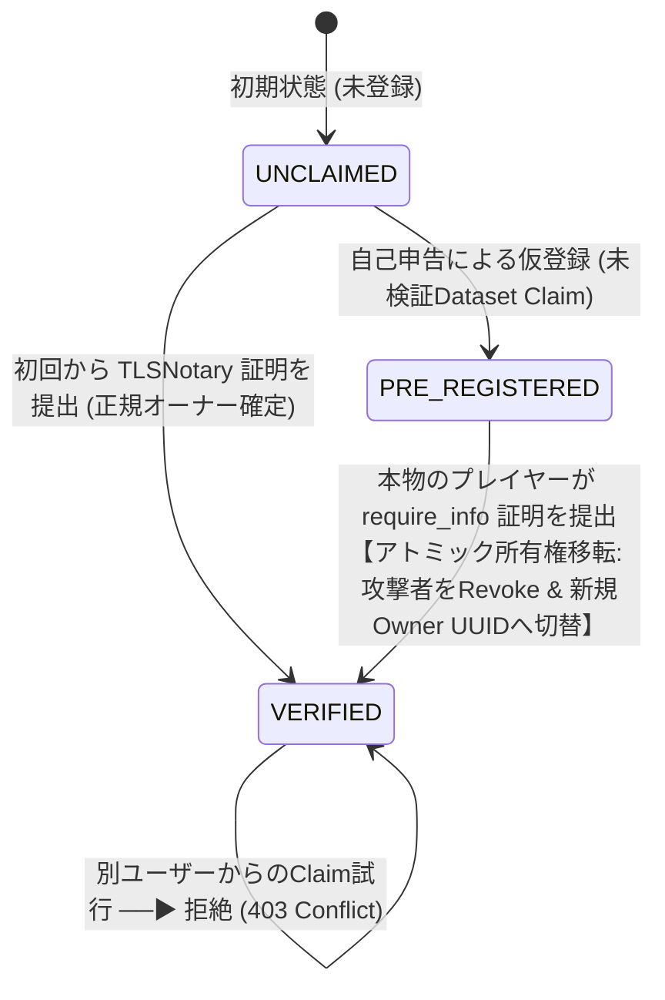
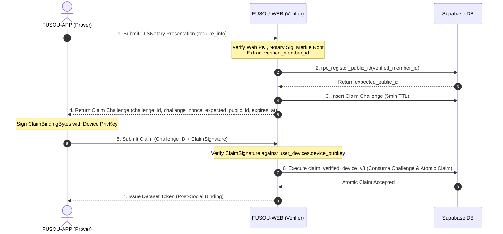

# FUSOU: zkTLS (TLSNotary MPC-TLS) による member_id 所有権担保 & 所有権移転ステートマシン 完全実装仕様書 (require_info 特化版)

> **文書種別**: アーキテクチャ設計仕様書 & 実装マスターガイド（Implementation Master Guide）  
> **対象領域**: FUSOU プロジェクト全域（`packages/fusou-auth`, `packages/fusou-proxy-core`, `packages/fusou-proxy-tlsn`, `packages/FUSOU-WEB`, Supabase / Cloudflare Workers / Dedicated Verifier Service）  
> **v1 Core Security Goal**:  
> **「ログインセッション開始時の `POST /kcsapi/api_get_member/require_info` から暗号学的に検証した `api_member_id` を FUSOU Dataset Identity（`public_id`）として確立し、事前登録攻撃を完全に無力化して正当な所有権を確定・移転する」**  
> 対象 API: **`POST /kcsapi/api_get_member/require_info`**（1つの Game Login Session で最初に正常取得された 1 回のみ）  
> 対象データ: **`/api_data/api_basic/api_member_id`**（Wire: `i64`, Canonical Internal: Decimal String）  
> **最重要設計原則**:  
> 1. **再送信ゼロ（No Re-submission）**: FUSOU 自身が同一 logical request を二重送信しないことを徹底し（FUSOU-generated duplicate = 0）、**FUSOU-Prover と Game Server 間の正規の 1 回限りの TLSNotary MPC-TLS セッションを公証**する。  
> 2. **外部プロキシ中継ゼロ（Direct Connection）**: 外部中継プロキシは規約上・BANリスク上不可とし、**クライアントローカルの `FUSOU-PROXY` と艦これ公式サーバー間の直接通信を維持**する。  
> 3. **MPC-TLS 処理 3 段階と Browser 待機の分離**:  
>    - **Phase A**: Request routing / upstream connection  
>    - **Phase B**: MPC-TLS による Response plaintext 取得（**MPC-TLS response acquisition remains on the login API path** / 許容遅延は Phase 0 で実測）  
>    - **Phase C**: Presentation 生成 + Remote verification + DB claim（**Post-processing is not on critical path**）  
> 4. **Selective Disclosure（最小限開示）**: `require_info` レスポンス全体を開示せず、TLSNotary の selective disclosure により `/api_data/api_basic/api_member_id` の Byte Range のみを開示する。  
> 5. **Device ↔ Proof の暗号学的バインディング（Server-issued One-Time Challenge & Byte Layout 完全固定）**:  
>    `public_id` はクライアントが任意選択せず、サーバーが `verified_member_id` から導出する。Server-issued one-time challenge（`challenge_id`, `challenge_nonce`）に対する固定バイト列（Length-delimited binary framing）での Ed25519 署名を必須とし、Proof と提出端末を暗号学的に不可分にバインドする。  
> 6. **`member_id_hash` / Pepper の完全廃止（UUID `public_id` への一本化）**:  
>    `member_id_hash`、`anon_sync_pepper_runtime`、`anon_sync_pepper_versions`、Vault secret、Pepper rotation、HMAC 計算、hash version を**完全に廃止・削除**し、`public_id`（UUIDv4）を唯一の内部 Dataset Identity として使用する。  
> 7. **`api_member_id` と `public_id` の責務完全分離**:  
>    - `api_member_id`: Game Server が発行する識別子（TLSNotary で検証、`member_id_mapping` に保存）。  
>    - `public_id`: FUSOU Dataset の内部安定 UUID（各テーブルの FK 参照、Telemetry 所属先）。  
> 8. **並行 Claim の完全直列化（64-bit Advisory Lock & 親行ロック契約）**:  
>    64-bit Advisory Lock により衝突確率を十分に低減し、同一トランザクション内で必ず行が存在する `member_id_mapping` 親行の `FOR UPDATE` により並行 Claim を物理的に直列化する。  
> 9. **所有権現在状態（`member_ownership`）と通常のアプリケーション経路で変更禁止な監査履歴（`member_ownership_claims`）の分離**:  
>    現在の検証済み所有者レコードと、将来の監査検証用情報（`notary_time`, `notary_key_id`, `proof_purpose`）を含む Append-Only 監査証跡ログをテーブル分離する。  
> 10. **Quad Invariant の段階的成立 & Social User Binding**:  
>     `GAME_IDENTITY_VERIFIED` 時点で Triple Invariant を満たし、OAuth 認証ユーザーによる明示的なバインディング操作（`SOCIAL_ACCOUNT_BOUND`）完了後に $\text{member\_ownership.verified\_user\_id} \equiv \text{user\_devices.canonical\_user\_id} \equiv \text{user\_member\_map.user\_id} \equiv \text{web\_user\_member\_map.user\_id}$ の Quad Invariant を厳格に保持する。  
> 11. **RPC 前提条件の明確化（Security Boundary）**:  
>     ストアドプロシージャ `claim_verified_device_v3` は、呼び出し元 FUSOU-WEB が TLSNotary Proof および `ClaimBindingMessage` 署名を完全検証済みであることを前提とし、未検証データの書き込みを遮断する。  
> 12. **Dataset Token の後発行（Triple Verified Issuance）**:  
>     `Game Identity Verified + Device Authorized + Social Account Bound` の 3 条件がすべて揃った時点で `dataset_token` を発行し、事前発行は行わない。  
> 13. **Fallback 時のステータス明示**:  
>     Notary 障害時は `GAMEPLAY_OK / IDENTITY_UNVERIFIED / DATASET_TOKEN_NOT_ISSUED` の状態へ安全にフォールバックし、ゲームプレイを継続する。  
> **ステータス**: Byte Layout固定・One-Time Challenge DB管理・段階的Quad Invariant完全反映マスター  

---

## 目次

1. [Goal（目標）](#1-goal目標)
2. [Threat Model（脅威モデル）](#2-threat-model脅威モデル)
3. [Trust Boundary & Security Boundary（信頼境界 & RPC前提条件）](#3-trust-boundary--security-boundary信頼境界--rpc前提条件)
4. [Identity Architecture & Invariant（ID基盤と不変条件の段階的成立）](#4-identity-architecture--invariantid基盤と不変条件の段階的成立)
5. [Social Account Binding (`web_user_member_map`) & 状態モデル](#5-social-account-binding-web_user_member_map--状態モデル)
6. [Member State Machine（所有権ステートマシン & 乗っ取り防止ルール）](#6-member-state-machine所有権ステートマシン--乗っ取り防止ルール)
7. [TLSNotary Ownership Proof (`POST /kcsapi/api_get_member/require_info`)](#7-tlsnotary-ownership-proof-post-kcsapiapi_get_memberrequire_info)
8. [Device ↔ Proof Binding（Challenge-Response と Byte Layout 固定）](#8-device--proof-bindingchallenge-response-と-byte-layout-固定)
9. [Claim Transaction（アトミック所有権移転トランザクション 全10ステップ）](#9-claim-transactionアトミック所有権移転トランザクション-全10ステップ)
10. [Preemptive Registration Attack（事前登録攻撃の無力化と安全なRevoke）](#10-preemptive-registration-attack事前登録攻撃の無力化と安全なrevoke)
11. [Concurrent Claim Handling（64-bit Advisory Lock & 親行ロック契約）](#11-concurrent-claim-handling64-bit-advisory-lock--親行ロック契約)
12. [Revoke Semantics & Currently Trusted Device（失効セマンティクスと有効端末定義）](#12-revoke-semantics--currently-trusted-device失効セマンティクスと有効端末定義)
13. [Dataset Token Issuance（Triple Verified 後発行ルールとJWT Claims）](#13-dataset-token-issuancetriple-verified-後発行ルールとjwt-claims)
14. [Replay Protection & Proof Consumption Policy（証明書消費ポリシー）](#14-replay-protection--proof-consumption-policy証明書消費ポリシー)
15. [DB Schema / RPC（Supabaseマイグレーション: Challenge, 状態, 拡張監査履歴）](#15-db-schema--rpcsupabaseマイグレーション-challenge-状態-拡張監査履歴)
16. [Failure Cases & Fallback Semantics (Phase A / Phase B)](#16-failure-cases--fallback-semantics-phase-a--phase-b)
17. [Recovery（正規オーナーによるアカウント回復手順）](#17-recovery正規オーナーによるアカウント回復手順)
18. [Testing（単体・統合・並行競合テスト）](#18-testing単体統合並行競合テスト)
19. [Migration（既存データの移行手順）](#19-migration既存データの移行手順)
20. [Rollout Plan & Verifier Benchmark（PoC先行の段階的ロールアウト計画）](#20-rollout-plan--verifier-benchmarkpoc先行の段階的ロールアウト計画)
21. [Security Progress Checklist（開発進捗チェックリスト）](#21-security-progress-checklist開発進捗チェックリスト)

---

## 1. Goal（目標）

FUSOU の匿名同期システム（`anonymous-sync-v2`）において、悪意ある第三者が他人の `api_member_id` を先回りして自己申告登録し、本物のプレイヤーがデータを同期できなくなる **事前登録攻撃（Preemptive Registration Attack / ID Squatting）** を暗号学的に完全無力化します。
セッション開始時の `POST /kcsapi/api_get_member/require_info` の `/api_data/api_basic/api_member_id` を対象に zkTLS (TLSNotary MPC-TLS) を適用し、「正規のゲームセッションを操作できる端末」が所有権をいつでも奪還・確定できるアトミックな所有権移転基盤を確立します。

---

## 2. Threat Model（脅威モデル）

### 前提条件
* 攻撃者はスクリプト等を用いて、未登録の任意の `api_member_id`（例: `12345678`）に対して `POST /anonymous-sync/v2/register` を自由に実行できます。
* クライアント環境（ローカルファイル・メモリ）は攻撃者により完全に制御されているものと仮定します。

### 想定される攻撃シナリオ
1. **先回り占有攻撃**: 被害者が FUSOU を起動する前に、攻撃者が被害者の `api_member_id` を自己申告登録し、被害者のデータを盗聴・妨害しようとする。
2. **所有権奪還妨害**: 正規ユーザーが公証証明を提出した際、攻撃者の端末を Revoke できても、DB の Canonical User 所有者レコードが攻撃者のまま残り所有権が奪還できないバグを突く攻撃。
3. **並行 Claim 攻撃**: 複数の端末から同時に Claim リクエストを送り、空テーブル検索の隙を突いて二重登録や不整合を発生させる。
4. **別ユーザーによる乗っ取り Claim 攻撃**: 正規オーナー A が確定した後に、第三者 B が一時的にゲームアカウントにアクセスできた場合に B のアカウントへ所有権を強制移転しようとする。
5. **同一 Proof の多重 Claim（Replay）**: 過去のログイン通信の証明書を別の端末や別アカウントで再利用する。
6. **Proof-Device 切り離し攻撃**: 盗聴した他人・別端末の Proof P を、自端末の Device ID と組み合わせて提出しようとする。

---

## 3. Trust Boundary & Security Boundary（信頼境界 & RPC前提条件）

```
                     UNTRUSTED ZONE
┌────────────────────────────────────────────────────────┐
│ User PC (Client Environment)                           │
│                                                        │
│  - FUSOU binary (Tamperable)                           │
│  - Local Memory / Process (Inspectable)                │
│  - Local SQLite DB (Modifiable)                        │
│  - Browser / OS (Untrusted)                            │
│                                                        │
│  Client-provided metadata = NEVER trusted              │
└───────────────────────────┬────────────────────────────┘
                            │
                            │ 1. TLSNotary Presentation (require_info)
                            │ 2. ClaimSignature = Ed25519(ClaimBindingBytes)
                            ▼
═════════════════════ TRUST BOUNDARY ═════════════════════
                            │
                            ▼
┌────────────────────────────────────────────────────────┐
│ FUSOU-WEB (Verification Server / Cloudflare Workers)   │
│                                                        │
│  - Verify Web PKI Certificate Chain                    │
│  - Verify TLSNotary Notary Signature & Merkle Root     │
│  - Derive expected_public_id from verified member_id   │
│  - Issue Server One-Time Challenge into DB             │
│  - Verify ClaimBindingBytes Signature (Device Match)   │
│  - Strict Server-Side Canonical Parser (Zod)           │
│                                                        │
│  Verified Plaintext = TRUSTED provenance               │
│  (TLSNotary verification で開示された Opening Bytes)    │
│  Canonical Parser Output = TRUSTED representation      │
└───────────────────────────┬────────────────────────────┘
                            │
                            ▼ [SECURITY BOUNDARY]
┌────────────────────────────────────────────────────────┐
│ Supabase Database (Trusted Core Storage: RPC Layer)    │
│                                                        │
│  - 64-bit Advisory Lock & Row-Level Locking            │
│  - Atomic Ownership Transfer (Strict 10 Steps)         │
│  - Enforce Quad Invariant (Post-Social Binding)        │
│  - Atomic Challenge & Proof Consumption Enforcement    │
│  - Append-Only Audit Trail with proof_purpose          │
│                                                        │
│  Stored State = ACCEPTED Verified Evidence Only        │
└────────────────────────────────────────────────────────┘
```

> **RPC の Security Boundary（前提条件）**:  
> `claim_verified_device_v3` は、**呼び出し元である FUSOU-WEB が TLSNotary Proof の暗号署名・Merkle Root・Web PKI およびサーバー導出 `expected_public_id` と Server Challenge に基づく `ClaimBindingBytes` 署名を完全検証済みであることを前提** とします。未検証の証明書や改ざんされた平文が直接 RPC に渡されることはありません。

---

## 4. Identity Architecture & Invariant（ID基盤と不変条件の段階的成立）

### 4.1 `api_member_id` と `public_id` の責務分離
```
api_member_id (例: 12345678: i64)
       │
       │ (TLSNotary provenance 検証)
       ▼
member_id_mapping (Service-role only: Root of Game Identity)
       │
       ▼
public_id = UUIDv4 (Random UUID: Dataset U1)
       │
       ├───────────────▶ member_ownership (verified_user_id = Auth User A)
       ├───────────────▶ user_member_map (user_id = Auth User A)
       ├───────────────▶ web_user_member_map (user_id = Social User A)
       ├───────────────▶ user_devices (device_id = Device A)
       └───────────────▶ telemetry_events (public_id = U1)
```

### 4.2 Invariant の段階的成立
1. **`GAME_IDENTITY_VERIFIED` 時点**:
   $$\text{member\_ownership.verified\_user\_id} \equiv \text{user\_devices.canonical\_user\_id} \equiv \text{user\_member\_map.user\_id} \quad (\text{Triple Invariant})$$
2. **`SOCIAL_ACCOUNT_BOUND`（OAuth 明示的バインディング完了）以降**:
   $$\text{上記 3 者} \equiv \text{web\_user\_member\_map.user\_id} \quad (\text{Quad Invariant})$$

---

## 5. Social Account Binding (`web_user_member_map`) & 状態モデル

* **状態の分離**:
  1. `GAME_IDENTITY_VERIFIED`: TLSNotary Proof により `api_member_id` $\leftrightarrow$ `public_id` $\leftrightarrow$ `user_devices` が確定した状態。
  2. `SOCIAL_ACCOUNT_BOUND`: OAuth 認証済み Web ユーザーが明示的なバインディング操作を行い、`web_user_member_map` に登録された状態。
* **1:1 Binding ルール**: `web_user_member_map` は `PRIMARY KEY (user_id, public_id)` かつ `public_id UNIQUE` であり、1 つの Dataset `public_id` に紐づく Web ユーザーは 1 人です。  
* **注意**: Game Account へのアクセス証明 $\neq$ Social Account 所有権の証明 であるため、OAuth 認証済みユーザーによる明示的なバインディング操作を必須とし、別ユーザーからの乗っ取り Claim は `EXISTING_VERIFIED_OWNER_CONFLICT` で遮断されます。

---

## 6. Member State Machine（所有権ステートマシン & 乗っ取り防止ルール）



> **重要原則**:  
> 1. `PRE_REGISTERED` は「未検証の Game Identity」ではなく「未検証の Dataset Claim（自己申告による仮登録）」であり、この状態の Dataset が正規の `member_id` であるとは扱いません。  
> 2. **Game Account Owner は一度確立したら原則不変**。Device の追加・失効のみ可能であり、所有者変更は別途明示的な Recovery/Transfer プロトコルを必要とします。

---

## 7. TLSNotary Ownership Proof (`POST /kcsapi/api_get_member/require_info`)

* **Gameplay Path**:
  `require_info` は FUSOU-Prover と Game Server 間の TLSNotary MPC-TLS 経路により処理されるため、この API の応答取得には MPC 由来の追加遅延が発生する可能性があります。**Browser の待機条件から除外するのは Presentation 生成、証明送信、DB 登録等の後処理（Post-processing is not on critical path）** であり、Response plaintext の取得自体は MPC-TLS の制約に従います（**MPC-TLS response acquisition remains on the login API path** / 許容遅延は Phase 0 PoC で実測検証）。
* **Evidence Path**:
  プロキシのバックグラウンドタスクが Notary サーバーと MPC を完了させ、最小限フィールド（`POST /kcsapi/api_get_member/require_info`, `Host:`, `api_result: 1`, `/api_data/api_basic/api_member_id`）のみを開示した Presentation を構築します。

---

## 8. Device ↔ Proof Binding（Challenge-Response と Byte Layout 固定）

Proof P と提出端末 Device A を暗号学的に不可分にバインドするため、以下の 4 ステップ Challenge-Response を実行します：



* **署名対象バイト列（Length-Delimited Binary Framing）**:
  $$\text{ClaimBindingBytes} = \text{u16}(17) \Vert \text{"fusou-identity-v1"} \Vert \text{u16}(32) \Vert \text{comm} \Vert \text{u16}(\text{len(mid)}) \Vert \text{mid} \Vert \text{u16}(16) \Vert \text{dev} \Vert \text{u16}(16) \Vert \text{pub} \Vert \text{u16}(16) \Vert \text{cid} \Vert \text{u16}(32) \Vert \text{nonce}$$
  $$\text{ClaimSignature} = \text{Ed25519\_Sign}(sk_{\text{device}}, \text{ClaimBindingBytes})$$

---

## 9. Claim Transaction（アトミック所有権移転トランザクション 全10ステップ）

`member_id_hash` / pepper 関連を完全に排したシンプルな **全10ステップのトランザクション** を実行します：

1. **Advisory Lock 取得**: 64-bit キーによるトランザクション排他ロック。
2. **Challenge & Proof Consumption Check**: 排他ロック下での Challenge 単一消費（`UPDATE claim_challenges SET consumed_at = NOW()`）および `transcript_commitment` 重複消費チェック。
3. **Device Row Lock**: 対象 `user_devices` レコードの存在確認と `FOR UPDATE` ロック。
4. **Public ID 登録/取得**: `rpc_register_public_id(p_api_member_id)` の呼び出し（`UNIQUE(api_member_id)` による同一 `public_id` 取得保証）。
5. **Parent Mapping Row Lock**: 親行 `member_id_mapping` に対する `FOR UPDATE` ロック。
6. **Current Ownership Row Lock**: 現在の `member_ownership` レコードの `FOR UPDATE` ロック。
7. **Ownership Rule 判定**: 初回公証 / 事前登録攻撃者からの奪還 / 別アカウント乗っ取り拒絶の判定。
8. **Audit Record Insert**: `member_ownership_claims` への監査ログ追記（`proof_purpose = 'GAME_ACCOUNT_IDENTITY_V1'`, `notary_time`, `notary_key_id` 含む）。
9. **Device Verification Update**: 当該デバイスの `is_verified = TRUE` 昇格およびバインド更新。
10. **Result Return**: 確定された所有権メタデータの JSON 返却。

---

## 10. Preemptive Registration Attack（事前登録攻撃の無力化と安全なRevoke）

事前登録攻撃が存在する場合の所有権奪還アルゴリズム：
1. `api_member_id` から 64-bit Advisory Lock および `member_id_mapping` の親行ロックを取得。
2. 対象デバイスの `canonical_user_id`（既に `auth.users` に紐づいている正規 UUID）を取得。
3. `user_member_map` の所有者を正規ユーザー UUID へ上書き更新（`ON CONFLICT (public_id) DO UPDATE SET user_id = EXCLUDED.user_id`）。
4. `member_ownership` に現在の正規オーナーを記録。
5. **安全な Revoke 実行**: 同一 `public_id` に紐づく未検証端末のうち、**現在オーナーと異なる別ユーザーの端末のみを一括 Revoke**：
   ```sql
   UPDATE public.user_devices
   SET
     revoked_at = NOW(),
     revoked_reason = 'preempted_by_tlsn_verified_owner'
   WHERE public_id = v_public_id
     AND device_id != p_device_id
     AND is_verified = FALSE
     AND canonical_user_id <> v_canonical_user_id
     AND revoked_at IS NULL;
   ```
6. `member_ownership_claims` に監査証跡ログを追記保存。

---

## 11. Concurrent Claim Handling（64-bit Advisory Lock & 親行ロック契約）

初回 Claim 時、`member_ownership` に行が存在しない場合でも確実に排他制御を行うため、以下の二重ロックをトランザクション先頭で適用します：
1. **64-bit Transaction Advisory Lock**:
   32-bit `hashtext()` によるハッシュ衝突確率を十分に低減するため、64-bit 整数キーを使用：
   ```sql
   v_lock_key := ('x' || substr(md5(p_api_member_id), 1, 16))::bit(64)::bigint;
   PERFORM pg_advisory_xact_lock(v_lock_key);
   ```
2. **親行ロック契約（Parent Row Lock Contract）**:
   `rpc_register_public_id(p_api_member_id)` は、**同一トランザクション内で必ず `public.member_id_mapping` に行を作成（または取得）してから `v_public_id` を返却する契約** とし、直後に親行を確実に `SELECT ... FOR UPDATE` します。

---

## 12. Revoke Semantics & Currently Trusted Device（失効セマンティクスと有効端末定義）

* **Currently Trusted Device の厳格な定義**:
  DB の `user_devices` テーブル上で **`is_verified = TRUE AND revoked_at IS NULL`** であること。
* **Revoke 処理**:
  所有権移転時、古い未検証端末には `revoked_reason = 'preempted_by_tlsn_verified_owner'` が刻印され、以降のアクセスは即時 401/403 で拒絶されます。

---

## 13. Dataset Token Issuance（Triple Verified 後発行ルールとJWT Claims）

### 13.1 Triple Verified Issuance（公証後発行ルール）
必ず以下の順序で発行され、事前発行は行われません：
$$\text{require\_info verified} \longrightarrow \text{device claim accepted} \longrightarrow \text{social account bound} \longrightarrow \text{dataset\_token issued}$$

### 13.2 JWT Claims
```json
{
  "sub": "00000000-0000-4000-8000-000000000000",
  "public_id": "11111111-1111-4000-8000-111111111111",
  "is_verified": true,
  "iat": 1756200000,
  "exp": "<iat + configured_ttl>"
}
```

---

## 14. Replay Protection & Proof Consumption Policy（証明書消費ポリシー）

* **Proof 一意消費制約**:
  排他ロック取得後に `member_ownership_claims` テーブルに `UNIQUE (transcript_commitment)` 制約を課し、**同一の公証証明（Proof）が 2 回以上 Claim に使われた場合は `DUPLICATE_PROOF_CONSUMED` 例外として即時ロールバック** します。
* **Maximum Age Acceptance Policy**:
  Notary が刻印した `notary_time` が 24 時間以上前の古い証明書は自動破棄。

---

## 15. DB Schema / RPC（Supabaseマイグレーション: Challenge, 状態, 拡張監査履歴）

### `20260826000000_claim_verified_device_v3.sql`
```sql
BEGIN;

-- 1. Server-issued One-Time Claim Challenge テーブル
CREATE TABLE IF NOT EXISTS public.claim_challenges (
    challenge_id UUID PRIMARY KEY DEFAULT gen_random_uuid(),
    public_id UUID NOT NULL REFERENCES public.member_id_mapping(public_id) ON DELETE RESTRICT,
    device_id UUID NOT NULL REFERENCES public.user_devices(device_id) ON DELETE RESTRICT,
    challenge_nonce BYTEA NOT NULL,
    expires_at TIMESTAMPTZ NOT NULL,
    consumed_at TIMESTAMPTZ,
    created_at TIMESTAMPTZ NOT NULL DEFAULT NOW()
);

CREATE INDEX IF NOT EXISTS idx_claim_challenges_active 
    ON public.claim_challenges (challenge_id, expires_at) 
    WHERE consumed_at IS NULL;

ALTER TABLE public.user_devices
  ADD COLUMN IF NOT EXISTS is_verified BOOLEAN NOT NULL DEFAULT FALSE,
  ADD COLUMN IF NOT EXISTS verified_at TIMESTAMPTZ,
  ADD COLUMN IF NOT EXISTS last_notary_time TIMESTAMPTZ;

-- 2. 現在の検証済み所有者テーブル (Current Ownership State)
CREATE TABLE IF NOT EXISTS public.member_ownership (
    public_id UUID PRIMARY KEY REFERENCES public.member_id_mapping(public_id) ON DELETE RESTRICT,
    verified_user_id UUID NOT NULL REFERENCES auth.users(id) ON DELETE RESTRICT,
    primary_device_id UUID NOT NULL REFERENCES public.user_devices(device_id) ON DELETE RESTRICT,
    established_at TIMESTAMPTZ NOT NULL DEFAULT NOW(),
    updated_at TIMESTAMPTZ NOT NULL DEFAULT NOW()
);

-- 3. 所有権 Claim 監査履歴テーブル (通常アプリケーション経路でUPDATE/DELETE禁止のAppend-Only Audit Trail)
CREATE TABLE IF NOT EXISTS public.member_ownership_claims (
    claim_id UUID PRIMARY KEY DEFAULT gen_random_uuid(),
    public_id UUID NOT NULL REFERENCES public.member_id_mapping(public_id) ON DELETE RESTRICT,
    canonical_user_id UUID NOT NULL REFERENCES auth.users(id) ON DELETE RESTRICT,
    verified_device_id UUID NOT NULL REFERENCES public.user_devices(device_id) ON DELETE RESTRICT,
    transcript_commitment TEXT NOT NULL,
    notary_time TIMESTAMPTZ NOT NULL,
    notary_key_id TEXT,
    proof_purpose TEXT NOT NULL DEFAULT 'GAME_ACCOUNT_IDENTITY_V1',
    claim_type TEXT NOT NULL CHECK (claim_type IN ('INITIAL_VERIFIED', 'TAKEOVER_FROM_PRE_REG', 'ADDITIONAL_DEVICE')),
    claimed_at TIMESTAMPTZ NOT NULL DEFAULT NOW(),
    CONSTRAINT uq_member_claims_transcript UNIQUE (transcript_commitment)
);

CREATE INDEX IF NOT EXISTS idx_member_claims_history ON public.member_ownership_claims(public_id, claimed_at DESC);

-- 監査履歴テーブルの UPDATE / DELETE を物理禁止するトリガー
CREATE OR REPLACE FUNCTION public.fn_prevent_audit_tampering()
RETURNS TRIGGER LANGUAGE plpgsql AS $$
BEGIN
  RAISE EXCEPTION 'member_ownership_claims is an append-only audit trail: UPDATE or DELETE is strictly prohibited';
END;
$$;

CREATE TRIGGER trg_protect_member_claims_audit
BEFORE UPDATE OR DELETE ON public.member_ownership_claims
FOR EACH ROW EXECUTE FUNCTION public.fn_prevent_audit_tampering();

-- 4. アトミック所有権確定・移転ストアドプロシージャ (全10ステップ順序完全維持)
CREATE OR REPLACE FUNCTION public.claim_verified_device_v3(
  p_device_id UUID,
  p_api_member_id TEXT,
  p_transcript_commitment TEXT,
  p_notary_time TIMESTAMPTZ,
  p_challenge_id UUID,
  p_challenge_nonce BYTEA,
  p_notary_key_id TEXT DEFAULT NULL
)
RETURNS JSONB
LANGUAGE plpgsql
SECURITY DEFINER
SET search_path = public
AS $$
DECLARE
  v_lock_key BIGINT;
  v_device RECORD;
  v_public_id UUID;
  v_canonical_user_id UUID;
  v_current_ownership RECORD;
  v_mapping RECORD;
  v_claim_type TEXT;
  v_existing_claim_count INT;
  v_challenge_updated INT;
  v_result JSONB;
BEGIN
  -- Step 1. 【最優先】64-bit Transaction Advisory Lock による完全排他制御
  v_lock_key := ('x' || substr(md5(p_api_member_id), 1, 16))::bit(64)::bigint;
  PERFORM pg_advisory_xact_lock(v_lock_key);

  -- Step 2. 排他ロック取得後の Proof 重複消費チェック (TOCTOU競合防止)
  SELECT COUNT(*) INTO v_existing_claim_count
  FROM public.member_ownership_claims
  WHERE transcript_commitment = p_transcript_commitment;

  IF v_existing_claim_count > 0 THEN
    RAISE EXCEPTION 'DUPLICATE_PROOF_CONSUMED: transcript % has already been used for ownership claim', p_transcript_commitment;
  END IF;

  -- Step 3. 対象デバイスの存在確認 & 行ロック
  SELECT * INTO v_device
  FROM public.user_devices
  WHERE device_id = p_device_id
  FOR UPDATE;

  IF NOT FOUND THEN
    RAISE EXCEPTION 'device_not_found';
  END IF;

  v_canonical_user_id := v_device.canonical_user_id;

  -- Step 4. public_id の取得/生成 (UNIQUE(api_member_id)により同一public_id取得保証)
  v_public_id := public.rpc_register_public_id(p_api_member_id);

  -- Step 4.1 Server Challenge の単一消費確認 (One-Time Consume)
  UPDATE public.claim_challenges
  SET consumed_at = NOW()
  WHERE challenge_id = p_challenge_id
    AND challenge_nonce = p_challenge_nonce
    AND public_id = v_public_id
    AND device_id = p_device_id
    AND consumed_at IS NULL
    AND expires_at > NOW();

  GET DIAGNOSTICS v_challenge_updated = ROW_COUNT;
  IF v_challenge_updated = 0 THEN
    RAISE EXCEPTION 'INVALID_OR_EXPIRED_CHALLENGE: challenge % is invalid, expired, or already consumed', p_challenge_id;
  END IF;

  -- Step 5. 親行ロック契約の実行 (member_id_mapping FOR UPDATE)
  SELECT * INTO v_mapping
  FROM public.member_id_mapping
  WHERE public_id = v_public_id
  FOR UPDATE;

  -- Step 6. 現在の検証済み所有者レコードを確認 (排他ロック)
  SELECT * INTO v_current_ownership
  FROM public.member_ownership
  WHERE public_id = v_public_id
  FOR UPDATE;

  -- Step 7. 所有権ルール判定
  IF v_current_ownership.public_id IS NULL THEN
    -- 【初回公証 / 事前登録攻撃者からの所有権奪還】
    v_claim_type := 'INITIAL_VERIFIED';

    -- user_member_map の所有者を正規ユーザーへ移転・上書き (Triple Invariant 保証)
    INSERT INTO public.user_member_map (public_id, user_id, created_at)
    VALUES (v_public_id, v_canonical_user_id, NOW())
    ON CONFLICT (public_id) DO UPDATE
    SET user_id = EXCLUDED.user_id;

    -- 現在の Verified Owner として登録 (Primary Device 固定)
    INSERT INTO public.member_ownership (
      public_id, verified_user_id, primary_device_id, established_at, updated_at
    )
    VALUES (
      v_public_id, v_canonical_user_id, p_device_id, NOW(), NOW()
    );

    -- 同一 public_id に紐づく未検証端末のうち、別ユーザーの未検証端末のみを安全に Revoke
    UPDATE public.user_devices
    SET
      revoked_at = NOW(),
      revoked_reason = 'preempted_by_tlsn_verified_owner'
    WHERE public_id = v_public_id
      AND device_id != p_device_id
      AND is_verified = FALSE
      AND canonical_user_id <> v_canonical_user_id
      AND revoked_at IS NULL;

  ELSE
    -- 【すでに検証済みオーナーが存在する状態】
    IF v_current_ownership.verified_user_id != v_canonical_user_id THEN
      -- 別アカウントからの乗っ取り Claim は厳格に拒絶
      RAISE EXCEPTION 'EXISTING_VERIFIED_OWNER_CONFLICT: account % is already verified owner', v_current_ownership.verified_user_id;
    END IF;

    -- 同一オーナーによる追加端末 (Multi-Device: Owner は不変)
    v_claim_type := 'ADDITIONAL_DEVICE';
  END IF;

  -- Step 8. 通常のアプリケーション経路において UPDATE / DELETE を禁止する Append-Only 監査履歴テーブルに記録
  INSERT INTO public.member_ownership_claims (
    public_id, canonical_user_id, verified_device_id, transcript_commitment, notary_time, notary_key_id, proof_purpose, claim_type
  )
  VALUES (
    v_public_id, v_canonical_user_id, p_device_id, p_transcript_commitment, p_notary_time, p_notary_key_id, 'GAME_ACCOUNT_IDENTITY_V1', v_claim_type
  );

  -- Step 9. 当該デバイスを verified に昇格 & 正当な Canonical User にバインド
  UPDATE public.user_devices
  SET
    public_id = v_public_id,
    canonical_user_id = v_canonical_user_id,
    is_verified = TRUE,
    verified_at = NOW(),
    last_notary_time = p_notary_time,
    revoked_at = NULL,
    revoked_reason = NULL
  WHERE device_id = p_device_id;

  -- Step 10. 結果返却
  v_result := jsonb_build_object(
    'device_id', p_device_id,
    'public_id', v_public_id,
    'canonical_user_id', v_canonical_user_id,
    'is_verified', TRUE,
    'claim_type', v_claim_type,
    'verified_at', NOW()
  );

  RETURN v_result;
END;
$$;

COMMIT;
```

---

## 16. Failure Cases & Fallback Semantics (Phase A / Phase B)

* **Phase A（リクエスト送信前）**:
  Game Server へのリクエスト送信前に MPC session が成立しない場合、直ちに通常の TLS 接続へ切り替えて `require_info` を送信。
  - 状態: `GAMEPLAY_OK / IDENTITY_UNVERIFIED / DATASET_TOKEN_NOT_ISSUED`
  - ゲームログインは 100% 継続し、未検証状態を維持します。
* **Phase B（リクエスト送信後）**:
  リクエスト送信後に MPC session が失敗した場合、**同一リクエストの再送は厳格に禁止（BAN 回避 / FUSOU-generated duplicate = 0）**。
  - 状態: `UNATTESTED`
  - `MPC-TLS request sent -> Verifier failure -> NO automatic replay, NO second upstream request -> If plaintext already fully available: may return original response; else: cannot reconstruct response from TLS.`
  - Browser への継続可否は「Prover が既に取得済みの plaintext が存在するか」に依存します（Phase 0 で実測検証）。公証タスクのみ破棄し、次回以降の自然な再試行時に新しい TLSNotary session として扱います。

---

## 17. Recovery（正規オーナーによるアカウント回復手順）

正規ユーザーが新端末で FUSOU を起動した場合：
1. **Game Identity**: TLSNotary による `require_info` 証明から同一の `api_member_id` を検証。
2. **Social Identity**: 認証済み同一 `canonical_user_id`（OAuth）を確認。
3. 既存の `public_id`（U1）に対して新端末 `Device B` を `user_devices` に追加（`Primary Device` は固定、Owner は不変）。

---

## 18. Testing（単体・統合・並行競合テスト）

* **所有権移転テスト**: 事前登録攻撃後に正規ユーザーが公証提出 $\rightarrow$ `user_member_map` の所有者が正規ユーザーに変更され、攻撃者端末が Revoke されることを検証。
* **並行 Claim 競合テスト**: 2台の端末からミリ秒単位で同時に `claim_verified_device_v3` を実行 $\rightarrow$ 64-bit Advisory Lock と親行ロックにより完全に順次直列化されることを検証。
* **別ユーザー乗っ取り拒絶テスト**: Owner 確立後に別ユーザーが Claim 実行 $\rightarrow$ `EXISTING_VERIFIED_OWNER_CONFLICT` で拒絶されることを検証。
* **端末すり替え遮断テスト**: 検証済み Proof P に対し別端末 Device B の署名を提出 $\rightarrow$ 403 で遮断されることを検証。
* **Proof 多重消費拒絶テスト**: 同一 `transcript_commitment` を再提出 $\rightarrow$ `DUPLICATE_PROOF_CONSUMED` でロールバックされることを検証。

---

## 19. Migration（既存データの移行手順）

```bash
cd packages/FUSOU-WEB
npx supabase db push
pnpm vitest run tests/tlsn-verifier.test.ts
```

---

## 20. Rollout Plan & Verifier Benchmark（PoC先行の段階的ロールアウト計画）

1. **Phase 0 (ADR-000 Data Plane PoC & Verifier Benchmark)**:
   - `POST /kcsapi/api_get_member/require_info` における Prover 統合と MPC 復号遅延の動作実測（P95 < 300ms）。
   - Cloudflare Workers vs Dedicated Rust Verifier のベンチマーク比較。
2. **Phase 1**: Supabase マイグレーション適用（`claim_challenges` 作成 & `claim_verified_device_v3` RPC デプロイ）。
3. **Phase 2**: `FUSOU-WEB` に `/anonymous-sync/v2/verify-tlsn` エンドポイントを有効化。
4. **Phase 3**: `FUSOU-APP` / `fusou-proxy-tlsn` にインライン公証ロジックを配信。

---

## 21. Security Progress Checklist（開発進捗チェックリスト）

- [D] ゲーム通信に外部プロキシを使用しない直接接続設計
- [D] FUSOU 生成の二重送信ゼロ（FUSOU-generated duplicate = 0）設計
- [D] MPC 復号遅延と Proof 後処理（非同期化）の 3 段階分離設計
- [D] `ClaimBindingBytes` の厳密な Byte Layout & Binary Framing 設計
- [D] Server-issued One-Time Challenge の DB 管理 & 単一消費ライフサイクル設計
- [D] `member_id_hash` / Pepper 体系の完全削除と UUID `public_id` への一本化
- [D] `api_member_id`（検証対象）と `public_id`（内部安定UUID）の責務完全分離
- [D] Trust Boundary Diagram および RPC 前提条件（Security Boundary）の定義
- [D] 64-bit Advisory Lock および親行ロック契約による並行実行競合排除設計
- [D] `member_ownership`（現在状態）と `member_ownership_claims`（拡張監査履歴）の分離
- [D] 排他ロック取得後の Proof Consumption Policy（重複消費排除）設計
- [D] Verified Owner 確定後の別ユーザー乗っ取り遮断（`EXISTING_VERIFIED_OWNER_CONFLICT`）設計
- [D] Quad Invariant（$\text{verified\_user\_id} \equiv \text{canonical\_user\_id} \equiv \text{user\_id} \equiv \text{web\_user\_id}$）の段階的成立定義
- [D] Post-Verification Issuance（公証前のトークン発行禁止）設計
- [P] Phase 0 PoC（GO/NO-GO 基準付き実測検証 15 項目）
- [P] Verifier 実行環境ベンチマーク（Workers vs Dedicated Rust Verifier）
- [I] 実装および DB マイグレーション適用
- [T] 単体テスト・端末すり替え遮断テスト
