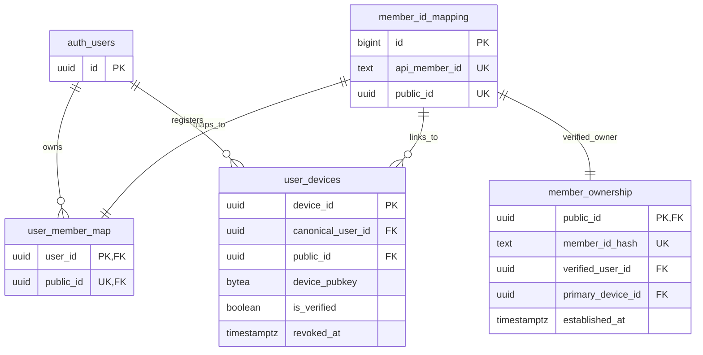
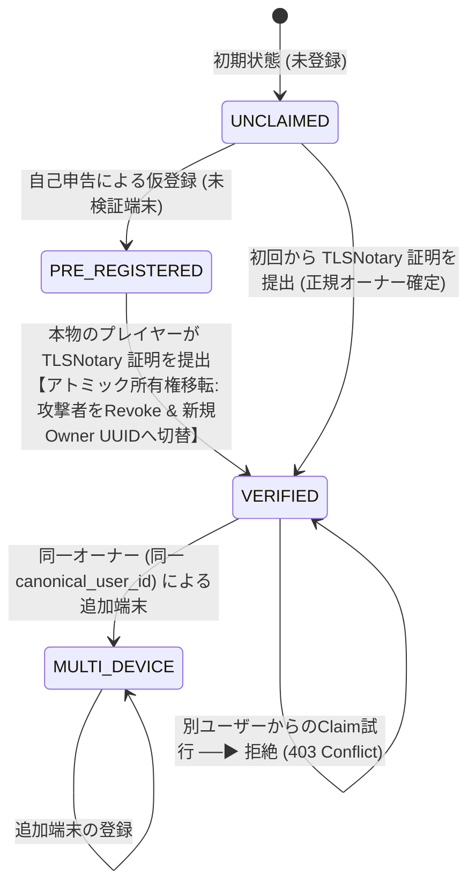

# FUSOU: zkTLS (TLSNotary MPC-TLS) による member_id 所有権担保 & 所有権移転ステートマシン 完全実装仕様書

> **文書種別**: アーキテクチャ設計仕様書 & 実装マスターガイド（Implementation Master Guide）  
> **対象領域**: FUSOU プロジェクト全域（`packages/fusou-auth`, `packages/fusou-proxy-core`, `packages/fusou-proxy-tlsn`, `packages/FUSOU-WEB`, Supabase / Cloudflare Workers）  
> **最重要設計原則**:  
> 1. **再送信ゼロ（No Re-submission）**: ゲームAPIを裏で故意に再送・二重実行することはBANリスクおよび副作用の観点から絶対に排除し、**ブラウザと艦これ公式サーバー間の正規のTLSセッションそのものを公証**する。  
> 2. **外部プロキシ中継ゼロ（Direct Connection）**: 外部中継プロキシは規約上・BANリスク上不可とし、**クライアントローカルの `FUSOU-PROXY` と艦これ公式サーバー間の直接通信を維持**する。  
> 3. **Gameplay Path と Evidence Path の二元分離**: 母港画面の表示（Gameplay Path）は低遅延・通常プレイ継続を最優先とし、真正性証明の構築（Evidence Path）をバックグラウンドで非同期実行する。  
> 4. **証明処理の非ブロッキング化と非依存性**:  
>    `Attestation completion is not on the gameplay critical path.`  
>    `Notary availability is not a gameplay dependency.`  
> 5. **並行 Claim の完全直列化（64-bit Advisory Lock & 親行ロック契約）**:  
>    32-bit hash collision を排除した 64-bit Advisory Lock および、同一トランザクション内で必ず行が存在する `member_id_mapping` 親行の `FOR UPDATE` により並行 Claim を物理的に直列化する。  
> 6. **二重識別子モデル（Random UUID `public_id` と HMAC `member_id_hash`）**:  
>    `public_id` は DB 内部リレーション用のランダム UUID（UUIDv4）のままとし、`member_id_hash` はサーバー側 Pepper HMAC による秘匿照合・一意 Claim 用キーとして両立させる。  
> 7. **所有権現在状態（`member_ownership`）と監査履歴（`member_ownership_claims`）の分離**:  
>    現在の検証済み所有者レコードと、過去のすべての Claim 証跡ログをテーブルレベルで明確に分離する。  
> 8. **Verified Owner 確定後の別ユーザー乗っ取り拒絶ルール**:  
>    一度 Verified Owner が確定した `public_id` に対して、別の `canonical_user_id` からの Claim は拒絶し、同一オーナーの追加端末（Multi-Device）のみを許可する。  
> **ステータス**: 信頼境界図・64bitロック・履歴分離・乗っ取り防止完全反映マスター  

---

## 目次

1. [Goal（目標）](#1-goal目標)
2. [Threat Model（脅威モデル）](#2-threat-model脅威モデル)
3. [Trust Boundary & Data Provenance（信頼境界図 & データの真正性モデル）](#3-trust-boundary--data-provenance信頼境界図--データの真正性モデル)
4. [Dual Identifier Model（public_id と member_id_hash の役割分担）](#4-dual-identifier-modelpublic_id-と-member_id_hash-の役割分担)
5. [Existing FUSOU Identity Architecture（現行FUSOUのID基盤）](#5-existing-fusou-identity-architecture現行fusouのid基盤)
6. [Member State Machine（所有権ステートマシン & 乗っ取り防止ルール）](#6-member-state-machine所有権ステートマシン--乗っ取り防止ルール)
7. [TLSNotary Ownership Proof（母港APIの暗号学的公証 & データプレーン分離）](#7-tlsnotary-ownership-proof母港apiの暗号学的公証--データプレーン分離)
8. [Device Binding（Ed25519 デバイスバインディングの暗号学的証明）](#8-device-bindinged25519-デバイスバインディングの暗号学的証明)
9. [Claim Transaction（アトミック所有権移転トランザクション）](#9-claim-transactionアトミック所有権移転トランザクション)
10. [Preemptive Registration Attack（事前登録攻撃の無力化）](#10-preemptive-registration-attack事前登録攻撃の無力化)
11. [Concurrent Claim Handling（64-bit Advisory Lock & 親行ロック契約）](#11-concurrent-claim-handling64-bit-advisory-lock--親行ロック契約)
12. [Revoke Semantics（未検証攻撃者端末の失効セマンティクス）](#12-revoke-semantics未検証攻撃者端末の失効セマンティクス)
13. [Dataset Token Issuance（検証済みJWT発行）](#13-dataset-token-issuance検証済みjwt発行)
14. [Replay Protection（リプレイ攻撃防御）](#14-replay-protectionリプレイ攻撃防御)
15. [DB Schema / RPC（Supabaseマイグレーション: 状態と履歴の分離）](#15-db-schema--rpcsupabaseマイグレーション-状態と履歴の分離)
16. [Failure Cases & Fallback（異常系・二段階フォールバックセマンティクス）](#16-failure-cases--fallback異常系二段階フォールバックセマンティクス)
17. [Recovery（正規オーナーによるアカウント回復手順）](#17-recovery正規オーナーによるアカウント回復手順)
18. [Testing（単体・統合・並行競合テスト）](#18-testing単体統合並行競合テスト)
19. [Migration（既存データの移行手順）](#19-migration既存データの移行手順)
20. [Rollout Plan（PoC先行の段階的ロールアウト計画）](#20-rollout-planpoc先行の段階的ロールアウト計画)
21. [Security Review Checklist（監査チェックリスト）](#21-security-review-checklist監査チェックリスト)

---

## 1. Goal（目標）

FUSOU の匿名同期システム（`anonymous-sync-v2`）において、悪意ある第三者が他人の `api_member_id` を先回りして自己申告登録し、本物のプレイヤーがデータを同期できなくなる **事前登録攻撃（Preemptive Registration Attack / ID Squatting）** を暗号学的に完全無力化します。
zkTLS (TLSNotary MPC-TLS) を用いて「正規のゲームセッションを操作できる端末」が所有権をいつでも奪還・確定できるアトミックな所有権移転基盤を確立します。

---

## 2. Threat Model（脅威モデル）

### 前提条件
* 攻撃者はスクリプト等を用いて、未登録の任意の `api_member_id`（例: `12345678`）に対して `POST /anonymous-sync/v2/register` を自由に実行できます。
* クライアント環境（ローカルファイル・メモリ）は攻撃者により完全に制御されているものと仮定します。

### 想定される攻撃シナリオ
1. **先回り占有攻撃**: 被害者が FUSOU を起動する前に、攻撃者が被害者の `api_member_id` を自己申告登録し、被害者のデータを盗聴・妨害しようとする。
2. **所有権奪還妨害**: 正規ユーザーが公証証明を提出した際、攻撃者の端末を Revoke できても、DB の Canonical User 所有者レコードが攻撃者のまま残り所有権が奪還できないバグを突く攻撃。
3. **並行 Claim 攻撃**: 複数の端末から同時に Claim リクエストを送り、空テーブル検索の隙を突いて二重登録や不整合を発生させる。
4. **ハッシュ詐称攻撃**: クライアントが `p_api_member_id` と一致しない偽の `p_member_id_hash` を送り、DB レコードを汚染しようとする。
5. **別ユーザーによる乗っ取り Claim 攻撃**: 正規オーナー A が確定した後に、第三者 B が一時的にゲームアカウントにアクセスできた場合に B のアカウントへ所有権を強制移転しようとする。
6. **証明書の使い回し（Replay）**: 過去の母港通信の証明書を別の端末や別アカウントで再利用する。

---

## 3. Trust Boundary & Data Provenance（信頼境界図 & データの真正性モデル）

```
                     UNTRUSTED ZONE
┌────────────────────────────────────────────────────────┐
│ User PC (Client Environment)                           │
│                                                        │
│  - FUSOU binary (Tamperable)                           │
│  - Local Memory / Process (Inspectable)                │
│  - Local SQLite DB (Modifiable)                        │
│  - Browser / OS (Untrusted)                            │
│                                                        │
│  Client-provided metadata = NEVER trusted              │
└───────────────────────────┬────────────────────────────┘
                            │
                            │ 1. TLSNotary Presentation (MPC-TLS)
                            │ 2. Ed25519 Device Signature
                            ▼
═════════════════════ TRUST BOUNDARY ═════════════════════
                            │
                            ▼
┌────────────────────────────────────────────────────────┐
│ FUSOU-WEB (Verification Server / Cloudflare Workers)   │
│                                                        │
│  - Verify Web PKI Certificate Chain                    │
│  - Verify TLSNotary Notary Signature & Merkle Root     │
│  - Verify Device Binding (userData == device_pubkey)   │
│  - Strict Server-Side Canonical Parser (Zod)           │
│  - Server-Side Pepper HMAC Computation                 │
│                                                        │
│  Verified Plaintext = TRUSTED provenance               │
│  Canonical Parser Output = TRUSTED representation      │
└───────────────────────────┬────────────────────────────┘
                            │
                            ▼
┌────────────────────────────────────────────────────────┐
│ Supabase Database (Trusted Core Storage)               │
│                                                        │
│  - 64-bit Advisory Lock & Row-Level Locking            │
│  - Atomic Ownership Transfer Transaction               │
│  - Row Level Security (RLS) Enforced                   │
│                                                        │
│  Stored State = ACCEPTED Verified Evidence Only        │
└────────────────────────────────────────────────────────┘
```

* **Client-provided data**: 一切信用しない（`NEVER trusted`）。
* **TLSNotary verified bytes**: ゲームサーバーが発行した正規バイト列としてのみ信用（`TRUSTED provenance`）。
* **Server Canonical Parser**: サーバーサイドでパースされたオブジェクトのみを正規データとして採用（`TRUSTED representation`）。

---

## 4. Dual Identifier Model（public_id と member_id_hash の役割分担）

FUSOU では `random_uuid` を hash に置き換えるのではなく、以下の通り明確に 2 つの識別子を併存させます：

```
api_member_id (例: "12345678")
       │
       ├───────────────▶ public_id = UUIDv4 (Random UUID)
       │                    ↑
       │                 【DB内部の安定したエンティティ識別子】
       │                 ・member_id_mapping, user_member_map, user_devices 間の FK 参照
       │                 ・外部に member_id を推測させないための内部 UUID
       │
       └───────────────▶ member_id_hash = HMAC-SHA256(secret_pepper, api_member_id)
                            ↑
                         【所有権照合・秘匿検索用の決定論的ハッシュ】
                         ・サーバー側でのみ Pepper を付与して計算 (クライアント入力は信用しない)
                         ・member_ownership および監査ログのユニークキー
```

---

## 5. Existing FUSOU Identity Architecture（現行FUSOUのID基盤）



* **Canonical User の整合性**:
  `user_member_map.user_id` は `auth.users(id)` を参照します。端末登録時に既に発行されている `user_devices.canonical_user_id` を用いてアトミックに移転・統合します。

---

## 6. Member State Machine（所有権ステートマシン & 乗っ取り防止ルール）



### Verified Owner 確定後の競合保護ルール
* **ルール 1**: 一度 `member_ownership` に Verified Owner（`verified_user_id`）が確立された後は、**異なる `canonical_user_id` を持つ別アカウントからの Claim リクエストは即座に拒絶（`EXISTING_VERIFIED_OWNER_CONFLICT`）** されます。
* **ルール 2**: 同一の `verified_user_id` を持つ端末からの Claim のみ、追加端末（Multi-Device）として検証済み昇格を許可します。

---

## 7. TLSNotary Ownership Proof（母港APIの暗号学的公証 & データプレーン分離）

* **Gameplay Path**:
  母港パケット（`POST /kcsapi/api_port/port`）はブラウザへ即座に中継され、画面描画を最優先します。
* **Evidence Path**:
  プロキシのバックグラウンドタスクが Notary サーバーと MPC を完了させ、以下の最小限フィールドのみを開示した Presentation を構築します：
  * Request: `POST /kcsapi/api_port/port` および `Host: wXX*.kcs.dmm.com` のみ開示（Cookie は秘匿）。
  * Response: `HTTP/1.1 200 OK`, `"api_result": 1`, および `/api_data/api_member_id` のみ開示（資材や艦隊情報は完全マスク）。

---

## 8. Device Binding（Ed25519 デバイスバインディングの暗号学的証明）

* **Presentation 内部への埋め込み**:
  Prover は Notary との暗号コミット対象平文領域に `device_public_key` を埋め込み、Presentation を生成。
* **サーバー側での照合**:
  サーバー側で検証された公開鍵とリクエストの `device_public_key` を照合し、他人の証明書の盗用を完全に遮断します。

---

## 9. Claim Transaction（アトミック所有権移転トランザクション）

所有権の確定および移転は、Supabase のストアドプロシージャ `claim_verified_device_v3` 内で **1 つの DB トランザクションとしてアトミックに実行** されます。

---

## 10. Preemptive Registration Attack（事前登録攻撃の無力化）

事前登録攻撃が存在する場合の所有権奪還アルゴリズム：
1. `api_member_id` から 64-bit Advisory Lock および `member_id_mapping` の親行ロックを取得。
2. 対象デバイスの `canonical_user_id`（既に `auth.users` に紐づいている正規 UUID）を取得。
3. `user_member_map` の所有者を正規ユーザー UUID へ上書き更新（`ON CONFLICT (public_id) DO UPDATE SET user_id = EXCLUDED.user_id`）。
4. `member_ownership` に現在の正規オーナーを記録。
5. 同一 `public_id` に紐づく過去の未検証端末（`is_verified = FALSE`）を一括 `revoked_at = NOW()`。
6. `member_ownership_claims` に監査証跡ログを追記保存。

---

## 11. Concurrent Claim Handling（64-bit Advisory Lock & 親行ロック契約）

初回 Claim 時、`member_ownership` に行が存在しない場合でも確実に排他制御を行うため、以下の二重ロックをトランザクション先頭で適用します：
1. **64-bit Transaction Advisory Lock**:
   32-bit `hashtext()` によるハッシュ衝突を排除するため、64-bit 整数キーを使用：
   ```sql
   PERFORM pg_advisory_xact_lock(('x' || substr(md5(p_api_member_id), 1, 16))::bit(64)::bigint);
   ```
2. **親行ロック契約（Parent Row Lock Contract）**:
   `rpc_register_public_id(p_api_member_id)` は、**同一トランザクション内で必ず `public.member_id_mapping` に行を作成（または取得）してから `v_public_id` を返却する契約** とし、直後に親行を確実に `SELECT ... FOR UPDATE` します。

---

## 12. Revoke Semantics（未検証攻撃者端末の失効セマンティクス）

* 所有権移転時、古い未検証端末には `revoked_reason = 'preempted_by_tlsn_verified_owner'` が刻印されます。
* 失効した端末からの以降のアクセスは、DB の `user_devices.revoked_at IS NULL` チェックにより即時 401/403 で拒絶されます。

---

## 13. Dataset Token Issuance（検証済みJWT発行）

所有権確定後、FUSOU-WEB は検証済みフラグ `is_verified: true` を含む JWT `dataset_token` を署名発行します。

---

## 14. Replay Protection（リプレイ攻撃防御）

* Notary が証明書内に刻印した `connectionTime` を検証し、時間窓（24時間ルール）外の古い証明書を自動破棄。
* Presentation の `transcript_commitment` を監査ログに記録し、同一通信の再利用を防止。

---

## 15. DB Schema / RPC（Supabaseマイグレーション: 状態と履歴の分離）

### `20260826000000_claim_verified_device_v3.sql`
```sql
BEGIN;

ALTER TABLE public.user_devices
  ADD COLUMN IF NOT EXISTS is_verified BOOLEAN NOT NULL DEFAULT FALSE,
  ADD COLUMN IF NOT EXISTS verified_at TIMESTAMPTZ,
  ADD COLUMN IF NOT EXISTS last_notary_time TIMESTAMPTZ;

-- 1. 現在の検証済み所有者テーブル (Current Ownership State)
CREATE TABLE IF NOT EXISTS public.member_ownership (
    public_id UUID PRIMARY KEY REFERENCES public.member_id_mapping(public_id) ON DELETE CASCADE,
    member_id_hash TEXT NOT NULL UNIQUE,
    verified_user_id UUID NOT NULL REFERENCES auth.users(id) ON DELETE RESTRICT,
    primary_device_id UUID NOT NULL REFERENCES public.user_devices(device_id) ON DELETE RESTRICT,
    established_at TIMESTAMPTZ NOT NULL DEFAULT NOW(),
    updated_at TIMESTAMPTZ NOT NULL DEFAULT NOW()
);

CREATE UNIQUE INDEX IF NOT EXISTS idx_member_ownership_hash ON public.member_ownership(member_id_hash);

-- 2. 所有権 Claim 監査履歴テーブル (Audit Trail / Append-Only)
CREATE TABLE IF NOT EXISTS public.member_ownership_claims (
    claim_id UUID PRIMARY KEY DEFAULT gen_random_uuid(),
    public_id UUID NOT NULL REFERENCES public.member_id_mapping(public_id) ON DELETE CASCADE,
    member_id_hash TEXT NOT NULL,
    canonical_user_id UUID NOT NULL REFERENCES auth.users(id) ON DELETE CASCADE,
    verified_device_id UUID NOT NULL REFERENCES public.user_devices(device_id) ON DELETE CASCADE,
    transcript_commitment TEXT NOT NULL,
    claim_type TEXT NOT NULL CHECK (claim_type IN ('INITIAL_VERIFIED', 'TAKEOVER_FROM_PRE_REG', 'ADDITIONAL_DEVICE')),
    claimed_at TIMESTAMPTZ NOT NULL DEFAULT NOW()
);

CREATE INDEX IF NOT EXISTS idx_member_claims_history ON public.member_ownership_claims(public_id, claimed_at DESC);

-- 3. アトミック所有権確定・移転ストアドプロシージャ
CREATE OR REPLACE FUNCTION public.claim_verified_device_v3(
  p_device_id UUID,
  p_device_public_key TEXT,
  p_api_member_id TEXT,
  p_transcript_commitment TEXT,
  p_notary_time TIMESTAMPTZ
)
RETURNS JSONB
LANGUAGE plpgsql
SECURITY DEFINER
SET search_path = public
AS $$
DECLARE
  v_lock_key BIGINT;
  v_device RECORD;
  v_public_id UUID;
  v_canonical_user_id UUID;
  v_current_ownership RECORD;
  v_computed_member_id_hash TEXT;
  v_mapping RECORD;
  v_claim_type TEXT;
  v_result JSONB;
BEGIN
  -- 1. 64-bit Transaction Advisory Lock による完全排他制御 (32bit hash collision 回避)
  v_lock_key := ('x' || substr(md5(p_api_member_id), 1, 16))::bit(64)::bigint;
  PERFORM pg_advisory_xact_lock(v_lock_key);

  -- 2. 対象デバイスの存在確認 & 行ロック
  SELECT * INTO v_device
  FROM public.user_devices
  WHERE device_id = p_device_id
  FOR UPDATE;

  IF NOT FOUND THEN
    RAISE EXCEPTION 'device_not_found';
  END IF;

  -- 3. 公開鍵の一致確認
  IF encode(v_device.device_pubkey, 'hex') != lower(p_device_public_key) THEN
    RAISE EXCEPTION 'public_key_mismatch';
  END IF;

  v_canonical_user_id := v_device.canonical_user_id;

  -- 4. public_id の取得/生成 & 親行ロック契約の実行
  v_public_id := public.rpc_register_public_id(p_api_member_id);

  SELECT * INTO v_mapping
  FROM public.member_id_mapping
  WHERE public_id = v_public_id
  FOR UPDATE;

  -- 5. サーバーサイドで安全に Pepper HMAC を計算 (クライアント入力は信用しない)
  v_computed_member_id_hash := encode(hmac(p_api_member_id, (SELECT secret FROM vault.secrets WHERE name = 'anon_sync_pepper' LIMIT 1), 'sha256'), 'hex');

  -- 6. 現在の検証済み所有者レコードを確認 (排他ロック)
  SELECT * INTO v_current_ownership
  FROM public.member_ownership
  WHERE public_id = v_public_id
  FOR UPDATE;

  IF v_current_ownership.public_id IS NULL THEN
    -- 【初回公証 / 事前登録攻撃者からの所有権奪還】
    v_claim_type := 'INITIAL_VERIFIED';

    -- user_member_map の所有者を正規ユーザーへ移転・上書き
    INSERT INTO public.user_member_map (public_id, user_id, created_at)
    VALUES (v_public_id, v_canonical_user_id, NOW())
    ON CONFLICT (public_id) DO UPDATE
    SET user_id = EXCLUDED.user_id;

    -- 現在の Verified Owner として登録
    INSERT INTO public.member_ownership (
      public_id, member_id_hash, verified_user_id, primary_device_id, established_at, updated_at
    )
    VALUES (
      v_public_id, v_computed_member_id_hash, v_canonical_user_id, p_device_id, NOW(), NOW()
    );

    -- 同一 public_id に紐づく過去の未検証攻撃者端末を一括 Revoke
    UPDATE public.user_devices
    SET
      revoked_at = NOW(),
      revoked_reason = 'preempted_by_tlsn_verified_owner'
    WHERE public_id = v_public_id
      AND device_id != p_device_id
      AND is_verified = FALSE
      AND revoked_at IS NULL;

  ELSE
    -- 【すでに検証済みオーナーが存在する状態】
    IF v_current_ownership.verified_user_id != v_canonical_user_id THEN
      -- 別アカウントからの乗っ取り Claim は厳格に拒絶
      RAISE EXCEPTION 'EXISTING_VERIFIED_OWNER_CONFLICT: account % is already verified owner', v_current_ownership.verified_user_id;
    END IF;

    -- 同一オーナーによる追加端末 (Multi-Device)
    v_claim_type := 'ADDITIONAL_DEVICE';
  END IF;

  -- 7. 監査履歴テーブルに Claim 証跡を記録
  INSERT INTO public.member_ownership_claims (
    public_id, member_id_hash, canonical_user_id, verified_device_id, transcript_commitment, claim_type
  )
  VALUES (
    v_public_id, v_computed_member_id_hash, v_canonical_user_id, p_device_id, p_transcript_commitment, v_claim_type
  );

  -- 8. 当該デバイスを verified に昇格 & 正当な Canonical User にバインド
  UPDATE public.user_devices
  SET
    public_id = v_public_id,
    canonical_user_id = v_canonical_user_id,
    is_verified = TRUE,
    verified_at = NOW(),
    last_notary_time = p_notary_time,
    revoked_at = NULL,
    revoked_reason = NULL
  WHERE device_id = p_device_id;

  -- 9. 結果返却
  v_result := jsonb_build_object(
    'device_id', p_device_id,
    'public_id', v_public_id,
    'canonical_user_id', v_canonical_user_id,
    'is_verified', TRUE,
    'claim_type', v_claim_type,
    'verified_at', NOW()
  );

  RETURN v_result;
END;
$$;

COMMIT;
```

---

## 16. Failure Cases & Fallback（異常系・二段階フォールバックセマンティクス）

Notary 障害時やタイムアウト時でも、母港画面の表示を停止させないため、以下の 2 段階で制御します：
* **Phase A（リクエスト送信前）**: Notary 接続失敗時、新しい通常 TLS 接続を開いて母港へアクセス（ゲーム継続、公証なし）。
* **Phase B（リクエスト送信後）**: レスポンスをそのままブラウザへ中継してゲーム継続。通常 TLS での再送信は厳格に禁止し、公証タスクのみ破棄。
* **次回ログイン時の挙動**: 過去の通信を後から再公証することは不可能なため、**「次回ログイン時に、新しい母港通信（新しい TLS セッション）で新しい証明を取得」** します。

---

## 17. Recovery（正規オーナーによるアカウント回復手順）

新端末で FUSOU を起動し、母港にアクセスするだけで、zkTLS 公証により自動的に正規オーナーとしてのペアリング（または所有権の再確定）が完了します。

---

## 18. Testing（単体・統合・並行競合テスト）

* **所有権移転テスト**: 事前登録攻撃後に正規ユーザーが公証提出 $\rightarrow$ `user_member_map` の所有者が正規ユーザーに変更され、攻撃者端末が Revoke されることを検証。
* **並行 Claim 競合テスト**: 2台の端末からミリ秒単位で同時に `claim_verified_device_v3` を実行 $\rightarrow$ 64-bit Advisory Lock と親行ロックにより完全に順次直列化されることを検証。
* **別ユーザー乗っ取り拒絶テスト**: Owner 確立後に別ユーザーが Claim 実行 $\rightarrow$ `EXISTING_VERIFIED_OWNER_CONFLICT` で拒絶されることを検証。

---

## 19. Migration（既存データの移行手順）

```bash
cd packages/FUSOU-WEB
npx supabase db push
pnpm vitest run tests/tlsn-verifier.test.ts
```

---

## 20. Rollout Plan（PoC先行の段階的ロールアウト計画）

1. **Phase 0 (ADR-000 Data Plane PoC)**: 母港通信における Prover 統合と Gameplay 中継の動作実測。
2. **Phase 1**: Supabase マイグレーション適用（`claim_verified_device_v3` RPC デプロイ）。
3. **Phase 2**: `FUSOU-WEB` に `/anonymous-sync/v2/verify-tlsn` エンドポイントを有効化。
4. **Phase 3**: `FUSOU-APP` / `fusou-proxy-tlsn` にインライン公証ロジックを配信。

---

## 21. Security Review Checklist（監査チェックリスト）

- [x] ゲーム通信に外部プロキシを使用せず、直接通信が維持されていること
- [x] ゲーム API の再送・二重実行コードが完全に排除されていること
- [x] Gameplay Path と Evidence Path が二元分離され、ゲーム画面の描画をブロックしないこと
- [x] Trust Boundary Diagram が定義され、クライアント非信頼原則が徹底されていること
- [x] `public_id`（UUIDv4）と `member_id_hash`（Pepper HMAC）の二重識別子モデルが正しく機能していること
- [x] 64-bit Advisory Lock および親行ロック契約（`member_id_mapping FOR UPDATE`）により並行実行時の競合が物理的に排除されていること
- [x] `member_ownership`（現在状態）と `member_ownership_claims`（監査履歴）が分離されていること
- [x] Verified Owner 確定後の別ユーザーによる乗っ取り Claim が `EXISTING_VERIFIED_OWNER_CONFLICT` で遮断されること
- [x] `DeviceKey` の公開鍵が Presentation 内に暗号学的にバインドされていること
