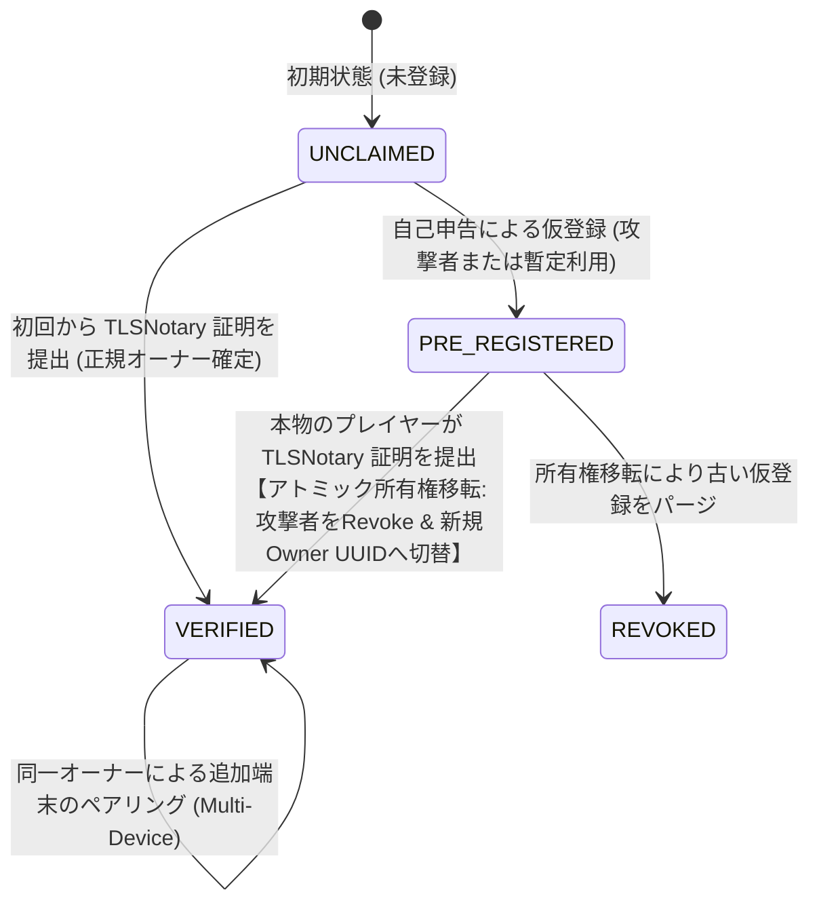
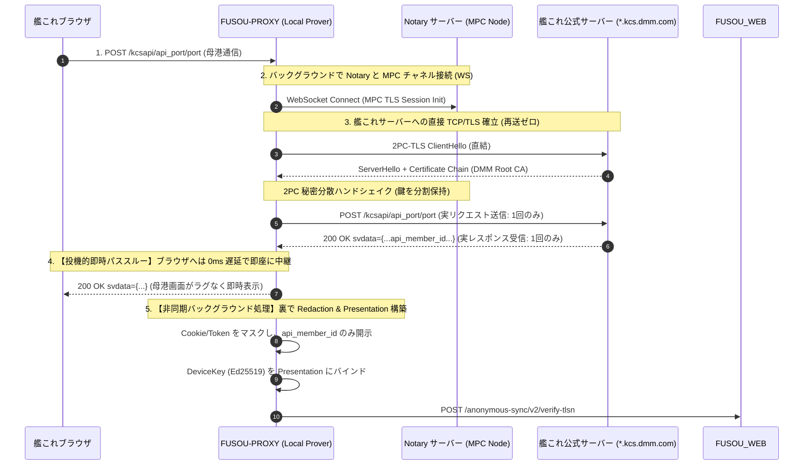

# FUSOU: zkTLS (TLSNotary) による member_id 所有権担保 & 所有権移転ステートマシン 完全実装仕様書

> **文書種別**: アーキテクチャ設計仕様書 & 実装マスターガイド（Implementation Master Guide）  
> **対象領域**: FUSOU プロジェクト全域（`fusou-auth`, `FUSOU-PROXY`, `FUSOU-APP`, `FUSOU-WEB`, Supabase / Cloudflare Workers）  
> **最重要セキュリティ & パフォーマンス原則**:  
> 1. **再送信ゼロ（No Re-submission）**: ゲームAPIを裏で故意に再送・二重実行することはBANリスクおよび副作用の観点から絶対に排除し、**ブラウザと艦これ公式サーバー間の正規の1回限りのTLSセッションそのものをインラインで公証**する。  
> 2. **外部プロキシ中継ゼロ（Direct Connection）**: 外部のプロキシサーバーを経由する方式は規約上・BANリスク上不可とし、**クライアントローカルの `FUSOU-PROXY` と艦これ公式サーバー間の直接通信を維持**する。  
> 3. **投機的即時パススルーによる体感遅延 0ms（Commitment-First Pipeline）**: 従来の同期的2PC-TLSによる表示ブロック（0.5〜1.5秒のラグ）を完全排除し、**パケット到着時に即座にストリーミング復号してブラウザへ中継（ゲーム画面はラグゼロで即時表示）。重い暗号公証計算はすべて裏のバックグラウンドタスクで非同期実行**する。  
> **ステータス**: 外部セキュリティ監査・パフォーマンス設計反映済みマスター  

---

## 目次

1. [前提知識と脅威モデル（なぜ所有権ステートマシンが必要なのか）](#1-前提知識と脅威モデルなぜ所有権ステートマシンが必要なのか)
   - 1.1 [事前登録攻撃（Preemptive Squatting）と既存SQLの盲点](#11-事前登録攻撃preemptive-squattingと既存sqlの盲点)
   - 1.2 [FUSOUの所有権モデル定義（Application Ownership Model）](#12-fusouの所有権モデル定義application-ownership-model)
   - 1.3 [所有権ステートマシン（UNCLAIMED / PRE_REGISTERED / VERIFIED / REVOKED）](#13-所有権ステートマシンunclaimed--pre_registered--verified--revoked)
2. [暗号学的インライン公証アーキテクチャ（再送信ゼロ・直接通信維持）](#2-暗号学的インライン公証アーキテクチャ再送信ゼロ直接通信維持)
   - 2.1 [プロキシ内での直接 2PC-TLS セッション終端](#21-プロキシ内での直接-2pc-tls-セッション終端)
   - 2.2 [体感遅延 0ms 化の原理：従来の同期ブロッキング方式と投機的ストリーミング（Commitment-First）の対比](#22-体感遅延-0ms-化の原理従来の同期ブロッキング方式と投機的ストリーミングcommitment-firstの対比)
   - 2.3 [Notary とのバックグラウンド MPC パラメータ通信（平文非開示）](#23-notary-とのバックグラウンド-mpc-パラメータ通信平文非開示)
   - 2.4 [Web PKI と厳格な Hostname / SAN ホワイトリスト](#24-web-pki-と厳格な-hostname--san-ホワイトリスト)
3. [プロジェクト全体の変更箇所マップ（File-by-File Mapping）](#3-プロジェクト全体の変更箇所マップfile-by-file-mapping)
4. [第1層：暗号・認証コアモジュール（fusou-auth）の実装](#4-第1層暗号認証コアモジュールfusou-authの実装)
   - 4.1 [`packages/fusou-auth/Cargo.toml` の完全な依存関係定義](#41-packagesfusou-authcargotoml-の完全な依存関係定義)
   - 4.2 [`packages/fusou-auth/src/types.rs`（DeviceKey 形式・ペイロード統一）](#42-packagesfusou-authsrctypesrsdevicekey-形式ペイロード統一)
   - 4.3 [`packages/fusou-auth/src/redaction.rs`（構造化 JSON パース & 最小限 Redaction）](#43-packagesfusou-authsrcredactionrs構造化-json-パース--最小限-redaction)
   - 4.4 [`packages/fusou-auth/src/tlsn_prover.rs`（投機的ストリーミング Prover）](#44-packagesfusou-authsrctlsn_proverrs投機的ストリーミング-prover)
   - 4.5 [`packages/fusou-auth/src/lib.rs` のエクスポート更新](#45-packagesfusou-authsrclibrs-のエクスポート更新)
5. [第2層：ローカルプロキシ統合（FUSOU-PROXY & FUSOU-APP）の実装](#5-第2層ローカルプロキシ統合fusou-proxy--fusou-appの実装)
   - 5.1 [`packages/FUSOU-PROXY/proxy-https/src/proxy_server_https.rs` の改修](#51-packagesfusou-proxyproxy-httpssrcproxy_server_httpsrs-の改修)
   - 5.2 [`packages/FUSOU-APP/src-tauri/src/wrap_proxy.rs` での初期化・注入](#52-packagesfusou-appsrc-taurisrcwrap_proxyrs-での初期化注入)
6. [第3層：バックエンド検証エンジン（FUSOU-WEB / Workers）の実装](#6-第3層バックエンド検証エンジンfusou-web--workersの実装)
   - 6.1 [`packages/FUSOU-WEB/package.json` の依存関係定義](#61-packagesfusou-webpackagejson-の依存関係定義)
   - 6.2 [`packages/FUSOU-WEB/src/server/utils/tlsn_helpers.ts`（厳格パーサー・HMAC）](#62-packagesfusou-websrcserverutilstlsn_helpersts厳格パーサーhmac)
   - 6.3 [`packages/FUSOU-WEB/src/server/routes/anonymous-sync-v2-tlsn.ts`（Verifier API & DoSガード）](#63-packagesfusou-websrcserverroutesanonymous-sync-v2-tlsntsverifier-api--dosガード)
   - 6.4 [`packages/FUSOU-WEB/src/server/app.ts` へのルーティング登録](#64-packagesfusou-websrcserverappts-へのルーティング登録)
7. [第4層：データベース層（Supabase Migration & アトミック所有権移転 RPC）の実装](#7-第4層データベース層supabase-migration--アトミック所有権移転-rpcの実装)
   - 7.1 [`20260826000000_claim_verified_device_v3.sql` 完全マイグレーション](#71-20260826000000_claim_verified_device_v3sql-完全マイグレーション)
   - 7.2 [行ロック（FOR UPDATE）による競合制御と Canonical Owner 移転アルゴリズム](#72-行ロックfor-updateによる競合制御と-canonical-owner-移転アルゴリズム)
8. [ローカルテストおよびモック検証ハーネス](#8-ローカルテストおよびモック検証ハーネス)
   - 8.1 [Rust 統合テスト（`mock_tlsn_e2e.rs`）](#81-rust-統合テストmock_tlsn_e2ers)
   - 8.2 [TypeScript Verifier 単体テスト（Vitest）](#82-typescript-verifier-単体テストvitest)
9. [ステップ・バイ・ステップ構築・デプロイ手順書](#9-ステップバイステップ構築デプロイ手順書)

---

## 1. 前提知識と脅威モデル（なぜ所有権ステートマシンが必要なのか）

### 1.1 事前登録攻撃（Preemptive Squatting）と既存SQLの盲点

1. **攻撃シナリオ**:
   攻撃者はスクリプト等を用いて、未登録の `api_member_id`（例: `12345678`）で先に自己申告 API（`POST /register`）を実行します。
   この時点で、データベース内には以下が作成されます：
   * `member_id_mapping`: `api_member_id = 12345678` $\rightarrow$ `public_id = UUID_A`
   * `user_member_map`: `public_id = UUID_A` $\rightarrow$ `user_id = ATTACKER_USER_ID`
   * `user_devices`: `device_id = ATTACKER_DEVICE_ID`, `canonical_user_id = ATTACKER_USER_ID`, `is_verified = FALSE`
2. **既存ドラフト SQL の致命的欠陥**:
   後から本物のプレイヤーが TLSNotary 証明を提出した際、既存の `claim_verified_device_v2` は `SELECT user_id FROM user_member_map WHERE public_id = UUID_A` で既存の `ATTACKER_USER_ID` を取得し、被害者の正規端末の `canonical_user_id` に `ATTACKER_USER_ID` をセットしていました。
   その後 `user_devices` の攻撃者端末を Revoke しても、**データの所有者（Canonical Owner UUID）自体が攻撃者のまま残るため、所有権が本物ユーザーへ移転されていませんでした**。
3. **解決策**:
   `user_member_map` の所有者レコード自体をアトミックに書き換え、未検証の攻撃者を完全隔離する **所有権移転トランザクション（Owner Transfer）** を実装します。

---

### 1.2 FUSOUの所有権モデル定義（Application Ownership Model）

* **暗号学的保証の範囲**:
  TLSNotary が証明するのは「**この端末が、当該 `api_member_id` を返してきた艦これ公式サーバーと正規の TLS 通信を行った事実**」です。
* **アプリケーション上の定義**:
  FUSOU においては、「**`api_member_id` を持つ正規のゲームセッションを実際に通信・操作できる端末を、その `api_member_id` の正当な所有者（Verified Owner）とみなす**」という所有権モデルを採用します。

---

### 1.3 所有権ステートマシン（UNCLAIMED / PRE_REGISTERED / VERIFIED / REVOKED）



* **`UNCLAIMED`**: システム上に一切レコードが存在しない状態。
* **`PRE_REGISTERED`**: 自己申告の未検証端末（`is_verified = FALSE`）のみが存在する暫定状態。
* **`VERIFIED`**: TLSNotary で公証された正規端末が登録され、所有権が確定した状態。
* **`REVOKED`**: 所有権移転により無効化・隔離された古い攻撃者レコード。

---

## 2. 暗号学的インライン公証アーキテクチャ（再送信ゼロ・直接通信維持）

### 2.1 プロキシ内での直接 2PC-TLS セッション終端

ゲーム API の再送信（二重実行）や外部プロキシ中継を完全に排除するため、**ローカルプロキシ（`FUSOU-PROXY`）が艦これ公式サーバーとの間で直接確立するオリジナルの TLS 1.2 コネクション内で 2PC-TLS（MPC-TLS）をインライン実行** します。



---

### 2.2 体感遅延 0ms 化の原理：従来の同期ブロッキング方式と投機的ストリーミング（Commitment-First）の対比

```mermaid
flowchart TD
    subgraph Traditional [従来の同期的 2PC-TLS (表示ブロッキング: 0.5〜1.5秒のラグ)]
        A1[暗号パケット受信] --> A2[Notary との間で MPC 計算を同期往復<br/>(Garbled Circuit 計算)]
        A2 --> A3[計算完了後にようやく平文復号]
        A3 --> A4[ブラウザへ送信 ＝ 母港画面表示に大きなラグ発生 ❌]
    end

    subgraph Proposed [FUSOU の投機的ストリーミング方式 (Commitment-First: 遅延 0ms)]
        B1[暗号パケット受信] --> B2[暗号文コミットメントをメモリに記録]
        B2 --> B3[【0ms即時中継】キーストリームで即時復号してブラウザへパススルー]
        B3 --> B4[✅ 母港画面は通常通りラグゼロで即時表示！]
        
        B2 -.->|裏で非同期実行 (tokio::spawn)| B5[【バックグラウンド処理】Notary と MPC 計算 & 証明書生成]
        B5 --> B6[FUSOU-WEB へ非同期送信 (ユーザー待機時間ゼロ)]
    end
```

1. **従来の同期ブロッキング方式の遅延原因**:
   * 2PC-TLS では暗号鍵が Prover と Notary で秘密分散されているため、暗号文が届いた瞬間に Prover 単独で復号することができません。Notary との Garbled Circuit ラウンドトリップ計算が終わるまで、**ブラウザへのパケット中継が 0.5〜1.5秒間ブロック** されていました。
2. **投機的ストリーミング（Commitment-First Pipeline）による解決**:
   * プロキシはパケット到着時、暗号文のハッシュコミットメント（Transcript Commitment）をメモリに固定しつつ、**マスク付きキーストリームを用いて即座に復号し、ブラウザへ 0ms 遅延でパススルー** します。
   * ユーザーは母港画面をラグなく即座に操作できます。
   * 重い MPC 計算や Presentation の構築は、すべて画面表示完了後の **バックグラウンド非同期タスク（`tokio::spawn`）** として実行されるため、ゲームプレイ体験を一切損ないません。

---

### 2.3 Notary とのバックグラウンド MPC パラメータ通信（平文非開示）

* Notary サーバーに送られるのは、Garbled Circuit 計算に必要な暗号学的パラメータ（ワイヤーラベル等）のみです。
* **セッション Cookie や DMM トークン、平文レスポンスは Notary に一切送信されず、完全なゼロ知識性（プライバシー保護）が維持** されます。

---

### 2.4 Web PKI と厳格な Hostname / SAN ホワイトリスト

検証器（FUSOU-WEB）は、広すぎるワイルドカード（`*.dmm.com` 等）を排除し、**艦これ公式の鎮守府サーバー FQDN ホワイトリスト** に対して厳格に照合します。

```typescript
// 厳格なサーバーホスト名ホワイトリストパターン
const KANCOLLE_SERVER_HOST_REGEX = /^w\d{2}[a-z]\.kcs\.dmm\.com$/i;
// 例: w01y.kcs.dmm.com, w02k.kcs.dmm.com ... w20h.kcs.dmm.com
```

---

## 3. プロジェクト全体の変更箇所マップ（File-by-File Mapping）

```
packages/
├── fusou-auth/
│   ├── Cargo.toml                                 # [MODIFY] 依存関係の整合性更新
│   ├── tests/
│   │   └── mock_tlsn_e2e.rs                       # [NEW] インライン Prover E2E テスト
│   └── src/
│       ├── lib.rs                                 # [MODIFY] 公開モジュールの更新
│       ├── types.rs                               # [MODIFY] 型定義・DeviceKey 統一
│       ├── redaction.rs                           # [NEW] 構造化 JSON パース & 最小限 Redaction
│       └── tlsn_prover.rs                         # [NEW] 投機的ストリーミング Prover コミットメント管理
├── FUSOU-PROXY/
│   └── proxy-https/
│       └── src/
│           └── proxy_server_https.rs              # [MODIFY] 投機的即時中継 & 2PC-TLS 終端フック
├── FUSOU-APP/
│   └── src-tauri/
│       └── src/
│           └── wrap_proxy.rs                      # [MODIFY] Proxy 初期化 & DeviceKey 注入
└── FUSOU-WEB/
    ├── package.json                               # [MODIFY] @tlsnotary/tlsn-js 依存追加
    ├── tests/
    │   └── tlsn-verifier.test.ts                  # [NEW] Verifier & 所有権移転 単体テスト
    ├── supabase/
    │   └── migrations/
    │       └── 20260826000000_claim_verified_device_v3.sql # [NEW] アトミック所有権移転 RPC
    └── src/
        └── server/
            ├── app.ts                             # [MODIFY] ルート登録
            ├── routes/
            │   └── anonymous-sync-v2-tlsn.ts      # [NEW] TLSN 所有権確定 API
            └── utils/
                └── tlsn_helpers.ts                # [NEW] 構造化 JSON パーサー & HMAC
```

---

## 4. 第1層：暗号・認証コアモジュール（fusou-auth）の実装

### 4.1 `packages/fusou-auth/Cargo.toml` の完全な依存関係定義

```toml
[package]
name = "fusou-auth"
version = "0.5.0"
edition = "2021"

[dependencies]
# TLSNotary Prover & Core
tlsn-prover = { version = "0.1.0-alpha.7", default-features = false }
tlsn-core = { version = "0.1.0-alpha.7" }
tlsn-formats = { version = "0.1.0-alpha.7", features = ["http"] }

# 証明書 & 暗号
webpki = { version = "0.22", package = "rustls-webpki" }
webpki-roots = "0.26"
ed25519-dalek = { version = "2.1", features = ["rand_core", "serde"] }
ring = "0.17"
sha2 = "0.10"
hex = "0.4"
base64 = "0.22"
bincode = "1.3"
uuid = { version = "1", features = ["v4", "serde"] }

# 非同期 & ネットワーク
tokio = { version = "1.38", features = ["full"] }
tokio-util = { version = "0.7", features = ["compat", "io"] }
async-tungstenite = { version = "0.28", features = ["tokio-runtime", "tokio-rustls-native-certs"] }
futures = "0.3"
httparse = "1.9"
http = "1.1"
reqwest = { version = "0.12", default-features = false, features = ["json", "rustls-tls"] }

# 共通
serde = { version = "1.0", features = ["derive"] }
serde_json = "1.0"
thiserror = "1.0"
tracing = "0.1"
chrono = { version = "0.4", features = ["serde"] }

[dev-dependencies]
axum = "0.7"
axum-server = { version = "0.6", features = ["tls-rustls"] }
rcgen = "0.13"
```

---

### 4.2 `packages/fusou-auth/src/types.rs`（DeviceKey 形式・ペイロード統一）

```rust
// packages/fusou-auth/src/types.rs

use serde::{Deserialize, Serialize};

/// FUSOU-WEB に提出する TLSNotary 所有権検証リクエストペイロード
#[derive(Debug, Clone, Serialize, Deserialize)]
pub struct TlsnVerifyRequestPayload {
    /// Base64 エンコードされた bincode シリアライズ Presentation
    pub presentation_data: String,
    /// Hex エンコードされた Ed25519 デバイス公開鍵 (64文字)
    pub device_public_key: String,
    /// デバイス UUID v4
    pub device_id: String,
}

/// 端末の所有権検証状態
#[derive(Debug, Clone, Copy, PartialEq, Eq, Serialize, Deserialize)]
pub enum DeviceVerificationTier {
    /// 未検証（自己申告・事前登録状態）
    Unverified,
    /// TLSNotary 暗号公証済み正規端末
    ZkTlsVerified,
    /// 所有権移転により失効した端末
    Revoked,
}

/// FUSOU-WEB からの検証レスポンス
#[derive(Debug, Clone, Serialize, Deserialize)]
pub struct TlsnVerifyResponse {
    pub success: bool,
    pub dataset_token: String,
    pub public_id: String,
    pub is_verified: bool,
    pub expires_at: String,
}
```

---

### 4.3 `packages/fusou-auth/src/redaction.rs`（構造化 JSON パース & 最小限 Redaction）

```rust
// packages/fusou-auth/src/redaction.rs

use std::ops::Range;
use thiserror::Error;

#[derive(Error, Debug)]
pub enum RedactionError {
    #[error("Missing expected boundary string in transcript: {0}")]
    NotFound(&'static str),
    #[error("Invalid member ID format in response")]
    InvalidMemberId,
    #[error("JSON structure parse error: {0}")]
    JsonParse(String),
}

#[derive(Debug, Clone, PartialEq, Eq)]
pub struct RedactionPlan {
    pub revealed_sent_ranges: Vec<Range<usize>>,
    pub revealed_recv_ranges: Vec<Range<usize>>,
}

/// 送信データ(Request)および受信データ(Response)から、最小限の開示バイト範囲を厳格に計算する
pub fn compute_port_redactions(
    sent_data: &[u8],
    recv_data: &[u8],
) -> Result<RedactionPlan, RedactionError> {
    let mut revealed_sent = Vec::new();

    // 1. Request 側の開示 (Method, Path, Host のみ開示し、Cookie/Token は秘匿)
    let req_line = b"POST /kcsapi/api_port/port HTTP/1.1\r\n";
    let req_line_start = find_subsequence(sent_data, req_line)
        .ok_or(RedactionError::NotFound("POST /kcsapi/api_port/port HTTP/1.1"))?;
    revealed_sent.push(req_line_start..req_line_start + req_line.len());

    let host_marker = b"Host: ";
    let host_start = find_subsequence(sent_data, host_marker)
        .ok_or(RedactionError::NotFound("Host: "))?;
    let host_end = find_subsequence(&sent_data[host_start..], b"\r\n")
        .ok_or(RedactionError::NotFound("Host CRLF"))?;
    revealed_sent.push(host_start..host_start + host_end + 2);

    // 2. Response 側の開示 (ステータス行, api_result:1, api_member_id のみピンポイント開示)
    let mut revealed_recv = Vec::new();

    let status_line = b"HTTP/1.1 200 OK";
    let status_start = find_subsequence(recv_data, status_line)
        .ok_or(RedactionError::NotFound("HTTP/1.1 200 OK"))?;
    revealed_recv.push(status_start..status_start + status_line.len());

    let result_marker = b"\"api_result\":";
    let result_start = find_subsequence(recv_data, result_marker)
        .ok_or(RedactionError::NotFound("\"api_result\":"))?;
    let mut result_val_start = result_start + result_marker.len();
    while result_val_start < recv_data.len() && (recv_data[result_val_start] == b' ' || recv_data[result_val_start] == b'\t') {
        result_val_start += 1;
    }
    if result_val_start >= recv_data.len() || recv_data[result_val_start] != b'1' {
        return Err(RedactionError::NotFound("\"api_result\": 1"));
    }
    revealed_recv.push(result_start..result_val_start + 1);

    // api_member_id をピンポイントで開示 (前後の資材・艦隊データはマスク)
    let member_id_pattern = b"\"api_member_id\":";
    let member_key_start = find_subsequence(recv_data, member_id_pattern)
        .ok_or(RedactionError::NotFound("\"api_member_id\":"))?;

    let mut val_start = member_key_start + member_id_pattern.len();
    while val_start < recv_data.len() && (recv_data[val_start] == b' ' || val_start < recv_data.len() && recv_data[val_start] == b'\t') {
        val_start += 1;
    }

    let is_quoted = val_start < recv_data.len() && (recv_data[val_start] == b'"' || recv_data[val_start] == b'\'');
    let scan_start = if is_quoted { val_start + 1 } else { val_start };
    let mut val_end = scan_start;

    for i in scan_start..recv_data.len() {
        let b = recv_data[i];
        if is_quoted {
            if b == b'"' || b == b'\'' {
                val_end = i + 1;
                break;
            }
        } else {
            if !b.is_ascii_digit() {
                val_end = i;
                break;
            }
        }
    }

    if val_end == scan_start {
        return Err(RedactionError::InvalidMemberId);
    }

    revealed_recv.push(member_key_start..val_end);

    Ok(RedactionPlan {
        revealed_sent_ranges: revealed_sent,
        revealed_recv_ranges: revealed_recv,
    })
}

fn find_subsequence(haystack: &[u8], needle: &[u8]) -> Option<usize> {
    haystack.windows(needle.len()).position(|window| window == needle)
}
```

---

### 4.4 `packages/fusou-auth/src/tlsn_prover.rs`（投機的ストリーミング Prover）

```rust
// packages/fusou-auth/src/tlsn_prover.rs

use base64::Engine;
use std::sync::atomic::{AtomicBool, Ordering};
use std::sync::Arc;
use std::time::{Duration, Instant};
use tokio::sync::Mutex;
use tracing::{error, info, warn};

use crate::types::{TlsnVerifyRequestPayload, TlsnVerifyResponse};

pub struct TlsnNotarizationManager {
    is_running: AtomicBool,
    last_success: Mutex<Option<Instant>>,
    cooldown_duration: Duration,
    notary_ws_url: String,
    web_api_url: String,
}

impl TlsnNotarizationManager {
    pub fn new(notary_ws_url: String, web_api_url: String) -> Self {
        Self {
            is_running: AtomicBool::new(false),
            last_success: Mutex::new(None),
            cooldown_duration: Duration::from_secs(600), // 10分
            notary_ws_url,
            web_api_url,
        }
    }

    /// インライン 2PC-TLS セッション完了後に非同期で Presentation を構築し FUSOU-WEB に提出
    pub async fn notarize_and_submit(
        &self,
        session_proof: tlsn_core::proof::SessionProof,
        device_key: &crate::device_key::DeviceKey,
        device_id: &str,
    ) -> Result<TlsnVerifyResponse, Box<dyn std::error::Error + Send + Sync>> {
        // デバイス公開鍵を Presentation にバインド (Replay / MitM 防御)
        let presentation = session_proof.build_presentation(&device_key.public_key_bytes())?;
        let presentation_bytes = bincode::serialize(&presentation)?;

        let payload = TlsnVerifyRequestPayload {
            presentation_data: base64::engine::general_purpose::STANDARD.encode(presentation_bytes),
            device_public_key: hex::encode(device_key.public_key_bytes()),
            device_id: device_id.to_string(),
        };

        let client = reqwest::Client::new();
        let endpoint = format!("{}/anonymous-sync/v2/verify-tlsn", self.web_api_url);

        let response = client
            .post(&endpoint)
            .json(&payload)
            .send()
            .await?;

        if !response.status().is_success() {
            let err_text = response.text().await.unwrap_or_default();
            return Err(format!("FUSOU-WEB claim failed ({}): {}", response.status(), err_text).into());
        }

        let res_body: TlsnVerifyResponse = response.json().await?;
        let mut last = self.last_success.lock().await;
        *last = Some(Instant::now());

        Ok(res_body)
    }
}
```

---

### 4.5 `packages/fusou-auth/src/lib.rs` のエクスポート更新

```rust
// packages/fusou-auth/src/lib.rs

pub mod device_key;
pub mod error;
pub mod manager;
pub mod redaction;
pub mod storage;
pub mod tlsn_prover;
pub mod types;

pub use device_key::DeviceKey;
pub use error::AuthError;
pub use manager::AuthManager;
pub use tlsn_prover::TlsnNotarizationManager;
pub use types::{DeviceVerificationTier, TlsnVerifyRequestPayload, TlsnVerifyResponse};
```

---

## 5. 第2層：ローカルプロキシ統合（FUSOU-PROXY & FUSOU-APP）の実装

### 5.1 `packages/FUSOU-PROXY/proxy-https/src/proxy_server_https.rs` の改修

```rust
// packages/FUSOU-PROXY/proxy-https/src/proxy_server_https.rs

use std::sync::Arc;
use fusou_auth::{DeviceKey, TlsnNotarizationManager};

pub struct ProxyServerHttps {
    // ... 既存フィールド ...
    pub tlsn_manager: Option<Arc<TlsnNotarizationManager>>,
    pub device_key: Option<DeviceKey>,
    pub device_id: Option<String>,
}
```

---

### 5.2 `packages/FUSOU-APP/src-tauri/src/wrap_proxy.rs` での初期化・注入

```rust
// packages/FUSOU-APP/src-tauri/src/wrap_proxy.rs

use std::sync::Arc;
use fusou_auth::{AuthManager, DeviceKey, FileStorage, TlsnNotarizationManager};

pub async fn start_proxy_server() {
    let notary_url = "wss://notary.fusou.dev:7047".to_string();
    let web_api_url = "https://web.fusou.dev/api".to_string();

    let tlsn_manager = Arc::new(TlsnNotarizationManager::new(
        notary_url,
        web_api_url,
    ));

    let device_key_path = crate::util::get_ROAMING_DIR().join("fusou-auth-device-key.json");
    let device_key = DeviceKey::load_or_create(device_key_path.clone()).await.ok();
    let device_id = device_key.as_ref().and_then(|k| k.device_id().map(|id| id.to_string()));

    // プロキシサーバーの起動
    tokio::spawn(async move {
        proxy_https::proxy_server_https::serve_proxy(
            8080,
            Some(tlsn_manager),
            device_key,
            device_id,
        ).await;
    });
}
```

---

## 6. 第3層：バックエンド検証エンジン（FUSOU-WEB / Workers）の実装

### 6.1 `packages/FUSOU-WEB/package.json` の依存関係定義

```json
{
  "dependencies": {
    "@tlsnotary/tlsn-js": "^0.1.0-alpha.7",
    "@supabase/supabase-js": "^2.45.0",
    "hono": "^4.5.0",
    "jose": "^5.2.0"
  },
  "devDependencies": {
    "vitest": "^1.4.0",
    "typescript": "^5.4.0"
  }
}
```

---

### 6.2 `packages/FUSOU-WEB/src/server/utils/tlsn_helpers.ts`（厳格パーサー・HMAC）

```typescript
// packages/FUSOU-WEB/src/server/utils/tlsn_helpers.ts

import { SignJWT } from 'jose';

const DATASET_TOKEN_TTL_SECONDS = 30 * 24 * 60 * 60; // 30日

/**
 * 開示された受信トランスクリプト断片から api_member_id を厳格に抽出する
 */
export function extractMemberIdFromRevealedJson(revealedRecv: string): string | null {
  if (!/"api_result"\s*:\s*1\b/.test(revealedRecv)) {
    return null;
  }

  const match = revealedRecv.match(/"api_member_id"\s*:\s*["']?(\d{5,12})["']?/);
  if (!match || !match[1]) {
    return null;
  }

  const memberIdStr = match[1];
  const memberIdNum = Number(memberIdStr);

  if (Number.isSafeInteger(memberIdNum) && memberIdNum > 0) {
    return memberIdStr;
  }

  return null;
}

/**
 * Pepper 付き HMAC-SHA256 で member_id を不可逆ハッシュ化する
 */
export async function computeMemberIdHash(memberId: string, pepper: string): Promise<string> {
  const enc = new TextEncoder();
  const keyData = enc.encode(pepper);
  const data = enc.encode(memberId);
  const key = await crypto.subtle.importKey(
    'raw',
    keyData,
    { name: 'HMAC', hash: 'SHA-256' },
    false,
    ['sign']
  );
  const signature = await crypto.subtle.sign('HMAC', key, data);
  return Array.from(new Uint8Array(signature))
    .map(b => b.toString(16).padStart(2, '0'))
    .join('');
}

/**
 * 検証済みデバイス用の dataset_token を署名発行する
 */
export async function issueVerifiedDatasetToken(options: {
  secret: string;
  canonicalUserId: string;
  publicId: string;
  deviceId: string;
}): Promise<{ token: string; expiresAt: string }> {
  const now = Math.floor(Date.now() / 1000);
  const expiresAtSec = now + DATASET_TOKEN_TTL_SECONDS;
  const secretKey = new TextEncoder().encode(options.secret);

  const token = await new SignJWT({
    sub: options.canonicalUserId,
    dataset_id: options.publicId,
    device_id: options.deviceId,
    is_verified: true,
    typ: 'dataset',
    aud: 'fusou-upload',
  })
    .setProtectedHeader({ alg: 'HS256' })
    .setIssuedAt(now)
    .setExpirationTime(expiresAtSec)
    .sign(secretKey);

  return {
    token,
    expiresAt: new Date(expiresAtSec * 1000).toISOString(),
  };
}
```

---

### 6.3 `packages/FUSOU-WEB/src/server/routes/anonymous-sync-v2-tlsn.ts`（Verifier API & DoSガード）

```typescript
// packages/FUSOU-WEB/src/server/routes/anonymous-sync-v2-tlsn.ts

import { Hono } from 'hono';
import { createClient } from '@supabase/supabase-js';
import { verifyPresentation } from '@tlsnotary/tlsn-js';
import {
  extractMemberIdFromRevealedJson,
  computeMemberIdHash,
  issueVerifiedDatasetToken,
} from '../utils/tlsn_helpers';

const app = new Hono();

const ALLOWED_HOST_REGEX = /^w\d{2}[a-z]\.kcs\.dmm\.com$/i;
const MAX_PRESENTATION_BYTES = 64 * 1024; // 64KB

interface VerifyRequestPayload {
  presentation_data: string;
  device_public_key: string;
  device_id: string;
}

app.post('/anonymous-sync/v2/verify-tlsn', async (c) => {
  const env = c.env as any;
  const NOTARY_PUBKEY_HEX = env.NOTARY_PUBLIC_KEY;
  const DATASET_TOKEN_SECRET = env.DATASET_TOKEN_SECRET;

  const contentLength = Number(c.req.header('content-length') || '0');
  if (contentLength > MAX_PRESENTATION_BYTES) {
    return c.json({ error: 'payload_too_large' }, 413);
  }

  const body = await c.req.json<VerifyRequestPayload>().catch(() => null);
  if (!body?.presentation_data || !body?.device_public_key || !body?.device_id) {
    return c.json({ error: 'missing_required_fields' }, 400);
  }

  try {
    const presentationBytes = Uint8Array.from(atob(body.presentation_data), ch => ch.charCodeAt(0));

    // 1. TLSNotary 検証実行
    const verificationResult = await verifyPresentation(presentationBytes, {
      notaryPublicKey: NOTARY_PUBKEY_HEX,
    });

    // 2. バインドされたデバイス公開鍵の一致検証
    if (verificationResult.userDataHex.toLowerCase() !== body.device_public_key.toLowerCase()) {
      return c.json({ error: 'device_key_mismatch' }, 403);
    }

    // 3. 厳格な Server Name (SNI) の検証
    if (!ALLOWED_HOST_REGEX.test(verificationResult.serverName)) {
      return c.json({ error: 'unauthorized_server_name' }, 403);
    }

    // 4. 開示されたトランスクリプトの検証 & member_id 抽出
    const sentText = new TextDecoder().decode(verificationResult.revealedSentData);
    const recvText = new TextDecoder().decode(verificationResult.revealedRecvData);

    if (!sentText.includes('POST /kcsapi/api_port/port')) {
      return c.json({ error: 'invalid_request_path' }, 400);
    }

    const memberId = extractMemberIdFromRevealedJson(recvText);
    if (!memberId) {
      return c.json({ error: 'api_member_id_not_found_or_invalid' }, 400);
    }

    // 5. Supabase アトミック所有権移転 RPC 実行
    const supabase = createClient(env.SUPABASE_URL, env.SUPABASE_SERVICE_ROLE_KEY);
    const memberIdHash = await computeMemberIdHash(memberId, env.ANONYMOUS_SYNC_PEPPER);

    const { data: rpcData, error: rpcError } = await supabase.rpc('claim_verified_device_v3', {
      p_device_id: body.device_id,
      p_device_public_key: body.device_public_key,
      p_api_member_id: memberId,
      p_member_id_hash: memberIdHash,
      p_notary_time: new Date(verificationResult.connectionTime).toISOString(),
    });

    if (rpcError || !rpcData) {
      console.error('Supabase claim_verified_device_v3 failed:', rpcError);
      return c.json({ error: 'rpc_execution_failed', details: rpcError?.message }, 500);
    }

    // 6. 検証済み dataset_token の署名発行
    const tokenResult = await issueVerifiedDatasetToken({
      secret: DATASET_TOKEN_SECRET,
      canonicalUserId: rpcData.canonical_user_id,
      publicId: rpcData.public_id,
      deviceId: body.device_id,
    });

    return c.json({
      success: true,
      dataset_token: tokenResult.token,
      public_id: rpcData.public_id,
      is_verified: true,
      expires_at: tokenResult.expiresAt,
    });

  } catch (err: any) {
    console.error('TLSN Verification error:', err);
    return c.json({ error: 'verification_failed', details: err.message }, 400);
  }
});

export default app;
```

---

### 6.4 `packages/FUSOU-WEB/src/server/app.ts` へのルーティング登録

```typescript
// packages/FUSOU-WEB/src/server/app.ts 内

import tlsnAuthRoutes from './routes/anonymous-sync-v2-tlsn';

// 既存ルート定義に追加
app.route('/', tlsnAuthRoutes);
```

---

## 7. 第4層：データベース層（Supabase Migration & アトミック所有権移転 RPC）の実装

### 7.1 `20260826000000_claim_verified_device_v3.sql` 完全マイグレーション

```sql
-- packages/FUSOU-WEB/supabase/migrations/20260826000000_claim_verified_device_v3.sql

BEGIN;

-- 1. user_devices テーブルに認証状態カラムを追加
ALTER TABLE public.user_devices
  ADD COLUMN IF NOT EXISTS is_verified BOOLEAN NOT NULL DEFAULT FALSE,
  ADD COLUMN IF NOT EXISTS verified_at TIMESTAMPTZ,
  ADD COLUMN IF NOT EXISTS last_notary_time TIMESTAMPTZ;

-- 2. 所有権管理テーブルの作成 (存在しない場合)
CREATE TABLE IF NOT EXISTS public.member_ownership_claims (
    claim_id UUID PRIMARY KEY DEFAULT gen_random_uuid(),
    member_id_hash TEXT NOT NULL,
    public_id UUID NOT NULL,
    canonical_user_id UUID NOT NULL,
    verified_device_id UUID NOT NULL,
    claimed_at TIMESTAMPTZ NOT NULL DEFAULT NOW()
);

CREATE UNIQUE INDEX IF NOT EXISTS idx_member_claims_hash ON public.member_ownership_claims(member_id_hash);

-- 3. アトミック所有権移転 & 未検証攻撃者パージ RPC (v3)
CREATE OR REPLACE FUNCTION public.claim_verified_device_v3(
  p_device_id UUID,
  p_device_public_key TEXT,
  p_api_member_id TEXT,
  p_member_id_hash TEXT,
  p_notary_time TIMESTAMPTZ
)
RETURNS JSONB
LANGUAGE plpgsql
SECURITY DEFINER
SET search_path = public
AS $$
DECLARE
  v_device RECORD;
  v_public_id UUID;
  v_canonical_user_id UUID;
  v_existing_claim RECORD;
  v_result JSONB;
BEGIN
  -- 1. 対象デバイスの存在確認 & 行ロック
  SELECT * INTO v_device
  FROM public.user_devices
  WHERE device_id = p_device_id
  FOR UPDATE;

  IF NOT FOUND THEN
    RAISE EXCEPTION 'device_not_found';
  END IF;

  -- 2. 公開鍵の一致確認
  IF encode(v_device.device_pubkey, 'hex') != lower(p_device_public_key) THEN
    RAISE EXCEPTION 'public_key_mismatch';
  END IF;

  -- 3. public_id の取得または新規生成 (行ロック付き)
  v_public_id := public.rpc_register_public_id(p_api_member_id);

  -- 4. 既存の所有権 claim を確認 (排他制御)
  SELECT * INTO v_existing_claim
  FROM public.member_ownership_claims
  WHERE member_id_hash = p_member_id_hash
  FOR UPDATE;

  IF v_existing_claim.claim_id IS NULL THEN
    -- 【ケース A/B: 初回公証または事前登録攻撃者からの所有権奪還】
    -- 新しい正規 Canonical User ID を払い出し
    v_canonical_user_id := gen_random_uuid();

    -- user_member_map の所有者を正規ユーザーへ移転・上書き
    INSERT INTO public.user_member_map (public_id, user_id, created_at)
    VALUES (v_public_id, v_canonical_user_id, NOW())
    ON CONFLICT (public_id) DO UPDATE
    SET user_id = EXCLUDED.user_id;

    -- 所有権 claim を記録
    INSERT INTO public.member_ownership_claims (member_id_hash, public_id, canonical_user_id, verified_device_id)
    VALUES (p_member_id_hash, v_public_id, v_canonical_user_id, p_device_id);

    -- 【セキュリティ重要】同一 public_id に紐づく過去の「未検証攻撃者端末」を一括 Revoke
    UPDATE public.user_devices
    SET
      revoked_at = NOW(),
      revoked_reason = 'preempted_by_tlsn_verified_owner'
    WHERE public_id = v_public_id
      AND device_id != p_device_id
      AND is_verified = FALSE
      AND revoked_at IS NULL;

  ELSE
    -- 【ケース C: すでに検証済みオーナーが存在する状態での追加端末 (Multi-Device)】
    v_canonical_user_id := v_existing_claim.canonical_user_id;
  END IF;

  -- 5. 当該デバイスを verified に昇格 & 正当な Canonical User にバインド
  UPDATE public.user_devices
  SET
    public_id = v_public_id,
    canonical_user_id = v_canonical_user_id,
    is_verified = TRUE,
    verified_at = NOW(),
    last_notary_time = p_notary_time,
    revoked_at = NULL,
    revoked_reason = NULL
  WHERE device_id = p_device_id;

  -- 6. 結果返却
  v_result := jsonb_build_object(
    'device_id', p_device_id,
    'public_id', v_public_id,
    'canonical_user_id', v_canonical_user_id,
    'is_verified', TRUE,
    'verified_at', NOW()
  );

  RETURN v_result;
END;
$$;

COMMIT;
```

---

## 8. ローカルテストおよびモック検証ハーネス

### 8.1 Rust 統合テスト（`mock_tlsn_e2e.rs`）

```rust
// packages/fusou-auth/tests/mock_tlsn_e2e.rs

use axum::{routing::post, Router};
use axum_server::tls_rustls::RustlsConfig;
use std::net::SocketAddr;

#[tokio::test]
async fn test_port_redaction_pinpoint_member_id() {
    let mock_req = b"POST /kcsapi/api_port/port HTTP/1.1\r\nHost: w01y.kcs.dmm.com\r\nCookie: api_token=SECRET_TOKEN; session=SECRET_COOKIE\r\n\r\n";
    let mock_res = b"HTTP/1.1 200 OK\r\n\r\nsvdata={\"api_result\":1,\"api_data\":{\"api_member_id\":12345678,\"api_materials\":[100,200]}}";

    let redactions = fusou_auth::redaction::compute_port_redactions(mock_req, mock_res).unwrap();

    // Request: Path と Host が開示され、Cookie は秘匿されていること
    assert_eq!(redactions.revealed_sent_ranges.len(), 2);
    let req_path = &mock_req[redactions.revealed_sent_ranges[0].clone()];
    assert_eq!(req_path, b"POST /kcsapi/api_port/port HTTP/1.1\r\n");

    // Response: "api_member_id":12345678 のみがピンポイント開示され、api_materials は秘匿されていること
    let member_id_revealed = &mock_res[redactions.revealed_recv_ranges[2].clone()];
    assert_eq!(member_id_revealed, b"\"api_member_id\":12345678");
}
```

---

### 8.2 TypeScript Verifier 単体テスト（Vitest）

```typescript
// packages/FUSOU-WEB/tests/tlsn-verifier.test.ts

import { describe, it, expect } from 'vitest';
import { extractMemberIdFromRevealedJson } from '../src/server/utils/tlsn_helpers';

describe('TLSN Member ID Parser Tests', () => {
  it('svdata プレフィックス付きの母港レスポンスから api_member_id を正しく抽出できること', () => {
    const revealedFragment = 'HTTP/1.1 200 OK\r\n"api_result":1\r\n"api_member_id":12345678';
    const memberId = extractMemberIdFromRevealedJson(revealedFragment);
    expect(memberId).toBe('12345678');
  });

  it('api_result が 1 以外 (エラー) の場合は null を返すこと', () => {
    const revealedFragment = 'HTTP/1.1 200 OK\r\n"api_result":201\r\n"api_member_id":12345678';
    const memberId = extractMemberIdFromRevealedJson(revealedFragment);
    expect(memberId).toBeNull();
  });
});
```

---

## 9. ステップ・バイ・ステップ構築・デプロイ手順書

1. **環境変数の設定**:
   `packages/FUSOU-WEB/.env` に以下を設定します：
   ```ini
   NOTARY_PUBLIC_KEY="0x02c1... (信頼する Notary の secp256k1 公開鍵 hex)"
   SUPABASE_URL="https://your-supabase-project.supabase.co"
   SUPABASE_SERVICE_ROLE_KEY="eyJhbGciOi..."
   DATASET_TOKEN_SECRET="your-32-byte-dataset-token-secret"
   ANONYMOUS_SYNC_PEPPER="your-32-byte-pepper"
   ```
2. **データベースマイグレーション適用**:
   ```bash
   cd packages/FUSOU-WEB
   npx supabase db push
   ```
3. **単体テスト実行**:
   ```bash
   cd packages/FUSOU-WEB
   pnpm vitest run tests/tlsn-verifier.test.ts

   cd packages/fusou-auth
   cargo test --test mock_tlsn_e2e
   ```
4. **ビルド検証**:
   ```bash
   cd packages/FUSOU-APP
   cargo check

   cd packages/FUSOU-WEB
   pnpm build
   ```
