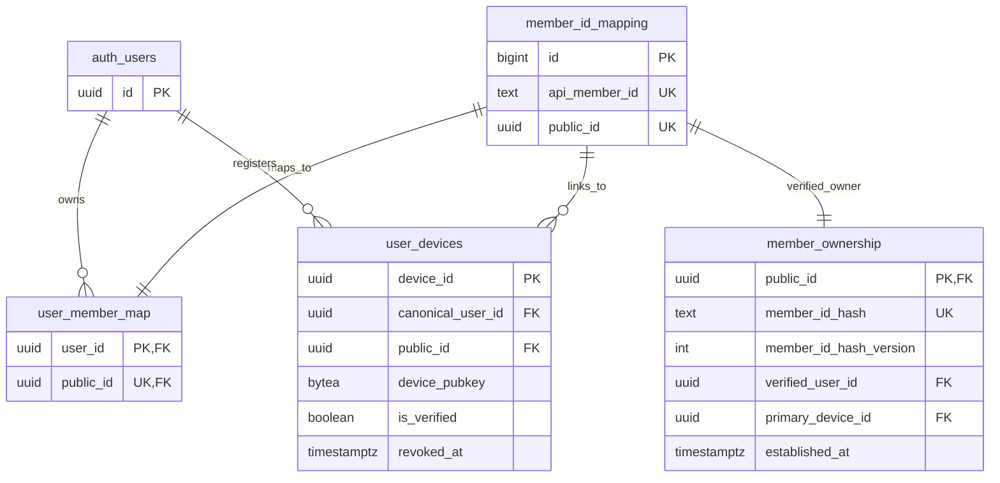
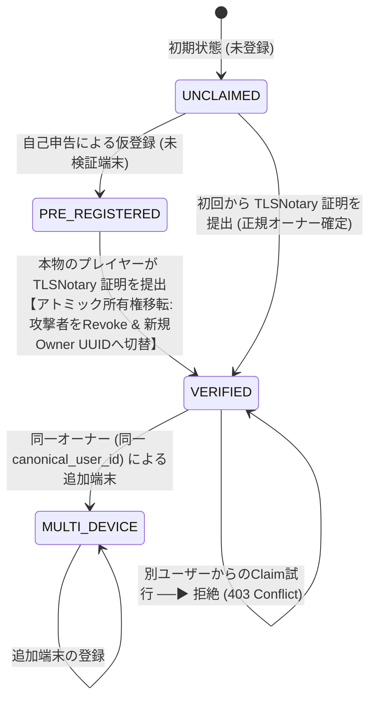

# FUSOU: zkTLS (TLSNotary MPC-TLS) による member_id 所有権担保 & 所有権移転ステートマシン 完全実装仕様書 (v1 Scope)

> **文書種別**: アーキテクチャ設計仕様書 & 実装マスターガイド（Implementation Master Guide）  
> **対象領域**: FUSOU プロジェクト全域（`packages/fusou-auth`, `packages/fusou-proxy-core`, `packages/fusou-proxy-tlsn`, `packages/FUSOU-WEB`, Supabase / Cloudflare Workers / Dedicated Verifier Service）  
> **v1 Security Goal**:  
> **「FUSOU-WEB が採用する `api_member_id` が、本当に信頼対象のゲームサーバーから返された値であることを暗号学的に検証し、事前登録攻撃を完全に無力化する」**  
> 対象 API: **`POST /kcsapi/api_port/port`**  
> 対象データ: **`/api_data/api_member_id`** のみ。  
> **最重要設計原則**:  
> 1. **再送信ゼロ（No Re-submission）**: 母港 API（`api_port/port`）を裏で故意に再送・二重実行することは絶対に排除し、**ブラウザと艦これ公式サーバー間の正規の 1 回限りの TLS セッションそのものを公証**する。  
> 2. **外部ゲーム通信プロキシ中継ゼロ（Direct Connection）**: 外部中継プロキシは規約上・BANリスク上不可とし、**クライアントローカルの `FUSOU-PROXY` と艦これ公式サーバー間の直接通信を維持**する。  
> 3. **Gameplay Path と Evidence Path の二元分離（Proof 完了待ちの完全排除）**: 母港画面の表示（Gameplay Path）のために Proof 完成を待たせない。レスポンス受信時点でブラウザへ即座に中継し、公証（Evidence Path）はバックグラウンドで非同期実行する。  
> 4. **Selective Disclosure（0.5MB レスポンスの最小限開示）**: 500KB に達する母港レスポンス全体を開示せず、TLSNotary の selective disclosure により `/api_data/api_member_id` の Byte Range のみを開示する。  
> 5. **並行 Claim の完全直列化（64-bit Advisory Lock & 親行ロック契約）**:  
>    64-bit Advisory Lock により衝突確率を十分に低減し、同一トランザクション内で必ず行が存在する `member_id_mapping` 親行の `FOR UPDATE` により並行 Claim を物理的に直列化する。  
> 6. **二重識別子モデル（Random UUID `public_id` と Pepper HMAC `member_id_hash`）**:  
>    `public_id` は DB 内部リレーション用のランダム UUID（UUIDv4）のままとし、`member_id_hash`（`anon_sync_pepper_runtime` 動的バージョン管理付き）はサーバー側 HMAC による秘匿照合・一意 Claim 用キーとして両立させる。  
> 7. **所有権現在状態（`member_ownership`）と通常のアプリケーション経路で変更禁止な監査履歴（`member_ownership_claims`）の分離**:  
>    現在の検証済み所有者レコードと、将来の監査検証用情報（`notary_time`, `notary_key_id`）を含む Append-Only 監査証跡ログをテーブル分離する。  
> 8. **Proof Consumption Policy & Triple Owner Invariant**:  
>    排他ロック取得後に同一 `transcript_commitment` の多重消費を `DUPLICATE_PROOF_CONSUMED` として防ぎ、$\text{member\_ownership.verified\_user\_id} \equiv \text{user\_devices.canonical\_user\_id} \equiv \text{user\_member\_map.user\_id}$ の不変条件を厳格に保持する。  
> 9. **RPC 前提条件の明確化（Security Boundary）**:  
>    ストアドプロシージャ `claim_verified_device_v3` は、呼び出し元 FUSOU-WEB が TLSNotary Proof を完全検証済みであることを前提とし、未検証データの書き込みを遮断する。  
> **ステータス**: v1 member_id 特化・排他ロック順序完全維持・監査情報拡張マスター  

---

## 目次

1. [Goal（目標）](#1-goal目標)
2. [Threat Model（脅威モデル）](#2-threat-model脅威モデル)
3. [Trust Boundary & Security Boundary（信頼境界 & RPC前提条件）](#3-trust-boundary--security-boundary信頼境界--rpc前提条件)
4. [Dual Identifier Model & Triple Owner Invariant（二重識別子モデルと不変条件）](#4-dual-identifier-model--triple-owner-invariant二重識別子モデルと不変条件)
5. [Existing FUSOU Identity Architecture（現行FUSOUのID基盤）](#5-existing-fusou-identity-architecture現行fusouのid基盤)
6. [Member State Machine（所有権ステートマシン & 乗っ取り防止ルール）](#6-member-state-machine所有権ステートマシン--乗っ取り防止ルール)
7. [TLSNotary Ownership Proof（母港APIの暗号学的公証 & データプレーン分離）](#7-tlsnotary-ownership-proof母港apiの暗号学的公証--データプレーン分離)
8. [Device Binding（Proof-bound Metadata による暗号学的証明）](#8-device-bindingproof-bound-metadata-による暗号学的証明)
9. [Claim Transaction（アトミック所有権移転トランザクション 全12ステップ）](#9-claim-transactionアトミック所有権移転トランザクション-全12ステップ)
10. [Preemptive Registration Attack（事前登録攻撃の無力化）](#10-preemptive-registration-attack事前登録攻撃の無力化)
11. [Concurrent Claim Handling（64-bit Advisory Lock & 親行ロック契約）](#11-concurrent-claim-handling64-bit-advisory-lock--親行ロック契約)
12. [Revoke Semantics & Currently Trusted Device（失効セマンティクスと有効端末定義）](#12-revoke-semantics--currently-trusted-device失効セマンティクスと有効端末定義)
13. [Dataset Token Issuance（検証済みJWT発行）](#13-dataset-token-issuance検証済みjwt発行)
14. [Replay Protection & Proof Consumption Policy（証明書消費ポリシー）](#14-replay-protection--proof-consumption-policy証明書消費ポリシー)
15. [DB Schema / RPC（Supabaseマイグレーション: 状態と拡張監査履歴の分離）](#15-db-schema--rpcsupabaseマイグレーション-状態と拡張監査履歴の分離)
16. [Failure Cases & Fallback（異常系・二段階フォールバックセマンティクス）](#16-failure-cases--fallback異常系二段階フォールバックセマンティクス)
17. [Recovery（正規オーナーによるアカウント回復手順）](#17-recovery正規オーナーによるアカウント回復手順)
18. [Testing（単体・統合・並行競合テスト）](#18-testing単体統合並行競合テスト)
19. [Migration（既存データの移行手順）](#19-migration既存データの移行手順)
20. [Rollout Plan & Verifier Benchmark（PoC先行の段階的ロールアウト計画）](#20-rollout-plan--verifier-benchmarkpoc先行の段階的ロールアウト計画)
21. [Security Progress Checklist（開発進捗チェックリスト）](#21-security-progress-checklist開発進捗チェックリスト)

---

## 1. Goal（目標）

FUSOU の匿名同期システム（`anonymous-sync-v2`）において、悪意ある第三者が他人の `api_member_id` を先回りして自己申告登録し、本物のプレイヤーがデータを同期できなくなる **事前登録攻撃（Preemptive Registration Attack / ID Squatting）** を暗号学的に完全無力化します。
母港 API（`POST /kcsapi/api_port/port`）の `/api_data/api_member_id` を対象に zkTLS (TLSNotary MPC-TLS) を適用し、「正規のゲームセッションを操作できる端末」が所有権をいつでも奪還・確定できるアトミックな所有権移転基盤を確立します。

---

## 2. Threat Model（脅威モデル）

### 前提条件
* 攻撃者はスクリプト等を用いて、未登録の任意の `api_member_id`（例: `12345678`）に対して `POST /anonymous-sync/v2/register` を自由に実行できます。
* クライアント環境（ローカルファイル・メモリ）は攻撃者により完全に制御されているものと仮定します。

### 想定される攻撃シナリオ
1. **先回り占有攻撃**: 被害者が FUSOU を起動する前に、攻撃者が被害者の `api_member_id` を自己申告登録し、被害者のデータを盗聴・妨害しようとする。
2. **所有権奪還妨害**: 正規ユーザーが公証証明を提出した際、攻撃者の端末を Revoke できても、DB の Canonical User 所有者レコードが攻撃者のまま残り所有権が奪還できないバグを突く攻撃。
3. **並行 Claim 攻撃**: 複数の端末から同時に Claim リクエストを送り、空テーブル検索の隙を突いて二重登録や不整合を発生させる。
4. **ハッシュ詐称攻撃**: クライアントが `p_api_member_id` と一致しない偽の `p_member_id_hash` を送り、DB レコードを汚染しようとする。
5. **別ユーザーによる乗っ取り Claim 攻撃**: 正規オーナー A が確定した後に、第三者 B が一時的にゲームアカウントにアクセスできた場合に B のアカウントへ所有権を強制移転しようとする。
6. **同一 Proof の多重 Claim（Replay）**: 過去の母港通信の証明書を別の端末や別アカウントで再利用する。

---

## 3. Trust Boundary & Security Boundary（信頼境界 & RPC前提条件）

```
                     UNTRUSTED ZONE
┌────────────────────────────────────────────────────────┐
│ User PC (Client Environment)                           │
│                                                        │
│  - FUSOU binary (Tamperable)                           │
│  - Local Memory / Process (Inspectable)                │
│  - Local SQLite DB (Modifiable)                        │
│  - Browser / OS (Untrusted)                            │
│                                                        │
│  Client-provided metadata = NEVER trusted              │
└───────────────────────────┬────────────────────────────┘
                            │
                            │ 1. TLSNotary Presentation (MPC-TLS)
                            │ 2. Ed25519 Device Signature
                            ▼
═════════════════════ TRUST BOUNDARY ═════════════════════
                            │
                            ▼
┌────────────────────────────────────────────────────────┐
│ FUSOU-WEB (Verification Server / Cloudflare Workers)   │
│                                                        │
│  - Verify Web PKI Certificate Chain                    │
│  - Verify TLSNotary Notary Signature & Merkle Root     │
│  - Verify Device Binding (Proof-bound Pubkey Match)    │
│  - Strict Server-Side Canonical Parser (Zod)           │
│  - Dynamic Pepper HMAC (anon_sync_pepper_runtime)      │
│                                                        │
│  Verified Plaintext = TRUSTED provenance               │
│  (TLSNotary verification で開示された Opening Bytes)    │
│  Canonical Parser Output = TRUSTED representation      │
└───────────────────────────┬────────────────────────────┘
                            │
                            ▼ [SECURITY BOUNDARY]
┌────────────────────────────────────────────────────────┐
│ Supabase Database (Trusted Core Storage: RPC Layer)    │
│                                                        │
│  - 64-bit Advisory Lock & Row-Level Locking            │
│  - Atomic Ownership Transfer Transaction (12 Steps)    │
│  - Enforce Triple Owner Invariant                      │
│  - Proof Consumption Enforcement (Post-Lock Check)     │
│  - Append-Only Audit Trail with notary_time/key_id     │
│                                                        │
│  Stored State = ACCEPTED Verified Evidence Only        │
└────────────────────────────────────────────────────────┘
```

> **RPC の Security Boundary（前提条件）**:  
> `claim_verified_device_v3` は、**呼び出し元である FUSOU-WEB が TLSNotary Proof の暗号署名・Merkle Root・Web PKI を完全検証済みであることを前提** とします。未検証の証明書や改ざんされた平文が直接 RPC に渡されることはありません。

---

## 4. Dual Identifier Model & Triple Owner Invariant（二重識別子モデルと不変条件）

### 4.1 二重識別子モデル
```
api_member_id (例: "12345678")
       │
       ├───────────────▶ public_id = UUIDv4 (Random UUID)
       │                    ↑
       │                 【DB内部の安定したエンティティ識別子】
       │                 ・member_id_mapping, user_member_map, user_devices 間の FK 参照
       │                 ・外部に member_id を推測させないための内部 UUID
       │
       └───────────────▶ member_id_hash = HMAC-SHA256(secret_pepper_vN, api_member_id)
                            ↑
                         【所有権照合・秘匿検索用の決定論的ハッシュ】
                         ・サーバー側でのみ anon_sync_pepper_runtime バージョンを管理して計算
                         ・member_ownership および監査ログのユニークキー
```

### 4.2 Triple Owner Invariant（三者一致の不変条件）
FUSOU の検証済み端末（Verified Device）について、以下の不変条件が常に成立することを保証します：
$$\text{member\_ownership.verified\_user\_id} \equiv \text{user\_devices.canonical\_user\_id} \equiv \text{user\_member\_map.user\_id}$$

---

## 5. Existing FUSOU Identity Architecture（現行FUSOUのID基盤）



---

## 6. Member State Machine（所有権ステートマシン & 乗っ取り防止ルール）



### Verified Owner 確定後の競合保護ルール
* **ルール 1**: 一度 `member_ownership` に Verified Owner（`verified_user_id`）が確立された後は、**異なる `canonical_user_id` を持つ別アカウントからの Claim リクエストは即座に拒絶（`EXISTING_VERIFIED_OWNER_CONFLICT`）** されます。
* **ルール 2**: 同一の `verified_user_id` を持つ端末からの Claim のみ、追加端末（Multi-Device）として検証済み昇格を許可します。
* **ルール 3（Primary Device 固定）**: `member_ownership.primary_device_id` は初回認証端末として固定され、追加端末は `user_devices` テーブル側で検証済みフラグ（`is_verified = TRUE`）を付与して管理します。

---

## 7. TLSNotary Ownership Proof（母港APIの暗号学的公証 & データプレーン分離）

* **Gameplay Path**:
  母港パケット（`POST /kcsapi/api_port/port`）はブラウザへ即座に中継され、画面描画を最優先します。Proof 完成を待ってブラウザを待たせることは絶対にありません。
* **Evidence Path**:
  プロキシのバックグラウンドタスクが Notary サーバーと MPC を完了させ、最小限フィールド（`POST /kcsapi/api_port/port`, `Host:`, `api_result: 1`, `/api_data/api_member_id`）のみを開示した Presentation を構築します。

---

## 8. Device Binding（Proof-bound Metadata による暗号学的証明）

* **Proof-bound Metadata Binding**:
  TLSNotary の Proof 生成機構が提供する application data / user data binding 機構を調査し、`device_public_key` を Proof に暗号学的にバインドします（Phase 0 PoC 検証項目）。
* **サーバー側での照合**:
  FUSOU-WEB は検証された公開鍵と、DB の `user_devices` に登録された `device_pubkey` を照合。

---

## 9. Claim Transaction（アトミック所有権移転トランザクション 全12ステップ）

所有権の確定および移転は、Supabase のストアドプロシージャ `claim_verified_device_v3` 内で以下の **全12ステップの順序を厳格に維持** して実行されます：

1. **Advisory Lock 取得**: 64-bit キーによるトランザクション排他ロック。
2. **Proof Consumption Check**: 排他ロック下での `transcript_commitment` 重複消費チェック（TOCTOU 防止）。
3. **Device Row Lock**: 対象 `user_devices` レコードの存在確認と `FOR UPDATE` ロック。
4. **Public ID 登録/取得**: `rpc_register_public_id(p_api_member_id)` の呼び出し。
5. **Parent Mapping Row Lock**: 親行 `member_id_mapping` に対する `FOR UPDATE` ロック。
6. **Current Pepper 取得**: `anon_sync_pepper_runtime` から最新バージョン文字列と Secret を動的解決。
7. **`member_id_hash` 計算**: 動的 Pepper によるサーバーサイド HMAC 計算。
8. **Current Ownership Row Lock**: 現在の `member_ownership` レコードの `FOR UPDATE` ロック。
9. **Ownership Rule 判定**: 初回公証 / 事前登録攻撃者からの奪還 / 別アカウント乗っ取り拒絶の判定。
10. **Audit Record Insert**: `member_ownership_claims` への監査ログ追記（`notary_time`, `notary_key_id` 含む）。
11. **Device Verification Update**: 当該デバイスの `is_verified = TRUE` 昇格およびバインド更新。
12. **Result Return**: 確定された所有権メタデータの JSON 返却。

---

## 10. Preemptive Registration Attack（事前登録攻撃の無力化）

事前登録攻撃が存在する場合の所有権奪還アルゴリズム：
1. `api_member_id` から 64-bit Advisory Lock および `member_id_mapping` の親行ロックを取得。
2. 対象デバイスの `canonical_user_id`（既に `auth.users` に紐づいている正規 UUID）を取得。
3. `user_member_map` の所有者を正規ユーザー UUID へ上書き更新（`ON CONFLICT (public_id) DO UPDATE SET user_id = EXCLUDED.user_id`）。
4. `member_ownership` に現在の正規オーナーを記録。
5. 同一 `public_id` に紐づく過去の未検証端末（`is_verified = FALSE`）を一括 `revoked_at = NOW()`。
6. `member_ownership_claims` に監査証跡ログを追記保存。

---

## 11. Concurrent Claim Handling（64-bit Advisory Lock & 親行ロック契約）

初回 Claim 時、`member_ownership` に行が存在しない場合でも確実に排他制御を行うため、以下の二重ロックをトランザクション先頭で適用します：
1. **64-bit Transaction Advisory Lock**:
   32-bit `hashtext()` によるハッシュ衝突確率を十分に低減するため、64-bit 整数キーを使用：
   ```sql
   v_lock_key := ('x' || substr(md5(p_api_member_id), 1, 16))::bit(64)::bigint;
   PERFORM pg_advisory_xact_lock(v_lock_key);
   ```
   ※仮に衝突した場合でも誤った所有権移転は発生せず、別 member の Claim が一時的に順次実行されるのみです。
2. **親行ロック契約（Parent Row Lock Contract）**:
   `rpc_register_public_id(p_api_member_id)` は、**同一トランザクション内で必ず `public.member_id_mapping` に行を作成（または取得）してから `v_public_id` を返却する契約** とし、直後に親行を確実に `SELECT ... FOR UPDATE` します。

---

## 12. Revoke Semantics & Currently Trusted Device（失効セマンティクスと有効端末定義）

* **Currently Trusted Device の厳格な定義**:
  DB の `user_devices` テーブル上で **`is_verified = TRUE AND revoked_at IS NULL`** であること。
* **Revoke 処理**:
  所有権移転時、古い未検証端末には `revoked_reason = 'preempted_by_tlsn_verified_owner'` が刻印され、以降のアクセスは即時 401/403 で拒絶されます。

---

## 13. Dataset Token Issuance（検証済みJWT発行）

所有権確定後、FUSOU-WEB は検証済みフラグ `is_verified: true` を含む JWT `dataset_token` を署名発行します。

---

## 14. Replay Protection & Proof Consumption Policy（証明書消費ポリシー）

* **Proof 一意消費制約**:
  排他ロック取得後に `member_ownership_claims` テーブルに `UNIQUE (transcript_commitment)` 制約を課し、**同一の公証証明（Proof）が 2 回以上 Claim に使われた場合は `DUPLICATE_PROOF_CONSUMED` 例外として即時ロールバック** します。
* **Maximum Age Acceptance Policy**:
  Notary が刻印した `notary_time` が 24 時間以上前の古い証明書は自動破棄。

---

## 15. DB Schema / RPC（Supabaseマイグレーション: 状態と拡張監査履歴の分離）

### `20260826000000_claim_verified_device_v3.sql`
```sql
BEGIN;

ALTER TABLE public.user_devices
  ADD COLUMN IF NOT EXISTS is_verified BOOLEAN NOT NULL DEFAULT FALSE,
  ADD COLUMN IF NOT EXISTS verified_at TIMESTAMPTZ,
  ADD COLUMN IF NOT EXISTS last_notary_time TIMESTAMPTZ;

-- 1. 現在の検証済み所有者テーブル (Current Ownership State)
CREATE TABLE IF NOT EXISTS public.member_ownership (
    public_id UUID PRIMARY KEY REFERENCES public.member_id_mapping(public_id) ON DELETE RESTRICT,
    member_id_hash TEXT NOT NULL UNIQUE,
    member_id_hash_version INT NOT NULL DEFAULT 1,
    verified_user_id UUID NOT NULL REFERENCES auth.users(id) ON DELETE RESTRICT,
    primary_device_id UUID NOT NULL REFERENCES public.user_devices(device_id) ON DELETE RESTRICT,
    established_at TIMESTAMPTZ NOT NULL DEFAULT NOW(),
    updated_at TIMESTAMPTZ NOT NULL DEFAULT NOW()
);

CREATE UNIQUE INDEX IF NOT EXISTS idx_member_ownership_hash ON public.member_ownership(member_id_hash);

-- 2. 所有権 Claim 監査履歴テーブル (通常アプリケーション経路でUPDATE/DELETE禁止のAppend-Only Audit Trail)
CREATE TABLE IF NOT EXISTS public.member_ownership_claims (
    claim_id UUID PRIMARY KEY DEFAULT gen_random_uuid(),
    public_id UUID NOT NULL REFERENCES public.member_id_mapping(public_id) ON DELETE RESTRICT,
    member_id_hash TEXT NOT NULL,
    member_id_hash_version INT NOT NULL DEFAULT 1,
    canonical_user_id UUID NOT NULL REFERENCES auth.users(id) ON DELETE RESTRICT,
    verified_device_id UUID NOT NULL REFERENCES public.user_devices(device_id) ON DELETE RESTRICT,
    transcript_commitment TEXT NOT NULL,
    notary_time TIMESTAMPTZ NOT NULL,
    notary_key_id TEXT,
    claim_type TEXT NOT NULL CHECK (claim_type IN ('INITIAL_VERIFIED', 'TAKEOVER_FROM_PRE_REG', 'ADDITIONAL_DEVICE')),
    claimed_at TIMESTAMPTZ NOT NULL DEFAULT NOW(),
    CONSTRAINT uq_member_claims_transcript UNIQUE (transcript_commitment)
);

CREATE INDEX IF NOT EXISTS idx_member_claims_history ON public.member_ownership_claims(public_id, claimed_at DESC);

-- 監査履歴テーブルの UPDATE / DELETE を物理禁止するトリガー
CREATE OR REPLACE FUNCTION public.fn_prevent_audit_tampering()
RETURNS TRIGGER LANGUAGE plpgsql AS $$
BEGIN
  RAISE EXCEPTION 'member_ownership_claims is an append-only audit trail: UPDATE or DELETE is strictly prohibited';
END;
$$;

CREATE TRIGGER trg_protect_member_claims_audit
BEFORE UPDATE OR DELETE ON public.member_ownership_claims
FOR EACH ROW EXECUTE FUNCTION public.fn_prevent_audit_tampering();

-- 3. アトミック所有権確定・移転ストアドプロシージャ (全12ステップ順序完全維持)
CREATE OR REPLACE FUNCTION public.claim_verified_device_v3(
  p_device_id UUID,
  p_api_member_id TEXT,
  p_transcript_commitment TEXT,
  p_notary_time TIMESTAMPTZ,
  p_notary_key_id TEXT DEFAULT NULL
)
RETURNS JSONB
LANGUAGE plpgsql
SECURITY DEFINER
SET search_path = public
AS $$
DECLARE
  v_lock_key BIGINT;
  v_device RECORD;
  v_public_id UUID;
  v_canonical_user_id UUID;
  v_current_ownership RECORD;
  v_computed_member_id_hash TEXT;
  v_pepper_secret TEXT;
  v_current_version_str TEXT;
  v_hash_version INT;
  v_mapping RECORD;
  v_claim_type TEXT;
  v_existing_claim_count INT;
  v_result JSONB;
BEGIN
  -- Step 1. 【最優先】64-bit Transaction Advisory Lock による完全排他制御
  v_lock_key := ('x' || substr(md5(p_api_member_id), 1, 16))::bit(64)::bigint;
  PERFORM pg_advisory_xact_lock(v_lock_key);

  -- Step 2. 排他ロック取得後の Proof 重複消費チェック (TOCTOU競合防止)
  SELECT COUNT(*) INTO v_existing_claim_count
  FROM public.member_ownership_claims
  WHERE transcript_commitment = p_transcript_commitment;

  IF v_existing_claim_count > 0 THEN
    RAISE EXCEPTION 'DUPLICATE_PROOF_CONSUMED: transcript % has already been used for ownership claim', p_transcript_commitment;
  END IF;

  -- Step 3. 対象デバイスの存在確認 & 行ロック
  SELECT * INTO v_device
  FROM public.user_devices
  WHERE device_id = p_device_id
  FOR UPDATE;

  IF NOT FOUND THEN
    RAISE EXCEPTION 'device_not_found';
  END IF;

  v_canonical_user_id := v_device.canonical_user_id;

  -- Step 4. public_id の取得/生成
  v_public_id := public.rpc_register_public_id(p_api_member_id);

  -- Step 5. 親行ロック契約の実行 (member_id_mapping FOR UPDATE)
  SELECT * INTO v_mapping
  FROM public.member_id_mapping
  WHERE public_id = v_public_id
  FOR UPDATE;

  -- Step 6. anon_sync_pepper_runtime から動的に最新 Pepper バージョンと Secret を取得
  SELECT current_version INTO v_current_version_str
  FROM public.anon_sync_pepper_runtime
  WHERE singleton = TRUE;

  IF v_current_version_str IS NULL THEN
    RAISE EXCEPTION 'pepper_runtime_uninitialized';
  END IF;

  v_hash_version := substring(v_current_version_str FROM '[0-9]+')::INT;

  SELECT secret INTO v_pepper_secret
  FROM vault.secrets
  WHERE name = (
    SELECT vault_secret_name
    FROM public.anon_sync_pepper_versions
    WHERE version = v_current_version_str
  );

  IF v_pepper_secret IS NULL THEN
    RAISE EXCEPTION 'pepper_secret_not_found_for_version_%', v_current_version_str;
  END IF;

  -- Step 7. 動的 Pepper による HMAC 計算
  v_computed_member_id_hash := encode(hmac(p_api_member_id, v_pepper_secret, 'sha256'), 'hex');

  -- Step 8. 現在の検証済み所有者レコードを確認 (排他ロック)
  SELECT * INTO v_current_ownership
  FROM public.member_ownership
  WHERE public_id = v_public_id
  FOR UPDATE;

  -- Step 9. 所有権ルール判定
  IF v_current_ownership.public_id IS NULL THEN
    -- 【初回公証 / 事前登録攻撃者からの所有権奪還】
    v_claim_type := 'INITIAL_VERIFIED';

    -- user_member_map の所有者を正規ユーザーへ移転・上書き (Triple Invariant 保証)
    INSERT INTO public.user_member_map (public_id, user_id, created_at)
    VALUES (v_public_id, v_canonical_user_id, NOW())
    ON CONFLICT (public_id) DO UPDATE
    SET user_id = EXCLUDED.user_id;

    -- 現在の Verified Owner として登録 (Primary Device 固定)
    INSERT INTO public.member_ownership (
      public_id, member_id_hash, member_id_hash_version, verified_user_id, primary_device_id, established_at, updated_at
    )
    VALUES (
      v_public_id, v_computed_member_id_hash, v_hash_version, v_canonical_user_id, p_device_id, NOW(), NOW()
    );

    -- 同一 public_id に紐づく過去の未検証攻撃者端末を一括 Revoke
    UPDATE public.user_devices
    SET
      revoked_at = NOW(),
      revoked_reason = 'preempted_by_tlsn_verified_owner'
    WHERE public_id = v_public_id
      AND device_id != p_device_id
      AND is_verified = FALSE
      AND revoked_at IS NULL;

  ELSE
    -- 【すでに検証済みオーナーが存在する状態】
    IF v_current_ownership.verified_user_id != v_canonical_user_id THEN
      -- 別アカウントからの乗っ取り Claim は厳格に拒絶
      RAISE EXCEPTION 'EXISTING_VERIFIED_OWNER_CONFLICT: account % is already verified owner', v_current_ownership.verified_user_id;
    END IF;

    -- 同一オーナーによる追加端末 (Multi-Device)
    v_claim_type := 'ADDITIONAL_DEVICE';
  END IF;

  -- Step 10. 通常のアプリケーション経路において UPDATE / DELETE を禁止する Append-Only 監査履歴テーブルに記録
  INSERT INTO public.member_ownership_claims (
    public_id, member_id_hash, member_id_hash_version, canonical_user_id, verified_device_id, transcript_commitment, notary_time, notary_key_id, claim_type
  )
  VALUES (
    v_public_id, v_computed_member_id_hash, v_hash_version, v_canonical_user_id, p_device_id, p_transcript_commitment, p_notary_time, p_notary_key_id, v_claim_type
  );

  -- Step 11. 当該デバイスを verified に昇格 & 正当な Canonical User にバインド
  UPDATE public.user_devices
  SET
    public_id = v_public_id,
    canonical_user_id = v_canonical_user_id,
    is_verified = TRUE,
    verified_at = NOW(),
    last_notary_time = p_notary_time,
    revoked_at = NULL,
    revoked_reason = NULL
  WHERE device_id = p_device_id;

  -- Step 12. 結果返却
  v_result := jsonb_build_object(
    'device_id', p_device_id,
    'public_id', v_public_id,
    'canonical_user_id', v_canonical_user_id,
    'is_verified', TRUE,
    'claim_type', v_claim_type,
    'verified_at', NOW()
  );

  RETURN v_result;
END;
$$;

COMMIT;
```

---

## 16. Failure Cases & Fallback（異常系・二段階フォールバックセマンティクス）

Notary 障害時やタイムアウト時でも、母港画面の表示を停止させないため、以下の 2 段階で制御します：
* **Phase A（リクエスト送信前）**: Notary 接続失敗時、新しい通常 TLS 接続を開いて母港へアクセス（ゲーム継続、公証なし）。
* **Phase B（リクエスト送信後）**: レスポンスをそのままブラウザへ中継してゲーム継続。通常 TLS での再送信は厳格に禁止し、公証タスクのみ破棄。
* **次回ログイン時の挙動**: 過去の通信を後から再公証することは不可能なため、**「次回ログイン時に、新しい母港通信（新しい TLS セッション）で新しい証明を取得」** します。

---

## 17. Recovery（正規オーナーによるアカウント回復手順）

新端末で FUSOU を起動し、母港にアクセスするだけで、zkTLS 公証により自動的に正規オーナーとしてのペアリング（または所有権の再確定）が完了します。

---

## 18. Testing（単体・統合・並行競合テスト）

* **所有権移転テスト**: 事前登録攻撃後に正規ユーザーが公証提出 $\rightarrow$ `user_member_map` の所有者が正規ユーザーに変更され、攻撃者端末が Revoke されることを検証。
* **並行 Claim 競合テスト**: 2台の端末からミリ秒単位で同時に `claim_verified_device_v3` を実行 $\rightarrow$ 64-bit Advisory Lock と親行ロックにより完全に順次直列化されることを検証。
* **別ユーザー乗っ取り拒絶テスト**: Owner 確立後に別ユーザーが Claim 実行 $\rightarrow$ `EXISTING_VERIFIED_OWNER_CONFLICT` で拒絶されることを検証。
* **Proof 多重消費拒絶テスト**: 同一 `transcript_commitment` を再提出 $\rightarrow$ `DUPLICATE_PROOF_CONSUMED` でロールバックされることを検証。

---

## 19. Migration（既存データの移行手順）

```bash
cd packages/FUSOU-WEB
npx supabase db push
pnpm vitest run tests/tlsn-verifier.test.ts
```

---

## 20. Rollout Plan & Verifier Benchmark（PoC先行の段階的ロールアウト計画）

1. **Phase 0 (ADR-000 Data Plane PoC & Verifier Benchmark)**:
   - 母港 API（`POST /kcsapi/api_port/port`）1 本での実測 PoC と SLA Gate 判定。
   - Cloudflare Workers vs Dedicated Rust Verifier のベンチマーク比較。
2. **Phase 1 (member_id 所有権担保本番化)**:
   - Supabase マイグレーション適用（`claim_verified_device_v3`）。
   - `/anonymous-sync/v2/verify-tlsn` エンドポイント稼働開始。
3. **Phase 2 (将来拡張: テレメトリ公証)**:
   - 将来的に戦闘・ドロップ等のテレメトリ公証を検討する場合の追加拡張。

---

## 21. Security Progress Checklist（開発進捗チェックリスト）

- [D] ゲーム通信に外部プロキシを使用しない直接接続設計
- [D] ゲーム API の再送信・二重実行コードの完全排除
- [D] Gameplay Path と Evidence Path の二元分離設計（Proof 完了待ち排除）
- [D] Trust Boundary Diagram および RPC 前提条件（Security Boundary）の定義
- [D] `public_id`（UUIDv4）と `member_id_hash`（Pepper HMAC・Version付き）の二重識別子モデル
- [D] 64-bit Advisory Lock および親行ロック契約による並行実行競合排除設計
- [D] `member_ownership`（現在状態）と `member_ownership_claims`（拡張監査履歴）の分離
- [D] 排他ロック取得後の Proof Consumption Policy（重複消費排除）設計
- [D] Verified Owner 確定後の別ユーザー乗っ取り遮断（`EXISTING_VERIFIED_OWNER_CONFLICT`）設計
- [D] Triple Owner Invariant（$\text{verified\_user\_id} \equiv \text{canonical\_user\_id} \equiv \text{user\_id}$）の定義
- [P] Phase 0 PoC（ADR-000）の母港 API 実測検証 (全20項目)
- [P] Verifier 実行環境ベンチマーク（Workers vs Dedicated Rust Verifier）
- [I] 実装および Supabase マイグレーション適用
- [T] 単体テスト・並行競合テスト
