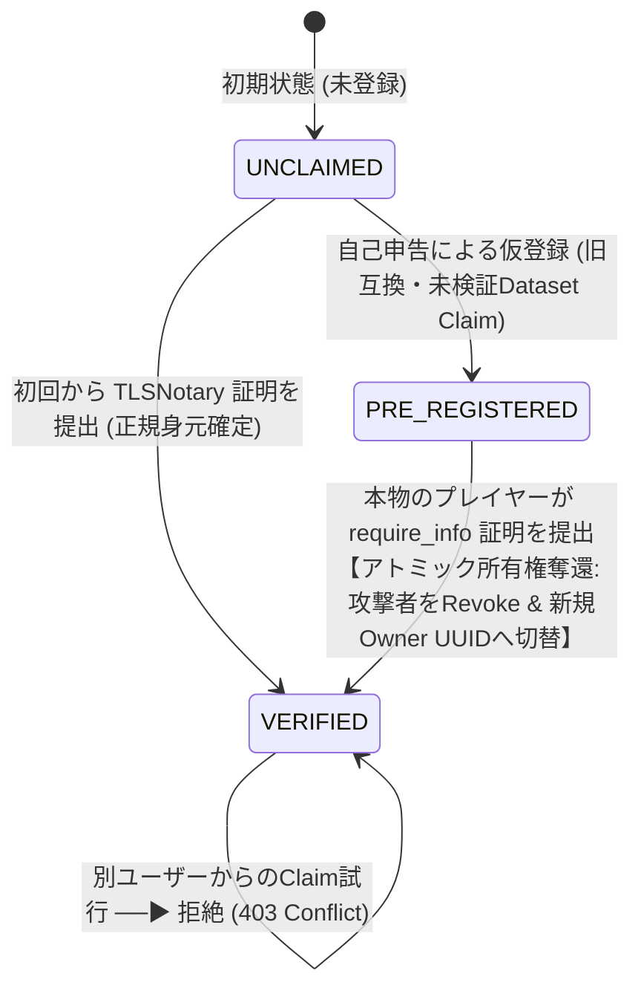
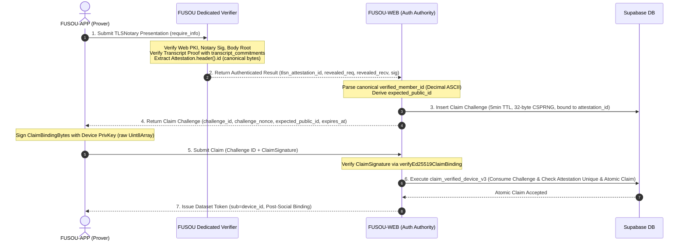

# FUSOU: zkTLS (TLSNotary MPC-TLS) による Game Account 身元公証 (Provenance) & 事前登録攻撃無力化 実装仕様書 (require_info 特化版)

> **文書種別**: アーキテクチャ設計仕様書 & 実装マスターガイド（Implementation Master Guide）  
> **対象領域**: FUSOU プロジェクト全域（`packages/fusou-auth`, `packages/fusou-proxy-core`, `packages/fusou-proxy-tlsn`, `packages/FUSOU-WEB`, Supabase / Cloudflare Workers / Dedicated Verifier Service）  
> **v1 Core Security Goal**:  
> **「ログインセッション開始時の `POST /kcsapi/api_get_member/require_info` から暗号学的に検証した `api_member_id` を FUSOU Dataset Identity（`public_id`）として確立し、自己申告による先回り登録攻撃（Preemptive Registration / ID Squatting）を無力化して正当な Dataset Attribution を確定する」**  
> 対象 API: **`POST /kcsapi/api_get_member/require_info`**（HTTP/1.1、Game Server 認証セッション単位で最初に TLSNotary Identity Attestation に成功した 1 回のみ）  
> 対象データ: **`/api_data/api_basic/api_member_id`**（kc-api-dto: internal Rust representation = `i64`, Wire: JSON numeric/string token lexeme, Canonical Internal: Decimal String `^[0-9]{1,16}$` 前置ゼロ正規化済み, DB: `BIGINT`）  
> **最重要設計原則**:  
> 1. **旧自己申告経路の完全根絶と Implementation Acceptance Criteria の確立**:  
>    - **「すべての公開関数 / HTTP ルート / RPC において、`api_member_id` $\rightarrow$ `public_id` $\rightarrow$ `dataset_token` のコールグラフが、TLSNotary Verified Claim を先祖（ancestor）に持たない経路をコードベース上に 0 本とすること（Call Graph 0本保証）」** を最優先の Implementation Acceptance Criteria とする。  
>    - 旧 `POST /anonymous-sync/v2/register`、旧 `POST /anonymous-sync/v2/pending/:token/complete`、および `signInAnonymously()` による未検証匿名ユーザー自動生成（`ensureCanonicalUserForPublicId`）は **完全廃止・削除（HTTP 410 Gone / コードベースから除去）** とする。  
>    - 汎用 RPC `rpc_register_public_id` は DB から完全に DROP し（`REVOKE EXECUTE`等の権限制御ではなく削除）、`claim_verified_device_v3` 内部の SQL トランザクションとして完全にインライン化・カプセル化する。
 2. **再送信ゼロ（No Re-submission の厳格定義）**:  
>    - **「For each intercepted logical require_info request, the Game Server must observe exactly one corresponding upstream request generated by FUSOU. (0 = failure, 1 = normal, 2+ = protocol violation)」**  
> 3. **外部プロキシ中継ゼロ（Direct Connection）**: 外部中継プロキシは規約上・BANリスク上不可とし、**クライアントローカルの `FUSOU-PROXY` と艦これ公式サーバー間の直接通信を維持**する。  
> 4. **MPC-TLS 処理 3 段階と Browser 待機のイベント分離 (T0〜T6)**:  
>    - **T0〜T3 (Browser 同期区間)**: Request routing $\rightarrow$ MPC joint decryption $\rightarrow$ Browser へ Response 即時返却（Browser completion）。  
>    - **T4〜T6 (非同期後処理)**: Notary 署名・Attestation 生成 $\rightarrow$ Verifier 検証 $\rightarrow$ DB Claim コミット（Identity completion）。  
> 5. **Selective Disclosure（最小構造開示）& JS Number 変換完全禁止**:  
>    - TLSNotary の Selective Disclosure では、Response 内の `HTTP/1.1 200 OK`、`svdata=`、`"api_result": 1`、`"api_data": { "api_basic": { "api_member_id": <digits> } }` を含む **必要最小限の構造化 Byte Range** を開示する。  
>    - FUSOU-WEB の Canonical Identity Parser（`packages/FUSOU-WEB/src/server/utils/require_info_parser.ts` [Planned File]）は、`JSON.parse()` を通さず raw ASCII / UTF-8 バイト列から **バイトレベルのトークン抽出（`"api_member_id": <digits>`）により Decimal ASCII 文字列（`^[0-9]{1,16}$`）として直接抽出・前置ゼロ正規化** し、IEEE 754 浮動小数点数による丸め誤差を 100% 排除する。  
> 6. **Device ↔ Proof の暗号学的バインディング（長さ 24 bytes `proof_purpose` & 完全固定 Binary Layout）**:  
>    - `public_id` はクライアントが任意選択せず、サーバーが `verified_member_id` から導出する。  
>    - **Trust Authority の厳格な分離**:  
>      - **`Cryptographic Verification Authority` (`FUSOU Dedicated Verifier`)**: Prover との MPC-TLS 共同復号（MPC Verifier）および Session Header 署名（Notary）を担当し、Attestation Proof、`transcript_commitments` による Transcript Proof の暗号検証、開示平文バイト列および `Attestation.header().id` の抽出・認証付き結果返却（Ed25519 署名 / Key Registry 仕様 / FUSOU-WEB と秘密鍵非共有）を行う。  
>      - **`Application / Identity / Dataset Authorization Authority` (`FUSOU-WEB` & Supabase)**: 開示平文からの唯一の Canonical Application Parser による `verified_member_id` 抽出、DB-backed One-Time Challenge（`public.claim_challenges` / 32-byte CSPRNG `BYTEA` / 5分 TTL / 単一消費）の発行・単一消費管理、`ClaimBindingBytes` raw bytes 署名検証（`verifyEd25519ClaimBinding`）、DB Claim、Dataset Token 発行。  
>    - **`ClaimBindingBytes` への `proof_purpose`（24 bytes US-ASCII）導入 & 公式 canonical byte 採用**:  
>      `ClaimBindingBytes` には用途識別子 `proof_purpose = "GAME_ACCOUNT_IDENTITY_V1" (ASCII length = 24 bytes, 厳密に自動テストで検証)`（正確に 24 US-ASCII octets）および TLSNotary 公式 canonical serialization による `tlsn_attestation_id = Attestation.header().id` の byte representation を格納し、Length-delimited binary framing（Domain: `"FUSOU-IDENTITY-CLAIM-V1"`, `uint16_be(len)`）によりバイト列を安全に固定する。  
>    - **Attestation 再利用の DB 遮断 (Anti-Reuse)**:  
>      `member_ownership_claims` テーブルに `UNIQUE (tlsn_attestation_id)` 制約を課し、同一 Attestation に対し複数 Presentation が生成された場合でも、Identity Claim は Attestation 単位で 1 度しか行えない（Presentation は何度生成されてもよいが Claim は 1 回限り）。  
> 7. **`member_id_hash` / Pepper の完全廃止（UUID `public_id` への一本化）**:  
>    `member_id_hash`、`anon_sync_pepper_runtime`、`anon_sync_pepper_versions`、Vault secret、Pepper rotation、HMAC 計算、hash version を**完全に廃止・削除**し、`public_id`（UUIDv4）を唯一の内部 Dataset Identity として使用する。  
> 8. **`api_member_id` と `public_id` の責務完全分離 & 1:1 双方向一意制約**:  
>    - `api_member_id`: Game Server が発行する識別子（TLSNotary で検証、`member_id_mapping` に保存、DB: `BIGINT`）。  
>    - `public_id`: FUSOU Dataset の内部安定 UUID（各テーブルの FK 参照、Telemetry 所属先）。  
>    - `member_id_mapping` に `UNIQUE(api_member_id)` および `UNIQUE(public_id)` を定義し、並行 Claim 時の同一 ID 解決を保証。  
> 9. **並行 Claim / Revoke の完全直列化（同一 64-bit Advisory Lock ドメイン & 親行ロック契約）**:  
>    Claim 処理と Revoke 処理を同一の 64-bit Advisory Lock ドメイン（同一の Lock Key 導出関数）下で実行し、同一トランザクション内で必ず行が存在する `member_id_mapping` 親行の `FOR UPDATE` により並行 Claim を物理的に直列化する。  
> 10. **所有状態（`member_ownership`）と通常のアプリケーション経路で変更禁止な監査履歴（`member_ownership_claims`）の分離**:  
>     現在の検証済み所有者レコードと、将来の監査検証用情報（`notary_time`, `notary_key_id`, `proof_purpose`, `tlsn_request_range`, `tlsn_response_range`）を含む Append-Only 監査証跡ログをテーブル分離する。  
> 11. **Quad Invariant の段階的成立 & Social User Binding**:  
>     `GAME_IDENTITY_VERIFIED` 時点で Triple Invariant を満たし、OAuth 認証ユーザーによる明示的なバインディング操作（`SOCIAL_ACCOUNT_BOUND`）完了後に $\text{member\_ownership.verified\_user\_id} \equiv \text{user\_devices.canonical\_user\_id} \equiv \text{user\_member\_map.user\_id} \equiv \text{web\_user\_member\_map.user\_id}$ の Quad Invariant を厳格に保持する。  
> 12. **RPC 前提条件の明確化（Security Boundary）**:  
>     ストアドプロシージャ `claim_verified_device_v3` は、呼び出し元 FUSOU-WEB が TLSNotary Proof および `ClaimBindingBytes` 署名を完全検証済みであることを前提とし、未検証データの書き込みを遮断する。  
> 13. **Dataset Token の後発行（Triple Verified Issuance）**:  
>     `Game Identity Verified + Device Authorized + Social Account Bound` の 3 条件がすべて揃った時点で `dataset_token` を発行し、事前発行は行わない。  
> 14. **Fallback 時のステータス明示**:  
>     送信前 Notary 障害時は `GAMEPLAY_OK / IDENTITY_UNVERIFIED / DATASET_TOKEN_NOT_ISSUED` の状態へ安全に通常 TLS フォールバックしゲームプレイを継続。リクエスト送信後の Notary 障害時は再送厳禁（`UNATTESTED`）。  
> **ステータス**: 暗号プロトコル・認証境界・Attestation一意性 完全確定マスター仕様書 (Freeze for Phase 0)  

---

## 目次

1. [Goal（目標と概念の整理）](#1-goal目標と概念の整理)
2. [Threat Model & Attack Scenario Trace（脅威モデルと攻撃シナリオ追跡）](#2-threat-model--attack-scenario-trace脅威モデルと攻撃シナリオ追跡)
3. [Trust Boundary & Authority Separation（検証機関・認可機関の厳格分離）](#3-trust-boundary--authority-separation検証機関認可機関の厳格分離)
4. [Identity Architecture & Invariant（ID基盤と不変条件の段階的成立）](#4-identity-architecture--invariantid基盤と不変条件の段階的成立)
5. [Social Account Binding (`web_user_member_map`) & 状態モデル](#5-social-account-binding-web_user_member_map--状態モデル)
6. [Member State Machine（身元確認ステートマシン & 乗っ取り防止ルール）](#6-member-state-machine身元確認ステートマシン--乗っ取り防止ルール)
7. [TLSNotary Game Account Identity Provenance (`POST /kcsapi/api_get_member/require_info`)](#7-tlsnotary-game-account-identity-provenance-post-kcsapiapi_get_memberrequire_info)
8. [Device ↔ Proof Binding（proof_purpose 24B, Attestation.header().id, Byte Layout 完全固定）](#8-device--proof-bindingproof_purpose-24b-attestationheaderid-byte-layout-完全固定)
9. [初回 Claim 決定論的 8 ステップ順序 & DB トランザクション (全10ステップ)](#9-初回-claim-決定論的-8-ステップ順序--db-トランザクション-全10ステップ)
10. [Preemptive Registration Attack（自己申告先回り登録攻撃の無力化と安全なRevoke）](#10-preemptive-registration-attack自己申告先回り登録攻撃の無力化と安全なrevoke)
11. [Concurrent Claim & Revoke Handling（64-bit Advisory Lock & 親行ロック契約）](#11-concurrent-claim--revoke-handling64-bit-advisory-lock--親行ロック契約)
12. [Revoke Semantics & Currently Trusted Device（失効セマンティクスと有効端末定義）](#12-revoke-semantics--currently-trusted-device失効セマンティクスと有効端末定義)
13. [Dataset Token Issuance（Triple Verified 後発行ルールとJWT Claims）](#13-dataset-token-issuancetriple-verified-後発行ルールとjwt-claims)
14. [Replay Protection & Attestation Reuse Policy（証明書再利用遮断）](#14-replay-protection--attestation-reuse-policy証明書再利用遮断)
15. [DB Schema / RPC（Supabaseマイグレーション: Challenge, 状態, 拡張監査履歴）](#15-db-schema--rpcsupabaseマイグレーション-challenge-状態-拡張監査履歴)
16. [Failure Cases & Fallback Semantics (Phase A / Phase B)](#16-failure-cases--fallback-semantics-phase-a--phase-b)
17. [Recovery & Re-binding Policy（用語の明確な分離）](#17-recovery--re-binding-policy用語の明確な分離)
18. [Migration & Token Revocation Semantics（既存データの安全な移行）](#18-migration--token-revocation-semantics既存データの安全な移行)
19. [Testing & Security Invariant 対応表](#19-testing--security-invariant-対応表)
20. [Security Progress Checklist（開発進捗チェックリスト）](#20-security-progress-checklist開発進捗チェックリスト)

---

## 1. Goal（目標と概念の整理）

### 1.1 目的
FUSOU の匿名同期システム（`anonymous-sync-v2`）において、悪意ある第三者が他人の `api_member_id` を先回りして自己申告登録し、本物のプレイヤーがデータを同期できなくなる **自己申告による先回り登録攻撃（Preemptive Registration Attack / ID Squatting）** を無力化します。

旧来の `POST /anonymous-sync/v2/register` では、クライアントが自己申告した `api_member_id` から即時に `dataset_token` を発行しており、TLSNotary を迂回して他人の Dataset を勝手に作成・詐称できる構造的欠陥がありました。

v1 ではこの自己申告エンドポイントおよび未検証の匿名ユーザー自動生成を完全廃止し、セッション開始時の `POST /kcsapi/api_get_member/require_info` の `/api_data/api_basic/api_member_id` を対象に zkTLS (TLSNotary MPC-TLS) を適用し、「正規のゲームセッションを操作できる端末」が Dataset 帰属（Attribution）をいつでも奪還・確定できるアトミックな基盤を確立します。

### 1.2 用語と概念の明確な分離
1. **Game Account Identity Provenance**: TLSNotary による「その時点で正規の `api_member_id` セッションを所持・操作している事実の証明」（Game Account の絶対的所有権の証明ではなく、セッションの真正性証明）。
2. **Dataset Attribution**: Telemetry データを特定 Dataset (`public_id`) にサーバー側で確定・帰属させる保証。
3. **Social Account Binding**: OAuth 認証ユーザーによる明示的なアカウント紐付け操作（`web_user_member_map`）。
4. **Re-binding & Transfer Policy**: Game Account アクセス証明 $\neq$ Social Account 所有権証明。一度確立された Dataset の所有権は別ユーザーからの Claim で自動移転することはなく、明示的なリカバリ / 移転プロトコルを通じてのみ実行可能。

---

## 2. Threat Model & Attack Scenario Trace（脅威モデルと攻撃シナリオ追跡）

### 2.1 攻撃シナリオと防御追跡
* **A. 攻撃者が任意の `member_id` を自己申告登録する攻撃**:  
  自己申告登録エンドポイント（旧 `register`）および匿名ユーザー自動生成関数は完全削除され、未検証の自己申告登録による Dataset Token 取得は物理的に不可能です。正規オーナーが `require_info` 証明を提出した時点で正当な身元が確立されます（自己申告による先回り登録攻撃を無力化）。
* **B. 被害者の有効な Proof P を盗聴・傍受して攻撃者端末にバインドする攻撃**:  
  Server-issued Challenge（`challenge_nonce`）に対する署名には被害者端末の秘密鍵が必要なため、有効な Device B の公開鍵では Device A にバインドされた Claim を暗号学的に検証できず拒絶されます（端末すり替え拒絶）。
* **C. クライアントが Telemetry 内で他人の `member_id` を指定する攻撃**:  
  Telemetry ペイロード内の `member_id` はサーバーの認可判断から完全排除され、無視されます。
* **D. クライアントが Telemetry 内で他人の `public_id` / Dataset ID を指定する攻撃**:  
  サーバーは `dataset_token` から `public_id` を導出するため、クライアント指定の `public_id` は完全無視されます。
* **E. クライアントが Telemetry 内で他人の `owner user_id` を指定する攻撃**:  
  同様に認可判断から完全排除され、無視されます。
* **F. 同一 Telemetry リクエストの再生（Replay 攻撃）**:  
  `telemetry_nonces` テーブル（30分保持）と ±5 分のタイムスタンプ窓により、同一 Nonce の再送信は 401/403 で拒絶されます。
* **G. クライアントによる Telemetry 本文の改ざん**:  
  Telemetry 内容自体は UNTRUSTED ですが、改ざんされたデータであっても「どの Dataset に所属して提出されたか（Attribution）」はサーバー側で厳格に確定されます。
* **H. 既存オーナー A の Game Account に対し第三者 B が Proof を提出する攻撃**:  
  Game Account アクセス証明 $\neq$ Social Account 所有権証明。一度確立された `member_ownership` は別ユーザーからの Claim で自動移転することはなく、`EXISTING_VERIFIED_OWNER_CONFLICT` で拒絶されます。
* **I. 端末の交換・追加（Device Replacement）**:  
  同一オーナー（同一 `canonical_user_id`）による新端末は、同一の `public_id` に対する追加端末として安全に登録されます。
* **J. Notary サーバーの障害**:  
  送信前障害時は通常 TLS へ切り替えて `GAMEPLAY_OK / IDENTITY_UNVERIFIED / DATASET_TOKEN_NOT_ISSUED` でゲームプレイを継続。送信後障害時は同一リクエストの再送を厳禁とし `UNATTESTED` 扱いとします。
* **K. ゲーム API の二重送信・BAN リスク**:  
  FUSOU 自身によるリクエスト再送コードを完全排除し、設計要件および計測により FUSOU-generated duplicate = 0 を保証します。

### 2.2 防げない事項（Non-Guarantees）
* **Telemetry 内容の真正性**: 戦闘結果、ドロップ、資源、艦隊、装備等の内容自体が Game Server 由来であることは v1 では判定しません（UNTRUSTED payload）。
* **自端末の資格情報盗難時のデータ捏造**: 攻撃者がユーザー PC を完全支配して `Device A` の秘密鍵/トークンを窃取した場合、`Device A`（Dataset U1）として偽の戦闘データを送ることは防げません（TPM 等がない限り不可）。
* **Credential Attribution と Real-time Game Session の分離**:  
  FUSOU v1 が保証するのは **「この Telemetry が、Game Account A にバインドされた Dataset U1 の正規 Credential から提出された事実（Credential Attribution）」** であり、**「この Telemetry が、現在 Game Server 上でリアルタイムにプレイされているゲームセッションとリアルタイムに一致していること（Real-time Session Freshness）」までは保証しません**。

---

## 3. Trust Boundary & Authority Separation（検証機関・認可機関の厳格分離）

```
                     UNTRUSTED ZONE
┌────────────────────────────────────────────────────────┐
│ User PC (Client Environment)                           │
│                                                        │
│  - FUSOU binary (Tamperable)                           │
│  - Local Memory / Process (Inspectable)                │
│  - Local SQLite DB (Modifiable)                        │
│  - Browser / OS (Untrusted)                            │
│                                                        │
│  Client-provided metadata = NEVER trusted              │
└───────────────────────────┬────────────────────────────┘
                            │
                            │ 1. TLSNotary Presentation (require_info)
                            │ 2. ClaimSignature = Ed25519(ClaimBindingBytes) [raw Uint8Array]
                            ▼
═════════════════════ TRUST BOUNDARY ═════════════════════
                            │
                            ▼
┌────────────────────────────────────────────────────────┐
│ FUSOU Dedicated Verifier (MPC Verifier & Notary)       │
│ (Dedicated Rust Service: Cryptographic Authority)      │
│                                                        │
│  - Joint MPC-TLS Decryption with Prover                │
│  - Sign Session Header as Notary -> Attestation gen    │
│  - Verify Web PKI Certificate Chain (Allowlist Check)  │
│  - Verify Attestation Proof & Merkle Root              │
│  - Verify Transcript Proof with transcript_commitments │
│  - Extract Attestation.header().id (canonical bytes)   │
│  - Return Authenticated Verification Result Bundle:    │
│    { version: 1, issuer, key_id, attestation_id,       │
│      server_identity, revealed_spans, notary_time, sig }│
│    ※ Verifier 秘密鍵による Ed25519 署名 (FUSOU-WEBと秘密鍵非共有)│
└───────────────────────────┬────────────────────────────┘
                            │ Authenticated Verification Result
                            ▼
┌────────────────────────────────────────────────────────┐
│ FUSOU-WEB (Application / Authorization Authority)      │
│                                                        │
│  - Verify Verifier Signature via Key Registry (Pubkey) │
│  - Parse canonical verified_member_id (Decimal ASCII)  │
│    (Planned: packages/FUSOU-WEB/.../require_info_parser.ts)
│  - Derive expected_public_id from verified_member_id   │
│  - Issue Server One-Time Challenge into DB (5min TTL)  │
│    (Bound to public_id, device_id, attestation_id)     │
│  - Verify ClaimBindingBytes via verifyEd25519ClaimBinding│
│  - Issue Dataset Token post-verification (sub=dev_id)  │
└───────────────────────────┬────────────────────────────┘
                            │
                            ▼ [SECURITY BOUNDARY]
┌────────────────────────────────────────────────────────┐
│ Supabase Database (Trusted Core Storage: RPC Layer)    │
│                                                        │
│  - 64-bit Advisory Lock & Row-Level Locking            │
│  - Atomic Ownership Transfer (Strict 10 Steps)         │
│  - Enforce Quad Invariant (Post-Social Binding)        │
│  - Enforce UNIQUE (tlsn_attestation_id) (Anti-Reuse)   │
│  - Atomic Challenge & Proof Consumption Enforcement    │
│  - Append-Only Audit Trail (UPDATE/DELETE physically prevented by ON DELETE RESTRICT & trg_protect_member_claims_audit) with proof_purpose & spans  │
│                                                        │
│  Stored State = ACCEPTED Verified Evidence Only        │
└────────────────────────────────────────────────────────┘
```

> **RPC の Security Boundary（前提条件）**:  
> `claim_verified_device_v3` は、**呼び出し元である FUSOU-WEB が TLSNotary Verifier の暗号検証結果・開示平文からのカノニカルパース（Decimal ASCII 文字列抽出）およびサーバー導出 `expected_public_id` と Server Challenge に基づく `ClaimBindingBytes` 署名を完全検証済みであることを前提** とします。未検証の証明書や改ざんされた平文が直接 RPC に渡されることはありません。

---

## 4. Identity Architecture & Invariant（ID基盤と不変条件の段階的成立）

### 4.1 責任階層（Security Authority Hierarchy）
* **`member_id_mapping`**: Game Account Identity Root（暗号学的に検証された `api_member_id` と安定 UUID `public_id` の 1:1 双方向一意マッピング）。
* **`member_ownership`**: Owner / Device Authorization Root（Security Truth: 現在の検証済み所有者と認証済みプライマリ端末）。
* **`user_member_map` & `web_user_member_map`**: Derived / Application Projection Mappings（Web UI / Social Account 連携用の派生マッピング）。

```
api_member_id (例: 12345678: Decimal String, DB: BIGINT)
       │
       │ (TLSNotary provenance 検証)
       ▼
member_id_mapping (Service-role only: UNIQUE(api_member_id), UNIQUE(public_id))
       │
       ▼
public_id = UUIDv4 (Random UUID: Dataset U1)
       │
       ├───────────────▶ member_ownership (Security Truth: verified_user_id = Auth User A)
       ├───────────────▶ user_member_map (Application Projection)
       ├───────────────▶ web_user_member_map (Social Projection: UNIQUE public_id -> 1 Dataset = 1 Social User)
       ├───────────────▶ user_devices (device_id = Device A)
       └───────────────▶ telemetry_events (public_id = U1)
```

### 4.2 Invariant の段階的成立
1. **`GAME_IDENTITY_VERIFIED` 時点**:
   $$\text{member\_ownership.verified\_user\_id} \equiv \text{user\_devices.canonical\_user\_id} \equiv \text{user\_member\_map.user\_id} \quad (\text{Triple Invariant})$$
2. **`SOCIAL_ACCOUNT_BOUND`（OAuth 明示的バインディング完了）以降**:
   $$\text{上記 3 者} \equiv \text{web\_user\_member\_map.user\_id} \quad (\text{Quad Invariant})$$

---

## 5. Social Account Binding (`web_user_member_map`) & 状態モデル

* **状態の分離**:
  1. `GAME_IDENTITY_VERIFIED`: TLSNotary Proof により `api_member_id` $\leftrightarrow$ `public_id` $\leftrightarrow$ `user_devices` が確定した状態。
  2. `SOCIAL_ACCOUNT_BOUND`: OAuth 認証済み Web ユーザーが明示的なバインディング操作を行い、`web_user_member_map` に登録された状態。
* **1:1 Binding ルール**: `web_user_member_map` は `PRIMARY KEY (user_id, public_id)` かつ `public_id UNIQUE` であり、1 つの Dataset `public_id` に紐づく Web ユーザーは 1 人です（同一 Game Account Dataset の複数 Social アカウント共有は不可）。  
* **注意**: Game Account へのアクセス証明 $\neq$ Social Account 所有権の証明 であるため、OAuth 認証済みユーザーによる明示的なバインディング操作を必須とし、別ユーザーからの乗っ取り Claim は `EXISTING_VERIFIED_OWNER_CONFLICT` で遮断されます。

---

## 6. Member State Machine（身元確認ステートマシン & 乗っ取り防止ルール）



> **重要原則**:  
> 1. `PRE_REGISTERED` は「未検証の Game Identity」ではなく「未検証の Dataset Claim（自己申告による仮登録）」であり、この状態の Dataset が正規の `member_id` であるとは扱いません。  
> 2. **Game Account Owner は一度確立したら原則不変**。Device の追加・失効のみ可能であり、所有者変更は別途明示的な Recovery/Transfer プロトコルを必要とします。

---

## 7. TLSNotary Game Account Identity Provenance (`POST /kcsapi/api_get_member/require_info`)

* **Gameplay Path**:
  `require_info` は FUSOU-Prover と Game Server 間の TLSNotary MPC-TLS 経路により処理されるため、この API の応答取得には MPC 由来の追加遅延が発生する可能性があります。**Browser の待機条件から除外するのは Presentation 生成、証明送信、DB 登録等の後処理（Post-processing is not on critical path）** であり、Response plaintext の取得自体は MPC-TLS の制約に従います（**MPC-TLS response acquisition remains on the login API path** / 許容遅延は Phase 0 PoC で実測検証）。
* **Evidence Path**:
  プロキシのバックグラウンドタスクが Notary サーバーと MPC を完了させ、最小限の構造化フィールド（`POST /kcsapi/api_get_member/require_info`, `Host:`, `api_result: 1`, `/api_data/api_basic/api_member_id`）のみを開示した Presentation を構築します。

---

## 8. Device ↔ Proof Binding（proof_purpose 24B, Attestation.header().id, Byte Layout 完全固定）

Proof P と提出端末 Device A を暗号学的に不可分にバインドするため、以下の 4 ステップ Challenge-Response を実行します：



| 順序 | フィールド名 | データ型 / エンコーディング | バイト長 | 説明 |
|:---:|---|---|---|---|
| 1 | `domain_tag` | US-ASCII octets | 23 bytes | `"FUSOU-IDENTITY-CLAIM-V1"` |
| 2 | `proof_purpose` | US-ASCII octets | **24 bytes** | `"GAME_ACCOUNT_IDENTITY_V1"` |
| 3 | `tlsn_attestation_id` | TLSNotary Canonical Bytes | $N$ bytes (Phase 0 固定) | `Attestation.header().id` の公式シリアライズバイト列 |
| 4 | `verified_member_id` | UTF-8 decimal ASCII | 1〜16 bytes | 検証済みゲームアカウント ID（例: `"12345678"`） |
| 5 | `device_id` | Binary UUID (RFC 4122 Big-endian) | 16 bytes | 提出端末の Device UUID |
| 6 | `expected_public_id` | Binary UUID (RFC 4122 Big-endian) | 16 bytes | サーバー導出 Dataset UUID |
| 7 | `challenge_id` | Binary UUID (RFC 4122 Big-endian) | 16 bytes | サーバー発行 Challenge UUID |
| 8 | `challenge_nonce` | Raw Binary Bytes | 32 bytes | サーバー発行 One-Time Nonce (`crypto.getRandomValues`) |

* **署名対象バイト列（Length-Delimited Binary Framing）**:
  $$\text{ClaimBindingBytes} = \text{u16}(23) \Vert \text{"FUSOU-IDENTITY-CLAIM-V1"} \Vert \text{u16}(24) \Vert \text{"GAME_ACCOUNT_IDENTITY_V1"} \Vert \text{u16}(\text{len(att\_id)}) \Vert \text{att\_id} \Vert \text{u16}(\text{len(mid)}) \Vert \text{mid} \Vert \text{u16}(16) \Vert \text{dev} \Vert \text{u16}(16) \Vert \text{pub} \Vert \text{u16}(16) \Vert \text{cid} \Vert \text{u16}(32) \Vert \text{nonce}$$
  $$\text{ClaimSignature} = \text{Ed25519\_Sign}(sk_{\text{device}}, \text{ClaimBindingBytes})$$

---

## 9. 初回 Claim 決定論的 8 ステップ順序 & DB トランザクション (全10ステップ)

### 9.1 初回 Claim 決定論的 8 ステップ順序
第三者が実装しても完全に同一の動作となるよう、初回 Claim の順序を以下のように完全固定します：

1. **Step 1 (Verified Member ID 受領)**: FUSOU-WEB が TLSNotary Verifier から Authenticated Verifier Result を受領し、`parseCanonicalRequireInfo` により `verified_member_id` を抽出。
2. **Step 2 (64-bit Advisory Lock 取得)**: FUSOU-WEB が `member_id` に基づく 64-bit Advisory Lock を取得。
3. **Step 3 (Public ID 確定)**: `public.member_id_mapping` に対する atomic get-or-create を実行し、`public_id` を確定。
4. **Step 4 (Authenticated Device が Claim 要求)**: 端末が `device_id` を提示して Challenge を要求。
5. **Step 5 (Server Challenge 発行)**: FUSOU-WEB が `(public_id, device_id, attestation_id, challenge_nonce, expires_at)` を `public.claim_challenges` に INSERT。
6. **Step 6 (ClaimBindingBytes 構築 & 署名)**: 端末が `(domain, purpose, attestation_id, verified_member_id, device_id, expected_public_id, challenge_id, challenge_nonce)` から `ClaimBindingBytes` を構築し、端末秘密鍵で Ed25519 署名。
7. **Step 7 (Claim 提出 & 署名検証)**: クライアントが FUSOU-WEB へ Claim 提出。FUSOU-WEB が `verifyEd25519ClaimBinding(pubkey, bytes, sig)` で raw byte 署名を検証。
8. **Step 8 (Atomic DB Commit)**: `claim_verified_device_v3` を実行し、Challenge 単一消費、`UNIQUE(tlsn_attestation_id)` 検証、所有権判定、監査ログ記録、Device 昇格をアトミックにコミット。

### 9.2 DB トランザクション内部 10 ステップ (claim_verified_device_v3)
1. **Advisory Lock 取得**: 64-bit キーによるトランザクション排他ロック（Claim / Revoke 共通ロックドメイン）。
2. **Challenge & Attestation Reuse Check**: 排他ロック下での Challenge 単一消費（`UPDATE claim_challenges SET consumed_at = NOW()`）および `tlsn_attestation_id` 重複消費チェック。
3. **Device Row Lock**: 対象 `user_devices` レコードの存在確認と `FOR UPDATE` ロック。
4. **Public ID 登録/取得 (Atomic get-or-create)**: トランザクション内部で `public.member_id_mapping` から取得または INSERT（`UNIQUE(api_member_id)` により同一 `public_id` 取得保証）。
5. **Parent Mapping Row Lock**: 親行 `member_id_mapping` に対する `FOR UPDATE` ロック。
6. **Current Ownership Row Lock**: 現在の `member_ownership` レコードの `FOR UPDATE` ロック。
7. **Ownership Rule 判定**: 初回公証 / 事前登録攻撃者からの奪還 / 別アカウント乗っ取り拒絶の判定。
8. **Audit Record Insert**: `member_ownership_claims` への監査ログ追記（`proof_purpose = p_proof_purpose`, `tlsn_attestation_id`, `notary_time`, `notary_key_id`, `tlsn_request_range`, `tlsn_response_range` 含む。クライアント申告値は混入させない）。
9. **Device Verification Update**: 当該デバイスの `is_verified = TRUE` 昇格およびバインド更新。
10. **Result Return**: 確定された所有権メタデータの JSON 返却。

---

## 10. Preemptive Registration Attack（自己申告先回り登録攻撃の無力化と安全なRevoke）

自己申告による先回り登録攻撃が存在する場合の所有権奪還アルゴリズム：
1. `api_member_id` から 64-bit Advisory Lock および `member_id_mapping` の親行ロックを取得。
2. 対象デバイスの `canonical_user_id`（既に `auth.users` に紐づいている正規 UUID）を取得。
3. `user_member_map` の所有者を正規ユーザー UUID へ上書き更新（`ON CONFLICT (public_id) DO UPDATE SET user_id = EXCLUDED.user_id`）。
4. `member_ownership` に現在の正規オーナーを記録。
5. **安全な Revoke 実行**: 同一 `public_id` に紐づく未検証端末のうち、**現在オーナーと異なる別ユーザーの端末のみを一括 Revoke**：
   ```sql
   UPDATE public.user_devices
   SET
     revoked_at = NOW(),
     revoked_reason = 'preempted_by_tlsn_verified_owner'
   WHERE public_id = v_public_id
     AND device_id != p_device_id
     AND is_verified = FALSE
     AND canonical_user_id <> v_canonical_user_id
     AND revoked_at IS NULL;
   ```
6. `member_ownership_claims` に監査証跡ログを追記保存。

---

## 11. Concurrent Claim & Revoke Handling（64-bit Advisory Lock & 親行ロック契約）

初回 Claim 時、`member_ownership` に行が存在しない場合でも確実に排他制御を行うため、以下の二重ロックをトランザクション先頭で適用します：
1. **64-bit Transaction Advisory Lock**:
   32-bit `hashtext()` によるハッシュ衝突確率を十分に低減するため、64-bit 整数キーを使用し、`claim_verified_device_v3` と `revoke_pre_registered_devices` の双方が同一の Lock Key 導出関数を共有します：
   ```sql
   v_lock_key := ('x' || substr(md5(p_api_member_id::text), 1, 16))::bit(64)::bigint;
   PERFORM pg_advisory_xact_lock(v_lock_key);
   ```
2. **親行ロック契約（Parent Row Lock Contract）**:
   Advisory Lock 取得後、`INSERT ... ON CONFLICT (api_member_id) DO UPDATE` により親行を生成/取得した上で、必ず `public.member_id_mapping` に対する親行を確実に `SELECT ... FOR UPDATE` します。

---

## 12. Revoke Semantics & Currently Trusted Device（失効セマンティクスと有効端末定義）

* **Currently Trusted Device の厳格な定義**:
  DB の `user_devices` テーブル上で **`is_verified = TRUE AND revoked_at IS NULL`** であること。
* **Revoke 処理**:
  所有権移転時、古い未検証端末には `revoked_reason = 'preempted_by_tlsn_verified_owner'` が刻印され、以降のアクセスは即時 401/403 で拒絶されます。

---

## 13. Dataset Token Issuance（Triple Verified 後発行ルールとJWT Claims）

### 13.1 Triple Verified Issuance（公証後発行ルール）
必ず以下の順序で発行され、事前発行は行われません：
$$\text{require\_info verified} \longrightarrow \text{device claim accepted} \longrightarrow \text{social account bound} \longrightarrow \text{dataset\_token issued}$$

### 13.2 JWT Claims
```json
{
  "sub": "00000000-0000-4000-8000-000000000000",
  "dataset_id": "11111111-1111-4000-8000-111111111111",
  "typ": "dataset",
  "iat": "<issued_at_timestamp>",
  "exp": "<issued_at_timestamp + configured_ttl>"
}
```

---

## 14. Replay Protection & Attestation Reuse Policy（証明書再利用遮断）

* **Attestation 一意消費制約 (Anti-Reuse)**:
  排他ロック取得後に `member_ownership_claims` テーブルに `UNIQUE (tlsn_attestation_id)` 制約を課し、**同一の Attestation（Proof）が 2 回以上 Claim に使われた場合は `DUPLICATE_ATTESTATION_CLAIMED` 例外として即時ロールバック** します（**Presentation は何度生成されてもよいが、FUSOU Identity Claim は Attestation 単位で 1 度限り**）。
* **Maximum Age Acceptance Policy**:
  Notary が刻印した `notary_time` が 24 時間以上前の古い証明書は自動破棄。

---

## 15. DB Schema / RPC（Supabaseマイグレーション: Challenge, 状態, 拡張監査履歴）

### `20260826000000_claim_verified_device_v3.sql`
```sql
BEGIN;

-- 1. Server-issued One-Time Claim Challenge テーブル (RLS: Service-role only)
CREATE TABLE IF NOT EXISTS public.claim_challenges (
    challenge_id UUID PRIMARY KEY DEFAULT gen_random_uuid(),
    public_id UUID NOT NULL REFERENCES public.member_id_mapping(public_id) ON DELETE RESTRICT,
    device_id UUID NOT NULL REFERENCES public.user_devices(device_id) ON DELETE RESTRICT,
    attestation_id BYTEA NOT NULL,
    challenge_nonce BYTEA NOT NULL,
    expires_at TIMESTAMPTZ NOT NULL,
    consumed_at TIMESTAMPTZ,
    created_at TIMESTAMPTZ NOT NULL DEFAULT NOW()
);

CREATE INDEX IF NOT EXISTS idx_claim_challenges_active 
    ON public.claim_challenges (challenge_id, expires_at) 
    WHERE consumed_at IS NULL;

ALTER TABLE public.claim_challenges ENABLE ROW LEVEL SECURITY;

CREATE POLICY "Allow service_role full access to claim_challenges"
    ON public.claim_challenges
    FOR ALL
    TO service_role
    USING (true)
    WITH CHECK (true);

ALTER TABLE public.user_devices
  ADD COLUMN IF NOT EXISTS is_verified BOOLEAN NOT NULL DEFAULT FALSE,
  ADD COLUMN IF NOT EXISTS verified_at TIMESTAMPTZ,
  ADD COLUMN IF NOT EXISTS last_notary_time TIMESTAMPTZ;

-- 2. 現在の検証済み所有者テーブル (Current Ownership State)
CREATE TABLE IF NOT EXISTS public.member_ownership (
    public_id UUID PRIMARY KEY REFERENCES public.member_id_mapping(public_id) ON DELETE RESTRICT,
    verified_user_id UUID NOT NULL REFERENCES auth.users(id) ON DELETE RESTRICT,
    primary_device_id UUID NOT NULL REFERENCES public.user_devices(device_id) ON DELETE RESTRICT,
    established_at TIMESTAMPTZ NOT NULL DEFAULT NOW(),
    updated_at TIMESTAMPTZ NOT NULL DEFAULT NOW()
);

-- 3. 所有権 Claim 監査履歴テーブル (通常アプリケーション経路でUPDATE/DELETE禁止のAppend-Only Audit Trail)
CREATE TABLE IF NOT EXISTS public.member_ownership_claims (
    claim_id UUID PRIMARY KEY DEFAULT gen_random_uuid(),
    public_id UUID NOT NULL REFERENCES public.member_id_mapping(public_id) ON DELETE RESTRICT,
    canonical_user_id UUID NOT NULL REFERENCES auth.users(id) ON DELETE RESTRICT,
    verified_device_id UUID NOT NULL REFERENCES public.user_devices(device_id) ON DELETE RESTRICT,
    tlsn_attestation_id BYTEA NOT NULL,
    tlsn_request_range TEXT,
    tlsn_response_range TEXT,
    notary_time TIMESTAMPTZ NOT NULL,
    notary_key_id TEXT,
    proof_purpose TEXT NOT NULL DEFAULT 'GAME_ACCOUNT_IDENTITY_V1',
    claim_type TEXT NOT NULL CHECK (claim_type IN ('INITIAL_VERIFIED', 'TAKEOVER_FROM_PRE_REG', 'ADDITIONAL_DEVICE')),
    claimed_at TIMESTAMPTZ NOT NULL DEFAULT NOW(),
    CONSTRAINT uq_member_claims_attestation UNIQUE (tlsn_attestation_id)
);

CREATE INDEX IF NOT EXISTS idx_member_claims_history ON public.member_ownership_claims(public_id, claimed_at DESC);

ALTER TABLE public.member_ownership_claims ENABLE ROW LEVEL SECURITY;

CREATE POLICY "Allow service_role full access to member_ownership_claims"
    ON public.member_ownership_claims
    FOR ALL
    TO service_role
    USING (true)
    WITH CHECK (true);

-- 監査履歴テーブルの UPDATE / DELETE を物理禁止するトリガー
CREATE OR REPLACE FUNCTION public.fn_prevent_audit_tampering()
RETURNS TRIGGER LANGUAGE plpgsql AS $$
BEGIN
  RAISE EXCEPTION 'member_ownership_claims is an append-only audit trail: UPDATE or DELETE is strictly prohibited';
END;
$$;

CREATE TRIGGER trg_protect_member_claims_audit
BEFORE UPDATE OR DELETE ON public.member_ownership_claims
FOR EACH ROW EXECUTE FUNCTION public.fn_prevent_audit_tampering();

-- 4. アトミック身元確定・奪還ストアドプロシージャ (全10ステップ順序完全維持)
CREATE OR REPLACE FUNCTION public.claim_verified_device_v3(
  p_device_id UUID,
  p_api_member_id BIGINT,
  p_tlsn_attestation_id BYTEA,
  p_notary_time TIMESTAMPTZ,
  p_challenge_id UUID,
  p_challenge_nonce BYTEA,
  p_notary_key_id TEXT DEFAULT NULL,
  p_proof_purpose TEXT DEFAULT 'GAME_ACCOUNT_IDENTITY_V1',
  p_request_range TEXT DEFAULT NULL,
  p_response_range TEXT DEFAULT NULL
)
RETURNS JSONB
LANGUAGE plpgsql
SECURITY DEFINER
SET search_path = public
AS $$
DECLARE
  v_lock_key BIGINT;
  v_device RECORD;
  v_public_id UUID;
  v_canonical_user_id UUID;
  v_current_ownership RECORD;
  v_mapping RECORD;
  v_claim_type TEXT;
  v_existing_claim_count INT;
  v_challenge_updated INT;
  v_result JSONB;
BEGIN
  -- Step 1. 【最優先】64-bit Transaction Advisory Lock による完全排他制御
  v_lock_key := ('x' || substr(md5(p_api_member_id::text), 1, 16))::bit(64)::bigint;
  PERFORM pg_advisory_xact_lock(v_lock_key);

  -- Step 2. 排他ロック取得後の Attestation 重複消費チェック (TOCTOU競合防止)
  SELECT COUNT(*) INTO v_existing_claim_count
  FROM public.member_ownership_claims
  WHERE tlsn_attestation_id = p_tlsn_attestation_id;

  IF v_existing_claim_count > 0 THEN
    RAISE EXCEPTION 'DUPLICATE_ATTESTATION_CLAIMED: attestation has already been used for identity claim';
  END IF;

  -- Step 3. 対象デバイスの存在確認 & 行ロック
  SELECT * INTO v_device
  FROM public.user_devices
  WHERE device_id = p_device_id
  FOR UPDATE;

  IF NOT FOUND THEN
    RAISE EXCEPTION 'device_not_found';
  END IF;

  v_canonical_user_id := v_device.canonical_user_id;

  -- Step 4. public_id の取得/生成 (Atomic get-or-create)
  INSERT INTO public.member_id_mapping (api_member_id, public_id, created_at)
  VALUES (p_api_member_id, gen_random_uuid(), NOW())
  ON CONFLICT (api_member_id) DO UPDATE SET updated_at = NOW()
  RETURNING public_id INTO v_public_id;

  -- Step 4.1 Server Challenge の単一消費確認 (One-Time Consume)
  UPDATE public.claim_challenges
  SET consumed_at = NOW()
  WHERE challenge_id = p_challenge_id
    AND challenge_nonce = p_challenge_nonce
    AND public_id = v_public_id
    AND device_id = p_device_id
    AND consumed_at IS NULL
    AND expires_at > NOW();

  GET DIAGNOSTICS v_challenge_updated = ROW_COUNT;
  IF v_challenge_updated = 0 THEN
    RAISE EXCEPTION 'INVALID_OR_EXPIRED_CHALLENGE: challenge % is invalid, expired, or already consumed', p_challenge_id;
  END IF;

  -- Step 5. 親行ロック契約の実行 (member_id_mapping FOR UPDATE)
  SELECT * INTO v_mapping
  FROM public.member_id_mapping
  WHERE public_id = v_public_id
  FOR UPDATE;

  -- Step 6. 現在の検証済み所有者レコードを確認 (排他ロック)
  SELECT * INTO v_current_ownership
  FROM public.member_ownership
  WHERE public_id = v_public_id
  FOR UPDATE;

  -- Step 7. 所有権ルール判定
  IF v_current_ownership.public_id IS NULL THEN
    -- 【初回公証 / 事前登録攻撃者からの所有権奪還】
    v_claim_type := 'INITIAL_VERIFIED';

    -- user_member_map の所有者を正規ユーザーへ移転・上書き (Triple Invariant 保証)
    INSERT INTO public.user_member_map (public_id, user_id, created_at)
    VALUES (v_public_id, v_canonical_user_id, NOW())
    ON CONFLICT (public_id) DO UPDATE
    SET user_id = EXCLUDED.user_id;

    -- 現在の Verified Owner として登録 (Primary Device 固定)
    INSERT INTO public.member_ownership (
      public_id, verified_user_id, primary_device_id, established_at, updated_at
    )
    VALUES (
      v_public_id, v_canonical_user_id, p_device_id, NOW(), NOW()
    );

    -- 同一 public_id に紐づく未検証端末のうち、別ユーザーの未検証端末のみを安全に Revoke
    UPDATE public.user_devices
    SET
      revoked_at = NOW(),
      revoked_reason = 'preempted_by_tlsn_verified_owner'
    WHERE public_id = v_public_id
      AND device_id != p_device_id
      AND is_verified = FALSE
      AND canonical_user_id <> v_canonical_user_id
      AND revoked_at IS NULL;

  ELSE
    -- 【すでに検証済みオーナーが存在する状態】
    IF v_current_ownership.verified_user_id != v_canonical_user_id THEN
      -- 別アカウントからの乗っ取り Claim は厳格に拒絶
      RAISE EXCEPTION 'EXISTING_VERIFIED_OWNER_CONFLICT: account % is already verified owner', v_current_ownership.verified_user_id;
    END IF;

    -- 同一オーナーによる追加端末 (Multi-Device: Owner は不変)
    v_claim_type := 'ADDITIONAL_DEVICE';
  END IF;

  -- Step 8. 通常のアプリケーション経路において UPDATE / DELETE を禁止する Append-Only 監査履歴テーブルに記録
  INSERT INTO public.member_ownership_claims (
    public_id, canonical_user_id, verified_device_id, tlsn_attestation_id, tlsn_request_range, tlsn_response_range, notary_time, notary_key_id, proof_purpose, claim_type
  )
  VALUES (
    v_public_id, v_canonical_user_id, p_device_id, p_tlsn_attestation_id, p_request_range, p_response_range, p_notary_time, p_notary_key_id, p_proof_purpose, v_claim_type
  );

  -- Step 9. 当該デバイスを verified に昇格 & 正当な Canonical User にバインド
  UPDATE public.user_devices
  SET
    public_id = v_public_id,
    canonical_user_id = v_canonical_user_id,
    is_verified = TRUE,
    verified_at = NOW(),
    last_notary_time = p_notary_time,
    revoked_at = NULL,
    revoked_reason = NULL
  WHERE device_id = p_device_id;

  -- Step 10. 結果返却
  v_result := jsonb_build_object(
    'device_id', p_device_id,
    'public_id', v_public_id,
    'canonical_user_id', v_canonical_user_id,
    'is_verified', TRUE,
    'claim_type', v_claim_type,
    'verified_at', NOW()
  );

  RETURN v_result;
END;
$$;

COMMIT;
```

---

## 16. Failure Cases & Fallback Semantics (Phase A / Phase B)

* **Phase A（リクエスト送信前）**:
  Game Server へのリクエスト送信前に MPC session が成立しない場合、直ちに通常の TLS 接続へ切り替えて `require_info` を送信。
  - 状態: `GAMEPLAY_OK / IDENTITY_UNVERIFIED / DATASET_TOKEN_NOT_ISSUED`
  - ゲームログインは継続し、未検証状態を維持します。
* **Phase B（リクエスト送信後）**:
  リクエスト送信後に MPC session が失敗した場合、**同一リクエストの再送は厳格に禁止（BAN 回避 / FUSOU-generated duplicate = 0）**。
  - 状態: `UNATTESTED`
  - `MPC-TLS request sent -> Verifier failure -> NO automatic replay, NO second upstream request -> If plaintext already fully available: may return original response; else: cannot reconstruct response from TLS.`
  - Browser への継続可否は「Prover が既に取得済みの plaintext が存在するか」に依存します（Phase 0 で実測検証）。公証タスクのみ破棄し、次回以降の自然な再試行時に新しい TLSNotary session として扱います。

---

## 17. Recovery & Re-binding Policy（用語の明確な分離）

概念および用語を厳格に分離して運用します：
1. **Game Account Identity Provenance**: TLSNotary による「その時点で正規の `api_member_id` セッションを所持・操作している事実の証明」。
2. **Dataset Attribution**: Telemetry データを特定 Dataset (`public_id`) にサーバー側で確定・帰属させる保証。
3. **Social Account Binding**: OAuth 認証ユーザーによる明示的なアカウント紐付け操作。
4. **Device Replacement (端末追加・失効)**: 同一オーナー（同一 `canonical_user_id`）が新端末を導入する場合、同一 `public_id` に対して新端末を `user_devices` に追加登録（Owner は不変）。**旧 Device の署名だけで新しい `member_id` の証明を代替することは不可（必ず新規 TLSNotary Proof が必要）**。
5. **Re-binding & Transfer Policy**: Game Account アクセス証明 $\neq$ Social Account 所有権証明。異なる Web ユーザーからの Claim は自動移転せず、明示的なリカバリ / 移転プロトコルを通じてのみ実行可能。

---

## 18. Migration & Token Revocation Semantics（既存データの安全な移行）

1. **既存 Dataset Token の一括失効**:
   移行開始時、旧自己申告経路で発行されたすべての Dataset Token を無効化（`user_devices.is_verified = FALSE` へのリセット）。
2. **既存自己申告 Device の扱い**:
   旧 Device 登録は未検証状態（`identity_verified = FALSE`）となり、新システムでの `require_info` TLSNotary Claim を完了して初めて `is_verified = TRUE` に昇格し新 Dataset Token が発行されます。
3. **旧テーブル・RPC の無効化**:
   `pending_member_syncs` は削除。`rpc_register_public_id` は完全に DROP。

---

## 19. Testing & Security Invariant 対応表

第三者実装者およびセキュリティ監査者がシステムを検証するための決定論的対応表：

| # | Security Invariant | DB / Protocol Enforcement Mechanism | Automated Test Case |
|:---:|---|---|---|
| 1 | **Client cannot choose `public_id`** | Server-side `member_id_mapping` lookup & derivation | `test_forged_public_id_ignored` |
| 2 | **Client cannot choose `member_id`** | No client identity input on any route; TLSNotary verified only | `test_client_supplied_member_id_rejected` |
| 3 | **One Attestation = One Identity Claim** | `UNIQUE (tlsn_attestation_id)` on `member_ownership_claims` | `test_duplicate_attestation_claim_rejected` |
| 4 | **Claim requires authentic Device** | `verifyEd25519ClaimBinding(pubkey, bytes, sig)` | `test_wrong_device_key_claim_rejected` |
| 5 | **Claim Challenge is Single-Use** | DB atomic update: `consumed_at = NOW() WHERE consumed_at IS NULL` | `test_challenge_nonce_replay_rejected` |
| 6 | **Telemetry belongs to Token's Dataset** | 3-way check: `JWT.dataset_id === SignDoc.public_id === user_devices.public_id` | `test_telemetry_dataset_substitution_rejected` |
| 7 | **Telemetry body content is unverified** | Payload stored directly without tampering checks under Dataset U1 | `test_arbitrary_telemetry_payload_accepted_under_u1` |
| 8 | **Revocation is effective on next request** | Server-side `user_devices.revoked_at IS NULL` lookup on every call | `test_revoked_device_telemetry_rejected` |
| 9 | **Social binding cannot be stolen** | `web_user_member_map (public_id UNIQUE)` & ownership auth check | `test_competing_user_social_binding_rejected` |
| 10 | **FUSOU generates exactly 1 request** | Direct single-stream MPC pipeline without retry logic | `test_upstream_request_count_equals_one` |
| 11 | **Direct connection to Game Server** | Local MITM proxy topology without external proxy hops | `test_network_topology_direct_connection` |
| 12 | **Notary failure never causes replay** | Fallback policy: pre-request normal TLS, post-request no retry | `test_notary_fault_injection_no_duplicate_send` |

---


---

## Implementation Closure Rule (実装凍結要件)

### Appendix: Implementation Closure Matrix (Phase 0 監査対応)

以下のマトリクスは、第三者が完全に同一のセキュリティ強度を実装できるよう、全 Security Invariant を網羅したものです。

| # | Threat (脅威) | Enforcement Point (強制点) | Code/File | DB Constraint | Allowed Caller | Forbidden Caller | Migration Action | Test Case |
|:---|:---|:---|:---|:---|:---|:---|:---|:---|
| 1 | Identity Spoofing (先回り登録) | 登録経路の物理的遮断 | `/anonymous-sync/` | - | TLSNotary `claim` / `social-bind` のみ | `register`, `pending`, `rpc_register_public_id`, `anonymous user` | `rpc_register_public_id`, `signInAnonymously` 完全 DROP | `test_client_supplied_member_id_rejected` |
| 2 | Attestation Replay / Hijacking | Challenge発行時の検証必須化 | `claim_challenges` | `UNIQUE(tlsn_attestation_id)` | `claim` 検証後の challenge 発行 | 偽装デバイス, Verifier未検証リクエスト | 旧 stateless HMAC challenge 完全 DELETE | `test_duplicate_attestation_claim_rejected` |
| 3 | Telemetry Forgery (帰属偽装) | Server-side 3-way check | JWT `sub` + `dataset_id` | - | `JWT.dataset_id == device.public_id == sig.public_id` | クライアント送信のIDを信じる全処理 | JWT `sub=device_id` 化を全 Token consumer へ適用 | `test_telemetry_dataset_substitution_rejected` |
| 4 | Telemetry Replay (連続送信) | Nonce アトミック消費 | `telemetry_nonces` | `consumed_at` 同一トランザクション | Idempotency Lookup (200 OK) | 異Bodyの再送信 (409 Conflict) | 旧Telemetryを `LEGACY_UNVERIFIED` 分離 | `test_telemetry_nonce_replay_rejected` |
| 5 | Stream Manipulation (すり替え) | Single Stream Fork | `fusou-proxy-tlsn` | - | Proxy内部ストリーム | 分割・遅延された別リクエスト | - | `test_single_stream_fork_consistency` |
| 6 | Audit Trail Tampering | Append-Only 強制 | `member_ownership_claims` | `ON DELETE RESTRICT` & Trigger | `claim_verified_device_v3` のみ | admin, cron, CASCADE DELETE | `member_id_mapping` 削除禁止維持 | `test_audit_trail_update_rejected` |
| 7 | Legacy Token Bypass | 旧トークンの更新遮断 | Token Refresh Endpoint | - | Triple Verified User のみ | 旧 legacy token | 旧 Token 全失効 & refresh 完全拒絶 | `test_legacy_token_refresh_rejected` |
| 8 | Legacy Device Bypass | 旧デバイスの無効化 | Device Verify Status | - | 新 TLSNotary Proof のみ | 旧 `is_verified=TRUE` の無条件継承 | 旧 Device `is_verified=FALSE` へ降格 | `test_legacy_device_unverified_fallback` |
| 9 | Cryptographic Parameter Drift | Wire Serialization 完全固定 | `ClaimBinding`, `TelemetrySignDoc` | - | UUID (16-byte binary), `member_id` (ASCII utf-8) | `verifyDeviceSig(string)`, 単純concat | `GAME_ACCOUNT_IDENTITY_V1` 24 byte 固定 | `test_claim_binding_byte_length_24` |
| 10 | Cryptographic Cross-Reuse | Domain Tag の分離 | `TelemetrySignDoc` | - | `FUSOU-TELEMETRY-SIGN-V1` (length-delimited) | `FUSOU-IDENTITY-CLAIM-V1` (流用禁止) | Telemetry も length-delimited 化 | `test_telemetry_domain_tag_isolation` |


本仕様書に定義された各 Security Invariant（セキュリティ不変条件）について、以下の8項目を1対1で対応付ける **Implementation Closure Matrix** を作成・維持します。いずれか1項目でも欠落している不変条件が存在する場合、本仕様は「確定（Freeze）」とはみなされません。

1. **Threat (脅威)**: 防御すべき攻撃シナリオ
2. **Enforcement Point (強制点)**: システム上のどこで防御するか
3. **Code/File (コード)**: 該当する処理ファイル
4. **DB Constraint (DB制約)**: DBレベルでの保護（UNIQUE, トリガー, RLSなど）
5. **Allowed Caller (許可経路)**: 実行を許可される単一または限定されたコールグラフ
6. **Forbidden Caller (禁止経路)**: 旧経路など、実行してはならない経路
7. **Migration Action (移行措置)**: 既存データ・旧経路に対するマイグレーション（旧Token失効、旧関数DROP等）
8. **Test Case (テスト)**: 実装を自動証明するテスト名

## 20. Security Progress Checklist（開発進捗チェックリスト）

- [D] ゲーム通信に外部プロキシを使用しない直接接続設計
- [D] FUSOU 生成の二重送信ゼロ設計（Game Server observed requests = 1）
- [D] 旧 `/anonymous-sync/v2/register` および `pending` 自己申告登録の完全根絶設計（Call graph 0本）。`rpc_register_public_id`, `ensureCanonicalUserForPublicId`, `signInAnonymously` の完全削除（DB DROP含む）。`issueDatasetToken()` の許可callerを `claim` と `social-bind` のみに完全一致（allowlist化）し、`register` や `refresh` などを FORBIDDEN とする。
- [D] MPC 復号遅延と Proof 後処理（非同期化）のイベント分離 (T0〜T6) および、fusou-proxy-tlsn 内部における MPC 復号ストリームからの Gameplay 転送と EvidenceFrame (session_id, request_id, response_id, transcript_range, raw_bytes 定義による TLSNotary Transcript との同一性の型レベル保証) の単一ストリーム分離（Single Stream Fork）設計
- [D] `ClaimBindingBytes` の厳密な Byte Layout & Binary Framing 設計（`proof_purpose` ＝ `GAME_ACCOUNT_IDENTITY_V1` を正確に 24 bytes として自動テスト。UUID は 16-byte binary、`verified_member_id` は normalized decimal ASCII UTF-8 bytes に完全固定。既存 `verifyDeviceSig(string)` は使用禁止とし `verifyEd25519ClaimBinding(Uint8Array, ...)` へ切り替え）。Telemetry も `FUSOU-TELEMETRY-SIGN-V1` を用い length-delimited に完全固定。
- [D] 初回 Claim 決定論的 8 ステップ順序（Lock -> PublicID -> Challenge -> Signature -> Atomic Commit）
- [D] Server-issued One-Time Challenge の DB 管理（旧 stateless HMAC challenge の完全 DELETE と新 `claim_challenges` の CREATE）。`UPDATE ... WHERE consumed_at IS NULL` を用いたアトミック消費と、Attestation 検証完了後のみの Challenge 発行の厳格化。
- [D] 同一 Attestation の多重 Claim 遮断（`UNIQUE (tlsn_attestation_id)`）設計
- [D] `require_info` によるセッション最初 1 回限りの Identity Attestation 設計（SessionKey 単位）
- [D] Telemetry ペイロードからの所属識別子完全排除 & 提出時点 Immutable 帰属設計
- [D] Dual Authentication & `telemetry_nonces`（30分保持）による Replay Protection 設計
- [D] Telemetry 7 段階検証順序 & 新規時 Nonce 消費・INSERT 同一トランザクション設計
- [D] `member_id_hash` / Pepper 体系の完全削除と UUID `public_id` への一本化
- [D] Quad Invariant（$\text{verified\_user\_id} \equiv \text{canonical\_user\_id} \equiv \text{user\_id} \equiv \text{web\_user\_id}$）の段階的成立定義
- [D] 64-bit Advisory Lock & 親行ロック契約により衝突確率を十分に低減する設計
- [D] `member_ownership`（現在状態）と `member_ownership_claims`（ON DELETE RESTRICT とトリガー trg_protect_member_claims_audit により、DB レベルで UPDATE/DELETE を物理禁止する真の Append-Only 監査履歴）の分離
- [D] Advisory Lock 取得後の Proof / Attestation Consumption Policy（同一 transcript_commitment の多重消費を DUPLICATE_PROOF_CONSUMED で即時遮断）設計、および claim_verified_device_v3 は FUSOU-WEB が TLSNotary を完全検証済みであることを前提とする Security Boundary の明文化
- [D] Security Invariant $\rightarrow$ Enforcement $\rightarrow$ Test 対応表の定義
- [P] Phase 0 PoC（公式 tlsn-extension を参考とした prove() / compute_reveal() / handler 機構の調査・流用方針の策定、および alpha 版特定 API への過度な依存排除）
- [P] Verifier 実行環境ベンチマーク（Workers vs Dedicated Rust Verifier）および exact TLSNotary revision 固定 (例: FUSOU TLSNotary profile v1 tlsn git commit = ABC, Attestation.header().id serialization = exact canonical bytes) および claim_challenges.attestation_id と member_ownership_claims.tlsn_attestation_id の同一ID体系の固定
- [I] 実装および DB マイグレーション適用（旧Tokenの完全失効と refresh 拒絶、旧Deviceの `is_verified = FALSE` 降格、旧Telemetryの `LEGACY_UNVERIFIED` 扱い、および `pending_member_syncs` 関連全コードの削除、`member_id_mapping` の保持）
- [T] 単体テスト・端末すり替え遮断テスト・Attestation 再利用遮断テスト
