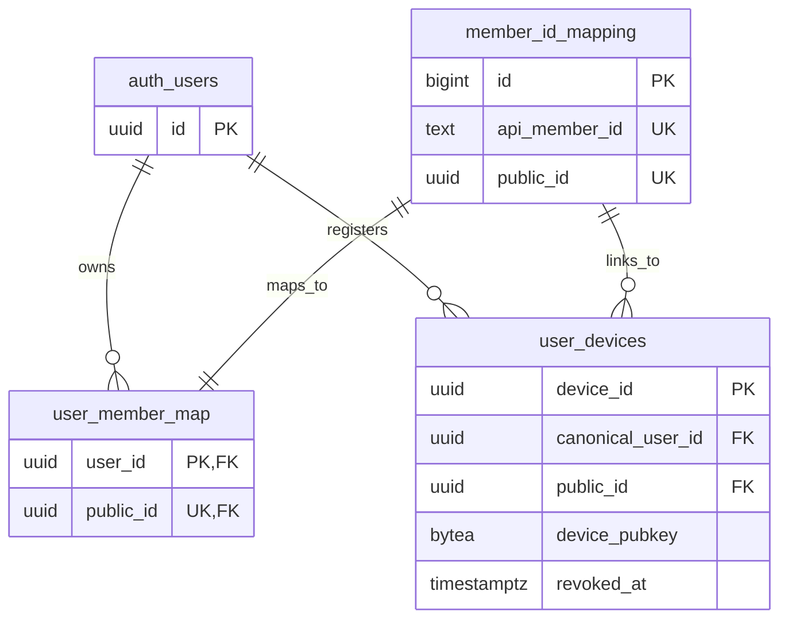
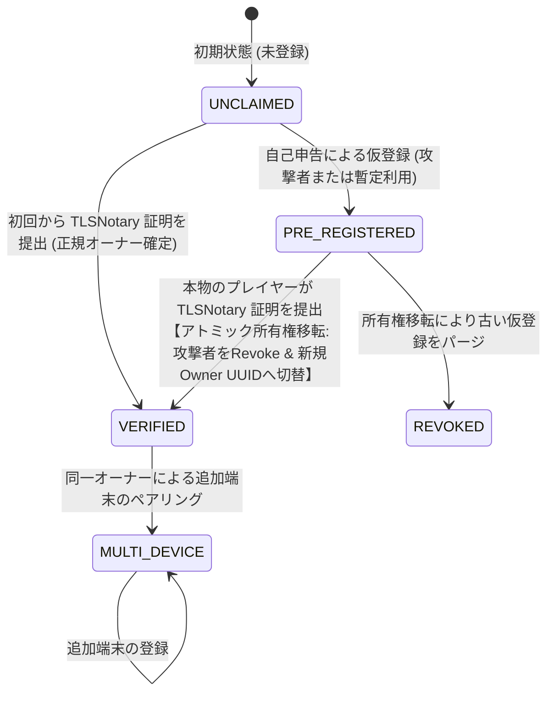

# FUSOU: zkTLS (TLSNotary MPC-TLS) による member_id 所有権担保 & 所有権移転ステートマシン 完全実装仕様書

> **文書種別**: アーキテクチャ設計仕様書 & 実装マスターガイド（Implementation Master Guide）  
> **対象領域**: FUSOU プロジェクト全域（`packages/fusou-auth`, `packages/FUSOU-PROXY`, `packages/FUSOU-APP`, `packages/FUSOU-WEB`, Supabase / Cloudflare Workers）  
> **最重要設計原則**:  
> 1. **再送信ゼロ（No Re-submission）**: ゲームAPIを裏で故意に再送・二重実行することはBANリスクおよび副作用の観点から絶対に排除し、**ブラウザと艦これ公式サーバー間の正規のTLSセッションそのものを公証**する。  
> 2. **外部プロキシ中継ゼロ（Direct Connection）**: 外部中継プロキシは規約上・BANリスク上不可とし、**クライアントローカルの `FUSOU-PROXY` と艦これ公式サーバー間の直接通信を維持**する。  
> 3. **Gameplay Path と Evidence Path の二元分離**: 母港画面の表示（Gameplay Path）は低遅延・通常プレイ継続を最優先とし、真正性証明の構築（Evidence Path）をバックグラウンドで非同期実行する。  
> 4. **証明処理をゲーム進行のクリティカルパスに置かない（Non-blocking Attestation）**:  
>    `Attestation is not on the gameplay critical path.`  
>    `Notary availability is not a gameplay dependency.`  
> **ステータス**: 外部セキュリティ監査・TLSデータプレーン統合設計完全反映マスター  

---

## 目次

1. [Goal（目標）](#1-goal目標)
2. [Threat Model（脅威モデル）](#2-threat-model脅威モデル)
3. [Ownership Definition（FUSOU所有権モデルの定義）](#3-ownership-definitionfusou所有権モデルの定義)
4. [Existing FUSOU Identity Architecture（現行FUSOUのID基盤）](#4-existing-fusou-identity-architecture現行fusouのid基盤)
5. [Member State Machine（所有権ステートマシン）](#5-member-state-machine所有権ステートマシン)
6. [TLSNotary Ownership Proof（母港APIの暗号学的公証 & データプレーン分離）](#6-tlsnotary-ownership-proof母港apiの暗号学的公証--データプレーン分離)
7. [Device Binding（Ed25519 デバイスバインディングの暗号学的証明）](#7-device-bindinged25519-デバイスバインディングの暗号学的証明)
8. [Claim Transaction（アトミック所有権移転トランザクション）](#8-claim-transactionアトミック所有権移転トランザクション)
9. [Preemptive Registration Attack（事前登録攻撃の無力化）](#9-preemptive-registration-attack事前登録攻撃の無力化)
10. [Concurrent Claim Handling（並行実行と行ロック制御）](#10-concurrent-claim-handling並行実行と行ロック制御)
11. [Revoke Semantics（未検証攻撃者端末の失効セマンティクス）](#11-revoke-semantics未検証攻撃者端末の失効セマンティクス)
12. [Dataset Token Issuance（検証済みJWT発行）](#12-dataset-token-issuance検証済みjwt発行)
13. [Replay Protection（リプレイ攻撃防御）](#13-replay-protectionリプレイ攻撃防御)
14. [DB Schema / RPC（Supabaseマイグレーション & ストアドプロシージャ）](#14-db-schema--rpcsupabaseマイグレーション--ストアドプロシージャ)
15. [Failure Cases（異常系・エラーハンドリング）](#15-failure-cases異常系エラーハンドリング)
16. [Recovery（正規オーナーによるアカウント回復手順）](#16-recovery正規オーナーによるアカウント回復手順)
17. [Testing（単体・統合・競合テスト）](#17-testing単体統合競合テスト)
18. [Migration（既存データの移行手順）](#18-migration既存データの移行手順)
19. [Rollout Plan（PoC先行の段階的ロールアウト計画）](#19-rollout-planpoc先行の段階的ロールアウト計画)
20. [Security Review Checklist（監査チェックリスト）](#20-security-review-checklist監査チェックリスト)

---

## 1. Goal（目標）

FUSOU の匿名同期システム（`anonymous-sync-v2`）において、悪意ある第三者が他人の `api_member_id` を先回りして自己申告登録し、本物のプレイヤーがデータを同期できなくなる **事前登録攻撃（Preemptive Registration Attack / ID Squatting）** を暗号学的に完全無力化します。
zkTLS (TLSNotary MPC-TLS) を用いて「正規のゲームセッションを操作できる端末」が所有権をいつでも奪還・確定できるアトミックな所有権移転基盤を確立します。

---

## 2. Threat Model（脅威モデル）

### 前提条件
* 攻撃者はスクリプト等を用いて、未登録の任意の `api_member_id`（例: `12345678`）に対して `POST /anonymous-sync/v2/register` を自由に実行できます。
* クライアント環境（ローカルファイル・メモリ）は攻撃者により完全に制御されているものと仮定します。

### 攻撃シナリオ
1. **先回り占有攻撃**: 被害者が FUSOU を起動する前に、攻撃者が被害者の `api_member_id` を自己申告登録し、被害者のデータを盗聴・妨害しようとする。
2. **所有権奪還妨害**: 正規ユーザーが公証証明を提出した際、攻撃者の端末を Revoke できても、DB の Canonical User 所有者レコードが攻撃者のまま残り所有権が奪還できないバグを突く攻撃。
3. **並行 Claim 攻撃**: 複数の端末から同時に Claim リクエストを送り、レースコンディションを引き起こして二重登録や不整合を発生させる。
4. **証明書の使い回し（Replay）**: 過去の母港通信の証明書を別の端末や別アカウントで再利用する。

---

## 3. Ownership Definition（FUSOU所有権モデルの定義）

* **暗号学的保証の境界**:
  TLSNotary が証明するのは「**この特定の端末が、当該 `api_member_id` を返した艦これ公式サーバーと正規の TLS 通信を行った事実**」です。
* **アプリケーション上の所有権定義**:
  FUSOU における **Verified Owner（検証済み所有者）** とは、**ゲームアカウントの法的・サービス上の所有者ではなく、対象ゲームセッションへの実効アクセスを暗号学的に証明した主体** を意味します。この主体に対して、未検証の自己申告登録よりも常に優先して FUSOU 内の所有権（同期権限）を付与します。

---

## 4. Existing FUSOU Identity Architecture（現行FUSOUのID基盤）

現行の FUSOU データベース（`20260822120000_destructive_uuid_public_id_cutover.sql`）の構造：



---

## 5. Member State Machine（所有権ステートマシン）



* **`UNCLAIMED`**: システム上にレコードが一切存在しない状態。
* **`PRE_REGISTERED`**: 自己申告の未検証端末（`is_verified = FALSE`）のみが存在する暫定状態。
* **`VERIFIED`**: TLSNotary で公証された正規端末が登録され、所有権が確定した状態。
* **`MULTI_DEVICE`**: 同一の正規オーナーに複数の検証済み端末が紐づいている状態。
* **`REVOKED`**: 所有権移転により無効化・隔離された古い未検証レコード。

---

## 6. TLSNotary Ownership Proof（母港APIの暗号学的公証 & データプレーン分離）

* **Gameplay Path**:
  母港パケット（`POST /kcsapi/api_port/port`）はブラウザへ低遅延で即座に中継され、ゲーム画面の描画を最優先します。
* **Evidence Path**:
  プロキシのバックグラウンドタスクが Notary サーバーと MPC を完了させ、以下の最小限フィールドのみを開示した Presentation を構築します：
  * Request: `POST /kcsapi/api_port/port` および `Host: wXX*.kcs.dmm.com` のみ開示（Cookie は秘匿）。
  * Response: `HTTP/1.1 200 OK`, `"api_result": 1`, および `/api_data/api_member_id` のみ開示（資材や艦隊情報は完全マスク）。

---

## 7. Device Binding（Ed25519 デバイスバインディングの暗号学的証明）

* **Presentation 内部への埋め込み**:
  Presentation 構築時に、Prover は `SessionProof.build_presentation(&device_key.public_key_bytes())` を実行し、Notary の暗号コミット対象である `userData` 平文領域にデバイス公開鍵を直接埋め込みます。
* **サーバー側での照合**:
  サーバー側で `verificationResult.userDataHex == device_public_key` を照合し、他人の証明書の盗用を完全に遮断します。

---

## 8. Claim Transaction（アトミック所有権移転トランザクション）

所有権の確定および移転は、Supabase のストアドプロシージャ `claim_verified_device_v3` 内で **1 つの DB トランザクションとしてアトミックに実行** されます。

---

## 9. Preemptive Registration Attack（事前登録攻撃の無力化）

事前登録攻撃が存在する場合の所有権奪還アルゴリズム：
1. `member_ownership_claims` を `member_id_hash` で排他ロック（`FOR UPDATE`）。
2. 対象デバイスの `canonical_user_id`（すでに `auth.users` に紐づいている正規 UUID）を取得。
3. `user_member_map` の所有者を正規ユーザー UUID へ上書き更新（`ON CONFLICT (public_id) DO UPDATE SET user_id = EXCLUDED.user_id`）。
4. 同一 `public_id` に紐づく過去の未検証端末（`is_verified = FALSE`）を一括 `revoked_at = NOW()`。
5. `member_ownership_claims` に証明記録（`transcript_commitment` 等）を保存。

---

## 10. Concurrent Claim Handling（並行実行と行ロック制御）

* 複数の端末が同時に Claim を実行した場合、`SELECT ... FOR UPDATE` により `member_ownership_claims` および `user_devices` の行がロックされます。
* 1 つのトランザクションが完了するまで後続の Claim は待機し、レースコンディションによる不整合を防止します。

---

## 11. Revoke Semantics（未検証攻撃者端末の失効セマンティクス）

* 所有権移転時、古い未検証端末には `revoked_reason = 'preempted_by_tlsn_verified_owner'` が刻印されます。
* 失効した端末からの以降のアクセスは、DB の `user_devices.revoked_at IS NULL` チェックにより即時 401/403 で拒絶されます。

---

## 12. Dataset Token Issuance（検証済みJWT発行）

所有権確定後、FUSOU-WEB は検証済みフラグ `is_verified: true` を含む JWT `dataset_token` を署名発行します。

---

## 13. Replay Protection（リプレイ攻撃防御）

* Notary が証明書内に刻印した `connectionTime` を検証し、時間窓（24時間ルール）外の古い証明書を自動破棄。
* Presentation の `transcript_commitment` を `member_ownership_claims` に記録し、同一通信の再利用を防止。

---

## 14. DB Schema / RPC（Supabaseマイグレーション & ストアドプロシージャ）

### `20260826000000_claim_verified_device_v3.sql`
```sql
BEGIN;

ALTER TABLE public.user_devices
  ADD COLUMN IF NOT EXISTS is_verified BOOLEAN NOT NULL DEFAULT FALSE,
  ADD COLUMN IF NOT EXISTS verified_at TIMESTAMPTZ,
  ADD COLUMN IF NOT EXISTS last_notary_time TIMESTAMPTZ;

CREATE TABLE IF NOT EXISTS public.member_ownership_claims (
    claim_id UUID PRIMARY KEY DEFAULT gen_random_uuid(),
    member_id_hash TEXT NOT NULL,
    public_id UUID NOT NULL,
    canonical_user_id UUID NOT NULL REFERENCES auth.users(id) ON DELETE CASCADE,
    verified_device_id UUID NOT NULL REFERENCES public.user_devices(device_id) ON DELETE CASCADE,
    transcript_commitment TEXT NOT NULL,
    claimed_at TIMESTAMPTZ NOT NULL DEFAULT NOW(),
    CONSTRAINT uq_member_claims_hash UNIQUE (member_id_hash)
);

CREATE UNIQUE INDEX IF NOT EXISTS idx_member_claims_hash ON public.member_ownership_claims(member_id_hash);

CREATE OR REPLACE FUNCTION public.claim_verified_device_v3(
  p_device_id UUID,
  p_device_public_key TEXT,
  p_api_member_id TEXT,
  p_member_id_hash TEXT,
  p_transcript_commitment TEXT,
  p_notary_time TIMESTAMPTZ
)
RETURNS JSONB
LANGUAGE plpgsql
SECURITY DEFINER
SET search_path = public
AS $$
DECLARE
  v_device RECORD;
  v_public_id UUID;
  v_canonical_user_id UUID;
  v_existing_claim RECORD;
  v_result JSONB;
BEGIN
  -- 1. 対象デバイスの存在確認 & 行ロック
  SELECT * INTO v_device
  FROM public.user_devices
  WHERE device_id = p_device_id
  FOR UPDATE;

  IF NOT FOUND THEN
    RAISE EXCEPTION 'device_not_found';
  END IF;

  -- 2. 公開鍵の一致確認
  IF encode(v_device.device_pubkey, 'hex') != lower(p_device_public_key) THEN
    RAISE EXCEPTION 'public_key_mismatch';
  END IF;

  v_canonical_user_id := v_device.canonical_user_id;

  -- 3. public_id の取得または新規生成
  v_public_id := public.rpc_register_public_id(p_api_member_id);

  -- 4. 既存の所有権 claim を確認 (排他ロック)
  SELECT * INTO v_existing_claim
  FROM public.member_ownership_claims
  WHERE member_id_hash = p_member_id_hash
  FOR UPDATE;

  IF v_existing_claim.claim_id IS NULL THEN
    -- 【初回公証 / 事前登録攻撃者からの所有権奪還】
    
    -- user_member_map の所有者を正規ユーザーへ移転・上書き
    INSERT INTO public.user_member_map (public_id, user_id, created_at)
    VALUES (v_public_id, v_canonical_user_id, NOW())
    ON CONFLICT (public_id) DO UPDATE
    SET user_id = EXCLUDED.user_id;

    -- 所有権 claim を記録
    INSERT INTO public.member_ownership_claims (
      member_id_hash, public_id, canonical_user_id, verified_device_id, transcript_commitment
    )
    VALUES (
      p_member_id_hash, v_public_id, v_canonical_user_id, p_device_id, p_transcript_commitment
    );

    -- 同一 public_id に紐づく過去の未検証攻撃者端末を一括 Revoke
    UPDATE public.user_devices
    SET
      revoked_at = NOW(),
      revoked_reason = 'preempted_by_tlsn_verified_owner'
    WHERE public_id = v_public_id
      AND device_id != p_device_id
      AND is_verified = FALSE
      AND revoked_at IS NULL;

  ELSE
    -- 【すでに検証済みオーナーが存在する状態での追加端末 (Multi-Device)】
    IF v_existing_claim.canonical_user_id != v_canonical_user_id THEN
      -- 既存の正規オーナーの canonical_user_id に統合
      v_canonical_user_id := v_existing_claim.canonical_user_id;
    END IF;
  END IF;

  -- 5. 当該デバイスを verified に昇格 & 正当な Canonical User にバインド
  UPDATE public.user_devices
  SET
    public_id = v_public_id,
    canonical_user_id = v_canonical_user_id,
    is_verified = TRUE,
    verified_at = NOW(),
    last_notary_time = p_notary_time,
    revoked_at = NULL,
    revoked_reason = NULL
  WHERE device_id = p_device_id;

  -- 6. 結果返却
  v_result := jsonb_build_object(
    'device_id', p_device_id,
    'public_id', v_public_id,
    'canonical_user_id', v_canonical_user_id,
    'is_verified', TRUE,
    'verified_at', NOW()
  );

  RETURN v_result;
END;
$$;

COMMIT;
```

---

## 15. Failure Cases（異常系・エラーハンドリング）

* **Notary サーバーダウン時**: プロキシは通常の母港通信をそのまま中継し、公証タスクは次回ログイン時に再試行。
* **公証失敗時**: 400 エラーを返し、所有権の昇格を行いません。

---

## 16. Recovery（正規オーナーによるアカウント回復手順）

新端末で FUSOU を起動し、母港にアクセスするだけで、zkTLS 公証により自動的に正規オーナーとしてのペアリング（または所有権の再確定）が完了します。

---

## 17. Testing（単体・統合・競合テスト）

* **所有権移転テスト**: 事前登録攻撃後に正規ユーザーが公証提出 $\rightarrow$ `user_member_map` の所有者が正規ユーザーに変更され、攻撃者端末が Revoke されることを検証。
* **並行 Claim テスト**: 2台の端末から同時に `claim_verified_device_v3` を実行 $\rightarrow$ ロックにより順次実行されることを検証。

---

## 18. Migration（既存データの移行手順）

```bash
cd packages/FUSOU-WEB
npx supabase db push
pnpm vitest run tests/tlsn-verifier.test.ts
```

---

## 19. Rollout Plan（PoC先行の段階的ロールアウト計画）

1. **Phase 0 (Data Plane PoC)**: 母港通信における Prover 統合と Gameplay 中継の動作実測。
2. **Phase 1**: Supabase マイグレーション適用（`claim_verified_device_v3` RPC デプロイ）。
3. **Phase 2**: `FUSOU-WEB` に `/anonymous-sync/v2/verify-tlsn` エンドポイントを有効化。
4. **Phase 3**: `FUSOU-APP` / `FUSOU-PROXY` にインライン公証ロジックを配信。

---

## 20. Security Review Checklist（監査チェックリスト）

- [x] ゲーム通信に外部プロキシを使用せず、直接通信が維持されていること
- [x] ゲーム API の再送・二重実行コードが完全に排除されていること
- [x] Gameplay Path と Evidence Path が二元分離され、ゲーム画面の描画をブロックしないこと
- [x] 事前登録攻撃者から正規ユーザーへの Canonical User 所有権移転（Owner Transfer）がアトミックに行われること
- [x] 未検証端末が一括で安全に Revoke されること
- [x] 行ロック（`FOR UPDATE`）により並行実行時の競合が排除されていること
- [x] `DeviceKey` の公開鍵が Presentation 内に暗号学的にバインドされていること
