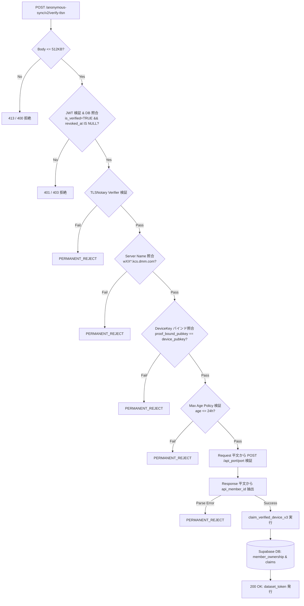

# FUSOU: zkTLS (TLSNotary MPC-TLS) による member_id 暗号学的公証収集 & サーバーサイド検証仕様書 (v1 Scope)

> **文書種別**: アーキテクチャ設計仕様書 & 実装マスターガイド（Implementation Master Guide）  
> **対象領域**: FUSOU プロジェクト全域（`packages/fusou-auth`, `packages/fusou-proxy-core`, `packages/fusou-proxy-hudsucker`, `packages/fusou-proxy-tlsn`, `packages/fusou-telemetry`, `packages/FUSOU-WEB`, Supabase / Cloudflare Workers / Dedicated Verifier Service）  
> **v1 Security Goal**:  
> **「FUSOU-WEB が採用する `api_member_id` が、本当に信頼対象のゲームサーバーから返された値であることを暗号学的に検証する」**  
> 対象 API: **`POST /kcsapi/api_port/port`**  
> 対象データ: **`/api_data/api_member_id`** のみ（戦闘結果、ドロップ、建造、開発等のその他テレメトリは v1 では暗号学的公証の対象外とし、将来拡張領域とする）。  
> **最重要設計原則**:  
> 1. **再送信ゼロ（No Re-submission）**: 母港 API（`api_port/port`）を裏で故意に再送・二重実行することは絶対に排除し、**実際のユーザー操作による 1 回限りの TLS 通信そのものを公証**する。  
> 2. **外部ゲーム通信プロキシ中継ゼロ（Direct Connection）**: 外部中継プロキシは規約上・BANリスク上不可とし、**クライアントローカルの `FUSOU-PROXY` と艦これ公式サーバー間の直接通信を維持**する。  
> 3. **Gameplay Path と Evidence Path の二元分離（Proof 完了待ちの完全排除）**: 母港画面のブラウザ表示（Gameplay Path）のために Proof 完成を待たせない。通常ゲーム API は通常 TLS 経路、母港 API のみ TLSNotary 対応経路を通すが、レスポンス受信時点でブラウザへ即座に中継し、公証（Evidence Path）はバックグラウンドで非同期実行する。  
> 4. **Selective Disclosure（0.5MB レスポンスの最小限開示）**: 500KB に達する母港レスポンス全体を FUSOU-WEB へ送信・開示せず、TLSNotary の selective disclosure により `/api_data/api_member_id` の Byte Range のみを開示する。  
> 5. **EvidenceFrame と TLSNotary Proof の責務分離（Security Authority の明確化）**:  
>    `EvidenceFrame` はクライアント内部のローカル相関メタデータ（Local Correlation Metadata）に過ぎず、サーバーはこれを一切信用しない。**サーバーサイドの唯一のセキュリティ決定権（Security Authority）は TLSNotary Presentation Verification の Verified Opening Bytes にある**。  
> 6. **厳格なサーバーサイド カノニカル パース（Strict Server-Side Canonical Parsing）**:  
>    クライアント申告のメタデータ（`api_path`, 自称 `member_id`）を完全無視し、**Verified Opening Bytes から直接 `HTTP request/response parser -> svdata framing -> JSON parser with source spans -> JSON Pointer -> Zod schema validation` のパイプラインで正規 `api_member_id` を抽出**する。  
> 7. **Rust クレートのモジュール分割 & Trait 分離**:  
>    `UpstreamTransport`（純粋なHTTP送受信）と `EvidenceObserver` を Trait 境界で完全分離し、Phase 0 完了まで `fusou-proxy-tlsn` は experimental crate（PoC専用）として本番 Gameplay Path からは有効化しない。  
> 8. **Phase 0 PoC（ADR-000）先行検証の必須化**:  
>    母港 API（`api_port/port`）1 本に絞った実測 PoC を通過するまで本番実装を凍結する。公式 `tlsn-extension` の `prove()` / `compute_reveal()` / handler 機構を参考実装として調査・流用する。  
> 9. **検証実行環境の選定（Cloudflare Workers vs Dedicated Rust Verifier）**:  
>    WASM Verifier の Cloudflare Workers での実行負荷（CPU/メモリ/タイムアウト）を PoC で測定し、必要に応じて専用の Rust ネイティブ Verifier サービスへのオフロード構成を選択可能とする。  
> **ステータス**: v1 member_id 特化・Selective Disclosure・Security Authority 明確化マスター  

---

## 目次

1. [Goal & Scope (v1における公証対象の限定)](#1-goal--scope-v1における公証対象の限定)
2. [Threat Model（脅威モデル）](#2-threat-model脅威モデル)
3. [Trust Boundary & Security Guarantees（信頼境界図 & データの真正性モデル）](#3-trust-boundary--security-guarantees信頼境界図--データの真正性モデル)
4. [Current FUSOU Architecture & TLS Terminationの根本的課題](#4-current-fusou-architecture--tls-terminationの根本的課題)
5. [Target Architecture & Data Flow（Gameplay Path と Evidence Path の二元分離）](#5-target-architecture--data-flowgameplay-path-と-evidence-path-の二元分離)
6. [External Proxyを使わない理由（Why No External Proxy）](#6-external-proxyを使わない理由why-no-external-proxy)
7. [Rust Workspace クレート分割設計（Core, Hudsucker, TLSN, Telemetry）](#7-rust-workspace-クレート分割設計core-hudsucker-tlsn-telemetry)
8. [ADR-000: TLS Data Plane Integration & Feasibility PoC (Port API 特化)](#8-adr-000-tls-data-plane-integration--feasibility-poc-port-api-特化)
   - 8.1 [ADR-000 の背景と 0.5MB レスポンスの扱い](#81-adr-000-の背景と-05mb-レスポンスの扱い)
   - 8.2 [検証対象アーキテクチャ候補（Case A 〜 Case D）](#82-検証対象アーキテクチャ候補case-a--case-d)
   - 8.3 [Phase 0 PoC 実測検証計画 (全20項目) & Target SLA Gate](#83-phase-0-poc-実測検証計画-全20項目--target-sla-gate)
   - 8.4 [参考実装: 公式 tlsn-extension の prove() / compute_reveal() 機構の調査](#84-参考実装-公式-tlsn-extension-の-prove--compute_reveal-機構の調査)
9. [Attestation Data Model（in-toto Statement v1 ベース Envelope仕様）](#9-attestation-data-modelin-toto-statement-v1-ベース-envelope仕様)
10. [Strict Server-Side Canonical Member-ID Extraction（厳格な多段パース仕様）](#10-strict-server-side-canonical-member-id-extraction厳格な多段パース仕様)
11. [Selective Disclosure & Offset Mapping（0.5MB レスポンスからのピンポイント開示）](#11-selective-disclosure--offset-mapping05mb-レスポンスからのピンポイント開示)
12. [Device Binding & Triple Owner Invariant（デバイスバインディングと所有権不変条件）](#12-device-binding--triple-owner-invariantデバイスバインディングと所有権不変条件)
13. [Replay & Event Identity Protection（Length-Delimited Hash & 重複排除）](#13-replay--event-identity-protectionlength-delimited-hash--重複排除)
14. [Server-side Verification Pipeline & Runtime Execution Environments](#14-server-side-verification-pipeline--runtime-execution-environments)
    - 14.1 [検証パイプライン詳細フロー](#141-検証パイプライン詳細フロー)
    - 14.2 [検証実行環境の選定: Cloudflare Workers vs Dedicated Rust Verifier](#142-検証実行環境の選定-cloudflare-workers-vs-dedicated-rust-verifier)
15. [DB Schema（Supabaseマイグレーション & RLS設計）](#15-db-schemasupabaseマイグレーション--rls設計)
16. [Queue / Retry Design（SQLite永続キュー・4状態エラー分類・Quarantine）](#16-queue--retry-designsqlite永続キュー4状態エラー分類quarantine)
17. [Failure Handling & Fallback Semantics（リクエスト送信前後の二段階フォールバック）](#17-failure-handling--fallback-semanticsリクエスト送信前後の二段階フォールバック)
18. [Privacy（プライバシー保護とCookie秘匿）](#18-privacyプライバシー保護とcookie秘匿)
19. [Rate Limiting / DoS（DoS耐性とリソース制限）](#19-rate-limiting--dosdos耐性とリソース制限)
20. [Testing（単体・統合・攻撃回帰テスト）](#20-testing単体統合攻撃回帰テスト)
21. [Migration & Rollout Plan（PoC先行の段階的ロールアウト計画）](#21-migration--rollout-planpoc先行の段階的ロールアウト計画)
22. [Security Progress Checklist（開発進捗チェックリスト）](#22-security-progress-checklist開発進捗チェックリスト)

---

## 1. Goal & Scope (v1における公証対象の限定)

### 1.1 v1 Security Goal
FUSOU v1 における暗号学的真正性保証のスコープは以下に限定します：

> **「FUSOU-WEB が採用する `api_member_id` が、本当に信頼対象の艦これ公式ゲームサーバーから返された値であることを暗号学的に検証する」**

* **公証対象 API**: `POST /kcsapi/api_port/port`（母港 API）
* **公証対象データ**: `/api_data/api_member_id`（提督 ID）

### 1.2 将来拡張領域（v1 では公証対象外）
以下のテレメトリデータについては、v1 では暗号学的公証を行わず、従来のプロキシ経由で受信・集計します：
* 戦闘リザルト（`battleresult`）、ドロップ艦データ
* 艦隊編成、装備改修・開発、建造、資源推移
* その他すべての通常ゲーム通信

これにより、ゲーム中のあらゆる通信で MPC が発生することを防ぎ、システム負荷・遅延リスク・実装複雑性を最小化します。

---

## 2. Threat Model（脅威モデル）

### 前提条件（Client Untrusted Principle）
ユーザー環境（PC、OS、ローカルファイル、メモリ、実行バイナリ）は**攻撃者によって完全に制御・改変され得る**ことを前提とします。
FUSOU.exe 自体の改ざん防止やメモリ保護をセキュリティの根拠にしてはなりません。

### 想定される攻撃シナリオ
* **Attack A（自称 `member_id` 詐称）**: クライアントが他人の `member_id` を JSON で自称して送信する。
* **Attack B（パース済みデータのみ改ざん）**: 暗号証明は本物のまま、メタデータや添付の `member_id` のみを改ざんして送信する。
* **Attack C（エンドポイント偽装）**: 母港 API 以外の別 API（編成等）の証明書を提出する。
* **Attack D（未登録・失効端末からの送信）**: 登録されていない、または失効（Revoke）済みの端末からデータを送信する。
* **Attack E（同一 Presentation のリプレイ）**: 過去の母港証明書をコピーし、何回も再送して他人のアカウントを Claim しようとする。
* **Attack F（異なる Presentation の再生成リプレイ）**: 同一セッションから別の開示範囲で Presentation を再生成して多重送信する。
* **Attack G（古い証明書の遅延提出）**: 数ヶ月前の過去の証明書を保管し、後から送信する。

---

## 3. Trust Boundary & Security Guarantees（信頼境界図 & データの真正性モデル）

```
                     UNTRUSTED ZONE
┌────────────────────────────────────────────────────────┐
│ User PC (Client Environment)                           │
│                                                        │
│  - FUSOU binary (Tamperable)                           │
│  - Local Memory / Process (Inspectable)                │
│  - Local SQLite DB (Modifiable)                        │
│  - Browser / OS (Untrusted)                            │
│  - EvidenceFrame (Local Correlation Metadata Only)     │
│                                                        │
│  Client-provided metadata = NEVER trusted              │
└───────────────────────────┬────────────────────────────┘
                            │
                            │ 1. TLSNotary Presentation (MPC-TLS)
                            │ 2. Ed25519 Device Signature
                            ▼
═════════════════════ TRUST BOUNDARY ═════════════════════
                            │
                            ▼
┌────────────────────────────────────────────────────────┐
│ FUSOU-WEB Verifier (Workers or Dedicated Rust Verifier)│
│                                                        │
│  - Verify Web PKI Certificate Chain                    │
│  - Verify TLSNotary Notary Signature & Merkle Root     │
│  - Verify Device Binding (Proof-bound Metadata Match)  │
│  - Strict Server-Side Canonical Parser (Zod)           │
│                                                        │
│  Security Authority = TLSNotary Verified Opening Bytes │
│  Canonical Parser Output = TRUSTED representation      │
└───────────────────────────┬────────────────────────────┘
                            │
                            ▼
┌────────────────────────────────────────────────────────┐
│ Supabase Database (Trusted Core Storage)               │
│                                                        │
│  - Verified Member Ownership Record                    │
│  - Row Level Security (RLS) Enforced                   │
│                                                        │
│  Stored State = ACCEPTED Verified Ownership Only       │
└────────────────────────────────────────────────────────┘
```

### Security Guarantees（提供される保証）
* **保証すること**:
  > FUSOU-WEB へ採用された `api_member_id` は、TLSNotary Verification により、信頼対象の Game Server との検証済み TLS transcript に実際に存在する値である。
* **保証しないこと**:
  * FUSOU.exe / OS / Browser が改造されていないこと
  * Browser へ返されたレスポンスが改ざんされていないこと（Gameplay Path は保証外）
  * Game Server そのものが正しいデータを返していること
  * 攻撃者が正規 Game Server との通信を行うこと自体の防止

---

## 4. Current FUSOU Architecture & TLS Terminationの根本的課題

現行の `FUSOU-PROXY` は HUDSucker ベースの MITM プロキシです：
```
[Browser] <--- (Downstream TLS: ローカル独自CA) ---> [HUDSucker Proxy] <--- (Upstream TLS: 通常のTLS Client) ---> [Game Server]
```

### 根本的課題
HUDSucker は Upstream 側 TLS 接続においてセッション鍵を単独で保持しているため、クライアントが単独で鍵を知っている状態で後から公証を作れるとすれば、改造されたクライアントはレスポンスを改ざんした上で暗号署名できてしまいます。
したがって、**母港通信（`api_port/port`）に限り、Upstream 側 TLS トランスポートを MPC-TLS Prover トランスポートへ切り替える**必要があります。

---

## 5. Target Architecture & Data Flow（Gameplay Path と Evidence Path の二元分離）

```
[艦これ公式サーバー (*.kcs.dmm.com)]
         ▲
         │ 1. 実際のTLSセッション (Direct 2PC-TLS Connection)
         │    ※再送信ゼロ・外部プロキシ中継ゼロ
         ▼
 ┌────────────────────────────────────────────────────────┐
 │ fusou-proxy-tlsn (MPC-TLS Prover Engine: /port 専用)   │
 │                                                        │
 │  [Online Decryption / Tee Stream]                      │
 │       │                                                │
 │       ├─ (平文ストリームをブラウザへ即座に中継)         │
 │       │                                                │
 │       ▼ (ローカル相関用メタデータ)                      │
 │  EvidenceFrame { transcript_id, range, bytes }         │
 │       │                                                │
 └───────┼────────────────────┬───────────────────────────┘
         │                    │ (Gameplay Stream: 即時返却)
         ▼                    ▼
 ┌────────────────────┐ ┌─────────────────────────────────┐
 │ Evidence Path      │ │ Gameplay Path                   │
 │ (真正性保証対象)   │ │ (真正性保証外・低遅延)           │
 │                    │ │                                 │
 │ 2. 非同期 MPC 公証 │ │ 2. fusou-proxy-hudsucker        │
 │    (tokio::spawn)  │ │    (Downstream MITM TLS)        │
 │        ▼           │ │        ▼                        │
 │  [Notary Server]   │ │  [艦これブラウザ画面: 即座に描画]│
 │        ▼           │ └─────────────────────────────────┘
 │  [TelemetryQueue]  │
 │   (fusou-telemetry)│
 │        ▼           │
 │ 3. in-toto Envelope│
 │    バッチ送信      │
 │        ▼           │
 │  [FUSOU-WEB]       │
 │  (TLSNotary Verify)│
 │        ▼           │
 │  [Supabase DB]     │
 └────────────────────┘
```

> **Proof 完成待ちの完全排除**:  
> 母港レスポンス平文を受信した時点で、プロキシはブラウザへデータを即座に中継します。TLSNotary の Notary 署名や Proof 生成の完了を待ってブラウザをブロックすることは絶対にありません。

---

## 6. External Proxyを使わない理由（Why No External Proxy）

1. **DMM利用規約およびアカウントBANリスクの回避**:
   外部プロキシ経由はデータセンターIPとなり、ゲーム運営による不正検知（アカウント凍結）の対象となります。
2. **プライバシー保護**:
   セッショントークンやCookieが第三者サーバーを通過することを防ぎます。
3. **結論**:
   通信は**ユーザーPCから艦これ公式サーバーへの完全直接接続（Direct 2PC-TLS Connection）**を維持します。

---

## 7. Rust Workspace クレート分割設計（Core, Hudsucker, TLSN, Telemetry）

```
packages/
├── fusou-auth/               # [既存] DeviceKey / Ed25519 署名 / Token管理
├── fusou-proxy-core/         # [NEW] Proxy ライフサイクル・HTTP 抽象化・UpstreamTransport / EvidenceObserver Trait
├── fusou-proxy-hudsucker/    # [MODIFY] 通常ゲーム通信用 MITM プロキシ実装 (低遅延最優先)
├── fusou-proxy-tlsn/         # [NEW] TLSNotary Prover / /port 専用 MPC-TLS Upstream トランスポート（PoC対象）
├── fusou-telemetry/          # [NEW] member_id 公証イベントモデル・SQLite キュー・in-toto Envelope
└── FUSOU-APP/                # [MODIFY] Composition Root (DI コンテナとして各クレートを結合)
```

### Trait 境界による完全分離 & `EvidenceFrame`
```rust
// packages/fusou-proxy-core/src/transport.rs

use async_trait::async_trait;
use bytes::Bytes;
use hyper::{Request, Response, HeaderMap, body::Incoming};

#[async_trait]
pub trait UpstreamTransport: Send + Sync {
    /// サーバーへリクエストを送信し、Gameplay レスポンスを返却 (純粋なHTTP送受信)
    async fn send_request(
        &mut self,
        req: Request<Incoming>,
    ) -> Result<Response<Incoming>, ProxyTransportError>;
}

#[derive(Debug, Clone, Copy, PartialEq, Eq)]
pub enum TranscriptDirection {
    Sent,
    Received,
}

#[derive(Debug, Clone)]
pub struct TranscriptRange {
    pub direction: TranscriptDirection,
    pub start: u64,
    pub end: u64,
}

/// クライアント側ローカルイベント相関用メタデータ (Security Authority ではない)
pub struct EvidenceFrame {
    pub transcript_id: String,
    pub http_message_id: String,
    pub range: TranscriptRange,
    pub raw_bytes: Bytes,
    pub http_headers: HeaderMap,
}

/// 公証観測用インターフェース (Core は Evidence の具体実装を知らない)
#[async_trait]
pub trait EvidenceObserver: Send + Sync {
    async fn observe_frame(&self, frame: EvidenceFrame) -> Result<(), EvidenceError>;
}
```

---

## 8. ADR-000: TLS Data Plane Integration & Feasibility PoC (Port API 特化)

### 8.1 ADR-000 の背景と 0.5MB レスポンスの扱い
母港 API（`/kcsapi/api_port/port`）のレスポンスは最大 0.5MB（500KB）程度に達します。
TLSNotary の以下の設定パラメータを考慮し、最適なデータプレーン構成を Phase 0 PoC で検証します：
* `max_recv_data`: セッション全体の受信上限（512KB〜1MB に設定）。
* `max_recv_data_online`: TLS 接続中に MPC で復号する上限。
* `defer_decryption_from_start`: Application Data の復号を接続終了後に延期可能。

**原則**:
* 500KB 全体を online MPC decryption に入れず、必要なデータのみを処理する構成を検討。
* レスポンス受信後にブラウザへ即時返却しつつ、バックグラウンドで selective disclosure を実行できるかを実測する。

### 8.2 検証対象アーキテクチャ候補（Case A 〜 Case D）
* **Case A (MPC-TLS Upstream + Online Decryption)**: Upstream を MPC-TLS Prover で終端し、オンライン復号ストリームからブラウザへ中継。
* **Case B (MPC-TLS Deferred Decryption)**: 接続終了後に復号する方式（ブラウザ表示の体感遅延を実測評価）。
* **Case C (Existing TLS Gameplay + Same-Session Evidence Capture)**: 通常 TLS でブラウザ中継しつつ、同一セッションから安全に公証を分離できるか検証。
* **Case D (TLSNotary 最新機能 / Proxy-TLS ローカルループバック等)**: 最新の TLSNotary 機能を活用したローカル構成。

### 8.3 Phase 0 PoC 実測検証計画 (全20項目) & Target SLA Gate
母港 API（`POST /kcsapi/api_port/port`）1 本に絞り、ローカル mock サーバーに対して以下の全 20 項目の検証を実施します：

1. FUSOU local proxy から Game Server への直接接続（Direct Connection）
2. API request が 1 回だけ送信されること（No Re-submission）
3. TLSNotary Prover がその request を正常に処理できること
4. response を Browser へ即座に返却できること
5. Browser-visible latency の測定（Proof 完了時間と分離測定）
6. response size 500KB における安定性
7. selective disclosure による `/api_data/api_member_id` のみのピンポイント抽出
8. request path（`POST /kcsapi/api_port/port`）のサーバー側検証
9. server name（`wXX*.kcs.dmm.com`）の検証
10. Device binding（Proof-bound Metadata による公開鍵バインド）
11. Presentation generation の正常完了
12. remote verification の動作確認
13. duplicate proof rejection の確認
14. Notary outage before request（リクエスト送信前障害時の通常 TLS 切替）
15. Notary outage after request（リクエスト送信後障害時のゲーム継続・公証破棄）
16. Keep-Alive 接続の維持
17. chunked response の境界解釈
18. gzip response の展開とオフセットマッピング
19. malformed response に対するエラーハンドリング
20. FUSOU-WEB での canonical member_id 抽出成功

| レスポンスサイズ | 通常 TLS /port | TLSNotary /port (Target SLA) |
|:---:|:---:|:---:|
| 50 KB | 基準値 | **+50ms 以内** |
| 100 KB | 基準値 | **+100ms 以内** |
| 250 KB | 基準値 | **+200ms 以内** |
| 500 KB | 基準値 | **+300ms 以内** (P95) |

### 8.4 参考実装: 公式 tlsn-extension の prove() / compute_reveal() 機構の調査
TLSNotary 公式の `tlsn-extension` におけるパイプライン（`prove()` $\rightarrow$ `TLS request` $\rightarrow$ `transcript capture` $\rightarrow$ `compute_reveal()` $\rightarrow$ `handler` $\rightarrow$ `byte ranges` $\rightarrow$ `proof`）を徹底調査し、FUSOU 独自の Byte Range 算出コードを最小化して安全に流用・統合します。

---

## 9. Attestation Data Model（in-toto Statement v1 ベース Envelope仕様）

```json
{
  "_type": "https://in-toto.io/Statement/v1",
  "subject": [
    {
      "name": "kancolle-member-identity",
      "digest": {
        "sha256": "8f4e2b... (canonical_member_id_hash)"
      }
    }
  ],
  "predicateType": "https://fusou.dev/attestation/kancolle-member-ownership/v1",
  "predicate": {
    "schema_version": 1,
    "server_name": "w01y.kcs.dmm.com",
    "transcript_commitment": "3a7c9f... (lowercase hex without 0x prefix)",
    "notary_time": "2026-08-27T03:00:00Z",
    "device": {
      "device_id": "00000000-0000-4000-8000-000000000000",
      "device_public_key": "hex-encoded-32-byte-ed25519-pubkey"
    },
    "tls_notary": {
      "presentation_data": "base64-encoded-presentation-bytes"
    }
  }
}
```

---

## 10. Strict Server-Side Canonical Member-ID Extraction（厳格な多段パース仕様）

クライアント申告の `member_id` や `api_path` を一切信用せず、Verified Opening Bytes から以下の厳格な多段パイプラインで正規 `api_member_id` を抽出します：

```typescript
// packages/FUSOU-WEB/src/server/utils/member_id_parser.ts

import { z } from 'zod';

const CanonicalMemberIdSchema = z.object({
  api_path: z.literal('/kcsapi/api_port/port'),
  api_member_id: z.string().regex(/^[0-9]+$/),
});

export type CanonicalMemberIdResult = z.infer<typeof CanonicalMemberIdSchema>;

export function parseCanonicalMemberId(
  revealedReq: Uint8Array,
  revealedRecv: Uint8Array
): CanonicalMemberIdResult {
  // 1. Request 平文から api_path を直接検証
  const reqStr = new TextDecoder().decode(revealedReq);
  const matchReq = reqStr.match(/^POST\s+(\/kcsapi\/api_[a-z0-9_]+(?:\/[a-z0-9_]+)?)\s+HTTP\/1\.[01]/m);
  if (!matchReq || matchReq[1] !== '/kcsapi/api_port/port') {
    throw new Error('invalid_or_unauthorized_request_path');
  }

  // 2. Response 平文から HTTP Body を取得し、厳格に svdata= を検証
  const recvStr = new TextDecoder().decode(revealedRecv);
  const headerEnd = recvStr.indexOf('\r\n\r\n');
  if (headerEnd === -1) throw new Error('http_headers_malformed');

  const bodyStr = recvStr.slice(headerEnd + 4).trim();
  if (!bodyStr.startsWith('svdata=')) {
    throw new Error('svdata_prefix_missing_at_body_start');
  }

  const jsonStr = bodyStr.slice(7).trim();
  const rawJson = JSON.parse(jsonStr);

  if (rawJson.api_result !== 1) {
    throw new Error('api_result_not_ok');
  }

  const rawMemberId = rawJson.api_data?.api_member_id;
  if (!rawMemberId) {
    throw new Error('api_member_id_missing');
  }

  // 3. Zod による厳格なバリデーション
  return CanonicalMemberIdSchema.parse({
    api_path: matchReq[1],
    api_member_id: String(rawMemberId),
  });
}
```

---

## 11. Selective Disclosure & Offset Mapping（0.5MB レスポンスからのピンポイント開示）

500KB の母港レスポンス全体を開示せず、以下の確定的 Offset Mapping により `/api_data/api_member_id` の Byte Range のみを開示します：

```
[TLS Plaintext Offset]
       ↓ (HTTP Header 読了)
[HTTP Response Body Offset]
       ↓ (+7 bytes "svdata=")
[svdata JSON Payload Offset]
       ↓ (JSON Parser with Source Spans / compute_reveal)
[JSON Pointer Match: /api_data/api_member_id]
       ↓ (Span Start Offset .. Span End Offset)
[TLSNotary Reveal Byte Range (数バイト〜数十バイトのみ)]
```

開示対象（Selective Disclosure 範囲）：
* **Request**: `POST /kcsapi/api_port/port HTTP/1.1`, `Host: wXX.kcs.dmm.com`
* **Response**: `HTTP/1.1 200 OK`, `svdata={"api_result":1,"api_data":{"api_member_id":<REVEALED>}}`

---

## 12. Device Binding & Triple Owner Invariant（デバイスバインディングと所有権不変条件）

* **Proof-bound Metadata Binding**:
  TLSNotary の Proof 生成機構が提供する application data / user data binding 機構を調査し、`device_public_key` を Proof に暗号学的にバインドします（Phase 0 PoC 検証項目）。
* **Currently Trusted Device の定義**:
  DB の `user_devices` テーブル上で `device_id` が存在し、**`is_verified = TRUE AND revoked_at IS NULL`** であること。
* **Triple Owner Invariant の維持**:
  $$\text{member\_ownership.verified\_user\_id} \equiv \text{user\_devices.canonical\_user\_id} \equiv \text{user\_member\_map.user\_id}$$

---

## 13. Replay & Event Identity Protection（Length-Delimited Hash & 重複排除）

### 13.1 Length-Delimited Deterministic Event ID
境界曖昧性を排除するため、以下の Length-Delimited エンコーディングで決定論的ハッシュを生成します：

$$\text{canonical\_event\_id} = \text{SHA256}(\text{len}(public\_id) \Vert public\_id \Vert \text{len}(tc) \Vert tc \Vert \text{len}(req) \Vert req \Vert \text{len}(res) \Vert res \Vert \text{len}(payload) \Vert payload)$$

* `transcript_commitment (tc)`: `lowercase hex without 0x prefix`
* `request_hash (req)`: `SHA256(raw_revealed_request_bytes)`
* `response_hash (res)`: `SHA256(raw_revealed_response_bytes)`
* `canonical_payload_hash (payload)`: `SHA256(canonical_member_id_bytes)`

### 13.2 Maximum Age Acceptance Policy (Freshness Window)
* `notary_time` が 24 時間以上前の古い証明書は、リプレイ防止ではなく「受理可能な証明の最大年齢ポリシー」として自動破棄します。

---

## 14. Server-side Verification Pipeline & Runtime Execution Environments

### 14.1 検証パイプライン詳細フロー



### 14.2 検証実行環境の選定: Cloudflare Workers vs Dedicated Rust Verifier
1. **Option A (Cloudflare Workers + WASM Verifier)**:
   Workers 内で `@tlsnotary/tlsn-js` または `tlsn-verifier-wasm` を直接実行。
2. **Option B (Dedicated Rust Verifier Service: 推奨フォールバック)**:
   `FUSOU-APP -> TLSNotary Verifier Service (Rust Native / Cloud Run / Fly.io) -> FUSOU-WEB (HMAC/署名付き認証チャネル) -> Supabase`。
   * Verifier Service は検証結果に HMAC / Ed25519 署名を付与し、FUSOU-WEB が改ざんを検知可能とします。

---

## 15. DB Schema（Supabaseマイグレーション & RLS設計）

### `20260826000000_claim_verified_device_v3.sql`
```sql
BEGIN;

ALTER TABLE public.user_devices
  ADD COLUMN IF NOT EXISTS is_verified BOOLEAN NOT NULL DEFAULT FALSE,
  ADD COLUMN IF NOT EXISTS verified_at TIMESTAMPTZ,
  ADD COLUMN IF NOT EXISTS last_notary_time TIMESTAMPTZ;

-- 1. 現在の検証済み所有者テーブル (Current Ownership State)
CREATE TABLE IF NOT EXISTS public.member_ownership (
    public_id UUID PRIMARY KEY REFERENCES public.member_id_mapping(public_id) ON DELETE RESTRICT,
    member_id_hash TEXT NOT NULL UNIQUE,
    member_id_hash_version INT NOT NULL DEFAULT 1,
    verified_user_id UUID NOT NULL REFERENCES auth.users(id) ON DELETE RESTRICT,
    primary_device_id UUID NOT NULL REFERENCES public.user_devices(device_id) ON DELETE RESTRICT,
    established_at TIMESTAMPTZ NOT NULL DEFAULT NOW(),
    updated_at TIMESTAMPTZ NOT NULL DEFAULT NOW()
);

-- 2. 所有権 Claim 監査履歴テーブル (通常アプリケーション経路でUPDATE/DELETE禁止のAppend-Only Audit Trail)
CREATE TABLE IF NOT EXISTS public.member_ownership_claims (
    claim_id UUID PRIMARY KEY DEFAULT gen_random_uuid(),
    public_id UUID NOT NULL REFERENCES public.member_id_mapping(public_id) ON DELETE RESTRICT,
    member_id_hash TEXT NOT NULL,
    member_id_hash_version INT NOT NULL DEFAULT 1,
    canonical_user_id UUID NOT NULL REFERENCES auth.users(id) ON DELETE RESTRICT,
    verified_device_id UUID NOT NULL REFERENCES public.user_devices(device_id) ON DELETE RESTRICT,
    transcript_commitment TEXT NOT NULL,
    notary_time TIMESTAMPTZ NOT NULL,
    notary_key_id TEXT,
    claim_type TEXT NOT NULL CHECK (claim_type IN ('INITIAL_VERIFIED', 'TAKEOVER_FROM_PRE_REG', 'ADDITIONAL_DEVICE')),
    claimed_at TIMESTAMPTZ NOT NULL DEFAULT NOW(),
    CONSTRAINT uq_member_claims_transcript UNIQUE (transcript_commitment)
);

-- 監査履歴テーブルの UPDATE / DELETE を物理禁止するトリガー
CREATE OR REPLACE FUNCTION public.fn_prevent_audit_tampering()
RETURNS TRIGGER LANGUAGE plpgsql AS $$
BEGIN
  RAISE EXCEPTION 'member_ownership_claims is an append-only audit trail: UPDATE or DELETE is strictly prohibited';
END;
$$;

CREATE TRIGGER trg_protect_member_claims_audit
BEFORE UPDATE OR DELETE ON public.member_ownership_claims
FOR EACH ROW EXECUTE FUNCTION public.fn_prevent_audit_tampering();

COMMIT;
```

---

## 16. Queue / Retry Design（SQLite永続キュー・4状態エラー分類・Quarantine）

* **キュー状態（4-State Lifecycle）**:
  1. **`ACCEPTED`**: サーバーで正常に受理され、ローカル DB から削除完了。
  2. **`TRANSIENT_FAILURE`**: 500 エラー、ネットワークタイムアウト等 $\rightarrow$ `retry_count` を加算して次回フラッシュ時に再試行。
  3. **`PERMANENT_REJECT`**: 証明書破損、スキーマ不一致、失効端末等 $\rightarrow$ 再送を即座に停止し、ローカルの `quarantine_logs` テーブルに退避保存。
  4. **`QUARANTINED`**: `retry_count > 5` に達したアイテムを退避。

---

## 17. Failure Handling & Fallback Semantics（リクエスト送信前後の二段階フォールバック）

```
[母港 API リクエスト発生]
         │
         ▼
【Phase A: リクエスト送信前 (MPC 接続確立段階)】
  ├─ Notary 接続成功 ──▶ MPC-TLS でリクエスト送信へ
  └─ Notary 障害/タイムアウト
        │ (リクエストは未送信)
        ▼
     接続を破棄し、新しい通常 TLS 接続を開いて初回リクエスト送信
        │
        ├─ Gameplay Path ──▶ Browser (ゲーム 100% 継続)
        └─ Evidence Path ──▶ UNATTESTED (破棄・公証なし)

【Phase B: リクエスト送信後 / レスポンス受信中・受信後】
  ├─ リクエストは既にゲームサーバーへ送信済み (通常TLSでの再送信は厳格禁止)
  └─ Notary 通信切断 / MPC 計算失敗
        │
        ├─ Gameplay Path ──▶ レスポンス平文を Browser へ即時中継 (ゲーム 100% 継続)
        └─ Evidence Path ──▶ UNATTESTED (破棄・公証なし)
```

---

## 18. Privacy（プライバシー保護とCookie秘匿）

* `Cookie:`, `api_token=`, DMM セッション ID はクライアント側で完全マスクされ、Notary および FUSOU-WEB には一切開示されません。

---

## 19. Rate Limiting / DoS（DoS耐性とリソース制限）

* `AUTH_BODY_MAX_BYTES = 512KB`
* 1 端末あたり 1 時間 30 回の検証リクエスト制限。
* 各 Presentation 検証に 2 秒のタイムアウトを設定。

---

## 20. Testing（単体・統合・攻撃回帰テスト）

* **Attack A〜G 回帰テスト**:
  自称 `member_id`、改ざん平文、偽装 `api_path`、失効端末、多重 Presentation リプレイの各攻撃がサーバーで確実に遮断されることを自動テストで検証。

---

## 21. Migration & Rollout Plan（PoC先行の段階的ロールアウト計画）

1. **Phase 0 (ADR-000 Data Plane PoC & Verifier Benchmark)**:
   - 母港 API（`POST /kcsapi/api_port/port`）1 本での実測 PoC と SLA Gate 判定。
   - Cloudflare Workers vs Dedicated Rust Verifier のベンチマーク比較。
2. **Phase 1 (member_id 所有権担保本番化)**:
   - Supabase マイグレーション適用（`claim_verified_device_v3`）。
   - `/anonymous-sync/v2/verify-tlsn` エンドポイント稼働開始。
3. **Phase 2 (将来拡張: テレメトリ公証)**:
   - 将来的に戦闘・ドロップ等のテレメトリ公証を検討する場合の追加拡張。

---

## 22. Security Progress Checklist（開発進捗チェックリスト）

- [D] ゲームサーバー通信に外部プロキシを介在させない直接接続設計
- [D] ゲーム API の再送信・二重実行コードの完全排除
- [D] Gameplay Path と Evidence Path の二元分離設計（Proof 完了待ち排除）
- [D] Trust Boundary Diagram および Security Authority（Verified Opening Bytes）の定義
- [D] クライアント申告メタデータを信用しないサーバーサイド カノニカル パース設計
- [D] Length-Delimited `canonical_event_id` による DB UNIQUE 制約設計
- [D] 部分成功 ACK および 4 状態エラー分類によるキュー設計
- [D] RLS（Row Level Security）によるアクセス制御設計
- [D] Rust workspace クレート境界（`fusou-proxy-core`, `fusou-proxy-tlsn`, `fusou-telemetry`）設計
- [D] Triple Owner Invariant（$\text{verified\_user\_id} \equiv \text{canonical\_user\_id} \equiv \text{user\_id}$）の定義
- [P] Phase 0 PoC（ADR-000）の母港 API 実測検証 (全20項目)
- [P] Verifier 実行環境ベンチマーク（Workers vs Dedicated Rust Verifier）
- [I] 実装および DB マイグレーション適用
- [T] 単体テスト・E2E 攻撃回帰テスト
