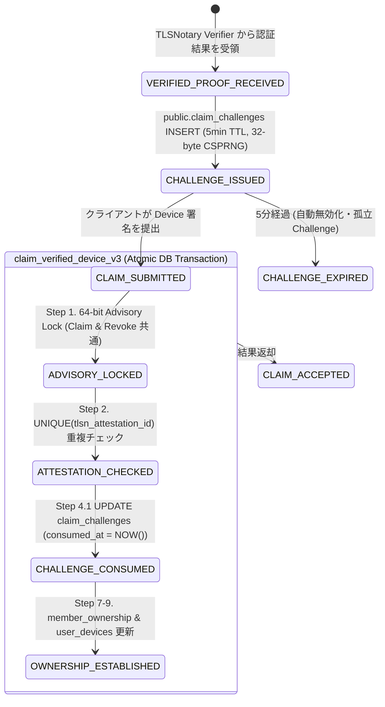

# FUSOU: Game Account Identity Attestation & Dataset Attribution 仕様書 (v1 Scope 完全確定版)

> **文書種別**: アーキテクチャ設計仕様書 & 実装マスターガイド（Implementation Master Guide）  
> **対象領域**: FUSOU プロジェクト全域（`packages/fusou-auth`, `packages/fusou-proxy-core`, `packages/fusou-proxy-hudsucker`, `packages/fusou-proxy-tlsn`, `packages/fusou-telemetry`, `packages/FUSOU-WEB`, Supabase / Cloudflare Workers / Dedicated Verifier Service）  
> **v1 Core Security Goal**:  
> **「FUSOU v1 は、ログイン時の `POST /kcsapi/api_get_member/require_info` に含まれる `/api_data/api_basic/api_member_id` についてのみ TLSNotary による Game Server provenance を確立し、その証明済み Game Account を `public_id` へ固定する。その後の Telemetry は内容を信頼せず、認証済み Dataset/Device credential からサーバー側で所属 Dataset を決定して保存する（Dataset Attribution / Provenance 保証）。」**  
> 対象 API: **`POST /kcsapi/api_get_member/require_info`**（HTTP/1.1、Game Server 認証セッション単位で最初に TLSNotary Identity Attestation に成功した 1 回のみ）  
> 対象データ: **`/api_data/api_basic/api_member_id`**（Wire: `i64` from `kc-api-dto`, Canonical Internal: Decimal String `^[0-9]{1,16}$` 前置ゼロ正規化済み, DB: `BIGINT`）  
> **最重要設計原則**:  
> 1. **旧自己申告経路の完全根絶と Implementation Acceptance Criteria への格上げ**:  
>    - **「コードベース上にクライアントからの `api_member_id` を受け取って Dataset Token を取得・発行できる経路が 1 つも存在しないこと（Call Graph 0本）」** を最優先の Implementation Acceptance Criteria とする。  
>    - 旧 `POST /anonymous-sync/v2/register`、旧 `POST /anonymous-sync/v2/pending/:token/complete`、および `signInAnonymously()` による未検証匿名ユーザー自動生成（`ensureCanonicalUserForPublicId`）は **完全廃止・削除（HTTP 410 Gone / コードベースから除去）** とする。  
>    - 汎用 RPC `rpc_register_public_id` の外部直接実行を禁止し、**`claim_verified_device_v3` の Verified Claim トランザクション内部でのみ `member_id_mapping` を作成・取得できる構造** にカプセル化する。  
> 2. **Identity Attestation と Telemetry Submission の完全分離**:  
>    - **① Identity Attestation（暗号学的保証）**: ログインセッションの最初の `require_info` を FUSOU-Prover と Game Server 間の TLSNotary MPC-TLS セッションで公証し、Game Account（`api_member_id`）$\rightarrow$ `member_id_mapping` $\rightarrow$ Dataset（`public_id`）$\rightarrow$ Social User（`web_user_member_map`）$\rightarrow$ Authorized Device（`user_devices`）の身元連鎖（Identity Chain）を確立する。  
>    - **② Telemetry Submission（内容は UNTRUSTED / 所属先 Dataset は TRUSTED）**: 戦闘等のテレメトリデータ自体は暗号公証せず、クライアントはリクエスト内に `member_id`, `public_id`, `dataset_id`, `owner user_id` などの所属識別子を一切含めない。  
> 3. **保証境界の厳格な明文化（Credential Attribution $\neq$ Real-time Game Session Freshness）**:  
>    - FUSOU v1 が保証するのは **「この Telemetry が、Game Account A にバインドされた Dataset U1 の正規 Credential から提出された事実（Credential Attribution）」** であり、**「この Telemetry が、現在 Game Server 上でリアルタイムにプレイされているゲームセッションとリアルタイムに一致していること（Real-time Session Freshness）」までは保証しない（Non-Guarantee）**。  
> 4. **Selective Disclosure（最小構造開示）& JS Number 変換完全禁止**:  
>    - TLSNotary の Selective Disclosure では、Response 内の `HTTP/1.1 200 OK`、`svdata=`、`"api_result": 1`、`"api_data": { "api_basic": { "api_member_id": <digits> } }` を含む **必要最小限の構造化 Byte Range** を開示する。  
>    - FUSOU-WEB の Canonical Parser は、`JSON.parse()` を通さず raw ASCII / UTF-8 バイト列から **バイトレベルのトークン抽出（`"api_member_id": <digits>`）により Decimal ASCII 文字列（`^[0-9]{1,16}$`）として直接抽出・前置ゼロ正規化** し、IEEE 754 浮動小数点数による丸め誤差を 100% 排除する。  
> 5. **Device ↔ Proof の暗号学的バインディング（長さ 24 bytes `proof_purpose` & 完全固定 Binary Layout）**:  
>    - `public_id` はクライアントが任意選択せず、サーバーが `verified_member_id` から導出する。  
>    - **Trust Authority の厳格な分離**:  
>      - **`Cryptographic Verification Authority` (`TLSNotary Verifier`)**: Web PKI、Attestation Proof、`transcript_commitments` による Transcript Proof の暗号検証、開示平文バイト列および `Attestation.header().id` の抽出・認証付き結果返却（Ed25519 署名 / Key Registry 仕様）。  
>      - **`Application / Identity / Dataset Authorization Authority` (`FUSOU-WEB` & Supabase)**: 開示平文からの唯一の Canonical Application Parser による `verified_member_id` 抽出、DB-backed One-Time Challenge（`public.claim_challenges` / 32-byte CSPRNG `BYTEA` / 5分 TTL / 単一消費）の発行・管理、`ClaimBindingBytes` 署名検証（`verifyEd25519ClaimBinding`）、DB Claim、Dataset Token 発行。  
>    - **`ClaimBindingBytes` への `proof_purpose`（24 bytes）導入 & 公式 canonical byte 採用**:  
>      `ClaimBindingBytes` には用途識別子 `proof_purpose = "GAME_ACCOUNT_IDENTITY_V1"`（正確に 24 bytes）および TLSNotary 公式 canonical serialization による `tlsn_attestation_id = Attestation.header().id` の byte representation を格納し、Length-delimited binary framing（Domain: `"FUSOU-IDENTITY-CLAIM-V1"`, `uint16_be(len)`）によりバイト列を安全に固定する。  
>    - **Attestation 再利用の DB 遮断 (Anti-Reuse)**:  
>      `member_ownership_claims` テーブルに `UNIQUE (tlsn_attestation_id)` 制約を課し、同一 Attestation に対し複数 Presentation が生成された場合でも、Identity Claim は Attestation 単位で 1 度しか行えない。  
> 6. **Telemetry Ingest パイプラインにおける厳格な検証順序 & Immutable 帰属保証**:  
>    - **検証順序**:  
>      ① JWT 検証 (`sub = device_id`, `dataset_id = public_id`) $\rightarrow$ ② Server-side Lookup (`user_devices` 存在・`is_verified = TRUE`・`revoked_at IS NULL`・`public_id` 一致) $\rightarrow$ ③ Ed25519 Device Signature 検証 (raw body bytes hash) $\rightarrow$ ④ Nonce アトミック消費 (`telemetry_nonces`: 30分保持) $\rightarrow$ ⑤ Idempotency 検証 (`ingest_item_id` + `body_hash`) $\rightarrow$ ⑥ `telemetry_events` INSERT。  
>    - 提出された Telemetry レコードの `(public_id, submitted_by_device_id)` は **提出時点（submission time）の事実として Immutable に保存** され、将来のデバイス再バインドや所有者変更時にも過去データは一切更新されない。  
> 7. **再送信ゼロ（No Re-submission）**:  
>    - **設計要件 (Design Requirement)**: FUSOU must not intentionally retry the same logical request.（FUSOU は同一 logical request を意図的に再送してはならない）  
>    - **検証結果 (Verification Instrument)**: Phase 0 test instrumentation must demonstrate zero FUSOU-generated duplicate sends.  
> 8. **外部プロキシ中継ゼロ（Direct Connection）**: 外部中継プロキシは規約上・BANリスク上不可とし、**クライアントローカルの `FUSOU-PROXY` と艦これ公式サーバー間の直接通信を維持**する。  
> 9. **Fallback 時のステータス明示**:  
>    Notary 障害時は `GAMEPLAY_OK / IDENTITY_UNVERIFIED / DATASET_TOKEN_NOT_ISSUED` の状態へ安全にフォールバックし、ゲームプレイを継続する。  
> **ステータス**: 実装開始前完全確定マスター仕様書 (Freeze for Phase 0 Implementation)  

---

## 目次

1. [Goal & Concept (Identity Attestation と Dataset Attribution の分離)](#1-goal--concept-identity-attestation-と-dataset-attribution-の分離)
2. [Threat Model & Security Guarantees（脅威モデルと保証境界）](#2-threat-model--security-guarantees脅威モデルと保証境界)
   - 2.1 [防げる攻撃（Security Guarantees: シナリオ追跡）](#21-防げる攻撃security-guarantees-シナリオ追跡)
   - 2.2 [防げない事項（Non-Guarantees: Credential Attribution $\neq$ Real-time Game Session Attribution）](#22-防げない事項non-guarantees-credential-attribution-neq-real-time-game-session-attribution)
3. [Trust Boundary & Authority Separation（検証機関・認可機関の厳格分離）](#3-trust-boundary--authority-separation検証機関認可機関の厳格分離)
4. [Identity Architecture & Invariant（ID基盤と不変条件の段階的成立）](#4-identity-architecture--invariantid基盤と不変条件の段階的成立)
5. [require_info TLSNotary Protocol (`POST /kcsapi/api_get_member/require_info`)](#5-require_info-tlsnotary-protocol-post-kcsapiapi_get_memberrequire_info)
   - 5.1 [Game Login Session の検知・判定モデル (SessionKey) と再試行ポリシー](#51-game-login-session-の検知判定モデル-sessionkey-と再試行ポリシー)
   - 5.2 [MPC-TLS 処理 3 段階と Browser 待機の分離](#52-mpc-tls-処理-3-段階と-browser-待機の分離)
   - 5.3 [Transcript Range Selection (最小構造開示) & Wire Representation 要件](#53-transcript-range-selection-最小構造開示--wire-representation-要件)
   - 5.4 [Application-level Validation & Decimal String カノニカルパース (JS Number 変換完全禁止)](#54-application-level-validation--decimal-string-カノニカルパース-js-number-変換完全禁止)
6. [Device ↔ Proof Binding & Social Account Linking](#6-device--proof-binding--social-account-linking)
   - 6.1 [TLSNotary Attestation.header().id と ClaimBindingBytes の完全固定 Byte Layout](#61-tlsnotary-attestationheaderid-と-claimbindingbytes-の完全固定-byte-layout)
   - 6.2 [Claim Transaction 境界と DB 状態遷移モデル (claim_verified_device_v3)](#62-claim-transaction-境界と-db-状態遷移モデル-claim_verified_device_v3)
   - 6.3 [Attestation Reuse Prevention（同一証明書の多重 Claim 遮断）](#63-attestation-reuse-prevention同一証明書の多重-claim-遮断)
   - 6.4 [Social Account Binding と 認証済み POST /identity/bind-social フロー](#64-social-account-binding-と-認証済み-post-identitybind-social-フロー)
   - 6.5 [Dataset Token の発行条件 & リアルタイム失効セマンティクス](#65-dataset-token-の発行条件--リアルタイム失効セマンティクス)
7. [Telemetry Submission Protocol (Dual Auth: Token + Device Signature)](#7-telemetry-submission-protocol-dual-auth-token--device-signature)
   - 7.1 [Telemetry Ingest 原則 & Immutable 帰属保証](#71-telemetry-ingest-原則--immutable-帰属保証)
   - 7.2 [リクエスト仕様 & Idempotency / DB Nonce Retention (30分保持)](#72-リクエスト仕様--idempotency--db-nonce-retention-30分保持)
   - 7.3 [サーバー側処理パイプライン & 厳格な検証順序](#73-サーバー側処理パイプライン--厳格な検証順序)
8. [Rust Workspace クレート分割設計 & utils/pepper.ts 移行](#8-rust-workspace-クレート分割設計--utilspepperts-移行)
9. [FUSOU-WEB Verifier アーキテクチャ (Workers vs Dedicated Rust Verifier & Key Registry)](#9-fusou-web-verifier-アーキテクチャ-workers-vs-dedicated-rust-verifier--key-registry)
10. [DB Schema（Supabaseマイグレーション: Challenge, Nonce, Telemetry）](#10-db-schemasupabaseマイグレーション-challenge-nonce-telemetry)
11. [Failure Handling & Fallback Semantics (Phase A / Phase B)](#11-failure-handling--fallback-semantics-phase-a--phase-b)
12. [Recovery & Re-binding Policy（用語の明確な分離）](#12-recovery--re-binding-policy用語の明確な分離)
13. [Testing（網羅的セキュリティ・競合テストケース）](#13-testing網羅的セキュリティ競合テストケース)
14. [Phase 0 PoC & GO/NO-GO Criteria（実測検証計画と判定基準）](#14-phase-0-poc--gono-go-criteria実測検証計画と判定基準)
15. [Migration & Rollout Plan（旧 register / pending 廃止とエンドポイント置換）](#15-migration--rollout-plan旧-register--pending-廃止とエンドポイント置換)
16. [Security Progress Checklist（開発進捗チェックリスト）](#16-security-progress-checklist開発進捗チェックリスト)

---

## 1. Goal & Concept (Identity Attestation と Dataset Attribution の分離)

### 1.1 背景と旧自己申告経路の完全根絶
旧来の FUSOU `anonymous-sync-v2` では、`POST /anonymous-sync/v2/register` がクライアント自己申告の `api_member_id` を受け取り、`rpc_register_public_id` $\rightarrow$ `ensureCanonicalUserForPublicId`（匿名ユーザー自動生成） $\rightarrow$ `rpc_register_user_device` $\rightarrow$ `issueDatasetToken` を実行して即座に `dataset_token` を発行していました。

この構造では、攻撃者が TLSNotary を完全にスキップして任意の `api_member_id` で Dataset を作成・詐称できる致命的な脆弱性が存在していました。

v1 では、**自己申告で Dataset Token を取得できるコード経路をコードベース全域から 100% 根絶（Call graph 上で 0 本であることを保証）** し、**セッション最初の `require_info` で TLSNotary による Game Server provenance を確立した後にのみ Dataset Token を発行する** アーキテクチャへ完全移行します。

```
┌─────────────────────────────────────────────────────────────────────────────────┐
│ ① Identity Attestation (SessionKey 単位 / 最初 1 回のみ / 暗号学的に保証)         │
│                                                                                 │
│  FUSOU-Prover ──(MPC-TLS)──▶ Game Server (require_info) ──▶ TLSNotary Proof     │
│                                                                   │             │
│                                                                   ▼             │
│                                                   Authenticated Verifier Result │
│                                                   { att_id, revealed_spans, sig}│
│                                                                   │             │
│                                                                   ▼             │
│                                                   FUSOU-WEB Canonical Parser    │
│                                                   - HTTP/1.1 厳格マッチ         │
│                                                   - verified api_member_id      │
│                                                     (Decimal ASCII 文字列抽出)   │
│                                                   - expected public_id 導出     │
│                                                   - Issue One-Time Challenge    │
│                                                     (32-byte CSPRNG BYTEA)      │
│                                                                   │             │
│                                                                   ▼             │
│                                                   ClaimBindingBytes 署名検証    │
│                                                   (Domain + Purpose(24B) +      │
│                                                    AttID + MemberID + DevID +   │
│                                                    PubID + ChallengeID + Nonce) │
│                                                   ※ verifyEd25519ClaimBinding   │
│                                                                   │             │
│                                                                   ▼             │
│                                                   DB Atomic Claim (10 Steps)    │
│                                                   - UNIQUE(tlsn_attestation_id) │
│                                                   - 64-bit Advisory Lock        │
└─────────────────────────────────────────────────────────────────────────────────┘
                                       │
                                       ▼ 発行: Dataset Token (Triple Verified 後発行)
                                       ※ 旧 register / pending / 匿名自動生成は完全廃止
┌─────────────────────────────────────────────────────────────────────────────────┐
│ ② Telemetry Submission (常時・軽量 / 内容は UNTRUSTED / 所属先 Dataset は TRUSTED)│
│                                                                                 │
│  Device A ──▶ POST /telemetry/upload                                            │
│               - Authorization: Bearer <dataset-token> (sub=device_id)           │
│               - X-FUSOU-Signature: Ed25519(SignDoc: raw_body_bytes hash)        │
│               - X-FUSOU-Nonce (DB telemetry_nonces 単一消費: 30分保持)          │
│               ※ Payload に member_id / public_id / dataset_id は一切含めない     │
│                                                                                 │
│  FUSOU-WEB の厳格な 6 段階検証パイプライン:                                      │
│  1. JWT 検証 (sub=device_id, dataset_id=public_id)                              │
│  2. Server-side Lookup (user_devices: is_verified=TRUE, revoked_at IS NULL)      │
│  3. Ed25519 Device 署名検証 (raw_body_bytes ハッシュ)                            │
│  4. Nonce アトミック消費 (telemetry_nonces)                                     │
│  5. Idempotency チェック (ingest_item_id + body_hash)                            │
│  6. DB INSERT (提出時点の事実として Immutable に永続化)                          │
└─────────────────────────────────────────────────────────────────────────────────┘
```

---

## 2. Threat Model & Security Guarantees（脅威モデルと保証境界）

### 2.1 防げる攻撃（Security Guarantees: シナリオ追跡）
* **A. 攻撃者が任意の `member_id` を自己申告登録する攻撃**:  
  自己申告登録エンドポイント（旧 `register`）および匿名ユーザー自動生成関数は完全削除され、未検証の自己申告登録による Dataset Token 取得は物理的に不可能です。正規オーナーが `require_info` 証明を提出した時点で正当な身元が確立されます（自己申告による先回り登録攻撃を無力化）。
* **B. 被害者の有効な Proof P を盗聴・傍受して攻撃者端末にバインドする攻撃**:  
  Server-issued Challenge（`challenge_nonce`）に対する署名には被害者端末の秘密鍵が必要なため、有効な Device B の公開鍵では Device A にバインドされた Claim を暗号学的に検証できず拒絶されます（端末すり替え拒絶）。
* **C. クライアントが Telemetry 内で他人の `member_id` を指定する攻撃**:  
  Telemetry ペイロード内の `member_id` はサーバーの認可判断から完全排除され、無視されます。
* **D. クライアントが Telemetry 内で他人の `public_id` / Dataset ID を指定する攻撃**:  
  サーバーは `dataset_token` から `public_id` を導出するため、クライアント指定の `public_id` は完全無視されます。
* **E. クライアントが Telemetry 内で他人の `owner user_id` を指定する攻撃**:  
  同様に認可判断から完全排除され、無視されます。
* **F. 同一 Telemetry リクエストの再生（Replay 攻撃）**:  
  `telemetry_nonces` テーブル（30分保持）と ±5 分のタイムスタンプ窓により、同一 Nonce の再送信は 401/403 で拒絶されます。
* **G. クライアントによる Telemetry 本文の改ざん**:  
  Telemetry 内容自体は UNTRUSTED ですが、改ざんされたデータであっても「どの Dataset に所属して提出されたか（Attribution）」はサーバー側で厳格に確定されます。
* **H. 既存オーナー A の Game Account に対し第三者 B が Proof を提出する攻撃**:  
  Game Account アクセス証明 $\neq$ Social Account 所有権証明。一度確立された `member_ownership` は別ユーザーからの Claim で自動移転することはなく、`EXISTING_VERIFIED_OWNER_CONFLICT` で拒絶されます。
* **I. 端末の交換・追加（Device Replacement）**:  
  同一オーナー（同一 `canonical_user_id`）による新端末は、同一の `public_id` に対する追加端末として安全に登録されます。
* **J. Notary サーバーの障害**:  
  送信前障害時は通常 TLS へ切り替えて `GAMEPLAY_OK / IDENTITY_UNVERIFIED / DATASET_TOKEN_NOT_ISSUED` でゲームプレイを継続。送信後障害時は同一リクエストの再送を厳禁とし `UNATTESTED` 扱いとします。
* **K. ゲーム API の二重送信・BAN リスク**:  
  FUSOU 自身によるリクエスト再送コードを完全排除し、設計要件および計測により FUSOU-generated duplicate = 0 を保証します。

### 2.2 防げない事項（Non-Guarantees: Credential Attribution $\neq$ Real-time Game Session Attribution）
* **Telemetry 内容の真正性**: 戦闘結果、ドロップ、資源、艦隊、装備等の内容自体が Game Server 由来であることは v1 では判定しません（UNTRUSTED payload）。
* **自端末の資格情報盗難時のデータ捏造**: 攻撃者がユーザー PC を完全支配して `Device A` の秘密鍵/トークンを窃取した場合、`Device A`（Dataset U1）として偽の戦闘データを送ることは防げません（TPM 等がない限り不可）。
* **Credential Attribution と Real-time Game Session の分離**:  
  FUSOU v1 が保証するのは **「この Telemetry が、Game Account A にバインドされた Dataset U1 の正規 Credential から提出された事実（Credential Attribution）」** であり、**「この Telemetry が、現在 Game Server 上でリアルタイムにプレイされているゲームセッションとリアルタイムに一致していること（Real-time Session Freshness）」までは保証しません**。

---

## 3. Trust Boundary & Authority Separation（検証機関・認可機関の厳格分離）

```
                     UNTRUSTED ZONE
┌────────────────────────────────────────────────────────┐
│ User PC (Client Environment)                           │
│                                                        │
│  - FUSOU binary (Tamperable)                           │
│  - Local Memory / Process (Inspectable)                │
│  - Local SQLite DB (Modifiable)                        │
│  - Browser / OS (Untrusted)                            │
│                                                        │
│  Client-provided metadata = NEVER trusted              │
└───────────────────────────┬────────────────────────────┘
                            │
                            │ 1. TLSNotary Presentation (require_info)
                            │ 2. ClaimSignature = Ed25519(ClaimBindingBytes)
                            ▼
═════════════════════ TRUST BOUNDARY ═════════════════════
                            │
                            ▼
┌────────────────────────────────────────────────────────┐
│ TLSNotary Verifier (Cryptographic Verification Auth)   │
│ (Cloudflare Workers WASM or Dedicated Rust Verifier)   │
│                                                        │
│  - Verify Web PKI Certificate Chain (Allowlist Check)  │
│  - Verify Attestation Proof & Merkle Root              │
│  - Verify Transcript Proof with transcript_commitments │
│  - Extract Attestation.header().id (canonical bytes)   │
│  - Return Authenticated Verification Result:           │
│    { tlsn_attestation_id, revealed_req, revealed_recv,  │
│      notary_key_id, server_identity, verified_at, sig } │
└───────────────────────────┬────────────────────────────┘
                            │ Authenticated Verification Result
                            ▼
┌────────────────────────────────────────────────────────┐
│ FUSOU-WEB (Application / Authorization Authority)      │
│                                                        │
│  - Verify Verifier Signature via Key Registry          │
│  - Parse canonical verified_member_id (Decimal ASCII)  │
│  - Derive expected_public_id from verified_member_id   │
│  - Issue Server One-Time Challenge into DB (5min TTL)  │
│  - Verify ClaimBindingBytes Ed25519 Device Signature   │
│  - Issue Dataset Token post-verification (sub=dev_id)  │
└───────────────────────────┬────────────────────────────┘
                            │
                            ▼ [SECURITY BOUNDARY]
┌────────────────────────────────────────────────────────┐
│ Supabase Database (Trusted Core Storage: RPC Layer)    │
│                                                        │
│  - 64-bit Advisory Lock & Row-Level Locking            │
│  - Atomic Ownership Transfer (Strict 10 Steps)         │
│  - Enforce Quad Invariant (Post-Social Binding)        │
│  - Enforce UNIQUE (tlsn_attestation_id) (Anti-Reuse)   │
│  - Atomic Challenge & Proof Consumption Enforcement    │
│  - Append-Only Audit Trail with proof_purpose          │
│                                                        │
│  Stored State = ACCEPTED Verified Evidence Only        │
└────────────────────────────────────────────────────────┘
```

---

## 4. Identity Architecture & Invariant（ID基盤と不変条件の段階的成立）

### 4.1 `api_member_id` と `public_id` の責務分離 & 1:1 双方向一意制約
```
api_member_id (例: 12345678: Decimal String, DB: BIGINT)
       │
       │ (TLSNotary provenance 検証)
       ▼
member_id_mapping (Service-role only: UNIQUE(api_member_id), UNIQUE(public_id))
       │
       ▼
public_id = UUIDv4 (Random UUID: Dataset U1)
       │
       ├───────────────▶ member_ownership (verified_user_id = Auth User A)
       ├───────────────▶ user_member_map (user_id = Auth User A)
       ├───────────────▶ web_user_member_map (user_id = Social User A)
       ├───────────────▶ user_devices (device_id = Device A)
       └───────────────▶ telemetry_events (public_id = U1)
```

### 4.2 Invariant の段階的成立
1. **`GAME_IDENTITY_VERIFIED` 時点**:
   $$\text{member\_ownership.verified\_user\_id} \equiv \text{user\_devices.canonical\_user\_id} \equiv \text{user\_member\_map.user\_id} \quad (\text{Triple Invariant})$$
2. **`SOCIAL_ACCOUNT_BOUND`（OAuth 明示的バインディング完了）以降**:
   $$\text{上記 3 者} \equiv \text{web\_user\_member\_map.user\_id} \quad (\text{Quad Invariant})$$

---

## 5. require_info TLSNotary Protocol (`POST /kcsapi/api_get_member/require_info`)

### 5.1 Game Login Session の検知・判定モデル (SessionKey) と再試行ポリシー
* **SessionKey 定義 & Cookie Canonicalization**:
  FUSOU Proxy は、プロキシが観測した Game Server 認証状態（SessionKey）をローカルのルーティング・キャッシュ最適化ヒューリスティックとして使用します（**Security Decision / Cryptographic Identity には関与させない**）：
  $$\text{SessionKey} = \text{SHA256}(\text{Target World Host} \mathbin{\Vert} \text{Canonicalized Auth Cookies/Token Headers})$$
  - **Cookie Canonicalization**: 認証に関係する Cookie のみを抽出し、`name=value` を辞書順（lexicographic order）でソート・結合してハッシュ化。Cookie 平文のログ出力は完全禁止。
* **観測ポリシー**:
  1. **初回公証トリガー**: 新しい `SessionKey` が観測された直後の最初の `POST /kcsapi/api_get_member/require_info` を TLSNotary Identity Attestation の対象とする。
  2. **同一セッション内バイパス**: 当該 `SessionKey` で一度 Identity Attestation が成功した後は、後続の `require_info` は通常のプロキシとして中継し、再度 MPC 公証は行わない。
  3. **アカウント切り替え検知**: ログアウトや別アカウントログインにより `SessionKey` が変化した場合、新しいセッションとして次の `require_info` に対し改めて TLSNotary Identity Attestation を適用する。
  4. **Phase 0 実測確定**: 実際のゲームログイン・ログアウト・アカウント切替通信をキャプチャし、Cookie/Header 境界仕様を確定する。

### 5.2 MPC-TLS 処理 3 段階と Browser 待機の分離
1. **Phase A (Request Routing / Upstream Connection)**:  
   ブラウザから受信したリクエストを検知し、Game Server への MPC-TLS 接続を確立。
2. **Phase B (MPC-TLS Response Acquisition)**:  
   Prover と Notary 間で MPC ハンドシェイクおよび共同復号を実行し、Response plaintext を取得。  
   > **注意**: この区間は Browser が待つ同期区間となります（**MPC-TLS response acquisition remains on the login API path**）。この追加遅延の許容範囲は Phase 0 PoC で実測検証します。
3. **Phase C (Presentation Generation & Verification & DB Claim)**:  
   バックグラウンドタスク（`tokio::spawn`）で Presentation を構築し、FUSOU-WEB での検証および DB Claim を実行。  
   > **原則**: この区間は Browser の待機条件から完全に除外されます（**Post-processing is not on critical path**）。

### 5.3 Transcript Range Selection (最小構造開示) & Wire Representation 要件
* **プロトコルスコープ**: FUSOU v1 が対応するゲーム API 通信は **HTTP/1.1** に限定します。
* **Transcript Range Selection (最小構造開示)**:
  FUSOU-WEB が唯一の Canonical Application Parser として機能するため、TLSNotary の Selective Disclosure では以下の最小限の構造化 Byte Range を開示します：
  - **Request**: `POST /kcsapi/api_get_member/require_info HTTP/1.1` および必須ヘッダー（`Host:`, `Content-Type:`）
  - **Response**: `HTTP/1.1 200 OK`、`svdata=` プレフィックス、`"api_result": 1`、`"api_data": { "api_basic": { "api_member_id": <digits> } }` を含む構造境界。
* **Wire Representation 実測要件 (Phase 0)**:
  TLSNotary が証明するのは wire 上の TLS plaintext bytes です。`Transfer-Encoding: chunked` や `Content-Encoding: gzip` 等の wire 形式の有無を Phase 0 で実測計測し、gzip 圧縮時は `compressed bytes -> Range Proof -> Decompress -> Parse` の順序を Parser 仕様へ固定します。
* **Trusted Server Identity Policy (Explicit Allowlist)**:
  単一のワイルドカードではなく、`(TLS Certificate / Server Identity, HTTP Host, HTTP Path === /kcsapi/api_get_member/require_info, Method === POST)` の 4 項目完全一致 Allowlist に基づいて Game Server の真正性を検証します。

### 5.4 Application-level Validation & Decimal String カノニカルパース (JS Number 変換完全禁止)
JavaScript の `JSON.parse()` を通さず、raw ASCII / UTF-8 バイト列からバイトレベルで抽出して前置ゼロを正規化します：

```typescript
// packages/FUSOU-WEB/src/server/utils/require_info_parser.ts

import { z } from 'zod';

const CanonicalRequireInfoSchema = z.object({
  api_path: z.literal('/kcsapi/api_get_member/require_info'),
  api_member_id: z.string().regex(/^[1-9][0-9]{0,15}$|^0$/), // Normalized decimal ASCII string (1..16 digits, no leading zeros)
});

export type CanonicalRequireInfoResult = z.infer<typeof CanonicalRequireInfoSchema>;

export function parseCanonicalRequireInfo(
  revealedReq: Uint8Array,
  revealedRecv: Uint8Array
): CanonicalRequireInfoResult {
  // 1. 構造化 Request パース (HTTP/1.1 限定)
  const reqStr = new TextDecoder().decode(revealedReq);
  const matchReq = reqStr.match(/^POST\s+(\/kcsapi\/api_get_member\/require_info)\s+HTTP\/1\.1/m);
  if (!matchReq) {
    throw new Error('invalid_or_unauthorized_request_path');
  }

  // 2. Response svdata プレフィックスおよび JSON 構造の厳格多段パース
  const recvStr = new TextDecoder().decode(revealedRecv);
  const headerEnd = recvStr.indexOf('\r\n\r\n');
  if (headerEnd === -1) throw new Error('http_headers_malformed');

  const bodyStr = recvStr.slice(headerEnd + 4).trim();
  if (!bodyStr.startsWith('svdata=')) {
    throw new Error('svdata_prefix_missing_at_body_start');
  }

  // api_result: 1 の確認
  if (!/"api_result"\s*:\s*1\b/.test(bodyStr)) {
    throw new Error('api_result_not_ok');
  }

  // JSON.parse() を使わず、raw body string から api_member_id の numeric lexeme を直接抽出
  const memberIdMatch = bodyStr.match(/"api_member_id"\s*:\s*([0-9]{1,16})\b/);
  if (!memberIdMatch) {
    throw new Error('api_member_id_missing_or_invalid_digits');
  }

  // 前置ゼロ正規化 (例: "000123" -> "123")
  const rawDigits = memberIdMatch[1];
  const normalizedMemberId = rawDigits.replace(/^0+/, '') || '0';

  return CanonicalRequireInfoSchema.parse({
    api_path: matchReq[1],
    api_member_id: normalizedMemberId,
  });
}
```

---

## 6. Device ↔ Proof Binding & Social Account Linking

### 6.1 TLSNotary `Attestation.header().id` と `ClaimBindingBytes` の完全固定 Byte Layout

#### 6.1.1 Attestation 識別子の一本化 & Canonical Serialization
`tlsn_attestation_id` は、Rust 内部表現や Debug/String representation ではなく、**Phase 0 で採用・固定する exact TLSNotary revision が定義する canonical serialization によって得られる `Attestation.header().id` の byte representation を使用** します。

#### 6.1.2 全 8 フィールドの厳密な Encoding・Byte Layout 定義
将来の用途拡張（イベント証明等）におけるドメイン混同を防ぐため、`proof_purpose` を含む全 8 フィールドを完全固定します：

| 順序 | フィールド名 | データ型 / エンコーディング | バイト長 | 説明 |
|:---:|---|---|---|---|
| 1 | `domain_tag` | Raw ASCII bytes | 23 bytes | `"FUSOU-IDENTITY-CLAIM-V1"` |
| 2 | `proof_purpose` | Raw ASCII bytes | **24 bytes** | `"GAME_ACCOUNT_IDENTITY_V1"` |
| 3 | `tlsn_attestation_id` | TLSNotary Canonical Bytes | $N$ bytes (Phase 0 固定) | `Attestation.header().id` の公式シリアライズバイト列 |
| 4 | `verified_member_id` | UTF-8 decimal ASCII | 1〜16 bytes | 検証・正規化済みゲームアカウント ID（例: `"12345678"`） |
| 5 | `device_id` | Binary UUID (RFC 4122 Big-endian) | 16 bytes | 提出端末の Device UUID |
| 6 | `expected_public_id` | Binary UUID (RFC 4122 Big-endian) | 16 bytes | サーバー導出 Dataset UUID |
| 7 | `challenge_id` | Binary UUID (RFC 4122 Big-endian) | 16 bytes | サーバー発行 Challenge UUID |
| 8 | `challenge_nonce` | Raw Binary Bytes | 32 bytes | サーバー発行 One-Time Nonce (`crypto.getRandomValues`) |

* **Length-Delimited Binary Framing**:
  全フィールドの直前に 2 バイトの Big-endian 長さヘッダー（`uint16_be(len)`）を付加して連結：
  $$\text{ClaimBindingBytes} = \text{u16}(23) \Vert \text{"FUSOU-IDENTITY-CLAIM-V1"} \Vert \text{u16}(24) \Vert \text{"GAME_ACCOUNT_IDENTITY_V1"} \Vert \text{u16}(\text{len(att\_id)}) \Vert \text{att\_id} \Vert \text{u16}(\text{len(mid)}) \Vert \text{mid} \Vert \text{u16}(16) \Vert \text{dev} \Vert \text{u16}(16) \Vert \text{pub} \Vert \text{u16}(16) \Vert \text{cid} \Vert \text{u16}(32) \Vert \text{nonce}$$
  $$\text{ClaimSignature} = \text{Ed25519\_Sign}(sk_{\text{device}}, \text{ClaimBindingBytes})$$

### 6.2 Claim Transaction 境界と DB 状態遷移モデル (claim_verified_device_v3)



> **アトミック性と途中失敗時の安全性**:  
> 1. `member_id_mapping` 上の `public_id` は `api_member_id` に決定論的（1:1）にバインドされるため、Claim 完了前に失敗しても次回再試行時に同一 `public_id` が再利用され、データの破綻は生じません。  
> 2. `claim_challenges` は 5 分の `expires_at` を持ち、未消費のまま放置された Challenge は DB インデックスにより安全に無視・自動失効します。  
> 3. アトミック性の核心である「Challenge 単一消費」「Attestation 重複チェック」「所有権判定・移転」「監査ログ記録」は、**`claim_verified_device_v3` の単一トランザクション内（Step 1〜10）で完全に直列化・アトミックに実行** されます。

### 6.3 Attestation Reuse Prevention（同一証明書の多重 Claim 遮断）
同一の Attestation に対して複数の Presentation を生成できたとしても、FUSOU においては **`Attestation.header().id` をキーとして Identity Claim は一度しか行えない** ルールを適用します。
`public.member_ownership_claims` テーブルに `tlsn_attestation_id BYTEA NOT NULL` を保持し、`CONSTRAINT uq_member_claims_attestation UNIQUE (tlsn_attestation_id)` 制約を定義。同一 Attestation を別 Challenge で再利用した二重 Claim は `DUPLICATE_ATTESTATION_CLAIMED` 例外として即時ロールバックされます。

### 6.4 Social Account Binding と 認証済み `POST /identity/bind-social` フロー
* **状態の段階的遷移**:
  1. `GAME_IDENTITY_VERIFIED`: TLSNotary Proof により `api_member_id` $\leftrightarrow$ `public_id` $\leftrightarrow$ `user_devices` が確定した状態。
     $$\text{member\_ownership.verified\_user\_id} \equiv \text{user\_devices.canonical\_user\_id} \equiv \text{user\_member\_map.user\_id} \quad (\text{Triple Invariant 成立})$$
  2. `SOCIAL_ACCOUNT_BOUND`: OAuth 認証済み Web ユーザーが明示的なバインディング操作を行い、`web_user_member_map` に登録された状態。
     $$\text{上記 3 者} \equiv \text{web\_user\_member\_map.user\_id} \quad (\text{Quad Invariant 成立})$$
* **`POST /identity/bind-social` の認証・認可仕様**:
  1. **CSRF 防御**: `assertCsrfSafe(c, hasCookieAuth)` の実行。
  2. **Supabase OAuth User 認証**: 認証済み `authenticated_user_id` を抽出。
  3. **所有権検証**: サーバー側で `target public_id` の `member_ownership` を照合し、`GAME_IDENTITY_VERIFIED` かつ `verified_user_id == authenticated_user_id` であることを確認（別ユーザーによる乗っ取り Binding は 403 拒絶）。
  4. **DB 登録**: `web_user_member_map` に `(user_id, public_id)` をアトミックに INSERT。

### 6.5 Dataset Token の発行条件 & リアルタイム失効セマンティクス
* **Triple Verified Issuance（公証後発行ルール）**:
  必ず以下の順序で発行され、事前発行は行われません：
  $$\text{require\_info verified} \longrightarrow \text{device claim accepted} \longrightarrow \text{social account bound} \longrightarrow \text{dataset\_token issued}$$
* **JWT Claims 仕様**:
  ```json
  {
    "sub": "<device_id>",
    "dataset_id": "<public_id>",
    "typ": "dataset",
    "iat": "<issued_at_timestamp>",
    "exp": "<issued_at_timestamp + configured_ttl>"
  }
  ```
* **リアルタイム失効セマンティクス**:
  JWT の有効期限内であっても、サーバー側はリクエスト毎に DB の `user_devices` を参照し、**`revoked_at IS NULL` かつ `member_ownership` / `web_user_member_map` のバインディングが有効であること** を検証します。Social 解除や Device Revoke が発生した場合、Token は次のリクエスト時に即座に 401/403 で拒絶されます。

---

## 7. Telemetry Submission Protocol (Dual Auth: Token + Device Signature)

### 7.1 Telemetry Ingest 原則 & Immutable 帰属保証
> **「Telemetry ingest endpoint は、request payload に含まれる member_id、public_id、dataset_id 等の所属識別子を認証・認可判断に使用してはならない。Dataset identity は検証済み Credential（Dataset Token + Device Signature）からのみサーバー側で導出する。`api_path` は informational metadata（最大 128 UTF-8 bytes）であり認可判断には使用しない。」**  
> **「DB に格納された Telemetry レコードの `(public_id, submitted_by_device_id)` は提出時点の事実として Immutable であり、将来のデバイス再バインドや所有者変更によって過去データが更新されることはない。」**

### 7.2 リクエスト仕様 & Idempotency / DB Nonce Retention (30分保持)
```http
POST /api/v1/telemetry/ingest HTTP/1.1
Host: api.fusou.dev
Authorization: Bearer <dataset-token>
X-FUSOU-Device-ID: 00000000-0000-4000-8000-000000000000
X-FUSOU-Timestamp: 1756200000
X-FUSOU-Nonce: a1b2c3d4e5f6
X-FUSOU-Signature: <base64url-encoded-ed25519-signature>
Content-Type: application/json

{
  "ingest_item_id": "a1b2c3d4-e5f6-4a7b-8c9d-0e1f2a3b4c5d",
  "api_path": "/kcsapi/api_req_sortie/battleresult",
  "event_time": "2026-08-28T04:00:00Z",
  "data": {
    "api_win_rank": "S",
    "api_get_ship": { "api_ship_id": 421 }
  }
}
```

* **署名対象ペイロード（Canonical Serialization）**:
  Client は Dataset Token の Claims から `public_id` をデコードして署名に含めます：
  $$\text{SignDoc} = \text{POST} \mathbin{\Vert} \text{/api/v1/telemetry/ingest} \mathbin{\Vert} \text{Nonce} \mathbin{\Vert} \text{Timestamp} \mathbin{\Vert} \text{SHA256(RawBodyBytes)} \mathbin{\Vert} \text{public\_id}$$
* **DB レベル Nonce Replay Protection & クリーンアップ運用**:
  - `device_id` は UUIDv4 であり **Never-reused**。
  - `X-FUSOU-Timestamp` は ±5 分（±300秒）以内のみ受理。
  - `telemetry_nonces` に `(device_id, nonce)` を INSERT して消費。データは 30 分間保持し、定期ジョブ（pg_cron）で自動パージ。
* **Raw Body Hash による厳格な Idempotency**:
  `body_hash = sha256(raw_body_bytes)` は改ざん防止ではなく **Idempotency 判定専用**。同一 `ingest_item_id` が既に存在する場合、保存済み `body_hash` と完全一致すれば 200/201 冪等成功、不一致であれば 409 Conflict で拒絶。

### 7.3 サーバー側処理パイプライン & 厳格な検証順序
1. **JWT 検証**: `Authorization` ヘッダーから `dataset_token` を検証し、Claims (`sub = device_id`, `dataset_id = public_id`) を抽出。
2. **Server-side Device Lookup**: 抽出した `device_id` をキーとして DB の `user_devices` レコードを検索し、`is_verified = TRUE AND revoked_at IS NULL AND public_id = claims.dataset_id` を確認。
3. **Ed25519 Device Signature 検証**: `raw_body_bytes` から `SHA256(raw_body_bytes)` を算出し、`user_devices.device_pubkey` を用いて `X-FUSOU-Signature` を検証（JSON 再シリアライズを行わない）。
4. **Nonce アトミック消費**: `telemetry_nonces` に `(device_id, nonce)` を消費記録（重複時は即座に 401/403 遮断）。
5. **Idempotency チェック**: `ingest_item_id` と `body_hash` を照合。
6. **DB INSERT**: テレメトリレコードを `public_id`（Dataset U1）の所有データとして INSERT。

---

## 8. Rust Workspace クレート分割設計 & utils/pepper.ts 移行

```
packages/
├── fusou-auth/               # DeviceKey / Ed25519 署名 / Token管理 (既存実装再利用)
├── fusou-proxy-core/         # Proxy ライフサイクル・HTTP 抽象化・UpstreamTransport Trait
├── fusou-proxy-hudsucker/    # 通常ゲーム通信用 MITM プロキシ実装 (低遅延最優先)
├── fusou-proxy-tlsn/         # require_info 専用 TLSNotary MPC-TLS Upstream トランスポート（PoC対象）
├── fusou-telemetry/          # 軽量テレメトリ キュー・SQLite 永続化・バッチ送信
└── FUSOU-APP/                # Composition Root (DI コンテナ)
```

> **`utils/pepper.ts` の完全削除と `device-auth.ts` 移行**:  
> レガシーな stateless HMAC チャレンジ（`pepper.ts`）は完全削除し、DB-backed One-Time Challenge（`public.claim_challenges`）および raw bytes 署名検証 API **`verifyEd25519ClaimBinding(bytes: Uint8Array, signature: Uint8Array, pubkey: Uint8Array): boolean`** を備えた **`packages/FUSOU-WEB/src/server/utils/device-auth.ts`** へ完全移行します。

---

## 9. FUSOU-WEB Verifier アーキテクチャ (Workers vs Dedicated Rust Verifier & Key Registry)

TLSNotary は active development 中（breaking changes が発生し得る）であるため、**Phase 0 終了時に採用する exact git tag / commit revision を確定・固定** します（過去の archive された `@tlsnotary/tlsn-js` は採用せず、現行の tagged release / extension / wasm / native prover を使用）。

1. **Option A (Cloudflare Workers + WASM Verifier)**:
   Workers 内で `tlsn-verifier-wasm` を直接実行。
2. **Option B (Dedicated Rust Verifier Service: 推奨フォールバック)**:
   `FUSOU-APP -> TLSNotary Verifier Service (Rust Native: Ed25519署名付き検証結果返却) -> FUSOU-WEB -> Supabase`。
3. **Verifier Key Registry (署名鍵ローテーション仕様)**:
   Dedicated Verifier の結果署名検証のため、FUSOU-WEB は以下のメタデータを持つ Key Registry を管理します：
   ```typescript
   type VerifierKeyEntry = {
     key_id: string;
     algorithm: 'Ed25519';
     public_key: string; // Base64
     valid_from: string; // ISO8601
     revoked_at: string | null;
   };
   ```

---

## 10. DB Schema（Supabaseマイグレーション: Challenge, Nonce, Telemetry）

### `20260826010000_create_telemetry_attribution_tables.sql`
```sql
BEGIN;

-- 1. Server-issued One-Time Claim Challenge テーブル (RLS: Service-role only)
CREATE TABLE IF NOT EXISTS public.claim_challenges (
    challenge_id UUID PRIMARY KEY DEFAULT gen_random_uuid(),
    public_id UUID NOT NULL REFERENCES public.member_id_mapping(public_id) ON DELETE RESTRICT,
    device_id UUID NOT NULL REFERENCES public.user_devices(device_id) ON DELETE RESTRICT,
    challenge_nonce BYTEA NOT NULL,
    expires_at TIMESTAMPTZ NOT NULL,
    consumed_at TIMESTAMPTZ,
    created_at TIMESTAMPTZ NOT NULL DEFAULT NOW()
);

CREATE INDEX IF NOT EXISTS idx_claim_challenges_active 
    ON public.claim_challenges (challenge_id, expires_at) 
    WHERE consumed_at IS NULL;

ALTER TABLE public.claim_challenges ENABLE ROW LEVEL SECURITY;

CREATE POLICY "Allow service_role full access to claim_challenges"
    ON public.claim_challenges
    FOR ALL
    TO service_role
    USING (true)
    WITH CHECK (true);

-- 2. Telemetry リプレイ防御用 Nonce テーブル (30分保持)
CREATE TABLE IF NOT EXISTS public.telemetry_nonces (
    device_id UUID NOT NULL REFERENCES public.user_devices(device_id) ON DELETE RESTRICT,
    nonce TEXT NOT NULL,
    first_seen_at TIMESTAMPTZ NOT NULL DEFAULT NOW(),
    PRIMARY KEY (device_id, nonce)
);

CREATE INDEX IF NOT EXISTS idx_telemetry_nonces_cleanup 
    ON public.telemetry_nonces (first_seen_at);

ALTER TABLE public.telemetry_nonces ENABLE ROW LEVEL SECURITY;

CREATE POLICY "Allow service_role full access to telemetry_nonces"
    ON public.telemetry_nonces
    FOR ALL
    TO service_role
    USING (true)
    WITH CHECK (true);

-- 3. Telemetry イベント格納テーブル (Immutable イベントストア)
CREATE TABLE IF NOT EXISTS public.telemetry_events (
    ingest_item_id UUID PRIMARY KEY DEFAULT gen_random_uuid(),
    public_id UUID NOT NULL REFERENCES public.member_id_mapping(public_id) ON DELETE RESTRICT,
    submitted_by_device_id UUID NOT NULL REFERENCES public.user_devices(device_id) ON DELETE RESTRICT,
    api_path VARCHAR(128) NOT NULL,
    body_hash TEXT NOT NULL,
    event_time TIMESTAMPTZ NOT NULL,
    received_at TIMESTAMPTZ NOT NULL DEFAULT NOW(),
    payload JSONB NOT NULL
);

CREATE INDEX IF NOT EXISTS idx_telemetry_dataset_time 
    ON public.telemetry_events (public_id, event_time DESC);

ALTER TABLE public.telemetry_events ENABLE ROW LEVEL SECURITY;

CREATE POLICY "Allow service_role full access to telemetry_events"
    ON public.telemetry_events
    FOR ALL
    TO service_role
    USING (true)
    WITH CHECK (true);

COMMIT;
```

---

## 11. Failure Handling & Fallback Semantics (Phase A / Phase B)

* **Phase A（リクエスト送信前）**:
  Game Server へのリクエスト送信前に MPC session が成立しない場合、直ちに通常の TLS 接続へ切り替えて `require_info` を送信。
  - 状態: `GAMEPLAY_OK / IDENTITY_UNVERIFIED / DATASET_TOKEN_NOT_ISSUED`
  - ゲームログインは継続し、未検証状態を維持します。
* **Phase B（リクエスト送信後）**:
  リクエスト送信後に MPC session が失敗した場合、**同一リクエストの再送は厳格に禁止（BAN 回避 / FUSOU-generated duplicate = 0）**。
  - 状態: `UNATTESTED`
  - `MPC-TLS request sent -> Verifier failure -> NO automatic replay, NO second upstream request -> If plaintext already fully available: may return original response; else: cannot reconstruct response from TLS.`
  - Browser への継続可否は「Prover が既に取得済みの plaintext が存在するか」に依存します（Phase 0 で実測検証）。公証タスクのみ破棄し、次回以降の自然な再試行時に新しい TLSNotary session として扱います。

---

## 12. Recovery & Re-binding Policy（用語の明確な分離）

概念および用語を厳格に分離して運用します：
1. **Game Account Identity Provenance**: TLSNotary による「その時点で正規の `api_member_id` セッションを所持・操作している事実の証明」。
2. **Dataset Attribution**: Telemetry データを特定 Dataset (`public_id`) にサーバー側で確定・帰属させる保証。
3. **Social Account Binding**: OAuth 認証ユーザーによる明示的なアカウント紐付け操作。
4. **Device Replacement (端末追加・失効)**: 同一オーナー（同一 `canonical_user_id`）が新端末を導入する場合、同一 `public_id` に対して新端末を `user_devices` に追加登録（Owner は不変）。**旧 Device の署名だけで新しい `member_id` の証明を代替することは不可（必ず新規 TLSNotary Proof が必要）**。
5. **Re-binding & Transfer Policy**: Game Account アクセス証明 $\neq$ Social Account 所有権証明。異なる Web ユーザーからの Claim は自動移転せず、明示的なリカバリ / 移転プロトコルを通じてのみ実行可能。

---

## 13. Testing（網羅的セキュリティ・競合テストケース）

1. **自己申告登録根絶テスト**: 旧 `/anonymous-sync/v2/register` および旧 pending エンドポイントへのリクエストが 410 Gone / 遮断されることを確認。
2. **事前登録攻撃奪還テスト**: 攻撃者が `PRE_REGISTERED` 登録後に正規ユーザーが公証提出 $\rightarrow$ 攻撃者端末のみ Revoke され所有権が正規ユーザーへ移転（自己申告先回り登録の無力化）。
3. **端末すり替え遮断テスト**: Proof P（`member_id = 1234`）に対し別 Device B の署名を提出 $\rightarrow$ 有効な Device B の公開鍵では Claim を検証できず拒絶。
4. **Attestation 再利用遮断テスト**: 同一 `tlsn_attestation_id` で別 Challenge を提出 $\rightarrow$ `DUPLICATE_ATTESTATION_CLAIMED` で拒絶。
5. **`public_id` 改変遮断テスト**: クライアントが署名メッセージ内の `public_id` を書き換えて提出 $\rightarrow$ 400/403 拒絶。
6. **Challenge 再生遮断テスト**: 同一 `challenge_nonce` を 2 回提出 $\rightarrow$ 400 拒絶。
7. **期限切れ Challenge 遮断テスト**: 5 分以上経過した Challenge で提出 $\rightarrow$ 400 拒絶。
8. **Telemetry Replay 遮断テスト**: 同一 `device_id + nonce` を再送信 $\rightarrow$ 401/403 拒絶。
9. **Telemetry 冪等性テスト**: 同一 `ingest_item_id` で Body 一致時は 200/201、Body 不一致時は 409 Conflict。
10. **並行 Claim 競合テスト**: 2 台の端末から同時に Claim 実行 $\rightarrow$ 64-bit Advisory Lock と親行ロックにより直列化。

---

## 14. Phase 0 PoC & GO/NO-GO Criteria（実測検証計画と判定基準）

### 14.1 検証項目（全24項目）
1. `POST /kcsapi/api_get_member/require_info` を対象にできる
2. Game Server への request は FUSOU 自身が二重送信しない（Phase 0 test instrumentation must demonstrate zero FUSOU-generated duplicate sends）
3. TLSNotary proof が正常に verify できる
4. Server identity（Explicit Allowlist: Host + Path + Method）が正常に verify できる
5. `verified_member_id` の抽出（Decimal String / JS Number 変換完全禁止）が成功する
6. Transcript Range Selection による必要最小構造の切り出しが成立する
7. Wire Representation（Transfer-Encoding / Content-Encoding / gzip 順序）の実測が完了する
8. Selective disclosure による最小限開示が成立する
9. 正当な Device 署名（`verifyEd25519ClaimBinding`）が accept される
10. 別 Device の署名が reject される
11. 同一 Attestation の再利用が reject される（Anti-Reuse: UNIQUE tlsn_attestation_id）
12. `public_id` 改変が reject される
13. Challenge reuse が reject される
14. Expired challenge が reject される
15. 自己申告登録エンドポイント（旧 register / pending / 匿名自動生成）がコードベースから完全に根絶されている
16. Social account binding が正常に機能する
17. Token 発行順序が正しい（Triple Verified）
18. Telemetry payload による identity 上書きが排除される
19. 同一 Nonce replay が reject される
20. 同一 `ingest_item_id` + 同一 Body が idempotent success となる
21. 同一 `ingest_item_id` + 異なる Body が 409 Conflict となる
22. Device 再バインド時も過去 Telemetry の attribution が書き換わらない
23. リクエスト送信前の Notary 障害時フォールバックが機能する
24. Browser-visible な追加遅延および Proof completion 遅延の実測

### 14.2 Phase 0 GO / NO-GO 判定基準
| 分類 | 必須条件 (MUST PASS) | 判定基準 |
|---|---|:---:|
| **プロトコル** | FUSOU 生成の二重送信ゼロ | Phase 0 test instrumentation must demonstrate zero FUSOU-generated duplicate sends |
| **暗号検証** | TLSNotary Proof 検証成功 | Notary 署名・Attestation Header/Body 検証完全一致 |
| **データ抽出** | `api_member_id` の正確な抽出 | レスポンス平文と抽出値（Decimal String）が一致（JS Number 完全禁止） |
| **バインディング** | `ClaimBindingBytes` 偽造不能 | 他端末秘密鍵・別 Nonce での Claim を遮断（正確な 24B length） |
| **端末すり替え拒絶** | 検証済み Proof に対する別 Device 署名拒絶 | **Proof P (member 1234) + Device B 署名 $\rightarrow$ 拒絶** |
| **Attestation 再利用遮断** | 同一 Attestation の多重 Claim 拒絶 | **Proof P + Challenge C2 $\rightarrow$ 拒絶 (UNIQUE tlsn_attestation_id)** |
| **自己申告完全根絶** | 旧 register / pending からの Token 発行遮断 | **コードベース上に自己申告 member_id で Token を取得できる経路が 0 件** |
| **所属決定権** | クライアントによる Dataset 選択排除 | Payload 内の `public_id` 改変を完全無視 |
| **リプレイ防御** | DB Nonce & Idempotency 検証 | 同一 Nonce 拒絶、同一 ID 異 Body で 409 Conflict |
| **耐障害性** | 送信前 Notary 障害時のログイン継続 | 通常 TLS フォールバックでゲームプレイ継続 |
| **接続性** | 外部中継プロキシ排除 | クライアントローカルから直接接続維持 |
| **性能目標** | `require_info` MPC 復号追加遅延 | **P95 < 300ms**（実測値を記録・評価） |
| **バージョン固定** | TLSNotary Revision 確定 | Phase 0 終了時に exact git tag/commit を固定 |

---

## 15. Migration & Rollout Plan（旧 register / pending 廃止とエンドポイント置換）

1. **Phase 0 (ADR-000 Data Plane PoC & Verifier Benchmark)**:
   - `POST /kcsapi/api_get_member/require_info` における Prover 統合と MPC 復号遅延の動作実測（P95 < 300ms）。
   - SessionKey 判定モデル（Cookie/Token 境界）および Wire Representation（Transfer-Encoding / Content-Encoding）の実測検証と確定。
   - TLSNotary exact git tag/commit revision の確定。
   - `Attestation.header().id` の公式 canonical serialization バイト抽出ルーチン確定。
   - Cloudflare Workers vs Dedicated Rust Verifier のベンチマーク比較。
2. **Phase 1 (DB マイグレーション & pepper.ts / register / pending 完全削除)**:
   - 旧 `POST /anonymous-sync/v2/register` および `POST /pending/:token/complete` を完全削除・廃止（HTTP 410 Gone）。
   - `packages/FUSOU-WEB/src/server/utils/pepper.ts` を完全削除し、DB-backed One-Time Challenge（`public.claim_challenges`）および raw bytes 署名検証を行う **`packages/FUSOU-WEB/src/server/utils/device-auth.ts`** へ完全移行。
   - Supabase マイグレーション適用（`claim_challenges` 作成 & `claim_verified_device_v3` RPC デプロイ）。
3. **Phase 2**: `FUSOU-WEB` に新エンドポイント `/anonymous-sync/v2/identity/claim` および `POST /identity/bind-social` を有効化。
4. **Phase 3**: `FUSOU-APP` / `fusou-proxy-tlsn` にインライン公証ロジックを配信。

---

## 16. Security Progress Checklist（開発進捗チェックリスト）

- [D] ゲーム通信に外部プロキシを使用しない直接接続設計
- [D] FUSOU 生成の二重送信ゼロ設計（Design Requirement & Verification Instrument）
- [D] 旧 `/anonymous-sync/v2/register` および `pending` 自己申告登録の完全根絶設計（Call graph 0本）
- [D] MPC 復号遅延と Proof 後処理（非同期化）の 3 段階分離設計
- [D] `ClaimBindingBytes` の厳密な Byte Layout & Binary Framing 設計（`proof_purpose` 24B + `Attestation.header().id` 公式識別子）
- [D] Server-issued One-Time Challenge の DB 管理 & 単一消費ライフサイクル設計（32-byte CSPRNG BYTEA）
- [D] 同一 Attestation の多重 Claim 遮断（`UNIQUE (tlsn_attestation_id)`）設計
- [D] `require_info` によるセッション最初 1 回限りの Identity Attestation 設計（SessionKey 単位）
- [D] Telemetry ペイロードからの所属識別子完全排除 & 提出時点 Immutable 帰属設計
- [D] Dual Authentication & `telemetry_nonces`（30分保持）による Replay Protection 設計
- [D] `member_id_hash` / Pepper 体系の完全削除と UUID `public_id` への一本化
- [D] Quad Invariant（$\text{verified\_user\_id} \equiv \text{canonical\_user\_id} \equiv \text{user\_id} \equiv \text{web\_user\_id}$）の段階的成立定義
- [D] 64-bit Advisory Lock & 親行ロック契約による並行実行競合排除設計
- [D] `member_ownership`（現在状態）と `member_ownership_claims`（監査履歴）の分離
- [D] 排他ロック取得後の Proof / Attestation Consumption Policy（重複消費排除）設計
- [P] Phase 0 PoC（GO/NO-GO 基準付き実測検証 24 項目）
- [P] Verifier 実行環境ベンチマーク（Workers vs Dedicated Rust Verifier）および exact TLSNotary revision 固定
- [I] 実装および DB マイグレーション適用
- [T] 単体テスト・端末すり替え遮断テスト・Attestation 再利用遮断テスト
