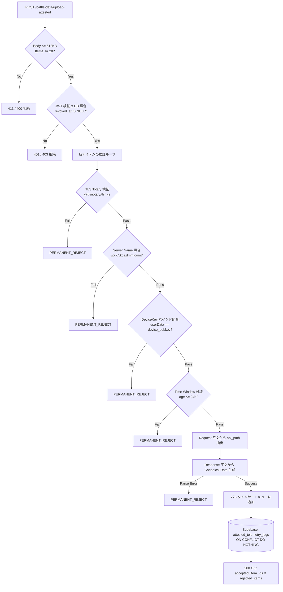

# FUSOU: zkTLS (TLSNotary MPC-TLS) による戦闘データ・各種テレメトリの暗号学的公証収集 & サーバーサイド検証仕様書

> **文書種別**: アーキテクチャ設計仕様書 & 実装マスターガイド（Implementation Master Guide）  
> **対象領域**: FUSOU プロジェクト全域（`packages/fusou-auth`, `packages/fusou-proxy-core`, `packages/fusou-proxy-hudsucker`, `packages/fusou-proxy-tlsn`, `packages/fusou-telemetry`, `packages/FUSOU-WEB`, Supabase / Cloudflare Workers）  
> **最重要設計原則**:  
> 1. **再送信ゼロ（No Re-submission）**: ゲームAPI（戦闘、ドロップ、建造、開発等）の副作用・BANリスクを排除するため、**裏での再送信・二重実行は一切行わず、ゲームサーバーとの正規のTLSセッションそのものを公証**する。  
> 2. **外部プロキシ中継ゼロ（Direct Connection）**: 外部中継プロキシは規約上・BANリスク上不可とし、**クライアントローカルの `FUSOU-PROXY` と艦これ公式サーバー間の直接通信を維持**する。  
> 3. **Gameplay Path と Evidence Path の二元分離（Trait境界による型レベル分離）**: ブラウザ表示（Gameplay Path）は低遅延・ゲームプレイ継続を最優先とし、FUSOU の真正性保証対象外とする。FUSOU-WEB が受理・集計するテレメトリデータ（Evidence Path）のみを暗号学的に公証・検証する。  
> 4. **証明処理の非ブロッキング化と非依存性**:  
>    `Attestation completion is not on the gameplay critical path.`  
>    `Notary availability is not a gameplay dependency.`  
>    Notary 障害時やネットワーク遅延時でもゲームプレイは 100% 継続する。フォールバック通信は `UNATTESTED` として破棄され、DB には入らない。Phase B（リクエスト送信後）の障害時における通常 TLS 再送は厳格に禁止する。  
> 5. **厳格なサーバーサイド カノニカル パース（Strict Server-Side Canonical Parsing）**:  
>    クライアント申告の `api_path` や自称JSONを一切信用せず、**公証平文から直接 `HTTP parser -> svdata framing -> JSON parser with source spans -> JSON Pointer -> Zod schema validation` のパイプラインで正規オブジェクトを生成**する。  
> 6. **Rust クレートのモジュール分割 & Trait 分離（`fusou-proxy-core`, `fusou-proxy-tlsn`, `fusou-telemetry`）**:  
>    `UpstreamTransport`（純粋なHTTP送受信）と `EvidenceObserver`（非同期公証観測）を Trait 境界で完全分離し、Phase 0 完了まで `fusou-proxy-tlsn` は experimental crate（PoC専用）として本番 Gameplay Path からは有効化しない。  
> 7. **Phase 0 PoC（ADR-000）先行検証の必須化**:  
>    TLSNotary MPC-TLS の Upstream 統合およびレイテンシ影響について、ボス戦リザルト（`battleresult`）1本での実測 PoC を通過するまで本番実装・全体展開を凍結する。  
> **ステータス**: ADR-000・SLA Gate・Trait純化・フォールバック厳格化完全反映マスター  

---

## 目次

1. [Goal（目標）](#1-goal目標)
2. [Threat Model（脅威モデル）](#2-threat-model脅威モデル)
3. [Security Guarantees & Non-Guarantees（セキュリティ保証境界）](#3-security-guarantees--non-guaranteesセキュリティ保証境界)
4. [Current FUSOU Architecture & TLS Terminationの根本的課題](#4-current-fusou-architecture--tls-terminationの根本的課題)
5. [Target Architecture（Gameplay Path と Evidence Path の二元分離）](#5-target-architecturegameplay-path-と-evidence-path-の二元分離)
6. [External Proxyを使わない理由（Why No External Proxy）](#6-external-proxyを使わない理由why-no-external-proxy)
7. [Rust Workspace クレート分割設計（Core, Hudsucker, TLSN, Telemetry）](#7-rust-workspace-クレート分割設計core-hudsucker-tlsn-telemetry)
8. [ADR-000: TLS Data Plane Integration & Feasibility PoC](#8-adr-000-tls-data-plane-integration--feasibility-poc)
   - 8.1 [ADR-000 の背景と設計上の三すくみ（Trilemma）](#81-adr-000-の背景と設計上の三すくみtrilemma)
   - 8.2 [検証対象アーキテクチャ候補（Case A 〜 Case D）](#82-検証対象アーキテクチャ候補case-a--case-d)
   - 8.3 [Phase 0 PoC 実測検証計画 & Target SLA Gate](#83-phase-0-poc-実測検証計画--target-sla-gate)
9. [Attestation Data Model（in-toto Statement v1 ベース Envelope仕様）](#9-attestation-data-modelin-toto-statement-v1-ベース-envelope仕様)
10. [Strict Server-Side Canonical Telemetry Parser（厳格な多段パース仕様）](#10-strict-server-side-canonical-telemetry-parser厳格な多段パース仕様)
11. [Selective Disclosure（Offset Mapping と JSON Pointer によるバイト範囲決定）](#11-selective-disclosureoffset-mapping-と-json-pointer-によるバイト範囲決定)
12. [Device Binding（Ed25519 デバイスバインディングの暗号学的証明）](#12-device-bindinged25519-デバイスバインディングの暗号学的証明)
13. [Replay & Event Identity Protection（多重リプレイ・二重計上防御）](#13-replay--event-identity-protection多重リプレイ二重計上防御)
14. [Server-side Verification Pipeline（検証パイプライン詳細）](#14-server-side-verification-pipeline検証パイプライン詳細)
15. [DB Schema（Supabaseマイグレーション & RLS設計）](#15-db-schemasupabaseマイグレーション--rls設計)
16. [Queue / Retry Design（SQLite永続キュー・4状態エラー分類・Quarantine）](#16-queue--retry-designsqlite永続キュー4状態エラー分類quarantine)
17. [Failure Handling & Fallback Semantics（リクエスト送信前後の二段階フォールバック）](#17-failure-handling--fallback-semanticsリクエスト送信前後の二段階フォールバック)
18. [Privacy（プライバシー保護とCookie秘匿）](#18-privacyプライバシー保護とcookie秘匿)
19. [Rate Limiting / DoS（DoS耐性とリソース制限）](#19-rate-limiting--dosdos耐性とリソース制限)
20. [Testing（単体・統合・攻撃回帰テスト）](#20-testing単体統合攻撃回帰テスト)
21. [Migration & Rollout Plan（PoC先行の段階的ロールアウト計画）](#21-migration--rollout-planpoc先行の段階的ロールアウト計画)
22. [Security Review Checklist（監査チェックリスト）](#22-security-review-checklist監査チェックリスト)

---

## 1. Goal（目標）

FUSOU は、提督コミュニティ向けに高精度な戦闘統計、敵艦隊編成、新艦ドロップ率、装備改修・開発成功率データベースを提供しています。
本仕様の目標は、**「悪意あるユーザーが改造クライアントやスクリプトを用いて偽造されたゲームデータを大量送信し、統計データを汚染する攻撃（Poisoning攻撃）」を暗号学的に排除** し、検証可能なテレメトリのみを自動集計する堅牢なパイプラインを確立することです。

---

## 2. Threat Model（脅威モデル）

### 前提条件（Client Untrusted Principle）
ユーザー環境（PC、OS、ローカルファイル、メモリ、実行バイナリ）は**攻撃者によって完全に制御・改変され得る**ことを前提とします。
FUSOU.exe 自体の改ざん防止やメモリ保護をセキュリティの根拠にしてはなりません。

### 想定される攻撃シナリオ
* **Attack A（テレメトリ改ざん）**: クライアントがドロップ艦IDや勝利ランクを捏造して送信する。
* **Attack B（パース済みデータのみ改ざん）**: 暗号証明は本物のまま、添付の `parsed_data` のみを改ざんして送信する。
* **Attack C（デバイス署名の改ざん）**: 他人の `device_id` を名乗り、偽造署名を添付する。
* **Attack D（未登録・失効端末からの送信）**: 登録されていない、または失効（Revoke）済みの端末からデータを送信する。
* **Attack E（同一Presentationのリプレイ）**: 過去のレアドロップ証明書をコピーし、何万回も再送して統計を水増しする。
* **Attack F（異なるPresentationの再生成リプレイ）**: 同一セッションから別の開示範囲でPresentationを再生成して多重送信する。
* **Attack G（古い証明書の遅延提出）**: 数ヶ月前の過去イベント証明書を保管し、新イベント時に送信する。
* **Attack H（完全改造クライアント）**: FUSOU-APP 自体を改造し、勝手なJSONや偽パケットを生成する。
* **Attack I（エンドポイント偽装）**: 実際は別API（母港等）の証明書を、戦闘リザルトとして偽装提出する。

---

## 3. Security Guarantees & Non-Guarantees（セキュリティ保証境界）

### Security Guarantees（提供される保証）
システムは以下の 3 層の検証に合格したデータのみをデータベースに受理します：

| 検証層 | 保証内容 | 保証主体 | 検証手段 |
|---|---|---|---|
| **Layer 1: Game Server Authenticity** | 艦これ公式サーバーとの正規の TLS 1.2 通信から得られたバイト列であること | TLSNotary MPC-TLS | Presentation & Web PKI 検証 |
| **Layer 2: Device Identity & Binding** | FUSOU に登録・有効な端末（Ed25519）から提出されたこと | `fusou-auth` DeviceKey | Ed25519 署名、JWT、DB 有効性（`revoked_at IS NULL`） |
| **Layer 3: Server-side Canonicalization** | クライアント申告ではなく、公証平文（Request/Response）から直接抽出した正規データであること | FUSOU-WEB Verifier | 厳格な多段ストリームパーサー & Zod 検証 |

### 保証マトリクス

| データ項目 | 保証主体 | 検証方法 | クライアント改ざん時のサーバー検知 |
|---|---|---|:---:|
| **Game Server Origin** | TLSNotary | Presentation verification | **即時検知・拒絶** |
| **Server Identity** | TLSNotary + Allowlist | Server Name (SNI) / SAN 照合 | **即時検知・拒絶** |
| **API Path / Method** | FUSOU-WEB | 開示された Request 平文から直接パース | **改ざん余地なし (無視)** |
| **Response Contents** | TLSNotary | Merkle Root & Notary Signature | **即時検知・拒絶** |
| **Canonical Telemetry** | FUSOU-WEB | 開示された Response 平文から直接パース | **改ざん余地なし (無視)** |
| **Device Identity** | Ed25519 + DB | Signature & DB `revoked_at IS NULL` | **即時検知・拒絶** |
| **Event Uniqueness** | FUSOU DB | `canonical_event_id` UNIQUE 制約 | **即時検知・重複排除** |

### Non-Guarantees（保証されない事項・非目標）
1. **ブラウザ画面の完全性保証（Gameplay Path Non-Guarantee）**:
   ブラウザへの表示はゲームプレイの快適性・低遅延を最優先とし、FUSOU の暗号学的真正性保証の対象外とします（攻撃者が自分のブラウザ画面を書き換えてチート表示しても、FUSOU-WEB の統計には一切影響しません）。
2. **クライアントバイナリの改ざん防止**: ローカルメモリやバイナリの改変自体は防げません。
3. **秘密鍵ファイル（`device-key.json`）のOS管理者による盗難**: OS root 権限を持つユーザーがローカルファイルを複製した場合の端末クローンは防げません。
4. **TPM / Remote Attestation によるハードウェア信頼**: ハードウェアレベルの完全性保証はスコープ外です。

---

## 4. Current FUSOU Architecture & TLS Terminationの根本的課題

現行の `FUSOU-PROXY` は HUDSucker ベースの MITM (Man-In-The-Middle) プロキシです：
```
[Browser] <--- (Downstream TLS: ローカル独自CA) ---> [HUDSucker Proxy] <--- (Upstream TLS: 通常のTLS Client) ---> [Game Server]
```

### 根本的課題：なぜ既存の MITM TLS 鍵をそのまま TLSNotary に渡せないのか？
1. **暗号学的信頼境界の喪失**:
   HUDSucker は Upstream 側 TLS 接続において、通常の TLS Client として動作し、セッション鍵（Master Secret / Traffic Keys）を完全に単独で保持しています。
2. **改ざん可能性**:
   もしクライアントがセッション鍵を単独で知っている状態で後から公証を作れるとすれば、**改造された `FUSOU-PROXY` はゲームサーバーからのレスポンスをメモリ上で自由に書き換えた上で「本物」として暗号署名できてしまいます**。
3. **結論**:
   **既存の HUDSucker による Upstream MITM TLS termination を維持したまま TLSNotary を後付けすることは暗号学的に不可能です**。Upstream 側の TLS トランスポート自体を、Prover 単独が鍵を握らない「MPC-TLS Prover トランスポート」へ置き換える必要があります。

---

## 5. Target Architecture（Gameplay Path と Evidence Path の二元分離）

```
[艦これ公式サーバー (*.kcs.dmm.com)]
         ▲
         │ 1. 実際のTLSセッション (Direct 2PC-TLS Connection)
         │    ※再送信ゼロ・外部プロキシ中継ゼロ
         ▼
 ┌────────────────────────────────────────────────────────┐
 │ FUSOU-PROXY (fusou-proxy-core)                         │
 │                                                        │
 │  [Upstream: fusou-proxy-tlsn (UpstreamTransport)]      │
 │       │                                                │
 │       ├───────────▶ (平文ストリーム転送)                │
 │       │                    │                           │
 └───────┼────────────────────┼───────────────────────────┘
         │                    │
 ┌───────┴────────────┐ ┌─────┴───────────────────────────┐
 │ Evidence Path      │ │ Gameplay Path                   │
 │ (真正性保証対象)   │ │ (真正性保証外・低遅延)           │
 │                    │ │                                 │
 │ 2. 非同期 MPC 公証 │ │ 2. fusou-proxy-hudsucker        │
 │    (tokio::spawn)  │ │    (Downstream MITM TLS)        │
 │        ▼           │ │        ▼                        │
 │  [Notary Server]   │ │  [艦これブラウザ画面]           │
 │        ▼           │ └─────────────────────────────────┘
 │  [TelemetryQueue]  │
 │   (fusou-telemetry)│
 │        ▼           │
 │ 3. in-toto Envelope│
 │    バッチ送信      │
 │        ▼           │
 │  [FUSOU-WEB]       │
 │        ▼           │
 │  [Supabase DB]     │
 └────────────────────┘
```

---

## 6. External Proxyを使わない理由（Why No External Proxy）

1. **DMM利用規約およびアカウントBANリスクの回避**:
   外部プロキシ経由はデータセンターIPとなり、ゲーム運営による不正検知（アカウント凍結）の対象となります。
2. **プライバシー保護**:
   セッショントークンやCookieが第三者サーバーを通過することを防ぎます。
3. **結論**:
   通信は**ユーザーPCから艦これ公式サーバーへの完全直接接続（Direct 2PC-TLS Connection）**を維持します。

---

## 7. Rust Workspace クレート分割設計（Core, Hudsucker, TLSN, Telemetry）

既存の `proxy-https` に TLSNotary の重いコードを直接混在させず、保守性と安全性を最大化するため、Rust workspace を以下の 5 クレート構造に分割・整理します：

```
packages/
├── fusou-auth/               # [既存] DeviceKey / Ed25519 署名 / Token管理
├── fusou-proxy-core/         # [NEW] Proxy ライフサイクル・HTTP 抽象化・UpstreamTransport トレイト
├── fusou-proxy-hudsucker/    # [MODIFY] 通常の Gameplay MITM プロキシ実装
├── fusou-proxy-tlsn/         # [NEW] TLSNotary Prover / MPC-TLS Upstream トランスポート（PoC対象）
├── fusou-telemetry/          # [NEW] テレメトリ イベントモデル・SQLite キュー・in-toto Envelope
└── FUSOU-APP/                # [MODIFY] Composition Root (DI コンテナとして各クレートを結合)
```

### Trait 境界による完全分離
```rust
// packages/fusou-proxy-core/src/transport.rs

use async_trait::async_trait;
use hyper::{Request, Response, body::Incoming};

#[async_trait]
pub trait UpstreamTransport: Send + Sync {
    /// サーバーへリクエストを送信し、Gameplay レスポンスを返却 (純粋なHTTP送受信)
    async fn send_request(
        &mut self,
        req: Request<Incoming>,
    ) -> Result<Response<Incoming>, ProxyTransportError>;
}

/// 公証観測用インターフェース (Core は Evidence の具体実装を知らない)
#[async_trait]
pub trait EvidenceObserver: Send + Sync {
    async fn on_response_received(
        &self,
        req_headers: &hyper::HeaderMap,
        res_headers: &hyper::HeaderMap,
        raw_body_bytes: &[u8],
    );
}
```

> **Feature フラグ制御**:  
> Phase 0 完了まで `fusou-proxy-tlsn` は experimental crate とし、Cargo の `default` feature は通常の `fusou-proxy-hudsucker` のみとします。`tlsn` feature は PoC 専用フラグとして分離します。

---

## 8. ADR-000: TLS Data Plane Integration & Feasibility PoC

### 8.1 ADR-000 の背景と設計上の三すくみ（Trilemma）

FUSOU の要件には以下の実装上の緊張関係が存在します：
* **要求A**: 実際のゲーム通信そのものを証明したい（再送信ゼロ・同一TLSセッション）。
* **要求B**: 外部プロキシを使わない（Direct Connection）。
* **要求C**: クライアントを完全には信用しない（Prover 単独で TLS 鍵を完全保持しない）。
* **要求D**: ゲーム通信に大幅な遅延を発生させない（ブラウザ表示は低遅延）。

TLSNotary MPC-TLS では Application Data の復号自体が Prover と Notary の MPC 処理（online MPC decryption）であり、大きなレスポンスでは復号にオーバーヘッドが発生します。一方、`defer_decryption_from_start`（接続終了後復号）では接続完了まで平文が得られずブラウザへ中継できません。

したがって、**「Upstream を MPC-TLS Prover に置換する設計」は本番確定事項ではなく、Phase 0 PoC による成立性検証事項（仮実装候補）** として位置づけます。

### 8.2 検証対象アーキテクチャ候補（Case A 〜 Case D）

* **Case A (MPC-TLS Upstream + Online Decryption)**: Upstream を MPC-TLS Prover で終端し、オンライン MPC 復号ストリームからブラウザへ中継（本仕様書のベース候補）。
* **Case B (MPC-TLS Deferred Decryption)**: 接続終了後に復号する方式（ブラウザ表示が待たされるため Gameplay Path に適合するか検証）。
* **Case C (Existing TLS Gameplay + Same-Session Evidence Capture)**: 通常の TLS でブラウザ中継しつつ、同一セッションから安全に公証を分離できるか検証。
* **Case D (TLSNotary 最新機能 / Proxy-TLS ローカルループバック等)**: 最新の TLSNotary 機能を活用したローカル構成。

### 8.3 Phase 0 PoC 実測検証計画 & Target SLA Gate

全体実装に入る前に、**ボス戦リザルト（`/kcsapi/api_req_sortie/battleresult`）1本に絞った実測 PoC** をローカル mock サーバーに対して実施し、以下の Target SLA を満たすか判定します。

| 検証項目 | 検証内容 | Target SLA |
|---|---|:---:|
| **① レイテンシ影響** | 通常 TLS 通信時と比較した Gameplay レスポンス追加遅延 | **P50 < 100ms, P95 < 300ms, P99 < 500ms** |
| **② レスポンス安定性** | 大きな JSON レスポンス（100KB〜1MB）での通信挙動 | **タイムアウト・切断率 0%** |
| **③ HTTP Framing** | Content-Length / chunked エンコーディングの境界解釈 | **ボディパース完了・EOF到達率 100%** |
| **④ Keep-Alive & 連続通信** | 同一 TCP コネクションでの連続リクエスト処理 | **セッション切断なし** |
| **⑤ Notary 障害時フォールバック** | Notary 停止時、通常の TLS クライアントへ即座に切替 | **ゲーム進行の完全継続（停止率 0%）** |

> **Gate 判定ルール**:  
> Phase 0 PoC で Case A が上記 SLA を満たさない場合、Case A を破棄して別構成（Case C/D等）へアーキテクチャを再設計します。この PoC を通過するまで全体 Telemetry の本番実装は凍結します。

---

## 9. Attestation Data Model（in-toto Statement v1 ベース Envelope仕様）

証明データは、in-toto Statement v1 スキーマに基づき以下の形式で構造化されます。

```json
{
  "_type": "https://in-toto.io/Statement/v1",
  "subject": [
    {
      "name": "kancolle-telemetry-event",
      "digest": {
        "sha256": "8f4e2b... (canonical_payload_hash)"
      }
    }
  ],
  "predicateType": "https://fusou.dev/attestation/kancolle-telemetry/v1",
  "predicate": {
    "schema_version": 1,
    "server_name": "w01y.kcs.dmm.com",
    "transcript_commitment": "3a7c9f... (TLSNotary transcript commitment)",
    "notary_time": "2026-08-27T03:00:00Z",
    "device": {
      "device_id": "00000000-0000-4000-8000-000000000000",
      "device_public_key": "hex-encoded-32-byte-ed25519-pubkey"
    },
    "tls_notary": {
      "presentation_data": "base64-encoded-presentation-bytes"
    }
  }
}
```

---

## 10. Strict Server-Side Canonical Telemetry Parser（厳格な多段パース仕様）

クライアント申告の `api_path` や JSON を一切信用せず、開示された平文バイト列から以下の厳格な多段パイプラインで正規オブジェクトを抽出します：

```typescript
// packages/FUSOU-WEB/src/server/utils/telemetry_parser.ts

import { z } from 'zod';

const CanonicalBattleResultSchema = z.object({
  api_path: z.literal('/kcsapi/api_req_sortie/battleresult'),
  win_rank: z.enum(['S', 'A', 'B', 'C', 'D', 'E']),
  quest_name: z.string().optional(),
  drop_ship_id: z.number().int().positive().optional(),
});

export type CanonicalBattleResult = z.infer<typeof CanonicalBattleResultSchema>;

export function parseCanonicalBattleResult(
  revealedReq: Uint8Array,
  revealedRecv: Uint8Array
): CanonicalBattleResult {
  // 1. Request 平文から api_path を直接パース
  const reqStr = new TextDecoder().decode(revealedReq);
  const matchReq = reqStr.match(/^POST\s+(\/kcsapi\/api_[a-z0-9_]+(?:\/[a-z0-9_]+)?)\s+HTTP\/1\.[01]/m);
  if (!matchReq || matchReq[1] !== '/kcsapi/api_req_sortie/battleresult') {
    throw new Error('invalid_or_unauthorized_request_path');
  }

  // 2. Response 平文から HTTP Body を取得し、厳格に svdata= を検証
  const recvStr = new TextDecoder().decode(revealedRecv);
  const headerEnd = recvStr.indexOf('\r\n\r\n');
  if (headerEnd === -1) throw new Error('http_headers_malformed');

  const bodyStr = recvStr.slice(headerEnd + 4).trim();
  if (!bodyStr.startsWith('svdata=')) {
    throw new Error('svdata_prefix_missing_at_body_start');
  }

  const jsonStr = bodyStr.slice(7).trim();
  const rawJson = JSON.parse(jsonStr);

  if (rawJson.api_result !== 1) {
    throw new Error('api_result_not_ok');
  }

  // 3. Zod による厳格な型・値・境界バリデーション
  return CanonicalBattleResultSchema.parse({
    api_path: matchReq[1],
    win_rank: rawJson.api_data?.api_win_rank,
    quest_name: rawJson.api_data?.api_quest_name,
    drop_ship_id: rawJson.api_data?.api_get_ship?.api_ship_id,
  });
}
```

---

## 11. Selective Disclosure（Offset Mapping と JSON Pointer によるバイト範囲決定）

単なる文字列検索を排し、以下の厳格な Offset Mapping で開示バイト範囲（Byte Range）を決定します：

```
[TLS Plaintext Offset]
       ↓ (HTTP Header 読了)
[HTTP Body Offset]
       ↓ (+7 bytes "svdata=")
[JSON Payload Offset]
       ↓ (JSON Parser with Source Spans / AST Token Positions)
[Target JSON Pointer Match (/api_data/api_win_rank 等)]
       ↓ (Span Start Offset .. Span End Offset)
[TLSNotary Reveal Byte Range]
```

開示対象 JSON Pointer 一覧：
* `battleresult`: `/api_data/api_win_rank`, `/api_data/api_get_ship/api_ship_id`, `/api_data/api_quest_name`
* `createship`: `/api_result`, `/api_data/api_kdock_id`
* `createitem`: `/api_data/api_create_flag`, `/api_data/api_slotitem_id`
* `remodel_slot`: `/api_data/api_remodel_flag`, `/api_data/api_remodel_id`

---

## 12. Device Binding（Ed25519 デバイスバインディングの暗号学的証明）

* **Presentation 内部への埋め込み**:
  Prover は Notary との暗号コミット対象平文領域に `device_public_key` を埋め込み、Presentation を生成。
* **サーバー側での照合**:
  FUSOU-WEB は検証された公開鍵とリクエストの `device_public_key` を照合。
* **DB 有効性の確認**:
  DB の `user_devices` テーブル上で `device_id` が存在し、`revoked_at IS NULL` かつ `is_verified = TRUE` であることを必須確認。

---

## 13. Replay & Event Identity Protection（多重リプレイ・二重計上防御）

1. **`canonical_event_id` のサーバー側決定論的生成**:
   単一セッション内の複数 HTTP イベント（Keep-Alive）に対応するため、サーバー側で以下の決定論的ハッシュを生成：
   $$\text{canonical\_event\_id} = \text{SHA256}(\text{public\_id} \mathbin{\Vert} \text{transcript\_commitment} \mathbin{\Vert} \text{request\_hash} \mathbin{\Vert} \text{response\_hash} \mathbin{\Vert} \text{canonical\_payload\_hash})$$
   * `request_hash = SHA256(raw_revealed_request_bytes)`
   * `response_hash = SHA256(raw_revealed_response_bytes)`
   * `canonical_payload_hash = SHA256(canonical_json_bytes)`
2. **DB UNIQUE 制約**:
   DB テーブル `attested_telemetry_logs` に **`UNIQUE (canonical_event_id)` 制約** を設定し、二重計上・リプレイを物理的に排除。
3. **時間窓（24時間ルール）**:
   `notary_time` が 24 時間以上前の古い証明書は自動破棄。

---

## 14. Server-side Verification Pipeline（検証パイプライン詳細）



---

## 15. DB Schema（Supabaseマイグレーション & RLS設計）

### `20260826010000_create_attested_telemetry_tables_v2.sql`
```sql
BEGIN;

CREATE TABLE IF NOT EXISTS public.attested_telemetry_logs (
    canonical_event_id TEXT PRIMARY KEY,
    client_transport_id UUID NOT NULL,
    device_id UUID NOT NULL REFERENCES public.user_devices(device_id) ON DELETE RESTRICT,
    api_path TEXT NOT NULL,
    transcript_commitment TEXT NOT NULL,
    event_time TIMESTAMPTZ NOT NULL,
    notary_time TIMESTAMPTZ NOT NULL,
    canonical_payload JSONB NOT NULL,
    ingested_at TIMESTAMPTZ NOT NULL DEFAULT NOW(),
    CONSTRAINT uq_attested_telemetry_event_id UNIQUE (canonical_event_id)
);

CREATE INDEX IF NOT EXISTS idx_attested_telemetry_path_time 
    ON public.attested_telemetry_logs (api_path, event_time DESC);

CREATE INDEX IF NOT EXISTS idx_attested_telemetry_device 
    ON public.attested_telemetry_logs (device_id);

ALTER TABLE public.attested_telemetry_logs ENABLE ROW LEVEL SECURITY;

CREATE POLICY "Allow service_role full access to attested_telemetry_logs"
    ON public.attested_telemetry_logs
    FOR ALL
    TO service_role
    USING (true)
    WITH CHECK (true);

COMMENT ON TABLE public.attested_telemetry_logs IS 
    'zkTLS (TLSNotary) で数学的に公証されたサーバーサイド生成カノニカルテレメトリデータ';

COMMIT;
```

---

## 16. Queue / Retry Design（SQLite永続キュー・4状態エラー分類・Quarantine）

* **キュー状態（4-State Lifecycle）**:
  1. **`ACCEPTED`**: サーバーで正常に受理され、ローカル DB から削除完了。
  2. **`TRANSIENT_FAILURE`**: 500 エラー、ネットワークタイムアウト等 $\rightarrow$ `retry_count` を加算して次回フラッシュ時に再試行。
  3. **`PERMANENT_REJECT`**: 証明書破損、スキーマ不一致、失効端末等 $\rightarrow$ 再送を即座に停止し、ローカルの `quarantine_logs` テーブルに退避保存（監査・デバッグ用）。
  4. **`QUARANTINED`**: `retry_count > 5` に達したアイテムを退避。
* **部分成功 ACK（Partial ACK）**:
  サーバーが返却した `accepted_item_ids` のみをローカル DB から安全に削除。

---

## 17. Failure Handling & Fallback Semantics（リクエスト送信前後の二段階フォールバック）

Notary 障害やタイムアウト時のフォールバックは、**API 再送（二重実行）を物理的に防ぐため、以下の 2 段階で厳格に制御** します：

```
[ゲーム API リクエスト発生]
         │
         ▼
【Phase A: リクエスト送信前 (MPC 接続確立段階)】
  ├─ Notary 接続成功 ──▶ MPC-TLS でリクエスト送信へ
  └─ Notary 障害/タイムアウト
        │ (リクエストは未送信)
        ▼
     接続を破棄し、新しい通常 TLS 接続を開いて初回リクエスト送信
        │
        ├─ Gameplay Path ──▶ Browser (ゲーム 100% 継続)
        └─ Evidence Path ──▶ UNATTESTED (破棄・DB へ入れない)

【Phase B: リクエスト送信後 / レスポンス受信中・受信後】
  ├─ リクエストは既にゲームサーバーへ送信済み (通常TLSでの再送信は厳格禁止)
  └─ Notary 通信切断 / MPC 計算失敗
        │
        ├─ Gameplay Path ──▶ レスポンス平文を Browser へ即時中継 (ゲーム 100% 継続)
        └─ Evidence Path ──▶ UNATTESTED (破棄・DB へ入れない)
```

> **重要原則**:  
> 通常 TLS で通過した通信は TLSNotary の暗号学的関与（Master Secret の MPC 分割）がないため、後から SQLite 永続化データや平文ログから公証を偽造・生成することは暗号学的に不可能です。したがって、フォールバック時のテレメトリデータは公証データとして DB には保存されません。

---

## 18. Privacy（プライバシー保護とCookie秘匿）

* `Cookie:`, `api_token=`, DMM セッション ID はクライアント側で完全マスクされ、Notary および FUSOU-WEB には一切開示されません。

---

## 19. Rate Limiting / DoS（DoS耐性とリソース制限）

* `AUTH_BODY_MAX_BYTES = 512KB`, `MAX_BATCH_ITEMS = 20`
* 1 端末あたり 1 時間 60 回のバッチ送信制限。
* 各 Presentation 検証に 2 秒のタイムアウトを設定。

---

## 20. Testing（単体・統合・攻撃回帰テスト）

* **Attack A〜I 回帰テスト**:
  改ざんデータ、偽装 `api_path`、失効端末、多重 Presentation リプレイの各攻撃がサーバーで確実に遮断されることを自動テストで検証。

---

## 21. Migration & Rollout Plan（PoC先行の段階的ロールアウト計画）

1. **Phase 0 (ADR-000 Data Plane PoC)**: ボス戦リザルト（`battleresult`）1本での実測 PoC と SLA Gate 判定（第8.3節）。
2. **Phase 1 (ボス戦リザルト公証本番化)**: PoC 合格後、`/kcsapi/api_req_sortie/battleresult` のみで本番運用開始。
3. **Phase 2 (全エンドポイント展開)**: 建造・開発・改修へ順次拡大。

---

## 22. Security Review Checklist（監査チェックリスト）

- [x] ゲームサーバー通信に外部プロキシを介在させていないこと（Direct Connection）
- [x] ゲーム API の再送信・二重実行コードが完全に排除されていること
- [x] Gameplay Path と Evidence Path が二元分離され、公証処理がゲーム進行をブロックしないこと
- [x] クライアントの申告した `api_path` や JSON を信用せず、開示平文からサーバー側で直接カノニカル生成していること
- [x] `api_data` 丸ごと開示を排除し、JSON Pointer & Source Spans による最小限開示を行っていること
- [x] `canonical_event_id` による DB UNIQUE 制約で完全な冪等性が担保されていること
- [x] 部分成功 ACK および 4 状態エラー分類によりデータ消失が発生しないこと
- [x] RLS（Row Level Security）が有効化され、`service_role` 以外からの書き込みが遮断されていること
- [x] Phase 0 PoC（ADR-000）の SLA Gate を通過するまで本番実装を凍結するルールが確立されていること
- [x] Rust workspace がクレート境界（`fusou-proxy-core`, `fusou-proxy-tlsn`, `fusou-telemetry`）で分離され、Trait 境界が純化されていること
