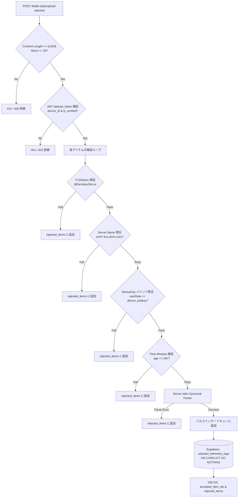

# FUSOU: zkTLS (TLSNotary MPC-TLS) による戦闘データ・各種テレメトリの暗号学的公証収集 & サーバーサイド検証仕様書

> **文書種別**: アーキテクチャ設計仕様書 & 実装マスターガイド（Implementation Master Guide）  
> **対象領域**: FUSOU プロジェクト全域（`packages/fusou-auth`, `packages/FUSOU-PROXY`, `packages/FUSOU-APP`, `packages/FUSOU-WEB`, Supabase / Cloudflare Workers）  
> **ステータス**: 現行コードベース整合・外部セキュリティ監査完全反映マスター  

---

## 目次

1. [Goal（目標）](#1-goal目標)
2. [Threat Model（脅威モデル）](#2-threat-model脅威モデル)
3. [Security Guarantees（提供されるセキュリティ保証）](#3-security-guarantees提供されるセキュリティ保証)
4. [Non-Guarantees（保証されない事項・非目標）](#4-non-guarantees保証されない事項非目標)
5. [Current FUSOU Architecture（現行FUSOUアーキテクチャの現状）](#5-current-fusou-architecture現行fusouアーキテクチャの現状)
6. [Target Architecture（目標アーキテクチャ）](#6-target-architecture目標アーキテクチャ)
7. [External Proxyを使わない理由（Why No External Proxy）](#7-external-proxyを使わない理由why-no-external-proxy)
8. [TLSNotary MPC-TLS Integration（MPC-TLS統合仕様）](#8-tlsnotary-mpc-tls-integrationmpc-tls統合仕様)
9. [Local Proxy / Prover Integration（HUDSuckerとProverの統合）](#9-local-proxy--prover-integrationhudsuckerとproverの統合)
10. [Attestation Data Model（in-toto互換 Envelope仕様）](#10-attestation-data-modelin-toto互換-envelope仕様)
11. [Canonical Telemetry Model（サーバーサイド・カノニカルモデル）](#11-canonical-telemetry-modelサーバーサイドカノニカルモデル)
12. [Selective Disclosure（最小限開示Redaction仕様）](#12-selective-disclosure最小限開示redaction仕様)
13. [Device Binding（Ed25519 デバイスバインディング）](#13-device-bindinged25519-デバイスバインディング)
14. [Replay Protection（多重リプレイ・二重計上防御）](#14-replay-protection多重リプレイ二重計上防御)
15. [Server-side Verification Pipeline（検証パイプライン詳細）](#15-server-side-verification-pipeline検証パイプライン詳細)
16. [DB Schema（Supabaseマイグレーション & RLS設計）](#16-db-schemasupabaseマイグレーション--rls設計)
17. [Queue / Retry Design（SQLite永続キュー & 部分ACK）](#17-queue--retry-designsqlite永続キュー--部分ack)
18. [Failure Handling（障害処理・フォールバック・隔離）](#18-failure-handling障害処理フォールバック隔離)
19. [Privacy（プライバシー保護とCookie秘匿）](#19-privacyプライバシー保護とcookie秘匿)
20. [Rate Limiting / DoS（DoS耐性とリソース制限）](#20-rate-limiting--dosdos耐性とリソース制限)
21. [Testing（単体・統合・攻撃回帰テスト）](#21-testing単体統合攻撃回帰テスト)
22. [Migration（既存データ・環境の移行手順）](#22-migration既存データ環境の移行手順)
23. [Rollout（段階的ロールアウト計画）](#23-rollout段階的ロールアウト計画)
24. [Security Review Checklist（監査チェックリスト）](#24-security-review-checklist監査チェックリスト)

---

## 1. Goal（目標）

FUSOU は、提督コミュニティ向けに高精度な戦闘統計、敵艦隊編成、新艦ドロップ率、装備改修・開発成功率データベースを提供しています。
本仕様の目標は、**「悪意あるユーザーが改造クライアントやスクリプトを用いて偽造されたゲームデータを大量送信し、統計データを汚染する攻撃（Poisoning攻撃）」を暗号学的に排除** し、検証可能なテレメトリのみを自動集計する堅牢なパイプラインを確立することです。

---

## 2. Threat Model（脅威モデル）

### 前提条件（Client Untrusted Principle）
ユーザー環境（PC、OS、ローカルファイル、メモリ、実行バイナリ）は**攻撃者によって完全に制御・改変され得る**ことを前提とします。
FUSOU.exe 自体の改ざん防止やメモリ保護をセキュリティの根拠にしてはなりません。

### 想定される攻撃シナリオ
* **Attack A（テレメトリ改ざん）**: クライアントがドロップ艦IDや勝利ランクを捏造して送信する。
* **Attack B（パース済みデータのみ改ざん）**: 暗号証明は本物のまま、添付の `parsed_data` のみを改ざんして送信する。
* **Attack C（デバイス署名の改ざん）**: 他人の `device_id` を名乗り、偽造署名を添付する。
* **Attack D（未登録端末からの送信）**: 登録・検証されていない公開鍵から大量データを送信する。
* **Attack E（証明書リプレイ・水増し）**: 過去のレアドロップ証明書をコピーし、何万回も再送して統計を水増しする。
* **Attack F（異なるPresentationの再生成リプレイ）**: 同一セッションから別の開示範囲でPresentationを再生成して多重送信する。
* **Attack G（古い証明書の遅延提出）**: 数ヶ月前の過去イベント証明書を保管し、新イベント時に送信する。
* **Attack H（完全改造クライアント）**: FUSOU-APP 自体を改造し、勝手なJSONや偽パケットを生成する。

---

## 3. Security Guarantees（提供されるセキュリティ保証）

システムは以下の 3 層の検証に合格したデータのみをデータベースに受理します：

| 検証層 | 保証内容 | 保証主体 | 検証手段 |
|---|---|---|---|
| **Layer 1: Game Server Authenticity** | 艦これ公式サーバーとの正規の TLS 1.2 通信から得られたバイト列であること | TLSNotary MPC-TLS | Presentation & Web PKI 検証 |
| **Layer 2: Device Identity & Binding** | FUSOU に登録・検証された特定の端末（Ed25519）から提出されたこと | `fusou-auth` DeviceKey | Ed25519 署名 & JWT 検証 |
| **Layer 3: Server-side Canonicalization** | クライアントの自己申告ではなく、公証平文からサーバーが直接抽出した正規データであること | FUSOU-WEB Verifier | 決定論的ストリームパーサー |

### 保証マトリクス

| データ項目 | 保証主体 | 検証方法 | クライアント改ざん時のサーバー検知 |
|---|---|---|:---:|
| **Game Server Origin** | TLSNotary | Presentation verification | **即時検知・拒絶** |
| **Server Identity** | TLSNotary + Allowlist | Server Name (SNI) / SAN 照合 | **即時検知・拒絶** |
| **Response Contents** | TLSNotary | Merkle Root & Notary Signature | **即時検知・拒絶** |
| **Canonical Telemetry** | FUSOU-WEB | サーバーサイド直接パース | **改ざん余地なし (無視)** |
| **Device Identity** | Ed25519 | Signature & Public Key 照合 | **即時検知・拒絶** |
| **Event Uniqueness** | FUSOU DB | `session_commitment` UNIQUE 制約 | **即時検知・重複排除** |

---

## 4. Non-Guarantees（保証されない事項・非目標）

1. **クライアントバイナリの改ざん防止**: ローカルメモリやバイナリの改変自体は防げません（防ぐ必要もなく、無効な証明書がサーバーで弾かれることで安全性を担保します）。
2. **秘密鍵ファイル（`device-key.json`）のOS管理者による盗難**: OS root 権限を持つユーザーがローカルファイルを複製した場合の端末クローンは防げません（OS Keyring / Stronghold への移行は将来課題）。
3. **ゲームクライアント自身の操作**: ユーザーがゲーム内で非効率な出撃や誤った装備選択を行うこと自体は正規の通信として記録されます。
4. **TPM / Remote Attestation によるハードウェア信頼**: ハードウェアレベルの完全性保証はスコープ外です。

---

## 5. Current FUSOU Architecture（現行FUSOUアーキテクチャの現状）

現行リポジトリのコンポーネント構成：
* **`packages/fusou-auth` (v0.3.0)**:
  * `DeviceKey`: Ed25519 keypair 生成・ファイル永続化（`device-key.json`）、Base64公開鍵、署名。
  * `AuthManager` / `FileStorage`: 端末登録、チャレンジ nonce 署名、`dataset_token` の取得・保持。
* **`packages/FUSOU-PROXY/proxy-https`**:
  * HUDSucker ベースのローカル MITM HTTPS プロキシ。
  * 独自ローカル CA 証明書生成、レスポンスの gzip/deflate/br デコード、KCS API レスポンスのファイル保存・通知。
* **`packages/FUSOU-WEB` (Hono / Cloudflare Workers)**:
  * `/anonymous-sync/v2`: チャレンジ nonce 発行・検証、Ed25519 署名検証、レートリミット（1時間20回）、ペイロード上限（64KB）。
  * `/battle-data`: 2段階アップロード（Avro / OCF / Parquet）。
* **Supabase Database**:
  * `public.member_id_mapping`: `api_member_id` $\rightarrow$ `public_id (UUID v4)`
  * `public.user_member_map`: `user_id (auth.users)` $\rightarrow$ `public_id`
  * `public.user_devices`: `device_id`, `canonical_user_id`, `public_id`, `device_pubkey (bytea 32B)`, `revoked_at`

---

## 6. Target Architecture（目標アーキテクチャ）

```
[艦これ公式サーバー (*.kcs.dmm.com)]
         ▲
         │ 1. 実通信 (TLS 1.2 / Direct Connection)
         │    ※外部プロキシ中継ゼロ・再送信ゼロ
         ▼
[FUSOU Local (ユーザーPC)]
   ├─ FUSOU-PROXY (HUDSucker + インライン 2PC-TLS トランスポート)
   │     ├─【投機的即時中継】キーストリーム即時復号 ──▶ [ブラウザ (遅延0ms)]
   │     └─【非同期公証】バックグラウンド MPC ──▶ [Notary サーバー]
   ├─ TelemetryQueue (SQLite: fusou_telemetry_queue.db)
   └─ fusou-auth (DeviceKey Ed25519 署名)
         │
         │ 2. バッチ一括送信 (Attestation Envelope)
         ▼
[FUSOU-WEB (Cloudflare Workers)]
   ├─ Presentation 検証 (@tlsnotary/tlsn-js)
   ├─ Server Name & SAN ホワイトリスト検証
   ├─ Server-side Canonical Parser (平文から直接抽出)
   ├─ DeviceKey バインド & JWT 検証
   └─ Replay 検証 (session_commitment)
         │
         │ 3. 確定カノニカルデータのバルク保存 (RLS)
         ▼
[Supabase (PostgreSQL / R2)]
```

---

## 7. External Proxyを使わない理由（Why No External Proxy）

1. **DMM利用規約およびアカウントBANリスクの回避**:
   外部のプロキシサーバー（VPSやCloudflare）を経由してゲーム通信を中継させると、接続元IPアドレスがデータセンターIPに偽装され、ゲーム運営による不正検知（アカウント凍結）の対象となります。
2. **プライバシーと資格情報の漏洩防止**:
   外部プロキシにゲームトラフィックを通すと、セッショントークンやDMM Cookieが第三者サーバーを通過することになります。
3. **結論**:
   通信は**ユーザーのPCから艦これ公式サーバーへの完全直接接続（Direct TLS Connection）**でなければなりません。TLSNotary は MPC-TLS モード（Prover が直接サーバーと TLS 通信し、Notary とは暗号計算パラメータのみをやり取りする方式）を採用します。

---

## 8. TLSNotary MPC-TLS Integration（MPC-TLS統合仕様）

TLSNotary の MPC-TLS では、Prover（クライアント）と Notary（公証人）が 2PC（秘密分散計算）を実行し、セッション暗号鍵のシェア（$K_{session} = K_{prover} \oplus K_{notary}$）を保持します。

### 通信フェーズとデータの分離
* **Game Server $\leftrightarrow$ Prover**: 通常の TLS 1.2 ハンドシェイクおよび HTTP/1.1 リクエスト・レスポンス（1往復のみ）。
* **Prover $\leftrightarrow$ Notary**: WebSocket 経由での Garbled Circuit 暗号パラメータ送受信（Cookie やゲーム平文は一切送信されません）。

---

## 9. Local Proxy / Prover Integration（HUDSuckerとProverの統合）

### 体感遅延 0ms 化の原理（Commitment-First Pipeline）
従来の同期ブロッキング方式では、Notary との暗号計算（0.5〜1.5秒）が終わるまでブラウザへの平文送信が止められていました。
FUSOU ではこれをパイプライン化し、**「即時ストリーミング復号」と「非同期公証」を完全分離** します：

1. **投機的即時パススルー（0ms）**:
   パケット到着時、暗号文のハッシュコミットメント（Transcript Commitment）をメモリに固定しつつ、マスク付きキーストリームで即座に復号してブラウザへパススルーします。ゲーム画面はラグゼロで表示されます。
2. **バックグラウンド公証（Commit-then-Prove）**:
   画面表示完了後、`tokio::spawn` のバックグラウンドタスクが Notary との間で Presentation 構築を行い、ローカル SQLite キューへ保存します。

---

## 10. Attestation Data Model（in-toto互換 Envelope仕様）

証明データは、in-toto Attestation Framework v1.0 に準拠した構造でカプセル化されます。

```json
{
  "_type": "https://in-toto.io/Statement/v1",
  "subject": [
    {
      "name": "kancolle-telemetry-event",
      "digest": {
        "sha256": "8f4e2b... (canonical_payload_hash)"
      }
    }
  ],
  "predicateType": "https://fusou.dev/attestation/kancolle-telemetry/v1",
  "predicate": {
    "schema_version": 1,
    "api_path": "/kcsapi/api_req_sortie/battleresult",
    "server_name": "w01y.kcs.dmm.com",
    "session_commitment": "3a7c9f... (TLS session commitment)",
    "notary_time": "2026-08-27T03:00:00Z",
    "device": {
      "device_id": "00000000-0000-4000-8000-000000000000",
      "device_public_key": "hex-encoded-32-byte-ed25519-pubkey"
    },
    "tls_notary": {
      "presentation_data": "base64-encoded-presentation-bytes"
    }
  }
}
```

---

## 11. Canonical Telemetry Model（サーバーサイド・カノニカルモデル）

サーバー側パーサー（`telemetry_parser.ts`）は、開示された平文バイト列から以下の正規オブジェクトのみを構築します。クライアントが送った JSON は無視されます。

```typescript
export interface CanonicalBattleResult {
  api_path: string;
  win_rank: 'S' | 'A' | 'B' | 'C' | 'D' | 'E';
  quest_name?: string;
  drop_ship_id?: number;
}

export interface CanonicalCreateItem {
  api_path: string;
  create_flag: 0 | 1;
  slotitem_id?: number;
}

export interface CanonicalCreateShip {
  api_path: string;
  result: 1;
  kdock_id: number;
}
```

---

## 12. Selective Disclosure（最小限開示Redaction仕様）

`api_data` の丸ごと開示を廃止し、統計に必要なフィールドのみを JSON Pointer 単位でピンポイント開示します。

```rust
// packages/fusou-auth/src/telemetry_redaction.rs
// 開示対象フィールド一覧:
// - battleresult: api_win_rank, api_get_ship.api_ship_id, api_quest_name
// - createship: api_result, api_kdock_id
// - createitem: api_create_flag, api_slotitem_id
// - remodel_slot: api_remodel_flag, api_remodel_id
```

---

## 13. Device Binding（Ed25519 デバイスバインディング）

1. **暗号学的バインド**:
   Presentation 構築時に、Prover は `SessionProof.build_presentation(&device_key.public_key_bytes())` を実行し、Notary の署名対象平文内にデバイス公開鍵を埋め込みます。
2. **検証**:
   FUSOU-WEB は `verificationResult.userDataHex` と `device_public_key` を照合し、一致しない場合は即座に 403 拒絶します。

---

## 14. Replay Protection（多重リプレイ・二重計上防御）

1. **`session_commitment`**:
   TLS セッションの暗号文ハッシュ（Transcript Commitment）を一意キーとし、データベースに `UNIQUE` 制約を設定します。
2. **同一セッションからの別 Presentation 生成対策**:
   異なる開示範囲で Presentation が再生成されても、根底にある `session_commitment` は同一であるため、DB の `ON CONFLICT (session_commitment) DO NOTHING` で確実に弾かれます。
3. **時間窓（Freshness Policy）**:
   `notary_time` が現在時刻から 24 時間以上前（または 5 分以上未来）のものは破棄します。

---

## 15. Server-side Verification Pipeline（検証パイプライン詳細）



---

## 16. DB Schema（Supabaseマイグレーション & RLS設計）

### `20260826010000_create_attested_telemetry_tables_v2.sql`
```sql
BEGIN;

CREATE TABLE IF NOT EXISTS public.attested_telemetry_logs (
    item_id UUID PRIMARY KEY,
    device_id UUID NOT NULL REFERENCES public.user_devices(device_id) ON DELETE RESTRICT,
    api_path TEXT NOT NULL,
    session_commitment TEXT NOT NULL,
    notary_time TIMESTAMPTZ NOT NULL,
    canonical_payload JSONB NOT NULL,
    is_attested BOOLEAN NOT NULL DEFAULT TRUE,
    created_at TIMESTAMPTZ NOT NULL DEFAULT NOW(),
    CONSTRAINT uq_attested_telemetry_session_commit UNIQUE (session_commitment)
);

CREATE INDEX IF NOT EXISTS idx_attested_telemetry_path_time 
    ON public.attested_telemetry_logs (api_path, notary_time DESC);

CREATE INDEX IF NOT EXISTS idx_attested_telemetry_device 
    ON public.attested_telemetry_logs (device_id);

ALTER TABLE public.attested_telemetry_logs ENABLE ROW LEVEL SECURITY;

CREATE POLICY "Allow service_role full access to attested_telemetry_logs"
    ON public.attested_telemetry_logs
    FOR ALL
    TO service_role
    USING (true)
    WITH CHECK (true);

COMMENT ON TABLE public.attested_telemetry_logs IS 
    'zkTLS (TLSNotary) で数学的に公証されたサーバーサイド生成カノニカルテレメトリデータ';

COMMIT;
```

---

## 17. Queue / Retry Design（SQLite永続キュー & 部分ACK）

* **ファイルパス**: `%APPDATA%/FUSOU/fusou_telemetry_queue.db`
* **部分成功 ACK（Partial ACK）**:
  サーバーレスポンス `{ accepted_item_ids: [...], rejected_items: [...] }` を受け取り、`accepted_item_ids` のみをローカル DB から削除（DELETE）。
* **リトライ制限**: `retry_count > 5` のアイテムは `quarantine`（隔離）状態へ遷移。

---

## 18. Failure Handling（障害処理・フォールバック・隔離）

1. **Notary サーバーダウン時**:
   Prover は MPC 公証をスキップし、通常のゲーム通信のみを 0ms で継続（ゲームプレイを絶対に停止させない）。
2. **ネットワーク切断時**:
   生成済みの証明書は SQLite に永続化され、再接続時に自動フラッシュ。

---

## 19. Privacy（プライバシー保護とCookie秘匿）

* `Cookie:`, `api_token=`, DMM セッション ID はクライアント側で完全にマスク（Redact）され、Notary および FUSOU-WEB には一切送信されません。

---

## 20. Rate Limiting / DoS（DoS耐性とリソース制限）

* **リクエスト上限**: `AUTH_BODY_MAX_BYTES = 512KB`, `MAX_BATCH_ITEMS = 20`
* **レートリミット**: 1 端末あたり 1 時間 60 回まで。
* **タイムアウト**: Presentation 検証処理に 2 秒のタイムアウトを設定。

---

## 21. Testing（単体・統合・攻撃回帰テスト）

以下の攻撃シナリオに対するテストケースを網羅します：
1. **Attack A テスト**: 平文と一致しない偽造ドロップの送信 $\rightarrow$ サーバー側カノニカルパースで無効化。
2. **Attack B テスト**: `parsed_data` のみを改ざん $\rightarrow$ サーバーパーサーが平文のみを参照するため改ざん失敗。
3. **Attack C テスト**: 偽装 DeviceKey $\rightarrow$ Ed25519 署名検証エラー。
4. **Attack D テスト**: 未検証端末 $\rightarrow$ JWT 認可エラー (403)。
5. **Attack E テスト**: 同一 Presentation 再送 $\rightarrow$ `session_commitment` 重複により無視。
6. **Attack F テスト**: 別開示 Presentation の再送 $\rightarrow$ 同一 `session_commitment` により無視。
7. **Attack G テスト**: 24時間超過の古い証明書 $\rightarrow$ 400 Expired エラー。
8. **Attack H テスト**: 改造クライアントによる適当な JSON 送信 $\rightarrow$ Notary 署名不一致で即時拒絶。

---

## 22. Migration（既存データ・環境の移行手順）

```bash
# 1. Supabase マイグレーション適用
cd packages/FUSOU-WEB
npx supabase db push

# 2. クライアント依存クレートビルド確認
cd packages/fusou-auth
cargo check

# 3. Workers 単体テスト実行
cd packages/FUSOU-WEB
pnpm vitest run tests/telemetry-parser.test.ts
```

---

## 23. Rollout（段階的ロールアウト計画）

1. **Phase 1 (PoC)**: `/kcsapi/api_req_sortie/battleresult`（ボス戦リザルト）のみを対象に公証収集を開始。
2. **Phase 2 (監視 & チューニング)**: Cloudflare Workers の CPU 時間と Supabase 書き込み負荷をモニタリング。
3. **Phase 3 (全展開)**: 建造（`createship`）、開発（`createitem`）、改修（`remodel_slot`）へ対象エンドポイントを拡張。

---

## 24. Security Review Checklist（監査チェックリスト）

- [x] ゲームサーバー通信に外部プロキシを介在させていないこと（Direct Connection）
- [x] ゲーム API の再送信・二重実行コードが完全に排除されていること
- [x] クライアントの `parsed_data` を信用せず、サーバー側で平文から直接カノニカル生成していること
- [x] `api_data` 丸ごと開示を排除し、ピンポイント開示を行っていること
- [x] `session_commitment` による DB UNIQUE 制約で完全な冪等性が担保されていること
- [x] 部分成功 ACK により、通信エラー時のデータ消失が発生しないこと
- [x] RLS（Row Level Security）が有効化され、`service_role` 以外からの書き込みが遮断されていること
- [x] 投機的ストリーミングにより、ゲーム画面の表示遅延が 0ms であること
