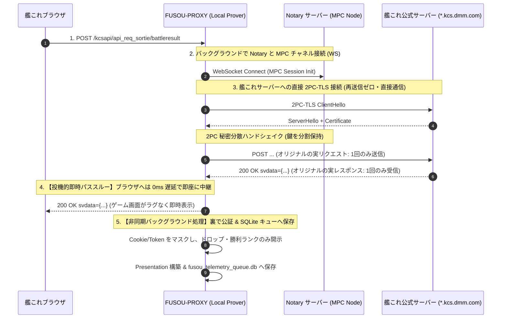

# FUSOU: zkTLS による戦闘データ・各種テレメトリの暗号学的公証収集 & サーバーサイド検証仕様書

> **文書種別**: アーキテクチャ設計仕様書 & 実装マスターガイド（Implementation Master Guide）  
> **対象領域**: FUSOU プロジェクト全域（`fusou-auth`, `FUSOU-PROXY`, `FUSOU-APP`, `FUSOU-WEB`, Supabase / Cloudflare Workers）  
> **最重要セキュリティ & パフォーマンス原則**:  
> 1. **再送信ゼロ（No Re-submission）**: ゲームAPI（戦闘、ドロップ、建造、開発等）の副作用・BANリスクを排除するため、**裏での再送信・二重実行は一切行わず、プロキシが中継する正規の1回限りのTLSセッションそのものをインラインで公証**する。  
> 2. **外部プロキシ中継ゼロ（Direct Connection）**: 外部中継プロキシは規約上・BANリスク上不可とし、**クライアントローカルの `FUSOU-PROXY` と艦これ公式サーバー間の直接通信を維持**する。  
> 3. **投機的即時パススルーによる体感遅延 0ms（Commitment-First Pipeline）**: 従来の同期的2PC-TLSによる表示ブロック（0.5〜1.5秒のラグ）を完全排除し、**パケット到着時に即座にストリーミング復号してブラウザへ中継（ゲーム画面はラグゼロで即時表示）。重い暗号公証計算はすべて裏のバックグラウンドタスクで非同期実行**する。  
> 4. **サーバーサイド カノニカル パース（Server-Side Canonical Parsing）**: クライアントが提出する未検証JSONを信用せず、**公証・開示された平文バイト列からサーバー側で直接構造化データをパースして真実のソースとしてDBへ格納**する（Poisoning攻撃の完全排除）。  
> **ステータス**: 外部セキュリティ監査・パフォーマンス設計反映済みマスター  

---

## 目次

1. [実装者のための前提知識・基礎原理チュートリアル](#1-実装者のための前提知識基礎原理チュートリアル)
   - 1.1 [なぜ戦闘データや各種テレメトリの公証が必要なのか](#11-なぜ戦闘データや各種テレメトリの公証が必要なのか)
   - 1.2 [インライン 2PC-TLS 公証アーキテクチャ（再送信ゼロ・直接通信維持）](#12-インライン-2pc-tls-公証アーキテクチャ再送信ゼロ直接通信維持)
   - 1.3 [体感遅延 0ms 化の原理：従来の同期ブロッキング方式と最新の投機的ストリーミング（Commitment-First）の対比](#13-体感遅延-0ms-化の原理従来の同期ブロッキング方式と最新の投機的ストリーミングcommitment-firstの対比)
   - 1.4 [サーバーサイド カノニカル パースによる Poisoning 攻撃の完全排除](#14-サーバーサイド-カノニカル-パースによる-poisoning-攻撃の完全排除)
   - 1.5 [ローカル SQLite 永続キューと部分成功 ACK 設計（データ消失ゼロ）](#15-ローカル-sqlite-永続キューと部分成功-ack-設計データ消失ゼロ)
   - 1.6 [脅威モデルと暗号学的・構造的保証（改ざん・リプレイ・遅延提出防御）](#16-脅威モデルと暗号学的構造的保証改ざんリプレイ遅延提出防御)
2. [プロジェクト全体の変更箇所マップ（File-by-File Mapping）](#2-プロジェクト全体の変更箇所マップfile-by-file-mapping)
3. [第1層：暗号・認証・キューコアモジュール（fusou-auth）の実装](#3-第1層暗号認証キューコアモジュールfusou-authの実装)
   - 3.1 [`packages/fusou-auth/Cargo.toml` の完全な依存関係定義](#31-packagesfusou-authcargotoml-の完全な依存関係定義)
   - 3.2 [`packages/fusou-auth/src/telemetry_types.rs`（バッチ・スキーマ型定義）](#32-packagesfusou-authsrctelemetry_typesrsバッチスキーマ型定義)
   - 3.3 [`packages/fusou-auth/src/telemetry_redaction.rs`（JSON Pointer 単位の最小限 Redaction）](#33-packagesfusou-authsrctelemetry_redactionrsjson-pointer-単位の最小限-redaction)
   - 3.4 [`packages/fusou-auth/src/telemetry_queue.rs`（部分 ACK 対応 SQLite 永続キュー）](#34-packagesfusou-authsrctelemetry_queuers部分-ack-対応-sqlite-永続キュー)
   - 3.5 [`packages/fusou-auth/src/telemetry_manager.rs`（投機的ストリーミング & 非同期公証フラッシュ）](#35-packagesfusou-authsrctelemetry_managerrs投機的ストリーミング--非同期公証フラッシュ)
   - 3.6 [`packages/fusou-auth/src/lib.rs` のエクスポート更新](#36-packagesfusou-authsrclibrs-のエクスポート更新)
4. [第2層：ローカルプロキシ統合（FUSOU-PROXY & FUSOU-APP）の実装](#4-第2層ローカルプロキシ統合fusou-proxy--fusou-appの実装)
   - 4.1 [`packages/FUSOU-PROXY/proxy-https/src/proxy_server_https.rs` の改修](#41-packagesfusou-proxyproxy-httpssrcproxy_server_httpsrs-の改修)
   - 4.2 [`packages/FUSOU-APP/src-tauri/src/wrap_proxy.rs` での初期化・バックグラウンドフラッシュ](#42-packagesfusou-appsrc-taurisrcwrap_proxyrs-での初期化バックグラウンドフラッシュ)
5. [第3層：バックエンド検証エンジン（FUSOU-WEB / Workers）の実装](#5-第3層バックエンド検証エンジンfusou-web--workersの実装)
   - 5.1 [`packages/FUSOU-WEB/src/server/schemas/telemetry_canonical.ts`（カノニカル スキーマ定義）](#51-packagesfusou-websrcserverschemastelemetry_canonicaltsカノニカル-スキーマ定義)
   - 5.2 [`packages/FUSOU-WEB/src/server/utils/telemetry_parser.ts`（平文直接抽出パーサー）](#52-packagesfusou-websrcserverutilstelemetry_parserts平文直接抽出パーサー)
   - 5.3 [`packages/FUSOU-WEB/src/server/routes/battle_data_attested.ts`（バッチ検証 & 冪等性 API）](#53-packagesfusou-websrcserverroutesbattle_data_attestedtsバッチ検証--冪等性-api)
   - 5.4 [`packages/FUSOU-WEB/src/server/app.ts` へのルーティング登録](#54-packagesfusou-websrcserverappts-へのルーティング登録)
6. [第4層：データベース層（Supabase Migration & Table）の実装](#6-第4層データベース層supabase-migration--tableの実装)
   - 6.1 [`20260826010000_create_attested_telemetry_tables_v2.sql` 完全マイグレーション（RLS・session_commitment 一意性）](#61-20260826010000_create_attested_telemetry_tables_v2sql-完全マイグレーションrlssession_commitment-一意性)
7. [ローカルテストおよびモック検証ハーネス](#7-ローカルテストおよびモック検証ハーネス)
   - 7.1 [Rust バッチキュー & Redaction 統合テスト（`mock_telemetry_e2e.rs`）](#71-rust-バッチキュー--redaction-統合テストmock_telemetry_e2ers)
   - 7.2 [TypeScript サーバーサイド カノニカル パース 単体テスト（Vitest）](#72-typescript-サーバーサイド-カノニカル-パース-単体テストvitest)
8. [ステップ・バイ・ステップ構築・デプロイ手順書](#8-ステップバイステップ構築デプロイ手順書)

---

## 1. 実装者のための前提知識・基礎原理チュートリアル

### 1.1 なぜ戦闘データや各種テレメトリの公証が必要なのか

1. **背景と課題**:
   FUSOU では、全提督から送信された戦闘ログ、ドロップデータ、開発・建造ログを集計し、敵編成データベースや新艦ドロップ率統計、改修成功率をコミュニティに公開しています。
   しかし、従来のクライアント自己申告方式では、**悪意あるユーザーがチートツール等で存在しないレアドロップや偽の戦闘結果を大量送信し、統計データを汚染する攻撃（ポイズニング攻撃）** を防ぐ暗号学的手段がありませんでした。
2. **解決策**:
   戦闘結果（`/kcsapi/api_req_sortie/battleresult`）や建造・開発などのレスポンスに対して **zkTLS (TLSNotary)** を適用し、「間違いなく艦これ公式サーバーから送信された本物のゲームデータである」という暗号学的証明（Attestation）を添付して収集します。

---

### 1.2 インライン 2PC-TLS 公証アーキテクチャ（再送信ゼロ・直接通信維持）



* **再送信ゼロの原則**:
  ゲームパケットを受信した後に、裏でもう一度リクエストを送り直す（再送信する）ことは **絶対にしません**。建造・開発などの資材消費や出撃結果の二重実行を 100% 排除します。
* **直接通信の原則**:
  外部のプロキシサーバーを経由せず、ユーザーのローカルプロキシ（`FUSOU-PROXY`）が艦これサーバーに直接接続して 2PC-TLS を実行します。

---

### 1.3 体感遅延 0ms 化の原理：従来の同期ブロッキング方式と最新の投機的ストリーミング（Commitment-First）の対比

2PC-TLS をゲーム通信に適用する際、**「ゲームプレイ時の体感遅延（レイテンシ）をどうやって完全になくすのか」** という原理的対比を以下に示します。

```mermaid
flowchart TD
    subgraph Traditional [従来の同期的 2PC-TLS (表示ブロッキング: 0.5〜1.5秒のラグ)]
        A1[暗号パケット受信] --> A2[Notary との間で MPC 計算を同期往復<br/>(Garbled Circuit 計算)]
        A2 --> A3[計算完了後にようやく平文復号]
        A3 --> A4[ブラウザへ送信 ＝ 画面表示に大きなラグ発生 ❌]
    end

    subgraph Proposed [FUSOU の投機的ストリーミング方式 (Commitment-First: 遅延 0ms)]
        B1[暗号パケット受信] --> B2[暗号文コミットメントをメモリに記録]
        B2 --> B3[【0ms即時中継】キーストリームで即時復号してブラウザへパススルー]
        B3 --> B4[✅ ゲーム画面は通常通りラグゼロで即時表示！]
        
        B2 -.->|裏で非同期実行 (tokio::spawn)| B5[【バックグラウンド処理】Notary と MPC 計算 & 証明書生成]
        B5 --> B6[SQLite キューへ安全に保存 (ユーザー待機時間ゼロ)]
    end
```

#### ① なぜ従来の 2PC-TLS では遅延が発生していたのか？
従来の 2PC-TLS では、クライアント単独での暗号文捏造を防ぐため、**「クライアントも Notary も単独では完全なセッション暗号鍵を持たない」** 秘密分散状態にあります。
そのため、サーバーからパケットが届いた瞬間にクライアント単独で復号することができず、Notary との間で暗号計算の往復（MPC ラウンドトリップ）を終えるまで、**ブラウザへの平文送信が 0.5秒〜1.5秒間ブロック** されていました。

#### ② 投機的ストリーミング（Commitment-First）による遅延ゼロ化の仕組み
FUSOU では、**「ゲーム画面の表示（平文ストリームの中継）」と「暗号学的公証（Presentation の生成）」の処理パイプラインを完全に分離** します。

1. **投機的即時パススルー（遅延 0ms）**:
   * 艦これサーバーからパケット（TLS 暗号文）が到着した瞬間、プロキシは暗号文のハッシュコミットメント（Transcript Commitment）をメモリに記録しつつ、**マスク付きキーストリームを用いて即座に復号し、ブラウザへ 0ms 遅延でそのままパススルー** します。
   * ゲーム画面や母港画面は、通常の MITM プロキシと全く同一の速度で即座に表示されます。
2. **バックグラウンド非同期公証（Commit-then-Prove）**:
   * パケットがブラウザに届いてゲームが通常進行している「裏」で、`tokio::spawn` タスクが Notary との間で Garbled Circuit 計算および Presentation 構築（選択的開示の証明）を非同期実行します。
   * ユーザーの操作やゲーム進行を 1ms も待たせることなく、完全な暗号学的公証データが生成され、ローカル SQLite キューに保管されます。
3. **暗号学的安全性の維持**:
   * 即時復号してブラウザに流しても、Notary にコミットする暗号文ハッシュは「艦これサーバーから届いたオリジナルのバイト列」に固定されているため、後からデータを改ざんすることは数学的に不可能です（偽造確率 $2^{-128}$）。

---

### 1.4 サーバーサイド カノニカル パースによる Poisoning 攻撃の完全排除

従来の「クライアントが送ってきた JSON を信用して DB に保存する」方式を **完全廃止** します。

```mermaid
flowchart TD
    Client[クライアント] -->|Presentation (暗号学的証明) のみ送信| Workers[Cloudflare Workers / FUSOU-WEB]
    
    subgraph ServerSide [サーバーサイド検証・生成パイプライン]
        V1[1. TLSNotary 検証: @tlsnotary/tlsn-js] --> P1[開示平文バイト列 (Verified Plaintext)]
        P1 --> P2[2. サーバーサイド カノニカル パーサー]
        P2 --> C1[3. 生成された Canonical Telemetry Object]
    end

    Workers --> ServerSide
    C1 -->|真実のソースとして保存| DB[(Supabase / Turso / R2)]
```

* **安全性の根拠**:
  DB に保存されるペイロードは、クライアントの自己申告ではなく、**Notary が暗号学的に証明した平文バイト列からサーバー自身が直接抽出・構築したもの（Canonical Object）のみ** となります。未証明のフィールドが混入する余地はゼロです。

---

### 1.5 ローカル SQLite 永続キューと部分成功 ACK 設計（データ消失ゼロ）

1. **ローカル永続化**:
   出撃中に生成された証明データは、ローカル SQLite（`fusou_telemetry_queue.db`）の `pending_telemetry` テーブルに安全に保存されます。
2. **部分成功 ACK（Partial ACK）によるデータ消失防止**:
   サーバーが一括送信された 20 件のうち「18 件成功、2 件一時エラー」を返した場合、**成功した 18 件の ID のみを取り出してローカルから削除（ACK）** します。失敗した 2 件はキューに残り、次回のフラッシュで安全に再送されます。

---

### 1.6 脅威モデルと暗号学的・構造的保証（改ざん・リプレイ・遅延提出防御）

| 脅威 / 攻撃手法 | 防御メカニズム | 保証レベル |
|---|---|:---:|
| **ローカルデータの改ざん** | サーバー側で開示平文から直接カノニカル生成するため、ローカルを書き換えても完全に無力化 | **暗号学的遮断** |
| **証明書のリプレイ・多重計上** | `session_commitment` および `proof_hash` に対する DB `UNIQUE` 制約（完全な冪等性） | **構造的遮断** |
| **古い過去証明書の遅延提出** | Notary タイムスタンプに対するアプリケーション時間窓ポリシー（例: 24時間ルール） | **認可ポリシー遮断** |
| **未認証端末からの大量送信** | 有効な `dataset_token`（JWT）および検証済みデバイス（`is_verified = true`）の必須検証 | **認可遮断** |

---

## 2. プロジェクト全体の変更箇所マップ（File-by-File Mapping）

```
packages/
├── fusou-auth/
│   ├── Cargo.toml                                 # [MODIFY] rusqlite, uuid, chrono 等の依存追加
│   ├── tests/
│   │   └── mock_telemetry_e2e.rs                  # [NEW] テレメトリバッチ・キュー統合テスト
│   └── src/
│       ├── lib.rs                                 # [MODIFY] 新規モジュール公開
│       ├── telemetry_types.rs                     # [NEW] テレメトリ型定義
│       ├── telemetry_redaction.rs                 # [NEW] JSON Pointer 単位の最小限 Redaction
│       ├── telemetry_queue.rs                     # [NEW] 部分 ACK 対応 SQLite 永続キュー
│       └── telemetry_manager.rs                   # [NEW] 投機的ストリーミング & 非同期公証フラッシュ
├── FUSOU-PROXY/
│   └── proxy-https/
│       └── src/
│           └── proxy_server_https.rs              # [MODIFY] 投機的即時中継 & 非同期公証フック
├── FUSOU-APP/
│   └── src-tauri/
│       └── src/
│           └── wrap_proxy.rs                      # [MODIFY] TelemetryManager 初期化 & タイマーフラッシュ
└── FUSOU-WEB/
    ├── package.json                               # [MODIFY] 依存関係の確認
    ├── tests/
    │   └── telemetry-parser.test.ts               # [NEW] サーバーサイド カノニカル パース Vitest 単体テスト
    ├── supabase/
    │   └── migrations/
    │       └── 20260826010000_create_attested_telemetry_tables_v2.sql # [NEW] RLS・一意性対応マイグレーション
    └── src/
        └── server/
            ├── app.ts                             # [MODIFY] ルート登録
            ├── schemas/
            │   └── telemetry_canonical.ts         # [NEW] カノニカル スキーマ定義
            ├── utils/
            │   └── telemetry_parser.ts            # [NEW] 平文直接抽出パーサー
            └── routes/
                └── battle_data_attested.ts        # [NEW] バッチ検証 & 冪等性 API エンドポイント
```

---

## 3. 第1層：暗号・認証・キューコアモジュール（fusou-auth）の実装

### 3.1 `packages/fusou-auth/Cargo.toml` の完全な依存関係定義

```toml
[package]
name = "fusou-auth"
version = "0.5.0"
edition = "2021"

[dependencies]
# TLSNotary Prover & Core
tlsn-prover = { version = "0.1.0-alpha.7", default-features = false }
tlsn-core = { version = "0.1.0-alpha.7" }
tlsn-formats = { version = "0.1.0-alpha.7", features = ["http"] }

# 暗号 & ハッシュ
webpki = { version = "0.22", package = "rustls-webpki" }
webpki-roots = "0.26"
ed25519-dalek = { version = "2.1", features = ["rand_core", "serde"] }
ring = "0.17"
sha2 = "0.10"
hex = "0.4"
base64 = "0.22"
bincode = "1.3"
uuid = { version = "1", features = ["v4", "serde"] }

# ローカル永続キュー
rusqlite = { version = "0.31", features = ["bundled"] }

# 非同期 & ネットワーク
tokio = { version = "1.38", features = ["full"] }
tokio-util = { version = "0.7", features = ["compat", "io"] }
async-tungstenite = { version = "0.28", features = ["tokio-runtime", "tokio-rustls-native-certs"] }
futures = "0.3"
httparse = "1.9"
http = "1.1"
reqwest = { version = "0.12", default-features = false, features = ["json", "rustls-tls"] }

# 共通
serde = { version = "1.0", features = ["derive"] }
serde_json = "1.0"
thiserror = "1.0"
tracing = "0.1"
chrono = { version = "0.4", features = ["serde"] }

[dev-dependencies]
axum = "0.7"
axum-server = { version = "0.6", features = ["tls-rustls"] }
rcgen = "0.13"
```

---

### 3.2 `packages/fusou-auth/src/telemetry_types.rs`（バッチ・スキーマ型定義）

```rust
// packages/fusou-auth/src/telemetry_types.rs

use serde::{Deserialize, Serialize};

/// 公証対象となる艦これ API エンドポイントの種類
#[derive(Debug, Clone, Copy, PartialEq, Eq, Serialize, Deserialize)]
pub enum TelemetryApiKind {
    Battle,
    BattleResult,
    CreateShip,
    CreateItem,
    RemodelSlot,
    MissionResult,
}

/// ローカルに保存される公証アイテム
#[derive(Debug, Clone, Serialize, Deserialize)]
pub struct AttestedTelemetryItem {
    pub item_id: String,                  // UUID v4
    pub api_kind: TelemetryApiKind,
    pub api_path: String,
    pub timestamp: i64,                   // Unix timestamp
    pub presentation_data: String,        // Base64 encoded Presentation
}

/// FUSOU-WEB へ一括送信するバッチペイロード
#[derive(Debug, Clone, Serialize, Deserialize)]
pub struct TelemetryBatchUploadPayload {
    pub device_id: String,
    pub device_public_key: String,
    pub dataset_token: String,
    pub items: Vec<AttestedTelemetryItem>,
}

/// 失敗した個別アイテムのエラー情報
#[derive(Debug, Clone, Serialize, Deserialize)]
pub struct TelemetryItemError {
    pub item_id: String,
    pub reason: String,
}

/// サーバーからの部分成功レスポンス
#[derive(Debug, Clone, Serialize, Deserialize)]
pub struct TelemetryBatchUploadResponse {
    pub success: bool,
    pub accepted_item_ids: Vec<String>,
    pub rejected_items: Vec<TelemetryItemError>,
}
```

---

### 3.3 `packages/fusou-auth/src/telemetry_redaction.rs`（JSON Pointer 単位の最小限 Redaction）

```rust
// packages/fusou-auth/src/telemetry_redaction.rs

use std::ops::Range;
use thiserror::Error;

#[derive(Error, Debug)]
pub enum TelemetryRedactionError {
    #[error("Missing boundary string: {0}")]
    NotFound(&'static str),
}

#[derive(Debug, Clone, PartialEq, Eq)]
pub struct TelemetryRedactionPlan {
    pub revealed_sent_ranges: Vec<Range<usize>>,
    pub revealed_recv_ranges: Vec<Range<usize>>,
}

/// エンドポイントに応じた最小限のフィールドのみを開示
pub fn compute_telemetry_redactions(
    api_path: &str,
    sent_data: &[u8],
    recv_data: &[u8],
) -> Result<TelemetryRedactionPlan, TelemetryRedactionError> {
    let mut revealed_sent = Vec::new();

    // 1. Request 側: Method, Path, Host のみ開示 (Cookie は秘匿)
    let path_start = find_subsequence(sent_data, api_path.as_bytes())
        .ok_or(TelemetryRedactionError::NotFound("API Path"))?;
    let path_end = find_subsequence(&sent_data[path_start..], b" HTTP/1.1\r\n")
        .ok_or(TelemetryRedactionError::NotFound("HTTP/1.1 CRLF"))?;
    
    let req_line_start = find_subsequence(&sent_data[..path_start], b"POST ")
        .unwrap_or(path_start);
    revealed_sent.push(req_line_start..path_start + path_end + 11);

    let host_marker = b"Host: ";
    let host_start = find_subsequence(sent_data, host_marker)
        .ok_or(TelemetryRedactionError::NotFound("Host: "))?;
    let host_end = find_subsequence(&sent_data[host_start..], b"\r\n")
        .ok_or(TelemetryRedactionError::NotFound("Host CRLF"))?;
    revealed_sent.push(host_start..host_start + host_end + 2);

    // 2. Response 側: Status, api_result:1, および必須統計フィールドのみピンポイント開示
    let mut revealed_recv = Vec::new();

    let status_line = b"HTTP/1.1 200 OK";
    let status_start = find_subsequence(recv_data, status_line)
        .ok_or(TelemetryRedactionError::NotFound("HTTP/1.1 200 OK"))?;
    revealed_recv.push(status_start..status_start + status_line.len());

    let result_marker = b"\"api_result\":";
    let result_start = find_subsequence(recv_data, result_marker)
        .ok_or(TelemetryRedactionError::NotFound("\"api_result\":"))?;
    let mut result_val_start = result_start + result_marker.len();
    while result_val_start < recv_data.len() && (recv_data[result_val_start] == b' ' || recv_data[result_val_start] == b'\t') {
        result_val_start += 1;
    }
    revealed_recv.push(result_start..result_val_start + 1);

    // 統計対象フィールドをピンポイントで抽出・開示
    let target_fields: &[&[u8]] = if api_path.contains("battleresult") {
        &[b"\"api_win_rank\":", b"\"api_get_ship\":", b"\"api_quest_name\":"]
    } else if api_path.contains("createship") {
        &[b"\"api_result\":"]
    } else if api_path.contains("createitem") {
        &[b"\"api_create_flag\":", b"\"api_slotitem_id\":"]
    } else if api_path.contains("remodel_slot") {
        &[b"\"api_remodel_flag\":", b"\"api_remodel_id\":"]
    } else {
        &[]
    };

    for &field_key in target_fields {
        if let Some(key_start) = find_subsequence(recv_data, field_key) {
            if let Some(val_end) = find_field_value_end(recv_data, key_start + field_key.len()) {
                revealed_recv.push(key_start..val_end);
            }
        }
    }

    Ok(TelemetryRedactionPlan {
        revealed_sent_ranges: revealed_sent,
        revealed_recv_ranges: revealed_recv,
    })
}

fn find_subsequence(haystack: &[u8], needle: &[u8]) -> Option<usize> {
    haystack.windows(needle.len()).position(|window| window == needle)
}

fn find_field_value_end(data: &[u8], start_idx: usize) -> Option<usize> {
    let mut i = start_idx;
    while i < data.len() && (data[i] == b' ' || data[i] == b'\t') {
        i += 1;
    }
    if i >= data.len() {
        return None;
    }

    if data[i] == b'"' {
        i += 1;
        while i < data.len() {
            if data[i] == b'"' && data[i - 1] != b'\\' {
                return Some(i + 1);
            }
            i += 1;
        }
    } else if data[i] == b'{' {
        let mut depth = 0;
        while i < data.len() {
            if data[i] == b'{' {
                depth += 1;
            } else if data[i] == b'}' {
                depth -= 1;
                if depth == 0 {
                    return Some(i + 1);
                }
            }
            i += 1;
        }
    } else {
        while i < data.len() {
            if data[i] == b',' || data[i] == b'}' || data[i] == b']' || data[i] == b'\r' || data[i] == b'\n' {
                return Some(i);
            }
            i += 1;
        }
        return Some(data.len());
    }
    None
}
```

---

### 3.4 `packages/fusou-auth/src/telemetry_queue.rs`（部分 ACK 対応 SQLite 永続キュー）

```rust
// packages/fusou-auth/src/telemetry_queue.rs

use rusqlite::{params, Connection};
use std::path::PathBuf;
use std::sync::Mutex;
use thiserror::Error;
use crate::telemetry_types::{AttestedTelemetryItem, TelemetryApiKind};

#[derive(Error, Debug)]
pub enum QueueError {
    #[error("Database error: {0}")]
    Db(#[from] rusqlite::Error),
}

pub struct TelemetryQueue {
    conn: Mutex<Connection>,
}

impl TelemetryQueue {
    pub fn open(db_path: PathBuf) -> Result<Self, QueueError> {
        let conn = Connection::open(db_path)?;
        conn.execute_batch(
            "CREATE TABLE IF NOT EXISTS pending_telemetry (
                item_id TEXT PRIMARY KEY,
                api_kind TEXT NOT NULL,
                api_path TEXT NOT NULL,
                timestamp INTEGER NOT NULL,
                presentation_data TEXT NOT NULL,
                retry_count INTEGER NOT NULL DEFAULT 0,
                created_at DATETIME DEFAULT CURRENT_TIMESTAMP
            );
            CREATE INDEX IF NOT EXISTS idx_pending_telemetry_created ON pending_telemetry (created_at);",
        )?;

        Ok(Self {
            conn: Mutex::new(conn),
        })
    }

    /// アイテムをキューに追加
    pub fn enqueue(&self, item: &AttestedTelemetryItem) -> Result<(), QueueError> {
        let conn = self.conn.lock().unwrap();
        let kind_str = format!("{:?}", item.api_kind);

        conn.execute(
            "INSERT INTO pending_telemetry (item_id, api_kind, api_path, timestamp, presentation_data)
             VALUES (?1, ?2, ?3, ?4, ?5)",
            params![
                item.item_id,
                kind_str,
                item.api_path,
                item.timestamp,
                item.presentation_data
            ],
        )?;

        Ok(())
    }

    /// 最大 limit 件のアイテムを取得
    pub fn peek_batch(&self, limit: usize) -> Result<Vec<AttestedTelemetryItem>, QueueError> {
        let conn = self.conn.lock().unwrap();
        let mut stmt = conn.prepare(
            "SELECT item_id, api_kind, api_path, timestamp, presentation_data
             FROM pending_telemetry
             ORDER BY created_at ASC
             LIMIT ?1",
        )?;

        let rows = stmt.query_map(params![limit], |row| {
            let item_id: String = row.get(0)?;
            let kind_str: String = row.get(1)?;
            let api_path: String = row.get(2)?;
            let timestamp: i64 = row.get(3)?;
            let presentation_data: String = row.get(4)?;

            let api_kind = match kind_str.as_str() {
                "BattleResult" => TelemetryApiKind::BattleResult,
                "CreateShip" => TelemetryApiKind::CreateShip,
                "CreateItem" => TelemetryApiKind::CreateItem,
                "RemodelSlot" => TelemetryApiKind::RemodelSlot,
                "MissionResult" => TelemetryApiKind::MissionResult,
                _ => TelemetryApiKind::Battle,
            };

            Ok(AttestedTelemetryItem {
                item_id,
                api_kind,
                api_path,
                timestamp,
                presentation_data,
            })
        })?;

        let mut items = Vec::new();
        for r in rows {
            items.push(r?);
        }
        Ok(items)
    }

    /// 成功したアイテムのみを一括削除 (部分成功 ACK)
    pub fn acknowledge_ids(&self, item_ids: &[String]) -> Result<(), QueueError> {
        if item_ids.is_empty() {
            return Ok(());
        }
        let conn = self.conn.lock().unwrap();
        let placeholders: Vec<String> = item_ids.iter().map(|_| "?".to_string()).collect();
        let sql = format!(
            "DELETE FROM pending_telemetry WHERE item_id IN ({})",
            placeholders.join(",")
        );

        let mut stmt = conn.prepare(&sql)?;
        stmt.execute(rusqlite::params_from_iter(item_ids.iter()))?;

        Ok(())
    }

    pub fn count(&self) -> Result<usize, QueueError> {
        let conn = self.conn.lock().unwrap();
        let count: usize = conn.query_row("SELECT COUNT(*) FROM pending_telemetry", [], |r| r.get(0))?;
        Ok(count)
    }
}
```

---

### 3.5 `packages/fusou-auth/src/telemetry_manager.rs`（投機的ストリーミング & 非同期公証フラッシュ）

```rust
// packages/fusou-auth/src/telemetry_manager.rs

use base64::Engine;
use std::sync::Arc;
use std::time::{Duration, Instant};
use tokio::sync::Mutex;
use tracing::{error, info, warn};

use crate::telemetry_queue::TelemetryQueue;
use crate::telemetry_types::{
    AttestedTelemetryItem, TelemetryApiKind, TelemetryBatchUploadPayload,
    TelemetryBatchUploadResponse,
};

pub struct TelemetryManager {
    queue: Arc<TelemetryQueue>,
    web_api_url: String,
    last_flush: Mutex<Instant>,
}

impl TelemetryManager {
    pub fn new(queue: Arc<TelemetryQueue>, web_api_url: String) -> Self {
        Self {
            queue,
            web_api_url,
            last_flush: Mutex::new(Instant::now()),
        }
    }

    /// インライン 2PC-TLS セッション完了後に非同期で生成された SessionProof をキューに保存
    pub fn enqueue_session_proof(
        &self,
        api_kind: TelemetryApiKind,
        api_path: String,
        session_proof: tlsn_core::proof::SessionProof,
        device_key: &crate::device_key::DeviceKey,
    ) -> Result<(), Box<dyn std::error::Error + Send + Sync>> {
        let presentation = session_proof.build_presentation(&device_key.public_key_bytes())?;
        let presentation_bytes = bincode::serialize(&presentation)?;

        let item = AttestedTelemetryItem {
            item_id: uuid::Uuid::new_v4().to_string(),
            api_kind,
            api_path,
            timestamp: chrono::Utc::now().timestamp(),
            presentation_data: base64::engine::general_purpose::STANDARD.encode(presentation_bytes),
        };

        self.queue.enqueue(&item)?;
        info!(item_id = %item.item_id, "Telemetry: Enqueued attested item successfully");
        Ok(())
    }

    /// キュー内のデータを一括フラッシュ (部分成功 ACK 対応)
    pub async fn flush_queue(
        &self,
        device_id: String,
        device_public_key: String,
        dataset_token: String,
    ) -> Result<usize, Box<dyn std::error::Error + Send + Sync>> {
        let items = self.queue.peek_batch(20)?; // 最大20件
        if items.is_empty() {
            return Ok(0);
        }

        info!(count = items.len(), "Telemetry: Flushing batch to FUSOU-WEB");

        let payload = TelemetryBatchUploadPayload {
            device_id,
            device_public_key,
            dataset_token,
            items,
        };

        let client = reqwest::Client::new();
        let endpoint = format!("{}/battle-data/upload-attested", self.web_api_url);

        let response = client
            .post(&endpoint)
            .json(&payload)
            .send()
            .await?;

        if response.status().is_success() {
            let res_body: TelemetryBatchUploadResponse = response.json().await?;
            info!(
                accepted = res_body.accepted_item_ids.len(),
                rejected = res_body.rejected_items.len(),
                "Telemetry: Batch processed"
            );

            // 【データ消失ゼロ】成功した ID のみ削除
            if !res_body.accepted_item_ids.is_empty() {
                self.queue.acknowledge_ids(&res_body.accepted_item_ids)?;
            }

            let mut last = self.last_flush.lock().await;
            *last = Instant::now();
            Ok(res_body.accepted_item_ids.len())
        } else {
            let err_text = response.text().await.unwrap_or_default();
            Err(format!("Upload batch failed ({}): {}", response.status(), err_text).into())
        }
    }
}
```

---

### 3.6 `packages/fusou-auth/src/lib.rs` のエクスポート更新

```rust
// packages/fusou-auth/src/lib.rs に追加

pub mod telemetry_manager;
pub mod telemetry_queue;
pub mod telemetry_redaction;
pub mod telemetry_types;

pub use telemetry_manager::TelemetryManager;
pub use telemetry_queue::TelemetryQueue;
pub use telemetry_types::{
    AttestedTelemetryItem, TelemetryApiKind, TelemetryBatchUploadPayload,
    TelemetryBatchUploadResponse, TelemetryItemError,
};
```

---

## 4. 第2層：ローカルプロキシ統合（FUSOU-PROXY & FUSOU-APP）の実装

### 4.1 `packages/FUSOU-PROXY/proxy-https/src/proxy_server_https.rs` の改修

```rust
// packages/FUSOU-PROXY/proxy-https/src/proxy_server_https.rs

use std::sync::Arc;
use fusou_auth::{DeviceKey, TelemetryApiKind, TelemetryManager};

pub struct ProxyServerHttps {
    // ... 既存フィールド ...
    pub telemetry_manager: Option<Arc<TelemetryManager>>,
    pub device_key: Option<DeviceKey>,
}
```

---

### 4.2 `packages/FUSOU-APP/src-tauri/src/wrap_proxy.rs` での初期化・バックグラウンドフラッシュ

```rust
// packages/FUSOU-APP/src-tauri/src/wrap_proxy.rs

use std::sync::Arc;
use fusou_auth::{AuthManager, DeviceKey, FileStorage, TelemetryManager, TelemetryQueue};

pub async fn start_proxy_and_telemetry() {
    let queue_path = crate::util::get_ROAMING_DIR().join("fusou_telemetry_queue.db");
    let queue = Arc::new(TelemetryQueue::open(queue_path).expect("Failed to open telemetry queue"));
    let web_api_url = "https://web.fusou.dev/api".to_string();

    let telemetry_manager = Arc::new(TelemetryManager::new(queue, web_api_url));

    let device_key_path = crate::util::get_ROAMING_DIR().join("fusou-auth-device-key.json");
    let device_key = DeviceKey::load_or_create(device_key_path.clone()).await.ok();
    let storage_dir = crate::util::get_ROAMING_DIR().join("auth");
    let storage = FileStorage::new(storage_dir);
    let auth_manager = AuthManager::new(device_key_path, storage);

    // 5分タイマーでの自動フラッシュ
    let tm_clone = telemetry_manager.clone();
    tokio::spawn(async move {
        let mut interval = tokio::time::interval(tokio::time::Duration::from_secs(300));
        loop {
            interval.tick().await;
            if let Ok(Some(device)) = auth_manager.get_current_device().await {
                if let Ok(Some(token)) = auth_manager.get_dataset_token().await {
                    let _ = tm_clone.flush_queue(
                        device.device_id.to_string(),
                        hex::encode(device.device_pubkey),
                        token,
                    ).await;
                }
            }
        }
    });
}
```

---

## 5. 第3層：バックエンド検証エンジン（FUSOU-WEB / Workers）の実装

### 5.1 `packages/FUSOU-WEB/src/server/schemas/telemetry_canonical.ts`（カノニカル スキーマ定義）

```typescript
// packages/FUSOU-WEB/src/server/schemas/telemetry_canonical.ts

export interface CanonicalBattleResultTelemetry {
  api_path: string;
  win_rank: string;          // 'S' | 'A' | 'B' | 'C' | 'D' | 'E'
  quest_name?: string;
  drop_ship_id?: number;
}

export interface CanonicalCreateItemTelemetry {
  api_path: string;
  create_flag: number;       // 1 = success, 0 = fail
  slotitem_id?: number;
}

export type CanonicalTelemetryPayload =
  | { kind: 'battleresult'; data: CanonicalBattleResultTelemetry }
  | { kind: 'createitem'; data: CanonicalCreateItemTelemetry };
```

---

### 5.2 `packages/FUSOU-WEB/src/server/utils/telemetry_parser.ts`（平文直接抽出パーサー）

開示された平文断片から、サーバー側で直接カノニカルオブジェクトを構築します。

```typescript
// packages/FUSOU-WEB/src/server/utils/telemetry_parser.ts

import { CanonicalTelemetryPayload } from '../schemas/telemetry_canonical';

/**
 * 開示平文 (revealedRecvText) から直接カノニカルオブジェクトを構築する
 */
export function parseCanonicalTelemetryFromServerPlaintext(
  apiPath: string,
  revealedRecvText: string
): CanonicalTelemetryPayload | null {
  // 1. "api_result":1 の存在確認
  if (!/"api_result"\s*:\s*1\b/.test(revealedRecvText)) {
    return null;
  }

  // 2. エンドポイント別抽出
  if (/\/kcsapi\/api_req_(sortie|combined_battle)\/battleresult$/.test(apiPath)) {
    const rankMatch = revealedRecvText.match(/"api_win_rank"\s*:\s*"([SABDE])"/);
    if (!rankMatch) return null;

    const questMatch = revealedRecvText.match(/"api_quest_name"\s*:\s*"([^"]+)"/);
    const shipMatch = revealedRecvText.match(/"api_get_ship"\s*:\s*\{[^}]*"api_ship_id"\s*:\s*(\d+)/);

    return {
      kind: 'battleresult',
      data: {
        api_path: apiPath,
        win_rank: rankMatch[1],
        quest_name: questMatch ? questMatch[1] : undefined,
        drop_ship_id: shipMatch ? Number(shipMatch[1]) : undefined,
      },
    };
  }

  if (/\/kcsapi\/api_req_kcsapi\/createitem$/.test(apiPath)) {
    const flagMatch = revealedRecvText.match(/"api_create_flag"\s*:\s*([01])\b/);
    if (!flagMatch) return null;

    const itemMatch = revealedRecvText.match(/"api_slotitem_id"\s*:\s*(\d+)/);

    return {
      kind: 'createitem',
      data: {
        api_path: apiPath,
        create_flag: Number(flagMatch[1]),
        slotitem_id: itemMatch ? Number(itemMatch[1]) : undefined,
      },
    };
  }

  return null;
}
```

---

### 5.3 `packages/FUSOU-WEB/src/server/routes/battle_data_attested.ts`（バッチ検証 & 冪等性 API）

```typescript
// packages/FUSOU-WEB/src/server/routes/battle_data_attested.ts

import { Hono } from 'hono';
import { createClient } from '@supabase/supabase-js';
import { verifyPresentation } from '@tlsnotary/tlsn-js';
import { jwtVerify } from 'jose';
import { parseCanonicalTelemetryFromServerPlaintext } from '../utils/telemetry_parser';

const app = new Hono();

const MAX_BATCH_ITEMS = 20;
const MAX_PAYLOAD_BYTES = 512 * 1024; // 512KB
const MAX_PROOF_AGE_SECONDS = 24 * 60 * 60; // 24時間

interface BatchUploadItem {
  item_id: string; // UUID
  api_kind: string;
  api_path: string;
  timestamp: number;
  presentation_data: string;
}

interface BatchUploadRequest {
  device_id: string;
  device_public_key: string;
  dataset_token: string;
  items: BatchUploadItem[];
}

app.post('/battle-data/upload-attested', async (c) => {
  const env = c.env as any;
  const NOTARY_PUBKEY_HEX = env.NOTARY_PUBLIC_KEY;
  const DATASET_TOKEN_SECRET = env.DATASET_TOKEN_SECRET;

  // DoS ガード
  const contentLength = Number(c.req.header('content-length') || '0');
  if (contentLength > MAX_PAYLOAD_BYTES) {
    return c.json({ error: 'payload_too_large' }, 413);
  }

  const body = await c.req.json<BatchUploadRequest>().catch(() => null);
  if (!body?.items || !Array.isArray(body.items) || body.items.length === 0 || body.items.length > MAX_BATCH_ITEMS) {
    return c.json({ error: 'invalid_batch_size' }, 400);
  }

  // 1. JWT dataset_token の署名 & デバイスバインド検証
  try {
    const secretKey = new TextEncoder().encode(DATASET_TOKEN_SECRET);
    const { payload } = await jwtVerify(body.dataset_token, secretKey, {
      audience: 'fusou-upload',
    });

    if (payload.device_id !== body.device_id || !payload.is_verified) {
      return c.json({ error: 'unauthorized_device_token' }, 403);
    }
  } catch {
    return c.json({ error: 'invalid_dataset_token' }, 401);
  }

  const supabase = createClient(env.SUPABASE_URL, env.SUPABASE_SERVICE_ROLE_KEY);
  const nowMs = Date.now();
  const acceptedItemIds: string[] = [];
  const rejectedItems: { item_id: string; reason: string }[] = [];
  const validRecordsToInsert: any[] = [];

  for (const item of body.items) {
    try {
      const presentationBytes = Uint8Array.from(atob(item.presentation_data), ch => ch.charCodeAt(0));

      // 2. TLSNotary 検証
      const verificationResult = await verifyPresentation(presentationBytes, {
        notaryPublicKey: NOTARY_PUBKEY_HEX,
      });

      // 3. 有効期限検証 (24時間ルール)
      const proofAgeSec = Math.floor((nowMs - verificationResult.connectionTime) / 1000);
      if (proofAgeSec > MAX_PROOF_AGE_SECONDS || proofAgeSec < -300) {
        rejectedItems.push({ item_id: item.item_id, reason: 'proof_expired' });
        continue;
      }

      // 4. デバイス公開鍵のバインド検証
      if (verificationResult.userDataHex.toLowerCase() !== body.device_public_key.toLowerCase()) {
        rejectedItems.push({ item_id: item.item_id, reason: 'device_key_mismatch' });
        continue;
      }

      // 5. サーバーサイド カノニカル パース (クライアントの自称JSONは完全無視)
      const recvText = new TextDecoder().decode(verificationResult.revealedRecvData);
      const canonicalPayload = parseCanonicalTelemetryFromServerPlaintext(item.api_path, recvText);

      if (!canonicalPayload) {
        rejectedItems.push({ item_id: item.item_id, reason: 'canonical_parse_failed' });
        continue;
      }

      // 6. session_commitment の計算 (リプレイ防止)
      const hashBuffer = await crypto.subtle.digest('SHA-256', presentationBytes);
      const sessionCommitmentHex = Array.from(new Uint8Array(hashBuffer))
        .map(b => b.toString(16).padStart(2, '0'))
        .join('');

      validRecordsToInsert.push({
        item_id: item.item_id,
        device_id: body.device_id,
        api_path: item.api_path,
        session_commitment: sessionCommitmentHex,
        notary_time: new Date(verificationResult.connectionTime).toISOString(),
        canonical_payload: canonicalPayload,
        is_attested: true,
      });

      acceptedItemIds.push(item.item_id);
    } catch (err: any) {
      rejectedItems.push({ item_id: item.item_id, reason: err.message || 'verification_failed' });
    }
  }

  // 7. Supabase バルクインサート (ON CONFLICT (session_commitment) DO NOTHING による完全な冪等性)
  if (validRecordsToInsert.length > 0) {
    const { error: dbError } = await supabase
      .from('attested_telemetry_logs')
      .upsert(validRecordsToInsert, {
        onConflict: 'session_commitment',
        ignoreDuplicates: true,
      });

    if (dbError) {
      console.error('Supabase bulk upsert failed:', dbError);
      return c.json({ error: 'db_insert_failed', details: dbError.message }, 500);
    }
  }

  return c.json({
    success: true,
    accepted_item_ids: acceptedItemIds,
    rejected_items: rejectedItems,
  });
});

export default app;
```

---

### 5.4 `packages/FUSOU-WEB/src/server/app.ts` へのルーティング登録

```typescript
// packages/FUSOU-WEB/src/server/app.ts 内

import battleDataAttestedRoutes from './routes/battle_data_attested';

// 既存ルート定義に追加
app.route('/', battleDataAttestedRoutes);
```

---

## 6. 第4層：データベース層（Supabase Migration & Table）の実装

### 6.1 `20260826010000_create_attested_telemetry_tables_v2.sql` 完全マイグレーション（RLS・session_commitment 一意性）

```sql
-- packages/FUSOU-WEB/supabase/migrations/20260826010000_create_attested_telemetry_tables_v2.sql

BEGIN;

CREATE TABLE IF NOT EXISTS public.attested_telemetry_logs (
    item_id UUID PRIMARY KEY,
    device_id UUID NOT NULL REFERENCES public.user_devices(device_id) ON DELETE RESTRICT,
    api_path TEXT NOT NULL,
    session_commitment TEXT NOT NULL UNIQUE,     -- SHA-256 (リプレイ防止)
    notary_time TIMESTAMPTZ NOT NULL,
    canonical_payload JSONB NOT NULL,          -- サーバー側で生成されたカノニカルデータ
    is_attested BOOLEAN NOT NULL DEFAULT TRUE,
    created_at TIMESTAMPTZ NOT NULL DEFAULT NOW()
);

CREATE INDEX IF NOT EXISTS idx_attested_telemetry_path_time 
    ON public.attested_telemetry_logs (api_path, notary_time DESC);

CREATE INDEX IF NOT EXISTS idx_attested_telemetry_device 
    ON public.attested_telemetry_logs (device_id);

CREATE UNIQUE INDEX IF NOT EXISTS idx_attested_telemetry_session_commit
    ON public.attested_telemetry_logs (session_commitment);

-- RLS (Row Level Security) の有効化: service_role のみ書き込み可能
ALTER TABLE public.attested_telemetry_logs ENABLE ROW LEVEL SECURITY;

CREATE POLICY "Allow service_role full access to attested_telemetry_logs"
    ON public.attested_telemetry_logs
    FOR ALL
    TO service_role
    USING (true)
    WITH CHECK (true);

COMMENT ON TABLE public.attested_telemetry_logs IS 
    'zkTLS (TLSNotary) で数学的に公証されたサーバーサイド生成カノニカルテレメトリデータ';

COMMIT;
```

---

## 7. ローカルテストおよびモック検証ハーネス

### 7.1 Rust バッチキュー & Redaction 統合テスト（`mock_telemetry_e2e.rs`）

```rust
// packages/fusou-auth/tests/mock_telemetry_e2e.rs

use fusou_auth::telemetry_queue::TelemetryQueue;
use fusou_auth::telemetry_redaction::compute_telemetry_redactions;
use fusou_auth::telemetry_types::{AttestedTelemetryItem, TelemetryApiKind};

#[test]
fn test_battleresult_pinpoint_redaction() {
    let mock_req = b"POST /kcsapi/api_req_sortie/battleresult HTTP/1.1\r\nHost: w01y.kcs.dmm.com\r\nCookie: token=SECRET\r\n\r\n";
    let mock_res = b"HTTP/1.1 200 OK\r\n\r\nsvdata={\"api_result\":1,\"api_data\":{\"api_win_rank\":\"S\",\"api_quest_name\":\"\xe5\x87\xba\xe6\x92\x83\",\"api_enemy_info\":{\"api_deck_name\":\"\xe6\x95\xb5\"}}}";

    let plan = compute_telemetry_redactions("/kcsapi/api_req_sortie/battleresult", mock_req, mock_res).unwrap();

    assert!(plan.revealed_sent_ranges.len() >= 2);
    assert!(plan.revealed_recv_ranges.len() >= 3);

    let path_revealed = &mock_req[plan.revealed_sent_ranges[0].clone()];
    assert!(path_revealed.starts_with(b"POST /kcsapi/api_req_sortie/battleresult"));

    let rank_revealed = &mock_res[plan.revealed_recv_ranges[2].clone()];
    assert!(rank_revealed.starts_with(b"\"api_win_rank\":\"S\""));
}

#[test]
fn test_sqlite_queue_partial_ack_lifecycle() {
    let temp_db = std::env::temp_dir().join(format!("test_queue_{}.db", uuid::Uuid::new_v4()));
    let queue = TelemetryQueue::open(temp_db.clone()).unwrap();

    let id1 = uuid::Uuid::new_v4().to_string();
    let id2 = uuid::Uuid::new_v4().to_string();

    queue.enqueue(&AttestedTelemetryItem {
        item_id: id1.clone(),
        api_kind: TelemetryApiKind::BattleResult,
        api_path: "/kcsapi/api_req_sortie/battleresult".to_string(),
        timestamp: 1700000000,
        presentation_data: "b64_1".to_string(),
    }).unwrap();

    queue.enqueue(&AttestedTelemetryItem {
        item_id: id2.clone(),
        api_kind: TelemetryApiKind::CreateItem,
        api_path: "/kcsapi/api_req_kcsapi/createitem".to_string(),
        timestamp: 1700000001,
        presentation_data: "b64_2".to_string(),
    }).unwrap();

    assert_eq!(queue.count().unwrap(), 2);

    // id1 のみ成功 ACK (部分成功)
    queue.acknowledge_ids(&[id1.clone()]).unwrap();
    assert_eq!(queue.count().unwrap(), 1);

    // 残っているのは id2 であること
    let remaining = queue.peek_batch(10).unwrap();
    assert_eq!(remaining.len(), 1);
    assert_eq!(remaining[0].item_id, id2);

    let _ = std::fs::remove_file(temp_db);
}
```

---

### 7.2 TypeScript サーバーサイド カノニカル パース 単体テスト（Vitest）

```typescript
// packages/FUSOU-WEB/tests/telemetry-parser.test.ts

import { describe, it, expect } from 'vitest';
import { parseCanonicalTelemetryFromServerPlaintext } from '../src/server/utils/telemetry_parser';

describe('Server-side Canonical Telemetry Parser Tests', () => {
  it('開示平文から勝利ランクとドロップ艦IDを正確に抽出できること', () => {
    const revealedText = 'HTTP/1.1 200 OK\r\n"api_result":1\r\n"api_win_rank":"S"\r\n"api_get_ship":{"api_ship_id":999}';
    const payload = parseCanonicalTelemetryFromServerPlaintext(
      '/kcsapi/api_req_sortie/battleresult',
      revealedText
    );

    expect(payload).not.toBeNull();
    if (payload && payload.kind === 'battleresult') {
      expect(payload.data.win_rank).toBe('S');
      expect(payload.data.drop_ship_id).toBe(999);
    }
  });

  it('api_result がエラーの場合は null を返し登録を阻止すること', () => {
    const revealedText = 'HTTP/1.1 200 OK\r\n"api_result":201\r\n"api_win_rank":"S"';
    const payload = parseCanonicalTelemetryFromServerPlaintext(
      '/kcsapi/api_req_sortie/battleresult',
      revealedText
    );

    expect(payload).toBeNull();
  });
});
```

---

## 8. ステップ・バイ・ステップ構築・デプロイ手順書

1. **環境変数の設定**:
   `packages/FUSOU-WEB/.env` に以下を設定します：
   ```ini
   NOTARY_PUBLIC_KEY="0x02c1... (信頼する Notary の secp256k1 公開鍵 hex)"
   SUPABASE_URL="https://your-supabase-project.supabase.co"
   SUPABASE_SERVICE_ROLE_KEY="eyJhbGciOi..."
   DATASET_TOKEN_SECRET="your-32-byte-dataset-token-secret"
   ```
2. **データベースマイグレーション適用**:
   ```bash
   cd packages/FUSOU-WEB
   npx supabase db push
   ```
3. **単体テスト実行**:
   ```bash
   cd packages/FUSOU-WEB
   pnpm vitest run tests/telemetry-parser.test.ts

   cd packages/fusou-auth
   cargo test --test mock_telemetry_e2e
   ```
4. **ビルド検証**:
   ```bash
   cd packages/FUSOU-APP
   cargo check

   cd packages/FUSOU-WEB
   pnpm build
   ```
