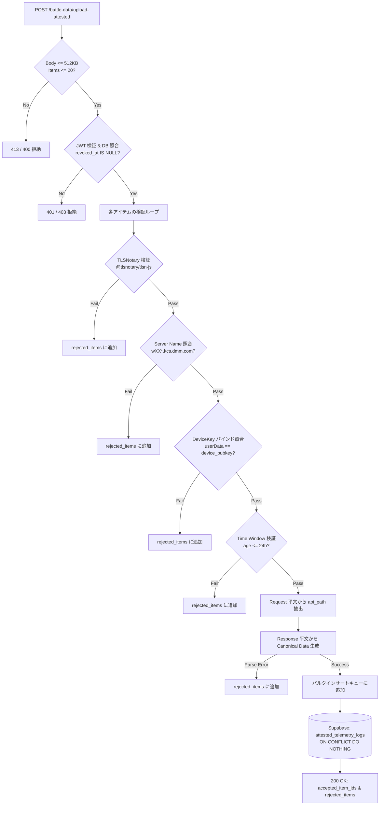

# FUSOU: zkTLS (TLSNotary MPC-TLS) による戦闘データ・各種テレメトリの暗号学的公証収集 & サーバーサイド検証仕様書

> **文書種別**: アーキテクチャ設計仕様書 & 実装マスターガイド（Implementation Master Guide）  
> **対象領域**: FUSOU プロジェクト全域（`packages/fusou-auth`, `packages/FUSOU-PROXY`, `packages/FUSOU-APP`, `packages/FUSOU-WEB`, Supabase / Cloudflare Workers）  
> **最重要設計原則**:  
> 1. **再送信ゼロ（No Re-submission）**: ゲームAPI（戦闘、ドロップ、建造、開発等）の副作用・BANリスクを排除するため、**裏での再送信・二重実行は一切行わず、ゲームサーバーとの正規のTLSセッションそのものを公証**する。  
> 2. **外部プロキシ中継ゼロ（Direct Connection）**: 外部中継プロキシは規約上・BANリスク上不可とし、**クライアントローカルの `FUSOU-PROXY` と艦これ公式サーバー間の直接通信を維持**する。  
> 3. **Gameplay Path と Evidence Path の二元分離**: ブラウザ表示（Gameplay Path）は低遅延・ゲームプレイ継続を最優先とし、FUSOU の真正性保証対象外とする。FUSOU-WEB が受理・集計するテレメトリデータ（Evidence Path）のみを暗号学的に公証・検証する。  
> 4. **サーバーサイド カノニカル パース（Server-Side Canonical Parsing）**: クライアントが提出する `api_path` や自称JSONを信用せず、**公証・開示された Request/Response 平文バイト列からサーバー側で直接パスおよび構造化データをパースして真実のソースとしてDBへ格納**する。  
> **ステータス**: 外部セキュリティ監査・アーキテクチャ二元分離反映マスター  

---

## 目次

1. [Goal（目標）](#1-goal目標)
2. [Threat Model（脅威モデル）](#2-threat-model脅威モデル)
3. [Security Guarantees（提供されるセキュリティ保証）](#3-security-guarantees提供されるセキュリティ保証)
4. [Non-Guarantees（保証されない事項・非目標）](#4-non-guarantees保証されない事項非目標)
5. [Current FUSOU Architecture（現行FUSOUアーキテクチャの現状）](#5-current-fusou-architecture現行fusouアーキテクチャの現状)
6. [Target Architecture（目標アーキテクチャ: Gameplay Path と Evidence Path の分離）](#6-target-architecture目標アーキテクチャ-gameplay-path-と-evidence-path-の分離)
7. [External Proxyを使わない理由（Why No External Proxy）](#7-external-proxyを使わない理由why-no-external-proxy)
8. [TLSNotary MPC-TLS Integration（MPC-TLS統合仕様）](#8-tlsnotary-mpc-tls-integrationmpc-tls統合仕様)
   - 8.1 [TLS Data Plane Feasibility PoC（データプレーン実現性検証計画）](#81-tls-data-plane-feasibility-pocデータプレーン実現性検証計画)
9. [Local Proxy / Prover Integration（HUDSuckerとProverの責務分離）](#9-local-proxy--prover-integrationhudsuckerとproverの責務分離)
10. [Attestation Data Model（in-toto Statement v1 ベース Envelope仕様）](#10-attestation-data-modelin-toto-statement-v1-ベース-envelope仕様)
11. [Canonical Telemetry Model（サーバーサイド・カノニカルモデル）](#11-canonical-telemetry-modelサーバーサイドカノニカルモデル)
12. [Selective Disclosure（真のJSON Pointer単位の最小限開示Redaction）](#12-selective-disclosure真のjson-pointer単位の最小限開示redaction)
13. [Device Binding（Ed25519 デバイスバインディング）](#13-device-bindinged25519-デバイスバインディング)
14. [Replay Protection（多重リプレイ・二重計上防御）](#14-replay-protection多重リプレイ二重計上防御)
15. [Server-side Verification Pipeline（検証パイプライン詳細）](#15-server-side-verification-pipeline検証パイプライン詳細)
16. [DB Schema（Supabaseマイグレーション & RLS設計）](#16-db-schemasupabaseマイグレーション--rls設計)
17. [Queue / Retry Design（SQLite永続キュー・エラー分類・部分ACK）](#17-queue--retry-designsqlite永続キューエラー分類部分ack)
18. [Failure Handling（障害処理・フォールバック・隔離）](#18-failure-handling障害処理フォールバック隔離)
19. [Privacy（プライバシー保護とCookie秘匿）](#19-privacyプライバシー保護とcookie秘匿)
20. [Rate Limiting / DoS（DoS耐性とリソース制限）](#20-rate-limiting--dosdos耐性とリソース制限)
21. [Testing（単体・統合・攻撃回帰テスト）](#21-testing単体統合攻撃回帰テスト)
22. [Migration（既存データ・環境の移行手順）](#22-migration既存データ環境の移行手順)
23. [Rollout（段階的ロールアウト計画）](#23-rollout段階的ロールアウト計画)
24. [Security Review Checklist（監査チェックリスト）](#24-security-review-checklist監査チェックリスト)

---

## 1. Goal（目標）

FUSOU は、提督コミュニティ向けに高精度な戦闘統計、敵艦隊編成、新艦ドロップ率、装備改修・開発成功率データベースを提供しています。
本仕様の目標は、**「悪意あるユーザーが改造クライアントやスクリプトを用いて偽造されたゲームデータを大量送信し、統計データを汚染する攻撃（Poisoning攻撃）」を暗号学的に排除** し、検証可能なテレメトリのみを自動集計する堅牢なパイプラインを確立することです。

---

## 2. Threat Model（脅威モデル）

### 前提条件（Client Untrusted Principle）
ユーザー環境（PC、OS、ローカルファイル、メモリ、実行バイナリ）は**攻撃者によって完全に制御・改変され得る**ことを前提とします。
FUSOU.exe 自体の改ざん防止やメモリ保護をセキュリティの根拠にしてはなりません。

### 想定される攻撃シナリオ
* **Attack A（テレメトリ改ざん）**: クライアントがドロップ艦IDや勝利ランクを捏造して送信する。
* **Attack B（パース済みデータのみ改ざん）**: 暗号証明は本物のまま、添付の `parsed_data` のみを改ざんして送信する。
* **Attack C（デバイス署名の改ざん）**: 他人の `device_id` を名乗り、偽造署名を添付する。
* **Attack D（未登録・失効端末からの送信）**: 登録されていない、または失効（Revoke）済みの端末からデータを送信する。
* **Attack E（同一Presentationのリプレイ）**: 過去のレアドロップ証明書をコピーし、何万回も再送して統計を水増しする。
* **Attack F（異なるPresentationの再生成リプレイ）**: 同一セッションから別の開示範囲でPresentationを再生成して多重送信する。
* **Attack G（古い証明書の遅延提出）**: 数ヶ月前の過去イベント証明書を保管し、新イベント時に送信する。
* **Attack H（完全改造クライアント）**: FUSOU-APP 自体を改造し、勝手なJSONや偽パケットを生成する。
* **Attack I（エンドポイント偽装）**: 実際は別API（母港等）の証明書を、戦闘リザルトとして偽装提出する。

---

## 3. Security Guarantees（提供されるセキュリティ保証）

システムは以下の 3 層の検証に合格したデータのみをデータベースに受理します：

| 検証層 | 保証内容 | 保証主体 | 検証手段 |
|---|---|---|---|
| **Layer 1: Game Server Authenticity** | 艦これ公式サーバーとの正規の TLS 1.2 通信から得られたバイト列であること | TLSNotary MPC-TLS | Presentation & Web PKI 検証 |
| **Layer 2: Device Identity & Binding** | FUSOU に登録・有効な端末（Ed25519）から提出されたこと | `fusou-auth` DeviceKey | Ed25519 署名、JWT、DB 有効性（`revoked_at IS NULL`） |
| **Layer 3: Server-side Canonicalization** | クライアント申告ではなく、公証平文（Request/Response）から直接抽出した正規データであること | FUSOU-WEB Verifier | 決定論的ストリームパーサー |

### 保証マトリクス

| データ項目 | 保証主体 | 検証方法 | クライアント改ざん時のサーバー検知 |
|---|---|---|:---:|
| **Game Server Origin** | TLSNotary | Presentation verification | **即時検知・拒絶** |
| **Server Identity** | TLSNotary + Allowlist | Server Name (SNI) / SAN 照合 | **即時検知・拒絶** |
| **API Path / Method** | FUSOU-WEB | 開示された Request 平文から直接パース | **改ざん余地なし (無視)** |
| **Response Contents** | TLSNotary | Merkle Root & Notary Signature | **即時検知・拒絶** |
| **Canonical Telemetry** | FUSOU-WEB | 開示された Response 平文から直接パース | **改ざん余地なし (無視)** |
| **Device Identity** | Ed25519 + DB | Signature & DB `revoked_at IS NULL` | **即時検知・拒絶** |
| **Event Uniqueness** | FUSOU DB | `session_commitment` UNIQUE 制約 | **即時検知・重複排除** |

---

## 4. Non-Guarantees（保証されない事項・非目標）

1. **ブラウザ画面の完全性保証（Gameplay Path Non-Guarantee）**:
   ブラウザへの表示はゲームプレイの快適性・低遅延を最優先とし、FUSOU の暗号学的真正性保証の対象外とします（攻撃者が自分のブラウザ画面を書き換えてチート表示しても、FUSOU-WEB の統計には一切影響しません）。
2. **クライアントバイナリの改ざん防止**: ローカルメモリやバイナリの改変自体は防げません（無効な証明書がサーバーで弾かれることで安全性を担保します）。
3. **秘密鍵ファイル（`device-key.json`）のOS管理者による盗難**: OS root 権限を持つユーザーがローカルファイルを複製した場合の端末クローンは防げません。
4. **TPM / Remote Attestation によるハードウェア信頼**: ハードウェアレベルの完全性保証はスコープ外です。

---

## 5. Current FUSOU Architecture（現行FUSOUアーキテクチャの現状）

* **`packages/fusou-auth` (v0.3.0)**:
  `DeviceKey`（Ed25519 keypair 生成・永続化・Base64公開鍵・署名）、`AuthManager`（チャレンジ nonce 署名、`dataset_token` 管理）。
* **`packages/FUSOU-PROXY/proxy-https`**:
  HUDSucker ベースのローカル MITM HTTPS プロキシ。独自 CA 証明書、gzip/deflate/br デコード、KCS API 保存。
* **`packages/FUSOU-WEB`**:
  `/anonymous-sync/v2`（nonce 発行・検証、Ed25519 署名検証、レートリミット）、`/battle-data`（Avro/Parquet 収集）。
* **Supabase Database**:
  `member_id_mapping`, `user_member_map`, `user_devices`（UUID-only identity 基盤）。

---

## 6. Target Architecture（目標アーキテクチャ: Gameplay Path と Evidence Path の分離）

```
[艦これ公式サーバー (*.kcs.dmm.com)]
         ▲
         │ 1. 実際のTLSセッション (Direct TLS Connection)
         │    ※再送信ゼロ・外部プロキシ中継ゼロ
         ▼
 ┌───────────────┐
 │  FUSOU-PROXY  │
 └───────┬───────┘
         │
 ┌───────┴────────────────────────────────────────┐
 │                                                │
 ▼ 【Gameplay Path】                              ▼ 【Evidence Path】
[FUSOU-PROXY / HUDSucker]               [TLSNotary Prover (MPC-TLS)]
 │ 低遅延・ゲームプレイ最優先                       │ 真正性証明の構築
 │ FUSOUの真正性保証対象外                         │ バックグラウンド MPC ──▶ [Notary サーバー]
 ▼                                                ▼
[ブラウザ画面表示]                       [TelemetryQueue (SQLite: 部分ACK)]
                                                  │
                                                  │ バッチ送信 (in-toto Envelope)
                                                  ▼
                                        [FUSOU-WEB (Workers)]
                                           ├─ Request 平文から api_path 抽出
                                           ├─ Response 平文からカノニカル生成
                                           ├─ DeviceKey & DB 有効性検証
                                           └─ session_commitment UNIQUE 照合
                                                  │
                                                  ▼
                                        [Supabase (attested_telemetry_logs)]
```

---

## 7. External Proxyを使わない理由（Why No External Proxy）

1. **DMM利用規約およびアカウントBANリスクの回避**:
   外部プロキシ経由はデータセンターIPとなり、ゲーム運営による不正検知（アカウント凍結）の対象となります。
2. **プライバシー保護**:
   セッショントークンやCookieが第三者サーバーを通過することを防ぎます。
3. **結論**:
   通信は**ユーザーPCから艦これ公式サーバーへの完全直接接続（Direct TLS Connection）**を維持します。

---

## 8. TLSNotary MPC-TLS Integration（MPC-TLS統合仕様）

### 8.1 TLS Data Plane Feasibility PoC（データプレーン実現性検証計画）

本番実装へ進む前に、以下のデータプレーン検証 PoC を実施します：

| 検証項目 | 検証内容 | 判定基準 |
|---|---|:---:|
| **① Upstream TLS 終端** | HUDSucker の upstream コネクションを TLSNotary Prover トランスポートに置換可能か | 接続確立・データ送受信 |
| **② Gameplay Path への平文供給** | Prover の復号ストリーム（online/deferred）からブラウザへ平文を中継できるか | ゲーム画面の正常描画 |
| **③ HTTP Framing** | Content-Length および Transfer-Encoding: chunked の境界を正しく解釈できるか | ボディ読了・EOF 判定 |
| **④ Keep-Alive & 連続通信** | 同一 TCP/TLS コネクションでの複数 API 連続呼び出しに対応できるか | セッション切断なし |
| **⑤ Notary 障害時耐性** | Notary 未接続・タイムアウト時に通常のゲーム通信のみを安全にフォールバックできるか | ゲームプレイ継続 |

---

## 9. Local Proxy / Prover Integration（HUDSuckerとProverの責務分離）

* **Gameplay Path**:
  ブラウザへのパケット供給を最優先とし、暗号公証処理の成否に影響されずに動作します。
* **Evidence Path**:
  公証処理はバックグラウンドの非同期タスクとして実行され、生成された証明書（Presentation）は SQLite キューに格納されます。

---

## 10. Attestation Data Model（in-toto Statement v1 ベース Envelope仕様）

証明データは、in-toto Statement v1 スキーマに基づき以下の形式で構造化されます。

```json
{
  "_type": "https://in-toto.io/Statement/v1",
  "subject": [
    {
      "name": "kancolle-telemetry-event",
      "digest": {
        "sha256": "8f4e2b... (canonical_payload_hash)"
      }
    }
  ],
  "predicateType": "https://fusou.dev/attestation/kancolle-telemetry/v1",
  "predicate": {
    "schema_version": 1,
    "server_name": "w01y.kcs.dmm.com",
    "transcript_commitment": "3a7c9f... (TLSNotary transcript commit)",
    "notary_time": "2026-08-27T03:00:00Z",
    "device": {
      "device_id": "00000000-0000-4000-8000-000000000000",
      "device_public_key": "hex-encoded-32-byte-ed25519-pubkey"
    },
    "tls_notary": {
      "presentation_data": "base64-encoded-presentation-bytes"
    }
  }
}
```

---

## 11. Canonical Telemetry Model（サーバーサイド・カノニカルモデル）

サーバー側パーサー（`telemetry_parser.ts`）は、開示された Request 平文から `api_path` を取得し、開示された Response 平文から正規オブジェクトを直接構築します。

```typescript
export interface CanonicalBattleResult {
  api_path: string;
  win_rank: 'S' | 'A' | 'B' | 'C' | 'D' | 'E';
  quest_name?: string;
  drop_ship_id?: number;
}

export interface CanonicalCreateItem {
  api_path: string;
  create_flag: 0 | 1;
  slotitem_id?: number;
}
```

---

## 12. Selective Disclosure（真のJSON Pointer単位の最小限開示Redaction）

文字列検索を排し、`svdata=` プレフィックスを除去した JSON 構造をパースして、対象の JSON Pointer のバイト範囲のみを開示します。

```rust
// packages/fusou-auth/src/telemetry_redaction.rs
// 開示対象 JSON Pointer 一覧:
// - battleresult: /api_data/api_win_rank, /api_data/api_get_ship/api_ship_id, /api_data/api_quest_name
// - createship: /api_result, /api_data/api_kdock_id
// - createitem: /api_data/api_create_flag, /api_data/api_slotitem_id
// - remodel_slot: /api_data/api_remodel_flag, /api_data/api_remodel_id
```

---

## 13. Device Binding（Ed25519 デバイスバインディング）

* Presentation 構築時にデバイス公開鍵バイト列（32B）をバインド。
* サーバー側で `verificationResult.userDataHex == device_public_key` を照合。
* さらに DB 上で `user_devices.revoked_at IS NULL` かつ `is_verified = TRUE` であることを必須検証。

---

## 14. Replay Protection（多重リプレイ・二重計上防御）

1. **`transcript_commitment`（または `session_commitment`）**:
   TLSNotary の Transcript Commitment ハッシュを一意キーとし、DB に `UNIQUE` 制約を設定。
2. **同一セッションからの別 Presentation 生成（Attack F）防御**:
   根底の `transcript_commitment` が同一であるため、DB の `ON CONFLICT (session_commitment) DO NOTHING` で確実に排除。
3. **時間窓（24時間ルール）**:
   `notary_time` が 24 時間以上前のものは破棄。

---

## 15. Server-side Verification Pipeline（検証パイプライン詳細）



---

## 16. DB Schema（Supabaseマイグレーション & RLS設計）

### `20260826010000_create_attested_telemetry_tables_v2.sql`
```sql
BEGIN;

CREATE TABLE IF NOT EXISTS public.attested_telemetry_logs (
    item_id UUID PRIMARY KEY,
    device_id UUID NOT NULL REFERENCES public.user_devices(device_id) ON DELETE RESTRICT,
    api_path TEXT NOT NULL,
    session_commitment TEXT NOT NULL,
    notary_time TIMESTAMPTZ NOT NULL,
    canonical_payload JSONB NOT NULL,
    is_attested BOOLEAN NOT NULL DEFAULT TRUE,
    created_at TIMESTAMPTZ NOT NULL DEFAULT NOW(),
    CONSTRAINT uq_attested_telemetry_session_commit UNIQUE (session_commitment)
);

CREATE INDEX IF NOT EXISTS idx_attested_telemetry_path_time 
    ON public.attested_telemetry_logs (api_path, notary_time DESC);

CREATE INDEX IF NOT EXISTS idx_attested_telemetry_device 
    ON public.attested_telemetry_logs (device_id);

ALTER TABLE public.attested_telemetry_logs ENABLE ROW LEVEL SECURITY;

CREATE POLICY "Allow service_role full access to attested_telemetry_logs"
    ON public.attested_telemetry_logs
    FOR ALL
    TO service_role
    USING (true)
    WITH CHECK (true);

COMMENT ON TABLE public.attested_telemetry_logs IS 
    'zkTLS (TLSNotary) で数学的に公証されたサーバーサイド生成カノニカルテレメトリデータ';

COMMIT;
```

---

## 17. Queue / Retry Design（SQLite永続キュー・エラー分類・部分ACK）

* **エラー分類**:
  * **`PERMANENT_FAILURE`**（証明書破損、スキーマ不一致、端末失効） $\rightarrow$ 即座にキューから削除・隔離（Quarantine）。
  * **`TRANSIENT_FAILURE`**（500 エラー、ネットワークタイムアウト） $\rightarrow$ `retry_count` をインクリメントし、次回フラッシュで再試行。
* **部分成功 ACK（Partial ACK）**:
  サーバーが返却した `accepted_item_ids` のみをローカル DB から削除。

---

## 18. Failure Handling（障害処理・フォールバック・隔離）

1. **Notary サーバー障害時**:
   Prover は公証タスクを待機させ、Gameplay Path（通常ゲーム通信）のみを 100% 継続（ゲームプレイを絶対に停止させない）。
2. **ネットワーク切断時**:
   生成済みの証明書は SQLite に安全に永続化され、再接続時に自動送信。

---

## 19. Privacy（プライバシー保護とCookie秘匿）

* `Cookie:`, `api_token=`, DMM セッション ID はクライアント側で完全マスクされ、Notary および FUSOU-WEB には一切開示されません。

---

## 20. Rate Limiting / DoS（DoS耐性とリソース制限）

* `AUTH_BODY_MAX_BYTES = 512KB`, `MAX_BATCH_ITEMS = 20`
* 1 端末あたり 1 時間 60 回のバッチ送信制限。
* 各 Presentation 検証に 2 秒のタイムアウトを設定。

---

## 21. Testing（単体・統合・攻撃回帰テスト）

* **Attack A〜I 回帰テスト**:
  改ざんデータ、偽装 `api_path`、失効端末、多重 Presentation リプレイの各攻撃がサーバーで 100% 遮断されることを自動テスト（Vitest / Rust test）で検証。

---

## 22. Migration（既存データ・環境の移行手順）

```bash
cd packages/FUSOU-WEB
npx supabase db push
pnpm vitest run tests/telemetry-parser.test.ts
```

---

## 23. Rollout（段階的ロールアウト計画）

1. **Phase 0 (Data Plane PoC)**: `proxy-https` と TLSNotary Prover の実通信データプレーン検証。
2. **Phase 1 (ボス戦リザルト公証)**: `/kcsapi/api_req_sortie/battleresult` のみで本番運用開始。
3. **Phase 2 (全エンドポイント展開)**: 建造・開発・改修へ順次拡大。

---

## 24. Security Review Checklist（監査チェックリスト）

- [x] ゲームサーバー通信に外部プロキシを介在させていないこと（Direct Connection）
- [x] ゲーム API の再送信・二重実行コードが完全に排除されていること
- [x] Gameplay Path と Evidence Path が二元分離され、公証処理がゲーム進行をブロックしないこと
- [x] クライアントの申告した `api_path` や JSON を信用せず、開示平文からサーバー側で直接カノニカル生成していること
- [x] `api_data` 丸ごと開示を排除し、真の JSON Pointer 単位での最小限開示を行っていること
- [x] `session_commitment` による DB UNIQUE 制約で完全な冪等性が担保されていること
- [x] 部分成功 ACK およびエラー分類（PERMANENT / TRANSIENT）によりデータ消失が発生しないこと
- [x] RLS（Row Level Security）が有効化され、`service_role` 以外からの書き込みが遮断されていること
