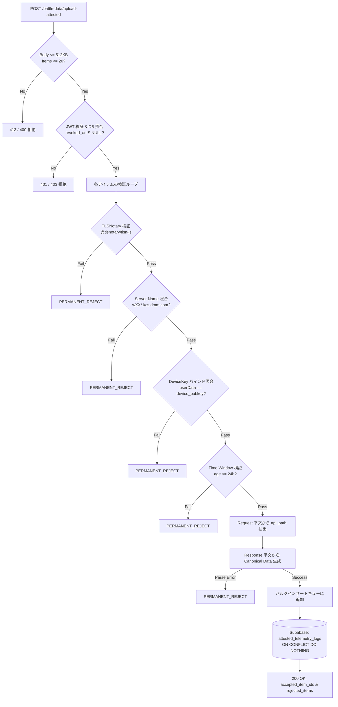

# FUSOU: zkTLS (TLSNotary MPC-TLS) による戦闘データ・各種テレメトリの暗号学的公証収集 & サーバーサイド検証仕様書

> **文書種別**: アーキテクチャ設計仕様書 & 実装マスターガイド（Implementation Master Guide）  
> **対象領域**: FUSOU プロジェクト全域（`packages/fusou-auth`, `packages/FUSOU-PROXY`, `packages/FUSOU-APP`, `packages/FUSOU-WEB`, Supabase / Cloudflare Workers）  
> **最重要設計原則**:  
> 1. **再送信ゼロ（No Re-submission）**: ゲームAPI（戦闘、ドロップ、建造、開発等）の副作用・BANリスクを排除するため、**裏での再送信・二重実行は一切行わず、ゲームサーバーとの正規のTLSセッションそのものを公証**する。  
> 2. **外部プロキシ中継ゼロ（Direct Connection）**: 外部中継プロキシは規約上・BANリスク上不可とし、**クライアントローカルの `FUSOU-PROXY` と艦これ公式サーバー間の直接通信を維持**する。  
> 3. **Gameplay Path と Evidence Path の二元分離**: ブラウザ表示（Gameplay Path）は低遅延・ゲームプレイ継続を最優先とし、FUSOU の真正性保証対象外とする。FUSOU-WEB が受理・集計するテレメトリデータ（Evidence Path）のみを暗号学的に公証・検証する。  
> 4. **証明処理をゲーム進行のクリティカルパスに置かない（Non-blocking Attestation）**:  
>    `Attestation is not on the gameplay critical path.`  
>    `Notary availability is not a gameplay dependency.`  
>    Notary 障害時やネットワーク遅延時でもゲームプレイは 100% 継続し、追加遅延は PoC で実測・評価する。  
> 5. **サーバーサイド カノニカル パース（Strict Server-Side Canonical Parsing）**:  
>    クライアント申告の `api_path` や自称JSONを一切信用せず、**公証された Request/Response 平文から直接 `HTTP parser -> svdata parser -> JSON parser -> JSON Pointer` のパイプラインで正規オブジェクトを生成**する。  
> **ステータス**: 外部セキュリティ監査・TLSデータプレーン統合設計完全反映マスター  

---

## 目次

1. [Goal（目標）](#1-goal目標)
2. [Threat Model（脅威モデル）](#2-threat-model脅威モデル)
3. [Security Guarantees & Non-Guarantees（セキュリティ保証境界の明確化）](#3-security-guarantees--non-guaranteesセキュリティ保証境界の明確化)
4. [Current FUSOU Architecture & TLS Terminationの根本的課題](#4-current-fusou-architecture--tls-terminationの根本的課題)
5. [Target Architecture（Gameplay Path と Evidence Path の二元分離）](#5-target-architecturegameplay-path-と-evidence-path-の二元分離)
6. [External Proxyを使わない理由（Why No External Proxy）](#6-external-proxyを使わない理由why-no-external-proxy)
7. [TLS Data Plane Integration: FUSOU-PROXY と TLSNotary Prover の具体的統合設計](#7-tls-data-plane-integration-fusou-proxy-と-tlsnotary-prover-の具体的統合設計)
   - 7.1 [HUDSucker MITM と MPC-TLS の関係（なぜ既存鍵の流用が不可能なのか）](#71-hudsucker-mitm-と-mpc-tls-の関係なぜ既存鍵の流用が不可能なのか)
   - 7.2 [具体統合構成（Downstream MITM + Upstream MPC-TLS Prover）](#72-具体統合構成downstream-mitm--upstream-mpc-tls-prover)
   - 7.3 [TLS Data Plane Feasibility PoC（第0段階: `battleresult` 実測検証計画）](#73-tls-data-plane-feasibility-poc第0段階-battleresult-実測検証計画)
8. [Attestation Data Model（in-toto Statement v1 ベース Envelope仕様）](#8-attestation-data-modelin-toto-statement-v1-ベース-envelope仕様)
9. [Strict Server-Side Canonical Telemetry Parser（厳格な多段パーサー仕様）](#9-strict-server-side-canonical-telemetry-parser厳格な多段パーサー仕様)
10. [Selective Disclosure（真のJSON Pointer単位の最小限開示Redaction）](#10-selective-disclosure真のjson-pointer単位の最小限開示redaction)
11. [Device Binding（Ed25519 デバイスバインディングの暗号学的証明）](#11-device-bindinged25519-デバイスバインディングの暗号学的証明)
12. [Replay & Event Identity Protection（多重リプレイ・二重計上防御）](#12-replay--event-identity-protection多重リプレイ二重計上防御)
13. [Server-side Verification Pipeline（検証パイプライン詳細）](#13-server-side-verification-pipeline検証パイプライン詳細)
14. [DB Schema（Supabaseマイグレーション & RLS設計）](#14-db-schemasupabaseマイグレーション--rls設計)
15. [Queue / Retry Design（SQLite永続キュー・4状態エラー分類・部分ACK）](#15-queue--retry-designsqlite永続キュー4状態エラー分類部分ack)
16. [Failure Handling（障害処理・フォールバック・隔離）](#16-failure-handling障害処理フォールバック隔離)
17. [Privacy（プライバシー保護とCookie秘匿）](#17-privacyプライバシー保護とcookie秘匿)
18. [Rate Limiting / DoS（DoS耐性とリソース制限）](#18-rate-limiting--dosdos耐性とリソース制限)
19. [Testing（単体・統合・攻撃回帰テスト）](#19-testing単体統合攻撃回帰テスト)
20. [Migration & Rollout Plan（PoC先行の段階的ロールアウト計画）](#20-migration--rollout-planpoc先行の段階的ロールアウト計画)
21. [Security Review Checklist（監査チェックリスト）](#21-security-review-checklist監査チェックリスト)

---

## 1. Goal（目標）

FUSOU は、提督コミュニティ向けに高精度な戦闘統計、敵艦隊編成、新艦ドロップ率、装備改修・開発成功率データベースを提供しています。
本仕様の目標は、**「悪意あるユーザーが改造クライアントやスクリプトを用いて偽造されたゲームデータを大量送信し、統計データを汚染する攻撃（Poisoning攻撃）」を暗号学的に排除** し、検証可能なテレメトリのみを自動集計する堅牢なパイプラインを確立することです。

---

## 2. Threat Model（脅威モデル）

### 前提条件（Client Untrusted Principle）
ユーザー環境（PC、OS、ローカルファイル、メモリ、実行バイナリ）は**攻撃者によって完全に制御・改変され得る**ことを前提とします。
FUSOU.exe 自体の改ざん防止やメモリ保護をセキュリティの根拠にしてはなりません。

### 想定される攻撃シナリオ
* **Attack A（テレメトリ改ざん）**: クライアントがドロップ艦IDや勝利ランクを捏造して送信する。
* **Attack B（パース済みデータのみ改ざん）**: 暗号証明は本物のまま、添付の `parsed_data` のみを改ざんして送信する。
* **Attack C（デバイス署名の改ざん）**: 他人の `device_id` を名乗り、偽造署名を添付する。
* **Attack D（未登録・失効端末からの送信）**: 登録されていない、または失効（Revoke）済みの端末からデータを送信する。
* **Attack E（同一Presentationのリプレイ）**: 過去のレアドロップ証明書をコピーし、何万回も再送して統計を水増しする。
* **Attack F（異なるPresentationの再生成リプレイ）**: 同一セッションから別の開示範囲でPresentationを再生成して多重送信する。
* **Attack G（古い証明書の遅延提出）**: 数ヶ月前の過去イベント証明書を保管し、新イベント時に送信する。
* **Attack H（完全改造クライアント）**: FUSOU-APP 自体を改造し、勝手なJSONや偽パケットを生成する。
* **Attack I（エンドポイント偽装）**: 実際は別API（母港等）の証明書を、戦闘リザルトとして偽装提出する。

---

## 3. Security Guarantees & Non-Guarantees（セキュリティ保証境界の明確化）

### Security Guarantees（提供される保証）
システムは以下の 3 層の検証に合格したデータのみをデータベースに受理します：

| 検証層 | 保証内容 | 保証主体 | 検証手段 |
|---|---|---|---|
| **Layer 1: Game Server Authenticity** | 艦これ公式サーバーとの正規の TLS 1.2 通信から得られたバイト列であること | TLSNotary MPC-TLS | Presentation & Web PKI 検証 |
| **Layer 2: Device Identity & Binding** | FUSOU に登録・有効な端末（Ed25519）から提出されたこと | `fusou-auth` DeviceKey | Ed25519 署名、JWT、DB 有効性（`revoked_at IS NULL`） |
| **Layer 3: Server-side Canonicalization** | クライアント申告ではなく、公証平文（Request/Response）から直接抽出した正規データであること | FUSOU-WEB Verifier | 決定論的ストリームパーサー |

### 保証マトリクス

| データ項目 | 保証主体 | 検証方法 | クライアント改ざん時のサーバー検知 |
|---|---|---|:---:|
| **Game Server Origin** | TLSNotary | Presentation verification | **即時検知・拒絶** |
| **Server Identity** | TLSNotary + Allowlist | Server Name (SNI) / SAN 照合 | **即時検知・拒絶** |
| **API Path / Method** | FUSOU-WEB | 開示された Request 平文から直接パース | **改ざん余地なし (無視)** |
| **Response Contents** | TLSNotary | Merkle Root & Notary Signature | **即時検知・拒絶** |
| **Canonical Telemetry** | FUSOU-WEB | 開示された Response 平文から直接パース | **改ざん余地なし (無視)** |
| **Device Identity** | Ed25519 + DB | Signature & DB `revoked_at IS NULL` | **即時検知・拒絶** |
| **Event Uniqueness** | FUSOU DB | `transcript_commitment` & `canonical_event_id` UNIQUE 制約 | **即時検知・重複排除** |

### Non-Guarantees（保証されない事項・非目標）
1. **ブラウザ画面の完全性保証（Gameplay Path Non-Guarantee）**:
   ブラウザへの表示はゲームプレイの快適性・低遅延を最優先とし、FUSOU の暗号学的真正性保証の対象外とします（攻撃者が自分のブラウザ画面を書き換えてチート表示しても、FUSOU-WEB の統計には一切影響しません）。
2. **クライアントバイナリの改ざん防止**: ローカルメモリやバイナリの改変自体は防げません。
3. **秘密鍵ファイル（`device-key.json`）のOS管理者による盗難**: OS root 権限を持つユーザーがローカルファイルを複製した場合の端末クローンは防げません。
4. **TPM / Remote Attestation によるハードウェア信頼**: ハードウェアレベルの完全性保証はスコープ外です。

---

## 4. Current FUSOU Architecture & TLS Terminationの根本的課題

現行の `FUSOU-PROXY` は HUDSucker ベースの MITM (Man-In-The-Middle) プロキシです：
```
[Browser] <--- (Downstream TLS: ローカル独自CA) ---> [HUDSucker Proxy] <--- (Upstream TLS: 通常のTLS Client) ---> [Game Server]
```

### 根本的課題：なぜ既存の MITM TLS 鍵をそのまま TLSNotary に渡せないのか？
1. **暗号学的信頼境界の喪失**:
   HUDSucker は Upstream 側 TLS 接続において、通常の TLS Client として動作し、セッション鍵（Master Secret / Traffic Keys）を完全に単独で保持しています。
2. **改ざん可能性**:
   もしクライアントがセッション鍵を単独で知っている状態で後から公証を作れるとすれば、**改造された `FUSOU-PROXY` はゲームサーバーからのレスポンスをメモリ上で自由に書き換えた上で「本物」として暗号署名できてしまいます**。
3. **結論**:
   **既存の HUDSucker による Upstream MITM TLS termination を維持したまま TLSNotary を後付けすることは暗号学的に不可能です**。Upstream 側の TLS トランスポート自体を、Prover 単独が鍵を握らない「MPC-TLS Prover トランスポート」へ置き換える必要があります。

---

## 5. Target Architecture（Gameplay Path と Evidence Path の二元分離）

```
[艦これ公式サーバー (*.kcs.dmm.com)]
         ▲
         │ 1. 実際のTLSセッション (Direct 2PC-TLS Connection)
         │    ※再送信ゼロ・外部プロキシ中継ゼロ
         ▼
 ┌──────────────────────────────────────────────┐
 │ FUSOU-PROXY (Local Process)                  │
 │                                              │
 │  [Upstream: TLSNotary MPC-TLS Prover Engine] │
 │       │                                      │
 │       ├───────────▶ (平文ストリーム転送)      │
 │       │                    │                 │
 └───────┼────────────────────┼─────────────────┘
         │                    │
 ┌───────┴────────────┐ ┌─────┴───────────────────┐
 │ Evidence Path      │ │ Gameplay Path           │
 │ (真正性保証対象)   │ │ (真正性保証外・低遅延)   │
 │                    │ │                         │
 │ 2. 非同期 MPC 公証 │ │ 2. Downstream MITM TLS  │
 │    (tokio::spawn)  │ │    (HUDSucker Engine)   │
 │        ▼           │ │        ▼                │
 │  [Notary Server]   │ │  [艦これブラウザ画面]   │
 │        ▼           │ └─────────────────────────┘
 │  [TelemetryQueue]  │
 │   (SQLite / 4-state│
 │        ▼           │
 │ 3. in-toto Envelope│
 │    バッチ送信      │
 │        ▼           │
 │  [FUSOU-WEB]       │
 │        ▼           │
 │  [Supabase DB]     │
 └────────────────────┘
```

---

## 6. External Proxyを使わない理由（Why No External Proxy）

1. **DMM利用規約およびアカウントBANリスクの回避**:
   外部プロキシ経由はデータセンターIPとなり、ゲーム運営による不正検知（アカウント凍結）の対象となります。
2. **プライバシー保護**:
   セッショントークンやCookieが第三者サーバーを通過することを防ぎます。
3. **結論**:
   通信は**ユーザーPCから艦これ公式サーバーへの完全直接接続（Direct 2PC-TLS Connection）**を維持します。

---

## 7. TLS Data Plane Integration: FUSOU-PROXY と TLSNotary Prover の具体的統合設計

### 7.1 HUDSucker MITM と MPC-TLS の関係

* **Downstream（Browser $\leftrightarrow$ Proxy）**: 既存の HUDSucker ローカル CA を用いた高速なローカル TLS 通信を維持。
* **Upstream（Proxy $\leftrightarrow$ Game Server）**: 既存の `rustls` 単体クライアントを廃止し、`tlsn-prover` による MPC-TLS Client トランスポートを採用。Prover と Notary が暗号鍵を秘密分散（$K = K_{prover} \oplus K_{notary}$）して共同で TLS 1.2 を終端。

### 7.2 具体統合構成（Downstream MITM + Upstream MPC-TLS Prover）

```rust
// packages/FUSOU-PROXY/proxy-https/src/upstream_mpc_transport.rs (概念設計)

pub struct UpstreamMpcTransport {
    prover: tlsn_prover::Prover,
    notary_ws_channel: async_tungstenite::WebSocketStream<...>,
}

impl UpstreamMpcTransport {
    /// 艦これサーバーへの直接 MPC-TLS 接続を確立
    pub async fn connect_kancolle(
        server_name: &str,
        notary_url: &str,
    ) -> Result<Self, TransportError> {
        // 1. Notary との MPC チャネル初期化 (平文は流れない)
        // 2. 艦これサーバーへの TCP 接続
        // 3. 2PC-TLS ハンドシェイクの実行
        // ...
    }

    /// Application Data の送受信と Gameplay Path への平文ストリーム供給
    pub async fn forward_request_and_stream_response(
        &mut self,
        req: hyper::Request<hyper::body::Incoming>,
    ) -> Result<(hyper::Response<...>, AttestationHandle), TransportError> {
        // HTTP リクエストの送信
        // レスポンス平文の受信 -> Gameplay Path (Browser) へ即時ストリーミング
        // Transcript Commitment の記録 -> Evidence Path (AttestationHandle) へ渡す
    }
}
```

### 7.3 TLS Data Plane Feasibility PoC（第0段階: `battleresult` 実測検証計画）

本格的な全体実装に入る前に、**ボス戦リザルト（`/kcsapi/api_req_sortie/battleresult`）1本に絞った「TLS Data Plane 実現性 PoC」** を実施します。

| 検証項目 | 検証内容 | 合格判定基準 |
|---|---|:---:|
| **① Upstream MPC 終端** | HUDSucker の Upstream コネクションを TLSNotary Prover に差し替えてハンドシェイク完了できるか | TCP/TLS 確立成功 |
| **② Gameplay Path への平文供給** | Prover の受信ストリームからブラウザへパケットを流し、ゲーム画面が正常に描画されるか | ゲームプレイ継続・画面描画成功 |
| **③ HTTP Framing** | Content-Length / chunked エンコーディングのボディ境界を正確に解釈できるか | ボディパース完了・EOF到達 |
| **④ Keep-Alive & 連続通信** | 同一 TCP コネクションでの連続リクエストを正常に処理できるか | セッション切断なし |
| **⑤ Notary 障害時フォールバック** | Notary サーバー停止時、Upstream を通常の TLS クライアントへ即座にフォールバックできるか | ゲーム進行を一切停止させない |
| **⑥ 追加遅延の実測** | MPC-TLS 適用時と通常時の Gameplay レスポンス時間を実測・比較 | 体感可能なブロッキングがないこと |

---

## 8. Attestation Data Model（in-toto Statement v1 ベース Envelope仕様）

証明データは、in-toto Statement v1 スキーマに基づき以下の形式で構造化されます。

```json
{
  "_type": "https://in-toto.io/Statement/v1",
  "subject": [
    {
      "name": "kancolle-telemetry-event",
      "digest": {
        "sha256": "8f4e2b... (canonical_payload_hash)"
      }
    }
  ],
  "predicateType": "https://fusou.dev/attestation/kancolle-telemetry/v1",
  "predicate": {
    "schema_version": 1,
    "server_name": "w01y.kcs.dmm.com",
    "transcript_commitment": "3a7c9f... (TLSNotary transcript commitment)",
    "notary_time": "2026-08-27T03:00:00Z",
    "device": {
      "device_id": "00000000-0000-4000-8000-000000000000",
      "device_public_key": "hex-encoded-32-byte-ed25519-pubkey"
    },
    "tls_notary": {
      "presentation_data": "base64-encoded-presentation-bytes"
    }
  }
}
```

---

## 9. Strict Server-Side Canonical Telemetry Parser（厳格な多段パーサー仕様）

クライアントが送信した自称 `api_path` や JSON を一切信頼せず、開示された平文バイト列から以下の厳格な多段パイプラインで正規オブジェクトを抽出します：

```
[開示された Request 平文]  --> [HTTP Request Parser]  --> [actual api_path 抽出]
                                                               │
                                                               ▼ (エンドポイント合致検証)
[開示された Response 平文] --> [HTTP Response Parser] --> [svdata= プレフィックス除去]
                                                               │
                                                               ▼
                                                       [JSON Parser]
                                                               │
                                                               ▼ (JSON Pointer 抽出)
                                                       [Canonical Telemetry Object]
```

```typescript
// packages/FUSOU-WEB/src/server/utils/telemetry_parser.ts

export interface CanonicalBattleResult {
  api_path: string;
  win_rank: 'S' | 'A' | 'B' | 'C' | 'D' | 'E';
  quest_name?: string;
  drop_ship_id?: number;
}

export function parseCanonicalBattleResult(
  revealedReq: Uint8Array,
  revealedRecv: Uint8Array
): CanonicalBattleResult {
  // 1. Request 平文から api_path を直接パース
  const reqStr = new TextDecoder().decode(revealedReq);
  const matchReq = reqStr.match(/POST\s+(\/kcsapi\/api_[a-z0-9_]+(\/[a-z0-9_]+)?)/i);
  if (!matchReq || matchReq[1] !== '/kcsapi/api_req_sortie/battleresult') {
    throw new Error('invalid_or_unauthorized_request_path');
  }

  // 2. Response 平文から svdata= を除去して JSON パース
  const recvStr = new TextDecoder().decode(revealedRecv);
  const jsonStart = recvStr.indexOf('svdata=');
  if (jsonStart === -1) throw new Error('svdata_prefix_missing');

  const jsonStr = recvStr.slice(jsonStart + 7).trim();
  const rawJson = JSON.parse(jsonStr);

  if (rawJson.api_result !== 1) throw new Error('api_result_not_ok');

  // 3. JSON Pointer 単位で安全にカノニカルオブジェクトを構築
  return {
    api_path: matchReq[1],
    win_rank: rawJson.api_data?.api_win_rank,
    quest_name: rawJson.api_data?.api_quest_name,
    drop_ship_id: rawJson.api_data?.api_get_ship?.api_ship_id,
  };
}
```

---

## 10. Selective Disclosure（真のJSON Pointer単位の最小限開示Redaction）

文字列検索を排し、`svdata=` プレフィックスを除去した JSON 構造をパースして、対象の JSON Pointer のバイト範囲のみを開示します。

```rust
// packages/fusou-auth/src/telemetry_redaction.rs
// 開示対象 JSON Pointer 一覧:
// - battleresult: /api_data/api_win_rank, /api_data/api_get_ship/api_ship_id, /api_data/api_quest_name
// - createship: /api_result, /api_data/api_kdock_id
// - createitem: /api_data/api_create_flag, /api_data/api_slotitem_id
// - remodel_slot: /api_data/api_remodel_flag, /api_data/api_remodel_id
```

---

## 11. Device Binding（Ed25519 デバイスバインディングの暗号学的証明）

* **Presentation 内部への埋め込み**:
  Presentation 構築時に、Prover は `SessionProof.build_presentation(&device_key.public_key_bytes())` を実行し、Notary の暗号コミット対象である `userData` 平文領域にデバイス公開鍵を直接埋め込みます。
* **サーバー側での照合**:
  FUSOU-WEB は `verificationResult.userDataHex == device_public_key` を照合。
* **DB 有効性の確認**:
  DB の `user_devices` テーブル上で `device_id` が存在し、`revoked_at IS NULL` かつ `is_verified = TRUE` であることを必須確認。

---

## 12. Replay & Event Identity Protection（多重リプレイ・二重計上防御）

1. **`transcript_commitment` による DB UNIQUE 制約**:
   TLSNotary の Transcript Commitment ハッシュを一意キーとし、DB に `UNIQUE (session_commitment)` 制約を設定。
2. **`canonical_event_id` のサーバー側生成**:
   クライアントが送信した `item_id` は単なる通信用 ID として扱い、サーバー側で以下の決定論的ハッシュを生成してイベントの一意性を担保：
   $$\text{canonical\_event\_id} = \text{SHA256}(\text{public\_id} \mathbin{\Vert} \text{transcript\_commitment} \mathbin{\Vert} \text{canonical\_payload\_hash})$$
3. **時間窓（24時間ルール）**:
   `notary_time` が 24 時間以上前の古い証明書は自動破棄。

---

## 13. Server-side Verification Pipeline（検証パイプライン詳細）



---

## 14. DB Schema（Supabaseマイグレーション & RLS設計）

### `20260826010000_create_attested_telemetry_tables_v2.sql`
```sql
BEGIN;

CREATE TABLE IF NOT EXISTS public.attested_telemetry_logs (
    item_id UUID PRIMARY KEY,
    canonical_event_id TEXT NOT NULL,
    device_id UUID NOT NULL REFERENCES public.user_devices(device_id) ON DELETE RESTRICT,
    api_path TEXT NOT NULL,
    session_commitment TEXT NOT NULL,
    notary_time TIMESTAMPTZ NOT NULL,
    canonical_payload JSONB NOT NULL,
    is_attested BOOLEAN NOT NULL DEFAULT TRUE,
    created_at TIMESTAMPTZ NOT NULL DEFAULT NOW(),
    CONSTRAINT uq_attested_telemetry_session_commit UNIQUE (session_commitment),
    CONSTRAINT uq_attested_telemetry_event_id UNIQUE (canonical_event_id)
);

CREATE INDEX IF NOT EXISTS idx_attested_telemetry_path_time 
    ON public.attested_telemetry_logs (api_path, notary_time DESC);

CREATE INDEX IF NOT EXISTS idx_attested_telemetry_device 
    ON public.attested_telemetry_logs (device_id);

ALTER TABLE public.attested_telemetry_logs ENABLE ROW LEVEL SECURITY;

CREATE POLICY "Allow service_role full access to attested_telemetry_logs"
    ON public.attested_telemetry_logs
    FOR ALL
    TO service_role
    USING (true)
    WITH CHECK (true);

COMMENT ON TABLE public.attested_telemetry_logs IS 
    'zkTLS (TLSNotary) で数学的に公証されたサーバーサイド生成カノニカルテレメトリデータ';

COMMIT;
```

---

## 15. Queue / Retry Design（SQLite永続キュー・4状態エラー分類・部分ACK）

* **キュー状態（4-State Lifecycle）**:
  1. **`ACCEPTED`**: サーバーで正常に受理され、ローカル DB から削除完了。
  2. **`TRANSIENT_FAILURE`**: 500 エラー、ネットワークタイムアウト等 $\rightarrow$ `retry_count` を加算して次回フラッシュ時に再試行。
  3. **`PERMANENT_REJECT`**: 証明書破損、スキーマ不一致、失効端末等 $\rightarrow$ 再送を即座に停止し、エラーログ記録。
  4. **`QUARANTINED`**: `retry_count > 5` に達したアイテムを退避。
* **部分成功 ACK（Partial ACK）**:
  サーバーが返却した `accepted_item_ids` のみをローカル DB から安全に削除。

---

## 16. Failure Handling（障害処理・フォールバック・隔離）

1. **Notary サーバー障害時**:
   `Notary availability is not a gameplay dependency.`  
   Prover は公証タスクを待機させ、Gameplay Path（通常ゲーム通信）のみを 100% 継続（ゲームプレイを絶対に停止させない）。
2. **ネットワーク切断時**:
   生成済みの証明書は SQLite に安全に永続化され、再接続時に自動送信。

---

## 17. Privacy（プライバシー保護とCookie秘匿）

* `Cookie:`, `api_token=`, DMM セッション ID はクライアント側で完全マスクされ、Notary および FUSOU-WEB には一切開示されません。

---

## 18. Rate Limiting / DoS（DoS耐性とリソース制限）

* `AUTH_BODY_MAX_BYTES = 512KB`, `MAX_BATCH_ITEMS = 20`
* 1 端末あたり 1 時間 60 回のバッチ送信制限。
* 各 Presentation 検証に 2 秒のタイムアウトを設定。

---

## 19. Testing（単体・統合・攻撃回帰テスト）

* **Attack A〜I 回帰テスト**:
  改ざんデータ、偽装 `api_path`、失効端末、多重 Presentation リプレイの各攻撃がサーバーで確実に遮断されることを自動テストで検証。

---

## 20. Migration & Rollout Plan（PoC先行の段階的ロールアウト計画）

1. **Phase 0 (Data Plane PoC)**: `proxy-https` と TLSNotary Prover の実通信データプレーン検証（第7.3節）。
2. **Phase 1 (ボス戦リザルト公証)**: `/kcsapi/api_req_sortie/battleresult` のみで本番運用開始。
3. **Phase 2 (全エンドポイント展開)**: 建造・開発・改修へ順次拡大。

---

## 21. Security Review Checklist（監査チェックリスト）

- [x] ゲームサーバー通信に外部プロキシを介在させていないこと（Direct Connection）
- [x] ゲーム API の再送信・二重実行コードが完全に排除されていること
- [x] Gameplay Path と Evidence Path が二元分離され、公証処理がゲーム進行をブロックしないこと
- [x] クライアントの申告した `api_path` や JSON を信用せず、開示平文からサーバー側で直接カノニカル生成していること
- [x] `api_data` 丸ごと開示を排除し、真の JSON Pointer 単位での最小限開示を行っていること
- [x] `session_commitment` および `canonical_event_id` による DB UNIQUE 制約で完全な冪等性が担保されていること
- [x] 部分成功 ACK および 4 状態エラー分類によりデータ消失が発生しないこと
- [x] RLS（Row Level Security）が有効化され、`service_role` 以外からの書き込みが遮断されていること
