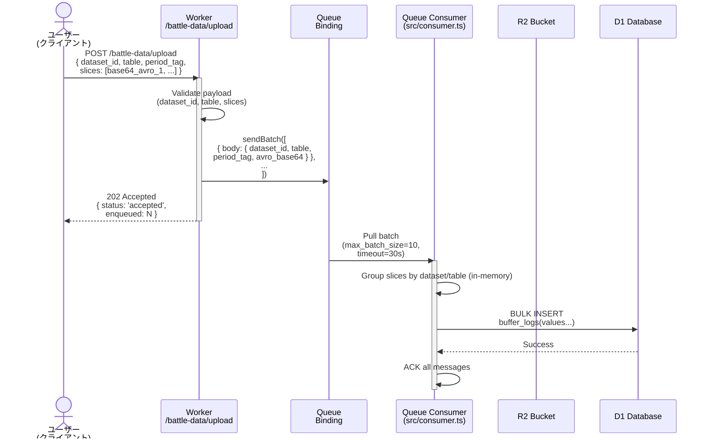
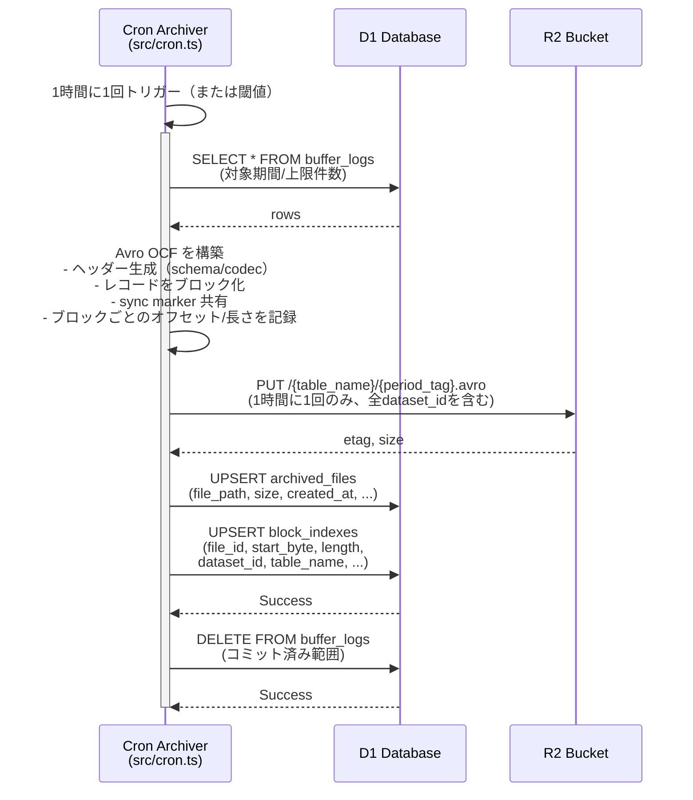
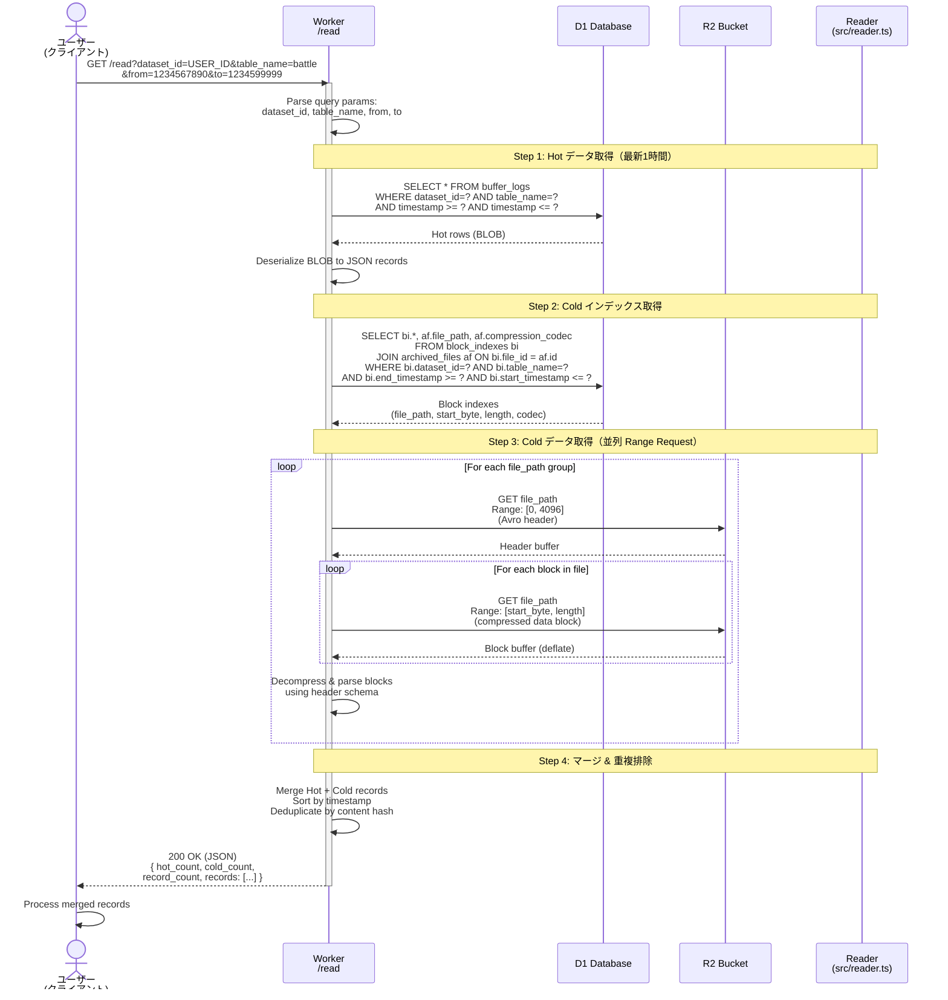
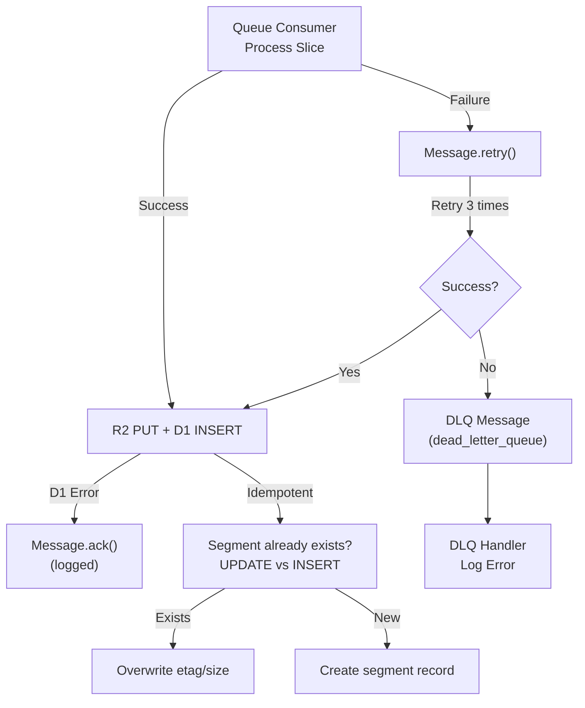

# FUSOU AVRO Hot/Cold Architecture Flow

## 概要
Cloudflare Workers 上で動作する、**ユーザーのAvroファイルアップロード＆セグメント管理＆取得**フローの詳細説明。

---

## 1. 全体アーキテクチャ図

```mermaid
graph TB
        subgraph Ingest
            User["👤 ユーザー<br/>(クライアント)"]
            Upload["🌐 POST /battle-data/upload<br/>(base64 Avro slices)"]
            Queue["📬 Cloudflare Queue<br/>(dev-kc-compaction-queue)"]
            Consumer["⚙️ Queue Consumer<br/>(src/consumer.ts)"]
        end

        subgraph Storage
            D1["🗄️ D1 Database<br/>(dev_kc_battle_index)"]
            R2["☁️ R2 Bucket<br/>(dev-kc-battle-data)"]
        end

        subgraph Batch
            Cron["⏰ Cron Archiver<br/>(src/cron.ts)"]
        end

        subgraph Read
            Read["🌐 GET /read<br/>(?dataset_id=...&table_name=...&period_tag=...)"]
            Reader["📖 Reader<br/>(src/reader.ts)"]
            Avro["📄 Avro OCF<br/>(ストリーミング)"]
        end

        User -->|1. アップロード| Upload
        Upload -->|2. enqueue| Queue
        Queue -->|3. consume| Consumer
        Consumer -->|4. INSERT<br/>buffer_logs| D1

        Cron -->|5. SELECT<br/>buffer_logs 全件| D1
        Cron -->|6. 1時間に1回のみ PUT| R2
        Cron -->|7. UPSERT<br/>block_indexes / archived_files| D1
        Cron -->|8. DELETE<br/>buffer_logs| D1

        User -->|9. 取得リクエスト| Read
        Read -->|10. lookup| D1
        D1 -->|11. block_indexes| Reader
        Reader -->|12. Range GET| R2
        Reader -->|13. ヘッダー+ブロックをストリーム| Avro
        Avro -->|14. Avro OCF| User
```

---

## 2. ユーザーアップロードフロー（詳細／D1バッファ）



**Key Points:**
- `slices` はbase64エンコード済みデータ。Consumerは復号→バリデーション→そのままD1に保存
- Queue Consumer は同一データセット/テーブルでバッチ化し、`buffer_logs` に一括INSERT
- 禁止: この段階でR2へは一切アクセスしない（コスト最適化）
- 以降のアーカイブ処理はCronに完全移譲

---

## 3. アーカイブ／コンパクションフロー（Cron / 低頻度）



**Key Points:**
- R2 への書き込みは Cron のみ、1時間に1回（または閾値）
- Avro OCFは`deflate`圧縮（コスト最適化）。ヘッダの`avro.codec`は`deflate`。
- `block_indexes` は Reader のアドレス帳：R2 の Range 取得に使用（`start_byte`はヘッダ長）。
- コミット済みデータは `buffer_logs` から削除し、ホット領域を縮小

---

## 4. ユーザーデータ取得フロー（Hot/Cold ハイブリッド）



**Key Points:**
- **Hot データ優先**: `buffer_logs` から最新データを取得（アーカイブ前の1時間以内）
- **Cold データ並列取得**: `block_indexes` でメタデータ検索 → R2 Range Request で該当ブロックのみ取得
- **圧縮認識**: `archived_files.compression_codec` (deflate/null) を参照して自動デコード
- **マージ & 重複排除**: Hot + Cold を timestamp でソート、content hash で重複排除
- **キャッシュ戦略**: Cold データは immutable (max-age=3600)、Hot のみは短時間 (max-age=60)
- **フィルタリング**: `from`/`to` timestamp 範囲でインデックスベース高速絞り込み
- **format=ocf オプション**: JSON ではなく Avro OCF ストリーム (header + blocks) で返却可能

---

## 5. ヘッダー長の検出アルゴリズム（Sync Marker ベース）

- 入力: R2 オブジェクトの先頭プレフィックス（初期 4KB）
- 手順:
    - `Obj\x01` マジック確認（Avro OCF）
    - メタデータのMapをAvroの可変長エンコード規則でデコード
    - Mapの直後に現れる16バイトを「sync marker」として特定
    - ヘッダー長 = sync marker 終端までのバイト長
    - プレフィックスが足りずに解析できなければ、長さを2倍に拡張して再試行（上限 64KB）
- 出力: `headerLen`（後続のRange取得で `[headerLen, ...]` として本体のみ連結）

---

## 6. D1 スキーマ（Buffer パターン）

### buffer_logs（ホット領域／一時保存）
```sql
CREATE TABLE buffer_logs (
    id INTEGER PRIMARY KEY AUTOINCREMENT,
    dataset_id TEXT NOT NULL,
    table_name TEXT NOT NULL,
    period_tag TEXT DEFAULT 'latest',
    payload BLOB NOT NULL,               -- Avro OCF のブロック／NDJSON 等
    content_hash TEXT,                   -- 任意：重複排除用
    received_at INTEGER NOT NULL         -- 受信時刻（ms）
);

CREATE INDEX IF NOT EXISTS idx_buffer_logs_time
    ON buffer_logs(received_at DESC);
CREATE INDEX IF NOT EXISTS idx_buffer_logs_key
    ON buffer_logs(dataset_id, table_name, period_tag);
```

### archived_files（R2 に保存したアーカイブの台帳）
```sql
CREATE TABLE archived_files (
    file_path TEXT PRIMARY KEY,          -- 例: battle/20251223_18.avro
    created_at INTEGER NOT NULL,
    total_bytes INTEGER,
    total_records INTEGER,
    codec TEXT,                          -- 例: 'deflate'
    schema_hash TEXT                     -- 任意：スキーマ整合性の検査用
);
```

### block_indexes（Range 取得用アドレス帳）
```sql
CREATE TABLE block_indexes (
    id INTEGER PRIMARY KEY AUTOINCREMENT,
    file_path TEXT NOT NULL,             -- R2 上の Avro ファイル
    byte_offset INTEGER NOT NULL,        -- ブロック先頭の R2 オフセット
    byte_length INTEGER NOT NULL,        -- 圧縮ブロック長
    record_count INTEGER,                -- オプション：見積もり
    dataset_id TEXT,
    table_name TEXT,
    period_tag TEXT,
    created_at INTEGER NOT NULL,
    FOREIGN KEY(file_path) REFERENCES archived_files(file_path)
);

CREATE INDEX IF NOT EXISTS idx_block_indexes_lookup
    ON block_indexes(dataset_id, table_name, period_tag, created_at);
```

---

## 7. タイムライン例：ユーザーの1日のフロー

```mermaid
timeline
    title ユーザーの1日のデータフロー例
    
        08:00 : User uploads Avro slice 1 (5MB)
            : POST /battle-data/upload → Queue → Consumer
            : D1: buffer_logs に INSERT（5MB）

        10:00 : User uploads Avro slice 2 (8MB)
            : D1: buffer_logs に追記（合計 13MB）

        14:00 : User uploads Avro slice 3 (520MB)
            : D1: buffer_logs に追記（合計 533MB）

        18:00 : Cron 起動（1時間に1回）
            : D1: buffer_logs 全件 SELECT
            : Avro OCF を構築（ヘッダー + ブロック）
            : R2: PUT battle/20251223_18.avro（Class A 1 回）
            : D1: block_indexes / archived_files を更新
            : D1: buffer_logs を DELETE（コミット済み範囲）

        18:05 : User requests: GET /read?dataset_id=...&table_name=battle
            : Reader Step 1: D1 buffer_logs から Hot データ取得
            : Reader Step 2: D1 block_indexes から Cold インデックス検索
            : Reader Step 3: R2 Range GET で Cold ブロック取得（並列）
            : Reader Step 4: Hot + Cold をマージ & 重複排除
            : JSON でマージ結果を返却
```

---

## 8. エラーハンドリング・リカバリ



**Strategy:**
- Queue の `max_retries=3`：失敗時は最大3回再試行
- DLQ（`dev-kc-compaction-dlq`）：最終失敗メッセージはログして保存
- D1 挿入失敗時も、R2 PUT は成功している可能性 → Segment 重複登録の防止に `ON CONFLICT UPDATE` 等を検討可能

---

## 9. パフォーマンス・制約

| 項目 | 値 | 説明 |
|------|-----|------|
| Queue batch size | 10 | max_batch_size |
| Queue timeout | 30s | max_batch_timeout |
| R2 PUT frequency | 1/h | Cron のみ（Class A を最小化） |
| Max segment size | - | セグメント化はCron側の内部実装（任意） |
| Max header parse | 64KB | Avro header探索上限 |
| R2 Range request | Range: [offset, length] | バイト単位のセグメント本体取得 |
| Cache TTL (read) | 300s | public, max-age=300 |
| D1 Indexes | dataset_id, table, period_tag | 高速フィルタリング用 |

---

## 10. 実装ファイル対応表

| フロー段階 | 実装ファイル | 関連関数 |
|-----------|----------|--------|
| 1. Upload endpoint | src/index.ts | POST /battle-data/upload |
| 2. Queue consumer | src/consumer.ts | バルク INSERT to buffer_logs |
| 3. Archiver (Cron) | src/cron.ts | D1→Avro構築→R2 PUT→D1更新 |
| 4. Read endpoint | src/index.ts | GET /read (Hot/Cold ハイブリッド) |
| 5. Reader core | src/reader.ts | fetchHotData() + fetchColdIndexes() + fetchColdData() + merge |
| 6. Header/Block parse | src/avro-manual.ts | getAvroHeaderLengthFromPrefix(), parseDeflateAvroBlock() |
| 7. D1 schema | docs/sql/d1/ | buffer_logs, block_indexes, archived_files |
| 8. Avro utilities | src/utils/avro.ts | generateHeader(), generateBlock(), generateSyncMarker() |

---

## 11. デプロイ・運用チェックリスト

- [ ] `wrangler.toml` に Queue バインディング確認（`dev-kc-compaction-queue`）
- [ ] D1 リモートへ schema 適用：`npm run schema:remote`
- [ ] R2 バケット permissions 確認（読み書き可）
- [ ] 環境変数 `COMPACTION_QUEUE` binding 確認
- [ ] ローカルテスト通過：`node test/test-hot-cold.mjs`
- [ ] デプロイ前ビルド：`npx tsc --outDir dist && npm run deploy`
- [ ] デプロイ後：Queue tail 監視 `npx wrangler tail`
- [ ] R2 test object 確認：`npx wrangler r2 object list dev-kc-battle-data --limit 10`
- [ ] テストアップロード：`curl -X POST https://worker.dev/battle-data/upload ...`
- [ ] テスト取得：`curl https://worker.dev/read?table=battle&dataset_id=test`

---

## 12. コンポーネントの責務

- src/consumer.ts: バッファ担当
    - 役割: キューからのバッチ受信、ペイロード検証、D1 `buffer_logs` への一括 INSERT のみ
    - 禁止: R2 へのアクセス、`block_indexes`/`archived_files` 更新、削除系操作
    - 効果: 高頻度でも低コスト（D1 書き込みのみ）。スループット最大化

- src/cron.ts: アーカイブ/コンパクション担当（Cron）
    - 役割: 定期的に `buffer_logs` を読み出し、Avro OCF を構築して R2 に PUT（1/h）
    - 付随: `archived_files`/`block_indexes` を UPSERT、コミット済み `buffer_logs` を DELETE
    - ポリシー: スキーマ整合性、sync marker 共有、圧縮（deflate）等

- src/reader.ts: ハイブリッド読取担当
    - 役割: Hot = D1 `buffer_logs`、Cold = D1 `block_indexes` → R2 Range 取得
    - 付随: Avro ヘッダー長を sync marker で特定、ブロックのデシリアライズ、マージ

- src/index.ts: HTTPエントリポイント
    - 役割: `/battle-data/upload` と `/read` のルーティング/入出力

--

## まとめ

1. **ユーザーアップロード** → `/battle-data/upload`（base64 slices） → Queue
2. **Queue Consumer** → D1 `buffer_logs` へ一括 INSERT（R2 書き込みゼロ）
3. **Cron Archiver** → 1時間に1回、Avro構築→R2 PUT→`block_indexes`更新→`buffer_logs`削除
4. **ユーザー取得** → `/read` で D1 `buffer_logs` + `block_indexes` を参照、R2 は Range GET のみ
5. **スケーラビリティ/コスト** → R2 Class A を Cron のみへ集約、Range で効率読取、D1 インデックスで高速フィルタ
