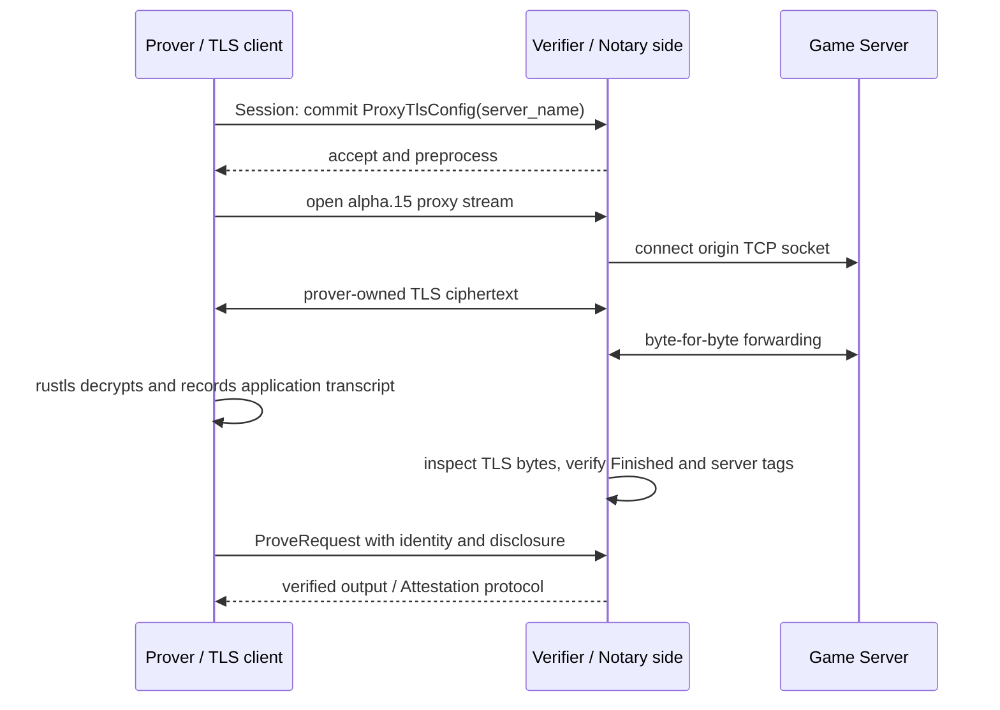

# TLSNotary alpha.15 Prover Architecture for FUSOU v1

Status: architecture feasibility recorded; no prover integration or evidence
acquisition authorized. `P0-05 = BLOCKED`; `IMPLEMENTATION = NO-GO`.

## Decision

FUSOU must place the alpha.15 prover at the endpoint that owns the TLS client
connection used for the authenticated `require_info` exchange. The current
FUSOU-PROXY MITM connection is not that endpoint: it terminates the Game
Client's TLS session, exposes plaintext to Hyper, and creates a separate
origin TLS session with `hyper-rustls`.

The preferred production shape is therefore:

```text
Game Client / FUSOU-App application path
  -> TLSNotary alpha.15 Prover-owned TLS client
  -> encrypted proxy stream over the Session channel
  -> TLSNotary alpha.15 Verifier
  -> verifier-owned TCP connection to the allowlisted Game Server
```

The current MITM path may remain as an ordinary proxy or capture path, but it
must not be presented as the source of an authenticated alpha.15 Presentation.
A prover placed inside the existing proxy can create a cryptographically
authenticated Presentation for a new proxy-origin TLS session, but that
Presentation does not prove that the original Game Client generated the
authenticated request.

## Goals and non-goals

This decision answers whether the frozen alpha.15 prover protocol can be
adapted to the FUSOU proxy environment and what it would prove. It does not
implement the prover, alter FUSOU-PROXY, obtain Game Server traffic, create a
Presentation, or change any Phase 0 gate.

The target remains the frozen contract in
[`tlsn-p0-05-fusou-require-info-evidence-contract-v1.md`](tlsn-p0-05-fusou-require-info-evidence-contract-v1.md):
one complete authenticated request and response from the same Presentation,
including the exact binding header and `require_info` member-ID response.

## Source-backed alpha.15 topology

Alpha.15 proxy mode is not a passive capture API. The prover creates a
`ProxyTlsClient`, which owns the rustls client state, handshake, master-secret
logging, TLS transcript, and application transcript. The verifier opens the
actual origin socket and forwards raw bytes between that socket and the
prover's multiplexed proxy stream.



The relevant lifecycle is:

```text
Session::new
  -> new_prover
  -> commit(ProxyTlsConfig)
  -> Prover::connect(TlsClientConfig)
  -> Prover<Connected> + TlsConnection
  -> HTTP client uses TlsConnection
  -> finish / server-tag verification
  -> prove(ProveConfig)
  -> ProverOutput
  -> Attestation request and Notary signature
  -> Secrets + Attestation
  -> Presentation
```

The prover does not independently mint a final verifiable Presentation. A
Notary/verifier side must accept the proving request, construct and sign an
`Attestation`, and return it with the prover's corresponding secrets. The
Presentation is then built from that Attestation and those secrets by revealing
the authenticated server identity and complete sent/received transcript.

## FUSOU topology today

The current proxy path has two independent TLS sessions:

```text
Game Client
  -> client-facing TLS with FUSOU-generated MITM certificate
  -> hudsucker accepted plaintext stream
  -> CaptureIo / Hyper / LogHandler
  -> Hyper client and hyper-rustls origin TLS
  -> Game Server
```

`RawCaptureHook` wraps the plaintext stream after MITM TLS acceptance and
before Hyper parsing. `CaptureIo` records directional bytes at that boundary.
The origin leg is created by the `HttpsConnectorBuilder` in `serve_proxy`; no
TLSNotary prover, Session channel, `ProxyTlsConfig`, or alpha.15 transcript
finalization is connected to it. The two TLS sessions therefore have
different keys, handshakes, Finished records, and transcript identities.

The existing capture is valuable for exact-wire and natural-provenance work,
but it is not a substitute for the alpha.15 application transcript. A capture
manifest cannot provide the master-secret-derived commitments, authenticated
server identity proof, Notary signature, or Presentation Attestation ID.

## Feasibility by integration shape

| Shape | What alpha.15 would authenticate | P0-05 suitability |
| --- | --- | --- |
| Keep current MITM and capture plaintext | No alpha.15 session; only observed client-facing bytes | Not suitable for a Presentation |
| Add a prover after MITM and forward plaintext into a new TLSNotary client | The proxy-generated request and the Game Server response on the new origin TLS session | Produces `REAL_ALPHA15_VERIFICATION`, but not natural Game Client provenance or client-to-server binding |
| Move the prover into the FUSOU-App/client application path | The application bytes sent by the prover-owned TLS client to the Game Server and the corresponding server response | Required target, subject to client integration and origin compatibility |
| Run prover and verifier in one trusted proxy process | A locally assembled protocol result with no independent Notary boundary | Not acceptable as production TLSNotary evidence |

The second shape is technically possible, but it changes the claim. A proxy
could read the decrypted MITM bytes and write equivalent bytes to its own
`TlsConnection`; alpha.15 would authenticate what that prover sent to the
origin. It would not cryptographically establish that the bytes came from the
Game Client unchanged. The proxy could have altered, retried, reordered, or
generated them before the authenticated TLS session began. This fails the
natural-client and no-injection requirements in the frozen evidence contract.

## Required implementation boundaries

An implementation that aims at `REAL_FUSOU_AUTHENTICATED_EVIDENCE` must provide
all of the following.

1. **Prover endpoint.** The FUSOU application path that creates the
   `require_info` request must use the alpha.15 `TlsConnection` as its HTTP
   transport, or an equivalent client-owned integration. A passive MITM
   stream cannot supply the prover's TLS secrets.
2. **Verifier forwarding service.** The verifier must accept the Session
   channel, accept `ProxyTlsConfig`, resolve and connect the allowlisted origin,
   and run `Verifier::run(origin_socket.compat())`. The Session driver must be
   polled continuously for the entire exchange.
3. **Single TLS session.** The HTTP request and response consumed by the FUSOU
   adapter must be the application transcript produced by that one
   prover-owned TLS client. The existing `hyper-rustls` origin connector must
   not silently remain on the proof path.
4. **Attestation service.** After `Verifier::verify().accept()`, the Notary
   must build a signed alpha.15 Attestation from the verified connection
   information, server ephemeral key, and transcript commitments. The prover
   must build the matching `AttestationRequest`, retain the returned Secrets,
   and later construct a Presentation.
5. **Complete disclosure.** The Presentation builder must reveal the server
   identity and every sent and received byte required by
   `fusou-require-info-v1`. The FUSOU adapter must continue to be the only
   component that extracts the Attestation ID and computes the final digests.
6. **FUSOU authority binding.** The authenticated binding header must be issued
   by the FUSOU Session/Challenge authority and matched server-side for owner,
   nonce, freshness, and single use. A prover or proxy merely copying a client
   header does not satisfy this boundary.
7. **Natural provenance evidence.** The exchange must be produced by the
   supported ordinary client path, with no standalone Game Server request,
   injection, replay, retry, or capture-generated traffic. This is separate
   evidence from the alpha.15 cryptographic proof.

## Compatibility gate

Alpha.15's `ProxyTlsClient` is deliberately narrower than the current
`hyper-rustls` client configuration. Its inspected implementation restricts
the prover-side connection to TLS 1.2, the `secp256r1` key-exchange group, and
the TLS 1.2 AES-128-GCM ECDHE RSA/ECDSA suites. Before implementation, the
allowlisted Game Server must be tested for compatibility with this exact
client profile. A server that negotiates only TLS 1.3 or an unsupported suite
cannot produce an alpha.15 proxy-mode proof without changing the frozen
upstream revision, which is outside this decision.

## Security interpretation

For a successful alpha.15 Presentation, the verifier can establish:

- the Notary signed the Attestation and its exact opaque 16-byte ID;
- the disclosed server identity passed the alpha.15 certificate proof;
- the disclosed sent and received bytes belong to the same authenticated TLS
  session and satisfy the transcript commitments;
- the disclosed bytes were exchanged with the authenticated server identity.

The Presentation alone does not establish:

- that an external Game Client originated the prover's application bytes;
- that a MITM proxy forwarded those bytes without modification;
- that the binding belongs to the current FUSOU Session/Challenge owner;
- privacy approval, retention, or runtime Result delivery.

Those claims require the separate FUSOU authority, natural-provenance, and
privacy/runtime evidence already listed in the frozen contract.

## Acceptance tests before any evidence attempt

The implementation must first pass local protocol tests without Game Server
traffic:

1. alpha.15 proxy-mode prover and verifier complete a fixture exchange over a
   controlled test server with the pinned commit;
2. the verifier records the same TLS transcript lengths and Finished/tag checks
   as the prover;
3. the Attestation request validates against the returned Attestation and the
   generated Presentation passes the frozen verifier;
4. the FUSOU adapter accepts only a complete `require_info` transcript from
   that Presentation and rejects modified bytes, ranges, identity, binding,
   and cross-context request/response substitutions;
5. TLS negotiation, connection closure, session-driver failure, origin
   resolution failure, and disclosure rejection fail closed without retrying
   the Game Server request.

These tests would establish integration feasibility only. They would not
change `P0-05` until a real natural FUSOU exchange and the required authority,
privacy, and runtime evidence are separately reviewed.

## Current disposition

The alpha.15 prover architecture is feasible in principle through
`ProxyTlsConfig`, but it is not wired into FUSOU-PROXY and cannot be obtained by
converting the current capture artifact into a Presentation. The smallest
credible production path is a prover-owned FUSOU application transport plus a
separate verifier/notary origin-forwarding service. Until that path exists and
the frozen evidence contract is satisfied, the correct status remains:

```text
P0-04 = PASS
P0-05 = BLOCKED
IMPLEMENTATION = NO-GO
```

## Source inspection anchors

Pinned upstream source inspected at commit
`47aee45b53e06648c1b2ad3689b367b8c923fdec`:

- `crates/tlsn/src/prover.rs`: prover commit, proxy connect, finish, and prove
  lifecycle;
- `crates/tlsn/src/verifier.rs`: verifier proxy forwarding, transcript
  finalization, tag/Finished checks, and disclosure verification;
- `crates/tlsn/src/prover/client/proxy/mod.rs`: prover-owned rustls client and
  alpha.15 cipher/profile limits;
- `crates/tlsn/src/proxy/prover.rs` and `crates/tlsn/src/proxy/verifier.rs`:
  proxy transcript and key finalization;
- `crates/examples/proxy/proxy.rs`: end-to-end proxy-mode topology;
- `crates/examples/attestation/prove.rs` and `present.rs`: Attestation and
  Presentation construction.

FUSOU source inspected:

- `packages/FUSOU-PROXY/proxy-https/src/proxy_server_https.rs`;
- `packages/FUSOU-PROXY/proxy-https/src/capture_io.rs`;
- `packages/FUSOU-PROXY/proxy-https/src/capture.rs`;
- `packages/FUSOU-PROXY/proxy-https/Cargo.toml`.