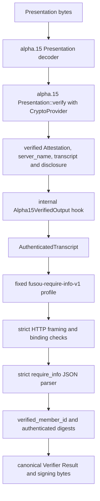

# P0-05 alpha.15 adapter boundary

Status: `IMPLEMENTATION = NO-GO`, `P0-05 = BLOCKED`.

This document records the repository boundary between the selected TLSNotary
alpha.15 verifier and the FUSOU verifier foundation. The alpha.15 backend is
now linked and verified against a legitimate upstream fixture. This document
does not claim that the upstream fixture is FUSOU authenticated `require_info`
evidence. Backend details and fixture goldens are recorded in
[the alpha.15 backend evidence](tlsn-p0-05-alpha15-backend-v1.md).

## Frozen upstream input

The selected revision is:

```text
repository: https://github.com/tlsnotary/tlsn.git
tag: refs/tags/v0.1.0-alpha.15
commit: 47aee45b53e06648c1b2ad3689b367b8c923fdec
packages: tlsn, tlsn-attestation, tlsn-core, all 0.1.0-alpha.15
```

The frozen alpha.15 verification expression is:

```rust
presentation.verify(&CryptoProvider::default())?
    .attestation.header.id.0
```

The input is an alpha.15 `tlsn_attestation::Presentation`, transported by the
upstream fixture/example as bincode. The verified Attestation ID is the exact
opaque 16-byte `Uid.0`. The Notary signature covers the canonical BCS Header,
not the ID alone. `ConnectionInfo.time` is connection-start metadata and is not
Notary issuance time; it is excluded from FUSOU v1 authority fields.

The selected `tlsn-attestation` and `tlsn-core` dependencies are linked in
`packages/FUSOU-TLSN-VERIFIER/Cargo.toml` at this exact revision. The top-level
`tlsn` prover/runtime crate is intentionally not linked because this adapter
only verifies serialized `Presentation` values. The checked-in upstream
fixture is not a FUSOU `require_info` fixture. No newer alpha.16-pre API is
selected. No Game Server, external service, historical replay, or new capture
was used for this boundary.

## Authenticated data flow



The only object allowed to cross the alpha.15 boundary is the output of a
successful `Presentation::verify` call, mapped into the internal
`Alpha15VerifiedOutput` representation. The mapping must carry the authenticated
server identity, exact 16-byte Attestation ID, sent/received transcript bytes,
full transcript digests, and alpha.15-authenticated disclosure ranges. Caller
provided transcript bytes, ranges, server names, or Attestation IDs are not an
accepted substitute.

## Adapter API and bypass resistance

The boundary is implemented in
[tlsn_alpha15.rs](../../../packages/FUSOU-TLSN-VERIFIER/src/tlsn_alpha15.rs).

Untrusted input:

```rust
verify_alpha15_presentation(presentation_bytes)
```

The current function strictly decodes the frozen bincode representation,
rejects trailing bytes, calls `Presentation::verify(&CryptoProvider::default())`,
requires complete disclosure, maps authenticated ranges and exact bytes, and
returns a sealed `AuthenticatedTranscript`. Decode, verification, incomplete
disclosure, and trailing-byte failures are rejected.

Trusted internal hook:

```rust
AuthenticatedTranscript::from_verified_alpha15(Alpha15VerifiedOutput)
```

This constructor is private. `Alpha15VerifiedOutput` is `pub(crate)` with no
public field construction outside this crate. The constructor validates the
verified-output digest, range bounds, revealed bytes, canonical server-name
grammar, and full coverage required by the current strict parser. Therefore a
caller cannot construct the semantic equivalent of an authenticated transcript
from arbitrary public bytes.

`AuthenticatedTranscript` exposes only authenticated metadata and the
`verify_require_info` operation. It does not expose a public raw-byte constructor
or a public replacement for the verified-output hook.

The unit tests that exercise the internal hook are explicitly plumbing tests;
they use `MOCK_TLSN_VERIFICATION` semantics in the test module and are not
TLSNotary evidence.

## FUSOU disclosure profile

The fixed profile ID is `fusou-require-info-v1`. The adapter requires:

1. one authenticated sent transcript and one authenticated received transcript
   from the same verified alpha.15 output;
2. complete range coverage of every byte consumed by the current strict parser;
3. request `POST /kcsapi/api_get_member/require_info HTTP/1.1`;
4. exactly one authenticated `Host` matching the authenticated server identity;
5. exactly one authenticated `X-FUSOU-Attestation-Binding` header;
6. the existing strict HTTP framing, gzip, `svdata=`, JSON, and member-ID rules;
7. response digest and revealed bytes matching the authenticated transcript.

The current offline parser consumes exact contiguous request/response wire bytes.
It therefore rejects partial disclosure rather than silently filling gaps from
caller input. A future privacy-reviewed partial-request profile would require a
separate parser design and protocol review; it is not introduced here.

## Negative verification matrix

| Mutation or failure | Offline/parser or adapter result | Real alpha.15 evidence |
| --- | --- | --- |
| malformed, truncated, duplicate, unknown, or non-canonical HTTP/JSON input | `PASS`: existing strict parser tests reject it | `BLOCKED`: upstream fixture is not FUSOU `require_info` |
| trailing HTTP, chunked, or gzip bytes | `PASS`: existing strict parser tests reject it | `BLOCKED`: upstream fixture is not FUSOU `require_info` |
| modified transcript bytes or digest | `PASS`: sealed adapter tests reject it | `PASS`: modified Presentation fails alpha.15 verification; FUSOU fixture still absent |
| modified, overlapping, out-of-order, or partial ranges | `PASS`: range and full-coverage tests reject it | `PASS`: complete upstream ranges map successfully; FUSOU profile coverage remains unproven |
| wrong Host/server identity | `PASS`: parser and adapter profile tests reject it | `PASS`: authenticated upstream `server_name` is mapped; production allowlist remains unavailable |
| wrong target or binding header cardinality/framing | `PASS`: strict request tests reject it | `BLOCKED`: upstream fixture has no FUSOU binding/request contract |
| wrong binding Session/nonce against server-side Session/Challenge | `BLOCKED`: runtime authority registry is not linked | `BLOCKED`: no authenticated FUSOU binding evidence |
| wrong profile ID | `PASS`: profile ID is fixed and not caller-selectable | `BLOCKED`: no runtime profile registry |
| request/response from different verified contexts | `BLOCKED`: no FUSOU Presentation context exists to exercise | `BLOCKED`: no authenticated paired FUSOU transcript |
| modified, truncated, invalid, or trailing Presentation | `PASS`: strict alpha.15 backend tests reject it | `PASS`: upstream fixture verification path is exercised |
| modified Notary signature or transcript commitment | `PASS`: `Presentation::verify` rejects modified authenticated bytes | `BLOCKED`: no FUSOU Presentation fixture |

## Identity and binding sources

`server_identity` comes from the verified alpha.15 output and is compared with a
trusted allowlist profile. It is never accepted from a caller-supplied metadata
field or from the raw capture manifest. The HTTP `Host` is checked against that
same authenticated identity. The production allowlist registry is not linked
in this offline crate, so production profile construction currently fails
closed; the test-only mock profile is not an authority source.

Session ID and binding nonce come from the exact authenticated binding header in
the request. The adapter parses the canonical binding value and keeps the
request and response in one `AuthenticatedTranscript`. Comparison with the
server-side Attestation Session/Challenge owner remains a later FUSOU-WEB
authority check; client-provided Session IDs or nonces are not accepted.

## Digest and Result relationship

The alpha.15 verification layer authenticates the upstream Attestation, Notary
signature, server identity proof, transcript commitment, and disclosure.
The FUSOU adapter then verifies the full transcript SHA-256, range metadata, and
revealed bytes before running the HTTP/JSON parser. The parser returns the raw
decimal `api_member_id` lexeme without numeric conversion.

The adapter's `AuthenticatedRequireInfo::into_verifier_result` method then
canonicalizes profile, server, binding, transcript digest, range, and
Attestation metadata through the existing `VerifierResult` machinery into JSON
and `VerifierResultSignBytes`. Profile hash, key IDs, and the final signature
come from the separate trusted FUSOU registry/signer boundary. TLSNotary
authentication and the later FUSOU Ed25519
Verifier Result signature are separate trust boundaries. This task does not add
production signing keys, key registries, or signature verification.

## Fixture classification

The existing `require-info-response.http` fixture remains:

```text
OFFLINE_PARSER_FIXTURE
```

It is not an alpha.15 Presentation and not authenticated evidence. The checked-
in upstream `tlsn-alpha15-upstream-presentation.bin` is classified as:

```text
REAL_ALPHA15_VERIFICATION
```

It is not FUSOU authenticated evidence because it is an upstream `GET /`
exchange without the FUSOU binding header or `require_info` member-ID payload.
The adapter tests that use deterministic internal plumbing are classified as:

```text
MOCK_TLSN_VERIFICATION
```

No real authenticated FUSOU Presentation or authenticated FUSOU disclosure
fixture exists in the repository.

## P0-05 sub-gates

| Requirement | Status | Evidence or blocker |
| --- | --- | --- |
| alpha.15 profile fixed | `PASS` | Frozen adoption profile and commit above |
| offline strict parser | `PASS` | Existing crate tests |
| RangeSet/range validation | `PASS` | Existing and adapter tests |
| canonical digest handling | `PASS` | Digest and revealed-byte tests |
| alpha.15 Presentation verification | `PASS` | Pinned backend verifies the 5394-byte upstream fixture; see [backend evidence](tlsn-p0-05-alpha15-backend-v1.md) |
| Notary signature verification | `PASS` (upstream fixture only) | Performed by `Presentation::verify`; no FUSOU fixture |
| authenticated transcript commitment | `PASS` (upstream fixture only) | Performed by `Presentation::verify`; no FUSOU fixture |
| FUSOU authenticated disclosure | `BLOCKED` | Requires an authenticated FUSOU Presentation |
| binding verification against Session/Challenge | `BLOCKED` | Runtime authority path is not implemented |
| real FUSOU evidence fixture | `BLOCKED` | No authenticated fixture exists |
| runtime verifier evidence | `BLOCKED` | Dedicated Verifier/runtime is not implemented |

P0-04 remains `PASS` for the previously reviewed natural exact-wire evidence.
The alpha.15 backend sub-gate is now verified, but P0-05 remains `BLOCKED` and
implementation remains `NO-GO` because no authenticated FUSOU `require_info`
Presentation, production authority registry, privacy review, or runtime Result
evidence exists. Upstream fixture, offline parser, or mock adapter success must
not be promoted to FUSOU authenticated TLSNotary evidence.