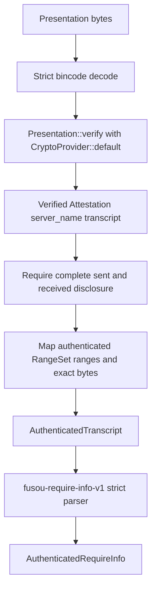

# P0-05 alpha.15 backend linkage

Status: the frozen alpha.15 verifier backend is linked and verified against a
legitimate upstream fixture. `P0-05 = BLOCKED`; `IMPLEMENTATION = NO-GO`.

This document records the implementation evidence for the cryptographic
backend. It does not claim that the upstream fixture is FUSOU authenticated
`require_info` evidence.

## Frozen dependency boundary

```text
repository: https://github.com/tlsnotary/tlsn.git
tag: refs/tags/v0.1.0-alpha.15
commit: 47aee45b53e06648c1b2ad3689b367b8c923fdec
```

The crate directly links `tlsn-attestation` and `tlsn-core` at the selected
commit. It intentionally does not link the top-level `tlsn` prover/runtime
crate: the adapter receives serialized `tlsn_attestation::Presentation` bytes
and only needs the frozen attestation verification API.

The serialized transport is the upstream alpha.15 bincode representation. The
adapter uses a `Cursor` with `bincode::deserialize_from` and requires the
decoder to consume all input, so an otherwise valid Presentation followed by
attacker-controlled bytes is rejected.

## Verified path



`Presentation::verify` is the upstream authority for the Attestation, Notary
signature, server identity proof, and transcript commitment checks. Only after
that call succeeds does the adapter:

1. extract the authenticated `server_name`;
2. require `PartialTranscript::is_complete()`;
3. read `sent_unsafe()` and `received_unsafe()`;
4. map `sent_authed()` and `received_authed()` ranges to exact bytes;
5. compute FUSOU SHA-256 values over the exact authenticated transcript bytes;
6. validate full range coverage and construct the sealed `AuthenticatedTranscript`.

The FUSOU digest is intentionally separate from the upstream transcript
commitment. The adapter does not accept caller-supplied transcript bytes,
ranges, server identity, or Attestation ID.

## Fixture evidence

Fixture:

```text
path: packages/FUSOU-TLSN-VERIFIER/fixtures/tlsn-alpha15-upstream-presentation.bin
bytes: 5394
sha256: cb9b3befb43df5157a4d5ac52080ba19d842f191fa346bfda1dfc4927b37e5b6
classification: REAL_ALPHA15_VERIFICATION
```

The focused test fixes the following verified output goldens:

```text
attestation_id: effe1a316b1c91b41f6284f78409c6c2
server_identity: tlsnotary.org
request_range: offset 0, length 35
response_range: offset 0, length 145
```

The fixture also proves that the exact request and response bytes survive the
alpha.15 verification-to-adapter mapping and that their FUSOU SHA-256 digests
are stable. The fixture is an upstream test exchange (`GET /`), not the FUSOU
`POST /kcsapi/api_get_member/require_info` contract. Its request has no FUSOU
binding header and its response is not the required `svdata=` member-ID
payload. The adapter therefore rejects it at the FUSOU strict parser boundary.

This distinction is deliberate:

```text
REAL_ALPHA15_VERIFICATION != REAL_FUSOU_AUTHENTICATED_EVIDENCE
```

No Game Server traffic, natural capture, historical replay, injection, or
capture access was used to produce or validate this fixture.

## Focused validation

The following checks passed:

```text
cargo check --manifest-path packages/FUSOU-TLSN-VERIFIER/Cargo.toml
cargo test --manifest-path packages/FUSOU-TLSN-VERIFIER/Cargo.toml
```

The test suite result was `22 passed; 0 failed`. It includes:

- real alpha.15 Presentation verification and output goldens;
- modified, truncated, invalid, and trailing Presentation rejection;
- incomplete or modified authenticated transcript/range rejection;
- strict FUSOU parser and canonical Result tests;
- production allowlist fail-closed behavior.

## Remaining P0-05 blockers

The backend linkage closes only the upstream cryptographic adapter sub-gate.
P0-05 remains blocked because the repository still lacks:

- a natural, privacy-reviewed FUSOU `require_info` Presentation;
- authenticated request/response bytes containing the exact FUSOU binding and
  member-ID response;
- a production server-identity allowlist and Session/Challenge authority;
- Dedicated Verifier runtime, FUSOU Result signing, and delivery evidence;
- privacy, retention, redaction, and no-resubmission runtime evidence.

The existing production allowlist constructor remains empty and fail-closed.
The upstream fixture and local mock plumbing must not be promoted to P0-05
PASS.