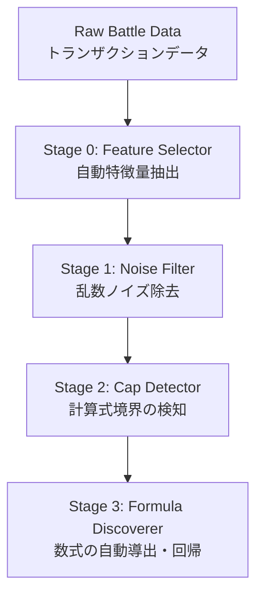

# FUSOU Game Mechanics Analysis Pipeline

このパッケージは、FUSOU-DATABASE から抽出した戦闘のログデータ（トランザクション）を解析し、乱数やノイズをフィルタリングしてゲーム内部で利用されている「ダメージ計算式」や「キャップ値」を自動導出するためのハイブリッド・データサイエンス・パイプラインです。

## パイプライン概要

本システムは以下の4つのステージから構成されています。



1. **Stage 0: Feature Selector**
   - 膨大な説明変数のリストの中から、Random Forest Importance を用いて **真に予測に寄与する上位K個の変数（火力、装甲、戦闘フェーズ等）** を自動抽出します。不要なノイズ変数を捨てることで過学習を防ぎます。
2. **Stage 1: Noise Filter**
   - 変数ごとにグルーピングし、ダメージ分布の `99% / 1%` パーセンタイル境界を抽出します。
3. **Stage 2: Cap Detector**
   - 抽出された最大ダメージライン（Y_max）に沿って勾配変化（Changepoint）を検知し、数式が切り替わる火力キャップ値などを検出します。
4. **Stage 3: Formula Discoverer**
   - 検出したセグメント（例：キャップ到達前 / 後）ごとにシンボリック回帰（PySR）または多項式多変数回帰を行い、計算式を出力します。

## インストール・準備

依存ライブラリをインストールします。このパイプラインはデータの自動抽出に `scikit-learn` を必要とします。

```bash
cd packages/fusou-datasets/analysis
pip install -r requirements.txt
```

> [!NOTE]
> 高度なシンボリック回帰（複雑な平方根やフラクタルを含む未知の数式の発見）を行いたい場合は、任意で Julia ランタイムと `PySR` をインストールしてください。未インストールの場合は自動で多変数線形回帰/多項式回帰にフォールバックします。

## 実データでの使い方（APIを利用）

FUSOU-DATABASEの実際の戦闘ログを用いて計算式を解析する場合、`GameMechanicsAnalyzer.from_fusou_data` を使用します。

### 1. 候補変数の自動抽出モード（推奨）

利用可能な全てのカラム候補を渡し、`auto_select_features=True` を指定することで、システムが勝手に予測に重要な変数を見つけて数式を構築します。

```python
from analysis import GameMechanicsAnalyzer

# 解析したい候補となるデータ列のリスト（ノイズが混ざっていても可）
candidate_features = [
    "attacker_karyoku", "attacker_raisou", "attacker_taiku", 
    "attacker_nowhp", "defender_soukou", "defender_nowhp",
    "at_eflag", "at_type"  # などのフラグやカテゴリ（文字列表現）変数も可能
]

# 実データから読み込み + 自動特徴量抽出 + 数式導出 を全て実行
analyzer, result = GameMechanicsAnalyzer.from_fusou_data(
    period_tag="latest",
    table_version="0.5",
    side="friend",               # "friend" or "enemy"
    hit_types=[1],               # 1=通常命中, 2=クリティカル を対象
    
    x_cols=candidate_features,   # 候補となる全X変数
    y_col="damage",              # 予測したいY変数
    
    auto_select_features=True,   # Stage 0 (Feature Selection) を有効化
    num_features=4               # 相関の強い上位4変数に絞り込む
)

# 解析結果のサマリー文を出力
print(analyzer.summary())

# 抽出された計算式と残差のグラフ・プロットを保存・表示
analyzer.plot_results(save_path="real_data_analysis.png")
```

### 2. 変数指定モード（手動分析）

対象とする変数がすでにわかっており、特定の変数間（例：火力と装甲の2変数のみ）での式変化を見たい場合は、`auto_select_features` をオフにします。
`x_cols` の **先頭の変数（リストの1番目）** が、CapDetector（キャップ検知エンジン）が監視する「主変数」として扱われます。

```python
from analysis.data_loader import load_shelling_data
from analysis import GameMechanicsAnalyzer

# Step A: データのロード（動的HPなどのパース含む）
df = load_shelling_data(side="friend", hit_types=[1])

# Step B: 解析クラスの初期化
analyzer = GameMechanicsAnalyzer(
    min_samples=5,           # グループあたりの最低データ数
    cap_penalty_scale=5.0,   # キャップ検知の感度閾値
    polyfit_max_degree=3     # フォールバック使用時の最大多項式次数
)

# Step C: 変数を直接指定して実行
# "attacker_karyoku" の閾値（キャップ値）をしきい値として検知する
result = analyzer.fit_and_discover(
    df,
    x_cols=["attacker_karyoku", "defender_soukou"],
    y_col="damage"
)

# プロット表示
analyzer.plot_results()
```

## 動的状態（Dynamic States）の扱いについて

`data_loader.py` 内部では、静的な開始時HPではなく、砲撃ごとの `f_now_hps` と `e_now_hps`（連撃や複数回攻撃中における瞬間ごとの状態遷移）をトランザクション単位でパースしています。

これにより、抽出機能を通して得られる `attacker_nowhp` および `defender_nowhp` は、**その攻撃行動が発生したまさにその瞬間のHP** となります。中破・大破ペナルティなど、状態遷移によって引き起こされるダメージ計算係数の変化を正確にモデリングできます。

## デモスクリプトの実行

実際に動作する合成データを用いたデモンストレーションは `examples/` ディレクトリ内に保存されています。

1. **基本の解析と可視化**
   単一変数と多変数（火力・装甲）を用いた分析のデモです。
   ```bash
   python examples/example_mechanics_analysis.py
   ```

2. **Feature Selector（自動変数選択）のテスト**
   あらかじめフェイクのダミー変数を16個混ぜたデータセットを生成し、システムが正しく「真のシグナル変数」である4つ（カテゴリ変数含む）だけを抽出して重回帰式を作れるかテストします。
   ```bash
   python examples/example_feature_selection.py
   ```
